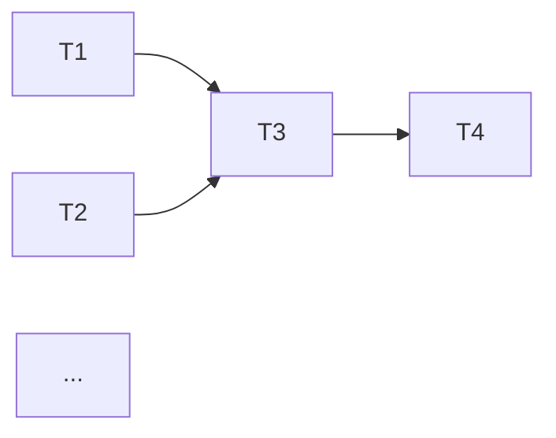

# Split Tickets

Break an Epic Brief + Tech Plan into actionable, dependency-ordered implementation tickets.

The output follows the Ticket template defined in `.cursor/rules/docs-format.mdc`. Read that rule before generating any document.

---

## Phase 1 — Intake

### Step 1.1 — Locate source documents

Search `docs/` for:
- `Epic_Brief_—_*.md` (not in `done/`)
- `Tech_Plan_—_*.md` (not in `done/`)

If multiple candidates exist, use `AskQuestion` to ask which pair to use. If only one pair exists, confirm with the user.

Read both documents thoroughly.

### Step 1.2 — Determine ticket numbering

Scan `docs/` and `docs/done/` for existing `T{n}_—_*.md` files. Find the highest `n` and start new tickets at `n+1`.

If no existing tickets are found, start at `T1`.

### Step 1.3 — Understand the scope

From the Epic Brief, extract:
- All in-scope features/workstreams
- Success criteria (each ticket should contribute toward at least one)
- Out-of-scope items (to guard against scope creep in tickets)

From the Tech Plan, extract:
- Component architecture (each major component or module is a candidate ticket boundary)
- Data model changes (schema work often becomes its own ticket)
- Key decisions and constraints (these inform ticket ordering)
- New files and responsibilities table

---

## Phase 2 — Proposed Breakdown (Refinement Round 1)

**Do NOT write any ticket files yet.**

Present a **Ticket Map** as a text message:

### Ticket List

A numbered table with columns:

| # | Title | Goal (1 line) | Complexity | Dependencies |
|---|-------|---------------|------------|--------------|
| T{n} | ... | ... | S/M/L | None or T{x}, T{y} |

### Dependency Graph

A mermaid graph showing the critical path:



### Splitting Rationale

Explain why you grouped things this way:
- What principle drove the boundaries (one concern per ticket? one screen per ticket? infrastructure before features?)
- Which tickets are parallelizable
- Where the critical path bottleneck is

### Sizing Guidance

- **S (Small)**: config, setup, single-file changes — half a day
- **M (Medium)**: one feature or module, touches 3-8 files — 1-2 days
- **L (Large)**: multi-component feature, new data model + UI + logic — 2-3 days
- If anything would be **XL** (>3 days), it should be split further

### Ask Questions

Use `AskQuestion` to validate the breakdown:

- "Is the granularity right? Tickets range from [smallest] to [largest]."
- "T{a} and T{b} are closely related — should I merge them?"
- "Any work missing that these tickets don't cover?"
- "Should T{x} be split further? It covers [list]."
- "Are the dependencies correct? T{a} before T{b} because [reason]."

---

## Phase 3 — Scope Validation (Refinement Round 2)

For each proposed ticket, present a **mini scope preview** — NOT the full ticket, just the skeleton:

```
T{n} — {Title}
  Goal: {1 sentence}
  Key scope: {3-5 bullet points}
  Acceptance criteria headlines: {2-4 items}
  Out of scope: {1-2 items}
```

Then flag potential issues:

### Boundary Ambiguities
- "Where exactly does T{a} end and T{b} begin? Specifically: [describe the grey area]"
- "Component X is set up in T{a} but first used in T{b} — should setup move to T{b}?"

### Acceptance Criteria Risks
- "This criterion is hard to verify automatically: [quote it]. Suggest rephrasing to: [alternative]"
- "This criterion depends on T{x} being done — make sure the dependency is explicit"

### Scope Creep Risks
- "T{n} doesn't list [thing] as out of scope, but it could easily grow to include it"
- "The Epic Brief's out-of-scope list mentions [X] — make sure no ticket accidentally pulls it in"

Use `AskQuestion` for any critical ambiguities that would change ticket boundaries or ordering.

---

## Phase 4 — Generate

### Step 4.1 — Write ticket files

Incorporate all feedback and write each ticket to:

```
docs/T{n}_—_{Title}.md
```

Each ticket must include:
- **Goal**: what this ticket delivers, in the context of the epic
- **Dependencies**: explicit list of prerequisite tickets (or "None")
- **Scope**: detailed sub-sections matching the Tech Plan's architecture. Include tables for dependencies/packages, config details, file-responsibility mappings where relevant
- **Out of Scope**: what this ticket explicitly does NOT do (reference the next ticket if work is deferred there)
- **Acceptance Criteria**: checkbox-style, each independently verifiable. Aim for 4-8 criteria per ticket
- **References**: links to the Epic Brief and Tech Plan, plus any relevant sections of the Tech Plan

### Step 4.2 — Cross-reference check

After writing all tickets, verify:
- Every in-scope item from the Epic Brief is covered by at least one ticket
- Every component/module from the Tech Plan's architecture is addressed
- No acceptance criterion references a ticket that doesn't exist
- Dependencies form a valid DAG (no cycles)

If anything is missing, add it or flag it to the user.

### Step 4.3 — Final summary

Print a summary table:

| Ticket | Title | Deps | Size | Status |
|--------|-------|------|------|--------|
| T{n} | ... | ... | S/M/L | Created |

Plus:
- Total tickets created
- Estimated critical path (which tickets are sequential bottlenecks)
- Suggested starting point: "Begin with T{n} — it has no dependencies and unblocks [list]"
- Any gaps or deferred decisions that should be resolved during implementation

---

## Edge Cases

- **No Epic Brief or Tech Plan found**: ask the user to create them first (suggest the relevant skills)
- **Epic Brief and Tech Plan are inconsistent**: flag the inconsistencies before splitting. Do not generate tickets from contradictory sources
- **Scope is very small** (1-2 tickets): that's fine — don't artificially inflate the count. A single well-scoped ticket is better than three tiny ones
- **Scope is very large** (>10 tickets): consider grouping into sub-epics or milestones, and flag this to the user
- **User wants to add tickets to an existing set**: scan existing tickets, determine numbering, and only generate the new ones
