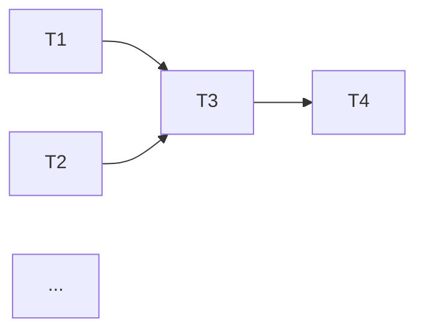

# Split Tickets

Break an Epic Brief + Tech Plan into actionable, dependency-ordered implementation tickets.

The output follows the Ticket template defined in `.cursor/rules/docs-format.mdc`. Read that rule before generating any document.

**Exception — achievement / badge ladders:** stop and use the `new-achievement-track` skill instead. Do not split those epics into T209/T210/T211-shaped tickets.

---

## Core principle: vertical slicing (tracer bullets)

Every ticket is a **thin vertical slice** that cuts through ALL relevant integration layers end-to-end (schema migration → edge function / data access → React Query hook → UI component → tests). It is NOT a horizontal slice of one layer (e.g. "all the schema changes" or "all the UI work").

Why: a vertical slice is **demoable on its own**. It surfaces unknown unknowns early because every layer gets exercised. A horizontal slice ships nothing until the last layer lands and hides integration risk until then.

Concrete examples in this repo's stack:

| Bad (horizontal) | Good (vertical) |
|---|---|
| T1: All Supabase migrations | T1: Migration + hook + minimal UI to **read** the new field for the workout-day card |
| T2: All React Query hooks | T2: Migration + hook + UI to **edit** the new field |
| T3: All UI screens | T3: Cross-device sync for the new field |

Prefer **many thin slices** over **few thick ones**. Aim for slices that can ship behind a feature flag if needed, even if you don't actually flag them.

---

## HITL vs AFK marking

Each ticket is tagged:

- **AFK** (Away-From-Keyboard) — an agent or a freshly-onboarded engineer can take this from the description alone and merge a PR without architectural decisions. Acceptance criteria are mechanical to verify.
- **HITL** (Human-In-The-Loop) — requires human input mid-flight: a design review, a UX choice between viable alternatives, a data decision that wasn't pinned down in the Tech Plan, a security/privacy judgement, or a Figma/asset that needs creating.

**Prefer AFK over HITL.** If a ticket would be HITL because of an unresolved decision, push that decision back into the Tech Plan or grilling phase **before** generating the ticket. The exception is genuine design work that can only happen with the artifact in hand (e.g. "review the empty state once we have the real data").

This matters because AFK tickets can be parallelized across agents or contributors; HITL tickets serialize on you.

---

## Phase 1 — Intake

### Step 1.1 — Locate source documents

Search `docs/` for:
- `Epic_Brief_—_*.md` (not in `done/`)
- `Tech_Plan_—_*.md` (not in `done/`)

If multiple candidates exist, use `AskQuestion` to ask which pair to use. If only one pair exists, confirm with the user.

Read both documents thoroughly.

### Step 1.2 — Determine ticket numbering

Scan `docs/` and `docs/done/` for existing `T{n}_—_*.md` files. Find the highest `n` and start new tickets at `n+1`.

If no existing tickets are found, start at `T1`.

### Step 1.3 — Understand the scope

From the Epic Brief, extract:
- All in-scope features/workstreams
- Success criteria (each ticket should contribute toward at least one)
- Out-of-scope items (to guard against scope creep in tickets)

From the Tech Plan, extract:
- Component architecture (each major component or module is a candidate ticket boundary)
- Data model changes (schema work often becomes its own ticket)
- Key decisions and constraints (these inform ticket ordering)
- New files and responsibilities table
- **i18n contract** — if the plan has one, tickets that add UI **copy those EN/FR values**. They do not invent new wording. If the epic clearly adds user-facing copy and the plan has no contract, stop and run `.cursor/skills/microcopy/SKILL.md` before writing tickets.

---

## Phase 2 — Proposed Breakdown (Refinement Round 1)

**Do NOT write any ticket files yet.**

Present a **Ticket Map** as a text message:

### Ticket List

A numbered table with columns:

| # | Title | Goal (1 line) | Slice (layers traversed) | Mode | Size | Dependencies |
|---|-------|---------------|--------------------------|------|------|--------------|
| T{n} | ... | ... | DB → API → hook → UI → tests | AFK | S/M/L | None or T{x}, T{y} |

The **Slice** column should be a brief layer breadcrumb showing the ticket cuts vertically. If a row reads as a single layer ("UI only", "schema only"), that's a horizontal slice — split or merge it.

The **Mode** column is `AFK` or `HITL` per the rules above.

### Dependency Graph

A mermaid graph showing the critical path:


```mermaid
graph LR
    T1 --> T3
    T2 --> T3
    T3 --> T4
    ...
```

### Splitting Rationale

Explain why you grouped things this way:
- Which user stories from the Epic Brief each ticket addresses (cite story numbers)
- How each ticket is a vertical slice (which layers it touches and what it ships end-to-end)
- Which tickets are AFK and parallelizable across agents
- Which tickets are HITL and why (what human input is required)
- Where the critical path bottleneck is

### Sizing Guidance

- **S (Small)**: config, setup, single-file changes — half a day
- **M (Medium)**: one feature or module, touches 3-8 files — 1-2 days
- **L (Large)**: multi-component feature, new data model + UI + logic — 2-3 days
- If anything would be **XL** (>3 days), it should be split further

### Ask Questions

Use `AskQuestion` to validate the breakdown:

- "Is the granularity right? Tickets range from [smallest] to [largest]."
- "T{a} and T{b} are closely related — should I merge them?"
- "Any work missing that these tickets don't cover?"
- "Should T{x} be split further? It covers [list]."
- "Are the dependencies correct? T{a} before T{b} because [reason]."

---

## Phase 3 — Scope Validation (Refinement Round 2)

For each proposed ticket, present a **mini scope preview** — NOT the full ticket, just the skeleton:

```
T{n} — {Title}
  Goal: {1 sentence}
  Key scope: {3-5 bullet points}
  Acceptance criteria headlines: {2-4 items}
  Out of scope: {1-2 items}
```

Then flag potential issues:

### Boundary Ambiguities
- "Where exactly does T{a} end and T{b} begin? Specifically: [describe the grey area]"
- "Component X is set up in T{a} but first used in T{b} — should setup move to T{b}?"

### Acceptance Criteria Risks
- "This criterion is hard to verify automatically: [quote it]. Suggest rephrasing to: [alternative]"
- "This criterion depends on T{x} being done — make sure the dependency is explicit"

### Scope Creep Risks
- "T{n} doesn't list [thing] as out of scope, but it could easily grow to include it"
- "The Epic Brief's out-of-scope list mentions [X] — make sure no ticket accidentally pulls it in"

### Vertical-Slice Sanity Check

For each ticket, verify it ships an end-to-end demoable sliver:

- "T{n} only touches the UI layer — what does the user see if the underlying data isn't there yet? Should we merge with T{m} (the schema/data ticket)?"
- "T{n} ships a migration but no read path — nothing demoable until T{m}. Either merge or accept the dependency explicitly."
- "T{n} has no test layer described — is it intentionally untested, or did we forget?"

### HITL Justification

For every HITL ticket, justify:

- "T{n} is HITL because [specific human input needed at runtime — e.g. design review, copy approval, security judgement]."
- If the justification is "we haven't decided yet" — **stop and push the decision back** into the Tech Plan or a grilling pass before generating tickets. Don't ship undecided work as HITL.

Use `AskQuestion` for any critical ambiguities that would change ticket boundaries, ordering, or HITL/AFK marking.

---

## Phase 4 — Generate

### Step 4.1 — Write ticket files

Incorporate all feedback and write each ticket to:

```
docs/T{n}_—_{Title}.md
```

Each ticket must include:
- **Goal**: what this ticket delivers, in the context of the epic. Cite the user story numbers from the Epic Brief that this ticket addresses.
- **Mode**: `AFK` or `HITL`, with one-line justification if HITL.
- **Slice**: layer breadcrumb showing the vertical traversal (e.g. `migration → edge function → useX hook → ExerciseCard → vitest + playwright`).
- **Dependencies**: explicit list of prerequisite tickets (or "None").
- **Scope**: detailed sub-sections matching the Tech Plan's architecture. Include tables for dependencies/packages, config details, file-responsibility mappings where relevant.
- **Out of Scope**: what this ticket explicitly does NOT do (reference the next ticket if work is deferred there).
- **Acceptance Criteria**: checkbox-style, each independently verifiable. Aim for 4-8 criteria per ticket. At least one criterion should describe a demoable end-to-end behavior, not just "the function exists". If the ticket ships UI, include "EN + FR keys match the Tech Plan i18n contract" as a criterion.
- **References**: links to the Epic Brief and Tech Plan, plus any relevant sections of the Tech Plan.

### Step 4.2 — Cross-reference check

After writing all tickets, verify:
- Every in-scope item from the Epic Brief is covered by at least one ticket
- Every component/module from the Tech Plan's architecture is addressed
- No acceptance criterion references a ticket that doesn't exist
- Dependencies form a valid DAG (no cycles)

If anything is missing, add it or flag it to the user.

### Step 4.3 — Final summary

Print a summary table:

| Ticket | Title | Mode | Deps | Size | Status |
|--------|-------|------|------|------|--------|
| T{n} | ... | AFK / HITL | ... | S/M/L | Created |

Plus:
- Total tickets created, with AFK / HITL split (e.g. "8 tickets: 6 AFK, 2 HITL")
- Estimated critical path (which tickets are sequential bottlenecks)
- Parallelization opportunities: list AFK tickets that share no dependencies and can be picked up simultaneously
- Suggested starting point: "Begin with T{n} — it has no dependencies, is AFK, and unblocks [list]"
- Recommended downstream skill: "When implementing each ticket, drive it with the **tdd** skill for behavior-first delivery."
- Any gaps or deferred decisions that should be resolved during implementation

---

## Edge Cases

- **No Epic Brief or Tech Plan found**: ask the user to create them first (suggest the relevant skills)
- **Epic Brief and Tech Plan are inconsistent**: flag the inconsistencies before splitting. Do not generate tickets from contradictory sources
- **Scope is very small** (1-2 tickets): that's fine — don't artificially inflate the count. A single well-scoped ticket is better than three tiny ones
- **Scope is very large** (>10 tickets): consider grouping into sub-epics or milestones, and flag this to the user
- **User wants to add tickets to an existing set**: scan existing tickets, determine numbering, and only generate the new ones
