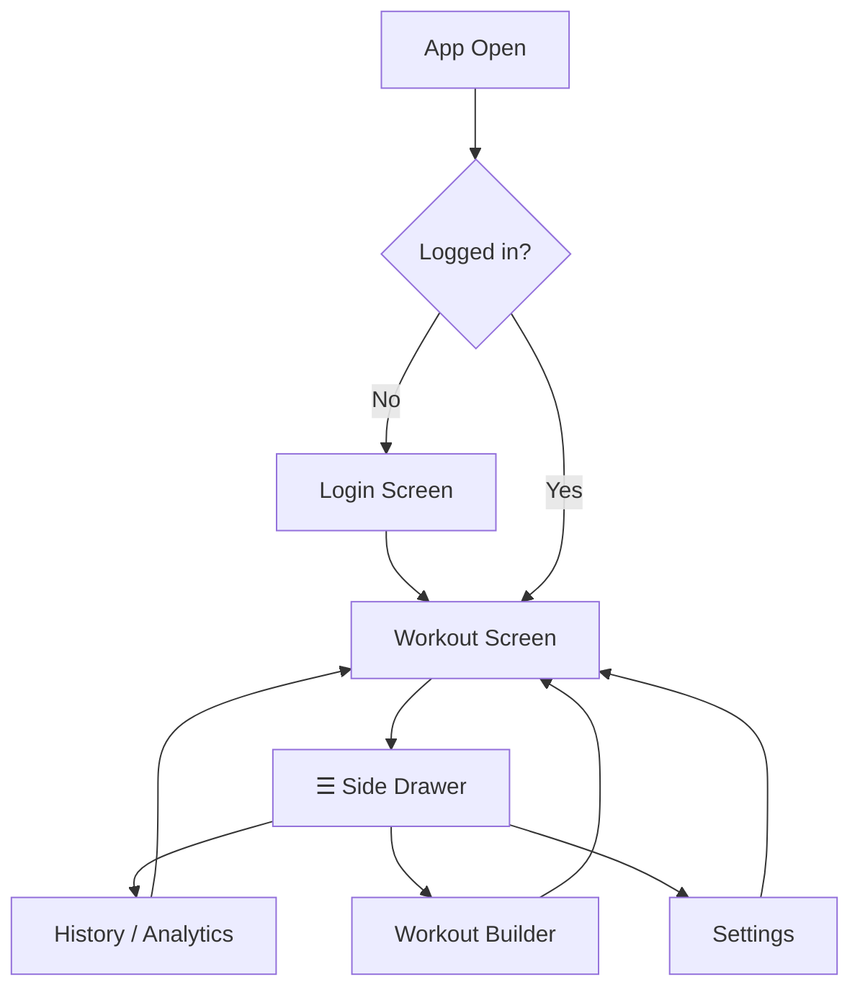

# Core Flows — Workout App v2

## Overview

This document defines all user-facing flows for Workout App v2. The app is a mobile-first PWA built for a single user (Pierre). Navigation is anchored by a hamburger side drawer. The workout session is always the primary surface.

---

## App Navigation Map



Navigation note: in installed PWA mode, system back from `/history` and `/builder` returns to `/`; system back from `/` shows an **Exit app?** confirmation.

---

## Flow 1 — First Open & Google OAuth Login

**Trigger:** User opens the app for the first time (or session has expired).

1. App loads to a **Login screen** — app logo, tagline, and a single "Sign in with Google" button.
2. User taps "Sign in with Google" → native Google OAuth sheet appears.
3. User selects their Google account and approves.
4. App receives auth token, creates/retrieves the user record, and navigates to the **Workout screen**.
5. Notification permission setup is required before timer features are fully enabled.
6. On subsequent opens within the session window, the app skips login and lands directly on the Workout screen.

**Exit:** Workout screen.

---

## Flow 2 — PWA Install Prompt

**Trigger:** First time the app is opened in a browser (before install).

1. A dismissible banner appears **below the top bar**, above the day selector: *"Add to home screen for the best experience"* + an **Install** button + an **✕** dismiss button.
2. If user taps **Install** → native browser install dialog appears → on confirmation, banner disappears permanently.
3. If user taps **✕** → banner is dismissed and never shown again (preference saved locally).
4. The banner does not appear if the app is already running as an installed PWA.
5. An **"Install app"** option also lives in Settings (drawer) as a fallback at any time.

**Exit:** Banner dismissed or install completed. Workout screen continues underneath.

```wireframe
<!DOCTYPE html>
<html>
<head>
<style>
  * { box-sizing: border-box; margin: 0; padding: 0; font-family: system-ui, sans-serif; }
  body { background: #0f0f13; color: #e8e8f0; max-width: 430px; margin: 0 auto; }
  .topbar { display: flex; align-items: center; justify-content: space-between; padding: 1rem; border-bottom: 1px solid #2a2a38; }
  .topbar-left { font-size: 1.4rem; color: #666; }
  .topbar-timer { font-size: 1.2rem; font-weight: 700; }
  .topbar-right { background: #1a1a24; border: 1px solid #2a2a38; border-radius: 20px; padding: 5px 12px; font-size: 0.8rem; color: #e8e8f0; }
  .install-banner { display: flex; align-items: center; justify-content: space-between; background: #1a1a24; border: 1px solid #00c9b1; border-radius: 10px; margin: 10px 1rem; padding: 10px 14px; gap: 10px; }
  .install-banner-text { font-size: 0.82rem; color: #e8e8f0; flex: 1; }
  .install-btn { background: #00c9b1; color: #000; border: none; border-radius: 8px; padding: 6px 14px; font-size: 0.82rem; font-weight: 700; white-space: nowrap; }
  .dismiss-btn { color: #666; font-size: 1.1rem; background: none; border: none; cursor: pointer; padding: 0 4px; }
  .day-sel { display: flex; gap: 8px; padding: 0.5rem 1rem; overflow-x: auto; }
  .day-pill { padding: 6px 16px; border-radius: 20px; border: 1px solid #2a2a38; background: #1a1a24; color: #666; font-size: 0.8rem; white-space: nowrap; }
  .day-pill.active { background: #00c9b1; border-color: #00c9b1; color: #000; font-weight: 700; }
  .placeholder { height: 200px; display: flex; align-items: center; justify-content: center; color: #444; font-size: 0.85rem; }
</style>
</head>
<body>
  <div class="topbar">
    <span class="topbar-left">☰</span>
    <span class="topbar-timer">00:00:00</span>
    <span class="topbar-right">⏱ 2:00</span>
  </div>
  <div class="install-banner">
    <span class="install-banner-text">📲 Add to home screen for the best experience</span>
    <button class="install-btn" data-element-id="install-btn">Install</button>
    <button class="dismiss-btn" data-element-id="dismiss-btn">✕</button>
  </div>
  <div class="day-sel">
    <div class="day-pill">🔴 Lundi</div>
    <div class="day-pill">🔵 Mercredi</div>
    <div class="day-pill active">🟣 Vendredi</div>
  </div>
  <div class="placeholder">[ Workout content below… ]</div>
</body>
</html>
```

---

## Flow 3 — Workout Session with Inline Progression

**Trigger:** User is on the Workout screen with a day selected.

1. User sees the exercise strip (thumbnails), the current exercise name, muscle group, and the sets table.
2. **Below the exercise name**, a subtle line shows last session's reference: *"Last time: 3 × 12 @ 40 kg"* — pulled from Supabase. If no history exists, this line is hidden.
3. User edits reps/weight inline in the set row inputs (same as v1).
4. User taps the **✓ checkbox** on a set → set row turns teal/done, rest timer overlay appears.
5. If the completed set creates a new best **estimated 1RM** for that exercise (using the agreed weight + reps formula), a **🏆 badge** appears on that exercise's thumbnail in the strip — it stays for the rest of the session.
6. Rest timer counts down; user can skip. After skip/completion, user continues to next set or exercise.
7. If the app goes to background or phone locks during rest, the countdown keeps running.
8. Background rest alerts (notification/vibration) require notification permission setup.
9. When rest ends while backgrounded and permission is enabled, the app triggers local notification/vibration.
10. On return, the rest state reflects real elapsed time (remaining seconds or completed rest).
11. On the last exercise, "Next" becomes **"Finish session"**.
12. If any planned sets are unchecked, user sees confirmation: **"You have skipped sets — finish anyway?"** with options to go back or finish.
13. If all sets are done (or user confirms skip), app shows the Session Summary screen.

**Exit:** Session Summary screen.

```wireframe
<!DOCTYPE html>
<html>
<head>
<style>
  * { box-sizing: border-box; margin: 0; padding: 0; font-family: system-ui, sans-serif; }
  body { background: #0f0f13; color: #e8e8f0; max-width: 430px; margin: 0 auto; }
  .topbar { display: flex; align-items: center; justify-content: space-between; padding: 1rem; }
  .topbar-left { font-size: 1.4rem; color: #666; }
  .topbar-timer { font-size: 1.2rem; font-weight: 700; }
  .topbar-right { background: #1a1a24; border: 1px solid #2a2a38; border-radius: 20px; padding: 5px 12px; font-size: 0.8rem; }
  .strip { display: flex; gap: 8px; padding: 0.5rem 1rem; overflow-x: auto; }
  .thumb { width: 56px; height: 56px; border-radius: 10px; background: #1a1a24; border: 2px solid #2a2a38; display: flex; align-items: center; justify-content: center; font-size: 1.4rem; flex-shrink: 0; position: relative; }
  .thumb.active { border-color: #00c9b1; }
  .thumb .pr-badge { position: absolute; top: -6px; right: -6px; font-size: 0.75rem; background: #0f0f13; border-radius: 50%; padding: 1px; }
  .ex-info { padding: 0.5rem 1rem; }
  .ex-info h2 { font-size: 1.4rem; font-weight: 800; }
  .ex-info .muscle { color: #666; font-size: 0.85rem; margin-top: 2px; }
  .last-session { font-size: 0.78rem; color: #00c9b1; margin-top: 6px; }
  .sets-header { display: grid; grid-template-columns: 28px 1fr 1fr 48px; gap: 8px; color: #666; font-size: 0.72rem; font-weight: 600; text-transform: uppercase; padding: 0.5rem 1rem 4px; }
  .set-row { display: grid; grid-template-columns: 28px 1fr 1fr 48px; gap: 8px; align-items: center; padding: 8px 1rem; background: #1a1a24; border: 1px solid #2a2a38; border-radius: 10px; margin: 0 1rem 6px; }
  .set-row.done { background: #0d2b27; border-color: #007a6c; }
  .set-num { font-size: 0.85rem; font-weight: 700; color: #666; text-align: center; }
  .set-val { background: #111118; border: 1px solid #2a2a38; border-radius: 8px; padding: 7px 8px; font-size: 0.9rem; font-weight: 600; text-align: center; color: #e8e8f0; width: 100%; }
  .set-row.done .set-val { color: #00c9b1; }
  .set-check { width: 28px; height: 28px; border-radius: 8px; border: 2px solid #2a2a38; display: flex; align-items: center; justify-content: center; justify-self: center; font-size: 0.9rem; }
  .set-check.checked { background: #00c9b1; border-color: #00c9b1; color: #000; }
  .bottom { padding: 1rem; display: flex; gap: 10px; }
  .btn-prev { width: 52px; background: #1a1a24; border: 1px solid #2a2a38; border-radius: 14px; color: #e8e8f0; font-size: 1.2rem; padding: 14px; }
  .btn-next { flex: 1; background: #00c9b1; border: none; border-radius: 14px; color: #000; font-size: 1rem; font-weight: 700; padding: 14px; }
</style>
</head>
<body>
  <div class="topbar">
    <span class="topbar-left">☰</span>
    <span class="topbar-timer">00:23:14</span>
    <span class="topbar-right">⏱ 2:00</span>
  </div>
  <div class="strip">
    <div class="thumb">✅</div>
    <div class="thumb active">🏋️<span class="pr-badge">🏆</span></div>
    <div class="thumb">🚣</div>
    <div class="thumb">🦅</div>
    <div class="thumb">💪</div>
  </div>
  <div class="ex-info">
    <h2>Développé couché</h2>
    <div class="muscle">Pectoraux</div>
    <div class="last-session">Last time: 3 × 12 @ 37.5 kg</div>
  </div>
  <div class="sets-header"><span>#</span><span>Rép.</span><span>Kg</span><span>✓</span></div>
  <div class="set-row done">
    <div class="set-num">1</div>
    <div class="set-val" style="color:#00c9b1">12</div>
    <div class="set-val" style="color:#00c9b1">40</div>
    <div class="set-check checked">✓</div>
  </div>
  <div class="set-row done">
    <div class="set-num">2</div>
    <div class="set-val" style="color:#00c9b1">12</div>
    <div class="set-val" style="color:#00c9b1">40</div>
    <div class="set-check checked">✓</div>
  </div>
  <div class="set-row">
    <div class="set-num">3</div>
    <div class="set-val">12</div>
    <div class="set-val">40</div>
    <div class="set-check"></div>
  </div>
  <div class="bottom">
    <button class="btn-prev">←</button>
    <button class="btn-next">Exercice suivant →</button>
  </div>
</body>
</html>
```

---

## Flow 4 — Side Drawer Navigation

**Trigger:** User taps **☰** from any screen.

1. A side drawer slides in from the left, overlaying the current screen (which remains visible and active underneath — session timer keeps running).
2. Drawer contains:
  - **User avatar + name** (from Google account) at the top
  - **History** link
  - **Workout Builder** link
  - **Settings** section (theme toggle, Install app, Sign out)
3. Tapping any link closes the drawer and navigates to that screen.
4. Tapping outside the drawer (the dimmed overlay) closes it and returns to the current screen.
5. If user taps **Sign out** while a workout is active, app shows confirmation: **"Workout in progress will be saved locally and synced later. Sign out anyway?"** with Cancel / Sign out actions.
6. Saved local data is user-scoped; it is resumed/synced only when the same account signs in again.

```wireframe
<!DOCTYPE html>
<html>
<head>
<style>
  * { box-sizing: border-box; margin: 0; padding: 0; font-family: system-ui, sans-serif; }
  body { background: #0f0f13; color: #e8e8f0; max-width: 430px; margin: 0 auto; position: relative; min-height: 100vh; overflow: hidden; }
  .overlay { position: absolute; inset: 0; background: rgba(0,0,0,0.6); }
  .drawer { position: absolute; top: 0; left: 0; bottom: 0; width: 78%; background: #1a1a24; border-right: 1px solid #2a2a38; display: flex; flex-direction: column; padding: 0; z-index: 10; }
  .drawer-user { display: flex; align-items: center; gap: 12px; padding: 1.5rem 1.2rem 1rem; border-bottom: 1px solid #2a2a38; }
  .avatar { width: 40px; height: 40px; border-radius: 50%; background: #2a2a38; display: flex; align-items: center; justify-content: center; font-size: 1.2rem; }
  .user-name { font-size: 0.95rem; font-weight: 700; }
  .user-email { font-size: 0.75rem; color: #666; }
  .drawer-nav { padding: 0.75rem 0; flex: 1; }
  .nav-item { display: flex; align-items: center; gap: 14px; padding: 14px 1.2rem; font-size: 1rem; color: #e8e8f0; cursor: pointer; }
  .nav-item:hover { background: #2a2a38; }
  .nav-icon { font-size: 1.2rem; width: 24px; text-align: center; }
  .drawer-settings { border-top: 1px solid #2a2a38; padding: 0.75rem 0; }
  .settings-label { font-size: 0.7rem; font-weight: 700; text-transform: uppercase; letter-spacing: 1px; color: #555; padding: 8px 1.2rem 4px; }
  .toggle-row { display: flex; align-items: center; justify-content: space-between; padding: 12px 1.2rem; }
  .toggle-label { font-size: 0.9rem; color: #e8e8f0; }
  .toggle { width: 40px; height: 22px; background: #00c9b1; border-radius: 11px; position: relative; }
  .toggle-knob { width: 18px; height: 18px; background: #000; border-radius: 50%; position: absolute; top: 2px; right: 2px; }
  .sign-out { display: flex; align-items: center; gap: 14px; padding: 12px 1.2rem; font-size: 0.9rem; color: #ff6b6b; cursor: pointer; }
</style>
</head>
<body>
  <div class="overlay"></div>
  <div class="drawer">
    <div class="drawer-user">
      <div class="avatar">👤</div>
      <div>
        <div class="user-name">Pierre Tsiakkaros</div>
        <div class="user-email">pierre@gmail.com</div>
      </div>
    </div>
    <div class="drawer-nav">
      <div class="nav-item" data-element-id="nav-history"><span class="nav-icon">📊</span> History</div>
      <div class="nav-item" data-element-id="nav-builder"><span class="nav-icon">🏗️</span> Workout Builder</div>
    </div>
    <div class="drawer-settings">
      <div class="settings-label">Settings</div>
      <div class="toggle-row">
        <span class="toggle-label">🌙 Dark mode</span>
        <div class="toggle"><div class="toggle-knob"></div></div>
      </div>
      <div class="nav-item" data-element-id="nav-install"><span class="nav-icon">📲</span> Install app</div>
      <div class="sign-out" data-element-id="nav-signout">↩ Sign out</div>
    </div>
  </div>
</body>
</html>
```

---

## Flow 5 — History & Analytics Screen

**Trigger:** User taps "History" in the side drawer.

1. Screen opens with a **summary dashboard card** at the top:
  - Total sessions completed
  - Total sets logged
  - Total PRs set
2. Below the card: a **reverse-chronological session list**. Each row shows: date, workout day label, duration, sets done. Tapping a row expands it to show all exercises and sets logged.
3. A **"By Exercise"** tab/toggle at the top switches to the chart view:
  - User picks an exercise from a searchable dropdown
  - A line chart shows weight (primary) and reps (secondary) over time
  - Below the chart: a table of raw historical sets for that exercise
4. A **back arrow** in the top-left returns to the Workout screen. The session timer has been running throughout.
5. History is **read-only in v2**: no edit or delete actions are exposed for sessions.

```wireframe
<!DOCTYPE html>
<html>
<head>
<style>
  * { box-sizing: border-box; margin: 0; padding: 0; font-family: system-ui, sans-serif; }
  body { background: #0f0f13; color: #e8e8f0; max-width: 430px; margin: 0 auto; }
  .topbar { display: flex; align-items: center; gap: 12px; padding: 1rem; border-bottom: 1px solid #2a2a38; }
  .back { font-size: 1.3rem; color: #00c9b1; }
  .topbar h1 { font-size: 1.1rem; font-weight: 800; }
  .tabs { display: flex; gap: 0; padding: 0.75rem 1rem; }
  .tab { flex: 1; text-align: center; padding: 8px; font-size: 0.85rem; font-weight: 600; border-bottom: 2px solid #2a2a38; color: #666; }
  .tab.active { border-bottom-color: #00c9b1; color: #00c9b1; }
  .summary-card { margin: 0 1rem 1rem; background: #1a1a24; border: 1px solid #2a2a38; border-radius: 14px; padding: 1rem; display: flex; justify-content: space-around; }
  .stat { text-align: center; }
  .stat-val { font-size: 1.6rem; font-weight: 800; color: #00c9b1; }
  .stat-lbl { font-size: 0.72rem; color: #666; margin-top: 2px; }
  .session-row { margin: 0 1rem 8px; background: #1a1a24; border: 1px solid #2a2a38; border-radius: 12px; padding: 12px 14px; display: flex; justify-content: space-between; align-items: center; }
  .session-left .date { font-size: 0.78rem; color: #666; }
  .session-left .label { font-size: 0.95rem; font-weight: 700; margin-top: 2px; }
  .session-right { text-align: right; }
  .session-right .duration { font-size: 0.85rem; font-weight: 700; color: #00c9b1; }
  .session-right .sets { font-size: 0.72rem; color: #666; margin-top: 2px; }
  .section-title { padding: 0.25rem 1rem 0.5rem; font-size: 0.72rem; font-weight: 700; text-transform: uppercase; letter-spacing: 0.5px; color: #555; }
</style>
</head>
<body>
  <div class="topbar">
    <span class="back">←</span>
    <h1>History</h1>
  </div>
  <div class="tabs">
    <div class="tab active" data-element-id="tab-sessions">Sessions</div>
    <div class="tab" data-element-id="tab-exercises">By Exercise</div>
  </div>
  <div class="summary-card">
    <div class="stat"><div class="stat-val">24</div><div class="stat-lbl">Sessions</div></div>
    <div class="stat"><div class="stat-val">312</div><div class="stat-lbl">Sets</div></div>
    <div class="stat"><div class="stat-val">🏆 8</div><div class="stat-lbl">PRs</div></div>
  </div>
  <div class="section-title">Recent Sessions</div>
  <div class="session-row" data-element-id="session-1">
    <div class="session-left">
      <div class="date">Fri 7 Mar 2026</div>
      <div class="label">🟣 Vendredi — Full Body</div>
    </div>
    <div class="session-right">
      <div class="duration">1:12:04</div>
      <div class="sets">27 sets</div>
    </div>
  </div>
  <div class="session-row" data-element-id="session-2">
    <div class="session-left">
      <div class="date">Wed 5 Mar 2026</div>
      <div class="label">🔵 Mercredi — Tirage</div>
    </div>
    <div class="session-right">
      <div class="duration">58:31</div>
      <div class="sets">24 sets</div>
    </div>
  </div>
  <div class="session-row" data-element-id="session-3">
    <div class="session-left">
      <div class="date">Mon 3 Mar 2026</div>
      <div class="label">🔴 Lundi — Poussée</div>
    </div>
    <div class="session-right">
      <div class="duration">1:04:17</div>
      <div class="sets">21 sets</div>
    </div>
  </div>
</body>
</html>
```

---

## Flow 6 — Workout Builder (Full CRUD)

**Trigger:** User taps "Workout Builder" in the side drawer.

1. App navigates to the **Workout Builder full-screen page**.
2. Top of the screen shows a list of existing workout days (e.g., Lundi, Mercredi, Vendredi) as tappable cards, plus a **"+ New Day"** button.
3. **Editing a day:**
  - Tapping a day card opens the day editor: day name field + ordered list of exercises.
  - Each exercise row shows name, muscle, sets/reps/weight/rest — tapping it opens an exercise detail editor.
  - A **"+ Add Exercise"** button opens the **Exercise Library** — a searchable list of exercises (name, muscle group, emoji). User taps one to add it to the day.
  - Exercises can be reordered via drag handle and removed via a swipe-to-delete or trash icon.
4. **Creating a new day:** Tapping "+ New Day" opens a blank day editor with a name field and empty exercise list.
5. **Deleting a day:** A long-press or swipe on a day card reveals a delete option with a confirmation prompt.
6. All changes are saved to cloud in real time (no explicit "Save" button needed — auto-save with a subtle "Saved ✓" indicator).
7. Workout Builder requires internet for editing: if offline, the screen switches to a **full-screen blocked state** with message **"Internet required for editing"**.
8. If an online save fails (server issue), status changes to **"Syncing failed"** and user can retry once connectivity/availability is restored.
9. A **back arrow** returns to the Workout screen. The updated workout programs are immediately reflected.

```wireframe
<!DOCTYPE html>
<html>
<head>
<style>
  * { box-sizing: border-box; margin: 0; padding: 0; font-family: system-ui, sans-serif; }
  body { background: #0f0f13; color: #e8e8f0; max-width: 430px; margin: 0 auto; }
  .topbar { display: flex; align-items: center; justify-content: space-between; padding: 1rem; border-bottom: 1px solid #2a2a38; }
  .back { font-size: 1.3rem; color: #00c9b1; }
  .topbar h1 { font-size: 1.1rem; font-weight: 800; }
  .saved { font-size: 0.78rem; color: #00c9b1; }
  .section-title { padding: 1rem 1rem 0.5rem; font-size: 0.72rem; font-weight: 700; text-transform: uppercase; letter-spacing: 0.5px; color: #555; }
  .day-card { margin: 0 1rem 10px; background: #1a1a24; border: 1px solid #2a2a38; border-radius: 14px; padding: 14px 16px; display: flex; align-items: center; justify-content: space-between; }
  .day-card-left .day-label { font-size: 1rem; font-weight: 700; }
  .day-card-left .day-meta { font-size: 0.78rem; color: #666; margin-top: 3px; }
  .day-card-right { color: #666; font-size: 1.2rem; }
  .add-day { margin: 0 1rem; border: 1px dashed #2a2a38; border-radius: 14px; padding: 14px; text-align: center; color: #00c9b1; font-size: 0.9rem; font-weight: 600; }
  .ex-list { margin: 0 1rem; }
  .ex-row { display: flex; align-items: center; gap: 10px; background: #1a1a24; border: 1px solid #2a2a38; border-radius: 10px; padding: 10px 12px; margin-bottom: 6px; }
  .ex-emoji { font-size: 1.3rem; }
  .ex-details { flex: 1; }
  .ex-name { font-size: 0.9rem; font-weight: 700; }
  .ex-meta { font-size: 0.72rem; color: #666; margin-top: 2px; }
  .ex-drag { color: #444; font-size: 1rem; }
  .add-ex { display: flex; align-items: center; gap: 8px; padding: 12px 1rem; color: #00c9b1; font-size: 0.9rem; font-weight: 600; }
</style>
</head>
<body>
  <div class="topbar">
    <span class="back">←</span>
    <h1>Workout Builder</h1>
    <span class="saved">Saved ✓</span>
  </div>
  <div class="section-title">Workout Days</div>
  <div class="day-card" data-element-id="day-lundi">
    <div class="day-card-left">
      <div class="day-label">🔴 Lundi — Poussée</div>
      <div class="day-meta">7 exercises</div>
    </div>
    <div class="day-card-right">›</div>
  </div>
  <div class="day-card" data-element-id="day-mercredi">
    <div class="day-card-left">
      <div class="day-label">🔵 Mercredi — Tirage</div>
      <div class="day-meta">8 exercises</div>
    </div>
    <div class="day-card-right">›</div>
  </div>
  <div class="day-card" data-element-id="day-vendredi">
    <div class="day-card-left">
      <div class="day-label">🟣 Vendredi — Full Body</div>
      <div class="day-meta">9 exercises</div>
    </div>
    <div class="day-card-right">›</div>
  </div>
  <div class="add-day" data-element-id="add-day-btn">+ New Day</div>
  <div class="section-title" style="margin-top:1rem">Editing: 🔴 Lundi — Poussée</div>
  <div class="ex-list">
    <div class="ex-row">
      <span class="ex-emoji">🏋️</span>
      <div class="ex-details">
        <div class="ex-name">Arnold Press Haltères</div>
        <div class="ex-meta">Épaules · 3×8-12 · 8-10kg · 90s rest</div>
      </div>
      <span class="ex-drag">⠿</span>
    </div>
    <div class="ex-row">
      <span class="ex-emoji">🦅</span>
      <div class="ex-details">
        <div class="ex-name">Papillon bras tendus</div>
        <div class="ex-meta">Pectoraux · 4×11-13 · 44kg · 60s rest</div>
      </div>
      <span class="ex-drag">⠿</span>
    </div>
  </div>
  <div class="add-ex" data-element-id="add-exercise-btn">＋ Add Exercise from Library</div>
</body>
</html>
```

---

## Flow 7 — Theme Toggle

**Trigger:** User opens the side drawer → Settings section.

1. A **"🌙 Dark mode"** toggle row is visible in Settings. It reflects the current state (on by default).
2. Tapping the toggle switches the theme instantly — the entire app re-renders with the light or dark palette.
3. The preference is saved to `localStorage` and persists across sessions and app restarts.
4. No confirmation needed — the change is immediate and reversible.

---

## Flow 8 — Offline Workout Logging & Recovery

**Trigger:** User is mid-workout and connectivity is lost.

1. User continues full workout normally: mark sets done, move exercises, finish session.
2. App shows a non-blocking **top-bar status chip** with sync state (e.g., "Offline", "Syncing…", "Synced").
3. Completed workout data is queued locally while offline, scoped to the active signed-in account.
4. When connectivity returns, queued logs auto-sync in background for that same account and chip state updates to "Syncing…".
5. If sync is still failing, chip shows failure state (e.g., "Sync failed") while automatic retries continue.
6. Once sync completes, chip updates to "Synced" and history reflects the newly synced session.

**Exit:** Synced session visible in History.

---

## Session Persistence Across Navigation

**Decision:** Session timer keeps running in the background when navigating to History or Workout Builder.

- The workout timer continues ticking regardless of which screen is active.
- Set state and progress are fully preserved.
- No "Resume" banner is needed — returning to the Workout screen via the back arrow shows the session exactly as left.
- If user chooses system back from `/` and confirms **Exit app**, the active session state is preserved for resume on next open.

&nbsp;
