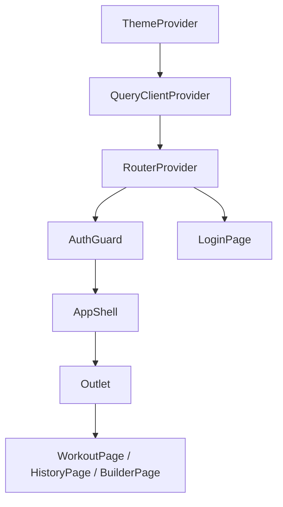

I have created the following plan after thorough exploration and analysis of the codebase. Follow the below plan verbatim. Trust the files and references. Do not re-verify what's written in the plan. Explore only when absolutely necessary. First implement all the proposed file changes and then I'll review all the changes together at the end.

## Observations

The workspace is a bare directory with only the v1 vanilla JS `index.html`, `PRD.md`, `README.md`, and `.gitignore`. The v1 design tokens (`--bg: #0f0f13`, `--teal: #00c9b1`, `--card: #1a1a24`, `--border: #2a2a38`) are already defined in the existing file and must be mapped to shadcn CSS variables. The new Vite scaffold must coexist with the existing files — the `src/` directory becomes the new entry point.

## Approach

Bootstrap a Vite + React + TypeScript project in-place at the workspace root, layering the new `src/` structure on top of the existing files. All tooling (Tailwind, shadcn/ui, next-themes, Jotai, React Router v6, TanStack Query) is installed and wired in a single pass, following the Tech Plan's component architecture and atom map exactly. No Supabase, no PWA, no real screen content — only the scaffold and shell.

---

## Implementation Steps

### 1. Initialize Vite Project In-Place

Run `npm create vite@latest . -- --template react-ts` in the workspace root (the `.` targets the existing directory). When prompted about non-empty directory, choose to ignore/proceed. This generates:
- `package.json`, `vite.config.ts`, `tsconfig.json`, `tsconfig.node.json`
- `src/main.tsx`, `src/App.tsx`, `src/vite-env.d.ts`
- A new `index.html` (Vite's entry point — this **replaces** the v1 `index.html`)

Move the v1 `index.html` to `index.v1.html` before scaffolding, or rename it after, so it is preserved as a reference. The new Vite `index.html` will reference `src/main.tsx` as the module entry.

---

### 2. Configure `tsconfig.json`

Update `tsconfig.json` to enable strict mode and path aliases:
- Set `"strict": true` under `compilerOptions`
- Add `"baseUrl": "."` and `"paths": { "@/*": ["src/*"] }` under `compilerOptions`

Update `vite.config.ts` to resolve the `@/` alias using `resolve.alias`, pointing `@` to the `src/` directory. Install `@types/node` as a dev dependency so `path` can be imported in the Vite config.

---

### 3. Install and Configure Tailwind CSS

Install `tailwindcss`, `postcss`, and `autoprefixer` as dev dependencies. Run `npx tailwindcss init -p` to generate `tailwind.config.js` and `postcss.config.js`.

In `tailwind.config.js`:
- Set `content` to `["./index.html", "./src/**/*.{ts,tsx}"]`
- Add `darkMode: "class"` (required for next-themes class strategy)
- Extend `theme.extend.colors` to expose the design tokens as Tailwind utilities (e.g., `teal: "#00c9b1"`, `card: "#1a1a24"`, etc.)

---

### 4. Initialize shadcn/ui

Run `npx shadcn@latest init` and configure `components.json`:
- Style: `default`
- Base color: `slate` (overridden by custom CSS variables below)
- CSS variables: `yes`
- Tailwind config path: `tailwind.config.js`
- Components alias: `@/components/ui`
- Utils alias: `@/lib/utils`

Create `src/styles/globals.css` with the shadcn CSS variable structure, mapping v1 design tokens:

```
:root {
  --background: 0 0% 6%;          /* #0f0f13 */
  --foreground: 240 10% 94%;      /* #e8e8f0 */
  --card: 240 10% 12%;            /* #1a1a24 */
  --card-foreground: 240 10% 94%;
  --border: 240 8% 19%;           /* #2a2a38 */
  --primary: 174 100% 39%;        /* #00c9b1 */
  --primary-foreground: 0 0% 0%;
  --muted: 240 8% 19%;
  --muted-foreground: 0 0% 40%;   /* #666 */
  --destructive: 0 72% 71%;       /* #ff6b6b */
  --radius: 0.625rem;
  /* ... remaining shadcn required variables */
}
.dark { /* same values — dark is the default */ }
.light {
  --background: 0 0% 100%;
  --foreground: 240 10% 10%;
  /* ... light overrides */
}
```

Import `globals.css` in `src/main.tsx` (before any component imports).

Install shadcn components one by one via CLI:
```
npx shadcn@latest add button input checkbox sheet dialog switch badge tabs scroll-area separator
```
These land in `src/components/ui/`.

---

### 5. Install and Configure next-themes

Install `next-themes`. In `src/main.tsx`, wrap the root render with `ThemeProvider`:
- `attribute="class"` (class strategy)
- `defaultTheme="dark"`
- `enableSystem={false}`

---

### 6. Install Jotai and Define Atom Map

Install `jotai`. Create `src/store/atoms.ts`.

First define the `SessionState` TypeScript type:

| Field | Type |
|---|---|
| `currentDayId` | `string \| null` |
| `exerciseIndex` | `number` |
| `setsData` | `Record<string, Array<{ reps: string; weight: string; done: boolean }>>` |
| `startedAt` | `number \| null` |
| `isActive` | `boolean` |
| `totalSetsDone` | `number` |

Then define all atoms using `atom` and `atomWithStorage` from `jotai/utils`:

| Atom | Type | Storage |
|---|---|---|
| `authAtom` | `User \| null` | `atom(null)` |
| `sessionAtom` | `SessionState` | `atomWithStorage('session', defaultSessionState)` |
| `restAtom` | `{ startedAt: number; durationSeconds: number } \| null` | `atomWithStorage('rest', null)` |
| `themeAtom` | `'dark' \| 'light'` | `atomWithStorage('theme', 'dark')` |
| `syncStatusAtom` | `'idle' \| 'syncing' \| 'failed' \| 'synced'` | `atom('idle')` |
| `queueSyncMetaAtom` | `{ lastSyncAt?: number; pendingCount: number }` | `atomWithStorage('queueSyncMeta', { pendingCount: 0 })` |
| `prFlagsAtom` | `Record<string, boolean>` | `atom({})` |
| `installPromptStateAtom` | `{ dismissed: boolean }` | `atomWithStorage('installPrompt', { dismissed: false })` |
| `drawerOpenAtom` | `boolean` | `atom(false)` |

The `User` type should be imported from a placeholder type file `src/types/auth.ts` (a simple interface with `id: string`, `email: string`, `name: string`, `avatarUrl?: string`) since Supabase is out of scope for this ticket.

---

### 7. Install React Router v6 and Define Routes

Install `react-router-dom` (v6).

**File structure for routing:**

```
src/
  router/
    index.tsx          ← createBrowserRouter definition
    AuthGuard.tsx      ← reads authAtom, redirects to /login
  pages/
    LoginPage.tsx
    WorkoutPage.tsx
    HistoryPage.tsx
    BuilderPage.tsx
```

In `src/router/index.tsx`, define routes using `createBrowserRouter`:
- `/login` → `LoginPage` (no guard)
- `/` → `AuthGuard` wrapping `AppShell` with `WorkoutPage` as the outlet child
- `/history` → `AuthGuard` wrapping `AppShell` with `HistoryPage`
- `/builder` → `AuthGuard` wrapping `AppShell` with `BuilderPage`

**`AuthGuard` component** (`src/router/AuthGuard.tsx`):
- Reads `authAtom` via `useAtomValue`
- If `null`, renders `<Navigate to="/login" replace />`
- Otherwise renders `<Outlet />`

**PWA back-button policy** — implement in each guarded page using `useEffect`:

- In `HistoryPage` and `BuilderPage`: on mount, push a dummy history entry (`history.pushState(null, '', location.href)`); listen for `popstate`; on `popstate`, call `navigate('/', { replace: true })`
- In `WorkoutPage`: on mount, push a dummy entry; on `popstate`, open the "Exit app?" `Dialog` (shadcn `Dialog`). The dialog has "Cancel" (closes dialog, re-pushes entry) and "Exit" (calls `window.close()` or navigates away — session state in `sessionAtom` is already persisted via `atomWithStorage` so it survives)

---

### 8. Install TanStack Query

Install `@tanstack/react-query`. In `src/main.tsx`, create a `QueryClient` with:
- `defaultOptions.queries.staleTime`: `5 * 60 * 1000` (5 minutes)
- `defaultOptions.queries.retry`: `1`

Wrap the root render with `QueryClientProvider` (inside `ThemeProvider`, outside `RouterProvider`).

---

### 9. Implement AppShell

Create `src/components/AppShell.tsx`. This is the layout wrapper rendered by all authenticated routes.

**Structure:**
```
AppShell
├── TopBar
│   ├── HamburgerButton (☰) — sets drawerOpenAtom true
│   ├── SessionTimerChip — derives elapsed from sessionAtom.startedAt
│   └── SyncStatusChip — reads syncStatusAtom
├── SideDrawer (shadcn Sheet, side="left")
│   ├── User section (placeholder avatar + "Guest" name until T2)
│   ├── Nav links: History (/history), Workout Builder (/builder)
│   └── Settings section
│       ├── Theme toggle (shadcn Switch) — calls next-themes setTheme(), updates themeAtom
│       ├── Install app (placeholder nav-item, disabled)
│       └── Sign out (placeholder, disabled until T2)
└── <Outlet /> (screen content)
```

**`SessionTimerChip`**: reads `sessionAtom.startedAt`; if `null`, shows `00:00:00`; otherwise uses `setInterval` in a `useEffect` to tick every second, computing `Date.now() - startedAt` and formatting as `HH:MM:SS`.

**`SyncStatusChip`**: reads `syncStatusAtom`; maps values to display strings:
- `'idle'` → hidden or "Offline" (based on `navigator.onLine`)
- `'syncing'` → "Syncing…"
- `'synced'` → "Synced"
- `'failed'` → "Sync failed"

Render as a shadcn `Badge` with appropriate variant.

**`SideDrawer`**: uses shadcn `Sheet` with `open` bound to `drawerOpenAtom` and `onOpenChange` writing back to the atom. Nav links use React Router `<Link>` and close the drawer on click. Theme toggle uses `useTheme()` from `next-themes` and also writes `themeAtom`.

---

### 10. Placeholder Screen Components

Create minimal shell components — each just renders a centered title:

- `src/pages/LoginPage.tsx` — title "Login", a placeholder "Sign in with Google" `Button` (shadcn)
- `src/pages/WorkoutPage.tsx` — title "Workout", a placeholder `Badge` using the teal primary color
- `src/pages/HistoryPage.tsx` — title "History"
- `src/pages/BuilderPage.tsx` — title "Workout Builder"

---

### 11. Wire `src/main.tsx`

The final `src/main.tsx` render tree:



Import order in `main.tsx`:
1. `src/styles/globals.css`
2. React, ReactDOM
3. ThemeProvider from `next-themes`
4. QueryClient, QueryClientProvider from `@tanstack/react-query`
5. RouterProvider from `react-router-dom`
6. Router from `src/router/index.tsx`

---

### 12. Final File Tree

```
workout-app/
├── index.html                    ← Vite entry (replaces v1)
├── index.v1.html                 ← v1 preserved
├── PRD.md
├── README.md
├── .gitignore
├── package.json
├── vite.config.ts
├── tsconfig.json
├── tailwind.config.js
├── postcss.config.js
├── components.json               ← shadcn config
└── src/
    ├── main.tsx                  ← root render + providers
    ├── vite-env.d.ts
    ├── styles/
    │   └── globals.css           ← shadcn CSS vars + design tokens
    ├── types/
    │   └── auth.ts               ← User interface placeholder
    ├── store/
    │   └── atoms.ts              ← full Jotai atom map
    ├── router/
    │   ├── index.tsx             ← createBrowserRouter
    │   └── AuthGuard.tsx
    ├── components/
    │   ├── AppShell.tsx
    │   ├── SessionTimerChip.tsx
    │   ├── SyncStatusChip.tsx
    │   ├── SideDrawer.tsx
    │   └── ui/                   ← shadcn generated components
    └── pages/
        ├── LoginPage.tsx
        ├── WorkoutPage.tsx
        ├── HistoryPage.tsx
        └── BuilderPage.tsx
```