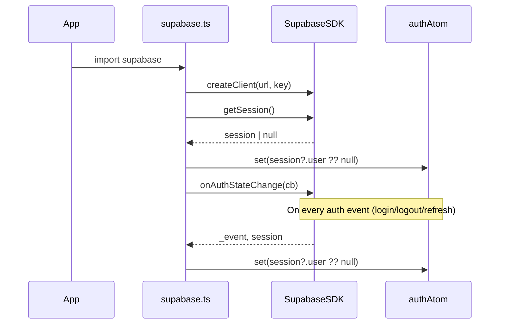
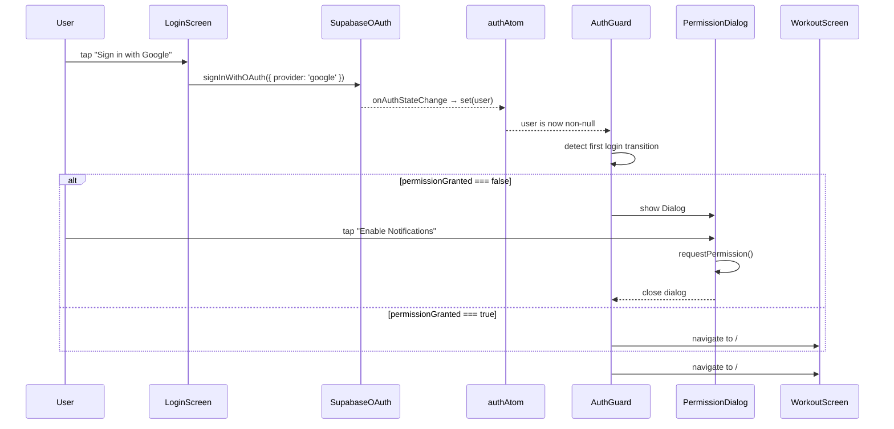

I have created the following plan after thorough exploration and analysis of the codebase. Follow the below plan verbatim. Trust the files and references. Do not re-verify what's written in the plan. Explore only when absolutely necessary. First implement all the proposed file changes and then I'll review all the changes together at the end.

## Observations

The workspace currently only contains the v1 `index.html` and `README.md` — T1 (scaffold) has not been executed yet. T2 builds directly on top of T1's output: the `src/store/atoms.ts` atom map (including `authAtom`), the `AuthGuard` component, shadcn `Button` and `Dialog`, and the React Router `/login` route are all prerequisites. The v1 `index.html` contains 24 exercises across 3 workout days, which must be extracted verbatim into the seed SQL.

## Approach

Each deliverable maps to a discrete file. The order follows dependency: env setup → Supabase client (wires `authAtom`) → SQL migrations (schema first, RLS second, seed last) → Login screen (uses the client) → notification hook (uses shadcn Dialog) → AuthGuard update (uses both the auth atom and the hook). No new libraries are introduced beyond `@supabase/supabase-js`, which is the standard Supabase JS SDK.

---

## Implementation Steps

### 1. Environment Variables

**Create `.env.example`** at the workspace root:
- Add two placeholder entries: `VITE_SUPABASE_URL=` and `VITE_SUPABASE_ANON_KEY=`

**Update `.gitignore`** (already present at root):
- Verify `.env` and `.env.local` are listed; add them if missing. Do not add `.env.example` — it should be committed.

---

### 2. Install Supabase JS Client

In `package.json` (created by T1), add `@supabase/supabase-js` as a dependency. This is the only new package required for this ticket.

---

### 3. `src/lib/supabase.ts` — Singleton Client + Auth Wiring

Create this file as the single source of truth for the Supabase client.

- Import `createClient` from `@supabase/supabase-js`.
- Read `import.meta.env.VITE_SUPABASE_URL` and `import.meta.env.VITE_SUPABASE_ANON_KEY`.
- Call `createClient(url, key)` once and export the result as `supabase` (named export).
- Import `authAtom` from `src/store/atoms.ts` and `getDefaultStore` from `jotai`.
- Call `supabase.auth.onAuthStateChange((_event, session) => { store.set(authAtom, session?.user ?? null) })` using the default Jotai store, so `authAtom` stays in sync with Supabase auth state without any React context.
- Also call `supabase.auth.getSession()` on module load and set `authAtom` to the initial session user (handles page refresh within an active session).



---

### 4. SQL Migration Files in `supabase/migrations/`

Create the `supabase/migrations/` directory. Use timestamp-prefixed filenames following Supabase CLI convention (e.g., `20240101000001_create_exercises.sql`). Split into logical files:

#### File 1: `..._create_exercises.sql`
```
CREATE TABLE exercises (
  id uuid PRIMARY KEY DEFAULT gen_random_uuid(),
  name text NOT NULL,
  muscle_group text NOT NULL,
  emoji text NOT NULL,
  is_system boolean NOT NULL DEFAULT false,
  created_at timestamptz NOT NULL DEFAULT now()
);
```
No RLS on `exercises` — public read, no user writes in v2.

#### File 2: `..._create_workout_days.sql`
```
CREATE TABLE workout_days (
  id uuid PRIMARY KEY DEFAULT gen_random_uuid(),
  user_id uuid NOT NULL REFERENCES auth.users(id) ON DELETE CASCADE,
  label text NOT NULL,
  emoji text NOT NULL DEFAULT '🏋️',
  sort_order integer NOT NULL DEFAULT 0,
  created_at timestamptz NOT NULL DEFAULT now()
);

ALTER TABLE workout_days ENABLE ROW LEVEL SECURITY;

CREATE POLICY "Users manage own workout_days" ON workout_days
  FOR ALL USING (auth.uid() = user_id) WITH CHECK (auth.uid() = user_id);
```

#### File 3: `..._create_workout_exercises.sql`
```
CREATE TABLE workout_exercises (
  id uuid PRIMARY KEY DEFAULT gen_random_uuid(),
  workout_day_id uuid NOT NULL REFERENCES workout_days(id) ON DELETE CASCADE,
  exercise_id uuid NOT NULL REFERENCES exercises(id),
  name_snapshot text NOT NULL,
  muscle_snapshot text NOT NULL,
  emoji_snapshot text NOT NULL,
  sets integer NOT NULL DEFAULT 3,
  reps text NOT NULL DEFAULT '10',
  weight text NOT NULL DEFAULT '0',
  rest_seconds integer NOT NULL DEFAULT 90,
  sort_order integer NOT NULL DEFAULT 0
);

ALTER TABLE workout_exercises ENABLE ROW LEVEL SECURITY;

CREATE POLICY "Users manage own workout_exercises" ON workout_exercises
  FOR ALL USING (
    auth.uid() = (SELECT user_id FROM workout_days WHERE id = workout_day_id)
  )
  WITH CHECK (
    auth.uid() = (SELECT user_id FROM workout_days WHERE id = workout_day_id)
  );
```

#### File 4: `..._create_sessions.sql`
```
CREATE TABLE sessions (
  id uuid PRIMARY KEY DEFAULT gen_random_uuid(),
  user_id uuid NOT NULL REFERENCES auth.users(id) ON DELETE CASCADE,
  workout_day_id uuid REFERENCES workout_days(id),
  workout_label_snapshot text NOT NULL,
  started_at timestamptz NOT NULL,
  finished_at timestamptz,
  total_sets_done integer NOT NULL DEFAULT 0,
  has_skipped_sets boolean NOT NULL DEFAULT false
);

ALTER TABLE sessions ENABLE ROW LEVEL SECURITY;

CREATE POLICY "Users manage own sessions" ON sessions
  FOR ALL USING (auth.uid() = user_id) WITH CHECK (auth.uid() = user_id);
```

#### File 5: `..._create_set_logs.sql`
```
CREATE TABLE set_logs (
  id uuid PRIMARY KEY DEFAULT gen_random_uuid(),
  session_id uuid NOT NULL REFERENCES sessions(id) ON DELETE CASCADE,
  exercise_id uuid NOT NULL REFERENCES exercises(id),
  exercise_name_snapshot text NOT NULL,
  set_number integer NOT NULL,
  reps_logged text NOT NULL,
  weight_logged numeric NOT NULL,
  estimated_1rm numeric,
  was_pr boolean NOT NULL DEFAULT false,
  logged_at timestamptz NOT NULL DEFAULT now()
);

ALTER TABLE set_logs ENABLE ROW LEVEL SECURITY;

CREATE POLICY "Users manage own set_logs" ON set_logs
  FOR ALL USING (
    auth.uid() = (SELECT user_id FROM sessions WHERE id = session_id)
  )
  WITH CHECK (
    auth.uid() = (SELECT user_id FROM sessions WHERE id = session_id)
  );
```

---

### 5. `supabase/seed.sql` — Exercise Library

Insert all 24 exercises extracted verbatim from the v1 `index.html` `WORKOUTS` constant. Use a single `INSERT INTO exercises (name, muscle_group, emoji, is_system) VALUES ...` statement.

| # | name | muscle_group | emoji |
|---|------|-------------|-------|
| 1 | Arnold Press Haltères | Épaules | 🏋️ |
| 2 | Papillon bras tendus | Pectoraux | 🦅 |
| 3 | Élévations latérales | Épaules | 🙆 |
| 4 | Skull Crusher incliné | Triceps | 💀 |
| 5 | Presse à cuisse | Quadriceps | 🦵 |
| 6 | Élévation mollet machine | Mollets | 🦶 |
| 7 | Crunch assis machine | Abdos | 🔥 |
| 8 | Rangées prise serrée neutre | Dos | 🚣 |
| 9 | Rangées prise large pronation | Dos | 💪 |
| 10 | Curls biceps inclinés | Biceps | 💪 |
| 11 | Papillon inverse | Deltoïdes post. | 🦅 |
| 12 | Shrugs haltères | Trapèzes | 🤷 |
| 13 | Soulevé de terre roumain | Ischios / Bas du dos | 🏋️ |
| 14 | Extension du dos machine | Lombaires | 🔙 |
| 15 | Crunch à genoux poulie | Abdos | 🔥 |
| 16 | Développé couché | Pectoraux | 🏋️ |
| 17 | Tirage latéral prise large | Dos | 🚣 |
| 18 | Pec Deck bras tendus | Pectoraux | 🦅 |
| 19 | Extension triceps corde | Triceps | 💪 |
| 20 | Curls stricts barre | Biceps | 🦾 |
| 21 | Extension de jambe machine | Quadriceps | 🦵 |
| 22 | Leg Curl assis | Ischios | 🦵 |
| 23 | Extension mollet machine | Mollets | 🦶 |

Note: "Papillon inverse" appears in both Mercredi and Vendredi with the same muscle/emoji — insert it only once (row 11) to avoid duplicates in the shared library.

All rows use `is_system = true`.

---

### 6. `src/pages/LoginScreen.tsx` — Login Screen

Create this component for the `/login` route.

- Import `supabase` from `src/lib/supabase.ts`.
- Import `Button` from `src/components/ui/button` (shadcn).
- The root element uses `className="min-h-screen flex flex-col items-center justify-center"` with `style={{ background: '#0f0f13' }}` (matching the v1 design token `--bg`).
- Render: app name **"Workout"** as a large heading, a short tagline below it, and a single shadcn `Button` labelled **"Sign in with Google"**.
- The button's `onClick` calls `supabase.auth.signInWithOAuth({ provider: 'google', options: { redirectTo: window.location.origin } })`.
- No navigation logic is needed here — `AuthGuard` handles the redirect to `/` once `authAtom` is populated by the `onAuthStateChange` listener.

```
Wireframe (LoginScreen):
┌─────────────────────────────┐
│  (background: #0f0f13)      │
│                             │
│         🏋️ Workout          │
│   Track your progress       │
│                             │
│  ┌─────────────────────┐    │
│  │  Sign in with Google │    │
│  └─────────────────────┘    │
│                             │
└─────────────────────────────┘
```

---

### 7. `src/hooks/useNotificationPermission.ts` — Notification Permission Hook

Create this custom hook.

- Use `localStorage` key `notification_permission_granted` (string `'true'`/`'false'`) to persist state across restarts.
- On mount, read `Notification.permission` from the browser API and reconcile with the stored value.
- State: `permissionGranted: boolean` — `true` only when `Notification.permission === 'granted'`.
- `requestPermission: () => Promise<void>` — calls `Notification.requestPermission()`, updates state and persists to `localStorage`.
- If `Notification` is not supported in the browser, `permissionGranted` defaults to `false` and `requestPermission` is a no-op.
- The hook does **not** render any UI itself — it returns state and the request function for the caller to use.

Return shape:
```
{ permissionGranted: boolean, requestPermission: () => Promise<void> }
```

---

### 8. Notification Permission Dialog — inline in `AuthGuard` or a dedicated wrapper

After a successful login (i.e., `authAtom` transitions from `null` to a `User`), if `permissionGranted` is `false`, show a shadcn `Dialog` before navigating to `/`.

- Import `useNotificationPermission` from `src/hooks/useNotificationPermission.ts`.
- Import `Dialog`, `DialogContent`, `DialogHeader`, `DialogTitle`, `DialogDescription`, `DialogFooter` from `src/components/ui/dialog` (shadcn).
- Import `Button` from `src/components/ui/button`.
- The dialog is **not** dismissible without a choice — it has two actions:
  - **"Enable Notifications"** → calls `requestPermission()`, then closes the dialog and navigates to `/`.
  - **"Not now"** → closes the dialog and navigates to `/` (timer features remain blocked).
- The dialog copy should explain: notifications are needed for rest timer alerts when the app is in the background.

---

### 9. Update `AuthGuard` in `src/components/AuthGuard.tsx`

The T1 scaffold created `AuthGuard` with a placeholder auth check. Update it to:

- Import `useAtomValue` from `jotai` and `authAtom` from `src/store/atoms.ts`.
- Replace any mock/placeholder auth check with `const user = useAtomValue(authAtom)`.
- If `user` is `null`, render `<Navigate to="/login" replace />`.
- If `user` is defined, render children (the protected route outlet).
- Add the notification permission dialog logic described in step 8: track a local `showPermissionDialog` boolean state that is set to `true` on the first render where `user` transitions from `null` to non-null (use a `useEffect` with a `useRef` to detect the transition). When `showPermissionDialog` is `true`, render the Dialog on top of the children.



---

### File Summary

| File | Action |
|------|--------|
| `.env.example` | Create |
| `.gitignore` | Update (verify `.env` is listed) |
| `src/lib/supabase.ts` | Create |
| `supabase/migrations/20240101000001_create_exercises.sql` | Create |
| `supabase/migrations/20240101000002_create_workout_days.sql` | Create |
| `supabase/migrations/20240101000003_create_workout_exercises.sql` | Create |
| `supabase/migrations/20240101000004_create_sessions.sql` | Create |
| `supabase/migrations/20240101000005_create_set_logs.sql` | Create |
| `supabase/seed.sql` | Create |
| `src/pages/LoginScreen.tsx` | Create |
| `src/hooks/useNotificationPermission.ts` | Create |
| `src/components/AuthGuard.tsx` | Update |