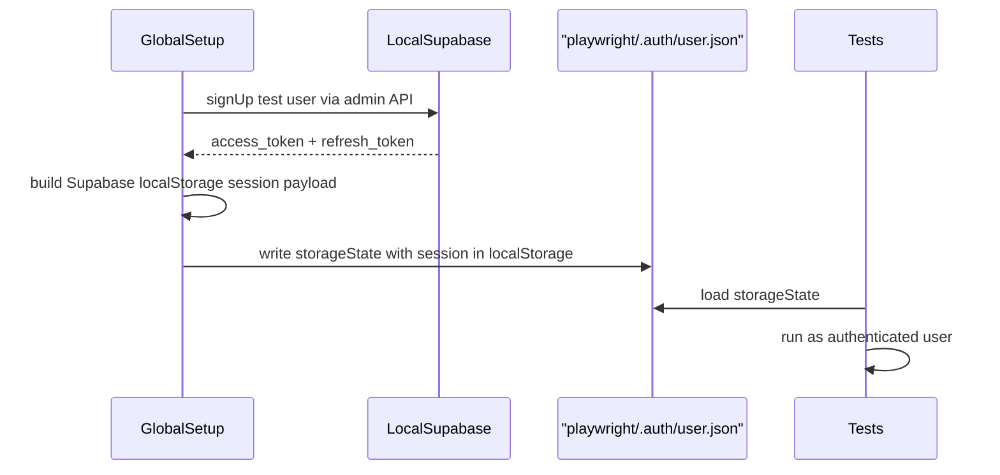

# T13 — Playwright Setup & E2E Tests

## Goal

Set up Playwright with authenticated test infrastructure targeting a local Supabase instance, and implement the three critical E2E flows: login redirect, full workout session, and builder CRUD.

## Dependencies

T10–T12 should be complete (the app must be testable, and unit tests should already be passing). The local Supabase CLI must be available and `supabase/seed.sql` must seed the exercise catalogue (24 exercises) — this already exists.

## Scope

### Install Dependencies

| Package | Purpose |
|---|---|
| `@playwright/test` | E2E test runner |
| Playwright browsers | Installed via `npx playwright install` |

### Playwright Configuration (`playwright.config.ts`)

| Setting | Value |
|---|---|
| Base URL | `http://localhost:5173` |
| Web server | `vite build && vite preview` (production-like build for E2E) |
| Projects | 3: Chromium, Firefox, WebKit |
| `storageState` | `playwright/.auth/user.json` (shared across authenticated projects) |
| `permissions` | `['notifications']` on all authenticated browser contexts (prevents `file:src/router/AuthGuard.tsx` notification dialog from blocking tests) |
| Retries | `0` locally, `2` in CI (via `process.env.CI`) |
| Reporter | `html` (generates browsable report on failure) |

### Auth State Flow



### Global Setup (`e2e/global-setup.ts`)

1. Create a test user via Supabase Auth admin API (`supabase.auth.admin.createUser`)
2. Sign in as the test user to obtain `access_token` and `refresh_token`
3. Construct the Supabase localStorage session payload (key format: `sb-<project-ref>-auth-token`)
4. Launch a temporary browser context, inject the session into `localStorage`, export `context.storageState()` to `playwright/.auth/user.json`
5. Store the test user ID for teardown

**Trade-off accepted:** This approach is coupled to Supabase's localStorage key format. If Supabase changes storage conventions, this setup must be updated.

### Global Teardown (`e2e/global-teardown.ts`)

Delete the test user from Supabase Auth via `supabase.auth.admin.deleteUser(userId)` to keep the local instance clean.

### E2E Spec Files

#### `e2e/login.spec.ts`

Flow: unauthenticated user experience.

| Step | Assertion |
|---|---|
| Visit `/` without auth | Redirected to `/login` |
| Login page renders | Google OAuth button is visible |
| No OAuth automation | Test stops here — OAuth flow cannot be automated |

This spec does NOT use `storageState` (runs as unauthenticated project).

#### `e2e/workout-session.spec.ts`

Flow: full workout session end-to-end. Uses authenticated `storageState`.

| Step | Assertion |
|---|---|
| Navigate to `/` | Day selector visible with seeded workout days |
| Select a workout day | Exercise strip renders exercises for that day |
| Start session | Session timer visible in top bar |
| Log set 1 on first exercise | Set row marked as done (teal), rest timer overlay appears |
| Skip rest timer | Overlay dismissed |
| Log set 2 on first exercise | Second set row marked as done |
| Finish session | Session summary screen visible with duration, sets done, exercises completed |

#### `e2e/builder-crud.spec.ts`

Flow: builder create/read/update/delete. Uses authenticated `storageState`.

| Step | Assertion |
|---|---|
| Open Builder page | Builder page renders |
| Create new day | New day appears in the day list |
| Add exercise from library | Exercise appears in the day's exercise list |
| Edit sets/reps for the exercise | Updated values visible |
| Delete exercise from day | Exercise removed from list |
| Delete the day | Day removed from day list |

### Directory Structure

```
playwright/
  .auth/
    user.json          ← generated by global-setup (gitignored)
e2e/
  global-setup.ts
  global-teardown.ts
  login.spec.ts
  workout-session.spec.ts
  builder-crud.spec.ts
playwright.config.ts
```

`playwright/.auth/` should be added to `.gitignore`.

## Out of Scope

- Google OAuth end-to-end automation (cannot be reliably automated)
- Visual regression testing
- Performance testing
- Testing on mobile viewports (future)
- CI pipeline integration (T14)

## Acceptance Criteria

- [ ] `npx playwright test` runs all 3 specs against a local Supabase instance
- [ ] `e2e/login.spec.ts` verifies unauthenticated redirect to `/login` and OAuth button visibility
- [ ] `e2e/workout-session.spec.ts` completes a full session: select day → log 2 sets → rest timer appears → skip → finish → summary visible
- [ ] `e2e/builder-crud.spec.ts` completes full CRUD: create day → add exercise → edit sets/reps → delete exercise → delete day
- [ ] Global setup creates a test user and injects auth state; global teardown deletes the test user
- [ ] Notification permission is granted at browser-context level (no dialog blocks tests)
- [ ] `playwright/.auth/` is gitignored
- [ ] Tests pass on Chromium, Firefox, and WebKit

## References

- `Epic_Brief_—_Quality_Foundation_(Testing_+_CI_CD).md` — 3 Playwright E2E flows
- `Tech_Plan_—_Quality_Foundation_(Testing_+_CI_CD).md` — Playwright Configuration & Files table, Playwright Auth State section, Critical Constraints (AuthGuard notification dialog)
