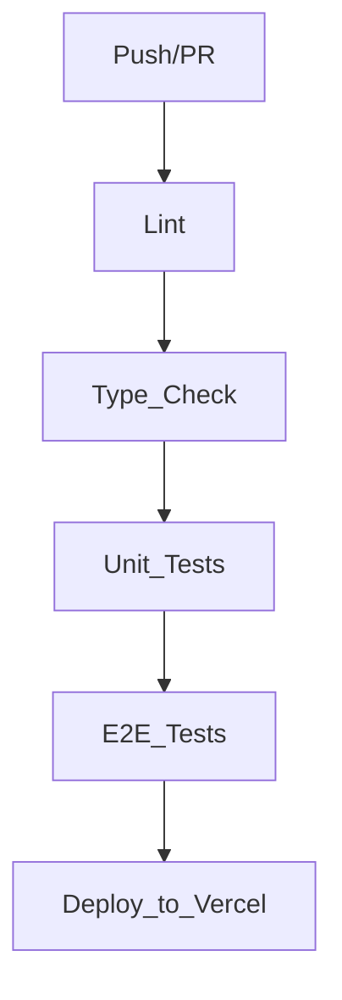

# T14 — GitHub Actions CI/CD Pipeline

## Goal

Create a single GitHub Actions workflow that gates every PR with lint, type-check, unit tests, and E2E tests, and auto-deploys to Vercel on merge to `main`.

## Dependencies

T10–T13 must be complete — the workflow runs all test suites that those tickets produce.

## Scope

### Workflow File (`.github/workflows/ci.yml`)

Single workflow triggered on:
- `push` to `main`
- `pull_request` targeting `main`

### Pipeline Structure

### Job Details

#### `lint`

- Runs on: `ubuntu-latest`
- Steps: checkout → setup Node (LTS) → `npm ci` → `npm run lint`
- Fails fast on ESLint errors

#### `type-check`

- Depends on: `lint`
- Steps: checkout → setup Node → `npm ci` → `tsc --noEmit`
- Catches type regressions not caught by Vite's transpile-only build

#### `unit`

- Depends on: `type-check`
- Steps: checkout → setup Node → `npm ci` → `npx vitest run --reporter=verbose`

#### `e2e`

- Depends on: `unit`
- Steps:
  1. Checkout
  2. Setup Node + `npm ci`
  3. Install Playwright browsers (`npx playwright install --with-deps`)
  4. Install Supabase CLI
  5. `supabase start` (starts local Supabase stack in Docker)
  6. `supabase db reset` (clean state, runs `supabase/seed.sql`)
  7. `npm run build` + `npx vite preview &` (start preview server in background)
  8. `npx playwright test`
  9. On failure: upload Playwright HTML report as GitHub Actions artifact

**Environment variables:** The E2E job sets `VITE_SUPABASE_URL` and `VITE_SUPABASE_ANON_KEY` to the local Supabase instance values (output by `supabase status`).

#### `deploy`

- Depends on: `e2e`
- Condition: `if: github.ref == 'refs/heads/main' && github.event_name == 'push'`
- Uses: `amondnet/vercel-action` (or Vercel CLI directly)
- Secrets required: `VERCEL_TOKEN`, `VERCEL_ORG_ID`, `VERCEL_PROJECT_ID`
- Deploys production build to Vercel

### PR Preview Deployments

Owned entirely by the Vercel Git integration (outside this workflow). The CI workflow does NOT run deploy steps on PRs to avoid duplicate preview deployments.

### Required GitHub Secrets

| Secret | Purpose |
|---|---|
| `VERCEL_TOKEN` | Vercel API token for deployment |
| `VERCEL_ORG_ID` | Vercel organization ID |
| `VERCEL_PROJECT_ID` | Vercel project ID |

These must be configured in the GitHub repository settings before the deploy job can succeed.

### Branch Protection & Merge Policy (Manual Setup)

After the workflow is merged, configure a **branch ruleset** on `main` via the GitHub UI. These are manual repository settings steps — not automated by the CI workflow.

#### Step-by-step: Create the ruleset

1. Go to the repository on GitHub
2. Navigate to **Settings → Rules → Rulesets**
3. Click **New ruleset → New branch ruleset**
4. Name it `main-protection`
5. Set **Enforcement status** to **Active**
6. Under **Target branches**, click **Add target** → **Include by pattern** → type `main` → confirm
7. Enable the following rules:

**Block direct pushes:**
- Check **Restrict creations** (prevents creating `main` via push if it didn't exist — safety net)
- Check **Restrict updates** (blocks `git push` directly to `main`)
- Check **Restrict deletions** (prevents accidental deletion of `main`)

**Require pull requests:**
- Check **Require a pull request before merging**
- Set **Required approvals** to `0` (solo project — no reviewers required, change to `1` when collaborators join)
- Check **Dismiss stale pull request approvals when new commits are pushed** (if approvals > 0)

**Require status checks to pass:**
- Check **Require status checks to pass before merging**
- Check **Require branches to be up to date before merging**
- Click **Add checks** and add all four job names:
  - `lint`
  - `type-check`
  - `unit`
  - `e2e`

Note: these check names will only appear in the search once the workflow has run at least once on a PR. Push a dummy PR first if needed.

8. Click **Create** to save the ruleset

#### Step-by-step: Enforce squash-and-merge only

1. Go to **Settings → General**
2. Scroll to the **Pull Requests** section
3. **Uncheck** "Allow merge commits"
4. **Check** "Allow squash merging" — set default commit message to **Pull request title and description**
5. **Uncheck** "Allow rebase merging"
6. Click **Save**

This ensures every PR lands as a single commit on `main` — clean linear history, no merge noise.

## Out of Scope

- Vercel Git integration setup (already exists or done outside this ticket)
- Test coverage reporting / badges (future)
- Slack/Discord notifications on failure (future)
- Matrix builds for multiple Node versions (single LTS is sufficient)
- Required reviewer approvals (solo project for now — bump to 1 when collaborators join)

## Acceptance Criteria

- [ ] `.github/workflows/ci.yml` exists and triggers on push to `main` and PRs targeting `main`
- [ ] `lint` job runs `npm run lint` and fails the pipeline on ESLint errors
- [ ] `type-check` job runs `tsc --noEmit` and fails the pipeline on type errors
- [ ] `unit` job runs `vitest run` and fails the pipeline on test failures
- [ ] `e2e` job starts local Supabase, resets the DB, builds the app, and runs Playwright tests
- [ ] `e2e` job uploads Playwright HTML report as artifact on failure
- [ ] `deploy` job runs only on push to `main` (not on PRs) and deploys to Vercel
- [ ] All jobs use `npm ci` for deterministic installs
- [ ] Pipeline completes in under 10 minutes for a typical PR
- [ ] Branch ruleset on `main`: direct pushes blocked, status checks (`lint`, `type-check`, `unit`, `e2e`) required before merge
- [ ] Squash-and-merge is the only allowed merge strategy (merge commits and rebase merging disabled in repo settings)

## References

- `Epic_Brief_—_Quality_Foundation_(Testing_+_CI_CD).md` — Automated quality gate, automated deployment goals
- `Tech_Plan_—_Quality_Foundation_(Testing_+_CI_CD).md` — CI Pipeline Structure section, GitHub Actions Workflow table
