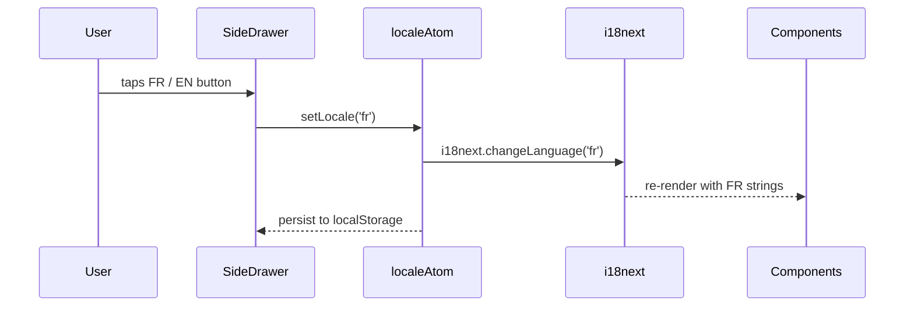

# T9 — i18n: Full Translation Service (FR/EN) + Weight Unit System

## Overview

Introduce a full internationalization layer to the app using `react-i18next`. All hardcoded English UI strings are replaced with translation keys. A weight unit system (`kg` / `lbs`) is added as a display-only preference — Supabase always stores weights in kg.

**Spec reference:** `spec:09100d04-cac9-490e-9368-d90a5492e210/9a23fffb-503a-4613-9dce-f2b787f0e72d`

---

## Dependencies

All of T1–T8 must be complete. T9 touches every screen and every component that renders user-visible strings or weight values.

---

## Scope

### In scope
- `react-i18next` + `i18next-browser-languagedetector` setup
- 6 translation namespaces × 2 locales (EN/FR): `common`, `auth`, `workout`, `history`, `builder`, `settings`
- `localeAtom` and `weightUnitAtom` added to `file:src/store/atoms.ts`
- `useWeightUnit` hook in `file:src/hooks/useWeightUnit.ts`
- `src/lib/formatters.ts` for `formatDate` and `formatNumber` using `Intl` API
- Language + weight unit segmented button controls in `file:src/components/SideDrawer.tsx`
- All weight display/input updated across: `file:src/components/workout/SetsTable.tsx`, `file:src/components/workout/ExerciseDetail.tsx`, `file:src/components/history/ExerciseChart.tsx`, `file:src/components/history/SessionList.tsx`, `file:src/components/builder/ExerciseDetailEditor.tsx`
- All user-visible string literals replaced with `t()` calls across all pages and components

### Out of scope
- Exercise names and muscle group labels (user-owned Supabase data — not translated)
- Workout day labels (user-owned data)
- RTL layout support
- Any locale beyond FR and EN

---

## Architecture

### New files

| File | Purpose |
|---|---|
| `src/lib/i18n.ts` | i18next singleton initialization |
| `src/lib/formatters.ts` | `formatDate(date, locale)` and `formatNumber(value, locale)` via `Intl` |
| `src/hooks/useWeightUnit.ts` | Weight unit preference hook |
| `src/locales/en/{common,auth,workout,history,builder,settings}.json` | EN translation files |
| `src/locales/fr/{common,auth,workout,history,builder,settings}.json` | FR translation files |

### Modified files

| File | Change |
|---|---|
| `file:src/store/atoms.ts` | Add `localeAtom` (`atomWithStorage<'en' \| 'fr'>`) and `weightUnitAtom` (`atomWithStorage<'kg' \| 'lbs'>`) |
| `file:src/main.tsx` | Import `src/lib/i18n.ts` before any component imports |
| `file:src/components/SideDrawer.tsx` | Add Language and Weight unit segmented button rows in Settings section |
| All page and component files | Replace raw string literals with `t('namespace:key')` calls |

---

## Locale Switching Flow



---

## Weight Unit System

- **Storage rule:** All weights written to `set_logs.weight_logged` are always in **kg**. No DB schema change needed.
- **Display rule:** `useWeightUnit` converts kg → display unit at render time only.
- **Input rule:** Weight entered by user in `SetsTable` is in display unit; converted to kg before enqueue to `SyncService` / Supabase.
- **1RM rule:** `file:src/lib/epley.ts` always receives kg values. Conversion happens before calling `computeEpley1RM`.

### `useWeightUnit` hook interface

Returns `{ unit, setUnit, toDisplay, toKg, formatWeight }`:
- `toDisplay(kg)` — identity when `kg`, multiply by `2.20462` when `lbs`
- `toKg(value)` — identity when `kg`, divide by `2.20462` when `lbs`
- `formatWeight(kg)` — returns e.g. `"40 kg"` or `"88.2 lbs"` (1 decimal, locale-aware separator)

---

## Settings UI Addition

Two new rows added to the Settings section of the side drawer, using segmented buttons (not dropdowns):

```wireframe
<!DOCTYPE html>
<html>
<head>
<style>
  * { box-sizing: border-box; margin: 0; padding: 0; font-family: system-ui, sans-serif; }
  body { background: #1a1a24; color: #e8e8f0; max-width: 280px; margin: 0 auto; padding: 1rem 0; }
  .section-label { font-size: 0.68rem; font-weight: 700; text-transform: uppercase; letter-spacing: 1px; color: #555; padding: 8px 1rem 4px; }
  .row { display: flex; align-items: center; justify-content: space-between; padding: 10px 1rem; }
  .row-label { font-size: 0.9rem; color: #e8e8f0; }
  .toggle { width: 40px; height: 22px; background: #00c9b1; border-radius: 11px; position: relative; flex-shrink: 0; }
  .toggle-knob { width: 18px; height: 18px; background: #000; border-radius: 50%; position: absolute; top: 2px; right: 2px; }
  .seg { display: flex; border: 1px solid #2a2a38; border-radius: 8px; overflow: hidden; }
  .seg-btn { padding: 5px 12px; font-size: 0.8rem; background: #111118; color: #666; border: none; cursor: pointer; }
  .seg-btn.active { background: #00c9b1; color: #000; font-weight: 700; }
  .sep { height: 1px; background: #2a2a38; margin: 4px 0; }
</style>
</head>
<body>
  <div class="section-label">Settings</div>
  <div class="row">
    <span class="row-label">🌙 Dark mode</span>
    <div class="toggle"><div class="toggle-knob"></div></div>
  </div>
  <div class="sep"></div>
  <div class="row">
    <span class="row-label">🌐 Language</span>
    <div class="seg">
      <button class="seg-btn active" data-element-id="lang-fr">FR</button>
      <button class="seg-btn" data-element-id="lang-en">EN</button>
    </div>
  </div>
  <div class="row">
    <span class="row-label">⚖️ Weight unit</span>
    <div class="seg">
      <button class="seg-btn active" data-element-id="unit-kg">kg</button>
      <button class="seg-btn" data-element-id="unit-lbs">lbs</button>
    </div>
  </div>
  <div class="sep"></div>
  <div class="row" style="color:#aaa; font-size:0.85rem; cursor:pointer;">
    <span>📲 Install app</span>
  </div>
  <div class="row" style="color:#ff6b6b; font-size:0.85rem; cursor:pointer;">
    <span>↩ Sign out</span>
  </div>
</body>
</html>
```

---

## Acceptance Criteria

- [ ] Switching locale in Settings immediately re-renders all UI strings in the selected language with no page reload
- [ ] Locale preference persists across app restarts (via `localeAtom` → `localStorage`)
- [ ] Switching weight unit immediately updates all weight displays: sets table, last-session reference, history charts, builder editor
- [ ] All weights stored in Supabase remain in kg regardless of display unit
- [ ] `computeEpley1RM` always receives kg values; PR detection is unit-agnostic
- [ ] Dates display in locale-appropriate format (`"7 mars 2026"` in FR, `"Mar 7, 2026"` in EN)
- [ ] Numbers use locale-appropriate decimal separator (comma in FR, period in EN)
- [ ] No hardcoded English string literals remain in any component JSX after implementation
- [ ] Pluralization works correctly for both locales (`1 série` / `3 séries`, `1 set` / `3 sets`)