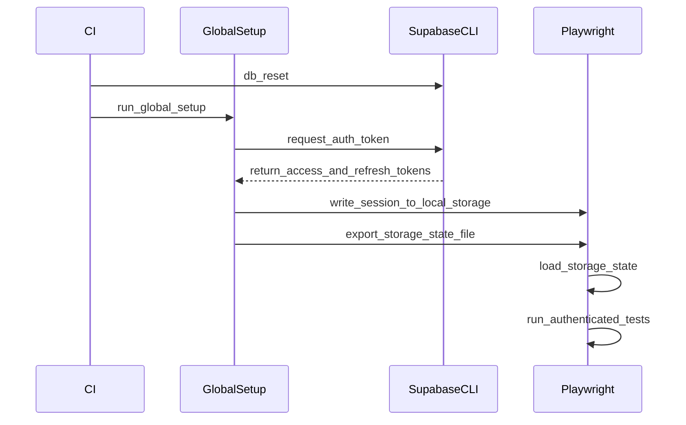
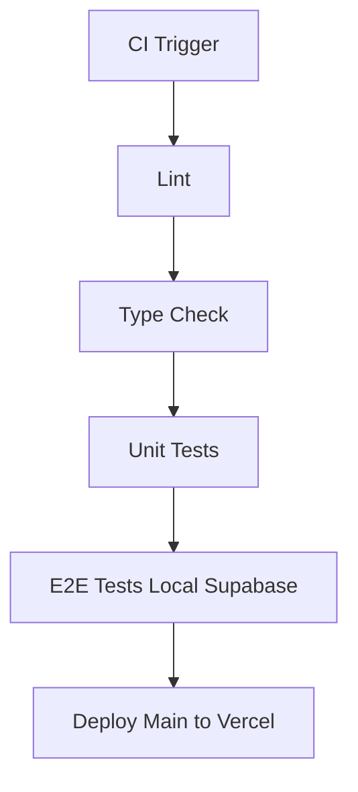

# Tech Plan — Quality Foundation (Testing + CI/CD)

## Architectural Approach

### Key Decisions

| Decision                     | Choice                                      | Rationale                                                                    |
| ---------------------------- | ------------------------------------------- | ---------------------------------------------------------------------------- |
| Unit/integration test runner | Vitest                                      | Native Vite integration, same config as the build, fast HMR-aware watch mode |
| Component testing            | React Testing Library                       | Standard for React, tests behavior not implementation                        |
| Supabase mock strategy       | `vi.mock('@/lib/supabase')`                 | Module-level mock, zero extra deps, controls return values per test          |
| E2E runner                   | Playwright                                  | Cross-browser, reliable, first-class TypeScript support                      |
| E2E auth bypass              | Supabase test user + localStorage injection | No app code changes, tests real auth token flow                              |
| E2E Supabase target          | Local Supabase CLI                          | Isolated, clean state per run, no production data risk                       |
| CI platform                  | GitHub Actions                              | Native to GitHub, free for public repos                                      |
| Deploy target                | Vercel via official GitHub Action           | Zero-config for Vite projects, preview URLs on PRs                           |

### Critical Constraints

file:src/lib/supabase.ts **side effects at module load.** `getSession()` and `onAuthStateChange()` fire immediately on `import`. Every test file that transitively imports `supabase` must mock the module before any other import. The `vi.mock` hoisting behavior in Vitest handles this correctly — mocks are hoisted above imports automatically.

file:src/lib/syncService.ts **module-level mutable state.** The `draining` boolean and `listenersInitialized` flag are module-level. Tests use strict per-test isolation: each `beforeEach` executes `vi.resetModules()`, clears `localStorage`, and rebuilds all Supabase/query mocks before re-importing `SyncService` to prevent state bleed and flakiness.

`**useWeightUnit` depends on `react-i18next`.** The hook calls `useTranslation()` internally. Tests need an `I18nextProvider` wrapper with a minimal i18next instance, or a mock of `react-i18next`.

file:src/router/AuthGuard.tsx **notification dialog side effect.** Authenticated sessions may trigger a blocking notification-permission dialog on first load. Playwright authenticated projects grant `notifications` permission at browser-context creation to keep workout/builder E2E deterministic.

---

## Data Model

No new database tables or schema changes are required for this Epic. The test infrastructure operates entirely outside the production schema.

### Test Data Strategy

**Vitest unit tests:** All Supabase responses are mocked — no real DB rows needed.

**Playwright E2E tests:** A dedicated test user and seed data are managed via the local Supabase CLI:

- `supabase/seed.sql` already seeds the exercise catalogue (24 exercises). E2E tests rely on this.
- A test user is created via Supabase Auth admin API in a `global-setup.ts` script before the Playwright suite runs.
- Each E2E test that writes data (workout session, builder CRUD) runs against a clean DB state via `supabase db reset` in CI before the test run.

### Playwright Auth State

Playwright's `storageState` is generated in global setup by obtaining a Supabase session token through the Auth API, writing the expected Supabase session payload directly into `localStorage`, then exporting `context.storageState()` to `playwright/.auth/user.json`. All authenticated tests load this state — no re-login per test. Trade-off accepted: this is coupled to Supabase localStorage key format and must be updated if Supabase storage conventions change.

---

## Component Architecture

### New Files & Responsibilities

#### Vitest Configuration

| File                 | Purpose                                                                                                                    |
| -------------------- | -------------------------------------------------------------------------------------------------------------------------- |
| `vitest.config.ts`   | Vitest config: `jsdom` environment, `@` alias, `globals: true`, `setupFiles`                                               |
| `src/test/setup.ts`  | Global test setup: `@testing-library/jest-dom` matchers, `localStorage` mock reset                                         |
| `src/test/utils.tsx` | `renderWithProviders()` — wraps components with Jotai `Provider`, `QueryClientProvider`, `I18nextProvider`, `MemoryRouter` |

#### Unit Test Files

| File                               | What it tests                                                                                                                                                          |
| ---------------------------------- | ---------------------------------------------------------------------------------------------------------------------------------------------------------------------- |
| `src/lib/epley.test.ts`            | `computeEpley1RM` — normal cases, edge cases (reps=1, weight=0, reps=0, non-finite inputs)                                                                             |
| `src/lib/syncService.test.ts`      | `enqueueSetLog` (fingerprint dedupe, queue persistence), `drainQueue` (session grouping, surviving items on failure, cache invalidation calls), `enqueueSessionFinish` |
| `src/hooks/useBest1RM.test.tsx`    | Supabase mock returns set log rows → hook computes correct best 1RM; empty data → returns 0; uses `estimated_1rm` when present                                         |
| `src/hooks/useWeightUnit.test.tsx` | `toDisplay`, `toKg`, `formatWeight` for both `kg` and `lbs` units; locale-aware decimal separator (FR comma, EN period)                                                |

#### Playwright Configuration & Files

| File                          | Purpose                                                                                                                                                                                          |
| ----------------------------- | ------------------------------------------------------------------------------------------------------------------------------------------------------------------------------------------------ |
| `playwright.config.ts`        | Base URL (`http://localhost:5173`), `storageState`, `webServer` (starts `vite preview`), 3 projects: Chromium, Firefox, WebKit, and global `notifications` permission for authenticated projects |
| `e2e/global-setup.ts`         | Creates test user via Supabase admin API, injects session into `storageState` file                                                                                                               |
| `e2e/global-teardown.ts`      | Deletes test user from Supabase Auth after suite                                                                                                                                                 |
| `e2e/login.spec.ts`           | Flow: unauthenticated visit → redirect to `/login` → Google OAuth button visible (no OAuth automation). Authenticated flows rely on prebuilt `storageState`.                                     |
| `e2e/workout-session.spec.ts` | Flow: select day → start session → log 2 sets on first exercise → check rest timer appears → skip rest → finish session → session summary visible                                                |
| `e2e/builder-crud.spec.ts`    | Flow: open Builder → create new day → add exercise from library → edit sets/reps → delete exercise → delete day                                                                                  |

#### GitHub Actions Workflow

| File                       | Purpose                                                        |
| -------------------------- | -------------------------------------------------------------- |
| `.github/workflows/ci.yml` | Single workflow: lint → type-check → unit tests → E2E → deploy |

### CI Pipeline Structure

**Job breakdown:**

- `**lint**` — `npm run lint`. Fails fast on ESLint errors.
- `**type-check**` — `tsc --noEmit`. Catches type regressions not caught by Vite's transpile-only build.
- `**unit**` — `vitest run --reporter=verbose`. Depends on `type-check`.
- `**e2e**` — Depends on `unit`. Steps: install Supabase CLI → `supabase start` → `supabase db reset` → `vite build && vite preview` → `playwright test`. Uploads Playwright HTML report as artifact on failure.
- `**deploy**` — Depends on `e2e`. Runs only on `main` branch. Uses `amondnet/vercel-action` with `VERCEL_TOKEN`, `VERCEL_ORG_ID`, `VERCEL_PROJECT_ID` secrets for production deployment.
- **PR previews** — Owned by Vercel Git integration (outside this workflow). GitHub Actions does not run deploy steps on PRs to avoid duplicate preview deployments.

### Test Provider Wrapper

The `renderWithProviders()` utility in `src/test/utils.tsx` is the single reusable wrapper for all hook and component tests. It composes:

- Jotai `Provider` with a fresh store per test (prevents atom state bleed)
- `QueryClientProvider` with a fresh `QueryClient` per test (`retry: false`, `gcTime: 0`)
- Minimal `i18next` instance initialized synchronously with EN strings
- `MemoryRouter` for components that use `useNavigate` or `Link`

This wrapper is the only place provider setup lives — individual test files import `renderWithProviders` and focus purely on assertions.
