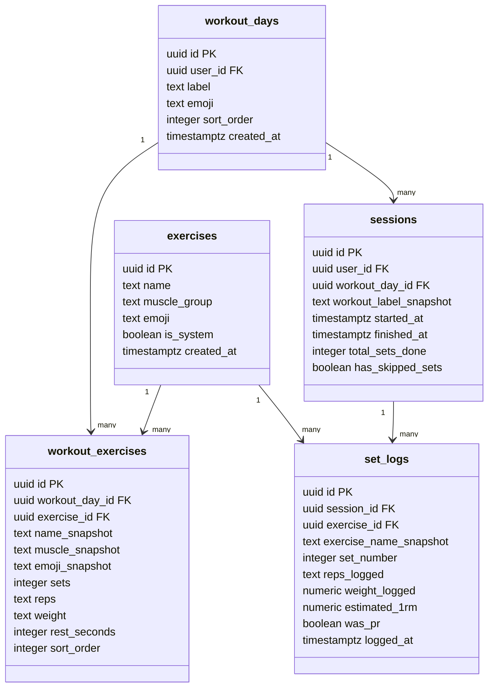
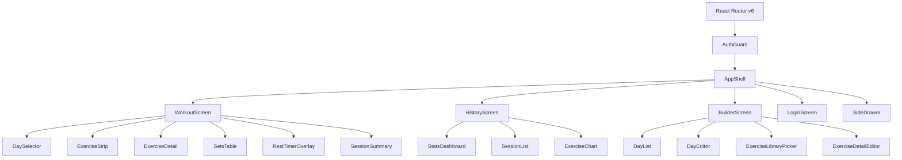

# Tech Plan — Workout App v2

## Architectural Approach

### Technology Stack


| Layer         | Choice                      | Rationale                                                                                        |
| ------------- | --------------------------- | ------------------------------------------------------------------------------------------------ |
| Build tool    | Vite                        | Fast HMR, native ESM, PWA plugin support                                                         |
| UI framework  | React 18 + TypeScript       | Type safety, component model                                                                     |
| Client state  | Jotai                       | Atomic model — fine-grained reactivity, no boilerplate store setup                               |
| Server state  | TanStack Query              | Caching, loading/error states, background refetch for ~6 query types                             |
| Routing       | React Router v6             | URL-based, native back-button support in PWA                                                     |
| Backend       | Supabase (Postgres + Auth)  | Auth, database, real-time, single SDK                                                            |
| Auth          | Google OAuth via Supabase   | One-tap login, no password management                                                            |
| PWA           | `vite-plugin-pwa` + Workbox | App shell caching, install prompt, background sync hooks                                         |
| Offline queue | localStorage                | Sufficient for single-user data volume; synchronous, zero dependencies                           |
| UI components | shadcn/ui                   | Accessible, unstyled-by-default components; customised to match the dark teal design system      |
| Theme system  | next-themes                 | Class-based (`dark` / `light`) theme switching, compatible with shadcn CSS variables             |
| Charts        | Recharts                    | React-native, composable, TypeScript-friendly (shadcn/ui chart primitives are built on Recharts) |


---

### Key Architectural Decisions

**1. Jotai for client state**  
The active workout session (current day, exercise index, all set data, timer start timestamp, PR flags, sync status) lives in Jotai atoms. Atoms are read/written from any component without prop drilling. The session atom is persisted to `localStorage` so a page refresh mid-workout recovers state. Timer state uses a timestamp-based approach (store `startedAt: number`, derive elapsed on render) so it survives background/foreground transitions accurately.

**2. TanStack Query for all Supabase reads**  
All remote data (session history, exercise library, last-session reference, workout programs) is fetched via TanStack Query hooks. This gives automatic caching, stale-while-revalidate, and loading/error states without manual `useEffect` chains. Mutations (logging a set, online workout-builder saves) go through TanStack Query mutations with targeted cache invalidation on success.

**3. Offline queue in localStorage (workout logging only, user-scoped)**  
Only workout logging actions (`set_log`, `session_finish`) are queued offline. Workout Builder mutations are **not** queued and require online connectivity. Queue/session persistence is scoped by `user_id`: queued records and resumable session state are stored per authenticated user and replayed only when the matching user signs in.

When a set/session is logged offline, a queue item is appended to that user's queue in `localStorage`. A `SyncService` module watches the `online` event and drains only the active user's queue to Supabase on reconnect, and also attempts a drain on app startup.

Replay safety uses **hardened best-effort dedupe** (still no strict idempotency key): each queued item carries a deterministic client fingerprint derived from stable fields (e.g., `session_id` + `exercise_id` + `set_number` + `logged_at`). Before insert, sync performs composite match checks and fingerprint comparison to reduce duplicate risk during retries. This remains an accepted trade-off versus strict DB-enforced idempotency.

**4. React Router v6 with 4 routes + PWA back policy**  
Routes: `/` (Workout), `/history`, `/builder`, `/login`. Auth guard redirects unauthenticated users to `/login`. In installed PWA context, system back behavior is explicit:

- from `/history` or `/builder`, back returns to `/`
- on `/`, back triggers an `Exit app?` confirmation instead of immediate close
- choosing Exit preserves active session state for resume on next open  
The session timer atom keeps ticking regardless of active route.

Install-prompt dismissal is persisted with a dedicated local key/state so the one-time banner behavior remains stable across reloads/restarts.

**5. Supabase client as singleton module**  
A single `supabase.ts` module exports the initialized Supabase client. Auth state is exposed via a Jotai atom derived from `supabase.auth.onAuthStateChange`. No React context wrapper needed for auth.

**6. shadcn/ui + next-themes as the UI foundation**  
shadcn/ui is not a traditional component library — it copies component source files directly into the project (via the CLI), making them fully owned and customisable. It is built on Radix UI primitives (accessible, headless) and styled with Tailwind CSS. Theme switching uses `next-themes` class strategy (`dark`/`light`) and shadcn CSS variables.

This means:

- Tailwind CSS is required and replaces the current inline CSS approach from v1
- CSS custom properties (`--bg`, `--teal`, etc.) from v1 map to shadcn-compatible CSS variables in `globals.css`
- shadcn components used: `Button`, `Input`, `Checkbox`, `Sheet` (side drawer), `Dialog` (confirmations), `Switch` (theme toggle), `Badge` (PR badge), `Tabs` (History screen), `ScrollArea`, `Separator`
- Custom components (`RestTimerOverlay`, `ExerciseStrip`, `SetsTable`) are built with Tailwind, not shadcn primitives

**7. TanStack Query invalidation strategy (targeted + optimistic patch)**  
After any successful mutation or offline replay batch:

- apply optimistic cache patch for currently visible workout/history data (instant UI freshness)
- then run targeted invalidation by key groups (not global):
  - history/session summaries
  - exercise trend series
  - last-session reference by exercise
  - PR-related aggregates

This keeps UI immediately responsive while still converging to server truth without full-cache churn.

**8. PR detection — compute on the fly**  
When a set is checked, the app queries TanStack Query's cache (or Supabase) for all historical sets for that `exercise_id`, computes estimated 1RM for each using the Epley formula (`weight × (1 + reps/30)`), and compares against the current set's 1RM. If it's a new best, the PR atom for that exercise is set to `true` for the session. No materialized table needed.

**9. Rest notification permission as required setup**  
Background rest alerts require notification permission. Notification permission is treated as required setup before timer features are fully enabled. If not granted, the app keeps the user in a setup state for timer capabilities until permission is accepted.

---

### Failure Mode Analysis


| Failure                            | Behavior                                                                                                         |
| ---------------------------------- | ---------------------------------------------------------------------------------------------------------------- |
| Offline mid-workout                | Set logs queue to localStorage; workout continues uninterrupted                                                  |
| Supabase down on session finish    | Session saved to queue; auto-synced on reconnect                                                                 |
| Auth token expired mid-session     | Supabase SDK auto-refreshes; if refresh fails, user sees sign-in prompt after session ends                       |
| Account switch with pending queue  | Queue/session data is user-scoped; only matching `user_id` queue is replayed after sign-in                       |
| App backgrounded during rest timer | Timer uses `startedAt` timestamp; on foreground, elapsed time is computed correctly                              |
| Notification permission denied     | Timer features requiring background alerts remain blocked behind required setup until permission is granted      |
| localStorage full                  | Extremely unlikely for single user; if it occurs, show sync warning and continue in-memory until space available |
| Builder opened while offline       | Builder shows full-screen offline block state with explicit “Internet required for editing” notice               |


---

## Data Model

### Entity Relationship



### Table Notes

`**exercises**` — The exercise library catalogue. `is_system = true` for pre-seeded entries; `false` for user-created ones. Shared reference table.

`**workout_days**` — User's workout programs. Replaces the hardcoded `WORKOUTS` constant from v1. Scoped to `user_id`.

`**workout_exercises**` — Snapshot model: `name_snapshot`, `muscle_snapshot`, `emoji_snapshot` are copied from the library at creation time. `exercise_id` is retained as a foreign key for history queries — it is the stable identity used to group set logs across sessions.

`**sessions**` — One row per completed workout. `workout_label_snapshot` captures the day label at session time so history remains accurate even if the user later renames the day.

`**set_logs**` — One row per checked set. `estimated_1rm` is computed and stored at log time (Epley formula). `was_pr` is set to `true` if this set's 1RM exceeded all prior `estimated_1rm` values for the same `exercise_id`. Both fields are stored for fast history queries without recomputing.

### Offline Queue Schema (localStorage)

```
queuedMutationsByUser: Record<string, Array<{
  type: 'set_log' | 'session_finish',
  payload: SetLogPayload | SessionPayload,
  queuedAt: number,
  dedupeComposite: {
    sessionId: string,
    exerciseId?: string,
    setNumber?: number,
    loggedAt?: string
  },
  fingerprint: string
}>>
```

Items are appended on action, drained in order on reconnect. Failed items remain in queue and retry on next reconnect.

---

## Component Architecture

### Layer Overview



### Component Responsibilities

`**AppShell**`

- Renders the top bar (timer chip, sync status chip, rest button)
- Renders `SideDrawer` overlay
- Provides the layout frame for all screens
- Reads `sessionAtom` to show active timer in top bar from any screen

`**AuthGuard**`

- Reads the Supabase auth atom
- Redirects to `/login` if unauthenticated
- Renders children when authenticated

`**SideDrawer**`

- Reads user profile from auth atom
- Renders nav links (History, Builder) and Settings (theme toggle, install, sign out)
- Sign-out triggers confirmation dialog if `sessionAtom.isActive === true`

`**WorkoutScreen**`

- Orchestrates the full workout flow
- Reads `workout_days` + `workout_exercises` via TanStack Query
- Writes to `sessionAtom` (current day, exercise index, set data)
- Delegates to `DaySelector`, `ExerciseStrip`, `ExerciseDetail`, `SetsTable`, `RestTimerOverlay`, `SessionSummary`

`**SetsTable**`

- Renders editable set rows (reps, weight, done checkbox)
- On set check: computes 1RM, queries history via TanStack Query, sets PR atom if new best, enqueues set log via `SyncService`
- Shows "Last time: …" reference line from TanStack Query cache

`**RestTimerOverlay**`

- Full-screen overlay triggered by set check
- Reads `restAtom` (startedAt, durationSeconds)
- Derives remaining time from `Date.now() - startedAt` on each render tick
- Requires notification permission setup before enabling full timer capabilities
- Schedules local notification via Web Notifications API when rest ends

`**HistoryScreen**`

- Fetches sessions + set_logs via TanStack Query
- Renders `StatsDashboard` (totals), `SessionList` (expandable rows), `ExerciseChart` (Recharts line chart)
- Read-only; no mutation actions

`**BuilderScreen**`

- Fetches `workout_days` + `workout_exercises` via TanStack Query
- Mutations run via TanStack Query **only when online** (no offline queue for Builder)
- When offline, screen renders a full-screen block state: "Internet required for editing"
- Shows "Saved ✓" / "Syncing failed" status for online save attempts
- Renders `DayList`, `DayEditor`, `ExerciseLibraryPicker`, `ExerciseDetailEditor` only when online

`**ExerciseLibraryPicker**`

- Fetches `exercises` table via TanStack Query
- Searchable list; tapping an exercise adds it to the current day with snapshot fields copied

### Jotai Atom Map


| Atom                     | Type                                            | Purpose                                                        | Persisted                                |
| ------------------------ | ----------------------------------------------- | -------------------------------------------------------------- | ---------------------------------------- |
| `authAtom`               | `User                                           | null`                                                          | Supabase auth state                      |
| `sessionAtom`            | `SessionState`                                  | Active workout: day, exIdx, setsData, startedAt, totalSetsDone | Yes                                      |
| `prFlagsAtom`            | `Record<exerciseId, boolean>`                   | PR badges for current session                                  | No                                       |
| `restAtom`               | `{ startedAt, durationSeconds }                 | null`                                                          | Active rest timer                        |
| `syncStatusAtom`         | `'idle'                                         | 'syncing'                                                      | 'failed'                                 |
| `queueSyncMetaAtom`      | `{ lastSyncAt?: number, pendingCount: number }` | Sync metadata shown in top bar/status UI                       | Yes                                      |
| `themeAtom`              | `'dark'                                         | 'light'`                                                       | Mirrored from `next-themes` active class |
| `installPromptStateAtom` | `{ dismissed: boolean }`                        | One-time install banner dismissal state                        | Yes                                      |
| `drawerOpenAtom`         | `boolean`                                       | Side drawer visibility                                         | No                                       |


### SyncService (non-React module)

A plain TypeScript module (not a component) responsible for:

- Appending workout logging items (`set_log`, `session_finish`) to user-scoped local queue in localStorage
- Creating deterministic fingerprint per queued item for hardened best-effort dedupe
- Listening to `window.addEventListener('online', ...)` to trigger drain
- Draining only the active user's queue sequentially to Supabase on reconnect using composite + fingerprint dedupe checks
- Updating `syncStatusAtom` and `queueSyncMetaAtom` throughout the process
- Applying optimistic cache patches for visible screens, then triggering targeted TanStack Query invalidation
- Called by `SetsTable` and session-finish flow (not by BuilderScreen)

&nbsp;