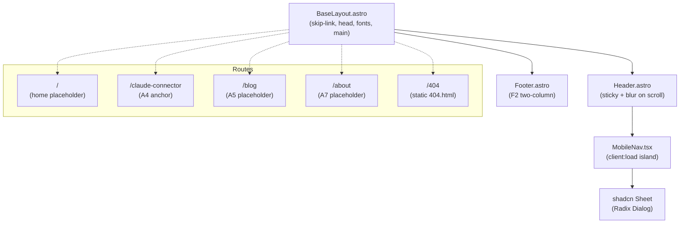
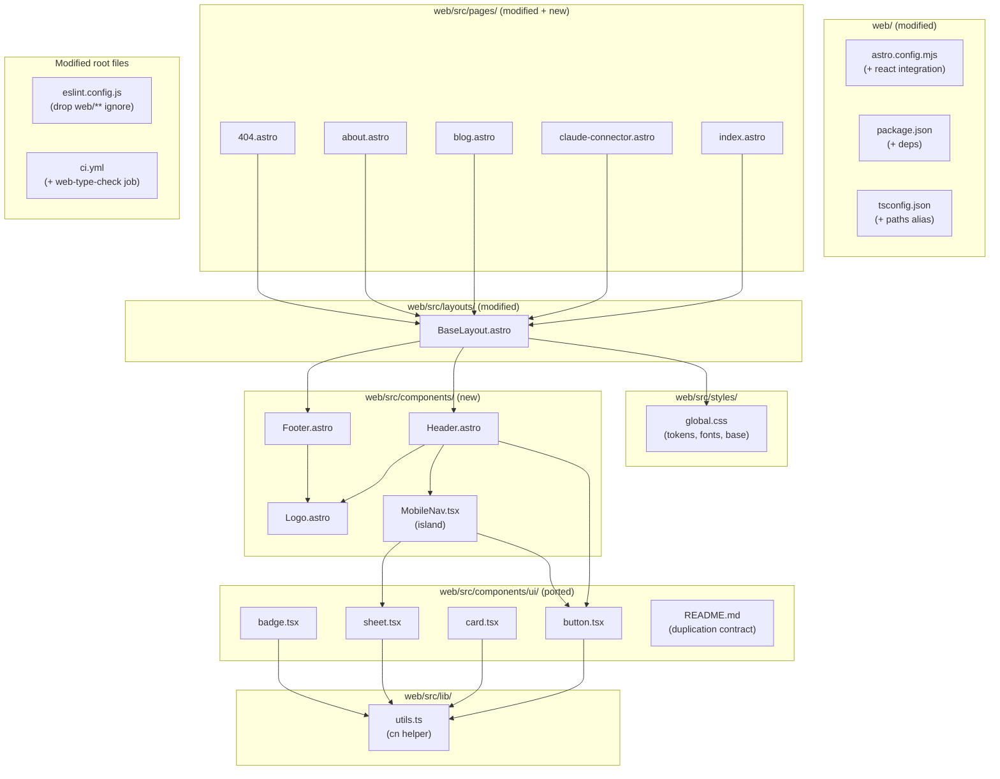

# Tech Plan — A2 Layout / Nav / Footer (#300)

## Architectural Approach

### Key Decisions

| Decision | Choice | Rationale |
|---|---|---|
| Token naming | **Long** — `--color-background`, `--color-foreground`, `--color-muted`, `--color-accent`, `--color-accent-foreground`, `--color-border`, `--color-card` | 80% of ported shadcn classes work unchanged. "Minimal" is about token *count*, not characters. |
| Token count | **7** | Card primitive has fill; dropping `--color-card` would break Card. Trade-off accepted. |
| Variant trim | Button: `default` / `outline` / `ghost`. Badge: `default` / `outline`. Sheet: only `right`. | Ship only what A2 consumes. Drop `secondary` / `destructive` / `link` from Button, `secondary` / `destructive` from Badge. Document as deliberate scope cut. |
| React integration | **`@astrojs/react`** | Required for shadcn type-compat. Islands isolate JS to routes using them. |
| Font delivery | **`@fontsource-variable/geist` + `@fontsource-variable/geist-mono`** | Designed for non-Next frameworks. Ships WOFF2 + `@font-face`. Rejected: the `geist` npm package (Next-only). |
| Font preload `<link>` tags | **Skipped** | Astro fingerprints assets; preload hrefs are hard to predict. `font-display: swap` + size-adjusted fallback hits CLS=0 without preload. Re-add later if FOIT metrics surface issues. |
| Fallback font metrics | **Conservative starting values**, revisit if CLS > 0 | Pragmatic — values in `global.css` are good first approximation; precise computation is polish. |
| Slide animations | **`tw-animate-css`** | Required by ported Sheet (uses `animate-in`, `slide-in-from-right`, etc.). SPA already depends on it — same imports work in Astro's PostCSS pipeline. |
| Drawer base | **shadcn `Sheet` (Radix Dialog)**, ported verbatim | Battle-tested a11y (focus trap, scroll lock, escape, click-outside, body inertness). Hand-rolled ≈ 80 lines of careful JS. |
| Drawer slide direction | **`right`** | Locked in grilling. Docs-site feel over iOS bottom-sheet. |
| Mobile nav island hydration | **`client:load`** | Drawer must be interactive on first tap. ~35KB hydrated (React+ReactDOM+Radix Dialog+CVA). |
| Sticky-header backdrop trigger | Vanilla `<script>` toggling `data-scrolled` attribute | ~6 lines. Tailwind v4 `data-[scrolled=true]:bg-background/70 backdrop-blur-md` selector handles styling. No JS framework needed. |
| Active link state | `aria-current="page"` from `Astro.url.pathname` + `data-[aria-current=page]:` Tailwind selector | A11y attribute IS the styling source. Single source of truth. |
| Icons | **`lucide-static`** for static SVGs in Astro components, **`lucide-react`** for icons inside the React island | Static where possible (Header logo, GitHub icon). Dynamic only inside MobileNav (hamburger), accept marginal duplication. |
| ESLint scope | Drop `web/**` from root `globalIgnores`. Existing `**/*.{ts,tsx}` glob now covers `web/src/**/*.tsx`. Mirror the `ui/**` `react-refresh` exemption. | One config to maintain. ~3 line diff. |
| `.astro` file linting | **Skip** — `astro check` is the dedicated tool | ESLint Astro plugin is dep weight without payoff for our scale. |
| Type-check for `web/` | New CI job **`web-type-check`** running `cd web && npx astro check`, paths-filtered on `web/**` | A1's `tsc -b` skips `web/` deliberately. With React TSX shipping, type errors can ship silently. |
| Web type-check merge gate | Add `web-type-check` to `web-checks-passed`'s `needs:` and AND it into the success condition | Mirrors A1's deploy gating pattern. SPA-only PRs see it skipped, `web/**` PRs see it required. |
| Type errors surfaced by first `astro check` | **Fix in A2** | Current `web/` is ~50 lines, low risk. Keep PR atomic. |
| 404 page | `web/src/pages/404.astro` | Astro emits `404.html`, Vercel serves on miss. ~15 lines. |
| `cn()` helper | Copy `file:src/lib/utils.ts` minus `groupBy()` | One-liner `clsx + twMerge` wrapper, plus deps `clsx` + `tailwind-merge`. |
| Tailwind content detection | Add `@source './**/*.{astro,tsx,ts}'` in `global.css` | Belt-and-suspenders; Tailwind v4 auto-detection should work but explicit is safer. |
| Header sticky positioning | `sticky top-0 z-40` | Avoids CLS on scroll-anchor recalculation when the backdrop class toggles. |

### Critical Constraints

**Root `tsc -b` and root ESLint rules must stay unchanged in behavior.** The only edits to root files are: (a) `file:eslint.config.js` drops `web/**` from `globalIgnores` and adds one block mirroring the SPA's `ui/**` exemption; (b) `file:.github/workflows/ci.yml` gains one new job (`web-type-check`) and that job's name is added to `web-checks-passed.needs`. All other SPA jobs are byte-identical.

**Brand teal across the public surface is `#00c9a7`, not the SPA's `--primary` (`#00c9b1`).** Locked in the Brief. The 0.4% hue drift between SPA app token and public surface accent is acknowledged technical debt; reconciliation lives outside A2.

**`tw-animate-css` import order is load-bearing** — must come after `@import "tailwindcss"` in `web/src/styles/global.css`, mirroring `file:src/styles/globals.css` line 1-2. Inverting the order produces silent class resolution failures on `slide-in-from-*` utilities.

**The class-substitution table (below) IS the port contract.** Every ported primitive must apply the table or the rendered output drifts from the SPA's visual language. The README in `web/src/components/ui/` enforces this in human-readable form.

**Routes deployed in A2 are URL-stable from this point on.** `/claude-connector` in particular feeds #296 (Anthropic Connectors Directory). Renaming = redirect work.

**Brief drift acknowledged** — Brief said "via the `geist` npm package" and "preload WOFF2"; plan switches to `@fontsource-variable/geist` and skips preload. Both deviations are deliberate and documented in Key Decisions.

---

## Data Model

A2 has no persistent data model. The load-bearing artifacts are three:

1. **The 7-token color system** (`web/src/styles/global.css`)
2. **The SPA→A2 class substitution table** (applied during shadcn primitive port)
3. **The 5-route topology** with chrome composition

### 1. Token System

```css
/* web/src/styles/global.css */
@import "tailwindcss";
@import "tw-animate-css";
@import "@fontsource-variable/geist";
@import "@fontsource-variable/geist-mono";

@source './**/*.{astro,tsx,ts}';

@theme {
  --color-background: #0f0f13;
  --color-foreground: #f2f2f2;
  --color-muted: #999999;
  --color-accent: #00c9a7;
  --color-accent-foreground: #000000;
  --color-border: #2d2d37;
  --color-card: #1a1a22;

  --font-sans: 'Geist Variable', 'Geist Fallback', system-ui, sans-serif;
  --font-mono: 'Geist Mono Variable', ui-monospace, 'SF Mono', monospace;

  --radius-md: 0.5rem;
  --radius-lg: 0.75rem;
}

@font-face {
  font-family: 'Geist Fallback';
  src: local('Arial');
  size-adjust: 105%;
  ascent-override: 95%;
  descent-override: 22%;
  line-gap-override: 0%;
}

@layer base {
  body {
    @apply bg-background text-foreground font-sans antialiased;
  }
  :focus-visible {
    @apply outline-2 outline-offset-2 outline-accent;
  }
}
```

Contrast verification (against `#0f0f13` background):

| Token | Hex | Contrast on bg | WCAG |
|---|---|---|---|
| `foreground` | `#f2f2f2` | 16.9:1 | AAA |
| `muted` | `#999999` | 8.0:1 | AAA |
| `accent` | `#00c9a7` | 8.4:1 | AAA |
| `border` | `#2d2d37` | n/a (decorative) | — |

### 2. Class Substitution Table (Port Contract)

| SPA class | A2 class | Reason |
|---|---|---|
| `bg-background` | `bg-background` | unchanged |
| `text-foreground` | `text-foreground` | unchanged |
| `bg-card` | `bg-card` | unchanged |
| `text-card-foreground` | `text-foreground` | A2 has no separate card-fg; base fg works (sober aesthetic) |
| `text-muted-foreground` | `text-muted` | renamed (SPA's var was `--muted-foreground`) |
| `border-border` | `border-border` | unchanged |
| `bg-primary` | `bg-accent` | A2's "brand color" lives under `accent` |
| `text-primary-foreground` | `text-accent-foreground` | renamed |
| `border-input` | `border-border` | A2 has no separate input border |
| `bg-secondary`, `text-secondary-foreground` | **drop** | only used in trimmed Button variants (gone) |
| `bg-destructive`, `text-destructive-foreground` | **drop** | trimmed |
| `bg-accent` (SPA's *hover surface*) | `bg-foreground/10` | conflict — our `--accent` is the teal, not a hover gray |
| `text-accent-foreground` (SPA's hover) | `text-foreground` | matching above |
| `ring-ring` | `ring-accent` | A2 has no separate ring token; accent as focus ring is fine |
| `ring-offset-background` | `ring-offset-background` | unchanged |
| `shadow-xs` (Card) | `shadow-xs` | Tailwind utility, no token dependency |

### 3. Route Topology



### Table Notes

- **Header → MobileNav** is the only React boundary in the chrome. Header is `.astro` (SSG); MobileNav is `.tsx` with `client:load`. Tab order on desktop never crosses this boundary because MobileNav renders `md:hidden`.
- All 5 routes share `BaseLayout` — no per-route layout overrides in A2.
- The home placeholder at `/` REPLACES the existing `web/src/pages/index.astro` content (does not coexist).

---

## Component Architecture

### Layer Overview



### New Files & Responsibilities

| File | Purpose |
|---|---|
| `web/src/styles/global.css` | **Modified** — replaces single `@import "tailwindcss"`. Adds `tw-animate-css` + Geist Fontsource imports, `@theme` block with 7 color tokens + 2 font tokens + 2 radius tokens, `@font-face` for `Geist Fallback`, `@source` directive, base layer styles |
| `web/src/lib/utils.ts` | **New** — `cn()` helper (clsx + twMerge wrapper), copied verbatim from `file:src/lib/utils.ts` minus `groupBy()` |
| `web/src/components/ui/button.tsx` | **New** — ported from `file:src/components/ui/button.tsx`, palette rewired per substitution table, variants trimmed to `default` / `outline` / `ghost`, sizes kept (`default` / `sm` / `lg` / `icon`) |
| `web/src/components/ui/card.tsx` | **New** — ported from `file:src/components/ui/card.tsx`, `bg-card` kept, `text-card-foreground` → `text-foreground` |
| `web/src/components/ui/sheet.tsx` | **New** — ported from `file:src/components/ui/sheet.tsx`, sides trimmed to `right` only, palette rewired, `bg-secondary` (close-button hover state) → `bg-foreground/10`, `ring-ring` → `ring-accent` |
| `web/src/components/ui/badge.tsx` | **New** — ported from `file:src/components/ui/badge.tsx`, variants trimmed to `default` / `outline`, palette rewired |
| `web/src/components/ui/README.md` | **New** — documents (a) the duplication trade-off, (b) the substitution table as the port contract, (c) the manual sync expectation when SPA primitives evolve |
| `web/src/components/Logo.astro` | **New** — composable mark + wordmark. Props: `size?: 'sm' \| 'md'` (default `md`). Renders `lucide-static` Dumbbell SVG (stroke 2.25, accent fill via `currentColor`) + "GymLogic" wordmark in Geist Sans semibold. `sm` = 24px icon + `text-base`. `md` = 32px icon + `text-lg`. |
| `web/src/components/Header.astro` | **New** — sticky `top-0 z-40` header. Inner: `Logo` (left, links to `/`), desktop nav (3 items, hidden below `md:`), GitHub icon link + Launch app outline Button (right), MobileNav trigger (`md:hidden`). Inline `<script>` toggles `data-scrolled` attribute on the `<header>` element on scroll past 8px. Style: `data-[scrolled=true]:bg-background/70 data-[scrolled=true]:backdrop-blur-md data-[scrolled=true]:border-b data-[scrolled=true]:border-border/50 transition-colors duration-200`. Computes `aria-current="page"` per nav link from `Astro.url.pathname`. |
| `web/src/components/Footer.astro` | **New** — F2 two-column. Left: `Logo size="sm"` + tagline ("Workout app + AI coaching, public craft surface") + © year. Right: three vertical micro-link groups in a `grid grid-cols-3 gap-8` — **Project** (GitHub, Launch app), **Docs** (Claude connector, Blog, About), **Legal** (Privacy → `gymlogic.me/privacy`). Wrapped in `border-t border-border` + `mt-24 py-12`. |
| `web/src/components/MobileNav.tsx` | **New** — React island, `client:load`. Renders Sheet trigger (hamburger icon Button) + Sheet content with stacked nav links + GitHub + Launch app CTAs. Receives `currentPath: string` prop from Header for active state. |
| `web/src/layouts/BaseLayout.astro` | **Modified** — adds skip-to-content link as first focusable in `<body>`, wraps with `<Header />` + `<main id="main">` + `<Footer />`, `import '../styles/global.css'` already present. Props: `title`, `description?`. `<head>` keeps `<meta name="robots" content="noindex">` from A1. |
| `web/src/pages/index.astro` | **Modified** — refactor to use new BaseLayout chrome, sober "GymLogic — coming soon" h1 + brief tagline + tracked-by-#301 issue link |
| `web/src/pages/claude-connector.astro` | **New** — placeholder, "Claude connector setup" h1 + "Coming soon" + tracked-by-#302 link |
| `web/src/pages/blog.astro` | **New** — placeholder, "Blog" h1 + "Coming soon" + tracked-by-#303 link |
| `web/src/pages/about.astro` | **New** — placeholder, "About" h1 + "Coming soon" + tracked-by-#305 link |
| `web/src/pages/404.astro` | **New** — sober "Page not found" + Home + Launch app CTAs |
| `web/astro.config.mjs` | **Modified** — add `import react from '@astrojs/react'` and `integrations: [react()]` |
| `web/package.json` | **Modified** — add deps: `@astrojs/react`, `@astrojs/check`, `react`, `react-dom`, `@radix-ui/react-dialog`, `@radix-ui/react-slot`, `class-variance-authority`, `clsx`, `tailwind-merge`, `tw-animate-css`, `lucide-static`, `lucide-react`, `@fontsource-variable/geist`, `@fontsource-variable/geist-mono`, `@types/react`, `@types/react-dom` |
| `web/tsconfig.json` | **Modified** — add `compilerOptions.baseUrl: '.'` + `paths: { '@/*': ['./src/*'] }` (matches SPA's alias for ported components) |
| `file:eslint.config.js` (root) | **Modified** — drop `web/**` from `globalIgnores` (keep `web/dist`, `web/.astro`); add `web/src/components/ui/**/*.{ts,tsx}` to the existing `react-refresh` exemption block |
| `file:.github/workflows/ci.yml` | **Modified** — add new `web-type-check` job (paths-filtered on `web/**`, runs `cd web && npm ci && npx astro check`); add it to `web-checks-passed.needs:` and update its success condition to require both `preview-deploy-web` AND `web-type-check` to be `success` or `skipped` |

### Component Responsibilities

**`Logo.astro`**

- Renders Dumbbell SVG via `lucide-static` import + literal `<svg>` insertion (Astro pattern). Accent color via `text-accent` on the wrapper.
- Wordmark "GymLogic" in `font-sans font-semibold tracking-tight`.
- Wrapped in an `<a href="/">` only when used in Header; Footer renders without anchor (already inside footer's link grid).

**`Header.astro`**

- Outer: `<header id="site-header" class="sticky top-0 z-40 transition-colors duration-200 ...">`. Conditional backdrop classes use Tailwind v4's data-attribute selector: `data-[scrolled=true]:bg-background/70 data-[scrolled=true]:backdrop-blur-md`.
- Desktop nav: `<nav aria-label="Primary" class="hidden md:flex md:gap-6">` with 3 links (Claude connector / Blog / About). Each link gets `aria-current` computed in frontmatter from `Astro.url.pathname.startsWith(href)`.
- Inline `<script>` (~6 lines): listens to `scroll`, toggles `data-scrolled` attribute on `#site-header` past 8px. Runs once at script load to handle SSR-mismatch on refresh-mid-scroll.
- Mobile trigger: `<MobileNav client:load currentPath={Astro.url.pathname} />` rendered with `class="md:hidden"`.

**`MobileNav.tsx`** (React, hydrated)

- Wraps shadcn `Sheet` (`side="right"`).
- `SheetTrigger` is an icon Button (hamburger from `lucide-react` — accept the marginal duplication; only this island has the dep).
- `SheetContent` renders the full nav stack: 3 nav links (with `aria-current` based on `currentPath` prop), separator, GitHub link, Launch app Button.
- On link click, the Sheet's controlled-state callback closes the drawer (Radix Dialog's `onOpenChange`). Native page navigation handles the rest.

**`Footer.astro`**

- Two-column flex on desktop, stacked on mobile (`flex-col md:flex-row`).
- Right grid: `grid grid-cols-3 gap-8` for Project / Docs / Legal groups.
- All links use the same hover treatment as the header for consistency: `text-muted hover:text-foreground transition-colors duration-150`.

**`BaseLayout.astro`**

- Inserts skip-to-content link as first child of `<body>`: `<a href="#main" class="sr-only focus:not-sr-only focus:absolute focus:top-2 focus:left-2 ...">Skip to content</a>`.
- Wraps slot with `<Header />` + `<main id="main">` + `<Footer />`.
- `<head>` preserves `<meta name="robots" content="noindex">` from A1.

**`Button.tsx`** (ported)

- CVA variants reduced to: `default` (`bg-accent text-accent-foreground hover:bg-accent/90`), `outline` (`border border-border bg-background hover:bg-foreground/10`), `ghost` (`hover:bg-foreground/10 hover:text-foreground`).
- Sizes unchanged from SPA: `default` / `sm` / `lg` / `icon`.
- `asChild` prop kept (uses Radix Slot — needed for nesting `<a>`s as buttons in Astro).

**`Sheet.tsx`** (ported)

- `sheetVariants` reduced to side `right` only (drops top/bottom/left).
- Overlay class unchanged (`bg-black/80`).
- Close button hover `data-[state=open]:bg-secondary` rewritten to `data-[state=open]:bg-foreground/10`.
- All `data-[state=open]:animate-in` / `slide-in-from-right` classes preserved — depend on `tw-animate-css` import.

**`Card.tsx`** (ported)

- Drop `text-card-foreground` (use base `text-foreground`).
- Keep `bg-card border` + sub-components (`CardHeader`, `CardTitle`, `CardDescription`, `CardContent`, `CardFooter`).

**`Badge.tsx`** (ported)

- Variants reduced to: `default` (`border-transparent bg-accent text-accent-foreground hover:bg-accent/80`), `outline` (`text-foreground border-border`).

### Failure Mode Analysis

| Failure | Behavior |
|---|---|
| Token rename misses one ported class (e.g., `bg-primary` left unrewritten) | Tailwind silently emits no styles for that class. Visual regression: button has no background. **Detection**: visual smoke check on each primitive in dev + Lighthouse contrast audit. **Resolution**: substitution table is the port contract; reviewer enforces. |
| `tw-animate-css` fails to load on Astro PostCSS pipeline | Sheet renders without slide animation (snap open/close). Functionality intact. **Detection**: visual smoke + dev-server warnings. **Mitigation**: SPA already proves the import works in v4 + PostCSS context. |
| Geist variable WOFF2 fails to load (CDN issue, etc.) | `Geist Fallback` renders with Arial metrics. CLS = 0 (size-adjust matches). **Detection**: Lighthouse audit. **Resolution**: Fontsource is locally bundled at build, so this requires npm install corruption — not a runtime risk. |
| `@astrojs/react` integration breaks Astro 6 (rolldown-vite incompat) | Build fails. PR blocked. **Mitigation**: `@astrojs/react` is officially supported on Astro 6; if a specific version regresses, pin to known-good. |
| MobileNav React island hydration error | Hamburger button non-functional on mobile. **Detection**: manual mobile test + console error. **Mitigation**: error boundary inside MobileNav.tsx (returns degraded "View nav links" anchor list as fallback). |
| `astro check` job is slow (~30s) | CI minutes burn. Acceptable; runs only on `web/**` PRs (paths-filtered). |
| `astro check` finds existing type errors in current `web/` codebase | First A2 PR fails type-check. **Resolution**: fix as part of A2 (current `web/` has only ~50 lines, low risk). |
| Sticky header backdrop flickers at scrollY ≈ 8 | Acceptable hysteresis; transition-duration smooths visually. If pathological, raise threshold to 12px. |
| Tailwind v4 doesn't auto-detect `.astro` files | No utility classes emit for those files. **Mitigation**: explicit `@source './**/*.{astro,tsx,ts}'` in `global.css`. |
| Geist Fallback metrics are wrong | Visible reflow on font swap. **Detection**: Lighthouse CLS. **Resolution**: source metrics from Fontsource README or compute via fontkit. The values in the plan are conservative starting points; revisit only if CLS > 0 in production. |
| Drop of `web/**` from root ESLint `globalIgnores` floods CI with new errors | First A2 PR fails lint. **Resolution**: fix as part of A2 (ported components are already lint-clean in SPA). |
| `web-type-check` job missing `node_modules` cache | Slow first run (~60s). **Mitigation**: `actions/setup-node@v4` with `cache: npm` already standard in `ci.yml`. |
| Privacy link to `gymlogic.me/privacy` breaks if SPA route renames | Cross-domain dead link. **Mitigation**: SPA's PrivacyPage is stable, low rename risk. Annual sanity check. |
| `aria-current="page"` doesn't update on client-side nav | N/A — Astro is SSG-only, every nav is a full page reload. |
| `lucide-static` icon SVGs are stale vs `lucide-react` versions | Mismatch between header icons (static) and any lucide-react usage in islands. **Mitigation**: pin same lucide major version in `package.json`. |
| Vercel build cache staleness on font assets | Fonts serve old hash. **Mitigation**: Astro's content-hash fingerprinting handles this; Fontsource imports are content-hashed. |
| Sheet's controlled-state link-click-close conflicts with Radix Dialog defaults | Drawer doesn't close on link click, or page flash on navigate. **Mitigation**: explicitly call `setOpen(false)` in `onClick` handler before native navigation; verify in dev on first PR. |
| `web-checks-passed` AND-logic regression | If shell logic combining `preview-deploy-web` + `web-type-check` results is wrong, PRs may be blocked or unblocked incorrectly. **Mitigation**: validate on a sample SPA-only PR (both should be `skipped` → pass) and a `web/**` PR (both `success` → pass). |

---

## Implementation Notes

Breadcrumbs for the implementer (probably future me):

- **Astro frontmatter import order matters** for fonts. `@fontsource-variable/geist` is imported in `global.css` (not in frontmatter), since it ships CSS that needs to flow through Tailwind's PostCSS pipeline.
- **`@font-face` for `Geist Fallback`** must come AFTER the Fontsource imports in `global.css` so it doesn't override the real Geist `@font-face` declarations.
- **Tailwind v4's `data-` selector** is the way to style based on attribute: `data-[scrolled=true]:bg-background/70`. Don't use the v3 `[data-scrolled=true]:` raw selector pattern — both work but v4-native is cleaner.
- **`aria-current` on Astro nav links**: compute in frontmatter, e.g., `const isActive = (href: string) => Astro.url.pathname === href || (href !== '/' && Astro.url.pathname.startsWith(href))`. Apply as `aria-current={isActive(href) ? 'page' : undefined}`.
- **Sheet's controlled state** for click-link-closes: pass `open` and `onOpenChange` to Sheet. On link click, call `setOpen(false)` then trigger navigation (Astro link is a regular `<a>`; setOpen runs synchronously, navigation happens after).
- **`@source` directive** in Tailwind v4 css must be at module scope, not inside a `@layer`. Place it after `@import "tailwindcss"` and before `@theme`.
- **`Astro.url.pathname` includes trailing slash conventions**. `/about` and `/about/` may both be valid Vercel paths; normalize before comparison: `Astro.url.pathname.replace(/\/$/, '') || '/'`.
- **`web-type-check` CI job** can reuse the same Vercel-style `cd web && npm ci` pattern used by `preview-deploy-web`. ~+15s for npm ci, ~+15s for `astro check`. Total ~30s per `web/**` PR.
- **Ported `Sheet.tsx` keeps the Radix `displayName`s** — useful for React DevTools debugging on the only React island we ship.

---

## References

- Epic Brief: `file:docs/Epic_Brief_—_A2_Layout_Nav_Footer_#300.md`
- Parent epic: #298
- This ticket: #300
- Sibling tickets: #299 (A1 — shipped), #301 (A3), #302 (A4), #303 (A5), #304 (A6), #305 (A7)
- A1 Tech Plan: `file:docs/Tech_Plan_—_Astro_Bootstrap_#299.md`
- SPA design tokens: `file:src/styles/globals.css`
- SPA shadcn primitives (port sources): `file:src/components/ui/button.tsx`, `file:src/components/ui/card.tsx`, `file:src/components/ui/sheet.tsx`, `file:src/components/ui/badge.tsx`
- SPA `cn()` helper: `file:src/lib/utils.ts`
- Existing root ESLint config: `file:eslint.config.js`
- Existing CI config: `file:.github/workflows/ci.yml`
- Existing Astro config (modified): `file:web/astro.config.mjs`
- Existing layout (modified): `file:web/src/layouts/BaseLayout.astro`
