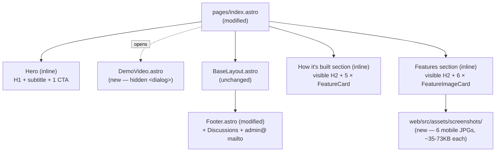
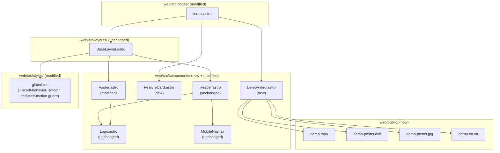

# Tech Plan — A3 Home Page (#301)

> **Status: Shipped.** The body of this plan documents the design exploration; several decisions evolved during implementation. See the **[Iteration Log](#iteration-log--plan-to-shipped)** at the bottom of this document for the diff between this plan and what actually shipped. Notable deviations:
>
> - Hero CTA button removed — the inline demo video itself is the trigger
> - Demo became **two phone-recorded clips side-by-side** (capabilities + analytics) instead of a single landscape Claude Desktop video
> - Features carousel pivoted from CSS scroll-snap → **auto-scrolling marquee inside a tinted full-bleed band** (`--color-surface`)
> - Features card order swapped — **AI program generation** leads, not Strength Balance
> - Features + Engineering subtitles rewritten with a proper visual hierarchy (large foreground lead + descriptive paragraph)
> - Header / Footer / 404 CTA renamed `Launch app` → `Open app`
> - Card #5 ("Agentic engineering, with receipts") link target swapped from GitHub Actions → **filtered list of merged PRs** (richer receipts: spec + ticket + tests + review trail per artifact)

## Architectural Approach

### Key Decisions

| Decision | Choice | Rationale |
|---|---|---|
| Audience framing | **Devs / peers / recruiters / MCP community first**; fitness end-users not this page's target | Locked in grilling Q1. Drives every copy choice. End-user pitch lives on `gymlogic.me` itself. |
| Hero H1 | **"The agentic workout app."** | Locked Q2. Issue's working title *"Stop being the brain. Become the body."* demoted to a parenthetical inside the subtitle (decodes itself instead of riddling the visitor). |
| Hero subtitle | *MCP-native and **open-source**. Bring your own agent — your program lands in the app, you lift. (Stop being the brain. Become the body.)* | "open-source" is keyword-hyperlinked to GitHub repo. "Bring your own agent" decided over "Talk to Claude" (Q3) for vendor-agnosticism — true to MCP-as-open-standard. |
| Hero CTA | **Single CTA: "Watch the demo"** as `<button data-demo-trigger>` opening the demo modal | Locked Q3 (primary CTA flipped from issue's "Open the app"). Visual-review iterations: (1) secondary CTAs *"Connect with Claude"* and *"How I work"* dropped as redundant with Header nav; (2) "↓" arrow dropped — no longer scrolling. The features grid cards #1 and #4 still serve as warmer deep doorways. Less UI = more craft signal. |
| Demo presentation | **Cinema-mode `<dialog>` modal** — clicking the hero CTA opens a centered modal with autoplay video + close button + dark overlay. Native HTML `<dialog>` element, vanilla JS (~30 lines), no React island. | Visual-review iteration after first render: inline scroll-target section under-delivered on the "Watch the demo" CTA promise (~2-inch scroll). Modal honors the CTA promise (button → video plays), removes a section from the page (cleaner Hero → Features → Footer rhythm), better mobile experience (16:9 video can fill viewport). Walks back the "no JS for video" stance from initial plan, but only ~30 lines of vanilla `<script>`, no bundle weight. |
| Demo modal a11y | Native `<dialog>.showModal()` provides focus trap + ESC-to-close. Custom click-outside-to-close + backdrop styling via `[&::backdrop]:` Tailwind selector. | Native `<dialog>` is the lightest modal implementation with first-class a11y in 2026. Rejected: Radix Dialog (would be ~30-50KB hydration cost; we'd be paying for capabilities we don't need). |
| GitHub link in hero | **None** — covered by the "open-source" keyword link in subtitle | Locked Q5(b). Avoids a 4th button. Pattern: hyperlink the keyword; Linear/Resend/Vercel do this. |
| Demo video status | **Block A3 ship on real recorded video** | Locked Q6. PR ships with placeholder MP4 for embed-wiring review; merge gated on real video swap. No permanent "coming soon" placeholder. |
| Demo agnosticism caption | *"Demo: Claude Desktop. Same flow works in Cursor, ChatGPT, or any MCP client."* below the video | Q3. Defuses the credibility wobble between agnostic hero pitch and Claude-only video. |
| Video hosting | **Self-hosted MP4** in `web/public/demo.mp4` + AVIF/JPG poster | Locked Q7. Best for LCP, Lighthouse, privacy, and craft signal. ~10MB × few thousand plays << Vercel free tier. |
| Video element | `<video controls preload="none" poster="...">` inside the dialog — native browser controls, no React island | Lives inside `<dialog>` — invisible until modal opens. Zero hydration cost (the only JS is a vanilla `<script>` for dialog open/close logic). Rejected: React island wrapper (~50KB hydration for the same UX). |
| Captions | **Ship `.vtt` + `<track default>` in A3** | Phase 2. Real a11y win + SEO + craft signal. ~30 cue lines, sourced post-recording (Whisper or by hand). |
| **Two grids, two audiences** | **Page splits into two distinct grids: "Features" (product surface) above "How it's built" (engineering pillars)** | Visual-review iteration after first render: dev/recruiter framing over-rotated us into 5 engineering cards with zero product-surface evidence. Recruiter scanning the page learned how the code is shaped but not what the app actually does — "this person tests things" rather than "this person ships things". The fix: surface real product depth (300+ curated exercises, AI program generation, Strength Balance, Tiered achievements, etc.) in a dedicated "Features" section above the engineering grid. Both sections get **visible** H2s (no longer `sr-only`) so the reader understands they're two distinct proofs. |
| Features section count | **6 cards in a `2×3` grid (`md:grid-cols-2 lg:grid-cols-3`)** | Pulled from `/docs/done` Epic Briefs and Discoveries — every claim is backed by shipped code. Picked the 6 most distinctive product surfaces; explicitly skipped Type-aware PR detection (too "fix"-flavored), Workout builder (implied by AI generation), Bilingual (engineering trust signal, not product). |
| Features section copy source | **`/docs/done` Epic Briefs + Discoveries** | Used canonical descriptions pulled from the actual feature specs the user shipped. Not invented marketing copy — receipts traceable to design docs. |
| Features section format | **Image cards** — each card has a real mobile screenshot of the feature on top, title + subtitle below. Rendered via a new `FeatureImageCard.astro` component using `astro:assets` for AVIF generation, srcset, and lazy loading. | Visual-review iteration after first image-less render: the page still felt under-built and recruiters scanning had no visual proof of the product. User shipped 6 phone screenshots; all photograph well (every feature has a distinctive UI surface). Image cards make the Features section *itself* the proof, removing the need for a separate showcase strip. Visual differentiation from engineering cards becomes "image-led vs icon-led" instead of "flat vs bordered" — clearer hierarchy. |
| Features layout | **Horizontal snap-scroll carousel** — vertical cards (image-top + text-below) arranged in a single horizontal row, with `scroll-snap-type: x mandatory` and `scroll-snap-align: center` per card. Heading + subhead sit inside the page's `max-w-3xl` container; the scroll track is full-bleed with calc'd left/right padding so cards align with the heading on both edges. | Third iteration. The 1-col image-left + text-right (second iteration) left ~300px of empty space in the right column of every card because phone height (~447px) dwarfed the text height (~120px). User feedback: "lots of empty space… infinite rolling calendar in a single row?" Pivoted to horizontal carousel for three reasons: (1) no empty space possible — title+subtitle sit flush under the screenshot, no per-card empty pixels; (2) section becomes compact — one row tall instead of six; (3) familiar UX pattern (App Store, Linear, Vercel screenshot strips). Skipped auto-scrolling "infinite" loop: gimmicky for 6 items, conflicts with `prefers-reduced-motion`, and 6 cards don't need looping to be discoverable. |
| Features card chrome | `flex flex-col w-[280px] flex-shrink-0 snap-center overflow-hidden rounded-xl border border-border bg-card`. Image: `aspect-[458/1024]` container, `object-cover object-top`, sized to `width: 280px` exactly. Text: `p-5` block with `<h3>` + muted `<p>`. | Vertical card in carousel context. Each card is a fixed `w-[280px]` (matches image width = matches `sizes="280px"` honest declaration). `flex-shrink-0` keeps cards from collapsing inside the flex track. `snap-center` makes each card a snap target so trackpad/swipe scrolls naturally land on a card boundary instead of mid-card. |
| Carousel scroll container | `overflow-x-auto snap-x snap-mandatory motion-safe:scroll-smooth pb-4 [scrollbar-width:none] [&::-webkit-scrollbar]:hidden`. Inner flex track: `flex gap-4 px-4 md:pl-[max(1rem,calc((100vw-48rem)/2))] md:pr-[max(1rem,calc((100vw-48rem)/2))] w-max`. | `motion-safe:` prefix on `scroll-smooth` honors `prefers-reduced-motion`. Scrollbar hidden via `scrollbar-width: none` (Firefox) + `::-webkit-scrollbar { display: none }` (Chromium/Safari) — no JS, pure CSS. Inner track's responsive padding uses `calc((100vw-48rem)/2)` to align the first card's left edge with the `max-w-3xl` heading container above; symmetric `pr` aligns the last card's right edge. `w-max` lets the flex track expand to its natural width (sum of card widths + gaps), enabling the parent's `overflow-x-auto` to take effect. |
| Carousel "there's more" hint | A peek of the next off-screen card visible at the right edge of the viewport. No arrow buttons, no dot indicators, no JS. | The peek is the discoverability mechanism: users see card content cut off on the right and intuit horizontal scroll without instructions. Subhead copy ("swipe through") reinforces. Skipped: arrow buttons (require JS, add chrome, marginal gain on desktop); dot indicators (gimmicky for 6 items, work better at 3-5). |
| Carousel a11y | Wrapper `<div>` has `role="region" aria-label="Feature gallery"`. Each card retains its `<h3>` for outline navigation. Native horizontal scroll = native keyboard support (arrow keys when focus is inside the scroll region). | Native scroll behavior gives keyboard users arrow-key panning. `role="region"` + `aria-label` make the scroll container a navigable landmark in screen readers. Cards keep `<h3>` for proper heading hierarchy — already verified via accessibility snapshot. |
| Image optimization | **Astro built-in `<Image>` from `astro:assets`** — declares `widths={[280, 400, 600]}` + `sizes="280px"` + `loading="lazy"` | Free AVIF generation, automatic srcset, lazy loading below the fold. Phone is fixed at 280px wide in the carousel on every viewport, so `sizes="280px"` is honest. Multiple `widths` enable @2x/@3x DPR variants. Originals are ~35-73KB JPGs; served AVIFs at @1x are smaller still (~30-45KB). |
| Card ordering | Strength Balance → Triple progression engine → Tiered achievements → History calendar + heatmap → AI program generation → 300+ exercises | Strongest visuals first (Strength Balance gauge, progression popover) to grab the recruiter's eye on first scroll. Catalog view (least distinctive) lands last. |
| Engineering section count | **5 cards** (deviation from issue's "3-4") | Locked Q8 + the user-prompted card #5 ("Agentic engineering, with receipts"). Each card = a distinct craft signal. |
| Engineering section heading | **Visible H2 "How it's built"** with subhead *"The craft pillars — each one is a clickable receipt."* | Promoted from `sr-only`. The subhead doubles as a usage hint that cards are clickable. |
| Engineering section copy | **Rewritten for craft, NOT reusing AboutPage product copy** | Deviation from issue spec. Locked Q8. AboutPage copy is fitness-end-user oriented; misaligned with our locked audience. |
| Card #5 framing | **"Agentic engineering, with receipts"** + workflow-style subtitle | Locked Q+follow-ups. Owns the term canonized by Simon Willison's guide. Counter-narrative to "AI = vibe coding slop". |
| Clickable cards | **Cards 1, 3, 4, 5 are blanket `<a>` links**; card 2 stays static | Q9. Quiet doorways for warm visitors. Card 2 has no honest deep-link yet (no /security page); honest acknowledgement > fabricated link. |
| Card hover affordance | Border `border-border` → `border-accent/30`, title text → `text-accent`, `→` icon `opacity-0` → `opacity-100 translate-x-1`, all on 150ms transition. `:focus-visible` mirrors. | Phase 2. Multiple subtle cues, no layout shift, keyboard-equivalent. |
| Card grid layout | `grid-cols-1 md:grid-cols-2 lg:grid-cols-3 gap-4`. **Card #5 spans 2 cols at `md:` and `lg:`** via `md:col-span-2` | Phase 3. Balances the 5-card grid (3-col: 3+(1+2); 2-col: 2+2+(2-span)). Editorially emphasizes the counter-narrative card aligned with audience strategy. |
| Page IA | Hero → **Features** → **How it's built** → Footer. (Demo modal opens on Hero CTA.) **No closing CTA strip.** | Visual-review iteration. Original IA was Hero → Demo → 5-card engineering → Footer; pivot inserts Features above engineering for product evidence. Demo stays as hidden `<dialog>` triggered from the hero. |
| Section H2s | **Hero H2 stays `sr-only`** ("Pitch"). **Features and How it's built H2s are visible**, with short subheads. | Visual-review iteration. Originally all H2s were `sr-only` for minimalism. The two-grid split needs visible identity so readers grok the distinction (product vs engineering). Hero doesn't need a heading — the H1 carries it. |
| Component extraction | **Extract `FeatureCard.astro` + `FeatureImageCard.astro` + `DemoVideo.astro`**; Hero markup + grid containers stay inline in `index.astro` | Phase 2. Two distinct components for two visually distinct cards: `FeatureCard` (icon-led, hoverable, optionally clickable) for engineering; `FeatureImageCard` (image-led, static) for product. Forking gives each its right API surface (no `variant` flag, no dead branches) and matches the "image-led vs icon-led" semantic split. |
| FeatureCard scope | **Engineering-only** — single variant: bordered card with lucide icon + optional `href`. The `flat` variant we briefly added (when product features were text+icon tiles) was removed when product moved to image cards. | Keeps the component focused. Less branching = less to break. |
| Icon delivery | `import Plug from 'lucide-static/icons/plug.svg?raw'` → `<span class="text-accent [&>svg]:size-8" set:html={Plug}>` | Tree-shaken via Vite `?raw`. No new dep beyond A2's `lucide-static`. Color via `currentColor` inheritance. Size via Tailwind child selector. Rejected: A2's hand-pasted `<path>` Record (uglier at 5 icons); `lucide-astro` (new dep for 5 icons). |
| Icon set | 5 lucide icons (engineering only): `plug`, `shield`, `git-branch`, `book-open`, `badge-check`. The 6 product icons (`dumbbell`, `sparkles`, `trending-up`, `scale`, `trophy`, `calendar-days`) were dropped when product moved from flat tiles to image cards. | No icons needed in image cards — the screenshot itself is the visual identifier. |
| Smooth scroll + reduced-motion | `html { scroll-behavior: smooth }` wrapped in `@media (prefers-reduced-motion: no-preference)`. Card hover transitions wrapped same way. | Phase 3. Honors user a11y preference. Trivial CSS addition. The page that brags about engineering rigor should respect motion preferences. |
| Footer addendum — Discussions | Add 3rd item to Project group: `https://github.com/PierreTsia/workout-app/discussions` | Locked Q10. Public conversation channel, on-brand. |
| Footer addendum — email | `admin@gymlogic.me` mailto in copyright line, after `@PierreTsia` separated by `·` | Locked Q10. Project-domain address (not personal); quiet placement signals "private contact, not community channel". |
| Page metadata | `title="GymLogic — the agentic workout app"`, `description="MCP-native and open-source. Bring your own agent — your program lands in the app, you lift. ~1,500 tests, real OAuth + RLS, built in the open."` | Locked Q11. Description fits Google's ~160-char snippet. |
| SEO / OG / canonical / sitemap / analytics | **Out of scope — owned by A6** | Locked Q11. `<meta name="robots" content="noindex">` from A1 stays on at site level. A6 flips it and adds OG/canonical/sitemap site-wide; A3 home page picks up indexing automatically. |
| Placeholder MP4 strategy | Tiny <500KB silent black MP4 generated by `ffmpeg -f lavfi -i color=c=black:s=640x360:d=1 -c:v libx264 -t 1 -pix_fmt yuv420p web/public/demo.mp4`; documented in PR description as transient | Phase 2 (a). Minimal repo weight; clear "placeholder" signal in PR review; real video swap = merge gate. |
| Merge gate enforcement | **PR description checkbox + reviewer enforcement** (no CI asset-size job) | Phase 3 (b). Programmatic check (`du -sk` filesize gate) rejected as YAGNI for a single-author project. Add only if we ever ship a wrong-asset PR. |
| Test count in card #5 copy | **Locked at "~1,500 tests"** | User-vouched figure. No pre-merge verification step. Stale-drift acceptable until next major refactor surfaces a need to update. |
| GitHub Discussions enable | **Pre-flight check** on the repo Settings → Features → Discussions before merge; if disabled, swap link to `/issues` until enabled | Locked Q10 caveat. |

### Critical Constraints

**The real demo video is a merge gate, not a polish pass.** A3 PR ships with the embed wiring + a tiny placeholder MP4 (so code review can validate `<video>`/poster/`<track>` structure end-to-end). The PR is mergeable only when `web/public/demo.mp4` is the real recorded clip. This is locked from grilling Q6 because shipping with a permanent "demo coming soon" lozenge under a "Watch the demo ↓" primary CTA actively undermines the page's primary action — and recording the demo is the cheapest deliverable on epic #237. Enforcement: PR description checklist + reviewer; no CI gate (rejected as YAGNI per Phase 3).

**The poster image (`web/public/demo-poster.jpg`) only loads when the dialog opens.** Because the `<video>` element lives inside a `<dialog>` (`display: none` until `showModal()` is called) and uses `preload="none"`, neither the poster nor the video bytes hit the network on initial page load. **LCP candidate becomes the H1 text** ("The agentic workout app.") on most devices — text rendering is fast, easily < 1s on 3G. Net: LCP target is comfortably met without poster optimization being load-bearing. (The earlier plan emphasized AVIF + 80KB poster; with dialog deferral, single JPG is enough — but keep target ≤ 150KB anyway because the visitor *does* see it once they trigger the modal.)

**The home page is URL-stable from this point on.** The path `/` is referenced by every distribution channel queued in #237 (HN, Twitter, LinkedIn, PulseMCP, Anthropic Discord). Any future restructure into `/home` or moving the canonical pitch elsewhere = redirect work + already-shared link rot.

**Header CTA stays globally — no hero CTA duplication.** Q3 explicitly rejected adding an "Open the app" CTA to the hero — it would duplicate the global Header CTA and is wrong-target for the dev audience. Implementer must resist the issue body's wording (*"Primary CTA: Open the app → gymlogic.me"*); the Tech Plan supersedes the issue body on this point. *Post-iteration note: the header CTA copy itself was renamed `Launch app` → `Open app` during implementation (see Iteration Log §7); the no-hero-duplication discipline still holds.*

**The `~1,500 tests` claim in card #5 is locked.** User-vouched figure; no pre-merge `rg` recount. The card's link target (GitHub Actions) provides the renewable receipt — visitors who want the exact current number click through to live CI runs. Future refresh on this number is a copy-PR if needed; not a launch blocker.

**Card #2 ("Real auth, real data isolation") is intentionally non-clickable.** Q9 decision. Three of four claims have clean deep-link targets; auth/RLS does not yet have a destination page. Fabricating a `/security` page that doesn't exist (or pointing at the SPA's auth code on GitHub deep-link) reads worse than honestly leaving the card static. When a write-up about auth+RLS lands in `/blog` post-A5, this can become a deep-link in a later PR — non-breaking change.

**`noindex` stays on at site level until A6.** `BaseLayout.astro` keeps `<meta name="robots" content="noindex">` from A1. The home page's good `title` + `description` are pre-positioned so that when A6 flips noindex off site-wide, search engines pick up clean copy with zero rework here.

**`prefers-reduced-motion` is honored at the CSS level.** Smooth scroll on the primary CTA's anchor jump and the card hover transitions are wrapped in `@media (prefers-reduced-motion: no-preference)`. Users with the OS-level preference set get instant scroll and instant hover state changes — no animation. Trivial CSS, real a11y win.

**Brief drift acknowledged.** The issue's stated scope says *"reuse copy from existing src/pages/AboutPage.tsx"* for the features grid and *"Primary CTA: Open the app"* for the hero. Both are deliberately deviated from in this Tech Plan, after Q1's audience pivot and Q3's CTA hierarchy flip. The grilling session is the editorial source of truth for these deviations.

---

## Data Model

A3 has no persistent data model. The load-bearing artifacts are three:

1. **The home-page IA spec** — 3 sections (Hero / Demo / Features) + footer modification, with `sr-only` H2s for a11y
2. **The 5-card grid spec** — title / subtitle / link / icon contract per card
3. **The video asset contract** — paths, formats, size targets, merge-gate vs transient

### 1. Home-page IA



**Visible page sections**: Hero → Features → How it's built → Footer (Demo is a hidden modal, opened on click).

**Section structure** (pseudo):

```html
<BaseLayout title="GymLogic — the agentic workout app" description="...">
  <section aria-labelledby="hero-h2">
    <h2 id="hero-h2" class="sr-only">Pitch</h2>
    <h1>The agentic workout app.</h1>
    <p>...subtitle with hyperlinked "open-source" + agnostic BYOA + parenthetical pitch...</p>
    <div class="mt-8">
      <button type="button" data-demo-trigger class="btn-primary">Watch the demo</button>
    </div>
  </section>

  <DemoVideo />  <!-- renders <dialog id="demo-dialog"> hidden until showModal() -->

  <section aria-labelledby="product-h2">
    <div class="mx-auto max-w-3xl px-4">
      <h2 id="product-h2">Features</h2>
      <p>What's inside the app — swipe through.</p>
    </div>
    <div role="region" aria-label="Feature gallery"
         class="overflow-x-auto snap-x snap-mandatory motion-safe:scroll-smooth pb-4
                [scrollbar-width:none] [&::-webkit-scrollbar]:hidden">
      <div class="flex gap-4 px-4
                  md:pl-[max(1rem,calc((100vw-48rem)/2))]
                  md:pr-[max(1rem,calc((100vw-48rem)/2))] w-max">
        <FeatureImageCard title="Strength Balance" subtitle="..." image={strengthBalanceImg} alt="..." />
        <FeatureImageCard title="Triple progression engine" subtitle="..." image={progressionEngineImg} alt="..." />
        <FeatureImageCard title="Tiered achievements" subtitle="..." image={achievementsImg} alt="..." />
        <FeatureImageCard title="History calendar + heatmap" subtitle="..." image={historyHeatmapImg} alt="..." />
        <FeatureImageCard title="AI program generation" subtitle="..." image={aiProgramGenerationImg} alt="..." />
        <FeatureImageCard title="300+ exercises, all curated" subtitle="..." image={exercisesListImg} alt="..." />
      </div>
    </div>
  </section>

  <section aria-labelledby="engineering-h2">
    <h2 id="engineering-h2">How it's built</h2>
    <p>The craft pillars — each one is a clickable receipt.</p>
    <div class="grid grid-cols-1 md:grid-cols-2 lg:grid-cols-3 gap-4">
      <FeatureCard title="MCP-native, BYOA" subtitle="..." iconName="plug" href="/claude-connector" />
      <FeatureCard title="Real auth, real data isolation" subtitle="..." iconName="shield" />
      <FeatureCard title="Open-source, top to bottom" subtitle="..." iconName="git-branch" href="https://github.com/PierreTsia/workout-app" />
      <FeatureCard title="Built in the open" subtitle="..." iconName="book-open" href="/about" />
      <FeatureCard title="Agentic engineering, with receipts" subtitle="..." iconName="badge-check" href="https://github.com/PierreTsia/workout-app/actions" class="md:col-span-2" />
    </div>
  </section>
</BaseLayout>
```

### 2a. Features section — 6-image-card grid spec (`FeatureImageCard`)

Sources verified in `/docs/done` Epic Briefs and Discoveries; copy adapted for the home-page surface. Each card includes a real mobile screenshot of the feature.

| Order | Title | Subtitle | Image asset | Source spec |
|---|---|---|---|---|
| 1 | **Strength Balance** | Volume distribution across muscle groups, body-map heatmap, actionable rebalancing. | `web/src/assets/screenshots/strength-balance.jpg` | `Discovery_—_Strength_Balance_#160` |
| 2 | **Triple progression engine** | Range-based suggestions: add reps, add weight, hold, or flag a plateau. Pure function, fully tested. | `progression.jpg` | `Tech_Plan_—_Triple_Progression_Logic` |
| 3 | **Tiered achievements** | Bronze → Diamond ladder, real-time unlocks, AI-generated badge art. Reward progression, not collection. | `achievements.jpg` | `Discovery_—_Gamification_Achievement_Badge_System_#129` |
| 4 | **History calendar + heatmap** | Sessions by day, monthly summary, GitHub-style training heatmap. Single typed Supabase RPC. | `history-heatmap.jpg` | `Tech_Plan_—_History_Revamp` |
| 5 | **AI program generation** | One LLM call writes a multi-day program — split + exercises. Deterministic code handles volume. | `ai-program.jpg` | `Epic_Brief_—_AI-Powered_Program_Generation` |
| 6 | **300+ exercises, all curated** | No duplicates, no junk. Every one with detailed instructions and a YouTube demo. | `exercises-list.jpg` | `Epic_Brief_—_Exercise_Content_Enrichment` (curated from ~600 raw imports) |

**Notes:**
- 6 cards in a single horizontal row, scrollable via touch swipe / trackpad / shift+wheel. No vertical stack, no grid, no gutters.
- Each card is `w-[280px]` with `aspect-[458/1024]` image at top, `object-cover object-top`, then title + subtitle below. Identical width across all cards — no `col-span` gymnastics, no special-cased "hero" card.
- Section heading + subhead sit inside `max-w-3xl`; the scroll track is full-bleed with calc'd padding to align cards with the heading container on both edges.
- A peek of the next card on the right serves as the "there's more" affordance — no arrow buttons, no JS.
- Image-led cards differentiate strongly from icon-led engineering cards below — clear "what / how" semantic split.
- "300+" reflects the user-curated catalog (down from ~600 raw imports). Quality > quantity: every entry has detailed instructions + a YouTube demo.
- Explicitly **dropped** from candidate list: Type-aware PR detection (too "fix"-flavored), Workout builder (implied by AI generation), Bilingual i18n (engineering trust signal, lives elsewhere).
- Asset realities: source files are 458×1024 JPGs (35-73KB). Astro's `<Image>` generates AVIFs at multiple widths automatically.

### 2b. How it's built section — 5-card grid spec (`variant="card"`)

| # | Title | Subtitle | href | Icon (lucide) | Clickable? | Span |
|---|---|---|---|---|---|---|
| 1 | **MCP-native, BYOA** | Bring your own MCP client — Claude, Cursor, ChatGPT, or whatever ships next. | `/claude-connector` | `plug` | yes | 1 |
| 2 | **Real auth, real data isolation** | OAuth + Postgres row-level security. No demo-quality auth shortcuts. | — | `shield` | no | 1 |
| 3 | **Open-source, top to bottom** | MIT license. Web app, mini-site, MCP server — all on GitHub. | `https://github.com/PierreTsia/workout-app` (external) | `git-branch` | yes | 1 |
| 4 | **Built in the open** | Every feature: Epic Brief → Tech Plan → tickets → PR. Trail in `/docs`. | `/about` | `book-open` | yes | 1 |
| 5 | **Agentic engineering, with receipts** | Stress-tested specs, sliced tickets, red/green TDD, reviewed PRs. ~1,500 tests as receipts. | `https://github.com/PierreTsia/workout-app/actions` (external) | `badge-check` | yes | **2** at `md:` + `lg:` |

**Notes:**
- Card #4 is the only one using arrow notation in the subtitle — the visual-language rhyme of arrows for "process artifacts". Card #5 deliberately drops arrows (uses crisp phase nouns) for visual differentiation.
- Card #2's subtitle "OAuth + Postgres row-level security" is the silent recruiter magnet. Worth the static no-link cost.
- Card #5's `md:col-span-2` makes the grid mathematically balance: 3-col = `[1][1][1] / [1][2-span]`; 2-col = `[1][1] / [1][1] / [2-span]`. Editorially emphasizes the counter-narrative card.
- The `~1,500` figure in card #5's subtitle is a placeholder pending verification at PR-prep time.

### 3. Video asset contract

| Asset | Path | PR state | Merge state | Spec |
|---|---|---|---|---|
| Demo video | `web/public/demo.mp4` | Tiny placeholder (~50KB silent black, 1s) | Real recording (60-90s, H.264 / CRF 28 / AAC 96kbps, ~10MB) | LCP-safe via `preload="none"` |
| Optional WebM | `web/public/demo.webm` | Absent | Optional (VP9, ~7MB) | 2nd `<source>` for ~30% size win on browsers that prefer it |
| Poster (modern) | `web/public/demo-poster.avif` | Real poster (frame grab vs custom decided at recording time) | Same | ~80KB target |
| Poster (fallback) | `web/public/demo-poster.jpg` | Real poster | Same | ~120KB target |
| Captions | `web/public/demo.en.vtt` | Real or placeholder cues (file must exist for `<track>` to validate) | Updated to match real audio | English, full clip cues |

---

## Component Architecture

### Layer Overview



### New Files & Responsibilities

| File | Purpose |
|---|---|
| `web/src/pages/index.astro` | **Modified** — replace placeholder content with full home page. Three visible `<section>`s. Hero has `sr-only` H2 + H1 + subtitle paragraph (with embedded `<a>` on "open-source") + single `<button data-demo-trigger>` CTA. Features section has visible H2 + subhead + 6 `<FeatureImageCard>` invocations (each importing its own screenshot from `../assets/screenshots/`). How it's built section has visible H2 + subhead + 5 `<FeatureCard>` invocations. References `<DemoVideo />` between hero and Features. Updates `<BaseLayout>` `title` + `description` props. |
| `web/src/components/DemoVideo.astro` | **New** — renders a hidden `<dialog id="demo-dialog">` containing a close button + `<video controls preload="none" poster="/demo-poster.jpg" playsinline>` with `<source>`s (WebM first, MP4 fallback) and `<track default kind="captions" srclang="en">` + agnostic caption paragraph. Inline `<script>` (~30 lines vanilla TS) wires up: `[data-demo-trigger]` click → `dialog.showModal()` + `video.play()`; `[data-demo-close]` click → `dialog.close()`; click on backdrop → `dialog.close()`; close event → pause video + reset `currentTime`. ESC-to-close + focus trap come free from native `<dialog>`. |
| `web/src/components/FeatureCard.astro` | **New (engineering only)** — typed Astro component. Props: `title: string`, `subtitle: string`, `iconName` (5-value union: `plug \| shield \| git-branch \| book-open \| badge-check`), `href?: string`, `class?: string`. Renders as `<a>` if `href` present (external links get `target="_blank" rel="noopener noreferrer"`), `<div>` otherwise; hover/focus shows border tint shift + title color shift + arrow translate, wrapped in `motion-safe:` for `prefers-reduced-motion`. Layout: bordered card with lucide icon top + `<h3>` title + `<p>` subtitle + (if href) absolutely-positioned `→` arrow top-right. |
| `web/src/components/FeatureImageCard.astro` | **New (product features)** — typed Astro component. Props: `title: string`, `subtitle: string`, `image: ImageMetadata`, `alt: string`, `class?: string`. Layout: `aspect-[458/1024]` container at top hosting an Astro `<Image>` (`widths={[280, 400, 600]}`, `sizes` declarative, `loading="lazy"`, `object-cover object-top`); `p-5` text block below with `<h3>` title + muted `<p>` subtitle. Always renders as `<div>` — no `href`, no hover state. Static evidence, not clickable. |
| `web/src/components/Footer.astro` | **Modified** — Project group `links` array gets a new 3rd item `{ href: 'https://github.com/PierreTsia/workout-app/discussions', label: 'Discussions', external: true }` between GitHub and Launch app. Copyright line gets `· admin@gymlogic.me` mailto suffix: `<p>© {year} <a href="https://github.com/PierreTsia">@PierreTsia</a> · <a href="mailto:admin@gymlogic.me" class="hover:text-foreground transition-colors duration-150">admin@gymlogic.me</a></p>`. |
| `web/src/styles/global.css` | **Modified** — add `html { scroll-behavior: smooth; }` inside `@media (prefers-reduced-motion: no-preference) { ... }` in `@layer base`. |
| `web/public/demo.mp4` | **New** — real recorded demo (60-90s, H.264 / CRF 28 / AAC 96kbps, target ~10MB). PR ships with placeholder; merge-gated on real swap. |
| `web/public/demo.webm` | **New (optional)** — VP9 second-source for browsers that prefer it. Skip if compression effort isn't worth ~30% size win. |
| `web/public/demo-poster.avif` | **New** — poster image AVIF, ~80KB target. Source decided at recording time (frame grab vs custom). |
| `web/public/demo-poster.jpg` | **New** — JPG fallback for browsers without AVIF support, ~120KB target. |
| `web/public/demo.en.vtt` | **New** — English captions, WebVTT format, full clip cues. |
| `web/src/assets/screenshots/*.jpg` | **New** — 6 mobile screenshots (458×1024, 35-73KB JPGs). Filenames: `strength-balance.jpg`, `progression.jpg`, `achievements.jpg`, `history-heatmap.jpg`, `ai-program.jpg`, `exercises-list.jpg`. Imported by `index.astro` and passed to `<FeatureImageCard>` instances. Astro processes them at build time into AVIF + srcset variants. |

### Component Responsibilities

**`index.astro`**

- Imports `BaseLayout`, `DemoVideo`, `FeatureCard`.
- Sets `<BaseLayout title="GymLogic — the agentic workout app" description="MCP-native and open-source. Bring your own agent — your program lands in the app, you lift. ~1,500 tests, real OAuth + RLS, built in the open.">`.
- Three `<section>` blocks, each `aria-labelledby`'d to its `sr-only` `<h2>`.
- Hero has **one** `<a>` CTA. Uses `class={buttonVariants({ variant: 'default' })}` (size `default` — `buttonVariants` has no `lg` size and didn't earn one for this).
- Subtitle paragraph contains one `<a href="https://github.com/PierreTsia/workout-app" rel="noopener noreferrer" target="_blank" class="underline underline-offset-4 decoration-muted hover:decoration-accent decoration-1">open-source</a>` with the rest of the subtitle as plain text.
- Features grid uses `class="grid grid-cols-1 md:grid-cols-2 lg:grid-cols-3 gap-4"`. Card #5 invocation passes `class="md:col-span-2"`.

**`DemoVideo.astro`** (cinema-mode dialog)

- Outer: `<dialog id="demo-dialog" aria-labelledby="demo-dialog-title">` with Tailwind classes for centering, max-width (`max-w-5xl w-[calc(100vw-2rem)]`), card background, and backdrop styling (`[&::backdrop]:bg-black/80 [&::backdrop]:backdrop-blur-sm`).
- Inside: `sr-only` H2, absolute-positioned close button (top-right, `data-demo-close`, `×` glyph, accent focus ring), then the `<video>` element (sources WebM-first, track captions default-on), then the agnostic caption paragraph.
- Inline `<script>` queries `getElementById('demo-dialog')`, `[data-demo-trigger]`, `[data-demo-close]`, and the inner `<video>`. Wires: trigger click → `preventDefault` + `dialog.showModal()` + `video.play().catch(...)`; close button click → `dialog.close()`; dialog `close` event → `video.pause()` + reset `currentTime`; click on dialog itself (the backdrop, since children stop propagation visually) → `dialog.close()`.
- Native `<dialog>` provides focus trap + ESC-to-close.
- No props — fully self-contained. If asset paths ever change, modify here only.

**`FeatureCard.astro`** (engineering only)

- TypeScript Props interface with `iconName` 5-value union (`plug | shield | git-branch | book-open | badge-check`).
- Top of file: 5 `?raw` SVG imports into a `Record<IconName, string>`.
- External href detection: `const isExternal = href?.startsWith('http')`.
- Render shape (pseudo):
  ```astro
  <{href ? 'a' : 'div'}
    href={href} target={isExternal ? '_blank' : undefined} rel={isExternal ? 'noopener noreferrer' : undefined}
    class={`group relative block rounded-lg border border-border bg-card p-6 ${href ? 'motion-safe:transition-colors motion-safe:duration-150 hover:border-accent/30 focus-visible:border-accent/30' : ''} ${className ?? ''}`}>
    <span class="text-accent inline-block [&>svg]:size-8" set:html={icons[iconName]} aria-hidden="true" />
    <h3 class={`mt-4 font-semibold text-foreground ${href ? 'motion-safe:transition-colors motion-safe:duration-150 group-hover:text-accent group-focus-visible:text-accent' : ''}`}>{title}</h3>
    <p class="mt-2 text-sm text-muted leading-relaxed">{subtitle}</p>
    {href && (<span aria-hidden="true" class="absolute right-4 top-4 text-accent opacity-0 motion-safe:transition-all motion-safe:duration-150 group-hover:opacity-100 group-hover:translate-x-1 group-focus-visible:opacity-100 group-focus-visible:translate-x-1">→</span>)}
  </{...}>
  ```
- Tailwind's `motion-safe:` variant maps to `@media (prefers-reduced-motion: no-preference)`.
- The arrow is a literal `→` character (not an SVG) — simpler, scales with text size.

**`FeatureImageCard.astro`** (product features, carousel item)

- Imports `import { Image } from 'astro:assets'` and the `ImageMetadata` type from `astro`.
- Props: `title: string`, `subtitle: string`, `image: ImageMetadata`, `alt: string`, `class?: string`.
- Always renders as a `<div>` — no `href`, no `<a>` branch, no hover state. These are static evidence cards.
- Designed to live inside a horizontal snap-scroll container. Carries its own `w-[280px] flex-shrink-0 snap-center` classes so callers don't need to duplicate them.
- Render shape:
  ```astro
  <div class={`flex flex-col w-[280px] flex-shrink-0 snap-center overflow-hidden rounded-xl border border-border bg-card ${className ?? ''}`}>
    <div class="aspect-[458/1024] bg-background">
      <Image src={image} alt={alt}
             widths={[280, 400, 600]}
             sizes="280px"
             class="h-full w-full object-cover object-top"
             loading="lazy" />
    </div>
    <div class="p-5">
      <h3 class="font-semibold text-foreground">{title}</h3>
      <p class="mt-2 text-sm text-muted leading-relaxed">{subtitle}</p>
    </div>
  </div>
  ```
- The `aspect-[458/1024]` matches the natural phone-screenshot aspect. `object-cover object-top` preserves the most important top portion if any cropping ever occurs.
- `snap-center` makes each card a snap target — trackpad/swipe lands cleanly on a card boundary, never mid-card.
- `loading="lazy"` because the entire Features section is below the fold on every viewport.
- Astro's `<Image>` generates AVIF variants at the declared widths (280/400/600) and emits a proper `srcset` so the browser picks the right size per DPR.

**`Footer.astro` (modified)**

- Diff is two-line scope:
  - `groups[0].links` array: insert `{ href: 'https://github.com/PierreTsia/workout-app/discussions', label: 'Discussions', external: true }` at index 1 (between GitHub and Launch app).
  - Copyright `<p>` gets a `·` separator and the mailto link appended.
- No structural reflow.

**`global.css` (modified)**

- Inside `@layer base`, add:
  ```css
  @media (prefers-reduced-motion: no-preference) {
    html {
      scroll-behavior: smooth;
    }
  }
  ```
- Affects all anchor-link navigation site-wide on the 5-page mini-site, only when user has not opted out of motion.

### Failure Mode Analysis

| Failure | Behavior |
|---|---|
| Real video not recorded by merge time | A3 PR cannot merge. **Detection**: PR description checklist + reviewer enforcement. **Resolution**: this is the locked merge gate; record the video or ship A4/A7 first to keep epic momentum. |
| Placeholder MP4 ships to production by accident | Home page goes live with a 50KB silent black 1-second video as the centerpiece. Embarrassing but recoverable. **Migration escape hatch**: a follow-up PR replacing just `web/public/demo.mp4` (one-line `git mv`). **Mitigation**: PR description explicit checkbox enforced by reviewer (no CI gate per Phase 3). |
| Poster image bytes blow past 200KB | LCP > 1.5s on mid-tier mobile. **Detection**: Lighthouse mobile run pre-merge. **Resolution**: re-encode AVIF at lower quality / smaller dimensions; JPG fallback re-encode. |
| `<video preload="none">` browsers still fetch metadata | Slight network cost on page load (~50KB range request). LCP unaffected (poster still wins). **Mitigation**: spec-conformant; tested on Safari/Chrome/Firefox modern. Acceptable. |
| User clicks "Watch the demo" with JavaScript disabled | `<button>` does nothing; modal never opens; visitor cannot watch the demo on this page. **Detection**: manual test (toggle JS off in DevTools). **Mitigation**: accept — JS-disabled users in 2026 dev/recruiter audience are a rounding error; they have GitHub repo link via "open-source" hyperlink + footer GitHub link as alternative paths to the project. **Future improvement**: add a `<noscript>` fallback rendering the inline video, if a JS-off visitor ever surfaces. |
| Browser blocks `video.play()` autoplay on dialog open | Modal opens, but video stays on poster — user has to click play manually. **Detection**: manual test on Safari (most aggressive autoplay policy). **Mitigation**: the `.play().catch(...)` handler swallows the rejection silently; visitor sees the poster + native play button, clicks once. Acceptable degradation — the modal is still open and the demo is one click away. |
| Native `<dialog>` not supported (very old browser, e.g. iOS Safari < 15.4) | `dialog.showModal()` throws or no-ops. Modal never appears. **Detection**: caniuse coverage in 2026 is ~98% globally, ~99% in dev/recruiter audiences. **Mitigation**: accept the 1-2% miss for a craft launch page. Future-pierre can polyfill if data shows real impact. |
| Click on backdrop close detection fires when clicking on video controls | `e.target === dialog` check guards this — controls live on `<video>` (a descendant), so target is never the dialog itself when controls are clicked. **No mitigation needed**, just verify with manual smoke. |
| Lucide `?raw` SVG import fails on Vite | Build error. **Detection**: trivial — first dev run / first CI build catches it. **Resolution**: fall back to A2 Header's hand-pasted `<path>` Record pattern; one-PR cost. **Likelihood**: very low — `?raw` is canonical Vite syntax. |
| Lucide SVG arrives with `width="24" height="24"` baked in, our `[&>svg]:size-8` doesn't override | Icons render at 24px instead of 32px. **Detection**: visual smoke. **Resolution**: Tailwind's `[&>svg]:size-8` does override `width`/`height` attributes via inline `width: 32px; height: 32px;` declarations (CSS wins over HTML attrs). If observed otherwise: strip `width="..."` and `height="..."` from the imported SVG string with a one-line `.replace()` in frontmatter. |
| Card #2 visually looks identical to clickable cards but doesn't respond to click | User confusion. **Detection**: visual review. **Mitigation**: card #2 doesn't get `hover:border-accent/30` / `group-hover:` / arrow → no hover affordance, no false promise. Cursor stays default (not `pointer`). Honest static. |
| Discussions disabled on repo, footer link 404s | Visible broken link on every page. **Detection**: pre-flight repo Settings check. **Resolution**: enable Discussions, OR temporarily point footer link to `/issues` until enabled. |
| Test count copy drifts from reality over time | Card #5's "~1,500 tests" claim eventually under- or over-states the count. **Mitigation**: copy is locked at "~1,500" (user-vouched); GitHub Actions link target is the renewable receipt. **Resolution if drift becomes pronounced**: copy-only PR refresh. |
| `.vtt` file malformed | Browser ignores `<track>` silently; captions don't render. **Detection**: manual click "Captions / Subtitles" in video controls during dev. **Resolution**: fix `.vtt` syntax. |
| WebVTT cues out of sync with re-recorded video | Captions show wrong text at wrong time. **Detection**: human review on first watch with captions on. **Resolution**: regenerate from updated audio (Whisper `--model small` runs in seconds locally). |
| `noindex` accidentally lifted on home page only | Page indexed before A6 ships site-wide SEO/OG. **Mitigation**: `BaseLayout` is the single source of truth; `index.astro` does not override robots. |
| `gymlogic.me/privacy` link breaks (SPA route renamed) | Cross-domain dead link in footer. Inherited from A2. **Mitigation**: out of A3 scope; SPA's PrivacyPage is stable. |
| Hover state breaks on touch devices | Cards never reveal the arrow / accent color on mobile. **Mitigation**: rely on `<a>` semantics + visible focus ring; touch users tap directly. Default `<a>` cursor + native tap feedback covers it. |
| Card layout 3+(1+span) at `lg:` looks awkward at edge widths | Last row 4-wide vs 3-wide cell mismatch. **Detection**: manual breakpoint review at 320 / 375 / 768 / 1024 / 1440 px. **Resolution**: the col-span-2 layout was specifically chosen to fix the 3+2 hangover; if visual review shows new awkwardness, fall back to ungrudging 3+2 hangover (drop `md:col-span-2`). |
| Vercel bandwidth quota exceeded by demo plays | Cold blocked downloads on hot launch day. **Mitigation**: free tier = 100GB/month. 10MB × 30% playthrough × 5,000 visitors = 15GB. **Decision**: not a real risk at A3 launch scale. |
| `mailto:admin@gymlogic.me` harvested by spam bots | Inbox spam at the project address. **Mitigation**: project address (not personal); spam filter or auto-route. Acceptable. |
| Smooth-scroll global CSS interferes with future page-level UX | E.g., a future `/blog` post with its own scroll behaviors. **Mitigation**: `scroll-behavior: smooth` is non-load-bearing. Override per-page with `html { scroll-behavior: auto }` if needed; future-pierre's problem. |
| `transition-all` on card hover causes layout shift | If `→` arrow's `translate-x-1` is animated via `all` and the arrow were in normal flow. **Mitigation**: arrow is `position: absolute`, off the layout flow. No CLS. |
| Header's existing "Launch app →" CTA covered/obscured at narrow viewports | Hero's CTA stack collides with sticky header. **Mitigation**: BaseLayout's `<main>` already starts below the sticky header. CTA stack uses `flex-wrap` on narrow viewports. Manual review at 320px. |
| BaseLayout's `noindex` accidentally rendered un-indexable post-A6 | Search engines miss home page after A6 launches site-wide SEO. **Mitigation**: A6's job to flip noindex → index in BaseLayout. A3 should not touch the meta tag. |
| `prefers-reduced-motion` user has motion anyway | The `motion-safe:` Tailwind variant fails to compile or is misapplied. **Detection**: test in Chrome DevTools "Emulate CSS prefers-reduced-motion: reduce" — confirm scroll snaps and hover changes are instant. |
| GitHub Actions CI fails on launch day, card #5 link lands on red badge | First-impression risk: visitor clicks "Agentic engineering, with receipts" and lands on a red-X CI run. **Mitigation**: keep CI green pre-launch (this is a launch-day pre-flight, not a PR blocker). If broken: temporarily change link target to a stable green run. |

---

## Implementation Notes

Breadcrumbs for the implementer (probably future me):

- **`ffmpeg` placeholder one-liner** to generate the transient PR-only MP4: `ffmpeg -f lavfi -i color=c=black:s=640x360:d=1 -c:v libx264 -t 1 -pix_fmt yuv420p web/public/demo.mp4`. Also generate a placeholder poster: `ffmpeg -f lavfi -i color=c=black:s=1920x1080:d=1 -frames:v 1 web/public/demo-poster.jpg`. Document both commands in the PR description.
- **Real video encoding command** for swap-in (target ~10MB for 90s @ 1920×1080): `ffmpeg -i raw.mov -c:v libx264 -crf 28 -preset slow -c:a aac -b:a 96k -movflags +faststart -pix_fmt yuv420p web/public/demo.mp4`. The `-movflags +faststart` is non-negotiable — moves MP4 metadata to the file's head so the browser can start playback before downloading the entire file.
- **Real poster encoding** for AVIF: `npx @squoosh/cli --avif '{"cqLevel":33}' web/public/demo-poster-source.png -d web/public/`. JPG fallback: `npx @squoosh/cli --mozjpeg '{"quality":80}' ...`. Both should land sub-target.
- **Generating captions** post-recording: `whisper demo.mp4 --model small --output_format vtt` (OpenAI Whisper local install) or via OpenAI API. Manual cleanup of timestamps + ums.
- **Lucide `?raw` imports** return the full `<svg ...>...</svg>` string, including `class="lucide lucide-plug"` and `width="24" height="24"`. Tailwind's `[&>svg]:size-8` arbitrary-variant overrides via specificity. Color inherits via `currentColor` because lucide SVGs use `stroke="currentColor"`. So a wrapper `<span class="text-accent [&>svg]:size-8">` is sufficient. **No SVG string manipulation needed.**
- **Hyperlink the keyword "open-source" in the subtitle** — keep underline subtle: `class="underline underline-offset-4 decoration-muted hover:decoration-accent decoration-1"`. Pattern matches the way Linear / Resend / Vercel docs do quiet inline links.
- **Smooth scroll** is added to `html`, not `body`. `body` doesn't scroll in many layout setups; `html` is the scroll root. Wrap in `@media (prefers-reduced-motion: no-preference)` for a11y.
- **Tailwind `motion-safe:` variant** maps to `@media (prefers-reduced-motion: no-preference)`. Use `motion-safe:transition-colors motion-safe:duration-150` instead of bare `transition-colors duration-150` everywhere we animate. Untransitioned color/opacity changes still happen, just instantly.
- **Astro doesn't auto-prefer `<source src="*.webm">` over `*.mp4`** — `<source>` order matters. List WebM first for browsers that prefer it: `<source src="/demo.webm" type="video/webm"><source src="/demo.mp4" type="video/mp4">`. Browser walks sources in order.
- **Native `<dialog>` styling tips**: use `m-auto` for centering (the browser handles `position: fixed` internally), `[&::backdrop]:bg-black/80` Tailwind arbitrary-variant for the dim overlay, and `p-0` on the dialog itself so the inner content can claim full bleed (close button positioned absolutely over the video). The dialog's `display: none → block` toggle on `showModal()` is automatic — don't try to manually manage open state.
- **Click-on-backdrop-to-close trick**: a click on the `<dialog>` element (not its children) means the user clicked outside the visible content area, since the dialog box itself extends to fill the viewport (the visible centered content is its first child). Hence `if (e.target === dialog) dialog.close()` works without manual hit-testing.
- **Video reset on close**: `video.currentTime = 0` after `pause()` ensures next open starts from the poster frame. Without reset, reopening shows whatever frame the user paused on.
- **`<track default kind="captions">`** — `default` boolean turns captions on by default. For our launch demo (60-90s tech demo with audio narration), captions-on-by-default is the right call (silent autoplay-style YouTube watching, plus a11y).
- **Card hover state on `<div>` cards (card #2)** — guard the `group-hover:` classes with `${href ? '...' : ''}` template-literal conditional. Don't apply hover-color shifts to a non-clickable card.
- **External `<a>` rel attributes** — every external link gets `rel="noopener noreferrer"` + `target="_blank"`. Card #1 (`/claude-connector`), card #4 (`/about`) are internal — no `target` / `rel`. Card #3 (GitHub repo), card #5 (GitHub Actions), and the "open-source" keyword link in the hero subtitle are external — yes target/rel.
- **Verify GitHub Discussions enabled** before merge: `gh api repos/PierreTsia/workout-app | jq .has_discussions`. If `false`, either turn on (`gh api -X PATCH repos/PierreTsia/workout-app -f has_discussions=true` or via web UI) or temporarily change footer link target to `/issues`.
- **Test count** is locked at "~1,500" — no `rg` recount needed. If the figure ever feels stale, refresh in a copy-only PR.
- **Mobile viewport QA at minimum** — manual review at 320 / 375 / 414 / 768 / 1024 px breakpoints; Lighthouse mobile run; tap-target sizing on cards (≥ 44×44 CSS px target — they're well above with `p-6`).
- **The `→` arrow on hover** is a literal Unicode character (U+2192), not an SVG. Renders consistently across modern fonts.
- **Header CTA discipline reminder** — the header's `Launch app →` CTA stays. Do not (a) add an "Open the app" CTA to the hero, (b) modify the header's CTA. Q3 explicitly rejected duplication.
- **Verify `prefers-reduced-motion` honoring** — Chrome DevTools → Rendering tab → "Emulate CSS media feature prefers-reduced-motion: reduce". Anchor jumps should be instant; card hover should be instant.

---

## References

- Issue: #301 — `feat(web): A3 — Home page (pitch + demo embed + CTAs)`
- Parent epic: #298 — `Epic: Astro mini-site` (issue body is the brief; no local Epic Brief file)
- Related epic: #237 — `Ship GymLogic publicly as a portfolio/craft piece` (sources the demo video deliverable)
- A2 Tech Plan (port patterns + chrome inheritance): `file:docs/Tech_Plan_—_A2_Layout_Nav_Footer_#300.md`
- A2 Epic Brief (chrome design context): `file:docs/Epic_Brief_—_A2_Layout_Nav_Footer_#300.md`
- A1 Tech Plan (deployment topology context): `file:docs/Tech_Plan_—_Astro_Bootstrap_#299.md`
- Sibling tickets: #299 (A1, shipped), #300 (A2, shipping), #302 (A4 — Claude connector), #303 (A5 — blog skeleton), #304 (A6 — SEO/analytics), #305 (A7 — about)
- AboutPage source (deliberately NOT reused for grid copy, but referenced for end-user-facing positioning): `file:src/pages/AboutPage.tsx`, `file:src/locales/en/about.json`
- Existing Header (unchanged in A3): `file:web/src/components/Header.astro`
- Existing Footer (modified in A3): `file:web/src/components/Footer.astro`
- Existing BaseLayout (unchanged in A3): `file:web/src/layouts/BaseLayout.astro`
- Existing global.css (one-line modification in A3): `file:web/src/styles/global.css`
- Simon Willison — *Agentic Engineering Patterns*: https://simonwillison.net/guides/agentic-engineering-patterns/ (canonical reference for the term used in card #5; explicit citation lives on `/about` per A7)

---

## Iteration Log — plan to shipped

The body of this plan was written before implementation. The list below captures each meaningful deviation made during build-out, why, and the final shipped state. Each entry lets a future reader reconcile the plan above with the actual code.

### 1. Hero CTA button — removed

| Plan | Shipped |
|---|---|
| Single CTA `<button data-demo-trigger>Watch the demo</button>` below the hero subtitle | No button. The inline demo video itself is the trigger. |

**Why**: Once the demo video became inline + visible (see §2 below), a separate button promising "watch the demo" was redundant pointing at a video already playing on screen. The video itself is now both the demo AND the trigger for cinema mode.

**Code**: hero section in `index.astro` ends at the subtitle paragraph. No CTA stack. `buttonVariants` import removed.

### 2. Demo placement — inline + cinema mode (was: hidden modal only)

| Plan | Shipped |
|---|---|
| Demo lives entirely inside a hidden `<dialog>`, opened by a hero CTA | Demo lives **inline** on the page (autoplay muted loop, visible in the hero scroll viewport) AND in a `<dialog>` cinema mode reachable by clicking the inline player |

**Why**: The hidden-modal pattern under-delivered on the agentic claim — a visitor who didn't click the CTA never saw any product evidence. Putting the demo *visible on the front page* (autoplay muted, looped) backs the H1 claim *before* the visitor scrolls. Cinema mode stays for users who want a bigger view + scrubbable controls.

**Code**: `DemoVideo.astro` now renders both the inline `<button>`-wrapped player(s) AND the `<dialog>` cinema mode in one component. Vanilla TS script (~50 lines) wires both.

### 3. Demo content — two phone clips (was: one landscape Claude Desktop video)

| Plan | Shipped |
|---|---|
| Single 60-90s landscape Claude Desktop video (~10MB), one `<source>` set | Two ~32-33s portrait phone screen recordings of Claude on iOS, side-by-side on `sm:+`, stacked on mobile |

**Why**: Real recording context — the user filmed phone-screen recordings (not a desktop capture) showing two distinct agentic moments: *Discovery* ("What can I do with GymLogic?" → capabilities answer) and *Insight* ("Analyze my last month…" → graphs + summary). Both back the agentic claim. Showing both side-by-side lets the visitor see both narratives in one scroll, no JS-driven sequencing.

**Asset pipeline**: `ffmpeg -c:v libx264 -preset slow -crf 24 -profile:v main -pix_fmt yuv420p -vf "fps=30" -movflags +faststart -an` per clip. Source files: 3.7M + 4.0M; shipped: 1.4M + 2.2M (53% total reduction). Posters extracted at 1.0s for non-blank first frames.

**Component shape**: `DemoVideo.astro` is now data-driven by a `clips: { id, src, poster, label, prompt }[]` array. Adding a third clip = one array entry. The cinema dialog is shared and dynamically loaded — clicking a card swaps `cinemaVideo.src` + poster + caption (tracked via `currentSrc` to avoid re-fetch on reopen).

**Sub-decisions made during this pivot**:
- *MP4 over GIF* — 10× smaller payload at 24-bit color, hardware-decoded. `<video muted autoplay loop playsinline>` produces identical "GIF-like" UX.
- *Phone-shape implicit* — `rounded-3xl border border-border bg-card` carries the "this is on a phone" signal without bezel SVG chrome (which dates fast).
- *Cinema dialog re-sized* `max-w-md max-h-[75vh]` for portrait clips (was `max-w-5xl` for landscape).
- *Captions track dropped* — placeholder VTT was for a narrated demo; the new clips are silent screencasts.

### 4. Features layout — auto-scrolling marquee inside tinted band (was: scroll-snap carousel on flat bg)

| Plan | Shipped |
|---|---|
| Horizontal `overflow-x-auto snap-x snap-mandatory` carousel with peek-of-next-card discoverability hint, on `bg-background` | Continuous CSS-keyframe **auto-scrolling marquee** (60s linear infinite, pause-on-hover, mask-image edge fade), inside a **full-bleed `bg-surface` tinted band** with hairline `border-y` seams |

**Why (marquee)**: User pushback after the snap-scroll iteration — the manual-scroll requirement felt under-built; an "infinite rolling calendar in a single row" was the verbatim request. The marquee turns the carousel into ambient evidence — the cards drift past on their own, visitor doesn't have to interact to see them all. Pause-on-hover + reduced-motion guard preserves accessibility and intentional reading.

**Why (tinted band)**: Without it, the page was one flat dark scroll with only margin between sections — no visual rhythm. Introduced a third surface tone `--color-surface: #15151c` (between `background` and `card`), wrapped Features in a full-bleed band with `border-y border-border bg-surface py-16 md:py-24`. Cards inside (still `bg-card #1a1a22`) remain visibly lighter than the band, so they pop. Three-zone rhythm: dark hero → tinted features → dark engineering.

**Code shape**:
```css
.features-marquee { mask-image: linear-gradient(to right, transparent 0, black 3%, black 97%, transparent 100%); }
.features-marquee__track { animation: features-marquee-scroll 60s linear infinite; will-change: transform; }
.features-marquee:hover .features-marquee__track,
.features-marquee:focus-within .features-marquee__track { animation-play-state: paused; }
@media (prefers-reduced-motion: reduce) { .features-marquee__track { animation: none; } }
@keyframes features-marquee-scroll { from { transform: translate3d(0,0,0); } to { transform: translate3d(-50%,0,0); } }
```

The track contains two copies of the cards array (the second copy `aria-hidden="true"` for accessibility) so the `-50%` translate creates a seamless loop.

**Width discipline**: Carousel constrained to `max-w-5xl` for visual integration with the page's `max-w-3xl` text content rhythm.

### 5. Features card ordering — significance-first (was: visuals-first)

| Plan | Shipped |
|---|---|
| Strength Balance → Triple progression engine → Tiered achievements → History calendar + heatmap → AI program generation → 300+ exercises | **AI program generation** → Triple progression engine → Strength Balance → Tiered achievements → 300+ exercises → History calendar + heatmap |

**Why**: AI program generation is the most distinctive product surface — leading with it sets the agentic-product narrative immediately. Triple progression engine seconds it as the second-most-distinctive (the math-driven differentiator). The plan's "strongest visuals first" heuristic was correct for a static grid; in a marquee where every card cycles past anyway, *narrative weight* matters more than visual weight on first scroll.

### 6. Section copy + visual hierarchy — substantial rewrite

| Plan | Shipped |
|---|---|
| Features H2 "Features" + sub *"What's inside the app — swipe through."* | Features H2 "Features" + lead *"Built for serious lifters."* + descriptive paragraph listing 9 features (incl. PWA/offline mention) |
| Engineering H2 "How it's built" + sub *"The craft pillars — each one is a clickable receipt."* | Engineering H2 "How it's built" + lead *"Agentic ≠ vibe-coded. Receipts below."* + descriptive paragraph naming the modern stack and the test gates |
| Lead styled `text-sm text-muted` (smaller AND more muted than the descriptive paragraph) | Lead styled `text-lg md:text-xl text-foreground font-medium` — visibly the section's tagline before the body paragraph |

**Why (copy)**: Original subtitles were filler. The shipped copy positions both sections with marketing voice that matches the rest of the page (*"Stop being the brain. Become the body."*). Features lead opens the gymbro angle (rejected "gymbros" and "side project" framing during iteration); Engineering lead directly counters the "AI = vibe-coded" reflex with two contrasting trendy terms.

**Why (hierarchy)**: The two-tier subtitle/paragraph from the plan had an inverted cascade: the "punchy" subtitle was *smaller* and *more muted* than the body it was meant to introduce. Visual hierarchy fix bumps the lead to large foreground text with medium weight — three signals (size + color + weight) all step down together: H2 → Lead → Body.

**Tracking**: Added `tracking-tight` to both H2s for editorial polish + consistency with the H1 hero treatment.

### 7. Header / Footer / 404 CTA rename — `Launch app` → `Open app`

| Plan | Shipped |
|---|---|
| `Launch app →` (in Header sticky CTA, Footer Project list, 404 fallback) | `Open app →` |

**Why**: "Open" reads more natural for a deployed web app — you "open" a webpage; "launch" connotes desktop binary. The original "Launch" was inherited from A2 chrome; A3 was a natural moment to swap it.

**Three surfaces touched**: `Header.astro:75`, `Footer.astro:22` (Project group label), `404.astro:31`. No structural changes — pure copy.

### 8. Card #5 link target — merged PRs filter (was: GitHub Actions)

| Plan | Shipped |
|---|---|
| Card #5 ("Agentic engineering, with receipts") `href="https://github.com/PierreTsia/workout-app/actions"` | `href="https://github.com/PierreTsia/workout-app/pulls?q=is%3Apr+is%3Amerged"` |

**Why**: GitHub Actions is a flat dashboard of CI runs — green checkmarks, no narrative. The card claims *"Stress-tested specs, sliced tickets, red/green TDD, reviewed PRs. ~1,500 tests as receipts."* — Actions only weakly backs the last clause. Merged PRs deliver *complete agentic units of work*: structured What/Why/How body, linked Epic Brief or ticket, commits, test additions, `@claude review` thread, CI gates. Each merged PR is a stamped receipt. Always-fresh as new PRs land. Better backing for *all four* claims in the subtitle, not just one.

### 9. `--color-surface` token

| Plan | Shipped |
|---|---|
| Theme had two surface tones: `--color-background` + `--color-card` | Added `--color-surface: #15151c` (between background and card) for the Features tinted band |

**Why**: The band needed a tone that's distinct from both the page background AND from the cards inside it (otherwise cards would disappear into the band). The 3-tier `background → surface → card` ladder makes the band band-shaped without compromising card readability. Reusable token — future sections can opt into the band treatment by switching to `bg-surface`.

### 10. Captions track dropped from demo

| Plan | Shipped |
|---|---|
| `<track default kind="captions" srclang="en" src="/demo.en.vtt">` for the narrated demo | No track — the new clips are silent phone screencasts, no audio to caption |

**Why**: Phone screen recordings have no narration. Adding a placeholder `.vtt` would be theater. Removed `web/public/demo.en.vtt`. If a future demo (e.g., a longer guided tour) gains audio narration, the track can be added back per-clip via the `clips[]` array contract.

---

## Outstanding follow-ups (post-#301 PRs)

- **English content in screenshots and demo videos** — both the 6 carousel feature screenshots and the 2 demo clips currently show French Claude/app responses while the page itself is English. Re-record / re-screenshot when the app is in English mode (or when a fresh recording is convenient). Tracked verbally; not blocking #301 because the FR content is still demonstrative.
- **Lighthouse / a11y audit pass** — nothing known broken, but worth a sanity pre-launch run before A6's site-wide indexing flip lands.
