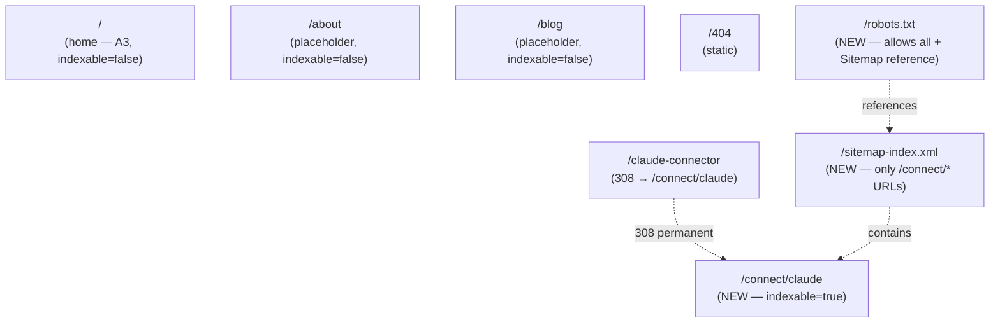
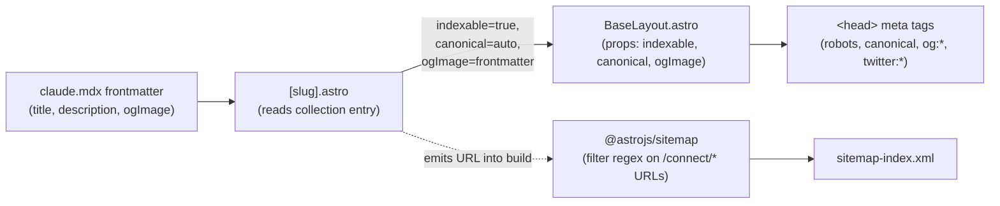
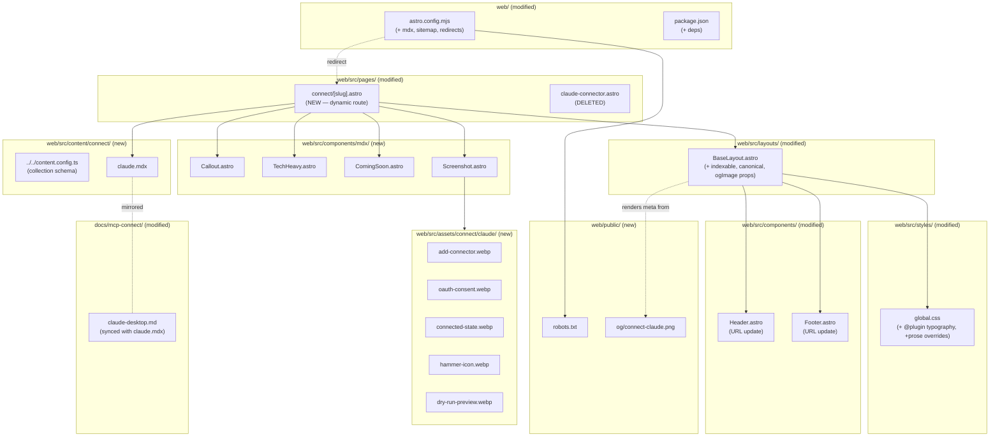

# Tech Plan — A4 Connect Claude (#302)

## Architectural Approach

### Key Decisions

| Decision | Choice | Rationale |
|---|---|---|
| MDX integration | **`@astrojs/mdx` (latest pinned to Astro 6.2.x)** | Official, ships Shiki for code highlighting, integrates with content collections. Smoke-tested as the first PR commit before content authoring. |
| Content authoring location | **`web/src/content/connect/{slug}.mdx`** via Zod-validated content collection | Type-safe frontmatter, `getCollection` queries for sitemap, scales 1→N entries with zero infra reshape |
| Page rendering | **Single dynamic route `web/src/pages/connect/[slug].astro`** using `getStaticPaths` + collection's `render(entry)` | Astro-canonical pattern, one route file owns all `/connect/*` URLs. Pay the dynamic-route complexity now; the follow-up sibling-pages ticket is then pure content authoring. |
| Layout split | **No separate `ConnectLayout.astro`** — `[slug].astro` directly composes `BaseLayout` + hero + `<Content />` | One less indirection; the dynamic route IS the layout |
| Hero shape | **Frontmatter-driven** `hero: { eyebrow, h1, subheadlines[], heroImage, ctaLabel?, ctaAnchor? }` | One template handles rich (Claude, all blocks populated) and simple (siblings, fewer blocks) hero |
| Hero CTA | **Single anchor `Setup guide ↓` (`<a href="#setup">`)** | Honest doc-page tone; restraint matches A3's CTA discipline; no broken-deep-link risk. Cost-of-being-wrong is trivial — add a download line in PR2 if data shows we need it. |
| Hero screenshot | `create_program` dry-run preview chat — single image, `loading="eager"`, `fetchpriority="high"` | LCP candidate; visually backs the value prop; satisfies #296 reviewer's "is this real?" concern |
| Setup section primary | **OAuth Custom Connector**, fully visible, 5 inline screenshots | Most users; reviewer's path of evaluation |
| PAT alternative | Visible h3 + 1-line intro + collapsed `<details>` JSON | Discoverable, doesn't compete with OAuth happy path |
| PAT "Tech-heavy" warning | Custom MDX `<TechHeavy>` component above the PAT details, lists Node 18+ requirement, nvm gotcha, `chown ~/.npm` fix, absolute-`npx`-path recommendation | High-visibility distinct from prose; matches the empirically-validated trip-up from grilling |
| `mcp-remote` alternative | Visible h3 + 1-line intro + 2 collapsed `<details>` (OAuth + PAT variants) | Same pattern as PAT; collapsed JSON keeps the page scannable |
| 1-click "coming soon" banner | Custom MDX `<ComingSoon>` component above Setup section | Reusable callout; visually distinct from prose; satisfies "we're aware of Directory" signal |
| Folding mechanism | **Native HTML `<details>`** styled with Tailwind `[&[open]]:` and `[&_summary]:` arbitrary-variant selectors | Zero JS, accessible, works in MDX without React islands |
| Code block highlighting | Astro built-in **Shiki**, theme `material-theme-darker` (or whichever maps closest to `#0f0f13` background) | Built-in, no config beyond pinning the theme in `astro.config.mjs` |
| Prose styling | **`@tailwindcss/typography` plugin**, registered via `@plugin "@tailwindcss/typography"` in `global.css`, color/spacing overridden with `prose-invert` + custom CSS vars | ~5-line install + ~20-line override block; standard, customizable. Fallback if v4 plugin compat breaks: hand-roll prose CSS (~150 lines). |
| Prose container | `<article class="prose prose-invert mx-auto max-w-3xl px-4">` wrapping `<Content />` | Matches site's `max-w-3xl` rhythm |
| Custom MDX components | **`<Callout>`** (variants: `note` / `tip` / `warning`), **`<TechHeavy>`** (specialized warning), **`<ComingSoon>`** (specialized banner), **`<Screenshot>`** (Astro `<Image>` wrapper with caption + zero-CLS dimensions) | 4 bespoke; rest is standard prose |
| MDX component injection | Per-page via `<Content components={{ Callout, TechHeavy, ComingSoon, Screenshot }} />` (not via global `mdx-components.ts`) | Explicit per usage site; easier to grep |
| Sitemap | **`@astrojs/sitemap` integration** in `astro.config.mjs`, `filter` callback whitelists URLs matching `^https://docs.gymlogic.me/connect/.+` | Single integration, declarative filter |
| Sitemap location | `/sitemap-index.xml` + `/sitemap-0.xml` (default Astro output) | Matches search-console expectations |
| `robots.txt` | Hand-written `web/public/robots.txt`: `User-agent: *` / `Allow: /` / `Sitemap: https://docs.gymlogic.me/sitemap-index.xml` | Trivial, doesn't justify a generator dep |
| Per-page indexing | New **`indexable: boolean` prop** on `BaseLayout.astro`, default `false` (preserves A2's site-wide `noindex`) | Opt-in is safer; A6 inverts default and may delete the prop later |
| Canonical URL | New **`canonical?: string` prop** on `BaseLayout.astro`; auto-derived from `Astro.site + Astro.url.pathname` if not passed | Auto for the common case, override available for edge cases |
| Per-page OG image | New **`ogImage?: string` prop** on `BaseLayout.astro`; resolved to absolute URL via `new URL(value, Astro.site).toString()` | One prop, single render path in `<head>` |
| OG meta tags | `og:title`, `og:description`, `og:image`, `og:url`, `og:type="website"`, `twitter:card="summary_large_image"`, `twitter:image` — all in BaseLayout `<head>` | Per-page values from props; `og:type="website"` is fine (`article` is for blog posts) |
| OG image storage | **`web/public/og/connect-claude.png`** (raw PNG, no fingerprinting) | Stable URL for social card validators; PNG = universal compat (incl. legacy crawlers) |
| Screenshot storage | `web/src/assets/connect/claude/*.webp`, processed via Astro `<Image>` for AVIF + srcset | Build-fingerprinted, modern formats, retina via `widths={[800, 1200, 1600]}` |
| Screenshots format | Capture as PNG (lossless), convert to WebP via `cwebp -q 85` for repo storage | WebP balances quality + size; Astro `<Image>` further generates AVIF |
| Hero screenshot loading | `loading="eager"` + `fetchpriority="high"` | LCP candidate |
| Other screenshots | `loading="lazy"`, explicit `width`/`height` (auto from `<Image>`) | Below-the-fold; CLS = 0 |
| Astro redirects | `redirects: { '/claude-connector': { destination: '/connect/claude', status: 308 } }` in `astro.config.mjs` | 308 is preferred for permanent renames (preserves request method) |
| Header link surgery | Update `linkIcons['/claude-connector']` key → `'/connect/claude'`, `links[0].href` → `'/connect/claude'` | One-file diff in `Header.astro` |
| Footer link surgery | Update `groups[1].links[0].href` (Docs group, "Claude connector") → `'/connect/claude'` | One-file diff in `Footer.astro` — found during scout, missed by the Brief |
| Existing stub deletion | **Delete `web/src/pages/claude-connector.astro`** in same commit as redirect | Coexisting would shadow the redirect (file route wins) |
| Source `.md` file | **Keep AND sync** `docs/mcp-connect/claude-desktop.md` in this PR | Same PR updates the source `.md` to match the new MDX (incl. PAT-via-mcp-remote tech-heavy gotchas validated during grilling). Source stays useful as a repo-internal reference; future PRs that update either side must update both — drift is the failure mode we're paying to avoid. |
| Cross-link UI | **Not built** in A4 — deferred to follow-up | One client = no siblings to link to; building empty cross-link UI now = dead UI in production |
| MDX file location | `web/src/content/connect/claude.mdx` (collection-managed, NOT in `web/src/pages/`) | Routed via `[slug].astro` dynamic route; `pages/connect/*.mdx` would auto-route and conflict |
| Smoke test sequencing | **Strict gate**: first commit installs `@astrojs/mdx` + `@tailwindcss/typography` + `@astrojs/sitemap` + creates a 5-line stub MDX + stub `[slug].astro` + runs `npm run build` and `npx astro check` locally. **No content authoring proceeds until both pass.** | If incompat surfaces, A4 stops here, not after 5 commits. Cost of staging: one short commit. Cost of NOT staging: potential 5-commit revert. |
| Heading anchor IDs | Astro auto-generates IDs from H2 headings via `remark-rehype` + `github-slugger`. The `Setup guide ↓` CTA links to `#setup`. Verify in dev. | Matches Astro's default Markdown behavior |
| Schema validation in CI | `cd web && npx astro check` already gated by A2's `web-type-check` CI job | No new CI work needed |

### Critical Constraints

**The MDX integration is hard-gated by a smoke test in the first commit.** `@astrojs/mdx` × Astro 6.2.x × rolldown-vite hasn't been verified in this repo — the existing `astro.config.mjs` already documents one rolldown-vite incompatibility (Tailwind v4 vite plugin). The first commit of A4 PR adds the integration + a trivial 5-line `_smoke.mdx` + a stub `[slug].astro` route. If `npm run build` or `npx astro check` fails on that commit, A4 stops and we either pin Astro 5.x in `web/` only, document an upstream issue, or wait for a fix. **No content authoring happens until this passes.** This is the locked discipline from grilling — paying one extra commit beats reverting five.

**The `indexable` opt-in on `BaseLayout` is temporary.** A6 (#304) will flip the default from `false` → `true` and may delete the prop entirely (relying on global `index, follow` instead). Until then, the connect page must explicitly pass `indexable={true}`. When A6 inverts the default, the explicit `indexable={true}` calls become dead code — A6 author should grep `indexable={true}` and clean up.

**The page is link-coupled to two SPA URLs that A4 doesn't own.** `gymlogic.me/account/api-tokens` (PAT setup target) and `gymlogic.me/oauth/consent` (depicted in OAuth screenshot). If the SPA team renames either, the docs page silently breaks. Ownership stays with SPA; a SPA-side rename PR should grep `connect/claude.mdx` and `docs/mcp-connect/` before merging.

**The `/claude-connector` → `/connect/claude` redirect is a 308 (permanent).** Browser-cached. Reverting requires another deploy with an updated redirect map. The legacy URL has been live for ~weeks but the entire site is `noindex` and there are no known external links pointing at it (verified during grilling). Acceptable.

**Footer's Docs group link must be updated alongside the Header.** Two files, one logical change. The Brief missed this — found during Tech Plan scout. Both must be in the same PR or active-state styling drifts and the redirect (while functional) creates a flicker on click.

**The 5 setup screenshots must be in English.** The user's local Claude Desktop install may default to French. If captured in French, the doc page reads inconsistently (English prose + French UI screenshots). Implementer must either: (a) switch Claude Desktop to English before capturing, or (b) capture with French UI and accept the inconsistency for v1 (matches A3's known-deviation pattern around French app screenshots in product features). **Decision deferred to capture session** — flag in the PR description either way.

**`@tailwindcss/typography` in v4 requires the `@plugin` CSS directive, not `tailwind.config.js`.** Verify on first install — the v3 docs are still ranked higher on Google and will mislead. Correct syntax: `@plugin "@tailwindcss/typography";` placed between `@import "tailwindcss";` and `@theme {}` in `web/src/styles/global.css`. If `@plugin` doesn't accept the JS-based typography plugin, fall back to hand-rolled prose CSS (~150 lines, single-PR cost).

**OG image cache is per-platform and not under our control.** Twitter / X caches OG images for ~7 days, LinkedIn ~7 days, Facebook ~30 days. After deploying the Claude OG card, force a refresh via each platform's debugger before sharing externally for #296 announce. **Pre-#296-announce checklist** lives in the PR description.

**Source `.md` and MDX must stay in sync.** `docs/mcp-connect/claude-desktop.md` is updated in this PR to match `web/src/content/connect/claude.mdx`. From here on, any update to either must update both. Drift detection is manual (PR review) — no automated check. Acceptable trade-off for v1; revisit if drift bites.

**Brief drift acknowledged:** Brief said "keep `.md` files in place — drift risk accepted". This Tech Plan tightens that: keep AND sync in this PR. Future drift is a separate concern.

---

## Data Model

A4 has no persistent data model. The load-bearing artifacts are three:

1. **The `connect` content collection schema** — Zod definition for what frontmatter every connect page can/must declare.
2. **The route topology** post-A4 — what URL paths exist and how they map to source files.
3. **The indexable / canonical / OG signal flow** — how a single per-page source of truth (frontmatter) propagates into HTML meta tags + the sitemap.

### 1. Content Collection Schema

```ts
// web/src/content.config.ts
import { defineCollection, z } from 'astro:content'
import { glob } from 'astro/loaders'

const connect = defineCollection({
  loader: glob({ pattern: '**/*.mdx', base: './src/content/connect' }),
  schema: z.object({
    // Identity
    slug: z.string(),                  // 'claude' (matches filename, used in URL)
    clientName: z.string(),            // 'Claude Desktop'
    clientUrl: z.string().url(),       // 'https://claude.ai/download'

    // SEO + sharing
    title: z.string(),                 // <title> tag content
    description: z.string(),           // <meta description>, ~155 char target
    ogImage: z.string(),               // path relative to site root, e.g. '/og/connect-claude.png'

    // Hero block (frontmatter-driven)
    hero: z.object({
      eyebrow: z.string().optional(),  // 'MCP Connector'
      h1: z.string(),                  // 'Use your training data inside Claude'
      subheadlines: z.array(z.string()).max(4),  // 1-4 lines under H1
      heroImage: z.object({
        src: z.string(),               // imported asset path
        alt: z.string(),
      }).optional(),
      ctaLabel: z.string().optional(), // 'Setup guide ↓'
      ctaAnchor: z.string().optional(),// '#setup'
    }),

    // Sort order for sitemap / future hub page
    pageOrder: z.number().default(99),

    // Auth methods (informational; future cross-link cards may use this)
    available: z.object({
      oauth: z.boolean().default(true),
      pat: z.boolean().default(false),
      mcpRemote: z.boolean().default(false),
    }),
  }),
})

export const collections = { connect }
```

**Schema notes:**

- Schema is **additive-only across PRs**. New required fields without a default break the existing `claude.mdx` build. Add new fields as `.optional()` first, backfill content, then tighten if needed.
- `ogImage` is a string (path) not an `image()` validator — because OG images live in `web/public/`, not `src/assets/`, so they're not Astro-managed.
- `available` flags aren't *used* by A4 (no cross-link cards in this PR) but encoding them now keeps the follow-up ticket from needing a schema bump.
- `pageOrder: 99` default keeps Claude alone today; siblings get explicit values in the follow-up.

### 2. Route Topology Post-A4



**Notes:**
- `/connect/claude` is the canonical URL Anthropic submits against. `/claude-connector` is a permanent redirect, kept for any external bookmarks.
- The sitemap intentionally does NOT include `/`, `/about`, `/blog`, `/404` until A6 ships — they're all `indexable=false`.
- Astro emits the redirect at build time as a static `308` HTTP response (Vercel respects it via the static-output redirect manifest).

### 3. Indexable / Canonical / OG Signal Flow



**Notes:**
- `BaseLayout` is the **only** place that emits `<meta robots>`, `<link rel="canonical">`, and `og:*` / `twitter:*` tags. Keep all SEO meta in one file.
- The sitemap filter is **URL-string based**, not metadata-based — `@astrojs/sitemap` doesn't see rendered page metadata. That's fine because the URL pattern (`/connect/*`) is in 1:1 correspondence with `indexable=true` pages until A6 lands.
- When A6 flips the global default to `indexable=true`, the sitemap filter widens (or disappears), and the per-page `indexable={true}` calls become removable dead code.

---

## Component Architecture

### Layer Overview



### New Files & Responsibilities

| File | Purpose |
|---|---|
| `web/src/content.config.ts` | **New** — defines the `connect` content collection with Zod schema. Astro auto-discovers via convention. |
| `web/src/content/connect/claude.mdx` | **New** — full Claude Desktop setup page content. Frontmatter populates `hero` block + SEO fields; body uses prose + custom MDX components (`<ComingSoon>`, `<TechHeavy>`, `<Callout>`, `<Screenshot>`, native `<details>`). Imports the 5 screenshot WebPs from `../../assets/connect/claude/` at the top of the file. |
| `web/src/pages/connect/[slug].astro` | **New** — dynamic route. `getStaticPaths()` returns one entry per collection member. Renders: `<BaseLayout indexable canonical ogImage title description>` → hero block (eyebrow, H1, subheadlines, optional hero image, optional anchor CTA) → `<article class="prose prose-invert mx-auto max-w-3xl px-4">` → `<Content components={{ Callout, TechHeavy, ComingSoon, Screenshot }} />`. |
| `web/src/components/mdx/Callout.astro` | **New** — generic callout. Props: `type: 'note' \| 'tip' \| 'warning'` (default `note`), `title?: string`. Renders a bordered box with icon + optional title + slot for body. Color/border varies by type. Uses `not-prose` to escape prose styling. |
| `web/src/components/mdx/TechHeavy.astro` | **New** — specialized warning callout for the PAT-via-mcp-remote alternative. Props: `title?: string` (default "Tech-heavy — for advanced users"). Renders with a wrench/warning icon, accent border, slot for body (4 bullet points: Node 18+ requirement, nvm gotcha, npm cache fix, absolute-path recommendation). |
| `web/src/components/mdx/ComingSoon.astro` | **New** — specialized banner callout for the 1-click Directory section. Props: `title?: string` (default "One-click install via Anthropic Directory — Coming soon"). Renders with a clock/sparkle icon, soft accent background, slot for body. |
| `web/src/components/mdx/Screenshot.astro` | **New** — wraps Astro's `<Image>` with caption + zero-CLS dimensions + responsive sizing. Props: `src: ImageMetadata`, `alt: string`, `caption?: string`, `priority?: boolean` (default `false`). When `priority`, sets `loading="eager"` + `fetchpriority="high"`. Otherwise `loading="lazy"`. Uses `not-prose` and renders as a `<figure>` with `<figcaption>`. |
| `web/public/robots.txt` | **New** — 3 lines: `User-agent: *` / `Allow: /` / `Sitemap: https://docs.gymlogic.me/sitemap-index.xml`. |
| `web/public/og/connect-claude.png` | **New** — 1200×630 PNG. GymLogic logo × Claude/Anthropic logo + "GymLogic for Claude Desktop" + "MCP Connector — setup in 30 seconds" + `docs.gymlogic.me`. **Sourced by the user**; if Claude logo isn't usable, fallback to text-only template (Q12 brief option B). |
| `web/src/assets/connect/claude/add-connector.webp` | **New** — Claude Desktop "Add custom connector" dialog screenshot (form filled with name + URL). |
| `web/src/assets/connect/claude/oauth-consent.webp` | **New** — `gymlogic.me/oauth/consent` consent page screenshot. |
| `web/src/assets/connect/claude/connected-state.webp` | **New** — Connector showing "Connected" state in Claude Desktop's Settings → Connectors. |
| `web/src/assets/connect/claude/hammer-icon.webp` | **New** — Claude Desktop chat input area showing the hammer icon (tools-loaded confirmation), with tool list expanded if cleanly captureable. |
| `web/src/assets/connect/claude/dry-run-preview.webp` | **New — HERO IMAGE.** Chat screenshot showing Claude executing `create_program` with `dry_run: true`, displaying a proposed multi-day program preview, with the user's confirmation prompt visible. |

### Modified Files

| File | Modification |
|---|---|
| `web/astro.config.mjs` | Add `import mdx from '@astrojs/mdx'`, `import sitemap from '@astrojs/sitemap'`. Add to `integrations: [react(), mdx(), sitemap({ filter: (page) => /^https:\/\/docs\.gymlogic\.me\/connect\/.+/.test(page) })]`. Add `markdown: { shikiConfig: { theme: 'material-theme-darker' } }`. Add `redirects: { '/claude-connector': { destination: '/connect/claude', status: 308 } }`. |
| `web/src/layouts/BaseLayout.astro` | Add three optional props: `indexable?: boolean` (default `false`), `canonical?: string`, `ogImage?: string`. In `<head>`: emit `<meta name="robots" content={indexable ? 'index, follow' : 'noindex'} />` (replaces hardcoded `noindex`). Emit `<link rel="canonical" href={canonical ?? new URL(Astro.url.pathname, Astro.site).toString()} />`. Emit OG / Twitter meta tags from props (only when `ogImage` provided). |
| `web/src/styles/global.css` | After `@import "tw-animate-css"`, add `@plugin "@tailwindcss/typography";`. Append a prose override block (color tokens, spacing, code block backgrounds) — see Implementation Notes for the snippet. |
| `web/src/components/Header.astro` | Update `linkIcons` map key `'/claude-connector'` → `'/connect/claude'` (icon SVG path string unchanged). Update `links[0].href` from `'/claude-connector'` to `'/connect/claude'`. |
| `web/src/components/Footer.astro` | Update `groups[1].links[0].href` (Docs group, "Claude connector") from `/claude-connector` to `/connect/claude`. Label stays. |
| `web/package.json` | Add deps: `@astrojs/mdx`, `@astrojs/sitemap`, `@tailwindcss/typography`. Pin to versions compatible with Astro 6.2.x (verify in smoke-test commit). |
| `docs/mcp-connect/claude-desktop.md` | **Sync with `claude.mdx`** — port the empirically-validated PAT-via-mcp-remote tech-heavy gotchas (Node 18+, nvm gotcha, npm cache fix, absolute-path recommendation) into the source doc. Both files must say the same thing about PAT setup after A4 lands. |

### Deleted Files

| File | Reason |
|---|---|
| `web/src/pages/claude-connector.astro` | Stub superseded by the redirect → `/connect/claude`. Coexisting with the redirect would shadow it (the file route wins over the config-level redirect). Deletion lands in the same commit as the redirect config. |

### Component Responsibilities

**`[slug].astro`** (dynamic route)

```astro
---
import { getCollection, render } from 'astro:content'
import BaseLayout from '@/layouts/BaseLayout.astro'
import Callout from '@/components/mdx/Callout.astro'
import TechHeavy from '@/components/mdx/TechHeavy.astro'
import ComingSoon from '@/components/mdx/ComingSoon.astro'
import Screenshot from '@/components/mdx/Screenshot.astro'

export async function getStaticPaths() {
  const entries = await getCollection('connect')
  return entries.map(entry => ({ params: { slug: entry.id }, props: { entry } }))
}

const { entry } = Astro.props
const { Content } = await render(entry)
const { hero, title, description, ogImage } = entry.data
---

<BaseLayout title={title} description={description} ogImage={ogImage} indexable>
  <section class="mx-auto max-w-3xl px-4 pt-16 pb-12">
    {hero.eyebrow && (
      <p class="text-sm uppercase tracking-wider text-accent">{hero.eyebrow}</p>
    )}
    <h1 class="mt-3 text-4xl md:text-5xl font-semibold tracking-tight text-foreground">
      {hero.h1}
    </h1>
    <div class="mt-6 space-y-2 text-lg text-muted leading-relaxed">
      {hero.subheadlines.map(line => <p>{line}</p>)}
    </div>
    {hero.ctaLabel && hero.ctaAnchor && (
      <a href={hero.ctaAnchor}
         class="mt-8 inline-flex items-center gap-2 text-accent hover:text-foreground transition-colors duration-150">
        {hero.ctaLabel}
      </a>
    )}
  </section>
  {hero.heroImage && (
    <div class="mx-auto max-w-3xl px-4">
      <Screenshot src={...} alt={hero.heroImage.alt} priority />
    </div>
  )}
  <article class="prose prose-invert mx-auto max-w-3xl px-4 pb-24">
    <Content components={{ Callout, TechHeavy, ComingSoon, Screenshot }} />
  </article>
</BaseLayout>
```

Note: the hero image's `src` resolution from frontmatter to `ImageMetadata` requires either dynamic import or accepting a string path passed to `` directly (skipping Astro `<Image>`). Resolution approach decided in commit 2 — likely inline `` with explicit width/height for simplicity since frontmatter strings can't carry `ImageMetadata`. Implementer note in the section below.

**`BaseLayout.astro`** (modified)

- Accepts new optional props: `indexable: boolean = false`, `canonical?: string`, `ogImage?: string`.
- `<head>` order: charset → viewport → robots (computed) → description → canonical (computed if not passed) → og + twitter (only emitted if `ogImage`) → favicon → title.
- Robots tag computation: `<meta name="robots" content={indexable ? 'index, follow' : 'noindex'} />`.
- Canonical computation: `const canonicalUrl = canonical ?? new URL(Astro.url.pathname, Astro.site).toString()`.
- OG tags only emitted if `ogImage` provided (avoids emitting bad/empty cards on placeholder pages):
  ```astro
  {ogImage && (
    <>
      <meta property="og:title" content={title} />
      <meta property="og:description" content={description} />
      <meta property="og:image" content={new URL(ogImage, Astro.site).toString()} />
      <meta property="og:url" content={canonicalUrl} />
      <meta property="og:type" content="website" />
      <meta name="twitter:card" content="summary_large_image" />
      <meta name="twitter:image" content={new URL(ogImage, Astro.site).toString()} />
    </>
  )}
  ```
- All other behavior (skip-link, Header, Footer, fonts) unchanged.

**`Callout.astro`** (generic callout)

```astro
---
interface Props {
  type?: 'note' | 'tip' | 'warning'
  title?: string
}
const { type = 'note', title } = Astro.props
const styles = {
  note:    { border: 'border-border',          bg: 'bg-card',          iconColor: 'text-muted'    },
  tip:     { border: 'border-accent/30',       bg: 'bg-accent/5',      iconColor: 'text-accent'   },
  warning: { border: 'border-yellow-500/40',   bg: 'bg-yellow-500/5',  iconColor: 'text-yellow-500' },
}[type]
---
<aside class:list={['not-prose my-6 rounded-lg border p-4', styles.border, styles.bg]}>
  {title && <p class:list={['font-semibold mb-2', styles.iconColor]}>{title}</p>}
  <div class="text-sm text-foreground leading-relaxed [&>p]:mt-2 [&>p:first-child]:mt-0">
    <slot />
  </div>
</aside>
```

- `not-prose` escapes the surrounding `prose` styling.
- Inline `[&>p]:` Tailwind selectors handle paragraph spacing inside the slot without leaning on prose.
- Yellow tone for warnings (matches universal docs convention) — distinct from accent teal so the warning doesn't blend with brand color.

**`TechHeavy.astro`** (specialized warning)

- Wraps `<Callout type="warning">` with default `title="Tech-heavy — for advanced users"` and a wrench / warning SVG icon (lucide `wrench` or `alert-triangle`).
- Slot is the body. The PAT-via-mcp-remote section content uses `<TechHeavy>` to wrap a 4-bullet list (Node 18+ / nvm gotcha / npm cache fix / absolute-path recommendation) above the collapsed `<details>`.

**`ComingSoon.astro`** (specialized banner)

- Wraps `<Callout type="tip">` with default `title="One-click install via Anthropic Directory — Coming soon"` and a sparkle / clock SVG icon (lucide `sparkles` or `clock`).
- Slot is the body — short paragraph explaining we've submitted to the Directory and will document the 1-click flow once approved.
- Placed at the top of the Setup section in `claude.mdx`.

**`Screenshot.astro`** (image wrapper with caption)

```astro
---
import { Image } from 'astro:assets'
interface Props {
  src: ImageMetadata
  alt: string
  caption?: string
  priority?: boolean
}
const { src, alt, caption, priority = false } = Astro.props
---
<figure class="not-prose my-8">
  <Image
    src={src}
    alt={alt}
    widths={[800, 1200, 1600]}
    sizes="(min-width: 768px) 768px, 100vw"
    class="rounded-lg border border-border"
    loading={priority ? 'eager' : 'lazy'}
    {...(priority && { fetchpriority: 'high' })}
  />
  {caption && (
    <figcaption class="mt-3 text-sm text-muted text-center italic">
      {caption}
    </figcaption>
  )}
</figure>
```

- `widths={[800, 1200, 1600]}` lets Astro generate AVIF + srcset for retina + standard.
- `sizes="(min-width: 768px) 768px, 100vw"` matches the page's `max-w-3xl` (768px) container.
- `loading="lazy"` default; `priority` flag flips to `eager` + `fetchpriority="high"` for hero.
- Astro's `<Image>` reads native dimensions from the WebP and emits `width` / `height` attrs automatically → CLS = 0.

**`claude.mdx`** (content)

Frontmatter populates the hero per the schema. Body structure:

```mdx
---
slug: claude
clientName: Claude Desktop
clientUrl: https://claude.ai/download
title: Connect GymLogic to Claude Desktop — Setup guide
description: Use your full GymLogic training data inside Claude Desktop via MCP. ~30s OAuth setup; PAT and mcp-remote alternatives for advanced users.
ogImage: /og/connect-claude.png
hero:
  eyebrow: MCP Connector
  h1: Use your training data inside Claude
  subheadlines:
    - Chat with your full training history, stats, and exercise catalog.
    - Generate or rewrite multi-day programs in seconds — Claude proposes, you approve, GymLogic writes.
    - Skip the UI when you already know what you want; let Claude guide you when you don't.
  heroImage:
    src: /placeholder-resolved-by-route.webp
    alt: Claude Desktop showing a create_program dry-run preview with a proposed split
  ctaLabel: Setup guide ↓
  ctaAnchor: '#setup'
pageOrder: 1
available:
  oauth: true
  pat: true
  mcpRemote: true
---

import addConnector from '../../assets/connect/claude/add-connector.webp'
import oauthConsent from '../../assets/connect/claude/oauth-consent.webp'
import connectedState from '../../assets/connect/claude/connected-state.webp'
import hammerIcon from '../../assets/connect/claude/hammer-icon.webp'

## Prerequisites

- A [GymLogic](https://gymlogic.me) account with at least one logged workout
- [Claude Desktop](https://claude.ai/download) installed

## Setup

<ComingSoon>
  We've submitted GymLogic for the Anthropic Directory listing. Until approved,
  use the manual Custom Connector setup below — takes about 30 seconds.
</ComingSoon>

### Method 1 — Custom Connector (recommended)

1. Open Claude Desktop ...

<Screenshot src={addConnector} alt="..." caption="Add custom connector dialog with the GymLogic name and URL filled in." />

[... full OAuth flow with 4 more screenshots inline ...]

### Alternative: Personal Access Token

Use a PAT instead of OAuth if you want longer-lived auth or a headless setup.
Create one at [gymlogic.me/account/api-tokens →](https://gymlogic.me/account/api-tokens).

<TechHeavy>
  - Requires **Node.js 18+**. `mcp-remote` crashes on Node 12/14 with `SyntaxError`.
  - **nvm gotcha**: Claude Desktop walks `PATH` in order and grabs the *first* `npx` it finds. If your default Node is 12, it'll fail. Either `nvm alias default 20` or pin the absolute path to a Node 20+ `npx` in your config.
  - **npm cache permissions**: if you've ever `sudo npm install`d, fix with `sudo chown -R $(id -u):$(id -g) ~/.npm`.
  - **Recommended**: use the absolute path, e.g. `/Users/you/.nvm/versions/node/v20.9.0/bin/npx`.
</TechHeavy>

<details>
  <summary>Show PAT config</summary>

  ```json
  {
    "mcpServers": {
      "gymlogic": {
        "command": "/Users/you/.nvm/versions/node/v20.9.0/bin/npx",
        "args": [
          "mcp-remote",
          "https://favusepjqwpcroiolvaz.supabase.co/functions/v1/mcp",
          "--header",
          "Authorization: Bearer <YOUR_PAT>"
        ]
      }
    }
  }
  ```
</details>

### Alternative: Config file with `mcp-remote`

For Claude Desktop builds where the native UI doesn't expose the connector form, or for headless setups, use the `mcp-remote` adapter directly via the config file at `~/Library/Application Support/Claude/claude_desktop_config.json` (macOS) or `%APPDATA%\Claude\claude_desktop_config.json` (Windows).

<details>
  <summary>Show mcp-remote config (OAuth)</summary>
  ...
</details>

<details>
  <summary>Show mcp-remote config (with PAT)</summary>
  ...
</details>

## Available tools

| Tool | What it does |
|---|---|
[... migrated from source doc ...]

## Example conversation

[... 6-prompt sequence migrated from source doc ...]

## Troubleshooting

[... migrated table, with the Node-12-via-nvm and npm-cache-EACCES rows expanded ...]
```

### Failure Mode Analysis

| Failure | Behavior |
|---|---|
| `@astrojs/mdx` × Astro 6 × rolldown-vite incompat | First commit's `npm run build` or `astro check` fails. **Detection**: smoke-test commit before content authoring. **Resolution**: pin Astro 5.x in `web/` only (separate `package.json`), or wait for upstream fix. **Likelihood**: medium — Astro 6 + rolldown-vite is recent and `@astrojs/mdx` may lag. |
| `@tailwindcss/typography` v4 plugin doesn't load | MDX prose renders unstyled. **Detection**: visual smoke on first MDX render. **Resolution**: switch to hand-rolled prose CSS (~150 lines covering p / ul / ol / h2-h4 / code / pre / blockquote / table / a / hr). |
| `@astrojs/sitemap` doesn't filter properly | Either too many URLs (placeholders leak) or too few (Claude page missing). **Detection**: read `dist/sitemap-0.xml` after build. **Resolution**: tighten filter regex; verify locally before deploy. |
| Sitemap built but Google doesn't discover it | Slower indexing. **Mitigation**: `robots.txt` references `/sitemap-index.xml`; submit manually via Google Search Console post-deploy. |
| Canonical URL points to `localhost:4321` in dev / preview | Wrong canonical leaks to indexed page. **Detection**: `Astro.site` is read from `astro.config.mjs` (set to `https://docs.gymlogic.me`), not from runtime URL. Should be safe. **Verify**: inspect Vercel preview deploy's `<head>` to confirm canonical resolves to production hostname. |
| OG image broken in social card validators | Share preview shows generic site card or 404. **Detection**: run LinkedIn Post Inspector + X card validator pre-#296-announce. **Resolution**: re-export PNG, force-refresh debugger, redeploy. |
| OG image cache stale across platforms post-update | Old image shows for ~7-30 days. **Mitigation**: change the image URL (e.g. `connect-claude-v2.png`) and update frontmatter — bypasses cache. Document in implementation notes. |
| Custom MDX component conflicts with prose styling (inherits prose padding) | Visual inconsistency — callout has weird margins. **Mitigation**: every custom MDX component starts with `not-prose` class, uses inline `[&>...]:` selectors for inner spacing. |
| Native `<details>` styling broken in Safari | Marker arrow doesn't hide properly. **Resolution**: target via `summary::-webkit-details-marker { display: none }` AND `::marker { display: none }` for Firefox. |
| Shiki theme produces unreadable code blocks | Code text contrasts poorly against page background. **Detection**: visual smoke. **Resolution**: try `material-theme-darker`, `vesper`, `nord`, or `vitesse-dark` until contrast looks right against `#0f0f13`. |
| Tailwind v4 `@plugin` directive doesn't accept the typography plugin's JS exports | Plugin silently doesn't apply; prose unstyled. **Detection**: visual smoke. **Resolution**: typography plugin might need to be installed via `tailwind.config.js` shim even on v4. Investigate; worst case → hand-roll prose. |
| `Setup guide ↓` CTA's `#setup` anchor doesn't exist | Click does nothing (or scrolls to top). **Detection**: manual click in dev. **Resolution**: confirm Astro auto-generated ID matches expected slug. If not, override via remark-rehype slug plugin or hardcode `<a id="setup"></a>` before the H2. |
| Frontmatter Zod validation fails on `claude.mdx` (typo, missing required field) | Build fails. **Detection**: trivially caught by `astro check` in CI. **Resolution**: fix the typo. Astro's error message points to the offending field. |
| `/claude-connector` redirect doesn't work in Astro dev mode | Local dev shows 404 on the legacy URL. **Mitigation**: Astro static `redirects` are emitted at build time as static `308` responses; dev mode behavior may differ. Verify the redirect on Vercel preview deploy, not just locally. |
| Footer "Claude connector" link not updated, header is updated | Broken visual — header current-page state matches `/connect/claude`, footer link still points to legacy URL (which redirects, so it works, but the active-state matcher in Footer would never match). **Mitigation**: both updates land in same PR; include a screenshot in PR description showing both nav surfaces resolving correctly. |
| `indexable` prop default flipped accidentally to `true` | All placeholder pages (`/`, `/about`, `/blog`) silently index. **Mitigation**: PR review enforces; `BaseLayout` default explicit in code (`indexable = false` not `indexable`). |
| `robots.txt` typo (`Disallow: /` instead of `Allow: /`) | Search engines blocked from entire site. **Detection**: Google Search Console "robots.txt Tester" or `curl + read`. **Resolution**: fix typo, redeploy. |
| OG image accidentally fingerprinted by Astro pipeline | Stable URL changes between deploys, breaks OG cache. **Mitigation**: store in `web/public/og/` (raw, no fingerprinting), not `web/src/assets/`. |
| MDX `<Content />` heading hierarchy clash with hero H1 | Body has its own H1 (forbidden) or skips H2 → H4. **Mitigation**: convention — hero H1 is the only H1; body starts at H2. Code review enforces. |
| Code block JSON in alternative section breaks MDX parser | Curly braces `{}` in JSON parsed as MDX expressions. **Mitigation**: code blocks delimited by triple-backticks are protected from MDX parsing. **Detection**: build error if missing. |
| Claude logo licensing prevents use on OG card | Visual differentiation lost on shares. **Resolution**: fall back to text-only OG card (Q12 brief option B) — same template, drop the client logo. |
| Screenshots show French Claude UI | Inconsistent with English page prose. **Mitigation**: capture in English (switch Claude Desktop locale) OR accept inconsistency for v1 with documented follow-up. |
| Cross-domain SPA URL renamed (`/account/api-tokens` → `/settings/api-tokens`) | Broken docs link. **Mitigation**: document the coupling in Critical Constraints; SPA-side rename PR should grep `mcp-connect` + `connect/claude.mdx` before merging. |
| Astro updated and the redirect format changes | `/claude-connector` returns 404. **Mitigation**: redirect config is in `astro.config.mjs` — surfaced on every Astro upgrade. Verify behavior post-upgrade. |
| Sitemap deduplicates nothing → duplicate `/connect/claude` entries (page + redirect both emit) | Search engine confusion. **Mitigation**: redirects in Astro static don't emit sitemap entries — verified default behavior. Confirm by inspecting `dist/sitemap-0.xml` post-build. |
| `/sitemap-index.xml` URL structure differs from search-console expectations | Submission fails. **Mitigation**: `@astrojs/sitemap` default output matches Google's expected format (sitemapindex referencing `sitemap-0.xml`). Submit `https://docs.gymlogic.me/sitemap-index.xml`. |
| `prose-invert` doesn't tint table borders / blockquote bars to dark theme | Visual rendering inconsistency. **Resolution**: add explicit overrides in the prose override CSS block in `global.css`. |
| `claude.mdx` and source `docs/mcp-connect/claude-desktop.md` drift after a future PR | Two sources of truth diverge silently. **Mitigation**: PR review checklist for any future change to either file — both must update. **Failure tolerance**: if drift bites, reopen the deletion question (Brief Q3) and consolidate into MDX-only. |
| Hero image's frontmatter string can't be passed as `ImageMetadata` to `<Image>` | Astro `<Image>` requires imported `ImageMetadata`, not a raw string path. **Resolution**: hero image rendering uses inline `` with explicit width/height/loading="eager"/fetchpriority="high", OR is rendered inside the MDX body via `<Screenshot priority />` and removed from frontmatter. Decide in commit 2. |

---

## Implementation Notes

Breadcrumbs for the implementer (probably future me):

- **Smoke-test sequencing (commit 1)**. Install `@astrojs/mdx@^4`, `@astrojs/sitemap@^4`, `@tailwindcss/typography@^0.5` (or whatever current stable maps to Astro 6.2.x). Add to `astro.config.mjs`. Create stub `web/src/content.config.ts` + stub `web/src/content/connect/_smoke.mdx` with 5 lines + stub `web/src/pages/connect/[slug].astro` rendering `<Content />` inside `<BaseLayout title="smoke">`. Run `npm run build` (with `required_permissions: ["all"]` per the build-sandbox-caveat rule) and `npx astro check` locally. **Only proceed to content authoring if both pass.** If they don't: file the upstream issue, document the failure mode in the plan as an addendum, and decide whether to pin Astro 5.x in `web/` or block A4. Delete `_smoke.mdx` before commit 2.
- **Astro 6 content collection API**. Use `import { defineCollection, z } from 'astro:content'` and the `glob` loader from `astro/loaders`. Config file lives at `web/src/content.config.ts` (root of `src/`, NOT inside `src/content/`). Render via `import { render } from 'astro:content'` and `const { Content } = await render(entry)`. Entry id (used as URL slug) is the filename without extension via the glob loader.
- **`@plugin` directive in Tailwind v4**. Place `@plugin "@tailwindcss/typography";` between `@import "tw-animate-css";` and `@source './**/*.{astro,tsx,ts}';` in `web/src/styles/global.css`. The v3 `tailwind.config.js` approach does NOT work on v4. If `@plugin` rejects the typography plugin, fall back to hand-rolled prose CSS (failure mode covered above).
- **Prose color override snippet** (append to `global.css` after `@theme`):
  ```css
  @layer base {
    .prose-invert {
      --tw-prose-body: var(--color-foreground);
      --tw-prose-headings: var(--color-foreground);
      --tw-prose-lead: var(--color-foreground);
      --tw-prose-links: var(--color-accent);
      --tw-prose-bold: var(--color-foreground);
      --tw-prose-counters: var(--color-muted);
      --tw-prose-bullets: var(--color-muted);
      --tw-prose-hr: var(--color-border);
      --tw-prose-quotes: var(--color-foreground);
      --tw-prose-quote-borders: var(--color-accent);
      --tw-prose-captions: var(--color-muted);
      --tw-prose-code: var(--color-accent);
      --tw-prose-pre-code: var(--color-foreground);
      --tw-prose-pre-bg: var(--color-card);
      --tw-prose-th-borders: var(--color-border);
      --tw-prose-td-borders: var(--color-border);
    }
  }
  ```
- **Sitemap filter**. `@astrojs/sitemap`'s `filter` callback receives a `string` URL. Use a regex on the URL: `filter: (page) => /^https:\/\/docs\.gymlogic\.me\/connect\/[a-z-]+\/?$/.test(page)`. Trailing-slash tolerant.
- **Astro `redirects`**. Format: `redirects: { '/claude-connector': { destination: '/connect/claude', status: 308 } }`. Without explicit status, Astro defaults to 301 in static mode; 308 is preferred for permanent renames as it preserves request method.
- **Native `<details>` styling**. Hide the default marker via:
  ```css
  details > summary { list-style: none; cursor: pointer; }
  details > summary::-webkit-details-marker { display: none; }
  details > summary::marker { display: none; }
  ```
  Add a custom chevron via `summary::after { content: '▸'; transition: transform 150ms; display: inline-block; margin-left: 0.5rem; }` and `details[open] > summary::after { transform: rotate(90deg); }`. Wrap rotation in `motion-safe:` for `prefers-reduced-motion` honoring.
- **MDX component injection per page**. `<Content components={{ Callout, TechHeavy, ComingSoon, Screenshot }} />`. The components are usable in MDX as `<Callout>`, `<TechHeavy>`, etc. Capitalization matters — lowercase tag names are HTML, capitalized are React/Astro components.
- **Image imports in MDX**. Place `import foo from '../../assets/connect/claude/foo.webp'` at the top of the MDX file (between frontmatter and first content). Pass `<Screenshot src={foo} ... />` in the body. Astro processes the import as `ImageMetadata` at build time.
- **Hero image rendering**. Frontmatter strings can't be `ImageMetadata`. Two options: (a) render the hero image inside the MDX body as the first element using `<Screenshot priority>` (drops frontmatter `heroImage`); (b) import the hero image in the route file `[slug].astro` and pass to `<Screenshot>` after the hero text block — requires looking up by frontmatter `slug` to know which asset to import. **Recommend (a)** — simpler, keeps all hero pieces colocated in MDX.
- **`<Image>` width/height auto-derivation**. Astro reads native dimensions from the imported asset and emits `width` / `height` HTML attrs. CLS = 0 without manual specification. Confirm by inspecting rendered HTML.
- **Heading anchor IDs**. Astro's MDX renders H2s with auto-generated `id` attrs derived from the heading text via `github-slugger`. `## Setup` → `id="setup"`. Verify in dev. If a heading text changes, the anchor breaks silently — keep `## Setup` as the canonical heading text for the CTA target.
- **WebP capture pipeline**. Capture screenshot as PNG (macOS Cmd+Shift+4 area capture). Convert via `cwebp -q 85 input.png -o output.webp` (homebrew: `brew install webp`). Or batch: `for f in *.png; do cwebp -q 85 "$f" -o "${f%.png}.webp"; done`. Target file size < 200KB per screenshot.
- **OG image dimensions**. 1200×630 PNG, < 1MB. Validators reject non-standard dimensions or oversize files. Test locally with LinkedIn Post Inspector + X card validator before pushing.
- **OG image cache busting**. If you need to update the OG image post-deploy, change the URL (`connect-claude-v2.png`) and update frontmatter. Social platforms cache by URL, not content hash.
- **Verify redirect on Vercel preview**. Astro's static `redirects` may behave differently in `astro dev` vs `astro build` + Vercel. Don't trust local dev for redirect verification — check the Vercel preview deploy by `curl -I https://<preview>.vercel.app/claude-connector` and confirm `HTTP/1.1 308` + `Location: /connect/claude`.
- **Robots.txt content**:
  ```
  User-agent: *
  Allow: /
  Sitemap: https://docs.gymlogic.me/sitemap-index.xml
  ```
- **English screenshots reminder**. Switch Claude Desktop to English (Settings → Locale) before capturing the 5 screenshots, or accept FR/EN inconsistency for v1 (matches A3's pattern). Decide at capture time, document in PR description.
- **PAT empirical setup recap** (so the doc copy matches reality, validated during grilling):
  - Get PAT from `/account/api-tokens` (lifetime: any)
  - `node -v` must be 18+; if `nvm` walks 12 first → `nvm alias default 20` OR pin absolute path in config
  - `sudo chown -R $(id -u):$(id -g) ~/.npm` if first attempt fails with EACCES
  - Use `/Users/you/.nvm/versions/node/v20.9.0/bin/npx` (or whatever nvm path resolves) instead of bare `npx`
  - Config goes in `~/Library/Application Support/Claude/claude_desktop_config.json` as a sibling key to `preferences`
  - `Cmd+Q` Claude (full quit) before checking the new server
- **Cross-domain link audit**. Two SPA URLs the page links to: `gymlogic.me/account/api-tokens` and `gymlogic.me/oauth/consent` (depicted in screenshot, not linked). On every SPA route rename PR, grep `connect/claude.mdx` + `docs/mcp-connect/`.
- **Hero H1 = only H1**. Body MDX must start at H2. Astro / Tailwind don't enforce this; reviewer does.
- **Stub deletion order**. Delete `web/src/pages/claude-connector.astro` IN THE SAME COMMIT as adding the redirect. Otherwise the file route wins over the redirect for one commit window.
- **Source `.md` sync** (`docs/mcp-connect/claude-desktop.md`). Update in this PR to match the new MDX. Specifically: expand the "Node version matters" troubleshooting blockquote with the npm cache permission fix and the absolute-path recommendation. Both files should describe the same setup truth after A4 lands.
- **Pre-launch checklist** (in the PR description):
  - [ ] Smoke-test commit merged successfully (build + check pass)
  - [ ] All 5 screenshots captured in English (or FR/EN inconsistency documented)
  - [ ] OG card PNG generated (1200×630, < 1MB), Claude logo sourced or text-only fallback used
  - [ ] LinkedIn Post Inspector renders correct OG card
  - [ ] X card validator renders correct OG card
  - [ ] `curl -I https://<preview>/claude-connector` returns 308 + correct Location
  - [ ] `curl https://<preview>/sitemap-index.xml` contains `/connect/claude`
  - [ ] `curl https://<preview>/robots.txt` matches expected content
  - [ ] `/connect/claude` `<head>` contains `<meta robots="index, follow">` + `<link rel="canonical">` + 7 OG/Twitter meta tags
  - [ ] All other pages still declare `<meta robots="noindex">`
  - [ ] Header link active state highlights correctly on `/connect/claude`
  - [ ] Footer "Claude connector" link goes to `/connect/claude`
  - [ ] `docs/mcp-connect/claude-desktop.md` synced with `claude.mdx` PAT-setup tech-heavy gotchas
  - [ ] Lighthouse mobile run on `/connect/claude` shows LCP < 2.5s + CLS = 0
  - [ ] `npm run build` from `web/` passes (run with `required_permissions: ["all"]`)

---

## References

- Epic Brief: `file:docs/Epic_Brief_—_A4_Connect_Claude_#302.md`
- Parent epic: #298 — Astro mini-site
- This ticket: #302 — A4 Doc connecteur Claude page
- Unblocks: #296 — Anthropic Connectors Directory submission
- Sibling tickets: #299 (A1, shipped), #300 (A2, shipped), #301 (A3, shipped), #303 (A5), #304 (A6), #305 (A7)
- Follow-up ticket (to be filed): A4.5 — Connect pages for Cursor / Le Chat / OpenClaw (drops 3 MDX files into the collection A4 establishes + cross-link UI)
- A2 prior art (chrome inheritance, port patterns): `file:docs/Tech_Plan_—_A2_Layout_Nav_Footer_#300.md`
- A3 prior art (most recent shipped Tech Plan in this epic): `file:docs/Tech_Plan_—_A3_Home_Page_#301.md`
- Source content (kept in place, synced in this PR): `file:docs/mcp-connect/claude-desktop.md`
- Source content (used by follow-up ticket): `file:docs/mcp-connect/cursor.md`, `file:docs/mcp-connect/le-chat.md`, `file:docs/mcp-connect/openclaw.md`
- Source content (deferred, separate ticket): `file:docs/mcp-connect/example-prompts.md`
- Existing stub (to be deleted): `file:web/src/pages/claude-connector.astro`
- Existing layout (to be extended): `file:web/src/layouts/BaseLayout.astro`
- Existing header (URL surgery): `file:web/src/components/Header.astro`
- Existing footer (URL surgery): `file:web/src/components/Footer.astro`
- Existing styles (typography plugin + prose overrides): `file:web/src/styles/global.css`
- Existing Astro config (mdx + sitemap + redirects): `file:web/astro.config.mjs`
- Workspace rule (relevant for build commands): `file:.cursor/rules/build-sandbox-caveat.mdc` — `npm run build` requires `required_permissions: ["all"]`
- Empirical PAT-via-mcp-remote validation: in-conversation grilling — Node 12 nvm walk + npm cache EACCES surfaced first try, fixed via Node 20 absolute path + chown.
