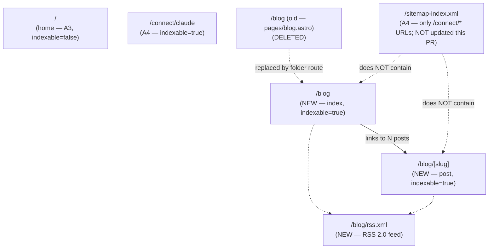
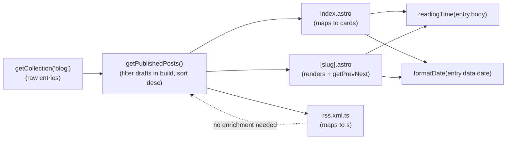
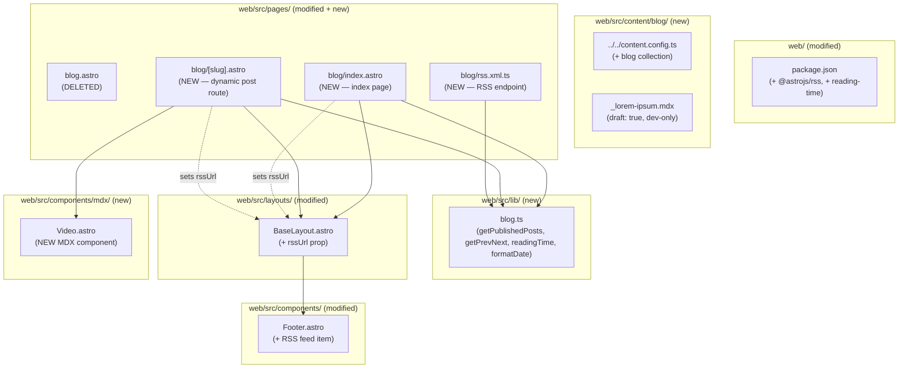

# Tech Plan — A5 Skeleton Blog (#303)

## Architectural Approach

### Key Decisions

| Decision | Choice | Rationale |
|---|---|---|
| Pattern inheritance | **Mirror the `connect/` collection pattern** end-to-end | A4 (#302) shipped, validated, and is the canonical content-collection precedent on this site. New patterns = new bugs; `blog` is "same shape, different schema". |
| Content authoring location | **`web/src/content/blog/{slug}.mdx`** via Zod-validated content collection | Type-safe frontmatter, scales 0→N posts with zero infra reshape, reuses A4's render pipeline |
| Page rendering | **Single dynamic route `web/src/pages/blog/[slug].astro`** using `getStaticPaths` + `render(entry)` | Astro-canonical, one route file owns all `/blog/*` post URLs |
| Index page | **`web/src/pages/blog/index.astro`** (folder route, replaces today's `web/src/pages/blog.astro`) | Folder route required because we need sibling routes (`[slug].astro`, `rss.xml.ts`); Astro can't resolve `blog.astro` + `blog/index.astro` simultaneously |
| Existing placeholder cleanup | **Delete `web/src/pages/blog.astro`** in the same commit as creating the folder route | Coexisting would Astro-error or shadow unpredictably |
| Layout split | **No separate `BlogLayout.astro`** — `[slug].astro` directly composes `BaseLayout` + post header + `<Content />` | Same discipline as A4's `connect/[slug].astro` — one less indirection |
| Frontmatter schema | `title`, `date` (`z.coerce.date()`), `excerpt` (required, ≤220 chars), `tags` (string[]), `ogImage` (optional string), `draft` (boolean, default false) | Locked during grilling; no `author` (hardcoded site-wide), no `updated` (git is truth), no `featured` (premature) |
| Slug source | **File id = URL slug** (filename without `.mdx` → kebab `/blog/<slug>`) | Same convention as `connect/`; no frontmatter `slug` override needed |
| Additive-only schema | New required fields land as `.optional()` first, backfill, tighten if/when needed | A4-established discipline; required field without a default breaks every existing post's build |
| RSS feed | **`@astrojs/rss` package**, endpoint at `web/src/pages/blog/rss.xml.ts` | Official, handles RFC822 dates + XML escaping (the W3C-validator landmines). Considered hand-rolled XML; rejected — the failure modes are exactly what the package solves. |
| RSS scope | **Excerpt-only** in `<description>`, no `<content:encoded>` | Locked grilling. Excerpt is the hook; clicks go to the post for the full craft (typography, code, images, video). Cheap to upgrade to full content later if a real subscriber asks. |
| RSS metadata | `title="GymLogic Blog"`, `description="Engineering write-ups, postmortems, and process notes from building GymLogic."`, `<link>` absolute via `Astro.site` | Title aligns with the visible page; description matches the visible intro line + `<meta description>` |
| RSS items | `pubDate` from frontmatter `date`, `categories` from `tags`, `link` absolute, `description` from `excerpt`, `customData: <language>en-us</language>` | Standard RSS 2.0; W3C validator-compliant |
| Reading time | **`reading-time` npm package**, computed at build time in `web/src/lib/blog.ts` from `entry.body` | Locked grilling. Tiny, battle-tested. `Math.max(1, ceil)` floor guards against absurd "0 min read" rounding. |
| Prev/next semantics | **prev = older, next = newer**; labels "Older" / "Newer" with the post title underneath; one-sided at edges | Locked grilling. Convention bias + symmetric labelling stays unambiguous |
| Prev/next chain source | Same `getPublishedPosts()` helper as the index — single source of truth | Drafts excluded from chain in build; included in dev (consistent with what's visible in the index) |
| Draft visibility | **`draft: true` posts render in `astro dev` only**, filtered out of `astro build` (preview deploys + prod) | One-line `import.meta.env.DEV` toggle in `getPublishedPosts()` |
| Visual fixture | **Permanent `web/src/content/blog/_lorem-ipsum.mdx`** with `draft: true` exercising every layout primitive (prose / code / `<Screenshot>` / `<Video>` / tags / multi-tag / long body) | Pure dev-mode visual regression check; cannot leak to prod |
| Fixture filename prefix | `_` prefix is hygiene-only — Astro's glob loader does NOT auto-skip underscored files | Real gating happens via `draft: true`. The `_` is a reader signal: "this file is not a real post". |
| Tag display — index card | `<Badge variant="outline">` chips, top of each row | Locked grilling. shadcn primitive, restrained outline variant signals "non-clickable". |
| Tag display — post page | `<Badge variant="outline">` on its own line below the byline (line 1 = `date · reading time`, line 2 = badges) | Locked grilling |
| Tag display — clickability | **Static, non-clickable** in v1 — no filter pages | Tag enum + filter pages = premature. Re-evaluate at N > 5 posts. |
| Index card density | **Tier 2** — title + date + reading time + excerpt + tags as outline badges, hairline divider between rows, no card chrome, whole row clickable | Locked grilling |
| Empty state | Render the same h1 + intro line; replace post list with `"Nothing here yet — first post lands with the public launch.<br/>Subscribe via [RSS](/blog/rss.xml) to get notified."` | Tasteful, dry, no exclamation marks, RSS as the only CTA |
| Index page chrome | h1 = `"Blog"` + always-visible tertiary RSS link on the right of the h1; intro line (always shown) = `"Engineering write-ups, postmortems, and process notes from building GymLogic."`; matches `<meta description>` | Locked grilling + Phase 3 final |
| Post page chrome | `prose prose-invert mx-auto max-w-3xl px-4 pb-24` reused from `connect/[slug].astro`; h1 from frontmatter; byline + tags below; MDX body; prev/next nav at bottom | Reuse A4's prose container; identical typography + spacing |
| Date display format | **`"12 May 2026"`** via `Intl.DateTimeFormat('en-GB', { year: 'numeric', month: 'long', day: 'numeric' })`, wrapped in `<time datetime={isoDate}>` | Locked Phase 3. Neutral between US/FR conventions, same English chrome as the rest of the site, machine-readable via the wrapping `<time>`. |
| Heading hierarchy | **Hero h1 = only h1**; MDX body starts at h2. Astro auto-generates anchor IDs from h2 via `github-slugger` | A4-established convention. Reviewer enforces. |
| `<Video>` MDX component | **New** `web/src/components/mdx/Video.astro`, parallel to `Screenshot.astro`. Props: `src`, `poster?`, `caption?`, `width?`, `height?`. Inline `<video controls preload="metadata" playsinline>`. No autoplay, no cinema-mode dialog. | Locked grilling. ~30 LOC, isolated, reuse-friendly. Cinema-mode dialog is `DemoVideo.astro`'s job for landing page; blog posts are different ergonomics. |
| `<Video>` preload default | **`preload="metadata"`** | Locked Phase 2. Default for the typical case (1 video per post); upgrade path to `preload="none"` if posts get multi-video heavy |
| `<Video>` autoplay | **No autoplay, no muted, no loop** | Different ergonomics from landing-page demos; reader chooses to engage |
| Video asset storage | **`web/public/blog/<slug>/<filename>.mp4`** (and `.jpg` poster sidecar) | Static, no Astro asset transform on MP4s. Mirrors the existing `web/public/demo-*.mp4` pattern. |
| Image asset storage | **`web/src/assets/blog/<slug>/<filename>.webp`** (bundled, hashed, AVIF auto-generated) | Same pipeline as `connect/claude/*.webp` — Astro `<Image>` via `<Screenshot>` |
| MDX component injection | Per-page in `[slug].astro`: `<Content components={{ Callout, TechHeavy, ComingSoon, Screenshot, Video }} />` | Explicit grep-able list, matches A4's pattern (no global `mdx-components.ts`) |
| Content collection helper | **New module `web/src/lib/blog.ts`** exporting `getPublishedPosts()`, `getPrevNext(slug, posts)`, `readingTime(body)`, `formatDate(date)` | Single source of truth for filtering + sorting + display. Used by index, [slug], rss.xml.ts. |
| `getPublishedPosts()` filter | `import.meta.env.DEV` ? include all : exclude `draft === true` | Single line gates dev-vs-build behavior |
| Posts sort | `date` desc primary; `id` (filename) `localeCompare` asc as tiebreaker for same-day posts | Deterministic, no thrash on rebuilds |
| RSS surfacing — head | `<link rel="alternate" type="application/rss+xml" title="GymLogic Blog" href="https://docs.gymlogic.me/blog/rss.xml">` in `<head>` of `/blog/**` only | New optional `rssUrl?: string` prop on `BaseLayout`; passed by `index.astro` and `[slug].astro`. NOT site-wide. |
| RSS surfacing — footer | New 4th item in Footer's "Docs" group: `{ href: '/blog/rss.xml', label: 'RSS feed', external: false }` | Visible affordance for power users; unobtrusive |
| RSS surfacing — index page | Always-visible tertiary inline `RSS` link to the right of the h1 + restated in empty state | Quiet enough not to compete, present enough to be one-glance discoverable |
| Sitemap | **No change to `astro.config.mjs`** — sitemap broadening deferred to A6 (#304) | Locked grilling. Scheduling risk acknowledged: launch post may have 0 sitemap presence until A6 lands. |
| Indexable opt-in | `BaseLayout` prop `indexable={true}` passed by `/blog/index.astro` and `/blog/[slug].astro` | Same opt-in pattern A4 uses; A6 will invert default and clean up |
| Canonical URL | Auto-derived by `BaseLayout` from `Astro.site + Astro.url.pathname` | No per-page override needed |
| OG image — defaults | None. Posts without explicit `ogImage` ship without OG meta tags (`BaseLayout` only emits `og:*` when `ogImage` provided). | A6 owns site-wide OG defaults. Posts with their own `ogImage` get full `og:* + twitter:*` block. |
| Header / Footer / MobileNav surgery | **Header: no change** (already has `/blog` link with icon + active-state via `startsWith`). **Footer: add "RSS feed" item to Docs group**. **MobileNav: no change** (reuses Header's link list). | A2 already wired the `/blog` nav surface; we just light it up |
| Tests | **Zero tests in this PR** | Locked grilling. Wire Vitest to `web/` when the next non-trivial helper lands; current helpers are too small to justify infra cost. |
| Smoke-test gating | **First commit installs `@astrojs/rss` + `reading-time`**, adds stub `web/src/pages/blog/rss.xml.ts` returning empty feed, runs `npm run build` (with `required_permissions: ["all"]`) + `npx astro check` locally. **No content/index work proceeds until both pass.** | Locked Phase 2. A4-established discipline. Prevents 5-commit revert if `@astrojs/rss` × Astro 6 × rolldown-vite bites. |
| PR sequencing | **Single PR**, ~4 commits: (1) smoke-test deps + stub endpoint, (2) lib + schema + index + [slug] + Video, (3) RSS feed real + autodiscovery + footer, (4) lorem-ipsum fixture | Locked Phase 2. Surface is tight; splitting adds ceremony for half a day of work |

### Critical Constraints

**The MDX integration is already validated.** Unlike A4's first-commit smoke-test gate, A5 inherits a proven `@astrojs/mdx` × Astro 6 × Tailwind v4 pipeline. The smoke-test discipline this PR keeps is narrower: validate that `@astrojs/rss` and `reading-time` install cleanly and that the stub feed endpoint builds. If `@astrojs/rss` bites, the fallback is hand-rolled XML in `rss.xml.ts` (~40 LOC) — uglier but unblocks the launch.

**Path conflict with the existing `web/src/pages/blog.astro`.** Today's placeholder is a single-file route. The new structure requires a folder route (`pages/blog/index.astro` + `pages/blog/[slug].astro` + `pages/blog/rss.xml.ts`). Astro can't resolve both — the file route and the folder's index.astro both target `/blog`. **Deletion of `blog.astro` and creation of `blog/index.astro` must land in the same commit** (or build fails with route-collision error).

**The `draft` flag's dev-mode toggle is `import.meta.env.DEV`-based.** This evaluates `true` only in `astro dev`. `astro preview` (which serves a built site for local QA) and any deploy (preview or prod) see `false` and hide drafts. Side effect: Pierre running `npm run preview` from `web/` to validate a build will NOT see the lorem-ipsum fixture or any draft post. This is the *intended* behavior for him (`preview` is a build smoke check, not a content preview), but flagged in implementation notes so it doesn't surprise.

**No OG defaults until A6.** Posts shipped without an explicit `ogImage` frontmatter value will share with no preview card on social platforms. The launch write-up — likely the first real post — should ship with a manually-crafted `ogImage` to avoid this. A6 (#304) owns site-wide OG defaults; until then, the trade-off is "explicit per-post OG or no card at all".

**Sitemap broadening is deferred to A6 — accepted scheduling risk.** The launch write-up published before A6 lands will have zero sitemap presence. Mitigation if it bites: a one-line PR to broaden the sitemap regex in `astro.config.mjs`. Pre-A6, we rely on RSS + direct sharing for discovery.

**The `_lorem-ipsum.mdx` fixture is a permanent dev-only artifact.** It lives in the repo forever as a layout-regression check. Future contributors editing typography, Shiki theme, or `<Screenshot>` / `<Video>` should `cd web && npm run dev` and visit `/blog/lorem-ipsum` as part of their visual QA loop. **It must never have `draft: false`.** A reviewer-enforced rule, not a CI gate.

**Excerpt is plain text only.** RSS readers receive the excerpt as `<![CDATA[...]]>` text; markdown syntax (e.g. `**bold**`) renders literally. The schema enforces `z.string()`, the writer's responsibility is plain-text discipline. Documenting in the implementation notes; no automated enforcement.

**Schema is additive-only across PRs.** Adding a required field without a default breaks the build for every existing post (and the lorem fixture). New required fields land as `.optional()` first, get backfilled across all posts, then tighten if needed. A4's discipline; same applies here.

**`reading-time` over raw MDX body slightly inflates word count.** `entry.body` includes the raw MDX string with `import` lines and JSX tags. Component names (`Screenshot`, `Video`, `Callout`) are counted as words. The inflation is uniform across posts and well below the noise floor for "X min read" display — readers don't notice "8 min" vs "6 min". Acceptable for v1.

**Brief drift acknowledged.** This Tech Plan operates without a paired `docs/Epic_Brief_—_A5_*.md` file (unlike A1, A2, A4). The de facto brief is the GitHub issue body for #303 plus the grilling session that preceded this plan. Two scope additions vs the GitHub issue: a `draft` schema field and a new `<Video>` MDX component. Both deliberate; called out in the recap.

---

## Data Model

A5 has no persistent data model. The load-bearing artifacts are three:

1. **The `blog` content collection schema** — Zod definition for what frontmatter every post can/must declare.
2. **The route topology** post-A5 — what `/blog/*` URL paths exist and what each emits.
3. **The post-query data flow** — how `getPublishedPosts()` filters and sorts collection entries, consumed by the index, the dynamic route, and the RSS endpoint.

### 1. Content Collection Schema

```ts
// web/src/content.config.ts (modified — adds `blog` alongside existing `connect`)
import { defineCollection, z } from 'astro:content'
import { glob } from 'astro/loaders'

const connect = defineCollection({ /* unchanged */ })

const blog = defineCollection({
  loader: glob({ pattern: '**/*.mdx', base: './src/content/blog' }),
  schema: z.object({
    title: z.string().min(1),
    date: z.coerce.date(),
    excerpt: z.string().min(1).max(220),
    tags: z.array(z.string()).default([]),
    ogImage: z.string().optional(),
    draft: z.boolean().default(false),
  }),
})

export const collections = { connect, blog }
```

**Schema notes:**

- **`date: z.coerce.date()`** parses YAML's `date: 2026-05-12` into a JS `Date` (UTC midnight). Sorting + `pubDate` formatting work without re-parsing.
- **`excerpt: z.string().min(1).max(220)`** required, hand-written. Cap at 220 chars so RSS readers don't wrap weirdly.
- **`tags: z.array(z.string()).default([])`** free strings, no enum (premature until 5+ posts). Empty array allowed (a post without tags renders no badge row).
- **`ogImage: z.string().optional()`** path under `/public` (e.g. `/blog/launch/og.png`) or absolute URL. No `image()` validator because OG images live in `web/public/`, not `src/assets/`.
- **`draft: z.boolean().default(false)`** explicit default; existing posts without the field are not drafts.
- **No `slug` field** — file id (filename without `.mdx`) IS the slug, by Astro 6 glob-loader convention. Filenames are kebab-case by hygiene (`launch-week.mdx` → `/blog/launch-week`).

### 2. Route Topology Post-A5



**Notes:**

- `/blog`, `/blog/<slug>` are `indexable=true` — but invisible to crawlers via the sitemap (deferred to A6). Direct visits work; crawler discovery relies on RSS + manual sharing pre-A6.
- `/blog/rss.xml` is excluded from the sitemap by the existing regex (`.xml` suffix doesn't match the `/connect/[a-z-]+/?$` pattern).
- The dynamic route `[slug].astro` only emits paths for posts where `getPublishedPosts()` returns the entry. Drafts don't get static routes in build mode.

### 3. Post-Query Data Flow



**Notes:**

- `getPublishedPosts()` is the single bottleneck. Changing the draft toggle (e.g. adding `import.meta.env.PROD || queryParam`) requires editing one function.
- Reading time is computed **per consumer call** (not pre-cached on the entry). Pure derivation over `entry.body`; cheap. Re-running on every page render is fine.
- `formatDate()` is similarly pure, called from index card and post header. ISO date for `<time datetime>`, en-GB formatted (`"12 May 2026"`) for display.
- The RSS endpoint doesn't need reading time (excerpt-only feed, no per-item time display).

---

## Component Architecture

### Layer Overview



### New Files & Responsibilities

| File | Purpose |
|---|---|
| `web/src/content.config.ts` | **Modified** — adds `blog` collection alongside existing `connect`. Schema per the Data Model section. |
| `web/src/content/blog/_lorem-ipsum.mdx` | **New (permanent dev fixture)** — `draft: true`, exercises every layout primitive: prose, code blocks (multiple langs), inline code, blockquotes, ordered/unordered lists, `<Screenshot>`, `<Video>`, multi-tag, long body, `<details>`, links. Pierre uses this as the visual regression check via `astro dev`. Never reaches production. |
| `web/src/lib/blog.ts` | **New** — exports `getPublishedPosts(): Promise<BlogEntry[]>` (filters drafts in build, sorts date desc with id tiebreaker), `getPrevNext(slug, posts): { older, newer }` (linear scan, returns `undefined` at edges), `readingTime(body: string): number` (ceil + floor at 1, via `reading-time` package), `formatDate(date: Date): string` (en-GB `"12 May 2026"`). Pure module, no side effects beyond the collection fetch. |
| `web/src/pages/blog/index.astro` | **New** — index page. Calls `getPublishedPosts()`, renders h1 `"Blog"` + always-visible tertiary RSS link + intro line. If `posts.length === 0`: renders empty state copy. Else: renders rows mapping each post to: `<Badge variant="outline">` row (tags) + `text-muted` row (`date · reading time`) + h2 title + excerpt paragraph. Hairline divider between rows. Whole row is a single `<a>`. Wrapped in `<BaseLayout title="Blog — GymLogic" description="..." indexable rssUrl="/blog/rss.xml">`. |
| `web/src/pages/blog/[slug].astro` | **New** — dynamic post route. `getStaticPaths()` returns one entry per post in `getPublishedPosts()`. Renders: `<BaseLayout title={frontmatter.title} description={excerpt} indexable rssUrl="/blog/rss.xml" ogImage={frontmatter.ogImage}>` → post header (h1, byline `date · reading time`, badge row with tags) → `<article class="prose prose-invert mx-auto max-w-3xl px-4 pb-12">` → `<Content components={{ Callout, TechHeavy, ComingSoon, Screenshot, Video }} />` → prev/next nav (`max-w-3xl` flex-row, `border-t border-border pt-8`, "← Older" / "Newer →" labels with post titles below). |
| `web/src/pages/blog/rss.xml.ts` | **New** — RSS endpoint. Imports `rss` from `@astrojs/rss`. `GET` handler returns `rss({ title: 'GymLogic Blog', description: '...', site: context.site!, items: posts.map(p => ({ title, pubDate: p.data.date, description: p.data.excerpt, link: '/blog/' + p.id + '/', categories: p.data.tags })), customData: '<language>en-us</language>' })`. |
| `web/src/components/mdx/Video.astro` | **New** — MDX component. Props: `src: string` (required, path under `/public`), `poster?: string`, `caption?: string`, `width?: number`, `height?: number`. Renders `<figure class="not-prose my-8">` containing a wrapper div with `aspect-ratio` (computed from width/height if passed, else fluid), `<video controls preload="metadata" playsinline class="block w-full h-auto">` with `<source>` (MIME inferred from extension), and optional `<figcaption class="mt-3 text-sm text-muted text-center italic">`. No autoplay, no loop, no muted. |

### Modified Files

| File | Modification |
|---|---|
| `web/package.json` | Add deps: `@astrojs/rss` (latest stable for Astro 6.x), `reading-time` (`^1.5.0`). Both in `dependencies`. |
| `web/src/content.config.ts` | Add `blog` collection definition; add `blog` to the `collections` export. Existing `connect` untouched. |
| `web/src/layouts/BaseLayout.astro` | Add optional prop `rssUrl?: string`. Emit `<link rel="alternate" type="application/rss+xml" title="GymLogic Blog" href={new URL(rssUrl, Astro.site).toString()}>` in `<head>` only when `rssUrl` provided. All other behavior unchanged. |
| `web/src/components/Footer.astro` | Add 4th item to `groups[1].links` ("Docs" group): `{ href: '/blog/rss.xml', label: 'RSS feed', external: false }`. Position: after the existing `/about` link. |

### Deleted Files

| File | Reason |
|---|---|
| `web/src/pages/blog.astro` | Replaced by `web/src/pages/blog/index.astro` (folder route). Coexisting would Astro-error on duplicate routes for `/blog`. Deletion lands in the same commit as folder creation. |

### Component Responsibilities

**`web/src/lib/blog.ts`**

```ts
import { getCollection, type CollectionEntry } from 'astro:content'
import readingTimeFn from 'reading-time'

export type BlogEntry = CollectionEntry<'blog'>

export async function getPublishedPosts(): Promise<BlogEntry[]> {
  const includeDrafts = import.meta.env.DEV
  return (await getCollection('blog'))
    .filter((p) => includeDrafts || !p.data.draft)
    .sort((a, b) => {
      const dt = b.data.date.getTime() - a.data.date.getTime()
      return dt !== 0 ? dt : a.id.localeCompare(b.id)
    })
}

export function getPrevNext(slug: string, posts: BlogEntry[]) {
  const i = posts.findIndex((p) => p.id === slug)
  if (i === -1) return { older: undefined, newer: undefined }
  return {
    newer: i > 0 ? posts[i - 1] : undefined,
    older: i < posts.length - 1 ? posts[i + 1] : undefined,
  }
}

export function readingTime(body: string): number {
  return Math.max(1, Math.ceil(readingTimeFn(body).minutes))
}

const fmt = new Intl.DateTimeFormat('en-GB', {
  year: 'numeric',
  month: 'long',
  day: 'numeric',
})

export function formatDate(date: Date): string {
  return fmt.format(date)
}
```

- All functions pure; module-level `fmt` instance is reused across calls.
- Sort uses date desc primary, id asc tiebreaker for determinism on same-day posts.
- `getPrevNext` is O(N) per call — fine for N < 100; no need to memoize.

**`web/src/pages/blog/index.astro`**

```astro
---
import BaseLayout from '@/layouts/BaseLayout.astro'
import { Badge } from '@/components/ui/badge'
import { getPublishedPosts, formatDate, readingTime } from '@/lib/blog'

const posts = await getPublishedPosts()
const description =
  'Engineering write-ups, postmortems, and process notes from building GymLogic.'
---

<BaseLayout
  title="Blog — GymLogic"
  description={description}
  indexable
  rssUrl="/blog/rss.xml"
>
  <section class="mx-auto max-w-3xl px-4 pt-16 pb-12">
    <div class="flex items-baseline justify-between gap-4">
      <h1 class="text-4xl md:text-5xl font-semibold tracking-tight text-foreground">
        Blog
      </h1>
      <a
        href="/blog/rss.xml"
        class="text-sm text-muted hover:text-foreground motion-safe:transition-colors motion-safe:duration-150"
      >
        RSS
      </a>
    </div>
    <p class="mt-6 text-lg text-muted leading-relaxed">{description}</p>
  </section>

  <section class="mx-auto max-w-3xl px-4 pb-24">
    {posts.length === 0 ? (
      <p class="text-lg text-muted leading-relaxed">
        Nothing here yet — first post lands with the public launch.
        <br />
        Subscribe via <a href="/blog/rss.xml" class="text-accent hover:text-foreground motion-safe:transition-colors motion-safe:duration-150">RSS</a> to get notified.
      </p>
    ) : (
      <ul class="divide-y divide-border">
        {posts.map((post) => {
          const slug = post.id
          const minutes = readingTime(post.body)
          return (
            <li>
              <a
                href={`/blog/${slug}`}
                class="group block py-8"
              >
                {post.data.tags.length > 0 && (
                  <div class="flex flex-wrap gap-2">
                    {post.data.tags.map((tag) => (
                      <Badge variant="outline">{tag}</Badge>
                    ))}
                  </div>
                )}
                <p class="mt-3 text-sm text-muted">
                  <time datetime={post.data.date.toISOString().slice(0, 10)}>
                    {formatDate(post.data.date)}
                  </time>
                  <span> · </span>
                  <span>{minutes} min read</span>
                </p>
                <h2 class="mt-2 text-2xl font-semibold tracking-tight text-foreground motion-safe:transition-colors motion-safe:duration-150 group-hover:text-accent">
                  {post.data.title}
                </h2>
                <p class="mt-3 text-base text-muted leading-relaxed">
                  {post.data.excerpt}
                </p>
              </a>
            </li>
          )
        })}
      </ul>
    )}
  </section>
</BaseLayout>
```

**`web/src/pages/blog/[slug].astro`**

```astro
---
import { render } from 'astro:content'
import BaseLayout from '@/layouts/BaseLayout.astro'
import { Badge } from '@/components/ui/badge'
import Callout from '@/components/mdx/Callout.astro'
import TechHeavy from '@/components/mdx/TechHeavy.astro'
import ComingSoon from '@/components/mdx/ComingSoon.astro'
import Screenshot from '@/components/mdx/Screenshot.astro'
import Video from '@/components/mdx/Video.astro'
import { getPublishedPosts, getPrevNext, formatDate, readingTime } from '@/lib/blog'

export async function getStaticPaths() {
  const posts = await getPublishedPosts()
  return posts.map((post) => ({ params: { slug: post.id }, props: { post, posts } }))
}

const { post, posts } = Astro.props
const { Content } = await render(post)
const { older, newer } = getPrevNext(post.id, posts)
const minutes = readingTime(post.body)
---

<BaseLayout
  title={post.data.title}
  description={post.data.excerpt}
  indexable
  rssUrl="/blog/rss.xml"
  ogImage={post.data.ogImage}
>
  <section class="mx-auto max-w-3xl px-4 pt-16 pb-8">
    <h1 class="text-4xl md:text-5xl font-semibold tracking-tight text-foreground">
      {post.data.title}
    </h1>
    <p class="mt-6 text-sm text-muted">
      <time datetime={post.data.date.toISOString().slice(0, 10)}>
        {formatDate(post.data.date)}
      </time>
      <span> · </span>
      <span>{minutes} min read</span>
    </p>
    {post.data.tags.length > 0 && (
      <div class="mt-3 flex flex-wrap gap-2">
        {post.data.tags.map((tag) => (
          <Badge variant="outline">{tag}</Badge>
        ))}
      </div>
    )}
  </section>

  <article class="prose prose-invert mx-auto max-w-3xl px-4 pb-12">
    <Content components={{ Callout, TechHeavy, ComingSoon, Screenshot, Video }} />
  </article>

  <nav
    aria-label="Post navigation"
    class="mx-auto max-w-3xl px-4 pb-24 border-t border-border pt-8"
  >
    <div class="flex flex-col sm:flex-row sm:justify-between gap-6">
      {older ? (
        <a href={`/blog/${older.id}`} class="group flex-1">
          <p class="text-sm text-muted">← Older</p>
          <p class="mt-1 text-base text-foreground motion-safe:transition-colors motion-safe:duration-150 group-hover:text-accent">
            {older.data.title}
          </p>
        </a>
      ) : (
        <span aria-hidden="true" class="flex-1" />
      )}
      {newer ? (
        <a href={`/blog/${newer.id}`} class="group flex-1 sm:text-right">
          <p class="text-sm text-muted">Newer →</p>
          <p class="mt-1 text-base text-foreground motion-safe:transition-colors motion-safe:duration-150 group-hover:text-accent">
            {newer.data.title}
          </p>
        </a>
      ) : (
        <span aria-hidden="true" class="flex-1" />
      )}
    </div>
  </nav>
</BaseLayout>
```

**`web/src/pages/blog/rss.xml.ts`**

```ts
import rss from '@astrojs/rss'
import type { APIContext } from 'astro'
import { getPublishedPosts } from '@/lib/blog'

export async function GET(context: APIContext) {
  const posts = await getPublishedPosts()
  return rss({
    title: 'GymLogic Blog',
    description:
      'Engineering write-ups, postmortems, and process notes from building GymLogic.',
    site: context.site!,
    items: posts.map((post) => ({
      title: post.data.title,
      pubDate: post.data.date,
      description: post.data.excerpt,
      link: `/blog/${post.id}/`,
      categories: post.data.tags,
    })),
    customData: '<language>en-us</language>',
  })
}
```

- `context.site` is set by `astro.config.mjs` (`site: 'https://docs.gymlogic.me'`) — `link` resolution is automatic per `@astrojs/rss` docs.
- Drafts excluded automatically via `getPublishedPosts()`. In dev mode the feed contains drafts (consistent with what the index shows); in build mode it doesn't.
- No `stylesheet` — RSS readers don't need one; browsers visiting the URL see raw XML, which is fine for a tertiary surface.

**`web/src/components/mdx/Video.astro`**

```astro
---
interface Props {
  src: string
  poster?: string
  caption?: string
  width?: number
  height?: number
}
const { src, poster, caption, width, height } = Astro.props
const ext = src.split('.').pop()?.toLowerCase()
const mimeType = ext === 'webm' ? 'video/webm' : 'video/mp4'
const aspectStyle = width && height
  ? `aspect-ratio: ${width} / ${height};`
  : ''
---
<figure class="not-prose my-8">
  <div
    class="overflow-hidden rounded-lg border border-border bg-card"
    style={aspectStyle}
  >
    <video
      controls
      preload="metadata"
      playsinline
      poster={poster}
      class="block w-full h-auto"
      width={width}
      height={height}
    >
      <source src={src} type={mimeType} />
      Your browser does not support the video tag.
    </video>
  </div>
  {caption && (
    <figcaption class="mt-3 text-sm text-muted text-center italic">
      {caption}
    </figcaption>
  )}
</figure>
```

- `not-prose` escapes prose typography (matches `Screenshot.astro`'s pattern).
- `preload="metadata"` per locked Phase 2 decision.
- `aspect-ratio` style only emitted if both `width` and `height` provided — otherwise the video fills its container fluidly.
- Single `<source>` (MP4 default, WebM if extension matches). Multi-source is YAGNI for v1.

**`BaseLayout.astro` (modified)**

- Add optional `rssUrl?: string` prop.
- In `<head>` (after the canonical link, before fonts):
  ```astro
  {rssUrl && (
    <link
      rel="alternate"
      type="application/rss+xml"
      title="GymLogic Blog"
      href={new URL(rssUrl, Astro.site).toString()}
    />
  )}
  ```
- All other behavior unchanged.

**`Footer.astro` (modified)**

- `groups[1].links` (Docs group) gets a 4th item:
  ```ts
  { href: '/blog/rss.xml', label: 'RSS feed', external: false }
  ```
- Position: after `/about`. No structural change.

### Failure Mode Analysis

| Failure | Behavior |
|---|---|
| `@astrojs/rss` × Astro 6 × rolldown-vite incompat | First-commit smoke build / `astro check` fails. **Detection**: smoke gate. **Resolution**: hand-roll RSS XML in `rss.xml.ts` (~40 LOC); fallback documented in implementation notes. |
| `reading-time` package update breaks API contract | `readingTimeFn(body).minutes` no longer exists. **Detection**: TS build error. **Resolution**: pin to `^1.5.x` (semver-stable for years). |
| Path collision: `pages/blog.astro` not deleted in same commit as `pages/blog/index.astro` creation | Astro errors on duplicate route for `/blog`. **Detection**: build fails immediately. **Resolution**: delete in same commit. |
| W3C Feed Validator rejects the feed | Validator complains about `pubDate` format, missing `<atom:link>`, or unescaped chars. **Detection**: manual run pre-merge. **Resolution**: `@astrojs/rss` handles all three by default — if it doesn't, file an upstream issue and patch via `customData`. |
| Empty feed (0 posts) at launch | Valid RSS 2.0 — feed validates with no `<item>` entries. **Detection**: not actually a failure. **Resolution**: no action. |
| `import.meta.env.DEV` evaluates `false` in `astro preview` | Pierre running `npm run preview` from `web/` doesn't see drafts. **Detection**: confusion only if Pierre expects `preview` to mirror `dev`. **Mitigation**: documented in implementation notes. Use `astro dev` for content QA, `astro preview` for build QA. |
| Draft post leaks to production | Build accidentally includes a draft. **Detection**: post appears in `dist/blog/<slug>/index.html` and on the live index. **Mitigation**: `getPublishedPosts()` is the single chokepoint; draft filter is a one-line predicate. Verifiable post-build via `ls dist/blog/`. |
| `_lorem-ipsum.mdx` accidentally has `draft: false` | Fixture leaks to production. **Detection**: post appears at `https://docs.gymlogic.me/blog/lorem-ipsum`. **Mitigation**: schema validation + reviewer enforcement. Cheap blast radius (delete the file). |
| `<Video>` without `poster` attribute on a slow connection | Black box until first frame loads (2-5s on 3G). **Detection**: visual smoke on a throttled connection. **Mitigation**: encourage all blog post videos to ship with a poster sidecar. Document in PR description / blog post template. |
| `<Video>` with mismatched `width`/`height` props vs actual aspect | CSS `aspect-ratio` reserves wrong space; layout shifts when video metadata loads. **Detection**: CLS in Lighthouse. **Mitigation**: writer's responsibility to declare correct dimensions. Common values: `width={1920} height={1080}` for 16:9. |
| Reading-time package crashes on empty body | Astro renders zero-content posts. **Detection**: build error or "0 min read". **Mitigation**: `Math.max(1, ...)` floor in `readingTime()` guards against 0. Empty body = "1 min read". |
| Two posts share identical date + identical filename — impossible given filesystem uniqueness | N/A — `localeCompare` tiebreaker is deterministic across builds. |
| Frontmatter `excerpt` contains markdown like `**bold**` | RSS readers display literal `**bold**`. **Detection**: visual on first feed render. **Mitigation**: documented as "plain text only". No automated enforcement. |
| Frontmatter `tags` array contains strings with weird chars (`/`, spaces, accents) | Renders as badges literally — fine for display; if we ever build filter pages, URL-encoding matters. **Mitigation**: not a v1 problem; convention is lowercase-kebab-or-single-word. |
| Future post date (e.g. `date: 2027-12-31`) on a non-draft post | Post is published immediately — sort puts it at the top of the list. **Mitigation**: no scheduled-publish logic in v1; `draft: true` is the embargo mechanism. |
| Date timezone surprise — `2026-05-12` → UTC midnight → display as "11 May" in negative UTC offsets | Cosmetic only. **Mitigation**: en-GB `Intl.DateTimeFormat` formats UTC date as the date part of UTC midnight, which is consistent (12 May always renders as 12 May). Verified. |
| Astro's `entry.id` includes the file extension or path prefix | `slug` doesn't match `/blog/<filename>`. **Mitigation**: Astro 6 glob loader with `base: './src/content/blog'` and `pattern: '**/*.mdx'` produces id without extension or prefix. Verified via A4. |
| Folder route `pages/blog/index.astro` not picked up by Astro | `/blog` returns 404. **Detection**: dev mode immediately. **Mitigation**: standard Astro convention; if it breaks, the framework is broken. |
| `<link rel="alternate">` autodiscovery on `/blog/<slug>` confuses feed readers (subscribing to a single post) | Feed readers walk the autodiscovery link to the actual `rss.xml`, not the page they found it on. Standard behavior; no issue. |
| Footer "RSS feed" link + Header active state | Footer link active state checking already uses `startsWith` + path normalization — `/blog/rss.xml` doesn't match `/blog`. Verified during exploration. No false-active-state risk. |
| MDX file with `draft: true` referenced by Markdown link in another post | Broken link in production (the draft post doesn't get a static route). **Detection**: 404 on click. **Mitigation**: writer's responsibility; reviewer enforces. |
| `getStaticPaths` returns no entries when 0 posts published | Astro emits zero `/blog/<slug>` routes. **Detection**: build succeeds with no warnings. **Mitigation**: not a failure — index page renders empty state. |
| `customData: '<language>en-us</language>'` rejected by older RSS readers | Edge case; modern readers tolerate it. **Mitigation**: `en-us` is RSS 2.0 spec-compliant. No action. |
| Reading time package has transitive vulnerabilities flagged by `npm audit` | CI noise. **Detection**: `npm audit` post-install. **Mitigation**: `reading-time@^1.5.0` has no known transitive issues; revisit if Dependabot flags. |
| Tags badge wraps awkwardly on narrow viewports | Multiple badges stack on 2+ rows on mobile. **Mitigation**: `flex flex-wrap gap-2` handles wrapping; no layout break. |
| `prose-invert` doesn't tint `<Video>` `<figure>` correctly | Video gets prose padding/typography. **Mitigation**: `<Video>` uses `not-prose` class — same pattern as `<Screenshot>`. Verified. |
| Smoke-test commit's stub RSS endpoint emits invalid XML | Build fails or feed returns malformed XML. **Detection**: smoke gate catches it. **Mitigation**: stub uses `rss()` with empty `items: []` — guaranteed valid empty feed. |
| Index card whole-row `<a>` wraps a Badge component (a `<div>`) — invalid HTML (interactive content nested inside an `<a>`) | Browsers accept it, accessibility tools flag it. **Detection**: `astro check` likely won't flag (HTML semantics not type-checked). **Mitigation**: `<Badge>` renders a `<div>` non-interactive; nesting is technically permissive in HTML5 (interactive content rule only forbids buttons/inputs/other anchors inside `<a>`). Acceptable. |

---

## Implementation Notes

Breadcrumbs for the implementer (probably future me):

- **Smoke-test commit (commit 1)**: Run `cd web && npm i @astrojs/rss reading-time` (lock to whatever stable version maps to Astro 6.2.x). Add a stub `web/src/pages/blog/rss.xml.ts` returning `rss({ title: 'smoke', description: 'smoke', site: context.site!, items: [] })`. Add the `blog` collection to `content.config.ts` with the schema. **Do NOT** create `pages/blog/index.astro` or `pages/blog/[slug].astro` yet (would collide with the existing `pages/blog.astro`). Run `cd web && npm run build` (with `required_permissions: ["all"]` per the build-sandbox-caveat rule) and `cd web && npx astro check`. Both must pass. Only proceed to commit 2 if green.
- **Commit 2 — pages + lib + Video component**: delete `web/src/pages/blog.astro`, create `web/src/pages/blog/index.astro`, `web/src/pages/blog/[slug].astro`, `web/src/lib/blog.ts`, `web/src/components/mdx/Video.astro`. Index renders empty state (no posts yet). Verify via `npm run dev` that `/blog` shows the empty state cleanly.
- **Commit 3 — RSS real + autodiscovery + footer**: replace stub `rss.xml.ts` with the real implementation; add `rssUrl` prop to `BaseLayout`; pass it from index + [slug]; add the footer "RSS feed" item.
- **Commit 4 — lorem fixture**: create `web/src/content/blog/_lorem-ipsum.mdx` with `draft: true` and a rich body exercising every primitive. Verify in `astro dev`. Confirm `astro build` excludes it from `dist/blog/`.
- **Astro 6 content collection API**: use `import { defineCollection, z } from 'astro:content'` and the `glob` loader from `astro/loaders`. Add `blog` collection to the existing `web/src/content.config.ts`. Render via `import { render } from 'astro:content'` and `const { Content } = await render(entry)`. Entry id = filename without extension.
- **`@astrojs/rss` API**: function signature is `rss(options: RSSOptions)` returning a `Response`. `site` is mandatory; pass `context.site!` (`!` because TS sees it as optional even though `astro.config.mjs` sets it). `items[].link` should be a path; the package resolves against `site` automatically.
- **`reading-time` API**: import default `readingTimeFn from 'reading-time'`. Returns `{ text: string, minutes: number, time: number, words: number }`. We use `.minutes`, ceil and floor at 1.
- **`Math.max(1, Math.ceil(...))`**: prevents both "0 min read" (rounded-down) and negative values (impossible but defensive).
- **Date `<time datetime>` format**: `post.data.date.toISOString().slice(0, 10)` produces `"YYYY-MM-DD"` — the HTML5 spec value for `<time datetime>` of a date without time.
- **`Intl.DateTimeFormat`**: instantiate at module level (not per-call) for performance. Locale `'en-GB'`, `month: 'long'` produces `"12 May 2026"` (no comma, day-first).
- **Sort tiebreaker**: `a.id.localeCompare(b.id)` is locale-aware and deterministic.
- **`getStaticPaths` props**: pass both `post` and the full `posts` array as props to avoid re-fetching the collection in the route's frontmatter. `getPrevNext` runs against the same array, single source of truth per-build.
- **Path collision avoidance**: when deleting `pages/blog.astro` and creating `pages/blog/index.astro`, do both in the same git commit. Don't run dev mode between the two operations; Astro's route resolver may cache intermediate state.
- **`<Video>` MIME type inference**: `.mp4` → `video/mp4`, `.webm` → `video/webm`. No support for `.mov` / `.ogg` in v1 — those formats need browser-specific fallbacks. If you have `.mov`, transcode to `.mp4` via `ffmpeg -i input.mov -c:v libx264 -crf 23 -preset medium -c:a aac -movflags +faststart -pix_fmt yuv420p output.mp4` (`-movflags +faststart` non-negotiable for streaming).
- **`<Video>` poster**: if you have an MP4 and need a poster frame, extract via `ffmpeg -i input.mp4 -ss 00:00:01 -frames:v 1 -q:v 2 poster.jpg`.
- **Video file storage convention**: per-post folder under `web/public/blog/<slug>/`. Example: `web/public/blog/launch-week/demo.mp4` + `demo.jpg` (poster). MDX usage:
  ```mdx
  <Video src="/blog/launch-week/demo.mp4" poster="/blog/launch-week/demo.jpg" caption="Adding a 4-day push/pull/legs program in 12 seconds." width={1920} height={1080} />
  ```
- **Image asset storage**: post screenshots live under `web/src/assets/blog/<slug>/` and are imported in MDX:
  ```mdx
  import heroImg from '../../assets/blog/launch-week/hero.webp'

  <Screenshot src={heroImg} alt="..." caption="..." />
  ```
- **Lorem fixture content**: include at least one of each: H2, H3, paragraph (multi-sentence), bulleted list, ordered list, blockquote, inline code, fenced code block (with language), inline link (internal), inline link (external), `<Screenshot>` (use a placeholder webp from `connect/claude/` or `screenshots/`), `<Video>` (use one of the existing demo MP4s as a placeholder), 2+ tags, optional `ogImage` set or unset, native `<details>` block.
- **Lorem fixture warning**: top of file should have an HTML comment `<!-- DEV FIXTURE — draft: true keeps this out of production. Never set draft: false. -->`. Won't render but signals to anyone editing the file.
- **W3C Feed Validator**: post-merge, run `https://docs.gymlogic.me/blog/rss.xml` through `https://validator.w3.org/feed/`. Expected: "Congratulations!" with at most warnings about the `<atom:link>` self-reference (which `@astrojs/rss` includes by default — no action needed).
- **Schema validation in CI**: `cd web && npx astro check` already gated by A2's `web-type-check` CI job. Adding the `blog` collection means the schema is validated on every PR — typos in frontmatter (lorem fixture or any future post) fail the build.
- **`_lorem-ipsum.mdx` regression value**: when A6 inevitably tweaks `<meta>` tags, sitemap, OG defaults, or the prose CSS overrides, A6's reviewer should `cd web && npm run dev` and visit `/blog/lorem-ipsum` to validate nothing broke.
- **`astro preview` does NOT render drafts.** `import.meta.env.DEV` is only `true` in `astro dev`. For visual QA of drafts, use `astro dev`. For build verification, use `astro preview` — which intentionally hides the lorem fixture.
- **Hardcoded site title for RSS** (`"GymLogic Blog"`): mirrors the visible page title. If we ever rename the blog (e.g. "Notes"), update both this string and the `<h1>` in `index.astro`.
- **Functional-style discipline (workspace rule `prefer-functional-style.mdc`)**: the `getPublishedPosts` and `getPrevNext` implementations use `.filter()`, `.sort()`, `.map()`, `.findIndex()` — no mutable accumulators, no `for` loops. Keep this style for any future helper.
- **No commits without permission (workspace rule `no-commit-without-permission.mdc`)**: implementer waits for explicit user "go" before committing. Each commit lands intentionally, not "to wrap up".
- **Build sandbox caveat (workspace rule `build-sandbox-caveat.mdc`)**: `npm run build` requires `required_permissions: ["all"]`. `npx tsc --noEmit` and `npx astro check` work in the sandbox.
- **Commit messages**: follow the repo convention (`type(scope): description`). Suggested:
  - `chore(web): smoke-test @astrojs/rss + reading-time deps + stub feed endpoint`
  - `feat(web): blog skeleton — index + dynamic route + Video MDX component`
  - `feat(web): blog RSS feed + autodiscovery + footer link`
  - `chore(web): lorem-ipsum dev fixture for blog layout regression`
- **Pre-launch checklist** (in PR description):
  - [ ] Smoke-test commit merged successfully (build + check pass)
  - [ ] `web/src/pages/blog.astro` deleted
  - [ ] `/blog` empty state renders correctly in dev (no real posts) and in `npm run preview` (no drafts)
  - [ ] `/blog/lorem-ipsum` renders correctly in `astro dev` (drafts visible)
  - [ ] `/blog/lorem-ipsum` returns 404 in `astro preview` (drafts hidden)
  - [ ] `curl https://<preview>/blog/rss.xml | head -c 200` returns valid XML opening
  - [ ] `<head>` of `/blog` and `/blog/<slug>` contains `<link rel="alternate" type="application/rss+xml">`
  - [ ] Footer "RSS feed" link works
  - [ ] `npm run build` from `web/` passes (run with `required_permissions: ["all"]`)
  - [ ] `npx astro check` passes
  - [ ] W3C Feed Validator says "Congratulations!" (run post-deploy on production URL)

---

## References

- Issue: #303 — `feat(web): A5 — Skeleton blog (layout + index + RSS, no pipeline)`
- Parent epic: #298 — Astro mini-site
- A1 Tech Plan (deployment topology): `file:docs/Tech_Plan_—_Astro_Bootstrap_#299.md`
- A2 Tech Plan (chrome inheritance, design tokens): `file:docs/Tech_Plan_—_A2_Layout_Nav_Footer_#300.md`
- A3 Tech Plan (most recent shipped, prose patterns): `file:docs/Tech_Plan_—_A3_Home_Page_#301.md`
- A4 Tech Plan (canonical content-collection precedent — this plan mirrors): `file:docs/Tech_Plan_—_A4_Connect_Claude_#302.md`
- A4 Epic Brief (collection schema discipline): `file:docs/Epic_Brief_—_A4_Connect_Claude_#302.md`
- Sibling tickets: #299 (A1, shipped), #300 (A2, shipped), #301 (A3, shipped), #302 (A4, shipped), #304 (A6 — SEO/sitemap broadening), #305 (A7 — about)
- Future automation (out of scope here): #136 — Agent-Journalist content pipeline
- First post (out of scope here, drafted in parallel): #237 — Ship publicly write-up
- Existing placeholder (to be deleted): `file:web/src/pages/blog.astro`
- Existing layout (to be extended with `rssUrl`): `file:web/src/layouts/BaseLayout.astro`
- Existing footer (RSS link addition): `file:web/src/components/Footer.astro`
- Existing content config (extending with `blog`): `file:web/src/content.config.ts`
- Existing MDX components reused: `file:web/src/components/mdx/Callout.astro`, `file:web/src/components/mdx/TechHeavy.astro`, `file:web/src/components/mdx/ComingSoon.astro`, `file:web/src/components/mdx/Screenshot.astro`
- Existing shadcn primitive reused: `file:web/src/components/ui/badge.tsx`
- Existing Astro config (no change in this PR): `file:web/astro.config.mjs`
- Workspace rule (build commands): `file:.cursor/rules/build-sandbox-caveat.mdc`
- Workspace rule (commit discipline): `file:.cursor/rules/no-commit-without-permission.mdc`
- Workspace rule (functional style): `file:.cursor/rules/prefer-functional-style.mdc`
- Grilling session: prior conversation turns in this chat (the de facto Epic Brief for #303)
