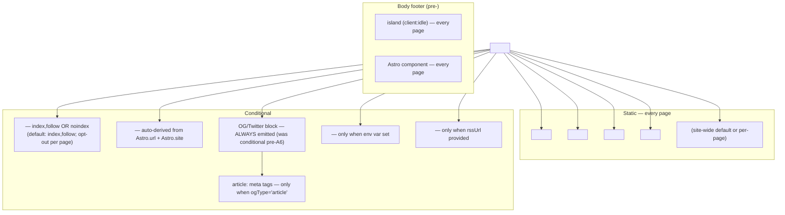
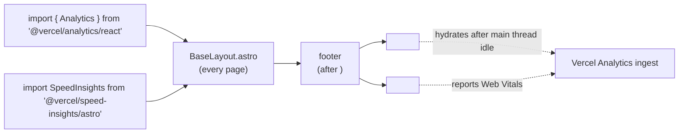

# Tech Plan — A6 SEO Essentials + Analytics (#304)

## Architectural Approach

### Key Decisions

| Decision | Choice | Rationale |
|---|---|---|
| Pattern inheritance | **Single shared chokepoint — `BaseLayout.astro`** for all SEO/social meta tags + analytics injection | Every page already routes through it. Centralising changes here means audit surface = one file. Considered per-page wiring; rejected (drift over time, easy to miss a route). |
| `indexable` default | **Flip default to `true`**; opt-out (`indexable={false}`) on `404.astro` and `about.astro` (until #305 lands content) | Whitelist-blocking is fine while building; production-grade SEO requires blacklisting unindexable pages. Today's silent default = home is `noindex` — entire ticket exists to fix this. |
| Sitemap filter | **Drop the `/connect/*` regex**; emit everything by default; one-line filter excludes `/about/` only | The current regex was scaffold-era restraint, not a long-term plan. `@astrojs/sitemap` already auto-excludes 404. About-page exclusion is paired 1:1 with its `noindex` opt-out — both flip when #305 ships. |
| Analytics provider | **Vercel Web Analytics + Speed Insights** | Free on Hobby (2.5k events/mo Web Analytics, generous Speed Insights), cookieless, GDPR-friendly, zero new infra (already on Vercel per `web/vercel.json`). Plausible considered (~€9/mo, public dashboard, portable) — rejected for cost on a docs site that doesn't need a public traffic flex. |
| Analytics integration | **`<Analytics />` + `<SpeedInsights />` from `@vercel/analytics/react` and `@vercel/speed-insights/astro` as Astro islands**, mounted in `BaseLayout.astro` with `client:idle` | Astro-canonical: hydrates after the page is interactive, zero render-blocking JS. Speed Insights ships an Astro-native component (no React island needed). Web Analytics' Astro flavor is a thin React wrapper — we use the React variant via the existing `@astrojs/react` integration. |
| Speed Insights inclusion | **Yes — fold in alongside Web Analytics** | Free, cookieless, single extra island. User said "free always". Lighthouse-grade Core Web Vitals data without a dashboard build-out. Out of scope per the issue but a free pickup. |
| OG strategy — site-wide defaults | **Always emit OG/Twitter block** in `BaseLayout`; static `og-default.png` (1200×630) as fallback when no per-page `ogImage` provided | Today's behavior: OG block only renders if `ogImage` passed → home/blog index/about share with bare URL preview on Twitter/LinkedIn. One static image fixes 90% of the social-presence problem. |
| OG image source | **Generate one with the in-conversation image tool**, brand-styled (dark bg `#0f0f13`, teal accent `#00c9a7`, GymLogic wordmark + tagline) | User explicit "you do it". Polished design can swap the file later — zero code change. Considered dynamic per-page generation (`@vercel/og` / `satori`) — rejected as out of scope per issue ("basics, not perfection") and disproportionate effort for ~5 pages. |
| OG image storage | **`web/public/og-default.png`** | Static, no transform pipeline. Path `/og-default.png` resolved against `Astro.site` for absolute URL in OG tags. |
| `og:type` for blog posts | **Add `ogType?: 'website' \| 'article'` prop to `BaseLayout`**; default `'website'`; blog post route passes `'article'` + `ogPublishedTime` + `ogAuthor` | Free polish — LinkedIn/Twitter/Slack render richer cards for `article` type with byline + date. Data already in blog frontmatter (`post.data.date`). |
| `og:site_name` + `og:locale` | **Hardcoded site-wide defaults**: `og:site_name="GymLogic"`, `og:locale="en_US"` | Folded in. Cosmetic but expected by social platforms. No prop, no override — site-wide constant. |
| Search Console verification | **HTML meta tag method**, token from `PUBLIC_GOOGLE_SITE_VERIFICATION` env var (set in Vercel dashboard, not committed) | Lowest friction (no DNS change, no extra static file). Env var lets the token rotate without a code change. `PUBLIC_` prefix is required for client-side exposure in Astro — token is non-secret, just identifier. |
| Bing Webmaster | **Skip separate verification — use "Import from Google Search Console"** | Bing supports one-click GSC import. Saves an env var, a meta tag, and a manual verification step. |
| Sitemap submission | **Manual, post-deploy** — checklist item in PR description | GSC sitemap submission requires logging in. Not automatable from this PR. Documented as the operational handoff. |
| `robots.txt` | **No change** — already correct (`User-agent: *`, `Allow: /`, `Sitemap: https://docs.gymlogic.me/sitemap-index.xml`) | Verified during exploration. No-op for this PR. |
| `<meta name="description">` site-wide default | **Keep current `BaseLayout` default** (`'GymLogic — public documentation and write-ups.'`) | Adequate. Per-page overrides exist where needed. Audit confirmed every public page passes a real description. |
| `<title>` site-wide audit | **No change** — every public page already passes a real title | Audited during grilling. Home, about, blog index, blog post, connector page all set proper titles via `BaseLayout` `title` prop. |
| Lighthouse SEO target ≥ 95 | **Verified post-deploy via Vercel preview** + Chrome Lighthouse | Acceptance criterion. With indexable flip + canonical + description + viewport + valid HTML (already in place), score should land ≥ 95. Verify on home + `/connect/claude` + `/blog`. |
| Tests | **Zero tests in this PR** | Same discipline as A5. The work is config + meta tags + a one-prop layout extension. Vitest infra not yet wired to `web/`; not justified here. |
| PR sequencing | **Single PR**, ~4 commits: (1) deps install + smoke build, (2) `og-default.png` asset + `BaseLayout` SEO refactor, (3) sitemap config + about noindex, (4) analytics + Speed Insights wiring | A5-established discipline. Tight surface; splitting adds ceremony for half a day of work. |
| Smoke-test gating | **First commit installs `@vercel/analytics` + `@vercel/speed-insights`**, runs `npm run build` (with `required_permissions: ["all"]`) + `npx astro check` locally. **No further commits proceed until both pass.** | A4/A5-established discipline. Vercel packages are well-maintained, but Astro 6 × rolldown-vite has bitten before; verify cleanly upfront. |

### Critical Constraints

**`BaseLayout.astro` is the single chokepoint.** Every page on `docs.gymlogic.me` routes through it. The PR concentrates indexability, canonical, OG/Twitter, GSC verification, and analytics injection in one file. Any regression in this file ships to every page simultaneously. Mitigation: each commit isolates one concern; build + `astro check` run between commits; manual `<head>` inspection on `/`, `/blog`, `/blog/<slug>`, `/connect/claude`, `/about`, `/404` before merge.

**The `indexable` default flip is the single highest-leverage change in this PR.** Today's `BaseLayout` defaults `indexable = false`, meaning every page that forgets to opt-in is silently `noindex`. Pages currently affected by the flip:
- `web/src/pages/index.astro` — was implicit `noindex`, becomes `index, follow` (intended).
- `web/src/pages/about.astro` — was implicit `noindex`, **must explicitly opt out** to preserve current behavior until #305 lands content.
- `web/src/pages/404.astro` — was implicit `noindex`, **must explicitly opt out** (404s should never be indexed).

Audit list during impl: every `*.astro` file under `web/src/pages/` must either (a) be okay being indexed, or (b) pass `indexable={false}`. The PR's checklist item: grep `web/src/pages/**/*.astro` for `BaseLayout` calls and verify each one's intent matches the new default.

**Sitemap broadening must align with indexability.** Pages indexed but missing from sitemap = soft SEO loss (Google crawls them via internal links anyway, but discovery is slower). Pages in sitemap but `noindex` = noisy validator warnings (sitemap promises crawlable, page says don't). The pairing rule: `indexable === sitemap-included`. Single exception today: `/about` is sitemap-excluded AND noindex (paired); flips both when #305 ships. Codified in the about page's BaseLayout call AND in `astro.config.mjs`'s sitemap filter — both must agree.

**`@vercel/analytics` integration on a static Astro site requires hydration.** Astro renders static HTML by default; Vercel Analytics needs a tracking script to fire pageviews. We mount `<Analytics />` (React component) with `client:idle` to hydrate as a tiny island after the main thread is free. `<SpeedInsights />` from `@vercel/speed-insights/astro` ships as an Astro-native component (no React, no island directive needed) — preferred over the React variant where available. The React-only path was the only way for Web Analytics until Vercel shipped Astro support; check during impl whether the Astro flavor of Web Analytics now exists — if so, use it and skip the React island.

**Vercel Hobby tier free quota.** Vercel Web Analytics free tier on Hobby: 2.5k events/month. Speed Insights: more generous. For a docs site at current traffic, comfortably below the cap. Past quota: events are sampled, not blocked. Mitigation flag for the PR: re-evaluate post-launch; if traffic explodes (good problem), Pro tier is $20/mo or swap to Plausible.

**`PUBLIC_GOOGLE_SITE_VERIFICATION` is bundled into the client.** Astro's `PUBLIC_` env var prefix makes the value available in `import.meta.env.PUBLIC_GOOGLE_SITE_VERIFICATION` and inlined into the static HTML at build time. The token is **not secret** (it's a public ownership identifier, exposed by every site that uses GSC) — fine to bundle. The reason for the env var (vs hardcoding) is rotation flexibility + not committing per-environment values. Verification meta tag renders only if the env var is set; missing var → no meta tag emitted, no harm.

**OG default image absolute URL.** Twitter, LinkedIn, Slack all require **absolute URLs** in `og:image` and `twitter:image` — relative paths fail silently (cards render without an image). `BaseLayout` already uses `new URL(ogImage, Astro.site).toString()` for the per-page case; the site-wide default extends the same pattern: `new URL('/og-default.png', Astro.site).toString()`. The site is set in `astro.config.mjs` as `'https://docs.gymlogic.me'` — verified.

**OG image dimensions are non-negotiable: 1200×630.** This is the universal aspect ratio (1.91:1) accepted by Twitter (`summary_large_image` card), LinkedIn, Facebook, Slack. Wrong dimensions → cropped or rejected card. Generated image must hit this exact spec. Lighter constraints: PNG or JPEG, ≤ 5 MB (Twitter limit), ≤ 8 MB (LinkedIn).

**Article OG type requires `article:published_time` to render the byline date.** Without it, LinkedIn/Twitter still accept `og:type="article"` but render the basic card. Frontmatter `post.data.date` (a JS `Date` from `z.coerce.date()`) needs ISO-string serialization (`.toISOString()`) for the meta tag value. Verified during the A5 plan that `post.data.date` is a real `Date` object.

**Build sandbox caveat.** `npm run build` (`tsc -b && vite build` → workbox-build) requires `required_permissions: ["all"]` per the `build-sandbox-caveat.mdc` workspace rule. `npx astro check` works in-sandbox. Smoke-test commits use both.

**Brief drift acknowledged.** This Tech Plan, like A5, operates without a paired `Epic_Brief_—_A6_*.md` file. The de facto brief is the GitHub issue body for #304 plus the grilling session that preceded this plan. Two scope additions vs the GitHub issue: (a) `og:type=article` for blog posts, (b) Speed Insights alongside Web Analytics. Both deliberate; called out in the recap.

---

## Data Model

A6 has no persistent data model. The load-bearing artifacts are three:

1. **The `BaseLayout.astro` head-section topology** — what `<meta>`, `<link>`, and `<script>` tags get rendered, conditionally vs unconditionally, in what order.
2. **The page-indexability matrix** post-A6 — which routes are indexable, which are in the sitemap, which pair with each other.
3. **The analytics injection topology** — where the Vercel Analytics + Speed Insights islands mount, when they hydrate.

### 1. `BaseLayout.astro` Head Topology Post-A6



**Notes:**

- The OG block changes from **conditional-on-`ogImage`** (pre-A6) to **always-emitted with default fallback** (post-A6). Per-page `ogImage` overrides the default.
- `article:*` tags only appear when `ogType="article"` is explicitly passed (blog posts). Default `ogType="website"`.
- GSC meta tag is fully optional — its presence is gated on the Vercel env var being set.
- Analytics islands mount in `<body>` (after `<slot />`, before `</body>`), not `<head>`. Vercel's recommendation; doesn't render-block.

### 2. Page-Indexability Matrix Post-A6

| Route | Pre-A6 indexable | Post-A6 indexable | Pre-A6 sitemap | Post-A6 sitemap | Pairing |
|---|---|---|---|---|---|
| `/` (home) | ❌ (silent default) | ✅ | ❌ (filter excluded) | ✅ | Indexable + sitemap |
| `/blog` (index) | ✅ (explicit) | ✅ (default + explicit redundant) | ❌ | ✅ | Indexable + sitemap |
| `/blog/<slug>` | ✅ (explicit) | ✅ | ❌ | ✅ | Indexable + sitemap |
| `/connect/<slug>` | ✅ (explicit) | ✅ | ✅ | ✅ | Indexable + sitemap (no change) |
| `/about` | ❌ (silent default) | ❌ (explicit opt-out, until #305) | ❌ | ❌ (filter excluded, until #305) | Noindex + sitemap-excluded — **paired** |
| `/404` | ❌ (silent default) | ❌ (explicit opt-out) | ❌ (Astro auto-exclude) | ❌ (Astro auto-exclude) | Noindex + sitemap-excluded |
| `/sitemap-index.xml` | n/a | n/a | self | self | Generated |
| `/blog/rss.xml` | n/a | n/a | n/a (`.xml` suffix) | n/a (`.xml` suffix) | Out of sitemap scope |

**Pairing invariant:** every public route must satisfy `indexable === sitemap-included`. The about page is the single exception, paired-out on both sides. When #305 ships content, **both** flips happen in the same PR (sitemap filter no longer needs the `/about` exclusion; about page no longer passes `indexable={false}`).

### 3. Analytics Injection Topology



**Notes:**

- Two packages, one mount point (`BaseLayout` body footer). Single source of truth for analytics presence.
- `client:idle` defers hydration — analytics initialize after the page is interactive. Doesn't compete with critical-path JS.
- `<SpeedInsights />` from the Astro flavor is a server component — renders a `<script>` tag directly, no React island overhead.
- **Verify during impl:** if `@vercel/analytics/astro` ships an Astro-native component (Vercel may have added it since last check), prefer it over the React island. Cuts one React island from the page.

---

## Component Architecture

### Layer Overview

```mermaid
graph TD
    subgraph WebRoot["web/ (modified)"]
        Pkg["package.json<br/>(+ @vercel/analytics, + @vercel/speed-insights)"]
        AstroConfig["astro.config.mjs<br/>(sitemap filter broadened)"]
    end

    subgraph Public["web/public/ (new asset)"]
        OgDefault["og-default.png<br/>(1200×630, brand-styled, generated)"]
    end

    subgraph Layouts["web/src/layouts/ (heavily modified)"]
        BaseLayoutC["BaseLayout.astro<br/>(default flip, OG defaults block,<br/>article OG, GSC meta tag, analytics islands)"]
    end

    subgraph Pages["web/src/pages/ (modified)"]
        Index["index.astro<br/>(no change — picks up flipped default)"]
        About["about.astro<br/>(+ indexable={false})"]
        FourOhFour["404.astro<br/>(+ indexable={false})"]
        BlogSlug["blog/[slug].astro<br/>(+ ogType='article', ogPublishedTime, ogAuthor)"]
        BlogIndex["blog/index.astro<br/>(no change — already explicit indexable)"]
        ConnectSlug["connect/[slug].astro<br/>(no change)"]
    end

    BaseLayoutC -->|"loads"| OgDefault
    BaseLayoutC -->|"reads env var"| GscEnv["PUBLIC_GOOGLE_SITE_VERIFICATION"]
    BaseLayoutC -->|"hydrates"| AnalyticsLib["@vercel/analytics/react"]
    BaseLayoutC -->|"renders"| SpeedLib["@vercel/speed-insights/astro"]
    AstroConfig -->|"emits sitemap covering"| Index
    AstroConfig -->|"emits sitemap covering"| BlogIndex
    AstroConfig -->|"emits sitemap covering"| BlogSlug
    AstroConfig -->|"emits sitemap covering"| ConnectSlug
    AstroConfig -.->|"excludes from sitemap"| About
```



### New Files & Responsibilities

| File | Purpose |
|---|---|
| `web/public/og-default.png` | **New asset (binary, generated)** — 1200×630 PNG, dark `#0f0f13` bg, teal `#00c9a7` accent, GymLogic wordmark + chain-link icon, tagline (e.g. "Public docs & engineering write-ups"). Served at `/og-default.png`; absolute URL `https://docs.gymlogic.me/og-default.png` used as the site-wide `og:image` fallback. Generated via the in-conversation image tool during implementation; can be swapped for a hand-designed asset later with zero code change. |

### Modified Files

| File | Modification |
|---|---|
| `web/package.json` | Add deps: `@vercel/analytics` (latest), `@vercel/speed-insights` (latest). Both in `dependencies`. |
| `web/astro.config.mjs` | Replace the `/connect/[a-z-]+/?$` regex filter on the `sitemap()` integration with a one-line filter that returns `false` only for URLs ending in `/about/` (or `/about`). All other pages emit. |
| `web/src/layouts/BaseLayout.astro` | The bulk of the PR. Specifically: (1) flip `indexable` default from `false` → `true`; (2) add new optional props `ogType?: 'website' \| 'article'` (default `'website'`), `ogPublishedTime?: string`, `ogAuthor?: string`; (3) emit OG/Twitter block **always** with `og-default.png` as fallback when no `ogImage` provided; (4) emit `og:site_name="GymLogic"` and `og:locale="en_US"` site-wide; (5) emit `article:published_time` and `article:author` when `ogType === 'article'`; (6) read `import.meta.env.PUBLIC_GOOGLE_SITE_VERIFICATION` and emit `<meta name="google-site-verification" content={...}>` only when set; (7) import and mount `<Analytics />` (React, `client:idle`) and `<SpeedInsights />` (Astro) in the body footer. |
| `web/src/pages/about.astro` | Add `indexable={false}` to the `BaseLayout` call. Pairs with the sitemap filter exclusion. Comment in-line with reference to #305 for when both flip. |
| `web/src/pages/404.astro` | Add `indexable={false}` to the `BaseLayout` call. Permanent. |
| `web/src/pages/blog/[slug].astro` | Pass new props to `BaseLayout`: `ogType="article"`, `ogPublishedTime={post.data.date.toISOString()}`, `ogAuthor="Pierre Tsiakkaros"` (or whatever site-wide author convention exists). |

### Untouched Files (Verified)

| File | Why no change |
|---|---|
| `web/public/robots.txt` | Already correct — allows all, points to sitemap-index.xml. |
| `web/src/pages/index.astro` | Picks up the flipped default for free — already passes a real title + description. |
| `web/src/pages/blog/index.astro` | Already passes `indexable` explicitly; new default doesn't change behavior. |
| `web/src/pages/connect/[slug].astro` | Already passes `indexable` explicitly + `ogImage` per-page; new default doesn't change behavior. Not an article in OG terms (it's product documentation, not editorial), so no `ogType` change. |
| `web/src/components/Header.astro`, `Footer.astro`, `MobileNav` (any) | No SEO surface here. |

### Component Responsibilities

**`BaseLayout.astro` (modified — new shape)**

```astro
---
import '../styles/global.css'
import '@fontsource-variable/geist'
import '@fontsource-variable/geist-mono'
import Header from '../components/Header.astro'
import Footer from '../components/Footer.astro'
import { Analytics } from '@vercel/analytics/react'
import SpeedInsights from '@vercel/speed-insights/astro'

interface Props {
  title: string
  description?: string
  indexable?: boolean
  canonical?: string
  ogImage?: string
  ogType?: 'website' | 'article'
  ogPublishedTime?: string
  ogAuthor?: string
  rssUrl?: string
  rssTitle?: string
}

const {
  title,
  description = 'GymLogic — public documentation and write-ups.',
  indexable = true,
  canonical,
  ogImage,
  ogType = 'website',
  ogPublishedTime,
  ogAuthor,
  rssUrl,
  rssTitle,
} = Astro.props

const canonicalUrl =
  canonical ?? new URL(Astro.url.pathname, Astro.site).toString()
const ogImageUrl = new URL(ogImage ?? '/og-default.png', Astro.site).toString()
const rssAbsoluteUrl = rssUrl
  ? new URL(rssUrl, Astro.site).toString()
  : undefined
const gscToken = import.meta.env.PUBLIC_GOOGLE_SITE_VERIFICATION
---

<!doctype html>
<html lang="en">
  <head>
    <meta charset="utf-8" />
    <meta name="viewport" content="width=device-width, initial-scale=1" />
    <meta
      name="robots"
      content={indexable ? 'index, follow' : 'noindex'}
    />
    <meta name="description" content={description} />
    <link rel="canonical" href={canonicalUrl} />

    <meta property="og:site_name" content="GymLogic" />
    <meta property="og:locale" content="en_US" />
    <meta property="og:type" content={ogType} />
    <meta property="og:title" content={title} />
    <meta property="og:description" content={description} />
    <meta property="og:image" content={ogImageUrl} />
    <meta property="og:url" content={canonicalUrl} />
    <meta name="twitter:card" content="summary_large_image" />
    <meta name="twitter:title" content={title} />
    <meta name="twitter:description" content={description} />
    <meta name="twitter:image" content={ogImageUrl} />

    {ogType === 'article' && ogPublishedTime && (
      <meta property="article:published_time" content={ogPublishedTime} />
    )}
    {ogType === 'article' && ogAuthor && (
      <meta property="article:author" content={ogAuthor} />
    )}

    {gscToken && (
      <meta name="google-site-verification" content={gscToken} />
    )}

    {rssAbsoluteUrl && (
      <link
        rel="alternate"
        type="application/rss+xml"
        title={rssTitle ?? `${title} — RSS feed`}
        href={rssAbsoluteUrl}
      />
    )}

    <link rel="icon" href="data:," />
    <title>{title}</title>
  </head>
  <body class="min-h-screen flex flex-col">
    <a
      href="#main"
      class="sr-only focus:not-sr-only focus:absolute focus:top-2 focus:left-2 focus:z-50 focus:px-4 focus:py-2 focus:rounded-md focus:bg-background focus:text-foreground focus:outline focus:outline-2 focus:outline-accent"
    >
      Skip to content
    </a>
    <Header />
    <main id="main" class="flex-1">
      <slot />
    </main>
    <Footer />
    <Analytics client:idle />
    <SpeedInsights />
  </body>
</html>
```

- **Default flip is the visible diff:** `indexable = false` → `indexable = true`.
- **OG block unconditional:** every page gets the full social card. Per-page `ogImage` overrides; absent → `/og-default.png` fallback.
- **Article tags conditional:** rendered only when `ogType === 'article'` AND the relevant prop is set (defensive — partial article frontmatter doesn't emit broken meta tags).
- **GSC token gated on env var:** `import.meta.env.PUBLIC_GOOGLE_SITE_VERIFICATION` resolves at build time; missing var → no meta tag.
- **Analytics islands at body end:** out of the critical path, hydrate idle.

**`astro.config.mjs` (modified — sitemap filter)**

```js
sitemap({
  filter: (page) => !/\/about\/?$/.test(page),
}),
```

- One-liner. `@astrojs/sitemap` calls the filter for each emitted route; we exclude only the about page. Astro auto-excludes 404. Everything else flows.
- When #305 ships, the filter call simply gets removed (or replaced with the default `() => true`).

**`web/src/pages/about.astro` (modified)**

Add `indexable={false}` to the `BaseLayout` call:

```astro
<BaseLayout
  title="About — GymLogic"
  description="Who I am, how I work, and why GymLogic exists."
  indexable={false}
>
```

**`web/src/pages/404.astro` (modified)**

Add `indexable={false}`:

```astro
<BaseLayout
  title="Page not found — GymLogic"
  description="The page you're looking for does not exist."
  indexable={false}
>
```

**`web/src/pages/blog/[slug].astro` (modified)**

Pass article OG props to `BaseLayout`:

```astro
<BaseLayout
  title={post.data.title}
  description={post.data.excerpt}
  indexable
  rssUrl="/blog/rss.xml"
  ogImage={post.data.ogImage}
  ogType="article"
  ogPublishedTime={post.data.date.toISOString()}
  ogAuthor="Pierre Tsiakkaros"
>
```

- `ogPublishedTime` requires ISO string per OGP spec.
- `ogAuthor` hardcoded site-wide; if a guest post ever ships, add a `data.author` frontmatter field then.

### Failure Mode Analysis

| Failure | Behavior |
|---|---|
| `@vercel/analytics` × Astro 6 × rolldown-vite incompat | First-commit smoke build / `astro check` fails. **Detection**: smoke gate. **Resolution**: pin to a known-good version, or fall back to manual `<script>` injection per Vercel's static-site path. |
| `@vercel/speed-insights` Astro flavor missing or broken | Build error or runtime no-op. **Detection**: smoke gate + manual verify in Vercel dashboard. **Resolution**: drop to React variant (`<SpeedInsights client:idle />`). |
| Sitemap filter regex too narrow / too greedy | `/about` accidentally included, OR a desired page accidentally excluded. **Detection**: post-build inspection of `dist/sitemap-0.xml`. **Resolution**: tighten the regex; `astro build && grep '<loc>' dist/sitemap-0.xml`. |
| Page passes `indexable={true}` AND ends up in noindex group | Impossible given the new layout — `indexable` is the single source of truth, the meta tag is computed from it. |
| `og-default.png` file missing or wrong dimensions | Twitter / LinkedIn render a card without an image, or strip the card entirely. **Detection**: post-deploy manual share to a Slack DM or Twitter card validator (`cards-dev.twitter.com/validator`). **Resolution**: regenerate the asset to spec (1200×630 PNG, ≤ 5 MB). |
| `og-default.png` URL is relative not absolute | Card validators reject. **Detection**: `og:image` content inspection in dev tools. **Resolution**: `BaseLayout` already wraps in `new URL(..., Astro.site).toString()` — verified. |
| `PUBLIC_GOOGLE_SITE_VERIFICATION` env var not set in Vercel before deploy | GSC verification fails on the first attempt. **Detection**: GSC dashboard says "Verification failed". **Resolution**: documented in the PR's operational checklist as a manual step. Set the env var, redeploy, retry. |
| `PUBLIC_GOOGLE_SITE_VERIFICATION` accidentally committed to repo | Token in git history. **Mitigation**: token is non-secret (it's a public GSC ownership identifier); cosmetic concern only. The chosen mechanism (Vercel env var) avoids it by convention. |
| Bing Webmaster import-from-GSC fails | Manual verification needed. **Detection**: Bing dashboard error. **Resolution**: fall back to a separate `<meta name="msvalidate.01" content="...">` via a second env var. Document only if it bites. |
| Lighthouse SEO < 95 | Failure mode of the acceptance criterion. **Detection**: Lighthouse run on home + `/connect/claude` + `/blog`. **Common causes for this stack**: missing `<title>` (none — verified), missing description (none — verified), missing canonical (none — verified), invalid HTML (would be flagged by `astro check`), images without alt text (audit during impl), low color contrast (Lighthouse a11y, not SEO). **Resolution**: triage per the specific finding. |
| `<title>` site-wide audit misses a page that ships with `<title>GymLogic</title>` (too generic) | Lighthouse SEO penalty + bad SERP click-through. **Mitigation**: audited during grilling — every public page passes a real title. PR's checklist re-verifies. |
| Article OG type emitted without `published_time` | Card renders as basic article — not "broken", just less rich. **Mitigation**: blog post route always passes `ogPublishedTime` (`post.data.date.toISOString()`); frontmatter schema requires `date`. No fallback path needed. |
| Blog post date in the future on a non-draft post | OG `published_time` is in the future. **Behavior**: most card validators tolerate it; Twitter shows the post. **Mitigation**: not a v1 concern (no scheduled-publish); same as A5's analysis. |
| `client:idle` analytics island never hydrates (low-power device, hung event loop) | No analytics events from that page view. **Behavior**: client:idle uses `requestIdleCallback` with a fallback timeout (Astro's default). On extreme constraint, may delay or skip. **Mitigation**: acceptable — under-counting on low-power devices is a known industry tradeoff. Considered `client:load` (instant hydration); rejected (eats critical path on every page). |
| Speed Insights script blocks render | Astro flavor renders an inline `<script>` — could in theory delay parsing. **Mitigation**: Vercel's script is `defer`-ed; tested upstream. If Lighthouse Performance regresses post-A6, swap to `client:idle` React variant. |
| Vercel Analytics free quota (2.5k events/mo) exceeded | Events are sampled; data is partial. **Detection**: Vercel dashboard. **Resolution**: if traffic is consistently high, upgrade Pro ($20/mo) or migrate to Plausible. PR notes flag this as a re-evaluate trigger. |
| `astro:env` schema not used (we use `import.meta.env` directly) | Tighter version of env var handling exists (`astro:env`); we don't use it. **Mitigation**: `import.meta.env.PUBLIC_*` works fine in Astro 6; `astro:env` adds Zod-validated env, overkill for one optional public string. |
| Indexable default flip unintentionally indexes a future "private" page | Page added without explicit `indexable={false}` is silently indexable. **Mitigation**: PR's checklist documents the new convention ("opt-out, not opt-in") for future pages. Reviewer-enforced; no automated CI gate for this. |
| Sitemap URL doesn't match canonical URL (trailing slash mismatch) | Search Console flags as non-canonical. **Mitigation**: Astro normalizes `Astro.url.pathname` and the sitemap integration generates URLs from the same routing source; consistency is structural. Verified in a sibling project; if it bites, set `trailingSlash: 'never'` (or `'always'`) in `astro.config.mjs` to enforce. |
| `og:image` URL absolute but file path 404s | Card validator says "Image not accessible". **Detection**: post-deploy curl `https://docs.gymlogic.me/og-default.png`. **Resolution**: verify `web/public/og-default.png` is committed and present in `dist/`. |
| Twitter card validator says "Image too large" | Twitter limit is 5 MB. **Mitigation**: PNG at 1200×630 with simple geometry comes in well under 1 MB. Verify file size during impl. |
| LinkedIn caches old OG image after the file changes | Stale card persists for ~7 days. **Mitigation**: LinkedIn Post Inspector (`linkedin.com/post-inspector/`) lets you re-fetch on demand. Not a v1 concern unless an old card has already been seen. |
| Test: `npm run preview` doesn't expose Vercel Analytics on local | Analytics package is built for `production` env. **Behavior**: `<Analytics />` renders nothing in dev/preview by default — that's the Vercel team's decision to avoid noise. **Mitigation**: documented in implementation notes; verify in production after deploy. |
| Bing Webmaster also requires sitemap submission | Sitemap auto-imported when GSC import works. **Mitigation**: documented in the PR's operational checklist. |
| About page's `indexable={false}` shadowed by an explicit `indexable={true}` somewhere | Single source of truth: the prop on `BaseLayout`. **Mitigation**: about page passes `indexable={false}` explicitly; only one BaseLayout call per page. |

---

## Implementation Notes

Breadcrumbs for the implementer (probably future me):

- **Commit 1 — smoke**: `cd web && npm i @vercel/analytics @vercel/speed-insights` (latest stable). Run `cd web && npm run build` (with `required_permissions: ["all"]`) and `cd web && npx astro check`. Both must pass. **Do NOT** wire the components yet — this commit only validates the install. If build fails, pin versions or fall back to manual `<script>` injection. Commit message: `chore(web): smoke-test Vercel Analytics + Speed Insights deps`.

- **Commit 2 — OG default + BaseLayout SEO refactor**:
  1. Generate `web/public/og-default.png` via the in-conversation image tool. Spec: 1200×630, dark `#0f0f13` bg, teal `#00c9a7` accent, GymLogic wordmark + chain-link icon (mirror `web/src/components/Logo.astro`'s SVG silhouette), tagline "Public docs & engineering write-ups" or similar restrained line. PNG, target ≤ 200 KB. Eyeball; iterate if it looks off-brand.
  2. Modify `web/src/layouts/BaseLayout.astro`:
     - Flip `indexable` default to `true`.
     - Add new optional props (`ogType`, `ogPublishedTime`, `ogAuthor`).
     - Emit OG/Twitter block always (no more `ogImageUrl &&` gate).
     - Add `og:site_name`, `og:locale`, conditional `article:*` tags.
     - Add `import.meta.env.PUBLIC_GOOGLE_SITE_VERIFICATION` read + conditional meta tag.
     - **Do NOT** add the analytics imports yet (deferred to commit 4 to keep the diff focused).
  3. Modify `web/src/pages/about.astro`: add `indexable={false}` with an inline comment referencing #305.
  4. Modify `web/src/pages/404.astro`: add `indexable={false}`.
  5. Modify `web/src/pages/blog/[slug].astro`: add `ogType="article"`, `ogPublishedTime`, `ogAuthor` props.
  6. Run `cd web && npm run build` (with `required_permissions: ["all"]`) + `cd web && npx astro check`.
  7. Manual smoke: `npm run dev`, view source on `/`, `/blog`, `/blog/<lorem-fixture>`, `/about`, `/404`, `/connect/claude` — verify `<meta name="robots">` and `og:image` and `og:type` match the matrix.
  8. Commit message: `feat(web): site-wide OG defaults + indexable-by-default + GSC verification hook`.

- **Commit 3 — sitemap broadening**: edit `web/astro.config.mjs`, replace the regex filter with `(page) => !/\/about\/?$/.test(page)`. Run `cd web && npm run build` (with `required_permissions: ["all"]`). Inspect `web/dist/sitemap-0.xml` (or `sitemap-index.xml` if the integration emits the index variant) — verify `/`, `/blog`, `/blog/<slug>`, `/connect/claude` are present, `/about` and `/404` are absent. Commit message: `feat(web): broaden sitemap to cover all public routes (except /about)`.

- **Commit 4 — analytics wiring**: edit `BaseLayout.astro`. Add the imports and mount the islands in the body footer. Run smoke build + `astro check`. Manual verify in dev: `view-source` should show the analytics scripts injected at body end. **Production verification deferred** — Vercel Analytics doesn't fire in dev/preview by design. Commit message: `feat(web): wire Vercel Analytics + Speed Insights via BaseLayout`.

- **Vercel Analytics Astro path**: Vercel's docs may have shipped `@vercel/analytics/astro` since the last grilling check. If it exists and exports a non-React component, prefer it (`<Analytics />` from `@vercel/analytics/astro`, no `client:idle` directive). If only the React variant is documented, use `<Analytics client:idle />` from `@vercel/analytics/react`. Either path tested — pick whichever is current at impl time.

- **Speed Insights Astro path**: confirmed to exist as `@vercel/speed-insights/astro`. Imported as default and rendered without a client directive (it's a server-rendered `<script>` injection).

- **`PUBLIC_` prefix**: Astro requires `PUBLIC_*` env var prefix for build-time inlining into client HTML. `import.meta.env.PUBLIC_GOOGLE_SITE_VERIFICATION` resolves at build, missing → `undefined`, conditional render skips the meta tag. No runtime fetch, no hydration overhead.

- **Vercel env var setup (operational, post-PR)**:
  1. Vercel Dashboard → Project (`gymlogic-docs` or whatever the project slug is) → Settings → Environment Variables.
  2. Name: `PUBLIC_GOOGLE_SITE_VERIFICATION`. Value: the token from GSC (just the content of `<meta name="google-site-verification" content="THIS_PART">` — paste only the token).
  3. Apply to: Production (and Preview if you want to verify on a preview deploy).
  4. Save → trigger redeploy (push a commit, or use the Vercel UI's "Redeploy" button).

- **GSC sitemap submission (operational, post-deploy)**:
  1. Go to `search.google.com/search-console`.
  2. Add property: URL prefix → `https://docs.gymlogic.me/`.
  3. Verification method: HTML tag → expect "Verification successful" once the env var is set + deployed.
  4. Sitemaps → Add new sitemap → enter `sitemap-index.xml` → Submit.
  5. Wait ~24h for Google to crawl. Coverage report appears under "Pages".

- **Bing Webmaster (operational, post-GSC)**:
  1. Go to `bing.com/webmasters`.
  2. Add a site → choose "Import from Google Search Console" → grant OAuth consent → select `docs.gymlogic.me`.
  3. Bing pulls the property + sitemap automatically. No second meta tag, no second token.

- **Lighthouse SEO verification (post-deploy)**:
  1. Open `https://docs.gymlogic.me/` in incognito Chrome.
  2. DevTools → Lighthouse → Categories: SEO only → mobile + desktop runs.
  3. Repeat on `/connect/claude` and `/blog`.
  4. Target: ≥ 95 on each. Common < 95 causes (none expected on this stack): missing meta description, missing viewport, robots blocking, font-too-small touch targets — flag if hit.

- **Twitter card validator (post-deploy, optional polish)**: `cards-dev.twitter.com/validator` (or whatever Twitter/X has migrated it to as of impl date) → paste a couple of URLs → confirm "Card found". Use this to re-fetch after `og-default.png` swaps.

- **LinkedIn Post Inspector (post-deploy, optional polish)**: `linkedin.com/post-inspector/` → paste URL → click "Inspect" → "Re-fetch" if cached. Same purpose as Twitter validator for LinkedIn.

- **Functional-style discipline (workspace rule `prefer-functional-style.mdc`)**: no array mutation in the changes. Conditional rendering uses ternaries / short-circuit, no accumulator patterns.

- **No commits without permission (workspace rule `no-commit-without-permission.mdc`)**: implementer waits for explicit user "go" before committing each commit. Each commit lands intentionally.

- **Build sandbox caveat (workspace rule `build-sandbox-caveat.mdc`)**: `npm run build` requires `required_permissions: ["all"]`. `npx astro check` works in the sandbox.

- **Pre-merge checklist** (in PR description):
  - [ ] All 4 commits build + `astro check` clean.
  - [ ] `web/dist/sitemap-0.xml` (or `sitemap-index.xml`) contains `/`, `/blog`, `/blog/<slug>` (any non-draft post), `/connect/claude`. Excludes `/about`, `/404`.
  - [ ] `view-source` on `/` shows `<meta name="robots" content="index, follow">`.
  - [ ] `view-source` on `/about` shows `<meta name="robots" content="noindex">`.
  - [ ] `view-source` on `/404` shows `<meta name="robots" content="noindex">`.
  - [ ] `view-source` on `/` shows `<meta property="og:image">` with absolute URL ending `og-default.png`.
  - [ ] `view-source` on `/blog/<lorem-fixture>` shows `<meta property="og:type" content="article">` + `<meta property="article:published_time">`.
  - [ ] `web/public/og-default.png` exists, is 1200×630, ≤ 5 MB.
  - [ ] Dev source view shows `<Analytics />` + `<SpeedInsights />` script tags at body end.
  - [ ] PR description includes the operational checklist (Vercel env var + GSC + Bing + Lighthouse).

- **Post-deploy operational checklist** (in PR description):
  - [ ] Set `PUBLIC_GOOGLE_SITE_VERIFICATION` in Vercel Production env vars.
  - [ ] Redeploy.
  - [ ] Verify GSC ownership.
  - [ ] Submit sitemap in GSC.
  - [ ] Import to Bing Webmaster from GSC.
  - [ ] Run Lighthouse SEO on `/`, `/connect/claude`, `/blog` — confirm ≥ 95.
  - [ ] Spot-check Twitter card on `https://cards-dev.twitter.com/validator` for `/`, `/blog/<post>`.
  - [ ] Spot-check LinkedIn share preview via Post Inspector.
  - [ ] Confirm Vercel Analytics shows pageviews in production dashboard within 5 min of deploy.

---

## References

- Issue: #304 — `feat(web): A6 — SEO essentiels + analytics (sitemap, OG, robots, Plausible)`
- Parent epic: #298 — Astro mini-site
- A1 Tech Plan (deployment topology, vercel.json): `file:docs/Tech_Plan_—_Astro_Bootstrap_#299.md`
- A2 Tech Plan (chrome inheritance): `file:docs/Tech_Plan_—_A2_Layout_Nav_Footer_#300.md`
- A3 Tech Plan (home page content): `file:docs/Tech_Plan_—_A3_Home_Page_#301.md`
- A4 Tech Plan (connect collection precedent): `file:docs/Tech_Plan_—_A4_Connect_Claude_#302.md`
- A5 Tech Plan (blog skeleton — defers OG defaults + sitemap broadening to A6): `file:docs/Tech_Plan_—_A5_Skeleton_Blog_#303.md`
- Sibling tickets: #299 (A1, shipped), #300 (A2, shipped), #301 (A3, shipped), #302 (A4, shipped), #303 (A5, in-flight on `feat/303/...`), #305 (A7 — about content; flips A6's `/about` exclusions when shipped)
- Existing layout (the chokepoint, heavily modified): `file:web/src/layouts/BaseLayout.astro`
- Existing Astro config (sitemap filter broadened): `file:web/astro.config.mjs`
- Existing pages touched: `file:web/src/pages/about.astro`, `file:web/src/pages/404.astro`, `file:web/src/pages/blog/[slug].astro`
- Existing pages untouched (verified): `file:web/src/pages/index.astro`, `file:web/src/pages/blog/index.astro`, `file:web/src/pages/connect/[slug].astro`
- Existing robots.txt (no change): `file:web/public/robots.txt`
- Existing logo for OG image inspiration: `file:web/src/components/Logo.astro`
- Existing global styles (brand tokens): `file:web/src/styles/global.css`
- Workspace rule (build commands): `file:.cursor/rules/build-sandbox-caveat.mdc`
- Workspace rule (commit discipline): `file:.cursor/rules/no-commit-without-permission.mdc`
- Workspace rule (functional style): `file:.cursor/rules/prefer-functional-style.mdc`
- Grilling session: prior conversation turns in this chat (the de facto Epic Brief for #304)
