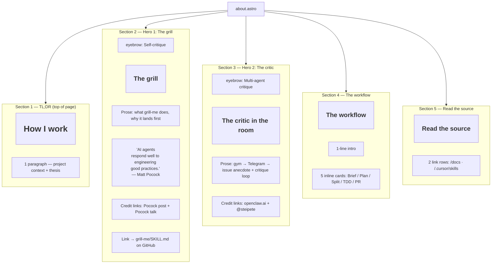
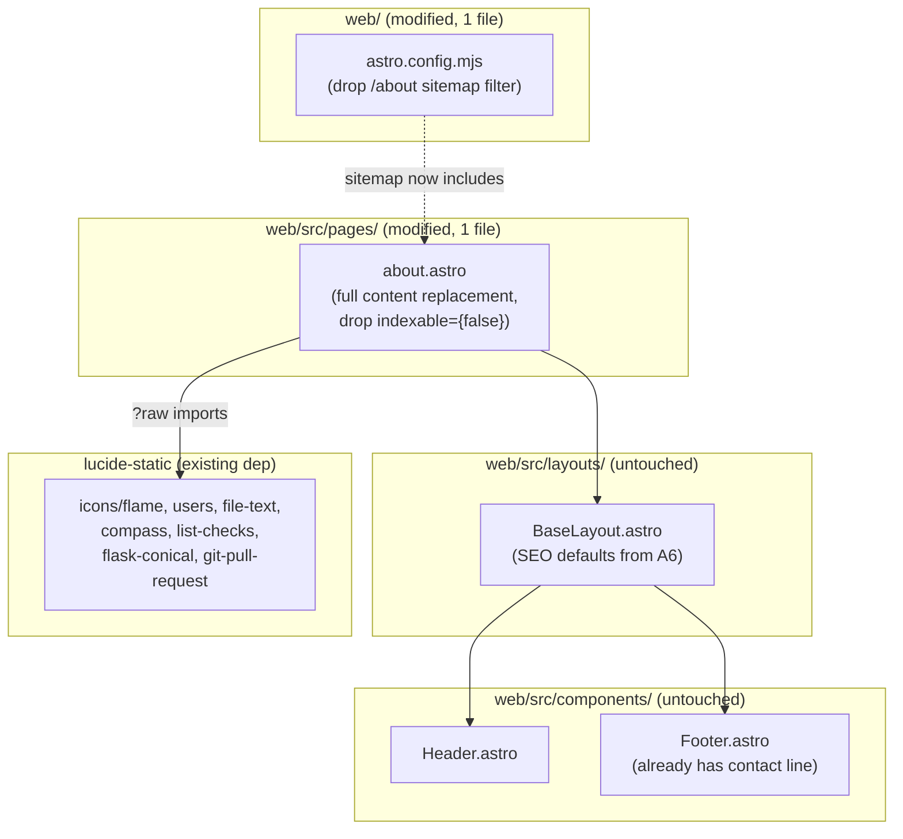

# Tech Plan — A7 About / How I Work Page (#305)

## Architectural Approach

### Key Decisions

| Decision | Choice | Rationale |
|---|---|---|
| Page identity | **Process showcase, artefacts hero, bio garnish** | Locked in grilling Q1. The home page's `/about` FeatureCard ("Built in the open. Every feature: Brief → Plan → tickets → PR. Trail in /docs.") promises receipts; this page must deliver them. Bio-first ordering rejected — would dilute the homepage's promise. |
| Page route | **Keep `/about`** (modify existing stub) | Header nav, FeatureCard on home, stub file all wired. Renaming forces 3+ collateral edits + redirect for zero substantive gain. The H1 inside the page carries the "How I work" identity. |
| Page H1 | **"How I work"** | Issue title's preferred angle. URL stays `/about` (a slug); the H1 carries the meaning. |
| Page `<title>` | **`"About · How I work — GymLogic"`** | Hybrid — both keywords present in SERP. "About" anchors universal-convention queries; "How I work" surfaces the actual differentiator. |
| Content technology | **Plain `.astro` page** — no MDX, no content collection | One-off content. MDX adds collection machinery (schema, getStaticPaths, render) for zero current payoff. Considered: `connect/[slug]` MDX pattern. Rejected: scope mismatch. |
| Section topology | **TL;DR → Hero 1 (grill-me) → Hero 2 (Iris) → Spine (5 workflow cards) → Read the source (2 links)** | Locked in grilling. Two heros above a 5-step workflow. Bottom = bare link block. Footer (existing) handles contact + project/legal links. |
| TL;DR opening | **One paragraph: project context (1 sentence) + a one-line thesis statement** | Q5: project context, no personal bio. Thesis = "engineering practices that work for human teams work just as well for agents" — author's own framing, not attributed to Pocock. |
| Hero 1 — grill-me | **Inline `<section>`**, prose + `<blockquote>` for thesis + Pocock credit (post + talk) + GitHub link to local `.cursor/skills/grill-me/SKILL.md` | The page's headline insight. Pocock = origin credit for the skill. |
| Hero 2 — Iris | **Inline `<section>`**, prose narrating gym→Telegram→issue pipeline + multi-agent critique frame + OpenClaw + @steipete credit + link to openclaw.ai | The differentiator. No link to private `sudo-ceo` repo. |
| Hero proof level | **Level 0 — prose only**, no transcripts/screenshots | Q10 lock. Tension acknowledged: page thesis = "receipts > claims", heros land as claims. Mitigation: spine below = receipts that back the heros' claims. Follow-up tracked: real grill transcript + Iris-filed-issue link, post-launch. |
| Workflow spine card pattern | **Inline custom card markup in `about.astro`, mirroring `FeatureCard`'s visual** (border, bg-card, padding, radius). NO new component file. NO `FeatureCard` modification. | `FeatureCard` supports 1 href; each spine card needs 2 links (skill + artefact). Component extension would either widen the API for one consumer (overkill) or break existing call sites. Inline mapping for 5 cards is right-sized. |
| Spine icons | **Imported directly via `lucide-static` in `about.astro` frontmatter** | Mirrors `FeatureCard`'s pattern (`?raw` SVG import + `set:html`). Localizes the icon dependency to the only consumer. Considered: extending `FeatureCard`'s `IconName` union. Rejected: creates indirect coupling for icons used nowhere else. |
| Spine grid layout | **`grid grid-cols-1 md:grid-cols-2 lg:grid-cols-3 gap-4`** | Mirrors home's "How it's built" grid rhythm. 5 cards split 3+2 in the final row at desktop — acceptable visual rhythm (same shape home page already accepts for its 5-card section). |
| Spine step count | **5 — Brief / Plan / Split / TDD / PR** | One card per workflow phase. `start-branch` (utility) and `deepen-architecture` (periodic, not feature-delivery) deliberately omitted. |
| Spine card content shape | **Each card: icon + phase title + 1-line "what's inside" preview + skill link + 1 representative artefact link** | Q6+Q7 locks: 1 representative per step; link + 1-line preview; no inline pull-quotes. Two explicit `<a>` links per card. |
| Artefact selection rules | **(1) EN-only**; (2) most polished/representative pick at write time; (3) fall back to the relevant `docs/` folder root if no clean EN artefact exists for a phase | Phase 2 lock — picks deferred to write phase. Some briefs/plans are partly/fully in FR (Epic #298 body confirmed FR); the EN-reader audience trumps "complete coverage". |
| TDD spine card target | **Link to a representative test file in the repo** (not a curated PR) | Phase 2 lock. Test files are stable artefacts; PR-cherry-picking creates curation debt as the codebase evolves. Specific file picked at write phase (e.g. a tested hook in the SPA, or a vitest file in the connect collection). |
| Bottom "Read the source" | **Two GitHub folder links**: `/docs/` and `/.cursor/skills/`. Plain text links + arrow, not buttons. | Q11 lock (option A). Footer already provides contact + project + legal links — no duplication. |
| Indexability flip | **Drop `indexable={false}` from the page** (defaults to `true` per A6) | A6 explicitly flagged this as #305's job. Page is now real content; we want it indexed. |
| Sitemap inclusion flip | **Drop the `/about` filter from `astro.config.mjs`** (delete the `filter` property entirely, or replace with `() => true`) | Pairs 1:1 with indexability flip. A6's pairing invariant: `indexable === sitemap-included`. Flipping one without the other = either soft SEO loss or Search Console warning. |
| Page metadata — description | **`"The paper trail for how GymLogic gets built — agentic engineering, multi-agent critique, vertical slicing."`** (~150 chars) | Per-page; under the 160-char SERP cutoff. |
| OG image | **Site-wide default** (`/og-default.png` from A6) | No per-page OG image. Site default is on-brand and already shipping. |
| New components | **Zero** | All UI achievable via existing primitives (`BaseLayout`) + inline section/card markup. |
| Tests | **Zero** | Same discipline as A5/A6. Static page, no test infra in `web/`, not justified. |
| PR sequencing | **Single PR**, ~1-3 commits: (1) page content + indexability flip + sitemap filter drop; (2) optional copy polish; (3) optional artefact-pick swaps from review | Tight surface. Splitting adds ceremony for a content-heavy single-page change. |
| Smoke-test gating | First commit runs `cd web && npm run build` (with `required_permissions: ["all"]`) + `cd web && npx astro check` before merge | A4/A5/A6-established discipline. No new deps in this PR (icons already shipped via `lucide-static`); risk is content regression, not build-tool incompat. |

### Critical Constraints

**`web/src/pages/about.astro` is the chokepoint.** The PR's diff is concentrated here — full content replacement, drop of one prop, addition of all sections. Surface area is small (one file = the visible change), but every detail of the page lives in this file.

**Indexability + sitemap inclusion must flip together.** A6's pairing invariant: `indexable === sitemap-included`. This PR satisfies it by flipping both:

- `file:web/src/pages/about.astro` — drop `indexable={false}` from the `BaseLayout` call (defaults to `true` per A6).
- `file:web/astro.config.mjs` — drop the `filter: (page) => !/\/about\/?$/.test(page)` from the `sitemap()` integration (delete the `filter` property OR replace with `() => true`).

Either-without-the-other is a regression. Pre-merge checklist explicitly verifies both. Build the site and inspect `web/dist/sitemap-0.xml` (or `sitemap-index.xml`) to confirm `/about` is now present.

**`FeatureCard` is consumed by `file:web/src/pages/index.astro`.** This PR does not modify `FeatureCard`. The home page's "How it's built" cards remain byte-identical. No coordination risk with home; about.astro renders its own card markup inline.

**Reading-time AC < 3min.** Two prose-heavy heros (~80-120 words each), 5 spine cards (~30-40 words each summary), TL;DR (~50 words), bottom links (~20 words) = ~600-800 words total = ~2-3 min. Hero copy is the bloat risk. Discipline at write time: each hero is one paragraph + quote/credit, not three.

**Heros are Level 0 (no proof artefacts).** Q10 lock. The page's whole thesis is "receipts > claims"; the two heros are claims. Acknowledged tension. Mitigation: the workflow spine below is the receipt that backs the heros — every brief/plan/skill linked there was *produced by* the workflow described in the heros. Followup tracked: capture a real grill transcript + a real Iris-filed issue link post-launch (single biggest credibility upgrade).

**EN-only artefact curation.** Some Epic Briefs/Tech Plans are partly/fully in French (Epic #298 body is FR; A2 brief is mixed). Page is EN; reader-bounce risk if a linked artefact opens to a wall of French. Constraint: every artefact picked at writing time must read coherently in English. Fallback when a step has no clean EN candidate: link to the `/docs/` folder root with a label "Browse artefacts" (or similar).

**No link to `sudo-ceo` repo.** Iris's implementation lives in a private user repo. Hero 2 describes Iris's role and credits OpenClaw + @steipete; **no internal-repo link, no internal-issue link**. Path to upgrade: if the user ever publishes a single representative grill transcript or Iris-filed-issue link, swap Hero 2 to Level 1 (Q10).

**Brief drift acknowledged.** Like A5/A6, this Tech Plan operates without a paired `Epic_Brief_—_A7_*.md` file. The de facto brief is the GitHub issue #305 body plus the grilling session preceding this plan. Two scope clarifications vs the GH issue body:

- Issue lists "Stack & decisions" as section 3; this plan **cuts** it (Q4 lock — already on home, no value duplicating).
- Issue lists "Short bio + project context" as section 1; this plan **cuts the bio** and keeps a single project-context sentence in the TL;DR (Q5 lock; Footer already has the personal attribution line).

**`lucide-static` icon availability.** Spine cards need: `flame` (grill, used inside Hero 1 visual), `users` (Iris, used inside Hero 2 visual), `file-text` (Brief), `compass` (Plan), `list-checks` (Split), `flask-conical` (TDD), `git-pull-request` (PR). All are standard lucide icons; pinned package `lucide-static@^1.14.0` ships them. If any icon is missing at impl time, swap to a similar lucide icon (e.g. `git-merge` for PR, `beaker` for TDD, `zap` for grill).

**Build sandbox caveat.** `npm run build` (`tsc -b && vite build` → workbox-build) requires `required_permissions: ["all"]` per the `build-sandbox-caveat.mdc` workspace rule. `npx astro check` works in-sandbox.

---

## Data Model

A7 has no persistent data model. The load-bearing artifacts are two:

1. **Page section topology** — the order and shape of the 5 sections.
2. **Workflow-spine data array** — the 5 step entries and their fields.

### 1. Page Section Topology



**Notes:**

- Each section is wrapped in `<section class="mx-auto max-w-3xl px-4 mt-16 md:mt-20">` (matching `index.astro`'s spacing).
- Hero sections (S2, S3) get a small eyebrow line in `text-sm uppercase tracking-wider text-accent` (mirroring `connect/[slug]`'s pattern) to label the section's role at a glance.
- The workflow grid (S4) uses `grid grid-cols-1 md:grid-cols-2 lg:grid-cols-3 gap-4` (same shape as home's "How it's built" grid).
- BaseLayout chrome (Header / Footer / skip-link / SEO meta) is unchanged.

### 2. Workflow-Spine Data Array

The 5 cards are driven by an inline `const steps` array in the page frontmatter. Type:

```ts
type WorkflowStep = {
  /** Phase title — short verb-y label */
  title: string
  /** "What's inside" preview — one line, ≤ 100 chars */
  summary: string
  /** Lucide-static raw SVG (already imported) */
  iconSvg: string
  /** Link to the local .cursor/skills/<slug>/SKILL.md on GitHub blob/main */
  skillUrl: string
  /** Label for the artefact link, e.g. "Tech Plan A2 — Layout/Nav/Footer" */
  artefactLabel: string
  /** GitHub blob URL to the chosen artefact (EN-only). Fallback: /docs/ folder root with label "Browse artefacts" */
  artefactUrl: string
}
```

Skeleton at write time:

```ts
const steps: WorkflowStep[] = [
  {
    title: 'Brief the epic',
    summary:
      'Stress-test the idea with grill-me, then write up scope, out-of-scope, and acceptance criteria.',
    iconSvg: fileTextIcon,
    skillUrl: `${GH_BLOB}/.cursor/skills/epic-brief/SKILL.md`,
    artefactLabel: '<TBD at write phase>',
    artefactUrl: '<TBD at write phase>',
  },
  // ... 4 more entries (Plan, Split, TDD, PR)
]
```

**Selection rules at write time:**

- For each phase, scan `docs/` for the most polished EN-readable artefact.
- If multiple candidates exist, prefer **the most recently completed end-to-end** (brief + plan + tickets + merged PRs).
- If no clean EN artefact exists for a phase, fall back to the relevant folder root: `https://github.com/PierreTsia/workout-app/tree/main/docs/` (label: "Browse the docs/").
- TDD step: `artefactLabel` and `artefactUrl` point to a representative **test file** in the repo (e.g. a hook test in `src/hooks/__tests__/...`); not a brief/plan, not a PR.

---

## Component Architecture

### Layer Overview



### New Files & Responsibilities

**None.** All work is modifications to existing files.

### Modified Files

| File | Modification |
|---|---|
| `file:web/src/pages/about.astro` | **Full content replacement**. Drop `indexable={false}` from the `BaseLayout` call (defaults to `true` per A6). Update `title` to `"About · How I work — GymLogic"` and `description` to the per-page string. Replace the placeholder section with: TL;DR, Hero 1 (grill-me + Pocock credit + thesis quote + skill link), Hero 2 (Iris + OpenClaw + @steipete credit + gym anecdote), workflow spine (5 inline cards driven by a `steps` data array, lucide-static icons imported in frontmatter), bottom "Read the source" with 2 GitHub folder links. |
| `file:web/astro.config.mjs` | **Drop the `/about` sitemap filter**. Delete the `filter: (page) => !/\/about\/?$/.test(page)` line entirely (and its preceding comment about pairing with #305). Net effect: `sitemap()` integration now uses default behavior — emits every page (with auto-exclusion of 404). |

### Untouched Files (Verified)

| File | Why no change |
|---|---|
| `file:web/src/layouts/BaseLayout.astro` | A6 already shipped indexable-by-default + OG defaults + analytics. About page picks up all defaults for free. |
| `file:web/src/components/Header.astro` | `/about` already in nav with icon and active-state styling. |
| `file:web/src/components/Footer.astro` | Contact line (`@PierreTsia · admin@gymlogic.me`), Project links (GitHub, Discussions, Open app), Docs links, Legal already shipped. The Q5-locked "footer attribution line" is **already on every page**. |
| `file:web/src/pages/index.astro` | `FeatureCard` "Built in the open" → `/about` already wired. About page now backs that promise with content. |
| `file:web/src/components/FeatureCard.astro` | NOT modified. About page renders its own card markup inline (different shape: 2 links per card vs FeatureCard's 1 href). |
| `web/public/og-default.png` | Site-wide OG default already in place from A6; about page uses it (no per-page override needed). |

### Component Responsibilities

**`about.astro`** (the entire PR, essentially)

Frontmatter:

- `import BaseLayout from '../layouts/BaseLayout.astro'`
- Lucide-static SVG imports (7 icons) via `?raw` query string
- Constants: `GH_REPO_BLOB = 'https://github.com/PierreTsia/workout-app/blob/main'`, `GH_REPO_TREE = 'https://github.com/PierreTsia/workout-app/tree/main'`
- `const steps: WorkflowStep[] = [...]` — 5 entries per the data model

Body skeleton (`max-w-3xl` rhythm matching `index.astro`):

```astro
<BaseLayout
  title="About · How I work — GymLogic"
  description="The paper trail for how GymLogic gets built — agentic engineering, multi-agent critique, vertical slicing."
>
  <section aria-labelledby="lede" class="mx-auto max-w-3xl px-4 pt-16 md:pt-20">
    <h1 id="lede" class="text-4xl md:text-5xl font-semibold tracking-tight text-foreground">
      How I work
    </h1>
    <p class="mt-6 text-lg text-muted leading-relaxed">
      <!-- 1 sentence: project context. 1-2 sentences: thesis paraphrase. -->
    </p>
  </section>

  <section aria-labelledby="grill" class="mx-auto max-w-3xl px-4 mt-16 md:mt-20">
    <p class="text-sm uppercase tracking-wider text-accent">Self-critique</p>
    <h2 id="grill" class="mt-3 text-2xl md:text-3xl font-semibold tracking-tight text-foreground">
      The grill
    </h2>
    <p class="mt-4 text-base text-muted leading-relaxed">
      <!-- prose: what grill-me does, why it lands first -->
    </p>
    <blockquote class="mt-6 border-l-2 border-accent pl-4 italic text-foreground">
      "AI agents respond well to engineering good practices."
      <footer class="mt-2 text-sm not-italic text-muted">
        — Matt Pocock,
        <a class="underline hover:text-foreground" href="https://www.youtube.com/watch?v=v4F1gFy-hqg" target="_blank" rel="noopener noreferrer">talk</a>
        / <a class="underline hover:text-foreground" href="https://www.aihero.dev/my-grill-me-skill-has-gone-viral" target="_blank" rel="noopener noreferrer">post</a>
      </footer>
    </blockquote>
    <p class="mt-6 text-sm text-muted">
      <a class="underline hover:text-foreground" href={`${GH_REPO_BLOB}/.cursor/skills/grill-me/SKILL.md`} target="_blank" rel="noopener noreferrer">
        Read the grill-me skill →
      </a>
    </p>
  </section>

  <section aria-labelledby="critic" class="mx-auto max-w-3xl px-4 mt-16 md:mt-20">
    <p class="text-sm uppercase tracking-wider text-accent">Multi-agent critique</p>
    <h2 id="critic" class="mt-3 text-2xl md:text-3xl font-semibold tracking-tight text-foreground">
      The critic in the room
    </h2>
    <p class="mt-4 text-base text-muted leading-relaxed">
      <!-- gym → Telegram → issue anecdote, framed as the start of the multi-agent loop -->
    </p>
    <p class="mt-4 text-base text-muted leading-relaxed">
      <!-- second paragraph: Iris reviews briefs Cursor produces; two critics > one author -->
    </p>
    <p class="mt-6 text-sm text-muted">
      Built on
      <a class="underline hover:text-foreground" href="https://openclaw.ai/" target="_blank" rel="noopener noreferrer">OpenClaw</a>
      by
      <a class="underline hover:text-foreground" href="https://github.com/steipete" target="_blank" rel="noopener noreferrer">@steipete</a>.
    </p>
  </section>

  <section aria-labelledby="workflow" class="mx-auto max-w-3xl px-4 mt-16 md:mt-20">
    <h2 id="workflow" class="text-2xl md:text-3xl font-semibold tracking-tight text-foreground">
      The workflow
    </h2>
    <p class="mt-3 text-base text-muted leading-relaxed">
      <!-- 1-line intro priming the receipts ahead -->
    </p>
    <ol class="mt-6 grid grid-cols-1 md:grid-cols-2 lg:grid-cols-3 gap-4 list-none p-0">
      {steps.map((step) => (
        <li class="block rounded-lg border border-border bg-card p-6">
          <span class="text-accent inline-block [&>svg]:size-8" aria-hidden="true" set:html={step.iconSvg} />
          <h3 class="mt-4 font-semibold text-foreground">{step.title}</h3>
          <p class="mt-2 text-sm text-muted leading-relaxed">{step.summary}</p>
          <p class="mt-4 text-sm">
            <a class="underline hover:text-foreground" href={step.skillUrl} target="_blank" rel="noopener noreferrer">
              Skill →
            </a>
          </p>
          <p class="mt-1 text-sm">
            <a class="underline hover:text-foreground" href={step.artefactUrl} target="_blank" rel="noopener noreferrer">
              {step.artefactLabel} →
            </a>
          </p>
        </li>
      ))}
    </ol>
  </section>

  <section aria-labelledby="source" class="mx-auto max-w-3xl px-4 mt-16 md:mt-20 mb-12">
    <h2 id="source" class="text-2xl md:text-3xl font-semibold tracking-tight text-foreground">
      Read the source
    </h2>
    <p class="mt-3 text-base text-muted leading-relaxed">
      Everything on this page lives in the repo.
    </p>
    <ul class="mt-6 space-y-3 text-base">
      <li>
        <a class="text-foreground underline underline-offset-4 decoration-muted hover:decoration-accent" href={`${GH_REPO_TREE}/docs`} target="_blank" rel="noopener noreferrer">
          docs/ — full Epic Briefs and Tech Plans →
        </a>
      </li>
      <li>
        <a class="text-foreground underline underline-offset-4 decoration-muted hover:decoration-accent" href={`${GH_REPO_TREE}/.cursor/skills`} target="_blank" rel="noopener noreferrer">
          .cursor/skills/ — every skill referenced above →
        </a>
      </li>
    </ul>
  </section>
</BaseLayout>
```

- `<ol>` for the workflow grid: semantically a sequence (Brief precedes Plan precedes Split…). `list-none p-0` strips default list styling.
- Each card is a `<li>` with `block rounded-lg border border-border bg-card p-6` — the visual signature of `FeatureCard` minus the hover/click affordances (no card-level href; two explicit text links inside).
- All external links carry `target="_blank" rel="noopener noreferrer"`.
- `aria-labelledby` on each section ties the headline to the region for screen readers.

**`astro.config.mjs`** (modified — sitemap filter drop)

```js
sitemap(),
```

- Replaces:

```js
sitemap({
  filter: (page) => !/\/about\/?$/.test(page),
}),
```

- One-liner. Default behavior emits every page; Astro auto-excludes 404.

### Failure Mode Analysis

| Failure | Behavior |
|---|---|
| Indexability flipped on page but sitemap filter not dropped | `/about` indexable but missing from sitemap. Soft SEO loss (Google still finds it via internal links from header/footer/home). **Detection**: pre-merge inspection of `web/dist/sitemap-0.xml` after `npm run build`. **Resolution**: drop the filter. |
| Sitemap filter dropped but page still has `indexable={false}` | `/about` in sitemap but `<meta name="robots" content="noindex">`. Search Console flags as "Indexed, though blocked by..." or similar. **Detection**: same build step + view-source on `/about`. **Resolution**: drop the prop. |
| Lucide icon name doesn't exist in `lucide-static@1.14.0` | Build fails with `Cannot find module 'lucide-static/icons/<name>.svg'`. **Detection**: `astro check` or `npm run build`. **Resolution**: swap to a similar icon (e.g. `flame` → `zap`, `flask-conical` → `beaker`, `git-pull-request` → `git-merge`). |
| Hero copy bloats past the reading-time AC | Page lands at ~4-5 min reading time. Soft AC violation. **Detection**: word count after draft, or just eyeball at preview. **Mitigation**: hard cap at write time — each hero is one paragraph + quote/credit, not three. |
| Spine card grid breaks on mobile (cards too narrow at 320px viewport) | Cards become unreadable. **Mitigation**: `grid-cols-1 md:grid-cols-2 lg:grid-cols-3` already cascades correctly. Verified via the same pattern on `index.astro`'s "How it's built" grid. |
| Linked artefact opens to a wall of French | Reader bounces. **Mitigation**: Phase 2 lock — EN-only curation at write time. Fallback: link to `/docs/` folder root with "Browse artefacts" label if no EN candidate exists. |
| TDD card's test-file link rots (file deleted/renamed) | 404 on click. **Detection**: AC says "all outbound links work, no 404" — manual click-through pre-merge. **Resolution**: pick a stable, canonical test file (e.g. a public utility hook with long-lived tests, not a feature in flux). |
| `/.cursor/skills/grill-me/SKILL.md` link 404 (skill renamed/moved post-merge) | Hero 1's "Read the grill-me skill" CTA breaks. **Detection**: pre-merge click-through. **Mitigation**: skill structure is locked; `blob/main/.cursor/skills/grill-me/SKILL.md` is fine because GitHub auto-renders SKILL.md and the path is stable. |
| `openclaw.ai` redirects or rebrands | Hero 2's link goes stale. **Mitigation**: low risk on a 368k-star project; if it bites, swap to `github.com/openclaw/openclaw` (canonical fallback). |
| Pocock's blog post URL changes (e.g. site migration from aihero.dev) | Hero 1's credit link 404s. **Mitigation**: low risk; if it bites, link to his Twitter / talk only. |
| YouTube talk video taken down or unlisted | Hero 1's quote-block citation breaks. **Mitigation**: also citing his blog post — second source survives. |
| Footer's contact line drift (e.g. email changes) | Page references a contact via Footer (which we don't modify); any email change is captured in Footer.astro. **Mitigation**: nothing to do here. |
| Astro 6 sitemap regression after dropping the `filter` property | Sitemap fails to emit at all. **Detection**: `npm run build` produces no `sitemap-*.xml` in `web/dist/`. **Mitigation**: Astro/sitemap handles the no-filter case as default; tested upstream. If it bites, restore as `filter: () => true`. |
| Page uses class names not picked up by Tailwind v4 | Style fails silently. **Mitigation**: A2's `@source './**/*.{astro,tsx,ts}'` directive in `global.css` covers `about.astro` automatically. Verified pattern from `index.astro` and `connect/[slug].astro`. |
| Skip-to-content link doesn't land on the about page's main heading | Skip works; lands at `<main id="main">` (BaseLayout). About page's H1 is inside `<main>`. Verified. |
| Reader on a connector-page-style "deep link" lands on `/about` cold | TL;DR's project-context sentence anchors them. Verified design intent (Q5 lock). |
| `<ol>` semantics confuse screen readers if the visual is grid-not-list | `role="list"` is implied; cards are real `<li>`s; sequence is meaningful (workflow phases). Acceptable. |

---

## Implementation Notes

Breadcrumbs for the implementer (probably future me):

- **Commit 1 — content + flips**:
  1. Edit `file:web/src/pages/about.astro`: drop `indexable={false}`, update `title` and `description`, replace section body with the full TL;DR + Hero 1 + Hero 2 + spine + Read the source structure. Import 7 lucide-static icons in frontmatter. Define the `steps` array.
  2. Edit `file:web/astro.config.mjs`: drop the `filter` property from the `sitemap()` call (and the preceding comment).
  3. Run `cd web && npx astro check` (in-sandbox) and `cd web && npm run build` (with `required_permissions: ["all"]`). Both must pass.
  4. Inspect `web/dist/sitemap-0.xml` (or `sitemap-index.xml`) — verify `/about` (and trailing-slash variant) is now present.
  5. Run `cd web && npm run dev` and view-source on `/about` — verify `<meta name="robots" content="index, follow">`, `og:image` is the default, all internal/external links render.
  6. Commit message: `feat(web): about / how-i-work page (#305)`.

- **Artefact picks at write time** (from Phase 2's deferred decision):
  1. List candidates per phase from `docs/` (filenames + EN-readability skim).
  2. For Brief: pick the brief whose body reads coherently in English end-to-end.
  3. For Plan: pick the matching tech plan (preferably from the same epic as the brief — pairs visually + tells a coherent story).
  4. For Split: link the GitHub issue tracker filtered by the chosen epic's label, OR a representative single sub-ticket markdown if one exists.
  5. For TDD: pick a stable test file. **Candidates to consider**:
     - SPA hook tests under `src/hooks/__tests__/` (e.g. a tested progression-engine hook).
     - Connector page test fixtures under `web/` if any exist.
     - Avoid feature-in-flux files; pick something that has been stable for 3+ months.
  6. For PR: link `https://github.com/PierreTsia/workout-app/pulls?q=is%3Apr+is%3Amerged` (the merged-PRs page; same URL the home page already uses) — fallback: a single representative merged PR with visible test-first commit history.

- **Hero 1 copy budget** (target ~80-100 words):
  - Sentence 1: what grill-me does (one-line definition), with inline credit linking to Pocock's [post] (origin of the skill).
  - Sentence 2: why it lands first (before any code).
  - Sentence 3: the cost it pays (it's slower; that's the point).
  - Quote-block: Pocock's verbatim talk quote — *"The devs who succeed aren't the ones who delegate everything or nothing. They're the ones who fall back on engineering fundamentals."* — with credit linking to the [YouTube talk].
  - CTA: "Read the grill-me skill →".
  - **Integrity note**: do NOT paraphrase Pocock as a direct quote. The post-link in the prose credits the skill origin; the blockquote uses his real words from the talk.

- **Hero 2 copy budget** (target ~100-120 words; vivid anecdote takes more room):
  - Paragraph 1 (gym anecdote): "I notice a bug at the gym. I drop a 30-second audio message on Telegram. Iris — an OpenClaw agent — listens, reads the repo, and files a fully-documented GitHub issue. Simple? Assigned to Copilot. Epic? I pick it up in Cursor next session and grill-me it." (paraphrase; don't copy verbatim).
  - Paragraph 2 (multi-agent critique): "Iris also reviews every brief I write in Cursor. Two agents critique each other's output before any line of code lands. The first agent is the author; the second is the editor. Same workflow we'd ship for humans, applied to agents."
  - Credit line: "Built on [OpenClaw] by [@steipete]."
  - **No CTA** — Iris is private; just credit.

- **TL;DR copy budget** (target ~50 words):
  - Sentence 1 (project context): "GymLogic is an open-source, MCP-native workout app. This page is the paper trail for how it gets built."
  - Sentence 2 (thesis paraphrase): "Premise: the engineering practices that work for human teams — peer review, vertical slicing, test-first — work just as well when the contributor is an agent."
  - Final sentence: "Everything below links to a real artefact in the repo." — primes the reader for the receipts.

- **Visual rhythm** mirrors `file:web/src/pages/index.astro`: section spacing `mt-16 md:mt-20`, `max-w-3xl`, accent eyebrow on hero sections, `text-2xl md:text-3xl` H2s, `text-base text-muted leading-relaxed` for body prose.

- **Functional-style discipline (workspace rule `prefer-functional-style.mdc`)**: `steps.map(...)` for the spine grid, no accumulator patterns. Confirmed by example markup above.

- **No commits without permission (workspace rule `no-commit-without-permission.mdc`)**: implementer waits for explicit user "go" before committing. Each commit lands intentionally.

- **Build sandbox caveat (workspace rule `build-sandbox-caveat.mdc`)**: `npm run build` requires `required_permissions: ["all"]`. `npx astro check` works in-sandbox.

- **Pre-merge checklist** (in PR description):
  - [ ] `cd web && npx astro check` clean.
  - [ ] `cd web && npm run build` clean (with `required_permissions: ["all"]`).
  - [ ] `web/dist/sitemap-0.xml` (or `sitemap-index.xml`) contains `/about`.
  - [ ] view-source on `/about` shows `<meta name="robots" content="index, follow">`.
  - [ ] view-source on `/about` shows `<meta property="og:image">` ending `og-default.png`.
  - [ ] view-source on `/about` shows `<title>About · How I work — GymLogic</title>`.
  - [ ] All outbound links work (manual click-through): grill-me skill blob URL, Pocock post, Pocock YouTube talk, openclaw.ai, @steipete GitHub, all 5 spine skill links, all 5 spine artefact links, /docs folder, /.cursor/skills folder. **No 404s.**
  - [ ] All linked artefacts read coherently in English (Phase 2 EN-only constraint).
  - [ ] Visual smoke on mobile (320px viewport) and desktop (1280px+): heros readable, spine grid stacks/3-col responsively, no overflow.
  - [ ] Reading-time check: paste page text into a word counter, confirm ≤ ~600-800 words (≈ 3 min at 200 wpm reading speed).

- **Post-deploy verification**:
  - [ ] `https://docs.gymlogic.me/about` loads, indexable, OG card valid (Twitter / LinkedIn validators if convenient).
  - [ ] Lighthouse SEO ≥ 95 on `/about` (matches A6 acceptance pattern).
  - [ ] GSC notices the new page in the next crawl (< 24h typically).

- **Follow-up for v2 (out of scope for this PR but tracked as the open assumption)**:
  - Capture a real grill transcript and link it inside Hero 1 (Level 1 upgrade per Q10).
  - Capture a real Iris-filed GitHub issue link and add it inside Hero 2 (Level 1 upgrade per Q10).
  - Both upgrades transform the heros from claims into receipts. Single biggest credibility uplift.

---

## References

- Issue: #305 — `feat(web): A7 — About / How I work page (links to docs/ artefacts)`
- Parent epic: #298 — Astro mini-site
- Sibling tickets: #299 (A1, shipped), #300 (A2, shipped), #301 (A3, shipped), #302 (A4, shipped), #303 (A5, shipped), #304 (A6, just-merged — flips this ticket's `/about` exclusions live).
- A6 Tech Plan (codified the indexability/sitemap pairing flipped here): `file:docs/Tech_Plan_—_A6_SEO_Analytics_#304.md`
- A2 Tech Plan (chrome inheritance, FeatureCard pattern, token system): `file:docs/Tech_Plan_—_A2_Layout_Nav_Footer_#300.md`
- A3 Tech Plan (home page tone & section rhythm reference): `file:docs/Tech_Plan_—_A3_Home_Page_#301.md`
- A4 Tech Plan (connect collection MDX precedent — rejected for A7 as scope mismatch): `file:docs/Tech_Plan_—_A4_Connect_Claude_#302.md`
- The page being modified: `file:web/src/pages/about.astro`
- Layout (untouched, picks up SEO defaults): `file:web/src/layouts/BaseLayout.astro`
- Footer (untouched, already has contact line + repo links): `file:web/src/components/Footer.astro`
- Header (untouched, `/about` already in nav): `file:web/src/components/Header.astro`
- Card pattern reference (NOT extended): `file:web/src/components/FeatureCard.astro`
- Home page (consumes FeatureCard + has the `/about` promise): `file:web/src/pages/index.astro`
- Astro config (sitemap filter dropped): `file:web/astro.config.mjs`
- External credits:
  - Matt Pocock — [grill-me post](https://www.aihero.dev/my-grill-me-skill-has-gone-viral) and [talk on YouTube](https://www.youtube.com/watch?v=v4F1gFy-hqg).
  - Peter Steinberger ([@steipete](https://github.com/steipete)) — [OpenClaw](https://openclaw.ai/) (368k stars).
- Workspace rules:
  - `file:.cursor/rules/build-sandbox-caveat.mdc`
  - `file:.cursor/rules/no-commit-without-permission.mdc`
  - `file:.cursor/rules/prefer-functional-style.mdc`
- Grilling session: prior conversation turns in this chat (the de facto Epic Brief for #305).
