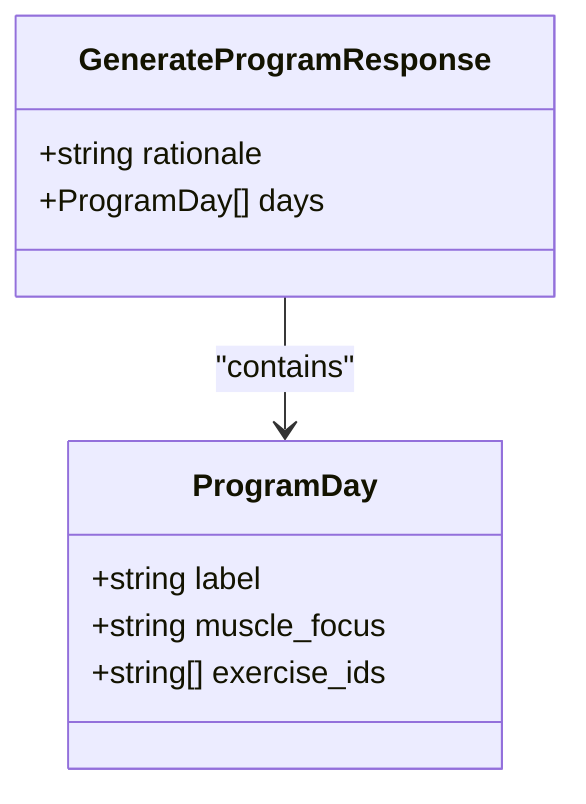
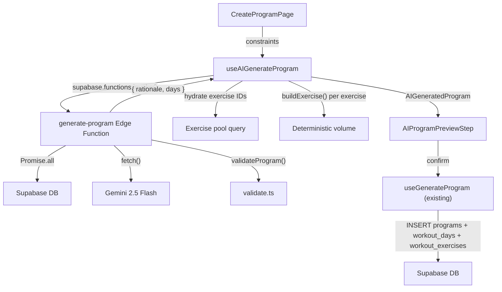
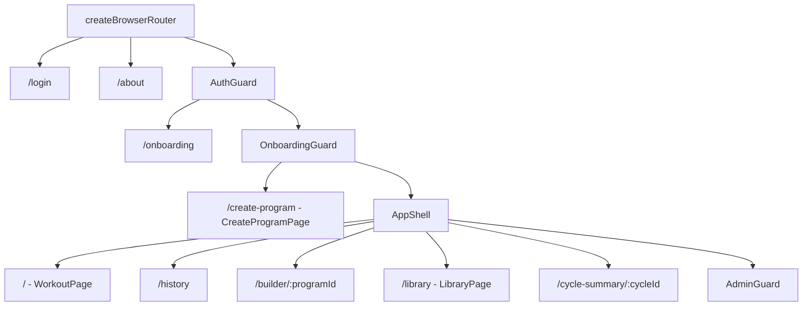
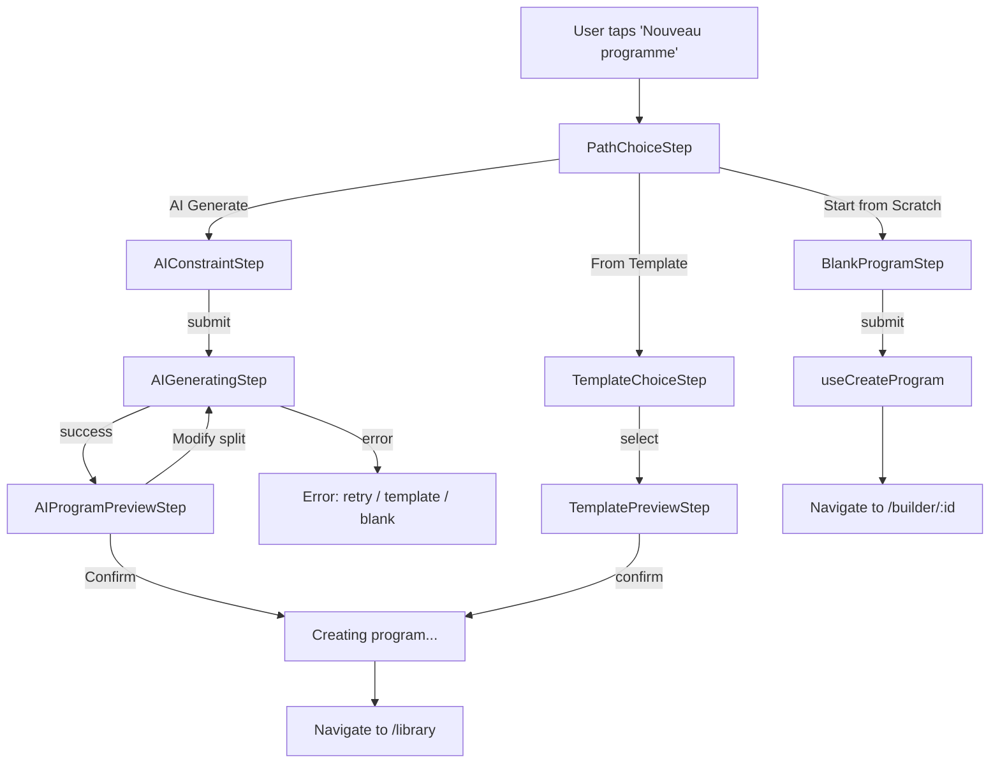

# Tech Plan — AI-Powered Program Generation

## Architectural Approach

### Key Decisions

| Decision | Choice | Rationale |
|---|---|---|
| Edge function | New `generate-program` (separate from `generate-workout`) | Different prompt, different output schema (nested object vs flat array), different validation. Shared code via `_shared/` modules. |
| Gemini structured output | Nested `response_schema` with `rationale` + `days[]` + `exercise_ids[]` | Model-level JSON guarantee. Eliminates parse failures. More complex schema than `generate-workout`'s flat array, but Gemini 2.5 Flash handles nested schemas well. |
| Volume assignment | Client-side `buildExercise()` + `VOLUME_MAP[duration]` | LLM picks exercises only — no hallucinated set/rep counts. Same pipeline as single-workout AI generation. |
| Exercise count per day | Hybrid: LLM decides within `VOLUME_MAP[duration] ± 2` bounds | Arms day naturally has fewer exercises than full-body. The prompt specifies the range; validation enforces it. |
| Regen on split modification | Full program regeneration (single API call) | Simpler than per-day regen, ensures cross-day coherence (no duplicate exercises, balanced groups). Rare path — most users accept the proposed split. |
| Session guard | Block the "Nouveau programme" CTA when `sessionAtom.isActive` | Same pattern as activate button in `file:src/components/library/ActivateConfirmDialog.tsx`. Prevents navigating away from an active session. |
| Template location | Wizard only (not duplicated in library view) | Library = your programs, wizard = create new ones. Templates appear through their output (saved programs are regular program cards). |
| Route placement | `/create-program` outside `AppShell`, inside `AuthGuard` + `OnboardingGuard` | Same pattern as `/onboarding` (`file:src/pages/OnboardingPage.tsx`). Full-page dedicated experience. |
| Wizard state management | Local React state in page component | Same pattern as `OnboardingPage`. No atom pollution. |
| Gemini call function | New `callGeminiProgram()`, not reusing `callGemini()` | Different return type (object vs string array), different schema, different timeout (15s vs 10s). Over-abstraction for 2 call sites. |

### Critical Constraints

**Latency budget breakdown (10s target):**

| Phase | Estimated | Notes |
|---|---|---|
| Cold start | 0–2s | First call after ~15min idle. |
| DB queries (parallel) | 150–300ms | 3 queries via `Promise.all`. Same as `generate-workout`. |
| Gemini Flash | 3–5s | Larger output (~2k tokens vs ~500). Nested schema. |
| Validation + response | 10–20ms | In-memory per-day + cross-day passes. |
| **Total (warm)** | **~3.5–5.5s** | Within budget. |
| **Total (cold)** | **~5.5–7.5s** | Tight but acceptable. |

The Gemini call is the bottleneck. A 6-day program with ~8 exercises/day = ~48 UUIDs + 6 labels + 6 muscle_focus strings + rationale. Temperature `0.7` (slightly lower than `generate-workout`'s `0.8` — program design benefits from more consistency). `maxOutputTokens: 4096` (vs 1024 for single workouts). Timeout: `15_000ms`.

**Prompt token budget:** The pre-filtered catalog is capped at 120 exercises (15 per muscle group) — same as `generate-workout`. For full-body programs with full-gym equipment, the catalog could be near-maximum. Serialized with short keys (`id`, `n`, `mg`, `eq`, `sm`, `dl`), this is ~3-4k input tokens. Combined with the system prompt (~500 tokens) and user context (~200 tokens), total input is ~4-5k tokens. Well within Gemini Flash's context window.

**Service-role key management.** Same as `generate-workout` — `SUPABASE_SERVICE_ROLE_KEY` and `GEMINI_API_KEY` are stored in Supabase Secrets, read via `Deno.env.get()`. Never sent to client.

**JWT verification follows the existing pattern:** extract Bearer token from `Authorization` header, decode payload to get `sub` (user ID). The gateway's `verify_jwt` already validated the signature. This matches `file:supabase/functions/generate-workout/index.ts` line 24–33.

---

## Data Model

No new tables. No migrations. The edge function reads from existing tables; the frontend writes to existing tables via the existing `file:src/hooks/useGenerateProgram.ts` pipeline.

### Edge Function Response Schema



TypeScript interface (used in both edge function and frontend):

```typescript
interface GenerateProgramResponse {
  rationale: string
  days: ProgramDay[]
}

interface ProgramDay {
  label: string
  muscle_focus: string
  exercise_ids: string[]
}
```

Gemini `response_schema` (passed to the API):

```json
{
  "type": "OBJECT",
  "properties": {
    "rationale": { "type": "STRING" },
    "days": {
      "type": "ARRAY",
      "items": {
        "type": "OBJECT",
        "properties": {
          "label": { "type": "STRING" },
          "muscle_focus": { "type": "STRING" },
          "exercise_ids": {
            "type": "ARRAY",
            "items": { "type": "STRING" }
          }
        },
        "required": ["label", "muscle_focus", "exercise_ids"]
      }
    }
  },
  "required": ["rationale", "days"]
}
```

### Edge Function Queries

Same as `file:supabase/functions/generate-workout/index.ts` — 3 parallel queries:

**Q1 — Pre-filtered exercise catalog** (no muscle group filter — program spans multiple groups):

```sql
SELECT id, name_en, muscle_group, equipment, secondary_muscles, difficulty_level
FROM exercises
WHERE equipment IN (:equipmentValues)
ORDER BY muscle_group, name
```

Post-query: cap at 120 via `capCatalog()` (15 per muscle group, same logic as `file:supabase/functions/generate-workout/prompt.ts`).

Note: unlike `generate-workout`, the catalog is NOT filtered by muscle group. A program spans the full body; the LLM decides which exercises go on which day. Equipment filtering still applies.

**Q2 — User profile** (same query as `generate-workout`).

**Q3 — Recent training history** (same two-step query as `generate-workout`). Additionally, the edge function checks the most recent session's `finished_at` timestamp. If it's older than 14 days, a `training_gap: true` flag is passed to the prompt builder.

### Frontend Data Flow



---

## Component Architecture

### Route Structure



`/create-program` sits alongside `AppShell` under `OnboardingGuard` — inside auth + onboarding guards, but outside `AppShell` (no nav bar, no session timer). Same level as `AppShell`, not nested inside it.

### Wizard Step Flow



### New Files & Responsibilities

| File | Purpose |
|---|---|
| `supabase/functions/generate-program/index.ts` | Edge function entry: auth, CORS, orchestrates DB queries + prompt + Gemini call + validation. Returns `{ rationale, days }` or `{ error }`. |
| `supabase/functions/generate-program/prompt.ts` | Multi-day prompt builder: serializes catalog, user profile, history, constraints. Outputs system prompt string. |
| `supabase/functions/generate-program/validate.ts` | `validateProgram()`: per-day ID validation, cross-day dedup, exercise count bounds, muscle focus coherence, backfill. |
| `supabase/functions/generate-program/gemini.ts` | `callGeminiProgram()`: calls Gemini with nested object schema, 15s timeout, returns parsed `GenerateProgramResponse`. |
| `src/pages/CreateProgramPage.tsx` | Full-page wizard. Local state: `step`, `constraints`, `aiResult`, `selectedTemplate`. Renders current step component. |
| `src/components/create-program/PathChoiceStep.tsx` | Three cards: AI Generate, From Template, Start from Scratch. |
| `src/components/create-program/AIConstraintStep.tsx` | React Hook Form + Zod. Prefills from `user_profiles`. Fields: days/week, duration, goal, experience, equipment, optional focus/preferences. |
| `src/components/create-program/AIGeneratingStep.tsx` | Loading state with shimmer/skeleton. Calls `useAIGenerateProgram`. On success -> preview. On error -> retry/fallback options. |
| `src/components/create-program/AIProgramPreviewStep.tsx` | Progressive reveal: `CoachRationale` at top, collapsible `DayCard`s below. Actions: Regenerate, Create Program. |
| `src/components/create-program/CoachRationale.tsx` | Displays the AI's rationale in a styled card with a coach/sparkle icon. |
| `src/components/create-program/TemplateChoiceStep.tsx` | Reuses `TemplateCard`, `LibraryFilterBar`, `TemplateDetailSheet` from `file:src/components/library/`. |
| `src/components/create-program/TemplatePreviewStep.tsx` | Template preview with DayCards. Actions: Back, Create Program. |
| `src/components/create-program/BlankProgramStep.tsx` | Name input + create button. Reuses logic from `CreateProgramDialog`. |
| `src/components/create-program/schema.ts` | Zod schema for AI constraint validation. |
| `src/hooks/useAIGenerateProgram.ts` | `useMutation`: calls edge function, hydrates exercise IDs, applies `buildExercise()`, returns `AIGeneratedProgram`. |
| `src/types/aiProgram.ts` | `AIGeneratedProgram`, `AIGeneratedDay`, `GenerateProgramConstraints` interfaces. |
| `src/locales/en/create-program.json` | English strings for the wizard. |
| `src/locales/fr/create-program.json` | French strings for the wizard. |

### Modified Files

| File | Change |
|---|---|
| `file:src/pages/LibraryPage.tsx` | Remove `Tabs` wrapper, `ProgramsTab`, `QuickWorkoutTab`. Inline `MyWorkoutsTab` content. Replace `CreateProgramDialog` trigger with navigation to `/create-program`. |
| `file:src/router/index.tsx` | Add `/create-program` route under `OnboardingGuard` (sibling of `AppShell`, not nested). Import `CreateProgramPage`. |
| `file:supabase/config.toml` | Add `[functions.generate-program]` block with `verify_jwt = false`. |
| `file:src/locales/en/library.json` | Remove `tabPrograms`, `tabQuickWorkout`, `quickWorkout*` keys. Update `createProgram` CTA text. |
| `file:src/locales/fr/library.json` | Same removals and updates. |
| `file:src/lib/i18n.ts` | Add `"create-program"` to namespace list. |

### Component Responsibilities

**`generate-program/index.ts` (Edge Function)**
- Extracts user ID from JWT (same pattern as `file:supabase/functions/generate-workout/index.ts`)
- Parses request body: `{ daysPerWeek, duration, equipmentCategory, goal, experience, focusAreas?, splitPreference? }`
- Runs 3 parallel DB queries: catalog (ALL muscle groups, filtered by equipment only), profile, history
- Computes `training_gap` flag (most recent session's `finished_at` > 14 days ago)
- Caps catalog to 120 exercises via `capCatalog()`
- Computes exercise count bounds: `VOLUME_MAP[duration].exerciseCount +/- 2`, clamped to `[4, 13]`
- Builds prompt via `prompt.ts`
- Calls Gemini via `gemini.ts`
- Validates via `validate.ts`
- Returns `{ rationale, days: [{ label, muscle_focus, exercise_ids }] }` or `{ error }`
- Single retry on catastrophic failure (unparseable response or zero valid days)

**`generate-program/prompt.ts` — Prompt Construction**

System prompt structure:

```
You are a strength and conditioning coach designing a multi-day training program.

RULES:
- Design a training split for {daysPerWeek} days per week.
- Each day should have between {minExercises} and {maxExercises} exercises.
- Return ONLY exercise IDs from the EXERCISE CATALOG below. Never invent IDs.
- No duplicate exercises across any days.
- Order exercises within each day: compound movements first, isolation last.
- Group synergistic muscles on the same day (e.g. chest + triceps, back + biceps).
- Distribute muscle groups across the week so no group is overtrained.
- Given the user's experience level, prefer exercises whose difficulty_level matches
  or is one step above — this supports progressive exercise complexity.
- Provide a brief rationale (1-2 sentences) explaining why this split suits the user.
{if splitPreference: - The user prefers a {splitPreference} split.}
{if focusAreas: - The user wants to emphasize: {focusAreas}.}
{if training_gap: - The user hasn't trained in over 2 weeks. Propose a conservative
  re-entry program: prefer compound movements, standard volume, moderate intensity.}

USER PROFILE:
- Experience: {experience}
- Goal: {goal}
- Equipment: {equipmentCategory}
- Session duration: {duration} minutes

{if recentExercises.length > 0:
RECENT EXERCISES (prefer variety over these):
{recentExerciseIds and names, one per line}
}

EXERCISE CATALOG:
{JSON array of {id, n, mg, eq, sm, dl}}
```

Catalog serialization reuses the compact format from `file:supabase/functions/generate-workout/prompt.ts`: `{ id, n (name_en), mg (muscle_group), eq (equipment), sm (secondary_muscles), dl (difficulty_level) }`.

**`generate-program/validate.ts` — Multi-Day Validation**

```typescript
interface ValidateProgramResult {
  rationale: string
  days: ValidatedDay[]
  repaired: boolean
  totalDropped: number
  totalBackfilled: number
}

interface ValidatedDay {
  label: string
  muscle_focus: string
  exercise_ids: string[]
  dropped: number
  backfilled: number
}

function validateProgram(
  llmOutput: GenerateProgramResponse,
  catalog: CatalogEntry[],
  targetDayCount: number,
  exerciseBounds: { min: number; max: number },
): ValidateProgramResult
```

Validation steps:
1. Verify `days.length === targetDayCount`. If not, trim excess or flag catastrophic failure (zero days).
2. Build catalog lookup: `Map<string, CatalogEntry>`.
3. Collect all exercise IDs across all days into a `globalSeen` set for cross-day dedup.
4. Per day:
   a. Filter exercise IDs: keep only those in catalog. Track dropped groups.
   b. Remove cross-day duplicates (if ID already in `globalSeen`).
   c. Add valid IDs to `globalSeen`.
   d. If count < `exerciseBounds.min`: backfill from catalog, scoped to the day's `muscle_focus` group, excluding `globalSeen`.
   e. If count > `exerciseBounds.max`: trim.
5. Rationale: pass through as-is (it's a string, no validation needed beyond non-empty).

**`generate-program/gemini.ts` — Gemini API Call**

Same structure as `file:supabase/functions/generate-workout/gemini.ts` but:
- Returns `GenerateProgramResponse` (parsed from nested JSON), not `string[]`
- `response_schema` is the nested object schema defined above
- `temperature: 0.7` (more consistent than 0.8 for program design)
- `maxOutputTokens: 4096` (larger output)
- `thinkingBudget: 0` (same as generate-workout)
- Timeout: `15_000ms` (vs 10s)

**`useAIGenerateProgram` — Frontend Hook**

```typescript
interface AIGeneratedProgram {
  rationale: string
  days: AIGeneratedDay[]
}

interface AIGeneratedDay {
  label: string
  muscleFocus: string
  exercises: GeneratedExercise[] // reuses type from generator.ts
}
```

Flow:
1. `useMutation` wrapping `supabase.functions.invoke("generate-program", { body: constraints })`
2. On success: receives `{ rationale, days: [{ label, muscle_focus, exercise_ids }] }`
3. Collects all unique exercise IDs across all days
4. Hydrates from exercise pool cache; falls back to direct Supabase query for misses (same pattern as `file:src/hooks/useAIGenerateWorkout.ts`)
5. For each day, for each exercise: applies `buildExercise(exercise, VOLUME_MAP[duration].setsPerExercise)` — deterministic compound/isolation treatment
6. Returns `AIGeneratedProgram` for the preview step

**`CreateProgramPage` — Wizard Orchestrator**
- Local state: `{ step, path, constraints, aiResult, selectedTemplate }`
- On mount: reads `hasProgramAtom`. Already-onboarded guard (same as `OnboardingPage`).
- Renders back button + current step component
- Step transitions: each step calls `onNext(data)` or `onBack()`
- AI path: PathChoice -> AIConstraint -> AIGenerating -> AIProgramPreview -> creating...
- Template path: PathChoice -> TemplateChoice -> TemplatePreview -> creating...
- Blank path: PathChoice -> BlankProgram -> navigate to builder

**`AIProgramPreviewStep` — Progressive Reveal**
- `CoachRationale` component at top: displays `rationale` string in a styled card with sparkle icon
- Below: list of day cards, initially collapsed (show label + muscle focus)
- Tap to expand: shows exercise list with name, muscle group, sets x reps, rest
- "Regenerate" button: re-triggers `useAIGenerateProgram` with same constraints
- "Create Program" button: builds the data structure for `useGenerateProgram`
- The "Create Program" action constructs a synthetic `ProgramTemplate`-like object that `useGenerateProgram` can consume, or bypasses it with direct inserts (see integration below)

**`LibraryPage` — Refactored**
- Removes: `Tabs`, `TabsList`, `TabsTrigger`, `TabsContent`, `ProgramsTab` import, `QuickWorkoutTab` import
- Keeps: back button, title, program list, create CTA, archived toggle, all dialogs/sheets
- The "Create Program" button changes from opening `CreateProgramDialog` to navigating to `/create-program`
- Effectively becomes the content of current `MyWorkoutsTab` wrapped in the page layout

### AI Program -> Existing Pipeline Integration

The `file:src/hooks/useGenerateProgram.ts` pipeline expects a `ProgramTemplate` input with `template_days[].template_exercises[]`. For AI-generated programs, we bypass the template abstraction and insert directly:

```typescript
// In useAIGenerateProgram's onConfirm handler:
async function createAIProgram(
  aiProgram: AIGeneratedProgram,
  constraints: GenerateProgramConstraints,
  userId: string,
): Promise<string> {
  // 1. Deactivate current active program
  await supabase.from("programs")
    .update({ is_active: false })
    .eq("user_id", userId)
    .eq("is_active", true)

  // 2. Create program row (no template_id — AI-generated)
  const { data: program } = await supabase.from("programs")
    .insert({
      user_id: userId,
      name: `AI: ${constraints.goal} / ${constraints.daysPerWeek}d`,
      template_id: null,
      is_active: true,
    })
    .select("id")
    .single()

  // 3. For each day: create workout_day + workout_exercises
  for (const [i, day] of aiProgram.days.entries()) {
    const { data: insertedDay } = await supabase.from("workout_days")
      .insert({
        program_id: program.id,
        user_id: userId,
        label: day.label,
        emoji: DAY_EMOJIS[i % DAY_EMOJIS.length],
        sort_order: i,
      })
      .select("id")
      .single()

    const exerciseRows = day.exercises.map((ge, idx) => ({
      workout_day_id: insertedDay.id,
      exercise_id: ge.exercise.id,
      name_snapshot: ge.exercise.name,
      muscle_snapshot: ge.exercise.muscle_group,
      emoji_snapshot: ge.exercise.emoji,
      sets: ge.sets,
      reps: ge.reps,
      weight: "0",
      rest_seconds: ge.restSeconds,
      sort_order: idx,
    }))

    await supabase.from("workout_exercises").insert(exerciseRows)
  }

  // 4. Update atoms + invalidate caches
  store.set(hasProgramAtom, true)
  store.set(activeProgramIdAtom, program.id)
  qc.invalidateQueries({ queryKey: ["workout-days"] })
  qc.invalidateQueries({ queryKey: ["active-program"] })
  qc.invalidateQueries({ queryKey: ["user-programs"] })

  return program.id
}
```

This follows the same sequential insert pattern as `file:src/hooks/useGenerateProgram.ts` but skips the template/swap/adaptation layer (volume is already assigned client-side by `buildExercise`).

### Failure Mode Analysis

| Failure | Behavior |
|---|---|
| Gemini returns invalid JSON | Should not happen with structured output mode. If it does: 1 retry with amended prompt, then return `{ error }`. Frontend shows retry/fallback options. |
| Gemini returns hallucinated exercise IDs | Per-day repair: drop invalid, backfill from catalog matching the day's muscle focus. Cross-day dedup removes duplicates. Program coherence preserved. |
| Gemini returns wrong number of days | Validation trims excess days. If zero days: catastrophic failure -> retry. |
| Gemini returns too few/many exercises per day | Validation enforces `VOLUME_MAP +/- 2` bounds. Backfill or trim as needed. |
| Gemini API timeout (>15s) | `AbortController` aborts. Edge function returns `{ error: "timeout" }`. Frontend shows retry option. |
| User has no profile | Edge function proceeds without profile context. Prompt uses defaults (intermediate, general_fitness, gym). |
| User has no training history | Prompt omits RECENT EXERCISES section. Normal behavior for new users. |
| Training gap > 14 days | `training_gap` flag triggers conservative prompt variant. LLM prefers compound movements, moderate intensity. |
| Cold start + large program (worst case ~7.5s) | Within 10s budget. Loading state with "Generating your program..." message. |
| Network drops mid-generation | `onError` detects network failure. Offers: retry, pick a template, or build from scratch. |
| Active session in progress | "Nouveau programme" CTA disabled with tooltip. User cannot navigate to `/create-program`. |
| Partial program creation fails (days created, exercises fail) | Same failure mode as template-based generation — partial program visible in builder, user can fix manually or retry. |

---

## Implementation Order

The implementation is split into two independent PRs to reduce review surface and deployment risk.

### PR A — Library Redesign (ships first, zero backend changes)

1. Refactor `file:src/pages/LibraryPage.tsx` — remove `Tabs` wrapper, `ProgramsTab`, `QuickWorkoutTab`. Inline `MyWorkoutsTab` content directly (program list + create CTA + archived toggle).
2. Update `file:src/locales/en/library.json` and `fr/library.json` — remove `tabPrograms`, `tabQuickWorkout`, `quickWorkout*` keys. Update CTA text to "Nouveau programme".
3. Session guard: disable "Nouveau programme" CTA when `sessionAtom.isActive` with tooltip.
4. Keep `CreateProgramDialog` for now — the CTA still opens the blank-program dialog. The navigation to `/create-program` happens in PR B.
5. E2E test: library displays unified program list, create dialog works, archived toggle works.

### PR B — AI Engine + Creation Wizard (ships after PR A)

**Phase B1 — Edge Function + Validation**

6. Add `[functions.generate-program]` block to `file:supabase/config.toml`
7. Create `supabase/functions/generate-program/gemini.ts` — `callGeminiProgram()` with nested schema
8. Create `supabase/functions/generate-program/prompt.ts` — multi-day prompt builder with training gap detection
9. Create `supabase/functions/generate-program/validate.ts` — `validateProgram()` with per-day + cross-day validation
10. Create `supabase/functions/generate-program/index.ts` — orchestration (auth, DB queries, prompt, Gemini, validation)
11. Test edge function locally via `supabase functions serve` + curl

**Phase B2 — Frontend Hook + Types**

12. Create `src/types/aiProgram.ts` — `AIGeneratedProgram`, `AIGeneratedDay`, `GenerateProgramConstraints`
13. Create `src/hooks/useAIGenerateProgram.ts` — mutation hook (invoke edge function, hydrate exercises, apply `buildExercise`)
14. Create `src/components/create-program/schema.ts` — Zod schema for constraint validation
15. Unit test: `useAIGenerateProgram` hydration and volume assignment logic

**Phase B3 — Creation Wizard**

16. Create `src/pages/CreateProgramPage.tsx` — wizard shell with step management
17. Create `src/components/create-program/PathChoiceStep.tsx` — 3 path cards
18. Create `src/components/create-program/AIConstraintStep.tsx` — React Hook Form + Zod + profile prefill
19. Create `src/components/create-program/AIGeneratingStep.tsx` — loading state + error handling
20. Create `src/components/create-program/CoachRationale.tsx` — rationale display card
21. Create `src/components/create-program/AIProgramPreviewStep.tsx` — progressive reveal + create action
22. Create `src/components/create-program/TemplateChoiceStep.tsx` — reuse template components
23. Create `src/components/create-program/TemplatePreviewStep.tsx` — template preview + create action
24. Create `src/components/create-program/BlankProgramStep.tsx` — name input + create action
25. Add `/create-program` route to `file:src/router/index.tsx`
26. Create `src/locales/en/create-program.json` and `fr/create-program.json`
27. Add `"create-program"` namespace to `file:src/lib/i18n.ts`

**Phase B4 — Integration + Polish**

28. Update Library CTA: replace `CreateProgramDialog` trigger with navigation to `/create-program`
29. E2E test: full AI generation flow (constraint -> preview -> create -> visible in library)
30. E2E test: template path (select -> preview -> create)
31. E2E test: blank path (name -> builder redirect)

---

## Resolved Challenges (from review)

| Challenge | Resolution |
|---|---|
| **Scope bloat** — Library redesign + AI engine in one PR is too large to review | Split into PR A (Library UI, zero backend) and PR B (AI engine + wizard). PR A ships first, PR B builds on it. |
| **Progression is subjective for the LLM** — sending exercise IDs isn't enough for load progression | Out of scope by design. The LLM selects exercises (composition); it does not prescribe weights. Load progression belongs at the session level, not program creation. The `difficulty_level` column gives the LLM a quantitative signal for exercise selection difficulty. A future "Smart Load Progression" epic would handle weight auto-suggestion. |
| **Two-phase flow latency** — two LLM calls create a conversion-killing tunnel | Already resolved: single LLM call returns the full program (split + exercises). The UI progressively reveals split first, then exercises. Two display steps, one execution. |

---

## References

- Epic Brief: `file:docs/Epic_Brief_—_AI-Powered_Program_Generation.md`
- GitHub Issue: [#63](https://github.com/PierreTsia/workout-app/issues/63)
- Existing AI patterns: `file:supabase/functions/generate-workout/index.ts`, `file:src/hooks/useAIGenerateWorkout.ts`
- Program pipeline: `file:src/hooks/useGenerateProgram.ts`, `file:src/lib/generateProgram.ts`
- Library components: `file:src/pages/LibraryPage.tsx`, `file:src/components/library/MyWorkoutsTab.tsx`
