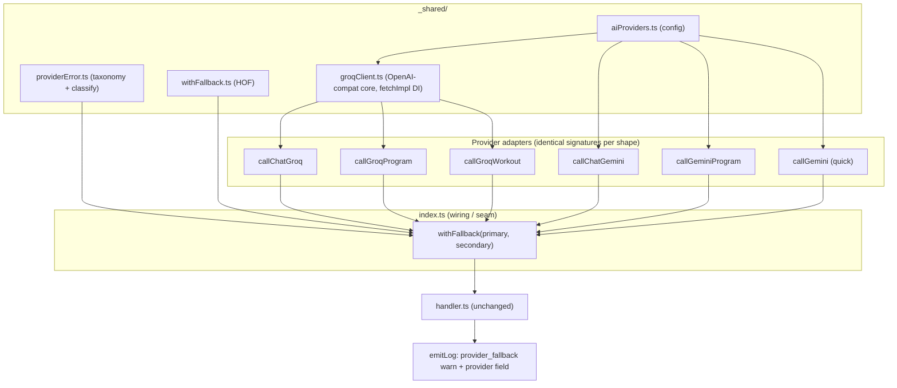

# Tech Plan — AI Provider Fallback (#405)

> Implements the design locked in [ADR 0009](adr/0009-ai-provider-fallback.md) and the glossary terms **AI Provider Fallback** / **Primary Provider** / **Fallback Provider** (`docs/CONTEXT.md`). Read the ADR first — this plan is the *how*, the ADR is the *why*.

## Architectural Approach

The in-app AI calls survive **Primary Provider** (Gemini) outages by retrying once on a **Fallback Provider** (Groq) before the user sees an error. The whole mechanism composes at the **dependency-injection seam** that already exists in the live edge entrypoints — the handlers are untouched.

After the #405 dead-code cleanup, there are exactly **two live seams**:

| Edge entrypoint | Injected dep | Signature | Primary | Fallback |
|---|---|---|---|---|
| `embedded-agent/index.ts` | `chatModel` | `(ChatModelInput) => ChatModelOutput` | `callChatGemini` | `callChatGroq` |
| `embedded-agent/index.ts` | `draftDeps.callModel` | `(string) => GenerateProgramResponse` | `callGeminiProgram` | `callGroqProgram` |
| `generate-quick-workout/index.ts` | `deps.callGemini` | `(string) => { exerciseIds, rationale }` | `callGemini` | `callGroqWorkout` |

### Key Decisions

| Decision | Choice | Rationale |
|---|---|---|
| Scope | The two live seams (chat, program-draft, quick-workout) | `generate-program/` deleted this branch; quick-workout had zero 5xx resilience, so coverage closes the real gap. |
| Retry vs fallback | Each provider gets **max 2 attempts** (initial + 1 retry on a retryable kind); on the primary's exhausted retryable failure → fallback | 1 in-place retry catches the ~1s transient 503 cheaply; a sustained outage falls back instead of hammering Gemini. Tuning param. |
| Fallback triggers | `provider_unavailable` + `provider_error` + `timeout` only | Never `client_error` (4xx = our config bug, must surface) nor `empty_response` (ambiguous). |
| Abstraction | Generic `withFallback(primary, secondary, opts)` HOF at the seam | Composes over identical-signature adapters; handlers & validators untouched. |
| Error taxonomy | **Lift** `ProviderFailureKind` + `classifyProviderError` from `chatModel.ts` into `_shared/providerError.ts`; refactor `chatModel.ts` to import; make the two JSON adapters throw `ProviderError` (not bare `Error`) | Single source so `withFallback` classifies uniformly across all three shapes. |
| JSON parity | Groq uses `response_format: { type: "json_schema", … }`; schema derived from **one shared source** (translated from the Gemini `RESPONSE_SCHEMA`s); downstream `validateProgram` / `validateAndRepair` stay as the safety net | Strongest parity; validators are provider-agnostic and already repair drift. |
| Time budget | Fallback leg gets a **fresh, tighter ~10s** `AbortController` | A `timeout`-triggered fallback must not inherit ~0s; Groq's LPU keeps the real leg at 1-3s. |
| Observability | Structured `provider_fallback` warn log + `provider` field on success logs. **No** server-side Sentry. | Sentry is frontend-only (tags off the wire `failure_kind`); the `provider` dimension stays a server log → never leaks to wire/UI → branding rule holds by construction. |
| Quota | Counted **once**, provider-agnostic; `logBillableCall` stays at the **handler** level (outside `withFallback`) | A fallback-served call is one logical user action. |
| Config | New `_shared/aiProviders.ts` (env key names, base URLs, model ids, budgets) | No shared config exists today; going multi-provider, centralize instead of spreading hardcoded constants ×N. |
| Groq model | `llama-3.3-70b-versatile` | Solid JSON mode, 128K ctx, generous free-tier RPD; configurable in `aiProviders.ts`. |

### Critical Constraints

- **`chatModel.ts` is covered by #358.** Lifting the taxonomy and reducing `MAX_CHAT_MODEL_ATTEMPTS` (3 → 2) touches retry code with existing Deno tests (`chatModel_test.ts`). Those tests pin the 3-attempt contract and must be updated in lock-step.
- **`programGemini.ts` and `gemini.ts` have no unit tests** (tested via handler DI). Switching them to throw `ProviderError` requires new Deno tests using the `fetchImpl` DI pattern from `chatModel.ts`.
- **Branding invariant (CONTEXT.md / Embedded Agent product rule 1):** the `provider` dimension must never reach the wire response or UI — server logs only.
- **Secondary misconfig must not mask the primary failure.** If `GROQ_API_KEY` is absent, `withFallback` logs `provider_fallback_unavailable` and rethrows the *primary's* classified error (the user sees the original Gemini failure, not a Groq config error).
- **Quick Workout wire stays coarse.** Adding `failure_kind` to the quick-workout wire + client Sentry is **out of scope** (it works today without it); fallback observability lives in server logs.

---

## Data Model

**No database schema changes.** No new tables, no `provider` column on `ai_generation_log` (quota counts once, provider-agnostic — see ADR 0009 §8). The "data" here is code-level shapes.

### Lifted failure taxonomy — `_shared/providerError.ts`

```typescript
export type ProviderFailureKind =
  | "provider_unavailable"  // 503 UNAVAILABLE ("high demand") — retryable, fallback
  | "provider_error"        // other upstream 5xx — retryable, fallback
  | "client_error"          // non-retryable 4xx (bad key/payload) — NO fallback
  | "timeout"               // AbortController budget elapsed — fallback
  | "empty_response"        // 2xx but unusable (thinking-only / empty) — NO fallback

export class ProviderError extends Error {
  readonly kind: ProviderFailureKind
  readonly upstreamStatus?: number
}

export const RETRYABLE_STATUSES: ReadonlySet<number>      // 500, 502, 503, 504
export const FALLBACK_KINDS: ReadonlySet<ProviderFailureKind> // unavailable, error, timeout
export function httpStatusToFailureKind(status: number): ProviderFailureKind
export function classifyProviderError(err: unknown): { kind, upstreamStatus? }
```

`chatModel.ts` re-exports `ChatModelError`/`ChatModelFailureKind` as thin aliases of `ProviderError`/`ProviderFailureKind` to keep `handler.ts`'s `classifyChatFailure` and existing imports working during the refactor.

### Provider config — `_shared/aiProviders.ts`

```typescript
export const GEMINI = {
  baseUrl: "https://generativelanguage.googleapis.com/v1beta/models",
  model: "gemini-2.5-flash",
  apiKeyEnv: "GEMINI_API_KEY",
} as const

export const GROQ = {
  baseUrl: "https://api.groq.com/openai/v1/chat/completions",
  model: "llama-3.3-70b-versatile",
  apiKeyEnv: "GROQ_API_KEY",
} as const

export const FALLBACK_TIMEOUT_MS = 10_000   // fresh budget for the Groq leg
```

`.env.example` gains a `GROQ_API_KEY=` line.

### Shared JSON-Schema source (Groq `response_format`)

The two Gemini `RESPONSE_SCHEMA` objects (`"OBJECT"`/`"STRING"`/`"ARRAY"`) are translated once into OpenAI-style JSON Schema (`"object"`/`"string"`/`"array"`) and reused by the Groq adapters. The program shape (`{ rationale, days[] }`) and the quick-workout shape (`{ rationale, exerciseIds[] }`) map 1:1.

---

## Component Architecture

### Layer Overview



### New Files & Responsibilities

| File | Purpose |
|---|---|
| `supabase/functions/_shared/aiProviders.ts` | Provider config: base URLs, model ids, env key names, fallback budget. |
| `supabase/functions/_shared/providerError.ts` | Lifted failure taxonomy: `ProviderError`, `ProviderFailureKind`, `classifyProviderError`, `RETRYABLE_STATUSES`, `FALLBACK_KINDS`, `httpStatusToFailureKind`. |
| `supabase/functions/_shared/withFallback.ts` | Generic HOF: runs primary; on a `FALLBACK_KINDS` failure runs secondary with a fresh budget; emits the `provider_fallback` log via an injected logger; rethrows secondary's error (or primary's on secondary misconfig). |
| `supabase/functions/_shared/groqClient.ts` | OpenAI-compatible Groq core: `callGroqChat({ systemPrompt, messages, responseSchema?, timeoutMs })`. `fetchImpl` DI for tests. Throws `ProviderError`. |
| `supabase/functions/embedded-agent/groqChat.ts` | `callChatGroq(ChatModelInput): ChatModelOutput` — free-form, no schema. |
| `supabase/functions/_shared/programGroq.ts` | `callGroqProgram(prompt): GenerateProgramResponse` — json_schema. |
| `supabase/functions/generate-quick-workout/groq.ts` | `callGroqWorkout(prompt): { exerciseIds, rationale }` — json_schema. |
| `*_test.ts` for `groqClient`, `withFallback`, and the three Groq adapters | Deno tests, `fetchImpl` DI, no network. |

### Component Responsibilities

`**withFallback**`
- Generic over `(I) => Promise<O>`. Runs `primary(input)`; catches, runs `classifyProviderError`.
- If `kind ∈ FALLBACK_KINDS` and the secondary is configured → run `secondary(input)` with a fresh `FALLBACK_TIMEOUT_MS` budget; emit `provider_fallback` warn (primary kind + secondary outcome).
- If `kind ∉ FALLBACK_KINDS` (e.g. `client_error`, `empty_response`) → rethrow primary error, no fallback.
- Secondary misconfig (no `GROQ_API_KEY`) → log `provider_fallback_unavailable`, rethrow **primary's** error.
- Success on either leg → return; logger receives the winning `provider`.

`**chatModel.ts** (modified)`
- Keeps `callChatGemini` (Gemini specifics + in-place retry). `MAX_CHAT_MODEL_ATTEMPTS` 3 → 2. Imports taxonomy from `_shared/providerError.ts` (aliases preserved).

`**programGemini.ts / gemini.ts** (modified)`
- Throw `ProviderError` (via `httpStatusToFailureKind`) instead of bare `Error`, so `withFallback` classifies them. Parsing/validation unchanged.

`**index.ts** ×2 (modified)`
- Wrap each injected adapter: `chatModel: withFallback(callChatGemini, callChatGroq, { log, ... })`, etc. `logBillableCall` stays where it is (handler level).

### Failure Mode Analysis

| Failure | Behavior |
|---|---|
| Primary 503, secondary OK | Fallback succeeds; user sees nothing; `provider_fallback` warn + `provider: "groq"` success log. |
| Primary 503, secondary 503/429 | Both fail; rethrow secondary's `provider_unavailable`; handler → `model_failure` + `failure_kind`; client shows transient "busy, retry" banner. |
| Primary 4xx (bad key/payload) | No fallback; `client_error` surfaces immediately (our bug, not hidden). |
| Primary timeout (budget elapsed) | Fallback engaged with fresh ~10s budget. |
| Primary `empty_response` | No fallback (v1); surfaces as-is. |
| Groq returns malformed JSON | `validateProgram` / `validateAndRepair` repair/backfill (same path as Gemini). |
| `GROQ_API_KEY` missing | `provider_fallback_unavailable` log; primary's error rethrown (no masking). |
| Both providers down on quick-workout | Handler returns `model_failure`/`timeout` (coarse wire, unchanged); deterministic in-app fallback UI offered (existing). |

---

## References

- Issue [#405](https://github.com/PierreTsia/workout-app/issues/405)
- [ADR 0009 — AI Provider Fallback](adr/0009-ai-provider-fallback.md)
- Glossary: **AI Provider Fallback** / **Primary Provider** / **Fallback Provider** (`docs/CONTEXT.md`)
- Prior art: #358 (retry-on-5xx + failure taxonomy in `chatModel.ts`), T129/T130 (`generate-program` decommission)
