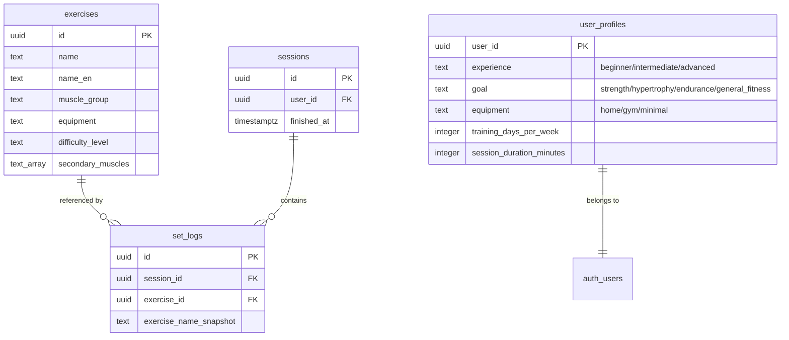
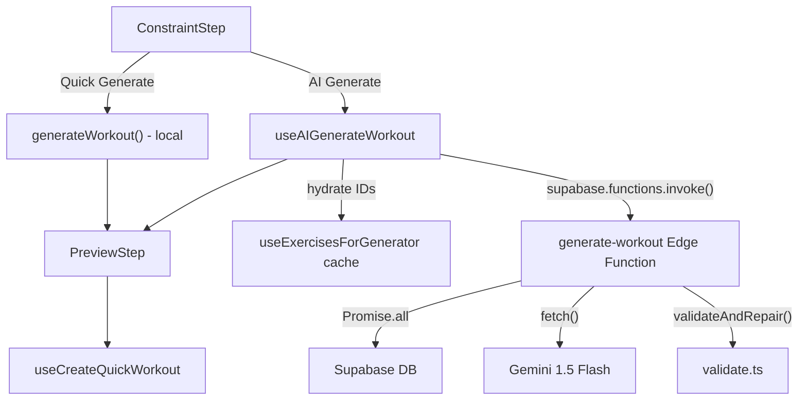

# Tech Plan — AI Workout Generator

## Architectural Approach

### Key Decisions

| Decision | Choice | Rationale |
|---|---|---|
| Edge function runtime | Supabase Edge Function (Deno) | Only server-side compute option in the stack. First edge function — establishes patterns for future use. |
| Gemini API integration | Raw `fetch()` to REST API (`generativelanguage.googleapis.com`) | Zero dependencies in Deno. Full control over request/response. SDK adds bundle size and potential Deno compat issues for a single endpoint. |
| Structured output | Gemini `response_mime_type: "application/json"` + `response_schema` | Guarantees valid JSON from the model. Eliminates "extract JSON from markdown" failures entirely. |
| Exercise catalog scope | Pre-filtered by constraints + capped at 15 per muscle group | Reduces prompt from ~600 exercises to ~30-120. Cuts tokens by ~85%, reduces latency, and makes hallucination less likely. |
| LLM output format | Array of exercise UUIDs only | Minimal output tokens. Client hydrates from its local cache (`useExercisesForGenerator`). Sets/reps/rest computed deterministically client-side. |
| Validation strategy | Repair-first: drop invalid, backfill from pool **respecting muscle group of dropped exercise**. Full retry only on catastrophic failure (max 1). | Keeps happy path to 1 LLM call. Avoids the latency trap of recursive retries. Muscle-group-aware backfill preserves workout coherence. |
| DB access in edge function | Service-role Supabase client | Bypasses RLS. The edge function is trusted backend code — it authenticates the user via JWT, then queries freely. |
| Rate limiting | Architecture supports per-user daily cap (10/day). Disabled during testing. | Simple counter in `user_profiles` or a lightweight `ai_generation_log` table. Not implemented in v1. |

### Critical Constraints

**First edge function — scaffolding matters.** The `supabase/functions/` directory doesn't exist yet. The patterns established here (CORS, auth, error handling, shared utilities) will be reused by every future edge function. `file:supabase/config.toml` already has `[edge_runtime] enabled = true` with `policy = "oneshot"`.

**Latency budget breakdown (5s target):**

| Phase | Estimated | Notes |
|---|---|---|
| Cold start | 0-2s | Only on first call after ~15min idle. Subsequent calls: 0ms. |
| DB queries (parallel) | 150-300ms | 3 queries via `Promise.all`. PostgREST is fast for simple filters. |
| Gemini Flash | 1-2s | Structured output mode, ~2-3k input tokens, ~500 output tokens. |
| Validation + response | 10ms | In-memory, trivial. |
| **Total (warm)** | **~1.5-2.5s** | Well within budget. |
| **Total (cold)** | **~3.5-4.5s** | Tight but acceptable. |

**Service-role key management.** The `SUPABASE_SERVICE_ROLE_KEY` must be stored in Supabase Secrets (not in `.env.local`). The edge function reads it via `Deno.env.get()`. The `GEMINI_API_KEY` goes in Secrets too. Neither key is ever sent to the client.

**Explicit JWT verification is mandatory.** The edge function uses a service-role client that bypasses RLS. Without explicit user verification, anyone with the function URL could call the API, scrape exercises, or generate workouts for arbitrary users. The function must call `supabase.auth.getUser(token)` and use the returned verified user ID — never trust a decoded JWT claim directly. This is non-negotiable.

**Session guard.** The AI Generate button must check `sessionAtom.isActive` before opening — same guard as the deterministic generator. `file:src/store/atoms.ts` defines `sessionAtom` and `isQuickWorkoutAtom`.

**`useExercisesForGenerator` cache alignment.** The frontend calls `useExercisesForGenerator` with the same constraints used by the edge function. The edge function returns exercise IDs; the client hydrates from this cache. If a returned ID isn't in the cache (rare timing edge case), the client falls back to a direct `.in("id", missingIds)` Supabase query.

---

## Data Model

No new tables. No migrations. The edge function reads from existing tables.



### Edge Function Queries

**Q1 — Pre-filtered exercise catalog** (the LLM context):

```sql
SELECT id, name_en, muscle_group, equipment, secondary_muscles, difficulty_level
FROM exercises
WHERE equipment IN (:equipmentValues)
  AND (:isFullBody OR muscle_group IN (:muscleGroups))
ORDER BY muscle_group, name
```

Post-query: if result count > 120 (full-body + full-gym), cap at 15 per muscle group via in-memory sampling.

**Q2 — User profile:**

```sql
SELECT experience, goal, equipment, training_days_per_week
FROM user_profiles
WHERE user_id = :userId
```

**Q3 — Recent training history** (last 5 completed sessions):

Two-step query — fetch 5 most recent completed session IDs, then collect their exercise IDs:

```sql
-- Step 1: last 5 session IDs
SELECT id FROM sessions
WHERE user_id = :userId AND finished_at IS NOT NULL
ORDER BY finished_at DESC
LIMIT 5

-- Step 2: exercises from those sessions
SELECT DISTINCT exercise_id, exercise_name_snapshot
FROM set_logs
WHERE session_id IN (:sessionIds)
```

All three queries run in parallel via `Promise.all`.

---

## Component Architecture

### Layer Overview



### New Files & Responsibilities

| File | Purpose |
|---|---|
| `supabase/functions/generate-workout/index.ts` | Edge function entry point. Auth, CORS, orchestrates DB queries, prompt, Gemini call, validation, response. |
| `supabase/functions/_shared/cors.ts` | Reusable CORS headers for edge functions. |
| `supabase/functions/_shared/supabase.ts` | Service-role Supabase client factory. |
| `supabase/functions/generate-workout/prompt.ts` | System prompt template, catalog serializer, constraint formatter. |
| `supabase/functions/generate-workout/validate.ts` | `validateAndRepair()` — drops invalid IDs, backfills from pool **respecting muscle group of each dropped exercise**, returns clean exercise list. Receives full catalog for group-aware repair. |
| `supabase/functions/generate-workout/gemini.ts` | `callGemini()` — raw fetch to Gemini REST API with structured output config. |
| `src/hooks/useAIGenerateWorkout.ts` | `useMutation` that calls the edge function, hydrates exercise IDs from cache, and returns a `GeneratedWorkout`. |

### Modified Files

| File | Change |
|---|---|
| `file:src/components/generator/ConstraintStep.tsx` | Replace single "Generate" button with two buttons: "Quick Generate" and "AI Generate". Add `onAIGenerate` prop. Disable AI button when offline. |
| `file:src/components/generator/QuickWorkoutSheet.tsx` | Add AI generation path: call `useAIGenerateWorkout`, handle loading/error states, fall back to deterministic on failure. |
| `file:src/locales/en/generator.json` | New keys: `aiGenerate`, `aiGenerating`, `aiError`, `aiFallback`, `warmingUp` |
| `file:src/locales/fr/generator.json` | French translations for the above keys. |

### Component Responsibilities

**`generate-workout/index.ts` (Edge Function)**
- **Auth — belt and suspenders:** Two-layer JWT verification:
  1. Gateway layer: `verify_jwt = true` in `file:supabase/config.toml` rejects unauthenticated requests before the function code runs
  2. Function layer: explicitly extract the Bearer token from the `Authorization` header, call `supabase.auth.getUser(token)` to get the verified `user.id`. Use **this verified ID** — not a decoded JWT claim — for all subsequent DB queries. If `getUser()` returns an error, return 401 immediately.
- Runs 3 DB queries in parallel (using the verified user ID): filtered exercises, user profile, recent history
- Builds the prompt via `prompt.ts`
- Calls Gemini via `gemini.ts`
- Validates and repairs via `validate.ts`
- Returns `{ exerciseIds: string[] }` or `{ error: string }`

**`prompt.ts` — Prompt Construction**

System prompt structure:

```
You are a workout programming assistant. You select exercises from a provided catalog
to build a workout.

RULES:
- Return ONLY exercise IDs from the catalog below. Never invent IDs.
- Select exactly {exerciseCount} exercises.
- Respect the user's equipment and muscle group constraints.
- Order exercises: compound movements first, isolation movements last.
- Avoid exercises the user did in their last 5 sessions (listed below) unless the pool
  is too small.
- Given the user's experience level ({experience}), prefer exercises matching or slightly
  above their difficulty level — this supports progressive overload.
- Group synergistic muscles (e.g., chest + triceps, back + biceps) when the focus allows.
- For full-body workouts, distribute exercises evenly across major muscle groups.

USER PROFILE:
- Experience: {experience}
- Goal: {goal}
- Equipment preference: {equipment}

RECENT EXERCISES (avoid if possible):
{recentExerciseIds and names, one per line}

CONSTRAINTS:
- Duration: {duration} minutes
- Equipment: {equipmentCategory}
- Focus: {muscleGroups or "Full Body"}
- Target exercise count: {exerciseCount}

EXERCISE CATALOG:
{JSON array of {id, name_en, muscle_group, equipment, secondary_muscles, difficulty_level}}
```

The catalog JSON is formatted as compact as possible (no whitespace, short keys). Example entry:

```json
{"id":"a1b2c3","n":"Bench Press","mg":"Pectoraux","eq":"barbell","sm":["Triceps","Épaules"],"dl":"intermediate"}
```

**`validate.ts` — Repair-First Validation**

`validateAndRepair()` receives the full pre-filtered exercise catalog (not just IDs) so it can resolve muscle groups for dropped exercises and backfill intelligently.

```typescript
interface CatalogExercise {
  id: string
  muscle_group: string
  equipment: string
}

interface ValidationResult {
  exerciseIds: string[]
  repaired: boolean
  dropped: number
  backfilled: number
}

function validateAndRepair(
  llmOutput: string[],
  catalog: CatalogExercise[],
  targetCount: number,
): ValidationResult
```

Steps:
1. Parse Gemini response (guaranteed JSON via structured output)
2. Build a catalog lookup map: `Map<string, CatalogExercise>` keyed by ID
3. Filter: keep only IDs that exist in the catalog map. For each dropped ID, record its `muscle_group` (from the catalog) into a `droppedGroups` list
4. Deduplicate
5. If count < target: **muscle-group-aware backfill** — for each slot to fill, pick an unused exercise from the same `muscle_group` as the corresponding dropped exercise. If that group's pool is exhausted, fall back to any unused exercise from the catalog. This preserves the workout's muscle balance rather than injecting random exercises that break the session's coherence.
6. If count > target: trim to target
7. If zero valid exercises after filtering: return error (triggers 1 retry with error feedback in the prompt)

**`gemini.ts` — Gemini API Call**

```typescript
const GEMINI_URL = "https://generativelanguage.googleapis.com/v1beta/models/gemini-1.5-flash:generateContent"

interface GeminiRequest {
  contents: Array<{ role: string; parts: Array<{ text: string }> }>
  generationConfig: {
    response_mime_type: "application/json"
    response_schema: { type: "array"; items: { type: "string" } }
    temperature: number
    maxOutputTokens: number
  }
}
```

- Temperature: `0.8` (some creativity in exercise selection, but not chaotic)
- Max output tokens: `1024` (generous for an array of ~13 UUIDs)
- Timeout: `8s` via `AbortController`

**`useAIGenerateWorkout` — Frontend Hook**

```typescript
interface AIGenerateParams {
  constraints: GeneratorConstraints
}
```

- `useMutation` wrapping `supabase.functions.invoke("generate-workout", { body })`
- On success: receives `{ exerciseIds: string[] }`, looks up each in the `useExercisesForGenerator` query cache
- For any missing IDs (cache miss): fetches directly via `supabase.from("exercises").select("*").in("id", missingIds)`
- Applies `buildExercise()` from `file:src/lib/generateWorkout.ts` to each exercise (deterministic sets/reps/rest from `VOLUME_MAP`)
- Returns a `GeneratedWorkout` compatible with the existing `PreviewStep`
- **Network error handling:** `onError` detects network failures specifically (`TypeError: Failed to fetch`, `FunctionsFetchError`, or similar). On network error: skip the generic toast, immediately show a targeted prompt offering the deterministic fallback ("Network error — use Quick Generate instead?"). This handles the case where the network drops mid-generation, avoiding an infinite loading state.

**`ConstraintStep` — Modified**

Current: single `<Button>` calling `onGenerate`. After: two buttons side by side.

```tsx
<div className="flex gap-2">
  <Button variant="outline" className="flex-1" onClick={onGenerate} disabled={isLoading}>
    {t("generate")}
  </Button>
  <Button className="flex-1" onClick={onAIGenerate} disabled={isAILoading || !navigator.onLine}>
    {isAILoading ? t("aiGenerating") : t("aiGenerate")}
  </Button>
</div>
```

AI button uses the primary variant (filled) to signal it's the "premium" option. Quick Generate becomes outline/secondary.

**`QuickWorkoutSheet` — Modified**

Adds AI state management:
- Calls `useAIGenerateWorkout` mutation
- `handleAIGenerate()`: calls `mutateAsync(constraints)`, on success sets `generatedWorkout` and transitions to preview, on error shows toast via `sonner` and offers "Use Quick Generate instead?" prompt
- Same `PreviewStep` for both paths — no difference from the preview onwards

### Failure Mode Analysis

| Failure | Behavior |
|---|---|
| Gemini returns invalid JSON | Should never happen with structured output mode. If it does: 1 retry, then error response to client. Frontend offers deterministic fallback. |
| Gemini returns hallucinated exercise IDs | Repair: drop invalid IDs, backfill from pool **matching the muscle group of each dropped exercise**. Workout coherence is preserved — user sees a partially AI-curated workout, not a randomly unbalanced one. |
| Gemini returns fewer exercises than target | Backfill from the pre-filtered pool deterministically. |
| Gemini API timeout (>8s) | `AbortController` aborts the fetch. Edge function returns `{ error: "timeout" }`. Frontend toast + fallback. |
| Gemini API key invalid or expired | Edge function returns 500. Frontend toast + fallback. Admin must update Supabase Secret. |
| User has no profile (hasn't completed onboarding) | Edge function proceeds without profile context. Prompt omits the USER PROFILE section. |
| User has no session history (new user) | Edge function proceeds without history context. Prompt omits the RECENT EXERCISES section. |
| Cold start + slow Gemini (worst case ~5s) | Accepted trade-off. Loading spinner with generic "Generating..." message. |
| Edge function returns 401 (JWT expired) | Supabase client auto-refreshes tokens before the call. If still fails: toast error. |
| Offline / no network | AI button disabled via `navigator.onLine`. Quick Generate remains available. |
| Network drops mid-generation | `onError` detects `TypeError: Failed to fetch` or `FunctionsFetchError`. Immediately offers deterministic fallback ("Network error — use Quick Generate instead?") instead of a generic toast. No infinite loading state. |
| Exercise pool too small (< target count) | Prompt tells LLM to select from what's available. Validation backfills if needed. |
| Active session in progress | AI button hidden — same `sessionAtom.isActive` guard as Quick Generate. |
| Cache miss on hydration | Fallback: direct Supabase query `.in("id", missingIds)`. Transparent to user. |
