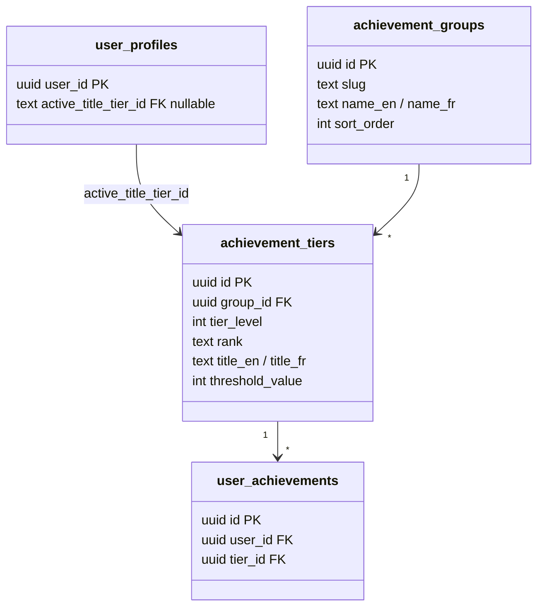
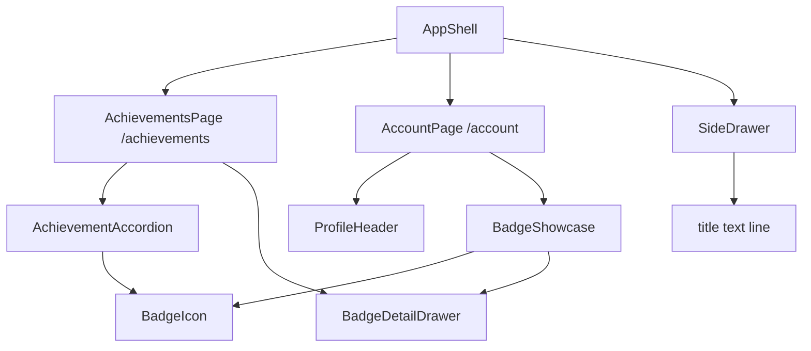

# Tech Plan — Achievements UI Redesign (#174)

## Architectural Approach

### Key Decisions

| Decision | Choice | Rationale |
|---|---|---|
| **Route** | Top-level `/achievements` inside `AppShell` children | First-class section, not buried under `/account`. Matches how `/history` and `/library` are treated. |
| **Page component** | New `AchievementsPage` in `src/pages/AchievementsPage.tsx` | Follows existing convention: one file per route under `pages/`. |
| **Group layout** | shadcn `Accordion` — one `AccordionItem` per `achievement_group` | Scales to 10+ groups without wall-of-badges. Radix-based, accessible, already in the design system. Replaces the flat card grid from `BadgeGrid`. |
| **Accordion default state** | Auto-expand groups with partial progress (>=1 unlocked, not all 5) | Smart default that highlights where effort pays off. Fully-unlocked and untouched groups stay collapsed. |
| **Account page** | Replace `BadgeGrid` with compact `BadgeShowcase` strip (top 3 highest badges + "See all" link) | Keeps achievements visible on the profile without overwhelming the settings form. |
| **SideDrawer — title** | Show equipped title text (rank-colored) under display name | Surfaces the active title everywhere the drawer is visible, not just on `/account`. |
| **SideDrawer — nav item** | Dedicated "Achievements" link with `Trophy` icon | Makes the page discoverable; matches existing nav pattern (History, Library, Quick Workout). |
| **Shared `rankColorText`** | Extract to `src/lib/achievementUtils.ts` | Currently duplicated in `ProfileHeader` and `BadgeGrid`; a third consumer (`SideDrawer`) tips the scale toward extraction. |
| **Data hooks** | Reuse `useBadgeStatus` + `useUserProfile` as-is | React Query dedupes by key (`["badge-status", userId]`); no new RPC, no new atoms. |
| **i18n** | Extend `achievements` namespace (EN + FR) | New keys for page header, showcase CTA, accordion labels. Namespace already registered. |

### Critical Constraints

**No backend changes** — `get_badge_status` already returns everything needed: groups, tiers, progress, unlock state. The accordion just presents the same data differently. `active_title_tier_id` on `user_profiles` is already implemented end-to-end.

**React Query dedup** — Both `AccountPage` (via `BadgeShowcase`) and `AchievementsPage` call `useBadgeStatus`. The query key `["badge-status", userId]` ensures a single fetch. `staleTime` on the hook should be reviewed — if it's `0` (default), opening the drawer won't flash because the data is already cached from any recent page load. If we ever see a loading flash in the drawer, adding `staleTime: 30_000` to `useBadgeStatus` is the fix.

**`BadgeDetailDrawer` stays shared** — Both `AchievementsPage` and `BadgeShowcase` need to open the badge detail drawer (equip/unequip title). The existing component (`file:src/components/achievements/BadgeDetailDrawer.tsx`) is already stateless (receives `badge` + `onClose` props), so it works in both contexts.

**`ProfileHeader` unchanged** — It already shows the equipped title correctly. It stays on `/account` as the profile hero.

---

## Data Model

No new tables, no schema changes. Existing entities involved:

### Table Notes

- **`active_title_tier_id`** validated by trigger `trg_validate_title_ownership` — only tiers the user has actually unlocked can be equipped. No app-side guard needed beyond what already exists in `BadgeDetailDrawer`.
- **`sort_order`** on `achievement_groups` determines accordion display order — no change needed, but future track additions should respect this.

---

## Component Architecture

### Layer Overview

### New Files & Responsibilities

| File | Purpose |
|---|---|
| `file:src/pages/AchievementsPage.tsx` | Route-level page: header with back nav, `AchievementAccordion`, `BadgeDetailDrawer` state. |
| `file:src/components/achievements/AchievementAccordion.tsx` | Accordion wrapper: one `AccordionItem` per group. Collapsed = group name + highest badge + progress bar. Expanded = full tier row. Computes which groups to auto-expand. |
| `file:src/components/achievements/BadgeShowcase.tsx` | Compact horizontal strip of top 3 highest unlocked badges + "See all" `Link` to `/achievements`. Used on `AccountPage`. |
| `file:src/lib/achievementUtils.ts` | Shared `rankColorText` map + helper `resolveActiveTitle(profile, badgeRows)` used by `ProfileHeader`, `SideDrawer`, and showcase. |

### Modified Files

| File | Change |
|---|---|
| `file:src/router/index.tsx` | Add `/achievements` route as `AppShell` child. |
| `file:src/pages/AccountPage.tsx` | Replace `<BadgeGrid />` with `<BadgeShowcase />`. |
| `file:src/components/SideDrawer.tsx` | Add equipped title line under display name; add "Achievements" nav item with `Trophy` icon between History and Library. |
| `file:src/components/account/ProfileHeader.tsx` | Import `rankColorText` from `achievementUtils` instead of local constant. |
| `file:src/components/achievements/BadgeGrid.tsx` | Superseded by `AchievementAccordion`. Keep until new component is confirmed working, then delete. |
| `file:src/locales/en/achievements.json` | New keys: `pageTitle`, `showcaseSeeAll`, `drawerAchievements`. |
| `file:src/locales/fr/achievements.json` | French equivalents. |

### Component Responsibilities

**`AchievementsPage`**
- Page header with `ArrowLeft` back button (consistent with `AccountPage` pattern)
- Renders `AchievementAccordion` with full badge status data from `useBadgeStatus`
- Manages `selected` state for `BadgeDetailDrawer` (same pattern as current `BadgeGrid`)

**`AchievementAccordion`**
- Receives `rows: BadgeStatusRow[]` and `onSelect: (row) => void`
- Groups rows by `group_slug` (same logic currently in `BadgeGrid`)
- Computes `defaultOpenSlugs`: groups where `unlockedCount > 0 && unlockedCount < totalTiers`
- Each `AccordionItem`:
  - **Trigger**: group name + highest unlocked `BadgeIcon` (sm) + rank pill + progress bar to next tier
  - **Content**: full 5-tier row with `BadgeIcon` per tier + progress text on next-to-unlock

**`BadgeShowcase`**
- Calls `useBadgeStatus` internally
- Picks top 3 highest-rank unlocked badges (sorted by `tier_level` desc, then `group_slug` for stability)
- Horizontal row of `BadgeIcon` (sm) buttons — clicking opens `BadgeDetailDrawer`
- `Link` to `/achievements` with "See all" label + count badge (`unlockedCount / totalCount`)
- Loading skeleton: 3 small circles

**`SideDrawer` changes**
- Under the display name `
`, add a line showing the equipped title (resolved via `useBadgeStatus` + `profile.active_title_tier_id`). Rank-colored, italic, small text. Falls back to nothing (no "no title" text in the drawer — keep it clean).
- In the `<nav>` section, add a `Trophy` icon nav item linking to `/achievements`, using the same `navRowClass` pattern. Position: after History, before Library.

### Failure Mode Analysis

| Failure | Behavior |
|---|---|
| `useBadgeStatus` loading in SideDrawer | Title line not shown (no skeleton, no "loading" text — graceful absence). Nav item always visible. |
| No achievements unlocked | Showcase shows empty state text + "See all" link. Accordion page shows all groups collapsed with 0% progress. |
| `active_title_tier_id` points to deleted tier | DB trigger `ON DELETE SET NULL` handles this; `resolveActiveTitle` returns `null`. |
| Network error on badge status | Showcase shows skeleton; page shows React Query error state with retry. |

---

## Testing

### Existing tests to check

| File | Impact | Action |
|---|---|---|
| `file:e2e/onboarding.spec.ts` | May navigate to `/account` and expect achievements there | Verify; showcase strip should satisfy any "achievements visible on profile" assertions. |
| `file:src/components/SideDrawer.test.tsx` | Covers sign-out flows only | Add coverage for new nav item + title line. |

### New tests

| Target | Coverage | Framework |
|---|---|---|
| `AchievementsPage` | Renders accordion groups from mocked `useBadgeStatus`; clicking a tier opens `BadgeDetailDrawer`. | Vitest + Testing Library |
| `AchievementAccordion` | Auto-expands partial-progress groups; collapsed trigger shows correct highest badge. | Vitest |
| `BadgeShowcase` | Shows top 3 badges; "See all" links to `/achievements`. | Vitest |
| `SideDrawer` — title line | Shows equipped title when profile has `active_title_tier_id`; hidden when null. | Vitest |
| `SideDrawer` — nav item | "Achievements" link present with `href="/achievements"`. | Vitest |

---

## Implementation Notes

1. **Order of work**: shared utils extraction → new route + page (accordion) → showcase on account → drawer changes (title + nav) → i18n → tests.
2. **`BadgeGrid` lifecycle**: keep it until `AchievementAccordion` is confirmed working, then delete and clean up imports.
3. **Follow-up (not this ticket)**: filter/sort on achievements page, showcase customization (let user pick which badges to display), new achievement tracks (separate issue scope from #174).

When ready, say **split into tickets** to break this plan into implementation tasks.
