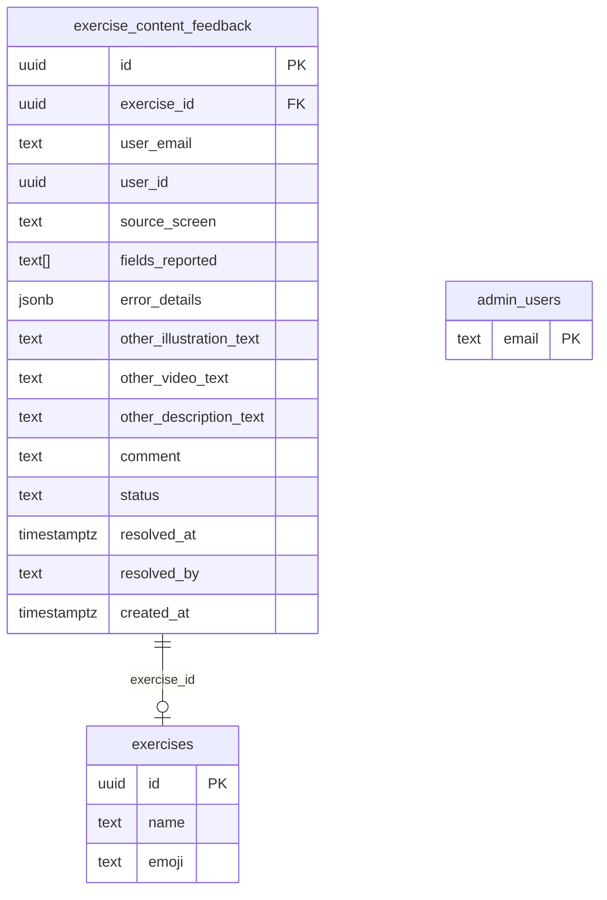
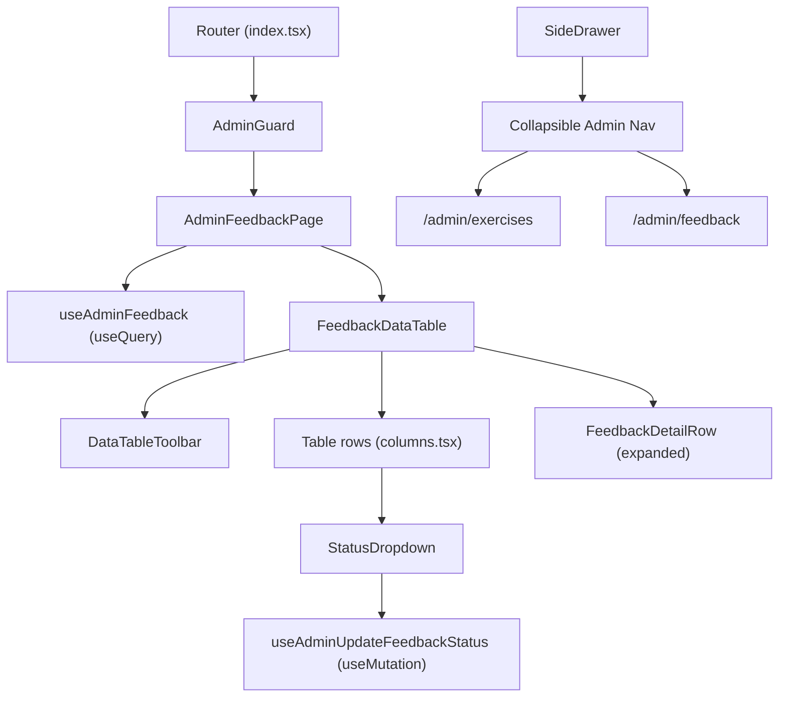

# Tech Plan — Admin Feedback Triage View

## Architectural Approach

### Key Decisions

| Decision | Choice | Rationale |
|---|---|---|
| Table library | TanStack Table v8 (`@tanstack/react-table`) | Row expansion via `getExpandedRowModel()`, consistent with exercises table |
| Data fetching | `useQuery` + Supabase PostgREST join | `.select("*, exercises(name, emoji)")` — single query, FK join gives exercise context |
| Status mutation | `useMutation` with optimistic cache update + rollback | Status toggle is high-frequency; optimistic updates give snappy UX |
| Date formatting | `Intl.RelativeTimeFormat` (native) | Zero-dependency; only need "3h ago" style output. App has no date lib today. |
| Status actions | shadcn DropdownMenu per row | New component (`@radix-ui/react-dropdown-menu`); cleaner than inline buttons |
| Mobile | Horizontal scroll | Same as exercises table; `Table` already wraps in `overflow-auto` |
| Admin nav | Collapsible section, open by default | Radix `Collapsible` primitive already in codebase; only 2 sub-links so open by default is fine |
| Migration | `CREATE TABLE IF NOT EXISTS` + `DROP POLICY IF EXISTS` / `CREATE POLICY` | Fully idempotent; safe for both production (table exists) and fresh local dev |
| Admin email for `resolved_by` | Passed via TanStack Table `meta` object | Avoids calling `useAtomValue(authAtom)` inside column cell renderers |

### Critical Constraints

- **New UI dependency**: No `dropdown-menu.tsx` exists — add via `npx shadcn@latest add dropdown-menu` (installs `@radix-ui/react-dropdown-menu` + creates the component).
- **No `ExerciseContentFeedback` read type**: Only `ExerciseContentFeedbackInsert` exists in `file:src/types/database.ts`. Need a full row type including `id`, `created_at`, `status`, `resolved_at`, `resolved_by`, plus the nested `exercises: { name, emoji } | null` from the PostgREST join.
- **`error_details` keys are machine keys**: Values like `"wrong_exercise"`, `"misleading_angle"` need i18n mapping. The option enums are defined in `file:src/components/feedback/schema.ts` — derive the label map from those constants.
- **Migration depends on prior tables**: FK to `exercises` (migration `20240101000001`) and RLS references `admin_users` (migration `20260313140000`). Both exist. Migration filename must sort after these.

---

## Data Model

### Existing table: `exercise_content_feedback`



### New TypeScript types

Add to `file:src/types/database.ts`:

```typescript
export type FeedbackStatus = "pending" | "in_review" | "resolved"

export interface ExerciseContentFeedback {
  id: string
  exercise_id: string
  user_email: string
  user_id: string
  source_screen: FeedbackSourceScreen
  fields_reported: string[]
  error_details: Record<string, string[]>
  other_illustration_text: string | null
  other_video_text: string | null
  other_description_text: string | null
  comment: string | null
  status: FeedbackStatus
  resolved_at: string | null
  resolved_by: string | null
  created_at: string
  exercises: { name: string; emoji: string } | null
}
```

The `exercises` field is the PostgREST embedded resource from `.select("*, exercises(name, emoji)")`. It's `null` if the referenced exercise was deleted.

### Migration: `supabase/migrations/2026031500000X_exercise_content_feedback.sql`

```sql
-- Table (idempotent — IF NOT EXISTS for fresh local dev, no-op in production)
CREATE TABLE IF NOT EXISTS exercise_content_feedback (
  id uuid PRIMARY KEY DEFAULT gen_random_uuid(),
  exercise_id uuid NOT NULL REFERENCES exercises(id),
  user_email text NOT NULL,
  user_id uuid NOT NULL,
  source_screen text,
  fields_reported text[],
  error_details jsonb,
  other_illustration_text text,
  other_video_text text,
  other_description_text text,
  comment text,
  status text NOT NULL DEFAULT 'pending',
  resolved_at timestamptz,
  resolved_by text,
  created_at timestamptz NOT NULL DEFAULT now()
);

ALTER TABLE exercise_content_feedback ENABLE ROW LEVEL SECURITY;

-- INSERT policy: authenticated users can insert their own feedback
DROP POLICY IF EXISTS "Users can insert own feedback" ON exercise_content_feedback;
CREATE POLICY "Users can insert own feedback"
ON exercise_content_feedback FOR INSERT
WITH CHECK (auth.uid() = user_id);

-- SELECT policy: admins can read all feedback
DROP POLICY IF EXISTS "Admins can read all feedback" ON exercise_content_feedback;
CREATE POLICY "Admins can read all feedback"
ON exercise_content_feedback FOR SELECT
USING (EXISTS (SELECT 1 FROM admin_users WHERE email = auth.jwt() ->> 'email'));

-- UPDATE policy: admins can update feedback status
DROP POLICY IF EXISTS "Admins can update feedback status" ON exercise_content_feedback;
CREATE POLICY "Admins can update feedback status"
ON exercise_content_feedback FOR UPDATE
USING (EXISTS (SELECT 1 FROM admin_users WHERE email = auth.jwt() ->> 'email'))
WITH CHECK (EXISTS (SELECT 1 FROM admin_users WHERE email = auth.jwt() ->> 'email'));
```

---

## Component Architecture

### Layer Overview



### New Files & Responsibilities

| File | Purpose |
|---|---|
| `src/pages/AdminFeedbackPage.tsx` | Page shell: heading + description + DataTable; uses `useAdminFeedback` |
| `src/components/admin/feedback-table/DataTable.tsx` | TanStack Table with sorting, filtering, row expansion |
| `src/components/admin/feedback-table/columns.tsx` | Column definitions: exercise, fields, source, email, comment, status, date, actions |
| `src/components/admin/feedback-table/DataTableToolbar.tsx` | Status segmented filter + exercise name search input |
| `src/components/admin/feedback-table/FeedbackDetailRow.tsx` | Expanded row: parsed error_details, other_*_text, full comment, resolution info |
| `src/components/admin/feedback-table/StatusDropdown.tsx` | DropdownMenu with context-aware status transitions |
| `src/hooks/useAdminFeedback.ts` | `useQuery(["admin-feedback"])` — fetches all feedback with exercise join |
| `src/hooks/useAdminUpdateFeedbackStatus.ts` | `useMutation` — optimistic status update + rollback |
| `src/lib/formatRelativeTime.ts` | Utility wrapping `Intl.RelativeTimeFormat` |
| `src/components/ui/dropdown-menu.tsx` | shadcn/ui DropdownMenu component (add via CLI) |
| `supabase/migrations/..._exercise_content_feedback.sql` | CREATE TABLE IF NOT EXISTS + all RLS policies |

### Existing Files to Modify

| File | Change |
|---|---|
| `file:src/router/index.tsx` | Add `/admin/feedback` route under `AdminGuard` children |
| `file:src/components/SideDrawer.tsx` | Replace flat admin `Button` with `Collapsible` group containing "Exercises" + "Feedback" sub-links |
| `file:src/types/database.ts` | Add `FeedbackStatus`, `ExerciseContentFeedback` types |
| `src/locales/en/admin.json` | Add `feedback.*` keys (title, description, columns, status labels, error detail labels, toast messages) |
| `src/locales/fr/admin.json` | Add `feedback.*` keys (FR translations) |
| `src/locales/en/common.json` | Add `adminExercises`, `adminFeedback` nav labels |
| `src/locales/fr/common.json` | Add `adminExercises`, `adminFeedback` nav labels |

### Component Responsibilities

**`AdminFeedbackPage`**
- Uses `useAdminFeedback()` for data
- Loading spinner while `isLoading` (same pattern as `AdminExercisesPage`)
- Renders `DataTable` with `data ?? []`

**`DataTable`**
- TanStack Table with controlled state: `sorting`, `globalFilter`, `columnFilters`, `expanded`
- Row models: `getCoreRowModel`, `getSortedRowModel`, `getFilteredRowModel`, `getExpandedRowModel` (no pagination — load all)
- `initialState.sorting`: `[{ id: "created_at", desc: true }]` (newest first)
- `getRowCanExpand: () => true` (all rows expandable)
- Table `meta`: `{ adminEmail }` — passed to columns for `resolved_by`
- Expanded rows render `FeedbackDetailRow` in a `<TableCell colSpan={columns.length}>` below the main row

**`columns.tsx` — `getColumns(t)`**

| Column ID | Accessor | Rendering |
|---|---|---|
| `exercise` | `exercise_id` + `exercises` | Emoji + name as `<Link>` to `/admin/exercises/:id`; "Unknown" fallback if `exercises` is null |
| `fields_reported` | `fields_reported` | `<Badge variant="secondary">` per field |
| `source_screen` | `source_screen` | Text with i18n label |
| `user_email` | `user_email` | Truncated text |
| `comment` | `comment` | Truncated to ~60 chars; empty dash if null |
| `status` | `status` | Colored `<Badge>`: pending=yellow/outline, in_review=blue, resolved=green |
| `created_at` | `created_at` | `formatRelativeTime(value, locale)` |
| `actions` | — | Expand toggle button + `StatusDropdown` |

**`DataTableToolbar`**
- Global search input filtering on exercise name (matched against `exercises.name` via custom `globalFilterFn`)
- Status segmented filter: all / pending / in_review / resolved (maps to `columnFilters` on `status` column)
- Summary counts: total, pending count

**`StatusDropdown`**
- Receives `row.original` and `table.options.meta.adminEmail`
- Context-aware menu items based on current status:
  - `pending` → "Mark in review", "Mark resolved"
  - `in_review` → "Mark resolved", "Reopen"
  - `resolved` → "Reopen", "Mark in review"
- Calls mutation from `useAdminUpdateFeedbackStatus`

**`FeedbackDetailRow`**
- Renders `error_details` JSONB as human-readable list: field label (i18n) → error options (i18n), e.g. "Illustration: Shows wrong exercise, Misleading angle"
- Shows `other_illustration_text`, `other_video_text`, `other_description_text` if non-null
- Shows full untruncated `comment`
- Shows `resolved_at` (formatted) and `resolved_by` if status is `resolved`

**`useAdminFeedback`**

```typescript
export function useAdminFeedback() {
  return useQuery({
    queryKey: ["admin-feedback"],
    queryFn: async (): Promise<ExerciseContentFeedback[]> => {
      const { data, error } = await supabase
        .from("exercise_content_feedback")
        .select("*, exercises(name, emoji)")
        .order("created_at", { ascending: false })
      if (error) throw error
      return (data ?? []) as ExerciseContentFeedback[]
    },
  })
}
```

**`useAdminUpdateFeedbackStatus`**

```typescript
interface UpdateStatusParams {
  id: string
  status: FeedbackStatus
  adminEmail: string
}

export function useAdminUpdateFeedbackStatus() {
  const queryClient = useQueryClient()

  return useMutation({
    mutationFn: async ({ id, status, adminEmail }: UpdateStatusParams) => {
      const payload =
        status === "resolved"
          ? { status, resolved_at: new Date().toISOString(), resolved_by: adminEmail }
          : status === "pending"
            ? { status, resolved_at: null, resolved_by: null }
            : { status }

      const { error } = await supabase
        .from("exercise_content_feedback")
        .update(payload)
        .eq("id", id)
      if (error) throw error
    },
    onMutate: async ({ id, status, adminEmail }) => {
      await queryClient.cancelQueries({ queryKey: ["admin-feedback"] })
      const previous = queryClient.getQueryData<ExerciseContentFeedback[]>(["admin-feedback"])

      queryClient.setQueryData<ExerciseContentFeedback[]>(["admin-feedback"], (old) =>
        old?.map((f) =>
          f.id === id
            ? {
                ...f,
                status,
                resolved_at: status === "resolved" ? new Date().toISOString() : status === "pending" ? null : f.resolved_at,
                resolved_by: status === "resolved" ? adminEmail : status === "pending" ? null : f.resolved_by,
              }
            : f,
        ),
      )

      return { previous }
    },
    onError: (_err, _vars, context) => {
      if (context?.previous) {
        queryClient.setQueryData(["admin-feedback"], context.previous)
      }
    },
    onSettled: () => {
      queryClient.invalidateQueries({ queryKey: ["admin-feedback"] })
    },
  })
}
```

**`formatRelativeTime`**

```typescript
const UNITS: [Intl.RelativeTimeFormatUnit, number][] = [
  ["day", 86_400_000],
  ["hour", 3_600_000],
  ["minute", 60_000],
  ["second", 1_000],
]

export function formatRelativeTime(dateString: string, locale: string): string {
  const elapsed = new Date(dateString).getTime() - Date.now()
  const rtf = new Intl.RelativeTimeFormat(locale, { numeric: "auto" })

  for (const [unit, ms] of UNITS) {
    if (Math.abs(elapsed) >= ms || unit === "second") {
      return rtf.format(Math.round(elapsed / ms), unit)
    }
  }
  return rtf.format(0, "second")
}
```

### SideDrawer Modification

Replace in `file:src/components/SideDrawer.tsx`:

```tsx
<!-- Before -->
<AdminOnly>
  <Button variant="ghost" className="justify-start" asChild>
    <Link to="/admin/exercises" onClick={closeDrawer}>
      <Shield className="h-4 w-4" />
      {t("common:admin")}
    </Link>
  </Button>
</AdminOnly>

<!-- After -->
<AdminOnly>
  <Collapsible defaultOpen>
    <CollapsibleTrigger asChild>
      <Button variant="ghost" className="w-full justify-between">
        <span className="flex items-center gap-2">
          <Shield className="h-4 w-4" />
          {t("common:admin")}
        </span>
        <ChevronDown className="h-4 w-4 transition-transform [[data-state=open]>span>&]:rotate-180" />
      </Button>
    </CollapsibleTrigger>
    <CollapsibleContent>
      <div className="ml-6 flex flex-col gap-1">
        <Button variant="ghost" size="sm" className="justify-start" asChild>
          <Link to="/admin/exercises" onClick={closeDrawer}>
            {t("common:adminExercises")}
          </Link>
        </Button>
        <Button variant="ghost" size="sm" className="justify-start" asChild>
          <Link to="/admin/feedback" onClick={closeDrawer}>
            {t("common:adminFeedback")}
          </Link>
        </Button>
      </div>
    </CollapsibleContent>
  </Collapsible>
</AdminOnly>
```

### Router Modification

Add to `AdminGuard` children in `file:src/router/index.tsx`:

```typescript
{
  path: "/admin/feedback",
  element: <AdminFeedbackPage />,
},
```

### Failure Mode Analysis

| Failure | Behavior |
|---|---|
| Exercise deleted (orphan feedback) | `exercises` join returns `null`; column shows "Unknown exercise" with fallback emoji |
| Supabase fetch error | React Query `retry: 1` (default); if persistent, error propagates to error boundary |
| Optimistic update race (rapid status toggles) | `onSettled` always invalidates query — final state is server truth |
| Status update fails (network error) | Optimistic rollback restores previous cache; global mutation error toast fires |
| `error_details` has unexpected shape | Defensive parsing: if value isn't `Record<string, string[]>`, fallback to `JSON.stringify` |
| Non-admin accesses `/admin/feedback` directly | `AdminGuard` redirects to `/`; RLS returns empty even if guard is bypassed |
| `Intl.RelativeTimeFormat` unavailable | Not a risk: supported in all target browsers (iOS 15+, Chrome 71+, Safari 14+, Firefox 65+) |

---

## Implementation Order

1. Migration: CREATE TABLE IF NOT EXISTS + RLS policies
2. Types: `FeedbackStatus`, `ExerciseContentFeedback` in `database.ts`
3. Add shadcn dropdown-menu component (`npx shadcn@latest add dropdown-menu`)
4. `formatRelativeTime` utility
5. `useAdminFeedback` hook
6. `useAdminUpdateFeedbackStatus` hook
7. i18n: extend `admin.json` (EN + FR) and `common.json` (nav labels)
8. `columns.tsx` + `StatusDropdown` + `FeedbackDetailRow`
9. `DataTableToolbar` + `DataTable`
10. `AdminFeedbackPage`
11. Router: add `/admin/feedback` route
12. SideDrawer: collapsible admin nav
13. Manual QA: mobile + desktop, all status transitions, expand/collapse

---

## References

- Epic Brief: `docs/Epic_Brief_—_Admin_Feedback_Triage_View.md`
- Existing admin pattern: `file:src/pages/AdminExercisesPage.tsx`, `file:src/components/admin/exercises-table/`
- Feedback schema: `file:src/components/feedback/schema.ts`
- Collapsible primitive: `file:src/components/ui/collapsible.tsx`
