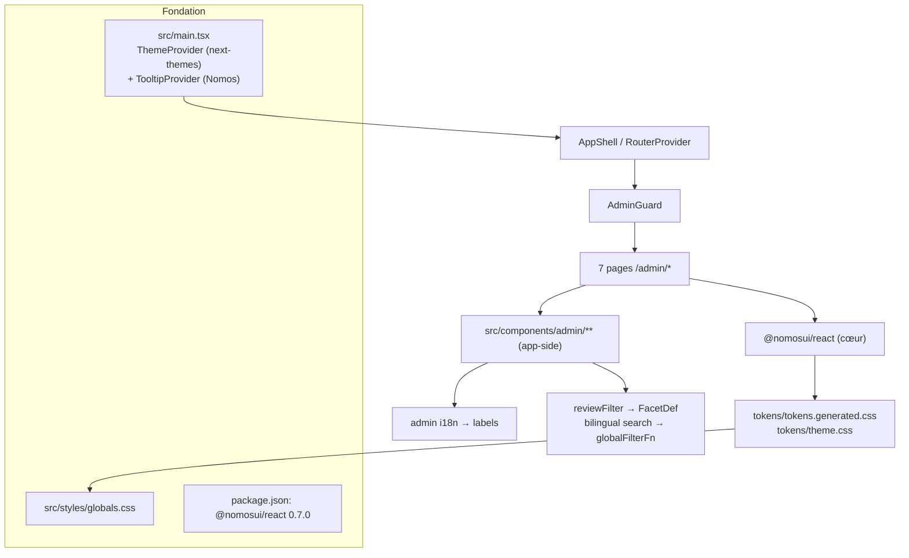
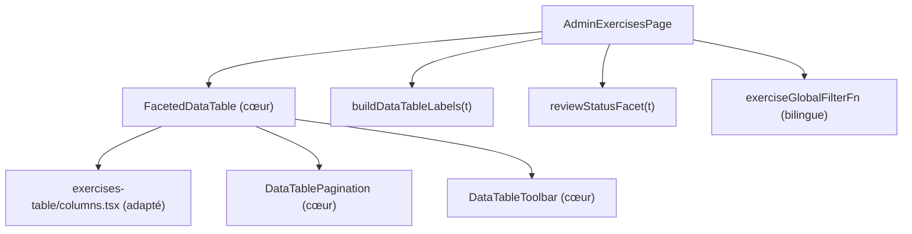

# Tech Plan — Adopter Nomos (design system partagé) : phase 1, surfaces admin [#583]

## Architectural Approach

### Key Decisions

| Decision | Choice | Rationale |
|---|---|---|
| Canal & version | `@nomosui/react@0.7.0`, **pin exact** | Paquet npm public ; 0.x = breaking sur minor (ADR nomos 0024) |
| Skin | **Global, par import direct** des 2 CSS Nomos dans `globals.css` | Les tokens par défaut de Nomos **sont déjà l'identité GL** (palette, teal `#00c9b1`, rayons, modes) — zéro-diff vérifié |
| Providers | Ajouter `TooltipProvider` du cœur à la racine ; thème via `next-themes` existant | Le cœur n'a pas de provider de thème (ADR nomos 0009) ; GL pose déjà `.dark`/`.light` |
| Densité | **Non posée** (défaut `1` = `0.25rem`) | Poser `data-density` changerait tout l'espacement de l'app |
| Table | `FacetedDataTable` **non contrôlée** (`facets` + `globalFilterFn` + `labels`) | Remplace `reviews`/`globalFilterFn`/pagination locaux ; pas de besoin d'URL state |
| Seams métier | `reviewFilter` et recherche bilingue deviennent `FacetDef` + `globalFilterFn` app-side | Nomos est neutre : aucun vocabulaire produit (ADR nomos 0010) |
| Formulaire | RHF+zod conservé, champs enveloppés dans `Field`/`Form` du cœur | Le cœur n'a aucun moteur de validation (ADR nomos 0015) |
| `@theme` GL | **Conservé en l'état** dans le commit fondation | Mêmes valeurs que Nomos → inoffensif ; dédoublonnage déféré à un ticket post-phase-1 |
| Retirement | Supprimer uniquement les **doublons admin** ; `src/components/ui/*` reste | Le vendoré sert toute l'app, pas seulement l'admin — pas retirable en phase 1 |
| Mobile exercises | Corriger le débordement 390px pendant la migration | Relevé @qa ; `FacetedDataTable` est l'occasion |

### Critical Constraints

- **`globals.css` : cohabitation `@theme`.** GL mappe `--color-*` sur `hsl(var(--primary))` (shadcn), Nomos mappe les mêmes noms sur `--nomos-color-*`. Les deux blocs se superposent. Comme les **valeurs sont identiques**, l'ordre n'a pas d'impact visuel ; le bloc GL est **conservé** (filet de sécurité, dédoublonnage déféré). `file:src/styles/globals.css:17-49`.
- **`@source` obligatoire.** `file:node_modules/@nomosui/react/tokens/theme.css` déclare `@source '../dist/index.js'` ; sans l'import de `theme.css`, la surcouche Nomos (popover, shadows, z-index) se rend transparente (ADR nomos 0027).
- **Tokens GL hors-Nomos à préserver** : `--heatmap-0..6` (`file:src/styles/globals.css:170-177,209-215,247-253`) et les usages directs `hsl(var(--background))` / `hsl(var(--muted-foreground)/…)` (`:119,128,265`) restent — ils ne sont pas remplacés par le cœur.
- **Deux systèmes de tooltip transitoires** : GL monte `TooltipProvider` vendoré localement dans `AmrapLabel`, `heatmap-calendar`, `ProfilePage` (`file:src/components/circuit/AmrapLabel.tsx:31`, `file:src/components/history/heatmap-calendar.tsx:338`, `file:src/pages/ProfilePage.tsx:110`). On ajoute le `TooltipProvider` Nomos à la racine ; les providers locaux restent jusqu'à migration de ces surfaces (hors phase 1).
- **Contrats de rendu admin** : `file:src/pages/AdminTranslationsPage.test.tsx` et les tests de composants figent noms accessibles/labels — à préserver ou adapter, jamais casser.
- **`lucide-react`** GL `^1.48` vs Nomos `^1.49` (transitive) → double version possible, non cassant.

---

## Data Model

**Aucun changement de modèle de données** ni de schéma Supabase. La seule « donnée » ajoutée est la configuration de build (dépendance épinglée) et le CSS de tokens.

---

## Component Architecture

### Layer Overview

### Vertical slice `/admin/exercises`

### New Files & Responsibilities

| File | Purpose |
|---|---|
| `src/components/admin/tableLabels.ts` | Mappe le namespace i18n `admin` vers `DataTableLabels` du cœur (une fonction, réutilisée par les 2 tables) |
| `src/components/admin/exercises-table/facets.ts` | `reviewStatusFacet(t)` → `FacetDef` (valeur métier `all`/`notReviewed`/`reviewed`) + `exerciseGlobalFilterFn` bilingue |
| `src/components/admin/feedback-table/facets.ts` | `statusFacet(t)` + filtre status |

### Modified files (majeurs)

| File | Change |
|---|---|
| `package.json` | `+ "@nomosui/react": "0.7.0"` |
| `src/styles/globals.css` | `+` imports tokens/theme en tête |
| `src/main.tsx` | `+ TooltipProvider` du cœur autour de l'arbre |
| `src/pages/AdminExercisesPage.tsx` | Spinner + table locale → `FacetedDataTable` |
| `src/pages/AdminFeedbackPage.tsx` | idem |
| `src/pages/AdminHomePage.tsx` | Buttons → cœur ; bloc Sentry → `Card` |
| `src/pages/AdminExerciseEditPage.tsx`, `AdminReviewPage.tsx` | `Button`/`Badge`, spinner → `Skeleton`/`EmptyState` |
| `src/pages/AdminTranslationsPage.tsx`, `AdminEnrichmentPage.tsx` | `EmptyState`, `ProgressBar`, `Button`/`Badge` |
| `src/components/admin/exercise-form/*` | `Field`/`Form`/`Input`/`Textarea`/`Select` du cœur, RHF conservé |
| `src/components/admin/review/ExerciseReviewToolbar.tsx` | `Button` |
| `src/components/admin/feedback-table/FeedbackDetailRow.tsx`, `StatusDropdown.tsx` | `Sheet`/`Select` du cœur |
| `src/components/admin/exercises-table/columns.tsx`, `features.ts` | Adaptés aux types/TanStack du cœur |
| `src/components/admin/feedback-table/columns.tsx`, `features.ts` | Idem |

### Deleted files

| File | Replaced by |
|---|---|
| `src/components/admin/exercises-table/DataTable.tsx` | `FacetedDataTable` |
| `src/components/admin/exercises-table/DataTableToolbar.tsx` | `DataTableToolbar` (cœur) |
| `src/components/admin/exercises-table/DataTablePagination.tsx` | `DataTablePagination` (cœur) |
| `src/components/admin/feedback-table/DataTable.tsx` | `FacetedDataTable` |
| `src/components/admin/feedback-table/DataTableToolbar.tsx` | `DataTableToolbar` (cœur) |

### Failure Mode Analysis

| Failure | Behavior |
|---|---|
| `theme.css` non importé | Surcouche transparente ; détecté par `npm run build` + passe visuelle |
| `FacetedDataTable` ne couvre pas l'expand de ligne feedback | `RowDetail placement:'inline'` du cœur ; sinon fallback local |
| `columns.tsx` incompatible TanStack v9 (cœur) vs GL v9.2 | Adapter les définitions ; test de contrat de cellule |
| Diff visuel inattendu (rayon/typo) | Bloqué par la passe @qa baseline↔post |
| Double version lucide | Non bloquant ; surveiller la taille du bundle |

---

## i18n contract

**Aucune nouvelle copie produit.** Les libellés existent déjà dans le namespace `admin` et sont **injectés** dans les props `labels` du cœur.

| Cible cœur | Clé i18n existante |
|---|---|
| `labels.search` | `admin:searchPlaceholder` |
| `labels.rows` / `previous` / `next` | `admin:pagination.*` |
| `labels.pageOf` | `admin:pagination.page` |
| facets (all/reviewed/notReviewed) | `admin:allReviewStatus/reviewed/notReviewed`, `admin:feedback.allStatus/pending/inReview/resolved` |
| `labels.empty` | `admin:feedback.noResults` (feedback) |

**À vérifier avant le ticket de la table exercises** : `DataTableLabels` exige des clés que l'admin n'a peut-être pas (`clear`/reset, `shown`, `unit`). Si manquantes → **nouvelles clés `admin.*` à contractualiser via le skill `microcopy`** (EN+FR). Le ticket ne réinvente pas de wording.

---

## Stress-Test List

1. **`@theme` dupliqué** : GL + Nomos définissent les mêmes `--color-*`/`--radius-*`. Valeurs identiques aujourd'hui → invisible. Si Nomos change ses défauts en 0.8.0, le bloc GL résiduel masquerait le changement. *Escape hatch* : le bloc GL conservé sert de filet ; dédoublonnage dans un ticket de nettoyage post-phase-1.
2. **`--spacing` piloté par `--nomos-density`** : défaut 1 → identique. Mais si un composant cœur pose `data-density` localement, l'espacement de son sous-arbre change. Acceptable (scopable par design).
3. **TooltipProvider double** : pas de conflit Radix (deux Providers = deux contextes), mais 2 dépendances tooltip. À réconcilier en phase 2.
4. **`FacetedDataTable` vs `rowExpanding` feedback** : le cœur expose `RowDetail` mais pas `rowExpandingFeature` tel quel. Couplage accepté si `RowDetail placement:'inline'` couvre le besoin ; sinon fallback.
5. **Incohérence avec l'epic** : l'epic dit « supprimer les primitives admin dupliquées » ; ce plan supprime les **tables admin**, pas `src/components/ui/*` (partagé hors admin). Intentionnel.
6. **Pagination feedback** : GL feedback n'a pas de pagination, exercises `pageSize 50` (`Page 1 of 2`). Vérifier qu'on peut désactiver la pagination du cœur pour feedback ou l'activer sans changer le comportement.

---

## References

- Epic Brief : issue GitHub #583 (corps de l'issue, pas de fichier `docs/`).
- Baseline visuelle pré-migration : rapport @qa, 22 screenshots `/tmp/qa-gl583-admin-baseline/`.
- Nomos public : `PierreTsia/nomos` (README, ADRs 0002/0003/0008/0009/0010/0014/0015/0022/0024/0025/0027/0029/0031).
- agent-os : consumer #1 / dogfood (`agent-os/src/main.tsx:9,21`, `agent-os/src/styles/globals.css:10-11`).
- Suite : #591 (phase 2, surface agentique).
