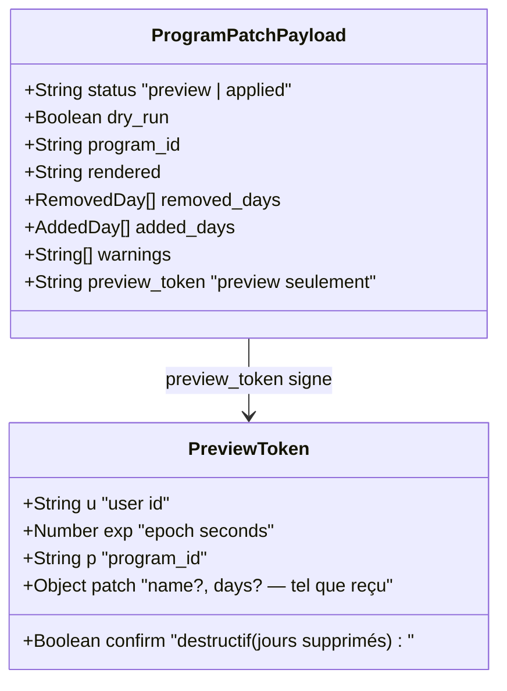
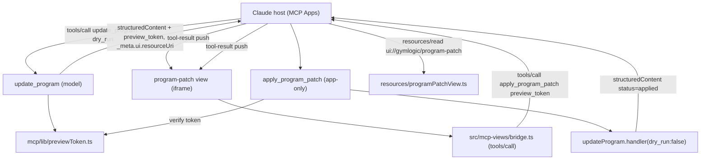

# Tech Plan — Agentic components : de « show » à « act » (#643)

Source : epic [#643](https://github.com/PierreTsia/workout-app/issues/643) (grill 04/10) + revue autopilot ([commentaire de révision](https://github.com/PierreTsia/workout-app/issues/643#issuecomment-5981399156)). Le squelette de référence : [#591](https://github.com/PierreTsia/workout-app/issues/591), ADR `file:docs/adr/0027-agentic-view-contract.md`.

## Architectural Approach

### Key Decisions

| Decision | Choice | Rationale |
|---|---|---|
| Garde de consentement | **Token HMAC signé, sans table** (`preview_token`) | `visibility:["app"]` est host-enforced, pas server-enforced : sans garde serveur, un hôte non conforme expose l'apply au modèle. Le token est la seule barrière côté serveur — et il évite un store (Edge stateless). Miroir de `file:supabase/functions/_shared/unsubscribeToken.ts`. |
| `update_program` | **Garde `dry_run:false`** (pas de propose-only en v1) | Propose-only casserait Cursor / Le Chat / Iris (édition de programme supprimée) sans négociation de capability MCP-Apps. L'enforcement « le modèle ne peut pas appliquer » est hors v1, nommé (#287). |
| Chemin d'apply de la vue | Outil `apply_program_patch`, `_meta.ui.visibility:["app"]` + `preview_token` | Invisible du modèle **et** inutilisable sans token. Défense en profondeur : l'hôte cache l'outil, le serveur exige la preuve. |
| Canal des données de vue | `structuredContent` = `{ status, preview…, preview_token }` | SEP-1865 : `structuredContent` n'est **pas** ajouté au contexte du modèle. Le modèle ne peut pas lire le token. |
| `ui/notifications/tool-input` | **Non utilisé** | Le payload prévisualisé **et** le token voyagent dans `structuredContent` ; la vue n'a pas besoin des arguments du modèle. Divergence assumée d'avec la revue (#8). |
| Pont | `src/mcp-views/bridge.ts` **partagé**, avec `tools/call`, gestion `error`/`isError` et timeout | La Session Card existante est le 1ᵉʳ composite, la carte de patch le 2ᵉ : l'extraction est justifiée maintenant (le follow-up « fabrique » de la revue tombe). |
| Build de vue | `scripts/build-mcp-view.mjs` **paramétré** (liste de vues) | Deux documents à générer, un seul régime `view:check`. |
| Schéma DB | **Aucun** | Le token porte le patch signé ; l'apply re-valide. |
| Consentement | Le **clic = consentement**, matérialisé par un **token signé serveur** | Amende explicitement ADR 0023 / le terme **Write Consent** (deux voies : écho + Noul Jev ; clic de vue + token). CONTEXT.md réécrit. |
| Hôte | External MCP Client (Claude Desktop/mobile) | La PWA/Jev n'est pas hôte MCP Apps ; l'agent embarqué écrit server-side (#552). |

### Revue autopilot — criticals bloquants pris en compte

Les trois findings bloquants de la [revue](https://github.com/PierreTsia/workout-app/issues/643#issuecomment-5981399156) pilotent le plan ; ils ne sont pas des notes de bas de page.

| Critical (revue) | Réponse dans ce plan |
|---|---|
| **1. `visibility:["app"]` est host-enforced, pas server-enforced** — un hôte non conforme expose l'apply au modèle, qui écrit sans clic | **Garde serveur** : le `preview_token` HMAC est exigé par `apply_program_patch` et voyage dans `structuredContent` (hors contexte modèle, SEP-1865). Un hôte non conforme peut exposer l'outil, le modèle n'a **pas** le token → échec. `visibility:["app"]` reste en défense en profondeur. |
| **2. Propose-only casse Cursor / Le Chat / Iris** (édition de programme supprimée) | **Pas de propose-only en v1** : `update_program` garde `dry_run:false` et sa description. L'enforcement « le modèle ne peut pas appliquer » est une piste **#287** nommée, pas une revendication de cet epic. Zéro régression client. |
| **3. « le clic = consentement » contredit Write Consent / ADR 0023** (qui n'admet pas de token) | ADR **amendant explicitement** ADR 0023 + réécriture du terme **Write Consent** : deux voies — (a) écho + Noul **Jev** (chemin modèle classique), (b) **clic de vue + token signé** (chemin carte). Le token n'est pas un « second concept » : c'est la preuve matérielle du clic. Ticket ADR **prérequis**, pas parallèle. |

### Critical Constraints

- **Le token ne doit jamais fuiter au modèle.** Il vit dans `structuredContent` (pas dans `content.text`). Le `content` renvoyé par `update_program` reste le markdown d'aperçu, sans token.
- **Contrat public.** Ajouter `structuredContent`/`_meta`/un outil est additif mais touche la surface MCP (AGENTS.md) : ADR + test d'arch. `update_program` **garde** son `dry_run:false` et sa description « Re-call with `dry_run:false` to apply ».
- **`_meta` trop étroit.** `ToolDefinition._meta = { ui?: { resourceUri: string } }` (`file:supabase/functions/mcp/tools/registry.ts:45`) → élargir à `{ resourceUri?: string; visibility?: Array<"model"|"app"> }`. `apply_program_patch` porte `visibility` **sans** `resourceUri`. `toolRegistry.list()` spread déjà la def (`file:supabase/functions/mcp/tools/registry.ts:78`), donc rien à changer au passage.
- **Réutilisation, pas duplication.** `apply_program_patch` vérifie le token puis **délègue à `updateProgram.handler({ ...patch, dry_run:false, confirm })`** — la validation + le diff + `applyProgramDiff` restent une seule implémentation.
- **Annotation honnête.** `update_program` reste `destructiveHint:true` (il peut toujours écrire via `dry_run:false`). `apply_program_patch` : `destructiveHint:true`, `readOnlyHint:false`, `idempotentHint:true` (même token → même état).
- **Secret.** `previewToken` utilise un secret dédié (`MCP_PREVIEW_SECRET`) avec repli sur `WEBHOOK_SECRET`, repli `null` → le mint échoue proprement. Même helper base64url/HMAC que `file:supabase/functions/_shared/unsubscribeToken.ts`.
- **La vue n'écrit jamais directement.** Elle appelle `tools/call` via l'hôte, qui arbitre. Aucun `fetch` d'écriture, aucun `insert/update/delete` dans `src/mcp-views/`.
- **Artefact committé.** Le HTML de la carte patch est un module TS généré (`resources/views/programPatch.generated.ts`), gardé par `view:check` en CI — même régime que la Session Card.
- **Blast radius doc.** Le chemin classique `dry_run:true → false` reste documenté (il reste vrai). Les docs à ne **pas** casser : `README.md`, `docs/mcp-connect/*.md`, `example-prompts.md`, `skills/gymlogic-mcp/SKILL.md`. La **nouvelle** surface (carte + apply app-only) s'ajoute au SKILL.

---

## Data Model

Aucun changement de schéma. Le seul objet nouveau est un **jeton signé porté par la réponse** (pas persisté).

### Table Notes

- **Pas de table, pas de cache.** Le token = `base64url(JSON(payload)).base64url(HMAC-SHA256(body, secret))` — même format que `file:supabase/functions/_shared/unsubscribeToken.ts`. Vérification : signature, `exp`, `u === user courant`.
- **Le token porte le patch complet** : l'apply n'a besoin d'aucune autre entrée → « ce qui a été montré est ce qui s'applique », garanti par signature. Un patch re-signé avec un contenu différent ne vérifie pas.
- **TTL court** (proposition : 15 min) — assez pour lire et cliquer, trop court pour traîner. `exp` dans le payload signé.
- **Rejeu** : un même token applique un patch **idempotent** (même état). La single-use n'est pas nécessaire ; à ajouter seulement si un audit le demande.
- Les champs `removed_days[].session_count` / `warnings` restent calculés par `updateProgram` au dry_run et affichés par la carte.

---

## Component Architecture

### Layer Overview

### New Files & Responsibilities

| File | Purpose |
|---|---|
| `supabase/functions/mcp/lib/previewToken.ts` | Mint/verify du jeton HMAC (mirror `unsubscribeToken`), payload `{ u, exp, p, patch, confirm }`. |
| `supabase/functions/mcp/tools/applyProgramPatch.ts` | Outil `apply_program_patch` : vérifie le token, délègue à `updateProgram.handler(..., dry_run:false)`, renvoie `structuredContent status=applied`. `_meta.ui.visibility:["app"]`. |
| `supabase/functions/mcp/resources/programPatchView.ts` | `ResourceDefinition` `ui://gymlogic/program-patch`, `text/html;profile=mcp-app`, renvoie l'artefact. |
| `supabase/functions/mcp/resources/views/programPatch.generated.ts` | Artefact HTML auto-suffisant, committé, généré. |
| `src/mcp-views/bridge.ts` | Pont **partagé** (extrait de session-card) : `ui/initialize`, `tool-result`, `size-changed`, **`tools/call`** (requête/réponse), gestion `error` JSON-RPC et `isError`, timeout. |
| `src/mcp-views/program-patch/entry.tsx` | Entrée de vue : reçoit `structuredContent`, monte `ProgramPatchCard`, émet le `tools/call` au clic. |
| `src/mcp-views/program-patch/ProgramPatchCard.tsx` | Composite : états **preview** (aperçu + Valider) / **applying** / **applied** / **erreur**. |
| `src/mcp-views/program-patch/render.tsx` · `labels.ts` · `types.ts` | SSR repli, libellés EN/FR, types du payload. |
| `src/test/mcpProgramPatch.arch.test.ts` | Contrat : ressource `mime`, `_meta` (resourceUri + visibility), artefact non périmé, **aucun chemin d'écriture** dans `src/mcp-views/`. |

### Modified Files

| File | Change |
|---|---|
| `supabase/functions/mcp/tools/updateProgram.ts` | Le dry_run renvoie `structuredContent` (payload + `preview_token`) et `_meta.ui.resourceUri` ; l'apply renvoie aussi `structuredContent status=applied`. `dry_run:false` conservé. |
| `supabase/functions/mcp/tools/registry.ts` | Élargir `_meta` (`resourceUri?`, `visibility?`) ; enregistrer `applyProgramPatch`. |
| `supabase/functions/mcp/resources/registry.ts` | Enregistrer `programPatchView`. |
| `src/mcp-views/session-card/*` | Importer le pont partagé ; rien d'autre. |
| `scripts/build-mcp-view.mjs` | Boucler sur `[session-card, program-patch]` ; `--check` par artefact. |
| `docs/CONTEXT.md` | **MCP App View** : retirer « never writes » → « emits intentions, never writes *directly* ». Ajouter **carte de décision** / outil app-only. Amendement ADS. |
| `docs/adr/0027-agentic-view-contract.md` + nouvel ADR | Amendement §3 ; nouvel ADR « intention de vue + consentement par token » amendant ADR 0023 / **Write Consent**. |
| `skills/gymlogic-mcp/SKILL.md` | Documenter `render_session_card`→`update_program` carte + `apply_program_patch`. |

### Component Responsibilities

**`previewToken.ts`**
- `mintPreviewToken(payload, secret)` / `verifyPreviewToken(token, secret)` — HMAC-SHA256, base64url, `exp`, `u`. Copie fidèle du pattern `unsubscribeToken`. Testable Deno + Vitest.

**`apply_program_patch`**
- `{ preview_token }` requis. Vérifie la signature + `exp` + `u === user` ; sur échec : `isError:true`, aucun write.
- Délègue à `updateProgram.handler({ ...token.patch, dry_run:false, confirm: token.confirm }, supabase)`.
- Renvoie le résultat + `structuredContent { status:"applied", … }`.

**`update_program` (dry_run)**
- Mint le token sur `{ u: userId, exp: now+TTL, p: program_id, patch: args−dry_run, confirm: bool }`.
- Renvoie `structuredContent = { status:"preview", dry_run:true, program_id, rendered, removed_days, added_days, warnings, preview_token }`.
- `_meta.ui.resourceUri = "ui://gymlogic/program-patch"`.

**`ProgramPatchCard`**
- Rend `rendered` (mono), `removed_days`/`added_days`, warnings ; bouton **Valider** (désactivé en applying).
- Au clic : `bridge.callTool("apply_program_patch", { preview_token })` ; bascule applying → applied / erreur.
- N'écrit jamais ; pas de `fetch`.

**`bridge.ts`**
- Ajoute `request(method, params, timeoutMs)` avec rejet sur `error`, et `callTool(name, args)`.
- Réutilisé par la Session Card (read-only : n'appelle jamais `callTool`).

### Failure Mode Analysis

| Failure | Behavior |
|---|---|
| Token absent/invalide/expiré | `apply_program_patch` → `isError:true`, aucun write ; la carte affiche l'état **erreur** (repli in-app). |
| Hôte non-MCP-Apps (Cursor, Le Chat) | Pas de vue ; le modèle garde `update_program{dry_run:false}` — zéro régression. |
| Hôte non conforme expose l'apply au modèle | Le modèle n'a **pas** le token (dans `structuredContent`) → l'apply échoue. |
| Program édité entre preview et clic | Le token porte le patch signé → c'est **ce patch** qui s'applique (re-validé). |
| Validation échoue à l'apply | `updateProgram` renvoie `isError:true` ; la carte affiche l'erreur. |
| `tools/call` erreur transport / JSON-RPC | Le pont rejette (avec timeout) ; état erreur, pas de blocage en « applying ». |
| Aucun token (résultat `dry_run:false` modèle) | `structuredContent status=applied` → la carte affiche **Applied**, sans bouton. |
| Secret absent | Mint échoue → pas de carte appliquable ; `update_program{dry_run:false}` reste le chemin. |
| Artefact/vue périmé | `view:check` échoue en CI. |

---

## i18n contract

**Namespace :** `mcpView` — nouvelle surface. La Session Card réutilise des clés app ; la carte de patch a besoin de libellés propres (copie à valider via `microcopy`, pass HITL dans l'epic).

| Key | EN | FR | Why this wording |
|---|---|---|---|
| `mcpView:patch.title` | Program change | Modification du programme | Décrit l'objet, pas le mécanisme |
| `mcpView:patch.apply` | Apply | Appliquer | Verbe direct, sans « Valider » administratif |
| `mcpView:patch.applying` | Applying… | Application… | État en cours |
| `mcpView:patch.applied` | Applied | Appliqué | Confirmation |
| `mcpView:patch.error` | Couldn't apply. Try again, or edit in the app. | Impossible d'appliquer. Réessaie, ou modifie dans l'app. | Issue + porte de sortie |
| `mcpView:patch.removedDays_one` / `_other` | Removes {{n}} day / {{n}} days | Supprime {{n}} jour / {{n}} jours | Conséquence destructive nommée |
| `mcpView:patch.addedDays_one` / `_other` | Adds {{n}} day / {{n}} days | Ajoute {{n}} jour / {{n}} jours | Idem |

Le markdown `rendered` est produit serveur et rendu verbatim (pas de clé). Parité EN/FR tenue par `file:src/locales/locales.test.ts`.
