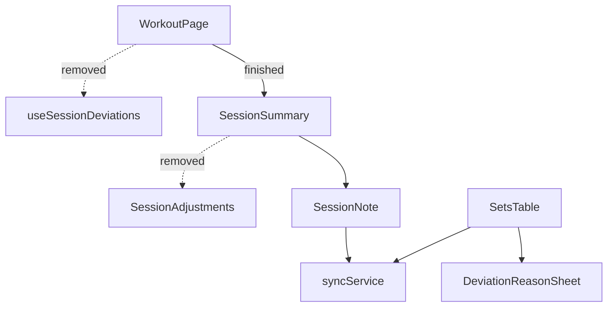

# Tech Plan — Alléger le récap de fin de séance (#665)

## Architectural Approach

### Key Decisions

| Decision | Choice | Rationale |
|---|---|---|
| Fate of the deviations section | Remove it entirely, no replacement | The recap is a bilan; the detail has no post-session action. Grilled decision. |
| Fate of `SessionNote` | Keep as-is | The only useful post-session action; already persisted via `enqueueSessionNote`. |
| Fate of capture/persistence | Untouched | `SetsTable`, `DeviationReasonSheet`, `syncService`, `session_deviation_events` serve the observatory. |
| Fate of `useSessionDeviations` | Delete (only `WorkoutPage` imports it) | Dead once the recap stops reading deviations. |
| Fate of `deviationCapture.ts` | Untouched (read-only) | Capture helpers stay for the in-session path; removing exports is out of scope. |
| ADR | None | Reversible UI change; no hard-to-reverse or surprising decision. |

### Critical Constraints

- **Do not touch the in-session reason prompt.** `file:src/components/workout/SetsTable.tsx`
  and `file:src/components/workout/DeviationReasonSheet.tsx` keep their behaviour and
  their `deviation.*` i18n keys (`setInfo`, `setInfoReps`, `reason.*`, `reason.none`,
  `reasonGroupLabel`).
- **Do not touch the persistence path.** `file:src/lib/syncService.ts`
  (`enqueueSessionNote`, `processSessionNote`, `queuedDeviationsForSession`) and the
  `session_deviation_events` table stay.
- **`file:src/lib/deviationCapture.ts` is read-only.** `buildAdjustment` /
  `mergeSessionDeviations` become unused by the app but stay; the observatory and the
  capture path are not in scope.
- **`SessionNote` must stay rendered and persisted.** `WorkoutPage` keeps passing
  `onSaveNote`.

---

## Data Model

No schema change. `sessions.session_note` and `session_deviation_events` are untouched.

---

## Component Architecture

### Layer Overview

### New Files & Responsibilities

| File | Purpose |
|---|---|
| — | None. This is a deletion. |

### Component Responsibilities

**SessionSummary** (after)
- Renders the trophy, stats grid, PR block, badges, `SessionNote` (when `onSaveNote`),
  quick-workout prompt, and the new-session button.
- No longer accepts `adjustments`; no longer imports `SessionAdjustments`.

**WorkoutPage** (after)
- No longer reads `session_deviation_events` for the recap; no `adjustments` memo.
- Still passes `onSaveNote` → `enqueueSessionNote` + `scheduleImmediateDrain`.

### Failure Mode Analysis

| Failure | Behavior |
|---|---|
| A caller still passes `adjustments` | Compile error — the prop is gone (intended). |
| `useSessionDeviations` imported elsewhere | Grep first; only `WorkoutPage` imports it, so deletion is safe. |
| Session note lost | Unchanged path; `syncService` tests still cover it. |

---

## i18n contract

No new strings. Two keys become dead and are removed from both locales:
`deviation.debriefTitle` and `deviation.debriefEmpty`. All other `deviation.*` keys stay
(in-session sheet).

| Key | Action |
|---|---|
| `deviation.debriefTitle` | Removed (EN + FR) |
| `deviation.debriefEmpty` | Removed (EN + FR) |
| `deviation.sessionNoteTitle` / `sessionNotePlaceholder` | Kept |
| `deviation.setInfo` / `setInfoReps` / `reason.*` / `reason.none` / `reasonGroupLabel` | Kept |
