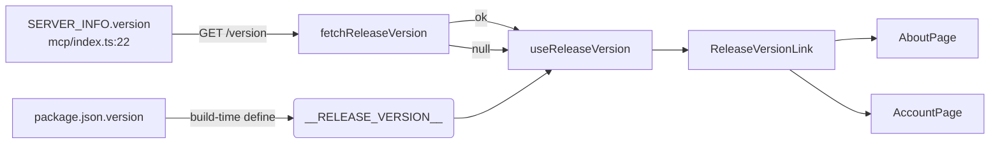
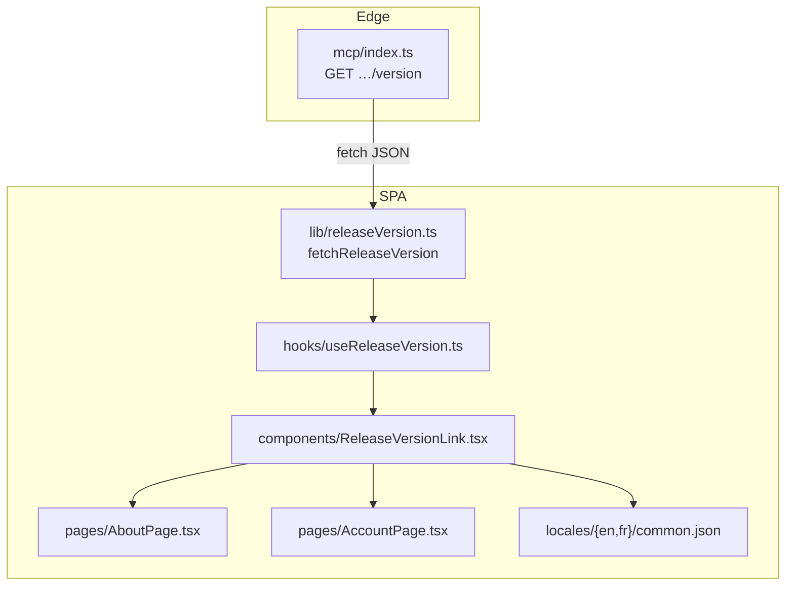

# Tech Plan — App Release Version

## Architectural Approach

### Key Decisions

| Decision | Choice | Rationale |
|---|---|---|
| Source of the displayed number | `SERVER_INFO.version`, read at **runtime** from the deployed MCP Edge Function | Déjà la source unique (ADR 0025 §1), déjà bumpée et redéployée à chaque release → jamais périmée, y compris sur une release backend-only |
| Route d'exposition | `GET …/functions/v1/mcp/version` sur la fonction MCP existante | `SERVER_INFO` y vit ; `verify_jwt=false` + CORS ouvert déjà en place ; **additive**, aucun outil MCP touché (contrat public intact) |
| Fallback | `__RELEASE_VERSION__` = `package.json.version`, injecté au build (`vite.config.ts`) | Hors-ligne / premier rendu : un nombre, jamais un vide ni un spinner qui pend |
| Pourquoi pas un numéro baké seul | Rejeté | Le déploiement SPA est path-gated et exclut `package.json` (ADR 0025 §7) : une release backend-only laisserait le numéro affiché périmé |
| Pourquoi pas l'API GitHub `releases/latest` | Rejeté | Dépendance externe, rate-limit par IP, et peut être en avance sur la prod déployée ; notre backend répond « ce qui tourne » |
| Cache | `@tanstack/react-query` (`queryKey: ["release-version"]`) | Déjà partout dans le codebase ; `retry: 0` + `staleTime` long |
| UI | Un composant partagé `ReleaseVersionLink`, monté sur About + Account | Pas de duplication de markup ni de copie ; un seul point de test |
| `__APP_VERSION__` | Inchangé | Reste le cache-busting localStorage (`file:src/lib/versionManager.ts`), ne devient pas la version affichée |

### Critical Constraints

- **Contrat MCP intact.** La route `/version` est un chemin HTTP additif ; aucun `ToolDefinition`, aucun paramètre, aucune forme de réponse d'outil ne change. La fonction reste `verify_jwt = false` (`file:supabase/config.toml:299`) et le CORS est déjà ouvert (`file:supabase/functions/mcp/index.ts:7`).
- **Sous-chemin routé.** Le handler `GET` s'appuie déjà sur le sous-chemin de `req.url` pour les routes `.well-known/*` (`file:supabase/functions/mcp/index.ts:95`), donc `…/mcp/version` est routé de la même façon.
- **Pas de deploy SPA.** `package.json` reste hors des triggers SPA (`file:.github/workflows/release-deploy.yml:65`). Aucune modification de l'ADR §7.
- **Tests sans `define`.** `vitest.config.ts` n'applique pas le `define` de `vite.config.ts` : `__RELEASE_VERSION__` est indéfini en test. Le code lit donc la globale avec un garde `typeof` (même patron que `__APP_VERSION__` dans `file:src/lib/errorReport.ts:54`).
- **Fail-soft.** Toute erreur réseau / non-2xx / JSON invalide → `null` → fallback. Aucun toast, aucun throw, aucun écran vide (stories 4, 9).
- **Aucune donnée utilisateur.** La route renvoie une constante serveur ; aucun cookie, aucune ligne RLS, aucun service role.

---

## Data Model

Aucune schéma, aucune migration. Le « modèle » est un flux de lecture.

### Notes

- `SERVER_INFO.version` est réécrit par release-please (`extra-files`, `file:release-please-config.json`) : il change à **chaque** release, donc la fonction MCP figure toujours dans le diff `supabase/functions/**` et est redéployée. La route reflète donc toujours le tag courant en prod.
- `__RELEASE_VERSION__` est une **constante de build** : elle ne change qu'au build. Elle est le fallback, pas la source.

---

## Component Architecture

### Layer Overview

### New Files & Responsibilities

| File | Purpose |
|---|---|
| `file:src/lib/releaseVersion.ts` | `fetchReleaseVersion()` (réseau, fail-soft), `BUILD_RELEASE_VERSION` (fallback), `GITHUB_RELEASES_URL` |
| `file:src/lib/releaseVersion.test.ts` | Tests unitaires du fetch (ok / non-2xx / throw / URL absente) |
| `file:src/hooks/useReleaseVersion.ts` | Query react-query + fallback build |
| `file:src/components/ReleaseVersionLink.tsx` | Ligne « Version X · Notes de version » partagée |
| `file:src/components/ReleaseVersionLink.test.tsx` | Version affichée + lien (href/target/rel) |

### Component Responsibilities

`fetchReleaseVersion()`
- Lit `${VITE_SUPABASE_URL}/functions/v1/mcp/version`.
- Renvoie `data.version` si string non vide, sinon `null`. N'émet jamais d'exception.

`useReleaseVersion()`
- `useQuery({ queryKey: ["release-version"], queryFn: fetchReleaseVersion, retry: 0, staleTime: 1h, gcTime: Infinity, refetchOnWindowFocus: false })`.
- Renvoie `data ?? BUILD_RELEASE_VERSION`.

`ReleaseVersionLink`
- Rend un `
` : `t("common:releaseVersion", { version })` puis un `<a href={GITHUB_RELEASES_URL} target="_blank" rel="noopener noreferrer">` avec `t("common:releaseNotes")` + icône `ExternalLink`.
- Accepte une `className` pour l'intégration visuelle sur chaque page.

### Failure Mode Analysis

| Failure | Behavior |
|---|---|
| Endpoint injoignable (offline, 5xx, DNS) | `fetchReleaseVersion` → `null` → `BUILD_RELEASE_VERSION` affiché |
| `VITE_SUPABASE_URL` absente (build de test) | `null` → fallback |
| `version` non-string / vide dans la réponse | `null` → fallback |
| `package.json` absent / illisible au build | `__RELEASE_VERSION__` non injecté → le garde `typeof` renvoie `"unknown"` |
| Route appelée avec une méthode non-GET | 405 existant conservé (§ `GET` inchangé pour les autres chemins) |

---

## i18n contract

**Namespace:** `common`

| Key | EN | FR | Why this wording |
|---|---|---|---|
| `releaseVersion` | `Version {{version}}` | `Version {{version}}` | Factuel, identique dans les deux langues (mot transparent) |
| `releaseNotes` | `Release notes` | `Notes de version` | Nomme la destination (les notes de release), pas « changelog » ni « nouveautés » |

Le nombre est rendu tel que renvoyé par le serveur (`1.0.0`, sans `v`) ; le préfixe `v` du tag reste une affaire de git.
