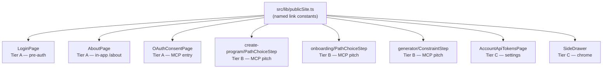

# Tech Plan — App-to-Site Backlinks #316

## Architectural Approach

### Key Decisions

| Decision | Choice | Rationale |
|---|---|---|
| URL constant module | `file:src/lib/publicSite.ts` exporting a `publicSite = { home, about, connectClaude }` const-as-typed object. Host string is module-private. | Removes the temptation to handcraft paths at callsites; single rename when `/connect/claude` becomes `/connect/<agent>`; typed access via dot-notation keeps imports trivial. |
| New shared component? | **No.** Each bridge is 1-3 lines of inline JSX in the host surface. | A `<PublicSiteHint>` wrapper would force a uniform style across surfaces with deliberately different visual treatments (button on `/about`, drawer row in chrome, footer text in step components, anchor in the OAuth consent card, anchor in the login footer). Five distinct treatments — over-DRY. |
| i18n strategy | Per-surface keys in each surface's existing namespace; one shared `common:docs` for the SideDrawer chrome row. Surface-meaningful names (e.g. `whatIsGymLogic`, `agentBuildHint`), no `bridge*` prefix. | Translation context is preserved next to neighboring strings; matches the existing convention; key names read naturally inside their namespace without redundant grouping prefixes. |
| External-link affordance | Split by visual role: `→` Unicode arrow inline in i18n strings for tertiary text bridges; lucide `ExternalLink` icon trailing for the button CTA on `/about` (A2); leading lucide `Globe` icon for the drawer row (C2); `↗` Unicode arrow for the OAuth consent bridge (A3 only). | Tertiary "discreet" bridges must stay weightless; button CTAs need the explicit "leaves app" affordance to match the existing GitHub button precedent on `/about`; the consent page leans further outbound (`↗`) because security context calls for unambiguous "this leaves" framing. |
| Tier B copy | Mixed by surface: B1 concise ("Or let your agent build it →"), B2 explanatory ("Use Claude or another AI agent to build your program →"), B3 power-user concise ("Want a custom session? Ask your agent →"). All three link to `publicSite.connectClaude`. | B2 hits a first-time user who may not recognise "agent" as a term; B1 and B3 reach users who already know the product. Naming "Claude, Cursor, ChatGPT" was rejected — it oversells coverage when only `/connect/claude` exists. |
| A1 (login) copy | Full version: "New here? See what GymLogic is →" — same-tab nav, before About in the footer row. | Strongest hook for an unauthenticated newbie; same-tab is correct because the user has no app-side investment yet. |
| A3 (OAuth consent) copy | "Learn about GymLogic ↗" — declarative outbound framing, never a question. | Security-sensitive surface; question-shaped copy ("What is GymLogic?") could read as uncertainty and degrade consent trust. |
| Audit pass scope | Light-touch, leave-by-default, document per-surface rationale in the PR description. No headline rewrites. | The 8 bridges are the deliverable; a `/login` brand-pitch refresh deserves its own ticket, not a rider on a links PR. |
| C2 SideDrawer entry | Position right after the `About` row; lucide `Globe` icon; label `common:docs` → "Docs" / "Docs"; `target="_blank"` + `closeDrawer()` on click. | Pairs in-app About with the longer external version (logical adjacency); `Globe` is honest about "external site" without overcommitting to docs-only content; `closeDrawer()` matches the existing About/Privacy row pattern. |
| PR shape | Single PR, 7 logical commits in dependency order: `publicSite.ts` foundation → C2 (smallest validation) → A1+A3 → C1 → A2 → B1+B2+B3 → audit doc. | Splitting forces sequential dependent PRs without reducing review burden; commits keep the diff readable per surface. |
| Out of scope (deferred) | 404 / `RouteErrorFallback` bridge, WorkoutPage `noProgram` empty-state CTA, in-app `/login` brand-pitch refresh, `VITE_PUBLIC_SITE_URL` env var, replacing in-app About/Privacy with redirects (PWA-offline). | Per the issue. The pre-auth pitch refresh becomes its own follow-up ticket. |

### Critical Constraints

**Cross-domain link integrity.** The 3 Tier B bridges all point at `publicSite.connectClaude` = `https://docs.gymlogic.me/connect/claude`. The Astro `web/` codebase owns that URL. If the Astro slug changes (most likely scenario: `/connect/claude` becomes a sub-page under a generic `/connect` index), this PR's bridges silently 404. **No CI cross-checks this**. Mitigation lives in the constant: a single `publicSite.connectClaude` rename touches all 3 callsites at once. Capture as a TODO in the PR description: *"When `/connect/<other>` pages land, rename `connectClaude` → `connect` (point at index) or add new keys."*

**Service-worker cache vs. external links.** The SPA at `gymlogic.me` runs a service worker. External anchors (`<a href="https://docs.gymlogic.me/...">`) are NOT intercepted by the SW — they go to the network normally. No SW manifest change needed. Confirmed by inspection of `file:src/lib/swReloadOnUpdate.ts` (the SW is a Workbox build, no custom fetch handler that would interfere with cross-origin navigation).

**OAuth consent page (A3) trust framing.** `file:src/pages/OAuthConsentPage.tsx` is a security-critical surface: an MCP client has just dragged the user into an authorization flow. Adding ANY link to that page introduces tiny erosion risk — if the link looks even slightly phishy (raw URL, suspicious wording), it could degrade trust. Mitigation: A3 renders **only** in the consent state (not loading/error/done branches), uses the trust-positive verb "Learn about", uses the `↗` outbound arrow to make "leaving the app" unambiguous, and never replaces the existing copy.

**i18n key collisions.** `file:src/locales/en/common.json` already has `installApp`, `signOut`, `about`, `privacy`. The new `common:docs` and `common:learnAboutGymLogic` keys plug in next to those — low collision risk. The 7 feature-namespace additions all use new key names — no overwrites.

**Visual budget on `/about`.** The A2 hero CTA we add is the FIRST break in the airy hero whitespace below `heroTagline`. Risk of clutter is real. Mitigation: ship with `mt-4` separation, smoke-test in browser before merging; if it visually shouts, fall back to placing the CTA inside the Story section as an inline reference.

**Drawer row count creep.** `file:src/components/SideDrawer.tsx` chrome footer is currently **About / Privacy / Install (conditional) / Sign Out**. C2 adds a 5th row (or 4th when Install is hidden). Still well within mobile drawer budget — but every future addition must respect this ceiling.

---

## Data Model

This PR doesn't touch the database, edge functions, or persistent state. The closest-to-a-data-model artifacts are the new TypeScript constant and the i18n key inventory.

### `publicSite` shape

```typescript
// src/lib/publicSite.ts
const PUBLIC_SITE_URL = "https://docs.gymlogic.me"

export const publicSite = {
  home: PUBLIC_SITE_URL,
  about: `${PUBLIC_SITE_URL}/about`,
  connectClaude: `${PUBLIC_SITE_URL}/connect/claude`,
} as const

export type PublicSiteLink = (typeof publicSite)[keyof typeof publicSite]
```

`as const` produces literal-string types so any future generic that needs to constrain to known public-site URLs has a real type to lean on. The host string is intentionally **not** exported — every callsite must reference an entry, not concatenate a path.

### i18n key inventory

| Key | Namespace | Surface | Copy (EN) |
|---|---|---|---|
| `auth:whatIsGymLogic` | `auth` | A1 | `New here? See what GymLogic is →` |
| `about:readHowIWork` | `about` | A2 | `Read the full How I work` |
| `common:learnAboutGymLogic` | `common` | A3 | `Learn about GymLogic ↗` |
| `create-program:agentBuildHint` | `create-program` | B1 | `Or let your agent build it →` |
| `onboarding:agentBuildHint` | `onboarding` | B2 | `Use Claude or another AI agent to build your program →` |
| `generator:agentSessionHint` | `generator` | B3 | `Want a custom session? Ask your agent →` |
| `api-tokens:connectClaudeHint` | `api-tokens` | C1 (header + empty-state, same key reused twice) | `How to plug Claude / Cursor →` |
| `common:docs` | `common` | C2 | `Docs` |

**FR translations are crafted fresh** (not literal calques of EN) — Tier B hints especially must read naturally in French. Drafts to refine during implementation:

| Key | FR draft |
|---|---|
| `auth:whatIsGymLogic` | `Découvre GymLogic en 1 minute →` |
| `about:readHowIWork` | `Lire la version longue : « How I work »` |
| `common:learnAboutGymLogic` | `Découvrir GymLogic ↗` |
| `create-program:agentBuildHint` | `Ou laisse ton agent le construire →` |
| `onboarding:agentBuildHint` | `Utilise Claude ou un autre agent IA pour créer ton programme →` |
| `generator:agentSessionHint` | `Une séance sur mesure ? Demande à ton agent →` |
| `api-tokens:connectClaudeHint` | `Comment brancher Claude / Cursor →` |
| `common:docs` | `Docs` |

---

## Component Architecture

### Layer Overview



### New Files & Responsibilities

| File | Purpose |
|---|---|
| `src/lib/publicSite.ts` | Single source of truth for outbound `docs.gymlogic.me` URLs. Exports the `publicSite` named-entries object and a `PublicSiteLink` type. ~10 lines, no external deps. |

No other new files. All other changes are additive edits to existing surfaces and i18n bundles.

### Component Responsibilities

**`publicSite.ts`**
- Defines `publicSite` with 3 named entries (`home`, `about`, `connectClaude`).
- Keeps the host string (`PUBLIC_SITE_URL`) module-private to enforce "no path concatenation" at callsites.
- Exports a `PublicSiteLink` type for callers that need to constrain to known entries.

**A1 — `file:src/pages/LoginPage.tsx`**
- Adds a 3rd anchor to the existing flex-wrap footer (lines 105-121), **before** the About link.
- Uses standard `<a>` (not React Router `<Link>`) since the target is external.
- Same-tab navigation (the user has no app-side investment yet); no `target="_blank"`.
- Copy: `t("auth:whatIsGymLogic")` — full version with arrow inline.
- Inserts a matching `·` separator on `sm:` breakpoint to preserve the existing visual rhythm.

**A2 — `file:src/pages/AboutPage.tsx`**
- New `<Button variant="outline" size="sm" asChild>` placed directly after `heroTagline` (line 60), inside the `<header>` block.
- Wraps an `<a>` with `target="_blank" rel="noopener noreferrer"` pointing at `publicSite.about`.
- Mirrors the existing GitHub button pattern (lines 100-110): outline button, lucide `ExternalLink` trailing icon (`h-3 w-3`).
- Visual budget guardrail: ship with `mt-4`, evaluate in browser; fallback option is moving the CTA into the Story section as an inline reference (documented as a known iteration point).

**A3 — `file:src/pages/OAuthConsentPage.tsx`**
- Renders a small anchor below the Approve/Deny button block (after line 237), **only** in the consent state (not loading/error/done).
- Styling: `text-xs text-zinc-500 hover:text-zinc-300 underline-offset-4 hover:underline`, centered, `mt-4` from the buttons.
- Uses the `↗` Unicode arrow (one-character divergence from the → convention; deliberate for the security-sensitive surface).
- Copy: `t("common:learnAboutGymLogic")` — declarative outbound framing.
- `target="_blank" rel="noopener noreferrer"` pointing at `publicSite.home`.

**B1 — `file:src/components/create-program/PathChoiceStep.tsx`**
- Adds a single muted `<p>` with anchor below the 3 button rows (after line 51).
- Styling: `text-xs text-muted-foreground pt-2 text-center`.
- Copy: `t("create-program:agentBuildHint")` — inline `→` arrow.
- Anchor target: `publicSite.connectClaude`, new tab.

**B2 — `file:src/components/onboarding/PathChoiceStep.tsx`**
- Same visual pattern as B1 (centered muted line, `pt-2`), placed after the `<div className="grid w-full max-w-sm gap-4">` block (after line 75).
- Copy: `t("onboarding:agentBuildHint")` — explanatory variant naming Claude.
- Same anchor target as B1.

**B3 — `file:src/components/generator/ConstraintStep.tsx`**
- Adds a muted line below the action button row (after line 204).
- Same `text-xs text-muted-foreground pt-2 text-center` treatment.
- Copy: `t("generator:agentSessionHint")` — power-user concise.
- Same anchor target.

**C1 — `file:src/pages/AccountApiTokensPage.tsx`**
- Two placements, both reading the **same i18n key** (`api-tokens:connectClaudeHint`) for copy parity:
  - **C1a (header)**: new `<p className="text-xs text-muted-foreground -mt-3">` directly below the existing `subtitle` paragraph (after line 45), wrapping an anchor.
  - **C1b (empty state)**: same anchor placed below the `emptyHint` paragraph (around line 110-112), before the Create CTA button.
- Both use `target="_blank" rel="noopener noreferrer"` pointing at `publicSite.connectClaude`.

**C2 — `file:src/components/SideDrawer.tsx`**
- New row inserted **after** the About row (after line 382), before the Privacy row.
- Uses the same `<Button variant="ghost" asChild>` shape as the surrounding rows.
- Wraps an `<a target="_blank" rel="noopener noreferrer" href={publicSite.home} onClick={closeDrawer}>` with leading `Globe` icon and `t("common:docs")` label.
- `Globe` icon imported from `lucide-react`; uses the same `navIconClass` and `strokeWidth={1.75}` as siblings.

### Failure Mode Analysis

| Failure | Behavior | Severity |
|---|---|---|
| `docs.gymlogic.me` is down | Bridge clicks load a Vercel error page or browser-default network error in the new tab. SPA itself unaffected. | Low — transient. |
| Astro renames `/connect/claude` slug | All 3 Tier B bridges 404 in the new tab. SPA unaffected. | Medium — silent regression. **Mitigation**: single `publicSite.connectClaude` rename. Add a TODO pointer in the PR description so the next `/connect/*` ticket touches this constant. |
| Astro renames `/about` slug | A2 hero CTA 404s in new tab. SPA unaffected. | Low — `/about` is a stable canonical URL, cross-PR rename would be deliberate. |
| Service worker intercepts external link | External anchors are NOT intercepted by the Workbox SW. No interference. | None — verified by inspection of `file:src/lib/swReloadOnUpdate.ts`. |
| Mobile Safari blocks `target="_blank"` window opener | New tab still opens; `rel="noopener noreferrer"` is the correct mitigation, already applied. | None. |
| OAuth consent A3 link clicked mid-flow | Opens new tab with the GymLogic site; consent page state is preserved (we don't navigate the original tab). User can return to consent and click Approve/Deny. | None — by design (only renders in consent state). |
| `closeDrawer()` + `target="_blank"` on iOS | Drawer closes while new tab opens. Existing About/Privacy rows already call `closeDrawer()` (same-tab nav). New-tab variant adds no new failure mode beyond what mobile browsers already handle for `_blank` anchors. | Low — smoke-test on iOS Safari + Chrome before merging. |
| New `Globe` lucide import bumps bundle | `lucide-react` is tree-shaken; adding one icon adds ~200B gzipped. | None. |
| Translator misreads inline `→` arrow as part of a sentence | The arrow lives inside the i18n string; some translators may strip it or render it differently in FR. **Mitigation**: keep the arrow inline so translators can adjust per-string; ship FR drafts that already include arrows. Documented in PR description. | Low. |

---

## Stress-Test List

1. **Future `/connect/cursor` page lands.** Tier B copy says "your agent" / "Claude or another AI agent" — accurate even if Cursor docs land. Bridges still point at `/connect/claude` (the only existing page) until the constant is renamed. Acceptable drift, not a hard break.
2. **Why no shared `<PublicSiteHint>` component?** Five distinct visual treatments across the 8 bridges (outline button, centered muted text, footer-row anchor, consent-card anchor, drawer row). A wrapper would either be a no-op (`<a target="_blank" rel="noopener noreferrer">` ≈ 30 chars) or force compromise styling. Inline JSX wins.
3. **What stops a future contributor from `import { PUBLIC_SITE_URL } from '@/lib/publicSite'`?** The host const is module-private (no `export`). TypeScript will error on the import. Convention enforced by the type system, not just docs.
4. **What if `/about` hero CTA breaks the page's airy tone?** Documented as a known iteration risk in Critical Constraints. Smoke-test gate before merge; fallback to in-Story placement if so.
5. **Inconsistency: A3 uses `↗` while everything else uses `→`.** Deliberate, documented in Key Decisions. The OAuth consent page is the only surface where the "this leaves the app" semantic is security-relevant; one-character divergence beats wrapping the verb in defensive copy.
6. **Why no analytics on bridge clicks?** Out of scope. Adding telemetry (which bridge converts best?) is a real product question but a separate ticket. This PR ships the bridges, not the measurement.
7. **What if Astro `/about` is incomplete when this PR ships?** A2 CTA points at it regardless. Astro `/about` was just shipped (epic A7 / #305 just merged into main). Not a risk.
8. **i18n key `agentBuildHint` is duplicated in `create-program` and `onboarding`.** Same key NAME in different namespaces, different VALUES. By design — B1 and B2 share intent but diverge in copy verbosity. The duplicate name is a positive: it signals "same conceptual bridge" to translators reviewing the namespaces.
9. **Migration path if we want a multi-connector index (`/connect`) instead of `/connect/claude`?** Rename `publicSite.connectClaude` → `publicSite.connect`, update 3 Tier B callsites + C1's i18n key copy. ~5 lines of churn. Cheap.

---

## Acceptance Criteria recap (from issue, mapped to plan)

- [ ] `PUBLIC_SITE_URL` constant exists in a single shared module → `file:src/lib/publicSite.ts`, host kept private, named entries exported.
- [ ] All 8 bridges (A1–A3, B1–B3, C1–C2) shipped with EN + FR → covered by the i18n key inventory.
- [ ] All bridges except `/login` open in a new tab with `rel="noopener noreferrer"` → covered per-surface in Component Responsibilities.
- [ ] Visible smoke check per bridge → covered by manual smoke pass plus the failure-mode analysis (especially A2 visual budget and C2 mobile drawer).
- [ ] Content audit pass documented in PR description → light-touch, leave-by-default, document per surface.
- [ ] No regression on existing flows → covered by additive-only edits + smoke testing.
- [ ] No new TypeScript or ESLint errors → enforced by `tsc --noEmit` + lint pre-flight (per `push-and-pr` skill).

---

## References

- GitHub issue: [#316 — feat(app): backlinks app → docs.gymlogic.me — bridges + content audit](https://github.com/PierreTsia/workout-app/issues/316)
- Parent epic (closed): #298 — Astro mini-site
- Site surface inventory:
  - Home → `https://docs.gymlogic.me/`
  - About → `https://docs.gymlogic.me/about`
  - Connect Claude → `https://docs.gymlogic.me/connect/claude`
- Reverse-direction reference (site → app, already wired): `file:web/src/components/Header.astro`, `file:web/src/pages/index.astro`
- App-side i18n bundles: `file:src/locales/en/`, `file:src/locales/fr/`
