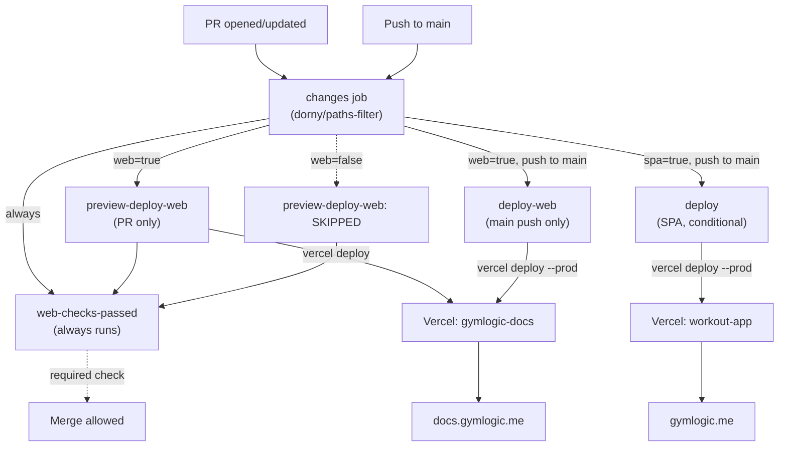
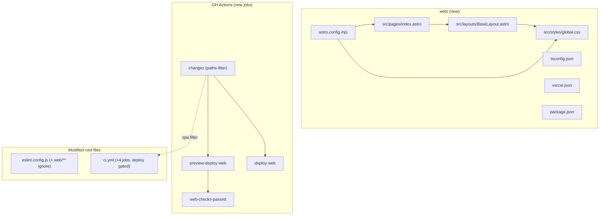

# Tech Plan — Astro Bootstrap (#299)

## Architectural Approach

### Key Decisions

| Decision | Choice | Rationale |
|---|---|---|
| Repo layout | `web/` sub-folder, **no** npm workspaces, two independent `package.json` | Mono-repo for Cursor skills coherence; workspaces over-engineer for 2 packages |
| Astro output mode | `output: 'static'`, **no** adapter | A1-A7 are pure SSG; built-in `<Image />` covers image needs |
| Tailwind integration | `@tailwindcss/vite` v4 in `astro.config.mjs` | v4-recommended path; `@astrojs/tailwind` is v3-only |
| TypeScript | `web/tsconfig.json` extends `astro/tsconfigs/strict`, **not** referenced from root `tsconfig.json` | Root `tsc -b` stays scoped to SPA |
| ESLint | Add `'web/**'` to root `globalIgnores`; `web/` ESLint deferred to A2 | A1 ships ~10 lines of `.astro`; linting nothing is theatre |
| Vercel project | Second project `gymlogic-docs`, Root Directory = `web/`, GH integration disabled | Mirror SPA's deploy-via-CI mental model |
| Deploy CLI flow | `vercel pull → vercel build → vercel deploy --prebuilt` | Mirror SPA exactly |
| Job decoupling | `deploy-web` does **not** depend on SPA `gate` | SPA tests and docs deploys share zero concerns |
| CI gating | Required check is `web-checks-passed` summary job, **not** the deploy jobs | Solves stuck-PR problem on SPA-only PRs while gating broken Astro on `web/**` PRs |
| SPA deploy paths-filter | Existing `deploy` job becomes conditional on non-`web/**` changes | Honors Story 6 of Epic Brief — docs-only commits don't redeploy the SPA |
| Path filter action | `dorny/paths-filter@v3` | Standard, ~30M weekly DLs, allows conditional gating within a single workflow |
| PR comment | `actions/github-script@v7` sticky comment | Built-in; one comment edited per push instead of N comments |
| Node version | `engines.node >=20.0.0` in `web/package.json` | Astro 5 minimum; lets Vercel + GH Actions pick LTS as available |
| Placeholder content | `index.astro` with title + meta description + `<meta name="robots" content="noindex">` + one Tailwind class | Cheapest non-embarrassing path during A1→A6 gap |

### Critical Constraints

**SPA source code must remain unaffected.** The root `file:eslint.config.js` gets one new entry in `globalIgnores`. Root `file:tsconfig.json` is unchanged. The SPA Vercel project is unchanged. `npm run build` at root produces byte-identical output before and after this PR.

**The SPA `deploy` job becomes conditional.** It's the only existing CI job this PR modifies, gated on `needs.changes.outputs.spa == 'true'`. All other SPA jobs (`lint`, `type-check`, `unit`, `deno-unit`, `e2e`, `gate`) keep running on every PR + push (per Epic Brief out-of-scope decision). This is intentional: tests are cheap to run for safety, but deploys cost real bandwidth and PWA cache churn.

**First-deploy ordering is fragile.** The brief's M5 (add `VERCEL_PROJECT_ID_WEB` secret) must precede M6 (update branch protection). Reverse order = self-DoS: the new required check `web-checks-passed` would block all PRs because the dependent `preview-deploy-web` job fails on missing secret.

**`vercel build` is the only build verification.** No separate `web-build` job. The build runs inside `preview-deploy-web` and `deploy-web` — failure of the build = failure of the job.

**Vercel project settings are the source of truth, not `web/vercel.json`.** Vercel CLI's `vercel pull` fetches project config from the dashboard. The `vercel.json` in the repo is documentary + safety net. M2 (Root Directory = `web/`) and M3 (disable GH integration) **must** be set in the Vercel dashboard.

---

## Data Model

No persistent data model — A1 is pure SSG infrastructure. The load-bearing model is the **deployment & CI topology**:

### Table Notes

- **`web-checks-passed` succeeds** when its dependency is either `success` OR `skipped`. This is the magic that prevents stuck PRs on SPA-only changes.
- **`deploy-web` does NOT depend on `gate`** — full decoupling.
- **The SPA `deploy` job** now has `if: ... && needs.changes.outputs.spa == 'true'`. Docs-only commits skip it.
- The other SPA jobs (`lint`, `type-check`, `unit`, `deno-unit`, `e2e`, `gate`) are unchanged — they always run.

---

## Component Architecture

### Layer Overview

### New Files & Responsibilities

| File | Purpose |
|---|---|
| `web/package.json` | Astro 5 + `@tailwindcss/vite` + `tailwindcss` deps; `engines.node >=20.0.0`; scripts: `dev`, `build`, `preview`, `astro` |
| `web/astro.config.mjs` | `output: 'static'`, `site: 'https://docs.gymlogic.me'`, vite plugin `tailwindcss()` |
| `web/tsconfig.json` | Extends `astro/tsconfigs/strict` |
| `web/vercel.json` | `{ "github": { "enabled": false } }` |
| `web/src/pages/index.astro` | Placeholder "Coming soon" page using `BaseLayout` |
| `web/src/layouts/BaseLayout.astro` | `<head>`: title, meta description, `<meta robots noindex>`, viewport, Tailwind CSS import via `<style>`, `<slot />` |
| `web/src/styles/global.css` | `@import "tailwindcss";` — single line, v4 idiom |
| `web/.gitignore` | Astro defaults (`dist`, `.astro`, `node_modules`) |
| `file:.github/workflows/ci.yml` | **Modified** — 4 new jobs (`changes`, `preview-deploy-web`, `deploy-web`, `web-checks-passed`); existing `deploy` job gated on `needs.changes.outputs.spa == 'true'` |
| `file:eslint.config.js` | **Modified** — 1 line: `globalIgnores(['dist', 'web/**'])` |

### Component Responsibilities

**`web/astro.config.mjs`**
- Declares `output: 'static'`
- Sets `site: 'https://docs.gymlogic.me'` (used for canonical URLs and future sitemap in A6)
- Registers `@tailwindcss/vite` as a Vite plugin

**`web/src/layouts/BaseLayout.astro`**
- Single `<head>` with `<title>`, `<meta description>`, `<meta name="robots" content="noindex">`, viewport, Tailwind import via `<style>` tag from `global.css`
- Renders `<slot />` inside `<body>`
- Will be extended in A2 with nav/footer

**`web/src/pages/index.astro`**
- Imports `BaseLayout`, sets page title "GymLogic — Coming soon"
- One `<h1>` with a Tailwind class (e.g., `text-3xl font-bold text-slate-900 dark:text-slate-100`) to prove the utilities pipeline works

**`changes` job (paths-filter)**
- Runs first on every PR + push, no `if:` gate
- Outputs:
  - `web: 'true' | 'false'` for `web/**` changes
  - `spa: 'true' | 'false'` for everything else (used to gate the existing `deploy` job)
- Uses `dorny/paths-filter@v3`

**`preview-deploy-web` job**
- Triggers: `pull_request` events, `if: needs.changes.outputs.web == 'true'`
- Steps: checkout → setup-node → `cd web && npm ci` → `npm i -g vercel@latest` → `vercel pull --yes --environment=preview --token=$VERCEL_TOKEN` → `vercel build --token=$VERCEL_TOKEN` → `vercel deploy --prebuilt --token=$VERCEL_TOKEN` → capture preview URL → `actions/github-script` sticky comment
- Env: `VERCEL_TOKEN`, `VERCEL_ORG_ID`, `VERCEL_PROJECT_ID_WEB`

**`deploy-web` job**
- Triggers: `push` to `main`, `if: needs.changes.outputs.web == 'true' && github.ref == 'refs/heads/main'`
- Same flow as preview but `--environment=production` and `--prod` flag
- No PR comment step

**`web-checks-passed` job**
- Always runs (no `if:` gate)
- `needs: [changes, preview-deploy-web]` with `if: always()`
- Pass criteria: `preview-deploy-web.result` is `success` OR `skipped`
- This is **the** required check added to branch protection in M6

**Existing `deploy` job (SPA) — modified**
- Trigger condition becomes: `if: github.ref == 'refs/heads/main' && github.event_name == 'push' && needs.changes.outputs.spa == 'true'`
- `needs: [gate, changes]`
- All other behavior unchanged

### Failure Mode Analysis

| Failure | Behavior |
|---|---|
| `VERCEL_PROJECT_ID_WEB` secret missing on first run | `vercel pull` fails → `preview-deploy-web` fails → `web-checks-passed` fails → PR blocked. **Resolution**: Pierre adds secret per M5. |
| DNS not propagated when first deploy runs | `vercel deploy` succeeds; `https://docs.gymlogic.me` returns 521 for a few minutes until Let's Encrypt cert issues. Self-heals. |
| Astro build error in PR | `vercel build` step fails inside `preview-deploy-web` → `web-checks-passed` fails → PR blocked. Correct behavior. |
| Astro build error on main push | `deploy-web` fails → prod deploy doesn't happen → `docs.gymlogic.me` keeps last successful deploy. |
| SPA-only PR (no `web/**` changes) | `preview-deploy-web` is `skipped` → `web-checks-passed` sees `result: skipped` → passes → PR unblocked. |
| Docs-only push to main | `changes.outputs.spa = 'false'` → SPA `deploy` job is `skipped` → no SPA redeploy, no PWA cache churn. Story 6 honored. |
| SPA-only push to main | `changes.outputs.web = 'false'` → `deploy-web` is `skipped`. `docs.gymlogic.me` keeps last successful deploy. |
| Two simultaneous `web/**` PRs | Each job scoped to its own PR via `github.event.pull_request.number`; sticky comments target each PR independently. |
| Tailwind v4 + Astro 5 upstream regression | Caught at `vercel build` step. Mitigation: pin to specific minor version, or fall back to plain CSS for the placeholder. |
| Pierre forgets M6 (branch protection) | New jobs run but aren't enforced. Broken Astro can theoretically merge. Detected via M7 sanity check (`curl docs.gymlogic.me`). |
| PR mixed `web/**` + `src/**` changes | Both pipelines run. No issue, no atomicity enforcement either. |

---

## Implementation Notes

These are not decisions but useful breadcrumbs for the implementer (probably future me):

- **`actions/github-script` sticky comment idiom**: the script lists existing comments on the PR by the bot, finds one whose body starts with a known prefix (e.g., `<!-- vercel-preview-docs -->`), and either updates it or creates a new one. Avoids comment spam.
- **Capturing the Vercel preview URL**: `vercel deploy --prebuilt --token=$VERCEL_TOKEN` writes the URL to stdout. Capture it in a step output: `echo "url=$(vercel deploy ...)" >> $GITHUB_OUTPUT`.
- **`web/vercel.json` content** is just `{ "github": { "enabled": false } }`. Astro's adapter-less mode produces a `dist/` directory of static files; Vercel detects it natively.
- **Root `eslint.config.js`** change is a single line: `globalIgnores(['dist'])` → `globalIgnores(['dist', 'web/**'])`.
- **Astro version pinning**: use `^5.x.x` semver in `web/package.json`. Lockfile guarantees reproducibility per build.

---

## References

- Epic Brief: `file:docs/Epic_Brief_—_Bootstrap_Astro_Mini-Site_#299.md`
- Parent epic: #298
- This ticket: #299
- Sibling tickets: #300 (A2), #301 (A3), #302 (A4), #303 (A5), #304 (A6), #305 (A7)
- Existing SPA CI / deploy: `file:.github/workflows/ci.yml`
- Existing SPA Vercel config: `file:vercel.json`
- Existing root ESLint config: `file:eslint.config.js`
- Coupling reference (why we don't put this on the apex): #292 (OAuth callback flash)
