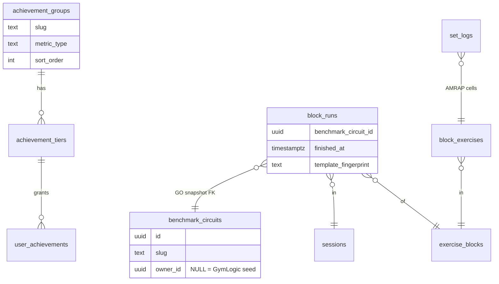

# Tech Plan — Benchmark Circuit achievement tracks (#482)

## Architectural Approach

### Key Decisions

| Decision | Choice | Rationale |
|---|---|---|
| Delivery shape | One migration à la #218: seed 5 groups + 25 tiers + replace both RPCs | Proven path; accordion stays data-driven |
| Qualifying run definition | Shared CTE in both RPCs: GO `block_runs.benchmark_circuit_id` → `benchmark_circuits.owner_id IS NULL`, `finished_at NOT NULL`, `fullRounds = max(set_number)-1 ≥ 1` | Matches ADR 0019 / **Circuit Achievement Run**; never join live day FK |
| fullRounds in SQL | Inline CTE helper (no SQL function, no `block_runs` column) | Brief: no new tables; #218 style dual-body replace |
| Spidey metric | `MAX(fullRounds)` on `slug = 'cindy'` only | Leftover never crosses tiers; diamond = Holland 27 |
| Cast Clearing | Per-seed run counts then `MIN()` over hardcoded slug arrays via **LEFT JOIN fixed slug list** (missing seed → 0) | Surplus = advance; no Zeus spam; never `MIN` over observed-only rows |
| UI | i18n only (`groupDescriptions`, `thresholdHint`, optional `groups`) with metric placeholders | Zero new React; titles from DB; missing keys would show raw i18n strings |
| Retroactive | Next session finish + run `scripts/retroactive-badge-grant.sql` post-migrate | Overlay on finish; silent DB catch-up like #218 docs |
| Tests | Extend `securityDefiner.arch.test.ts` + pin fullRounds fixtures in `amrapScore.test.ts` | No pgTAP; catch drift without Postgres harness |

### Critical Constraints

- Both RPCs live in `file:supabase/migrations/20260802170000_secure_definer_rpcs.sql` and must stay **byte-identical on the `metrics` CTE** (and the shared `qualifying_runs` helper). Every new branch is duplicated. Drift between grant and status is the #1 footgun.
- `fullRounds` today exists only in `file:src/lib/amrapScore.ts` (+ MCP twin). SQL must scope cells via `block_runs → block_exercises → set_logs` for that `block_id`/`session_id`, not all session logs.
- Catalog shelf (`file:src/pages/library/CircuitCatalogPage.tsx`, seed detail) must not import badge hooks — ADR 0018.
- `AchievementAccordion` / Overlay / Drawer call `t(\`groupDescriptions.${slug}\`)` and Drawer also `thresholdHint.${slug}` — missing keys show raw i18n keys in prod.
- Local `npm run seed:circuit-history` labels must not be used as production fixtures for achievement assertions (test hygiene from the Epic Brief).
- Cast Clearing **must** LEFT JOIN a fixed slug list so a user missing Hades gets `olympians = 0`, not `MIN` over only the gods they ran.

---

## Data Model

No new tables. Extend seed data + RPC metrics.



### Metrics → values

| `metric_type` (= group slug) | SQL value |
|---|---|
| `circuit_runner` | `COUNT(*)` qualifying runs (all GymLogic seeds) |
| `spidey` | `COALESCE(MAX(full_rounds) FILTER (WHERE slug = 'cindy'), 0)` |
| `olympians` | `MIN` of per-slug counts over `{zeus,ares,athena,hades}`; missing slug → 0 |
| `heroes` | same over `{heracles,theseus,atlas,achilles}` |
| `pantheoniste` | same over the eight Greek slugs |

### Shared CTE sketch (both RPCs)

```sql
qualifying_runs AS (
  -- one row per finished seed run with full_rounds >= 1
  SELECT br.id, br.session_id, bc.slug,
         (MAX(sl.set_number) - 1) AS full_rounds
  FROM block_runs br
  JOIN sessions s ON s.id = br.session_id AND s.user_id = p_user_id
  JOIN benchmark_circuits bc ON bc.id = br.benchmark_circuit_id
    AND bc.owner_id IS NULL
  JOIN block_exercises be ON be.block_id = br.block_id
  JOIN set_logs sl ON sl.session_id = br.session_id
    AND sl.block_exercise_id = be.id
  WHERE br.finished_at IS NOT NULL
  GROUP BY br.id, br.session_id, bc.slug
  HAVING (MAX(sl.set_number) - 1) >= 1
),
olympian_slugs AS (
  SELECT unnest(ARRAY['zeus','ares','athena','hades']) AS slug
),
hero_slugs AS (
  SELECT unnest(ARRAY['heracles','theseus','atlas','achilles']) AS slug
),
pantheon_slugs AS (
  SELECT slug FROM olympian_slugs
  UNION ALL
  SELECT slug FROM hero_slugs
),
metrics AS (
  -- existing 11 UNION ALL …
  UNION ALL
  SELECT 'circuit_runner', COUNT(*)::numeric FROM qualifying_runs
  UNION ALL
  SELECT 'spidey', COALESCE(MAX(full_rounds), 0)::numeric
    FROM qualifying_runs WHERE slug = 'cindy'
  UNION ALL
  SELECT 'olympians', COALESCE(MIN(c.cnt), 0)::numeric
  FROM (
    SELECT COALESCE(COUNT(q.id), 0) AS cnt
    FROM olympian_slugs o
    LEFT JOIN qualifying_runs q ON q.slug = o.slug
    GROUP BY o.slug
  ) c
  -- heroes / pantheoniste: same pattern on hero_slugs / pantheon_slugs
)
```

### Seed rows

`sort_order` 12–16; titles and thresholds exactly as the Epic Brief locked table. `icon_asset_url` NULL. Group `name_fr` / `name_en` match accordion titles; `description_fr` / `description_en` may mirror metric placeholders (UI prefers i18n).

| `sort_order` | Slug | FR name | EN name | Thresholds |
|---|---|---|---|---|
| 12 | `circuit_runner` | Circuit runner | Circuit Runner | 1 / 5 / 15 / 40 / 100 |
| 13 | `spidey` | L’Araignée | Spidey | 1 / 10 / 18 / 23 / 27 |
| 14 | `olympians` | Au sommet de l’Olympe | Olympus Summit | 1 / 5 / 10 / 50 / 100 |
| 15 | `heroes` | Le tour des Héros | Heroes’ Tour | 1 / 5 / 10 / 50 / 100 |
| 16 | `pantheoniste` | Le Pantheoniste | Pantheoniste | 1 / 5 / 10 / 50 / 100 |

Tier `title_fr` / `title_en`: see Epic Brief locked title table (25 rows).

### Table Notes

- **MIN with missing seeds:** implement as LEFT JOIN from a fixed slug-list CTE → `COALESCE(cnt,0)` → `MIN`. Observed-only `MIN` fails story 4 (Zeus×100 with Hades missing must stay 0).
- **Spidey vs runner double-count:** one Cindy row in `qualifying_runs` feeds both branches — intentional (Epic story 17).
- **Fingerprint:** not used for achievements. Cap/Rx forks mint `owner_id` rows and drop out of seed filters.
- **Leftover:** unused in SQL tiers. `MAX(set_number) - 1` is enough for Spidey and the `fullRounds ≥ 1` gate.

---

## Component Architecture

### Layer Overview

```mermaid
graph TD
  SF[processSessionFinish] -->|rpc check_and_grant| RPC[check_and_grant_achievements]
  RPC -->|UnlockedAchievement[]| Q[achievementUnlockQueueAtom]
  RPC --> LSB[lastSessionBadgesAtom]
  Q --> Overlay[AchievementUnlockOverlay]
  LSB --> SessionBadges
  Page[AchievementsPage] -->|rpc get_badge_status| Status[get_badge_status]
  Status --> Accordion[AchievementAccordion]
  Accordion --> Drawer[BadgeDetailDrawer]
  Catalog[Circuit Catalog pages] -.->|no badge imports| X[out of scope]
  Migrate[circuit_achievement_tracks.sql] --> RPC
  Migrate --> Status
  Retro[retroactive-badge-grant.sql] --> RPC
```

### New Files & Responsibilities

| File | Purpose |
|---|---|
| `supabase/migrations/YYYYMMDDHHMMSS_circuit_achievement_tracks.sql` | Seed 5×5 + replace both RPCs with shared `qualifying_runs` + 5 new metric branches |
| `src/locales/fr/achievements.json` | `groups`, `groupDescriptions`, `thresholdHint` for 5 slugs (metric placeholders OK) |
| `src/locales/en/achievements.json` | idem |
| `src/test/securityDefiner.arch.test.ts` | Extend: assert migration SQL contains the 5 `metric_type` literals, `owner_id IS NULL`, and fixed cast slug lists / LEFT JOIN pattern |
| `src/lib/amrapScore.test.ts` | Pin fixtures that mirror the SQL contract (`fullRounds = max set_number - 1`, unfinished → null, `0` excluded from “qualifying”) |

No new React components. No changes to `file:src/lib/syncService.ts` grant call (already fire-and-forget after session upsert). Post-migrate ops: run `file:scripts/retroactive-badge-grant.sql` (ticket AC).

### Component Responsibilities

**Migration RPC bodies**
- Own all metric math; `qualifying_runs` + cast slug CTEs + five `UNION ALL` branches must be identical in `check_and_grant_achievements` and `get_badge_status`.
- Auth guard unchanged (`auth.uid()` / `is_trusted_backend_caller()`).

**i18n placeholders (shippable; copy may be rewritten later)**

| Key | FR | EN |
|---|---|---|
| `groupDescriptions.circuit_runner` | Runs de circuits GymLogic (1+ tour) | GymLogic circuit runs (1+ round) |
| `groupDescriptions.spidey` | Meilleur score Cindy en tours | Best Cindy score in rounds |
| `groupDescriptions.olympians` | Min. de runs Zeus / Arès / Athéna / Hadès | Min. runs across Zeus / Ares / Athena / Hades |
| `groupDescriptions.heroes` | Min. de runs Héraclès / Thésée / Atlas / Achille | Min. runs across Heracles / Theseus / Atlas / Achilles |
| `groupDescriptions.pantheoniste` | Min. de runs sur les huit grecs | Min. runs across the eight Greek seeds |
| `thresholdHint.circuit_runner` (pattern for all five) | Atteins {{target}} | Reach {{target}} |

Also add `groups.{slug}` for completeness (unused by current accordion; names come from DB).

**AchievementAccordion / Overlay / Drawer**
- Unchanged code paths; new rows appear via RPC + i18n.

**Circuit Catalog**
- No badge imports, no chips — ADR 0018.

### Failure Mode Analysis

| Failure | Behavior |
|---|---|
| Grant RPC errors | Session finish still succeeds; warn log; Realtime / next finish retries (existing) |
| User has only Zeus×100 | `olympians` / `pantheoniste` stay 0 until every cast seed has ≥ 1 qualifying run |
| Cindy `26+15` | Spidey `current_value = 26`; platinum 23 unlocked; diamond locked |
| TIME `0+0` / no set_logs | Row absent from `qualifying_runs`; no metric moves |
| Circuit Fork GO snapshot | `owner_id` set → excluded |
| Jetable AMRAP (`benchmark_circuit_id` NULL) | Excluded |
| Missing i18n key | Raw key in UI — blocked by ticket AC |
| Catalog pages | No change; no badge fetch |
| Retroactive script after migrate | Grants rows silently; overlay does not flood (Realtime gate / no live session) |

---

## References

- Epic Brief: `file:docs/Epic_Brief_—_Benchmark_Circuit_achievement_tracks_#482.md`
- ADR: `file:docs/adr/0019-circuit-achievement-cast-clearing-and-spidey.md`
- Encyclopedia boundary: `file:docs/adr/0018-circuit-catalog-encyclopedia-under-library.md`
- Precedent: `file:supabase/migrations/20260419120000_new_achievement_tracks.sql`, `file:docs/done/Tech_Plan_—_New_Achievement_Tracks_#218.md`
- Current RPCs: `file:supabase/migrations/20260802170000_secure_definer_rpcs.sql`
- Score contract: `file:src/lib/amrapScore.ts`
- Grant path: `file:src/lib/syncService.ts`
- Retroactive: `file:scripts/retroactive-badge-grant.sql`
