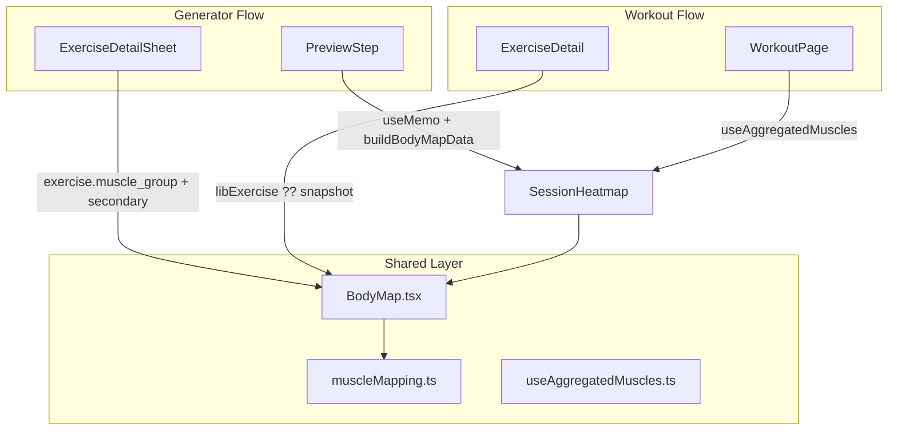

# Tech Plan — Body Highlight Visualization

## Architectural Approach

### Key Decisions

| Decision | Choice | Rationale |
|---|---|---|
| SVG library | `react-body-highlighter` (v2.0.5) | SVG-only, anterior + posterior views, built-in frequency-based gradient, <5 KB gzipped, React 19 compatible. Custom SVG would require drawing and maintaining anatomical paths. |
| Mapping strategy | Static lookup from French taxonomy → library slug array | 13 canonical values map cleanly to 20 SVG regions. Unknown values produce an empty array (blank avatar). |
| Heatmap weighting | Set-count: primary gets full sets, secondary gets `ceil(sets / 2)` | Creates a natural gradient — heavy chest day shows chest hottest, supporting muscles progressively dimmer. |
| Snapshot vs live catalog | Prefer `useExerciseFromLibrary` (live), fall back to `muscle_snapshot` | Best data when available; graceful degradation for deleted exercises or loading states. |
| Theming | Opacity ramp on `--primary` CSS variable, `--muted` for idle body | Follows existing convention (`file:src/components/workout/RestTimerDrawer.tsx`), zero new CSS variables. |

### Critical Constraints

The mapping layer depends on the 13-value taxonomy from `file:scripts/audit-muscle-tags.ts`. Until [Issue #66](https://github.com/PierreTsia/workout-app/issues/66) fully normalizes the database, some exercises may have legacy `muscle_group` values that won't map to any SVG region — the component gracefully shows a neutral silhouette for those.

The library's `highlightedColors` array maps index to frequency level. With our 3-color gradient (`primary/0.3` → `primary/0.65` → `primary`), muscles hit 1× appear light, 2× medium, 3+× full intensity.

---

## Data Model

No new database tables or columns. The feature reads existing fields:

- `exercises.muscle_group` (`text NOT NULL`) — primary muscle, French label
- `exercises.secondary_muscles` (`text[]`) — optional secondary muscles
- `workout_exercises.muscle_snapshot` (`text`) — snapshot of primary at build time

### Mapping shape

```typescript
// src/lib/muscleMapping.ts
const TAXONOMY_TO_SLUGS: Record<string, Muscle[]> = {
  Pectoraux: ["chest"],
  Dos: ["upper-back"],
  Épaules: ["front-deltoids", "back-deltoids"],
  Biceps: ["biceps"],
  Triceps: ["triceps"],
  Quadriceps: ["quadriceps"],
  Ischios: ["hamstring"],
  Fessiers: ["gluteal"],
  Adducteurs: ["adductor"],
  Mollets: ["calves"],
  Abdos: ["abs"],
  Trapèzes: ["trapezius"],
  Lombaires: ["lower-back"],
}
```

---

## Component Architecture

### Layer Overview



### New Files & Responsibilities

| File | Purpose |
|---|---|
| `file:src/lib/muscleMapping.ts` | Taxonomy-to-SVG-slug map, `mapMuscleToSlugs`, `buildBodyMapData` (aggregation), `buildSingleExerciseData` (single exercise) |
| `file:src/lib/muscleMapping.test.ts` | 23 unit tests: all 13 taxonomy values, unknowns, aggregation weighting, secondary ceiling math |
| `file:src/components/body-map/BodyMap.tsx` | Presentational: renders anterior + posterior `Model` side-by-side, accepts pre-built data or single-exercise fields, responsive max-width 140px per silhouette |
| `file:src/components/body-map/SessionHeatmap.tsx` | Collapsible wrapper around `BodyMap` for aggregated session/preview views |
| `file:src/hooks/useAggregatedMuscles.ts` | Hook: batch-resolves library exercises via `useQueries` (shared cache key `["exercise", id]`), aggregates into `IExerciseData[]` |

### Component Responsibilities

**`BodyMap`**
- Renders two `react-body-highlighter` `Model` instances (anterior + posterior)
- Derives data from either pre-built `IExerciseData[]` (aggregated mode) or `muscleGroup` + `secondaryMuscles` props (single exercise mode)
- Applies theme tokens: `hsl(var(--muted))` for body, opacity ramp on `hsl(var(--primary))` for highlights

**`SessionHeatmap`**
- Wraps `BodyMap` in a `Collapsible` (Radix primitive via `file:src/components/ui/collapsible.tsx`)
- `defaultOpen` prop: `true` on `PreviewStep` (low-density screen), `false` on `WorkoutPage` (high-density)
- Hidden when `data` is empty (no exercises or all unmapped)

**`useAggregatedMuscles`**
- Takes `WorkoutExercise[]`, runs parallel `useQueries` to resolve full `Exercise` objects
- Uses same `["exercise", id]` cache key as `useExerciseById` — results are typically warm from `ExerciseDetail` rendering
- Falls back to `muscle_snapshot` when library data is unavailable
- Returns `IExerciseData[]` via `useMemo` (recomputes only when queries settle)

### Failure Mode Analysis

| Failure | Behavior |
|---|---|
| `muscle_group` is null, empty, or unmapped | `mapMuscleToSlugs` returns `[]` → blank avatar, no crash |
| `secondary_muscles` is null | Treated as no secondaries → primary-only highlight |
| Library exercise fetch fails | `useAggregatedMuscles` falls back to `muscle_snapshot` (primary only) |
| All exercises unmapped | `SessionHeatmap` returns null (hidden) |

---

## Integration Points

### Single-exercise surfaces

- `file:src/components/workout/ExerciseDetail.tsx` — `BodyMap` between header badge and `ExerciseInstructionsPanel`, fed by `libExercise?.muscle_group ?? exercise.muscle_snapshot` + `libExercise?.secondary_muscles`
- `file:src/components/generator/ExerciseDetailSheet.tsx` — `BodyMap` after `SheetHeader`, fed by `exercise.muscle_group` + `exercise.secondary_muscles`

### Aggregated surfaces

- `file:src/components/generator/PreviewStep.tsx` — `SessionHeatmap` (default open) between shuffle controls and exercise list, data derived via `useMemo` + `buildBodyMapData`
- `file:src/pages/WorkoutPage.tsx` — `SessionHeatmap` (default closed) between `DaySelector` and `ExerciseStrip`, data from `useAggregatedMuscles` hook
