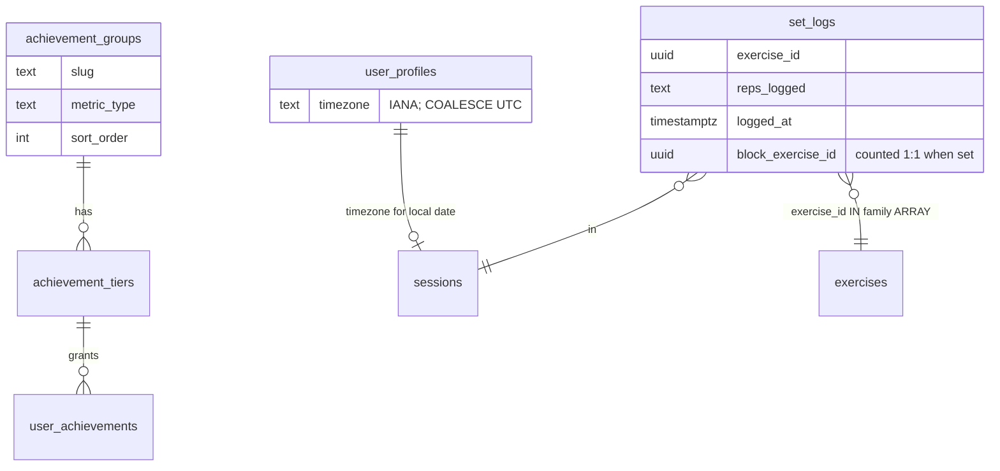

# Tech Plan — Bodyweight Trinity achievement tracks (#509)

## Architectural Approach

### Key Decisions

| Decision | Choice | Rationale |
|---|---|---|
| Delivery shape | One migration à la #482: seed 5 groups + 25 tiers + replace **both** RPCs | Proven path; accordion stays data-driven; #510 is the 5th group, not a second epic |
| Family membership | Hardcoded `unnest(ARRAY[uuid, …])` CTEs in both RPC bodies (8 + 6 + 6) | Same class of debt as Pantheoniste slug arrays; brief forbids a `movement_family` column / mapping table |
| Family metric | `SUM(reps_logged::int)` on finished-session `set_logs`, numeric only (`~ '^\d+$'`), no block filter | Volume King safe-cast; circuit stations count 1:1 like Leg Day / Volume King |
| `bw_expert` | `LEAST` of the three family sums (`COALESCE` each to 0) | **Cast Clearing** of reps (ADR 0019 shape); a missing family is 0, not omitted from MIN |
| `hundred_a_day` | **Live chain**, identical in grant and status: island of local days with Pompes-family SUM ≥ 100 whose last day is **today or yesterday** in `user_profiles.timezone` | Brief: `current_value` resets after a miss; grants never revoke (`ON CONFLICT DO NOTHING`). Identical metrics CTE is the #482 footgun rule — no grant/status split |
| Day bucket | `(set_logs.logged_at AT TIME ZONE tz)::date` | Early Bird already uses `user_profiles.timezone`; brief forbids `sessions.finished_at` for this track |
| UI | i18n + playground fixtures only | Zero new React surface; `/achievements` accordion is already RPC-driven |
| Retroactive | Next session finish + existing `scripts/retroactive-badge-grant.sql` | Overlay on finish; silent DB catch-up like #218 / #482 |
| Icons | `icon_asset_url` NULL at seed; art from `file:docs/badge-icon-prompts-bodyweight-tracks-509.md` in a later ticket | SQL can ship before pixels |
| Tests | New `bodyweightAchievementTracks.arch.test.ts` copying `file:src/test/circuitAchievementTracks.arch.test.ts` | Pin UUIDs, CTE parity, last-wins metric literals; no pgTAP |

Phase 2 questionnaires were skipped: the Epic Brief + #482/#218 playbook close the expensive forks (hardcoded UUID arrays, identical metrics CTE, UNION ALL + seed).

### Critical Constraints

- Both RPCs must stay **byte-identical on the new CTEs** (`push_up_ids`, `pull_up_ids`, `bw_squat_ids`, `family_rep_totals`, `qualifying_push_days`, `hundred_a_day_current`) **and** on every `metrics` branch. Drift between grant and status is still the #1 footgun. Arch-test it.
- **Copy the live bodies, then append.** Grant source of truth: `file:supabase/migrations/20260819174900_grant_achievements_threshold_value.sql` (`RETURNS TABLE` includes `threshold_value numeric`). Status source of truth: `file:supabase/migrations/20260819114837_quick_sessions_exclude_detached_days.sql` (`STABLE`, detached-day `quick_sessions`). Do **not** DROP `check_and_grant_achievements` — RETURNS TABLE does not change (T213 / 42P13 lesson). Preserve `qualifying_runs`, cast slug lists, auth guards, and all 16 existing metric branches.
- Family lists are catalog UUIDs frozen 20 Aug 2026. A later catalog rename does not change membership; a new variant **does not** count until a migration edits the ARRAY. Arch-test the 20 IN ids and the 9 named OUT ids (must not appear in those ARRAYs).
- `hundred_a_day` is a **new metric class**. Copying `streak_king` / `pr_streak` `MAX(streak_len)` would lie on the accordion. Live chain + insert-only grants means diamond can sit next to a 0 progress bar after a miss — that is the product.
- `AchievementAccordion` headers read **DB** `group_name_fr` / `group_name_en`; overlay chips read `t(\`groups.${slug}\`)`; drawer/accordion descriptions read `groupDescriptions`. All three must match the locked copy or the UI splits.
- No new route. HITL ceremony stays on `/_unlock-overlay` (`file:src/pages/UnlockOverlayPlaygroundPage.tsx`). Accordion recette stays on `/achievements`.
- `file:src/lib/syncService.ts` grant call does not change. Finish must still succeed if the RPC errors.

---

## Data Model

No new tables. Extend seed data + RPC metrics.



### Metrics → values

| `metric_type` (= group slug) | SQL value |
|---|---|
| `push_ups` | `SUM` numeric `reps_logged` where `exercise_id` ∈ Pompes 8 |
| `pull_ups` | same, Tractions 6 |
| `bw_squats` | same, Squat PDC 6 |
| `bw_expert` | `LEAST(push_ups, pull_ups, bw_squats)` each `COALESCE`d to 0 |
| `hundred_a_day` | live consecutive local days with Pompes-family daily SUM ≥ 100, anchored to today/yesterday (see below) — **not** `MAX` |

Existing 16 branches unchanged (`session_count` … `pantheoniste`).

### Frozen family UUIDs (both RPCs)

**Pompes (8)** — `push_up_ids`

| FR | id |
|---|---|
| Pompes | `e63fe427-e910-4e0d-9f73-c51d85b36a3f` |
| Pompes pike | `5c7e172f-6c33-46cc-9886-4c31287623a8` |
| Pompes claquées | `de827afb-d91b-400a-bd5f-415beca277df` |
| Pompes un bras | `4a1a7219-bd91-4d59-9d73-2c30c5d9f0ce` |
| Pompes déclinées | `92d8460a-b5c6-449a-9659-004a7ee9565c` |
| Pompes en poirier (HSPU) | `01babef5-3139-4f37-b23f-88ef8d40279d` |
| Pompes en déficit | `426a5c8a-60bd-456c-b5c9-9bf92913f089` |
| Pompes prise serrée (Diamant) | `6b46d77b-1291-44b9-9d40-f4da8930ae17` |

**Tractions (6)** — `pull_up_ids`

| FR | id |
|---|---|
| Tractions | `261dca1e-9bae-4098-8676-6169597f9964` |
| Tractions supination | `00731099-9e50-4c90-a92e-0b4433881125` |
| Tractions archer | `5c0d0e9c-2118-4be4-a90b-31239029b7a3` |
| Traction front lever | `3ce11aeb-966e-4168-b744-902b7d357cfe` |
| Tractions commando | `366e1372-4fa0-40c4-816c-6fa83aa2c53d` |
| Tractions prise neutre | `a3de462c-9cb9-4a59-ae31-11fbb842895b` |

**Squat (6)** — `bw_squat_ids`

| FR | id |
|---|---|
| Squat au poids du corps | `41de0558-c044-4f90-b112-2b09c16e985c` |
| Squat pistol | `f1c88f28-8742-4862-985d-0752deca3675` |
| Squat pistol box | `24e5654d-8414-4df6-b928-d2a4f6974d22` |
| Squat dragon | `473523ed-8ef9-493e-8e33-660de7979a7a` |
| Squat cosaque | `113d352b-5f40-46ad-9d43-a1f5c9f33934` |
| Squats sumo | `4abd9a5f-78ed-4772-bf3d-153cccc7cb65` |

**OUT (must not appear in the three ARRAYs):**

`af2cc5d5-b63d-44dc-aedc-366b6733873a` incline · `9dd1bc26-5d88-4744-9543-18477885d0f4` knee · `13a23234-1be6-4849-9a95-353ec25dc8fc` negative push-up · `1eb9e156-c832-4372-945b-b1902d3822d6` Poirier hold · `01807007-7465-4a5f-8155-e0eff0dc10da` inverted row · `6f2c8b23-2ac7-4e10-be50-82fc633c68a3` negative pull-up · `96a9ad05-192e-4e20-878f-90a153efa4d8` assisted machine · `ffa0994b-a4a2-492f-b718-23d8bb795549` jump squat · `873f87b6-2eea-47e7-882e-7665b2f20a26` barbell squat.

Duration rows are also excluded by the `^\d+$` guard even if a UUID slipped in.

### Shared CTE sketch (both RPCs)

Append after the existing `pantheon_slugs` CTE. `user_sessions` already filters `finished_at IS NOT NULL`.

```sql
push_up_ids AS (
  SELECT unnest(ARRAY[
    'e63fe427-e910-4e0d-9f73-c51d85b36a3f',
    '5c7e172f-6c33-46cc-9886-4c31287623a8',
    'de827afb-d91b-400a-bd5f-415beca277df',
    '4a1a7219-bd91-4d59-9d73-2c30c5d9f0ce',
    '92d8460a-b5c6-449a-9659-004a7ee9565c',
    '01babef5-3139-4f37-b23f-88ef8d40279d',
    '426a5c8a-60bd-456c-b5c9-9bf92913f089',
    '6b46d77b-1291-44b9-9d40-f4da8930ae17'
  ]::uuid[]) AS exercise_id
),
pull_up_ids AS (
  SELECT unnest(ARRAY[
    '261dca1e-9bae-4098-8676-6169597f9964',
    '00731099-9e50-4c90-a92e-0b4433881125',
    '5c0d0e9c-2118-4be4-a90b-31239029b7a3',
    '3ce11aeb-966e-4168-b744-902b7d357cfe',
    '366e1372-4fa0-40c4-816c-6fa83aa2c53d',
    'a3de462c-9cb9-4a59-ae31-11fbb842895b'
  ]::uuid[]) AS exercise_id
),
bw_squat_ids AS (
  SELECT unnest(ARRAY[
    '41de0558-c044-4f90-b112-2b09c16e985c',
    'f1c88f28-8742-4862-985d-0752deca3675',
    '24e5654d-8414-4df6-b928-d2a4f6974d22',
    '473523ed-8ef9-493e-8e33-660de7979a7a',
    '113d352b-5f40-46ad-9d43-a1f5c9f33934',
    '4abd9a5f-78ed-4772-bf3d-153cccc7cb65'
  ]::uuid[]) AS exercise_id
),
user_tz AS (
  SELECT COALESCE(
    (SELECT timezone FROM user_profiles WHERE user_id = p_user_id),
    'UTC'
  ) AS tz
),
family_rep_totals AS (
  SELECT
    COALESCE(SUM(sl.reps_logged::int) FILTER (
      WHERE sl.exercise_id IN (SELECT exercise_id FROM push_up_ids)
    ), 0) AS push_ups,
    COALESCE(SUM(sl.reps_logged::int) FILTER (
      WHERE sl.exercise_id IN (SELECT exercise_id FROM pull_up_ids)
    ), 0) AS pull_ups,
    COALESCE(SUM(sl.reps_logged::int) FILTER (
      WHERE sl.exercise_id IN (SELECT exercise_id FROM bw_squat_ids)
    ), 0) AS bw_squats
  FROM set_logs sl
  JOIN user_sessions us ON us.id = sl.session_id
  WHERE sl.reps_logged IS NOT NULL
    AND sl.reps_logged ~ '^\d+$'
),
qualifying_push_days AS (
  SELECT (sl.logged_at AT TIME ZONE (SELECT tz FROM user_tz))::date AS local_day
  FROM set_logs sl
  JOIN user_sessions us ON us.id = sl.session_id
  WHERE sl.exercise_id IN (SELECT exercise_id FROM push_up_ids)
    AND sl.reps_logged IS NOT NULL
    AND sl.reps_logged ~ '^\d+$'
    AND sl.logged_at IS NOT NULL
  GROUP BY 1
  HAVING SUM(sl.reps_logged::int) >= 100
),
push_streaks AS (
  SELECT grp, COUNT(*)::int AS streak_len, MAX(local_day) AS end_day
  FROM (
    SELECT local_day,
           local_day - (ROW_NUMBER() OVER (ORDER BY local_day))::int AS grp
    FROM qualifying_push_days
  ) islands
  GROUP BY grp
),
hundred_a_day_current AS (
  SELECT COALESCE(
    (
      SELECT s.streak_len
      FROM push_streaks s
      CROSS JOIN user_tz t
      WHERE s.end_day BETWEEN
        (now() AT TIME ZONE t.tz)::date - 1
        AND (now() AT TIME ZONE t.tz)::date
      ORDER BY s.end_day DESC
      LIMIT 1
    ),
    0
  )::numeric AS value
)
```

Then five `UNION ALL` branches on `metrics`:

```sql
UNION ALL
SELECT 'push_ups', push_ups::numeric FROM family_rep_totals
UNION ALL
SELECT 'pull_ups', pull_ups::numeric FROM family_rep_totals
UNION ALL
SELECT 'bw_squats', bw_squats::numeric FROM family_rep_totals
UNION ALL
SELECT 'bw_expert',
       LEAST(push_ups, pull_ups, bw_squats)::numeric
  FROM family_rep_totals
UNION ALL
SELECT 'hundred_a_day', value FROM hundred_a_day_current
```

Use `now()` (STABLE, transaction time) — not `clock_timestamp()`. `get_badge_status` stays `STABLE`.

### Seed rows

`sort_order` 17–21. `icon_asset_url` omitted (NULL). `metric_type` = slug. Titles and thresholds exactly as the Epic Brief.

| `sort_order` | Slug | FR name | EN name | Thresholds |
|---|---|---|---|---|
| 17 | `push_ups` | Pompes | Push-ups | 100 / 500 / 2 500 / 10 000 / 25 000 |
| 18 | `pull_ups` | Tractions | Pull-ups | same |
| 19 | `bw_squats` | Squat poids du corps | Bodyweight Squat | same |
| 20 | `bw_expert` | Expert du poids du corps | Bodyweight Expert | same |
| 21 | `hundred_a_day` | 100 jours ferme | Hard Time | 1 / 10 / 30 / 60 / 100 |

```sql
INSERT INTO achievement_groups (slug, name_fr, name_en, description_fr, description_en, metric_type, sort_order)
VALUES
  ('push_ups',      'Pompes',                    'Push-ups',            'Reps cumulées de la famille Pompes',                         'Cumulative Pompes-family reps',                              'push_ups',      17),
  ('pull_ups',      'Tractions',                  'Pull-ups',            'Reps cumulées de la famille Tractions',                      'Cumulative Tractions-family reps',                           'pull_ups',      18),
  ('bw_squats',     'Squat poids du corps',       'Bodyweight Squat',    'Reps cumulées de la famille Squat PDC',                      'Cumulative bodyweight-squat family reps',                    'bw_squats',     19),
  ('bw_expert',     'Expert du poids du corps',   'Bodyweight Expert',   'Min. des trois familles',                                    'Min. of the three family totals',                            'bw_expert',     20),
  ('hundred_a_day', '100 jours ferme',            'Hard Time',           'Jours d''affilée en cours avec ≥100 pompes (famille)',       'Current consecutive days with ≥100 Pompes-family reps',      'hundred_a_day', 21);
```

Tier titles (Bronze → Diamant):

| Slug | Bronze | Silver | Gold | Platinum | Diamond |
|---|---|---|---|---|---|
| `push_ups` | Nez au sol / Nose to Floor | Piston / Piston | Mur de pompes / Push-up Wall | Le Vérin / The Jack | La Pompe éternelle / The Eternal Pump |
| `pull_ups` | Menton à la barre / Chin Over | Dos en V / V-Taper | Grand dorsal / The Lats | Tractionnaire / Bar Addict | Le Roi de la barre / King of the Bar |
| `bw_squats` | Cul vers l'herbe / Ass to Grass | Genoux souples / Soft Knees | Le Puits / The Well | Sans barre / No Bar | Le Puits éternel / The Eternal Well |
| `bw_expert` | Le Trio / The Trio | Équilibriste / Tightrope | Sans machine / No Machine | Calisthéniste / Calisthenist | Expert du poids du corps / Bodyweight Expert |
| `hundred_a_day` | Garde à vue / In Custody | Préventive / On Remand | Un mois ferme / A Month Inside | Mitard / The Hole | 100 jours ferme / Hard Time |

SQL apostrophes: `Cul vers l''herbe`, `Jours d''affilée…` — same doubling as `L''Araignée` in `file:supabase/migrations/20260817120000_circuit_achievement_tracks.sql`.

### Table Notes

- **`LEAST` vs Cast Clearing LEFT JOIN:** three scalar sums already exist as columns on one `family_rep_totals` row. `COALESCE` to 0 before `LEAST` is the missing-Hades equivalent. Do not `MIN` over observed-only `exercise_id` groups.
- **Yesterday grace:** if today is not yet a qualifying day, a chain that ended yesterday is still alive (`end_day BETWEEN today-1 AND today`). Opening Succès at 06:00 must not flash 0. A completed miss (last qualifying day ≤ today-2) → `current_value = 0`.
- **Live chain vs historical islands:** a 100-day island that ended last year does **not** grant diamond on ship. Identical metrics + live `current_value` forbids a grant-side `MAX`. Escape hatch: a one-shot ops SQL that inserts `user_achievements` from historical max — out of this epic. Next finish still grants whatever the **current** chain qualifies for (and all lifetime family SUM tiers).
- **Cindy 20 on-ramp:** 5/10/15 × 20 station `set_logs` → Tractions 100, Pompes 200, Squats 300, expert 100. No special Cindy branch.
- **50+50 same local day:** `GROUP BY` local date then `HAVING SUM >= 100`. Session identity does not matter.
- **`logged_at` vs `finished_at`:** a 23:30 Paris set belongs to that local date even if the session closes after midnight.
- **Circuit logs:** no `block_exercise_id IS NULL` filter. Do not copy progression-engine exclusions.
- **No schema change** on `user_profiles.timezone` — already there from #218.

---

## Component Architecture

### Layer Overview

```mermaid
graph TD
  SF[processSessionFinish] -->|rpc check_and_grant| RPC[check_and_grant_achievements]
  RPC -->|UnlockedAchievement[]| Q[achievementUnlockQueueAtom]
  RPC --> LSB[lastSessionBadgesAtom]
  Q --> Overlay[AchievementUnlockOverlay]
  Play[UnlockOverlayPlaygroundPage] -->|pushAchievementsToQueue| Q
  Page[AchievementsPage] -->|rpc get_badge_status| Status[get_badge_status]
  Status --> Accordion[AchievementAccordion]
  Accordion --> Drawer[BadgeDetailDrawer]
  Migrate[bodyweight_trinity_achievement_tracks.sql] --> RPC
  Migrate --> Status
  Retro[retroactive-badge-grant.sql] --> RPC
  i18n[achievements.json FR/EN] --> Overlay
  i18n --> Accordion
  i18n --> Drawer
```

### New Files & Responsibilities

| File | Purpose |
|---|---|
| `supabase/migrations/YYYYMMDDHHMMSS_bodyweight_trinity_achievement_tracks.sql` | Seed 5×5 + replace both RPCs: family UUID CTEs + 5 metric branches (21 total). No DROP. Re-GRANT EXECUTE on both functions. |
| `src/locales/fr/achievements.json` | `groups`, `groupDescriptions`, `thresholdHint` for 5 slugs |
| `src/locales/en/achievements.json` | idem |
| `src/pages/UnlockOverlayPlaygroundPage.tsx` | Add fixtures for the five slugs (see HITL below); keep the existing 9 ceremony-shape buttons |
| `src/pages/UnlockOverlayPlaygroundPage.test.tsx` | Update `BUTTON_NAMES` / assertions if buttons are added |
| `src/test/bodyweightAchievementTracks.arch.test.ts` | Pin 20 IN UUIDs, 9 OUT UUIDs absent from ARRAYs, 5 `metric_type` literals, CTE identity across both RPC bodies in this migration, last-wins latest grant **and** latest status still contain the five literals + UUID lists, i18n keys in EN+FR, `hundred_a_day` branch must not use `MAX(streak_len)` |

No new React components. No changes to `file:src/lib/syncService.ts`, `file:src/types/achievements.ts` (`group_slug` is already `string`), accordion, overlay, drawer, or router. Post-migrate ops: run `file:scripts/retroactive-badge-grant.sql` (same script as #482; comment the #509 migrate in the ticket, not a new file unless the header comment needs a one-line update).

Later (art ticket, after SQL ships): 25 PNGs from `file:docs/badge-icon-prompts-bodyweight-tracks-509.md` → flat `badge-icons/{group_slug}_{rank}.webp` via `npx tsx scripts/achievement-track.ts icons` → follow-up `UPDATE achievement_tiers SET icon_asset_url = …`. Playground and accordion already tolerate `icon_asset_url` NULL.

### Component Responsibilities

**Migration RPC bodies**
- Own all metric math. New CTEs + five `UNION ALL` branches identical in `check_and_grant_achievements` and `get_badge_status`.
- Auth guard unchanged (`auth.uid()` / `is_trusted_backend_caller()`).
- Grant eligible/output SELECT still projects `at.threshold_value` / `e.threshold_value` (T213 contract).
- SQL comments: family lists are Bodyweight Trinity (not a catalog column); `hundred_a_day` is live chain not MAX; circuit `set_logs` count 1:1.

**i18n (locked)**

| Key | FR | EN |
|---|---|---|
| `groups.push_ups` | Pompes | Push-ups |
| `groups.pull_ups` | Tractions | Pull-ups |
| `groups.bw_squats` | Squat poids du corps | Bodyweight Squat |
| `groups.bw_expert` | Expert du poids du corps | Bodyweight Expert |
| `groups.hundred_a_day` | 100 jours ferme | Hard Time |
| `groupDescriptions.push_ups` | Reps cumulées de la famille Pompes | Cumulative Pompes-family reps |
| `groupDescriptions.pull_ups` | Reps cumulées de la famille Tractions | Cumulative Tractions-family reps |
| `groupDescriptions.bw_squats` | Reps cumulées de la famille Squat PDC | Cumulative bodyweight-squat family reps |
| `groupDescriptions.bw_expert` | Min. des trois familles | Min. of the three family totals |
| `groupDescriptions.hundred_a_day` | Jours d'affilée en cours avec ≥100 pompes (famille) | Current consecutive days with ≥100 Pompes-family reps |
| `thresholdHint.push_ups` | Cumuler {{target}} pompes | Accumulate {{target}} push-ups |
| `thresholdHint.pull_ups` | Cumuler {{target}} tractions | Accumulate {{target}} pull-ups |
| `thresholdHint.bw_squats` | Cumuler {{target}} squats au poids du corps | Accumulate {{target}} bodyweight squats |
| `thresholdHint.bw_expert` | Atteindre {{target}} sur les trois | Reach {{target}} on all three |
| `thresholdHint.hundred_a_day` | {{target}} jours d'affilée à 100+ pompes | {{target}} consecutive days at 100+ push-ups |

Tier titles stay in the seed, not in JSON.

**UnlockOverlayPlaygroundPage**
- Keep the 9 existing buttons (Bronze → Overflow 5+) — they still HITL ceremony layout.
- Add a second row (new `FIXTURE_BUTTONS` entries). Minimum locked by the brief: five slugs, Bronze→Diamant, at least one mixed batch. Concrete set:

| Button | Grant Batch |
|---|---|
| `Pompes ladder` | `push_ups` bronze→diamond (5 grants, overflow) |
| `Tractions diamond` | `pull_ups` diamond 25 000 — *Le Roi de la barre* |
| `Squat diamond` | `bw_squats` diamond 25 000 — *Le Puits éternel* |
| `Expert diamond` | `bw_expert` diamond 25 000 — *Expert du poids du corps* |
| `Hard Time diamond` | `hundred_a_day` diamond 100 — *100 jours ferme* / *Hard Time* |
| `BW mixed` | `push_ups` gold + `pull_ups` silver + `bw_squats` bronze + `bw_expert` platinum + `hundred_a_day` gold |

Use Epic-locked titles/thresholds in `grant()`. `icon_asset_url: null` until art lands. `crypto.randomUUID()` for `tier_id` so re-clicks work.

**AchievementAccordion / Overlay / Drawer**
- Unchanged code paths; new rows appear via RPC + i18n.

**Arch test** (`bodyweightAchievementTracks.arch.test.ts`)
- Copy helpers (`extractFunctionBody`, `extractNamedCte`, `normalizeSql`, last-wins sort) from `file:src/test/circuitAchievementTracks.arch.test.ts`.
- Find the migration by filename `bodyweight_trinity_achievement_tracks`.
- Assert `family_rep_totals` (and `push_up_ids`) normalize equal in both function bodies of **that** file.
- Last-wins: latest `CREATE OR REPLACE` of **each** RPC still includes `'push_ups'` … `'hundred_a_day'` and the 20 UUID strings (catches a later patch that drops branches — the circuit test's actual job).
- `hundred_a_day_current` CTE must contain `BETWEEN` / `today` (or `::date - 1`) and must **not** contain `MAX(streak_len)`.
- i18n: same `missing` flatMap pattern as `CIRCUIT_METRICS`.

### Failure Mode Analysis

| Failure | Behavior |
|---|---|
| Grant RPC errors | Session finish still succeeds; warn log; Realtime / next finish retries (existing) |
| Knee push-ups × 10 000 | UUID not in `push_up_ids` → family metrics unchanged |
| Barbell squat / jump-squat duration / Poirier hold | Out of ARRAYs and/or non-numeric `reps_logged` → 0 |
| Pull-ups 25 000, push-ups 25 000, squats 10 000 | `bw_expert.current_value = 10000` (platinum, not diamond) |
| Cindy 20 (5/10/15 × 20) | Tractions 100, Pompes 200, Squats 300, expert 100 — bronzes Tractions + master |
| 50 + 50 pompes, two sessions, same local day | Day qualifies for `hundred_a_day` |
| Set at 23:30 `Europe/Paris` | Counts on that local date (`logged_at`, not `finished_at`) |
| Miss a day after gold | `get_badge_status` `hundred_a_day.current_value = 0`; gold row remains; progress bar 0%; grant does not revoke and does not re-insert gold |
| Historical 100-day island, now broken, first finish after ship | **No diamond grant** (live chain). Family SUM tiers still grant from lifetime reps. Accepted; see Table Notes escape hatch |
| `timezone` NULL | `'UTC'` fallback (same as Early Bird) |
| Today 06:00, yesterday qualified, today not yet | Live chain = yesterday's island length (grace). Not a miss |
| Missing i18n key | Raw key in overlay/drawer — blocked by arch-test AC |
| Retroactive script after migrate | Silent `user_achievements` inserts; overlay does not flood (Realtime gate) |
| Later migration replaces RPCs and drops family branches | Last-wins arch test fails in CI |
| New catalog variant (e.g. planche push-up) | Does not count until ARRAY migration — intentional |

---

## References

- Epic Brief: `file:docs/Epic_Brief_—_Bodyweight_Trinity_achievement_tracks_#509.md`
- Companion issue: [#510](https://github.com/PierreTsia/workout-app/issues/510) (5th group, not a second epic)
- Glossary: `file:docs/CONTEXT.md` (**Bodyweight Trinity**, **Cast Clearing**, **Grant Batch**)
- ADR Cast Clearing: `file:docs/adr/0019-circuit-achievement-cast-clearing-and-spidey.md`
- Icon prompts: `file:docs/badge-icon-prompts-bodyweight-tracks-509.md`
- Precedent: `file:docs/done/Tech_Plan_—_Benchmark_Circuit_achievement_tracks_#482.md`, `file:docs/done/Tech_Plan_—_New_Achievement_Tracks_#218.md`
- Live grant RPC: `file:supabase/migrations/20260819174900_grant_achievements_threshold_value.sql`
- Live status RPC: `file:supabase/migrations/20260819114837_quick_sessions_exclude_detached_days.sql`
- Circuit seed template: `file:supabase/migrations/20260817120000_circuit_achievement_tracks.sql`
- Arch test template: `file:src/test/circuitAchievementTracks.arch.test.ts`
- HITL playground: `file:src/pages/UnlockOverlayPlaygroundPage.tsx` → `/_unlock-overlay`
- Accordion: `file:src/pages/AchievementsPage.tsx` → `/achievements`
- Grant path: `file:src/lib/syncService.ts`
- Retroactive: `file:scripts/retroactive-badge-grant.sql`
