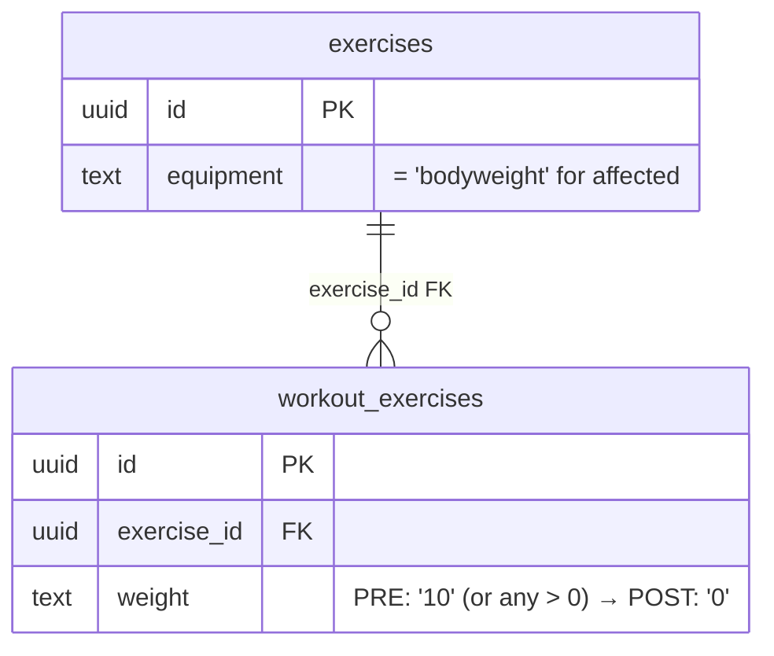
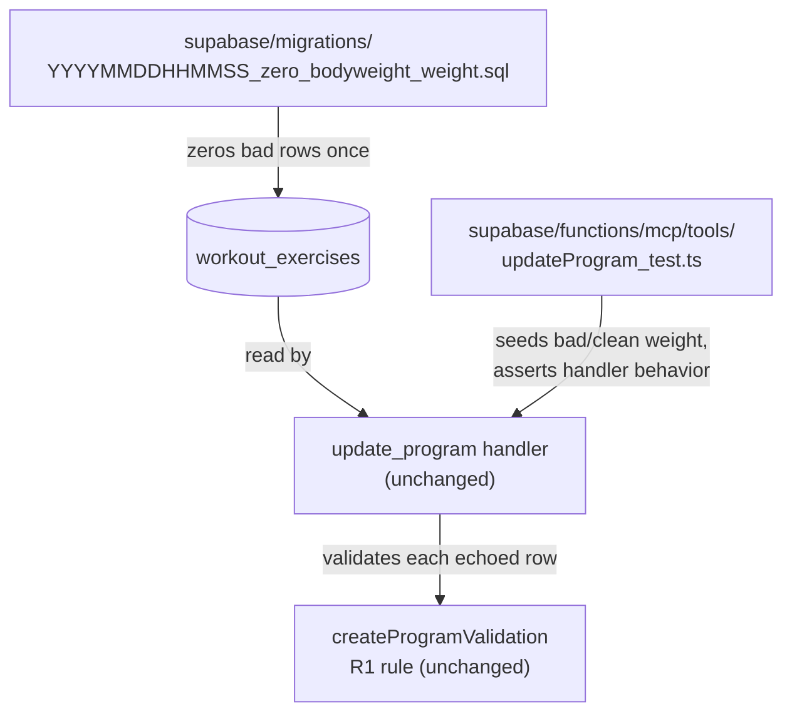

# Tech Plan — Bodyweight weight_kg Migration #320

**Source:** GitHub issue [#320](https://github.com/PierreTsia/workout-app/issues/320). No standalone Epic Brief — the issue body is the brief.

## Architectural Approach

Two-part fix:

1. **Idempotent SQL migration** that zeros out `workout_exercises.weight` for every prescription row whose linked exercise is currently `equipment = 'bodyweight'` and whose stored weight casts to a positive number.
2. **Bug-shaped Deno integration test** in `file:supabase/functions/mcp/tools/updateProgram_test.ts` that proves the handler rejects a verbatim echo of a dirty row (pre-migration shape) and accepts the same echo once the row is clean (post-migration shape).

No code changes to the validator (R1 is correct), no changes to `update_program`'s declarative-echo design (T81/#280), no schema-level CHECK constraint (out of scope; current invariant lives in the API-layer validator).

### Key Decisions

| Decision | Choice | Rationale |
|---|---|---|
| Fix strategy (Option A vs B vs C from issue) | **Option A — one-time data migration** | Issue's stated preference. Fixes the data inconsistency at the source instead of papering over it at the read site. Aligns with the principle that invariants belong in the data, not in lazy validation skips. |
| SQL shape | `UPDATE workout_exercises SET weight = '0' FROM exercises WHERE workout_exercises.exercise_id = exercises.id AND exercises.equipment = 'bodyweight' AND workout_exercises.weight::numeric > 0` | Single statement, race-free inside the migration transaction. Idempotent — re-runs on a clean DB match zero rows. |
| Cast safety | `weight::numeric > 0` (unguarded) | Schema is `weight text NOT NULL DEFAULT '0'`, persisted by `createProgram.ts` as stringified numbers. Pre-migration audit (see Constraints) confirms safety; if any non-numeric value exists, fall back to a regex-guarded WHERE. |
| Migration scope | R1 only (bodyweight + weight > 0). NOT R3 (duration + weight > 0). | Issue scopes itself to R1. R3 is the same shape of bug but no concrete report yet — defer until needed. Avoids speculative widening. |
| Stretch acceptance criterion (validator regression test) | **Treat as DONE** | Already covered at `file:supabase/functions/mcp/lib/createProgramValidation.test.ts:354` ("R1: REJECTS bodyweight + weight_kg > 0 and references issue #281"). |
| E2E validation strategy | Deno integration test in `updateProgram_test.ts` + manual prod verification of the failing prompt | Integration test catches handler-level regression; manual rerun of the original prompt confirms the migration applied to real data. The migration SQL itself is too trivial to warrant a SQL test harness. |

### Critical Constraints

**Schema reality check.** The issue's repro SQL references `program_day_exercises.weight_kg` — neither name exists. Actual schema:

- Table: `workout_exercises` (`file:supabase/migrations/20240101000003_create_workout_exercises.sql`)
- Column: `weight text NOT NULL DEFAULT '0'` — **stored as text**, not numeric
- FK: `workout_exercises.exercise_id → exercises.id`
- `exercises.equipment` is `text`, default `'bodyweight'` (`file:supabase/migrations/20240101000007_add_exercise_library_columns.sql`)

**Cast assumption.** `weight::numeric` is safe iff every existing value parses as a number. Persistence at `file:supabase/functions/mcp/tools/createProgram.ts` writes `String(weightKg)` for object-form prescriptions and `'0'` for bare-UUID defaults. **Pre-migration audit step (mandatory):**

```sql
SELECT DISTINCT weight FROM workout_exercises WHERE weight !~ '^[0-9]+(\.[0-9]+)?$';
```

- Empty result → unguarded cast is safe.
- Non-empty → guard the WHERE clause with the regex match before casting.

**No coupling to the validator.** Migration runs in DB; validator runs in Edge Function. The fix relies on the invariant being **already enforced at the API layer for new writes** (`R1` in `validateExerciseCrossFields`) — so once historical data is clean, no new bad rows can be introduced through the MCP. SPA write paths and direct SQL are out of scope for this ticket.

**Lossy by design.** A row originally written as `weight: "10"` on a bodyweight exercise becomes `weight: "0"`. The original value was non-actionable (the in-app renderer ignores weight on bodyweight exercises) and arguably already "lost" semantically — surfacing it as `0` matches the rendering and unblocks the MCP flow.

---

## Data Model

No schema changes. The migration only mutates rows.

### Affected rows (visualized)



### Pre-migration audit query

```sql
SELECT we.id, we.weight, e.name, e.equipment
FROM workout_exercises we
JOIN exercises e ON e.id = we.exercise_id
WHERE e.equipment = 'bodyweight'
  AND we.weight::numeric > 0
ORDER BY we.id;
```

### Post-migration verification query

Same query as above. Expected result: zero rows.

---

## Component Architecture

### Layer Overview



### New Files & Responsibilities

| File | Purpose |
|---|---|
| `supabase/migrations/{timestamp}_zero_bodyweight_weight.sql` | One-shot UPDATE zeroing `workout_exercises.weight` where the linked exercise is bodyweight and weight > 0. Header comment links to issue #320 and explains the bug it patches. |

### Modified Files

| File | Change |
|---|---|
| `supabase/functions/mcp/tools/updateProgram_test.ts` | Add ~2 test cases under a new `Deno.test` block (or a single test with two arrange-act-assert phases) covering the bug confirmation and fix confirmation. |

### Component Responsibilities

**Migration SQL**
- Single transactional `UPDATE ... FROM exercises WHERE ...`.
- Header comment with issue reference and one-line summary of the bug.
- Idempotent — running on already-clean data is a no-op (zero rows matched).
- No PL/pgSQL, no DO blocks, no row-level loops — keep it boring.

**Integration tests in `updateProgram_test.ts`**
- Reuse existing fixtures (`PUSHUP` already has `equipment: "bodyweight"`, mock supports arbitrary `weight` strings).
- **Test (a) — bug confirmation:** seed a `workout_exercises` row with `exercise_id: ID_PUSHUP`, `weight: "10"`. Call `updateProgram` with a verbatim echo of the day. Assert response is a structured validation error whose message contains `bodyweight`, `weight_kg`, and `#281`. This is the failing path the bug report describes.
- **Test (b) — fix confirmation:** same setup but seed `weight: "0"`. Call `updateProgram` with the same echo. Assert response has `dry_run` success shape (or non-error result) — the echo flows through.
- Both tests run with `dry_run: true` so they don't exercise the writer. The bug is in validation, which fires identically in dry-run and live mode.

### Failure Mode Analysis

| Failure | Behavior |
|---|---|
| Audit reveals non-numeric `weight` values | Switch migration WHERE clause to `weight ~ '^[0-9]+(\.[0-9]+)?$' AND weight::numeric > 0`. Document the discovery in the migration header. |
| Migration runs twice | Second run matches zero rows. No-op. Safe by construction. |
| New bodyweight prescription with `weight > 0` arrives via the MCP after migration | Rejected by R1 at the API layer — system stays clean. |
| New bodyweight prescription with `weight > 0` arrives via SPA or raw SQL | Out of scope. R1 enforcement at validator level is the only invariant. If this becomes a problem, escalate to a DB-level CHECK constraint as a follow-up. |
| Test (a) passes but test (b) fails | Means the handler rejects clean echoes too — would indicate a different bug in `update_program`, unrelated to the data fix. Surface and stop. |
| `weight` column type changes in a future migration to `numeric` | Migration still works under both types (`'0'::numeric > 0` and `0 > 0` both behave correctly). Future-proof enough. |

---

## Execution Order

1. Run the audit query against the local/staging DB. Confirm zero non-numeric `weight` values (or pivot to regex-guarded WHERE).
2. Write the migration file.
3. Apply locally (`npx supabase db push` or equivalent) and verify with the post-migration query → zero rows.
4. Add the two integration tests. Run the Deno test suite. Both pass.
5. Manual e2e: rerun the original failing prompt against the affected program in the staging environment. `update_program(dry_run)` should succeed without the bodyweight error.
