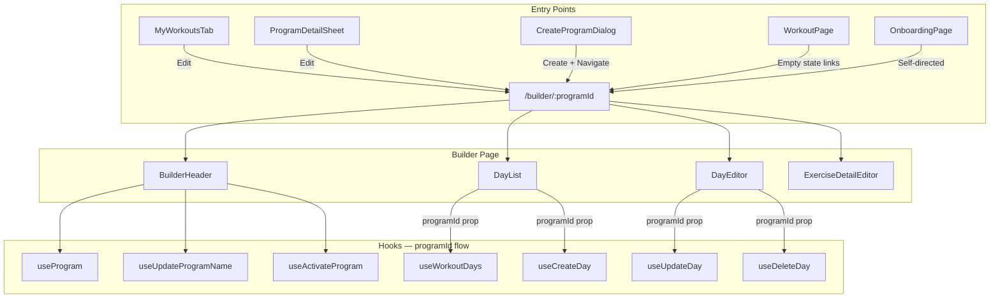

# Tech Plan — Builder-Library Unification

## Architectural Approach

### Key Decisions

| Decision | Choice | Rationale |
|---|---|---|
| Hook parameterization | Required `programId` param, no atom fallback | Clean API, explicit dependency, no ambiguity. Minor churn in WorkoutPage — reads atom, passes to hook. |
| Create Program implementation | Dedicated `useCreateProgram` hook | Consistent with existing patterns (`useActivateProgram`, `useArchiveProgram`). Reusable. |
| Builder program data | New `useProgram(programId)` query hook | Single-row fetch by PK. `useUserPrograms` fetches all programs — wasteful for a single lookup. |
| Rename | New `useUpdateProgramName` mutation hook | Simple update, invalidates `["program", id]` + `["user-programs"]`. |
| Origin tracking | React Router `state` with `/library` fallback | No new atoms, no URL pollution. State survives in-tab refreshes. Lost on tab close/reopen — `/library` fallback is acceptable. |
| `programId` propagation in Builder | Prop drilling from BuilderPage | Only 2–3 levels deep. Context provider would be over-engineering. |

### Critical Constraints

**`useWorkoutDays` is a shared hook**: both Builder (via `DayList`) and WorkoutPage call it. The refactor changes its signature from `useWorkoutDays()` to `useWorkoutDays(programId)`. All callers must be updated atomically to avoid runtime errors. This constrains ticket splitting — the hook refactor and all caller updates must ship together.

**Builder mutation hooks share cache invalidation pattern**: `["workout-days", userId, programId]`. After refactor, `programId` in the cache key comes from the hook parameter, not the atom. This correctly scopes invalidation: editing Program A in the Builder doesn't invalidate WorkoutPage's cache for Program B. However, if `programId` is accidentally omitted from a mutation hook call, the mutation still executes (it updates/deletes by row `id`) but cache invalidation silently breaks — stale UI with no error. Needs explicit test coverage.

**OnboardingGuard** ensures `hasProgramAtom` is true before granting access to AppShell routes. So `activeProgramIdAtom` is always set when WorkoutPage renders. Empty-state Builder links always have a valid `activeProgramId` — though a defensive null-check is prudent.

---

## Data Model

No schema migrations needed. The existing `programs` table supports all requirements:

```sql
-- Existing table, no changes
CREATE TABLE programs (
  id          uuid DEFAULT gen_random_uuid() PRIMARY KEY,
  user_id     uuid REFERENCES auth.users NOT NULL,
  name        text NOT NULL,
  template_id uuid REFERENCES program_templates,  -- nullable for custom programs
  is_active   boolean DEFAULT false,
  archived_at timestamptz,                          -- nullable, null = not archived
  created_at  timestamptz DEFAULT now()
);
```

An empty custom program is a row with `template_id = null` and no related `workout_days`.

### Query Key Inventory

Cache keys affected by this refactor:

| Key | Current owner | Change |
|---|---|---|
| `["workout-days", userId, programId]` | `useWorkoutDays`, builder mutations | `programId` sourced from param instead of atom |
| `["program", programId]` | New: `useProgram` | New key |
| `["user-programs"]` | `useUserPrograms`, `useActivateProgram`, `useArchiveProgram` | Also invalidated by `useCreateProgram`, `useUpdateProgramName` |
| `["workout-exercises", dayId]` | `useWorkoutExercises`, exercise mutations | **Unchanged** — no `programId` dependency |

---

## Component Architecture

### Layer Overview



### New Files & Responsibilities

| File | Purpose |
|---|---|
| `src/hooks/useProgram.ts` | Fetch single program by ID (name, is_active, archived_at) for Builder header |
| `src/hooks/useCreateProgram.ts` | Insert empty program row, return ID, invalidate `["user-programs"]` |
| `src/hooks/useUpdateProgramName.ts` | Update `programs.name`, invalidate `["program", id]` + `["user-programs"]` |
| `src/components/library/CreateProgramDialog.tsx` | Name prompt dialog; calls `useCreateProgram`, navigates to `/builder/:id` on success |
| `src/components/builder/BuilderHeader.tsx` | Header: program name (tappable rename), activate action, origin-aware back, save indicator |

### Modified Files

| File | Change |
|---|---|
| `file:src/hooks/useWorkoutDays.ts` | Signature: `useWorkoutDays()` → `useWorkoutDays(programId: string \| null)`. Remove `activeProgramIdAtom` import. |
| `file:src/hooks/useBuilderMutations.ts` | Add `programId` param to `useCreateDay`, `useUpdateDay`, `useDeleteDay`, `useReorderDays`. Remove atom reads. Exercise hooks unchanged. |
| `file:src/pages/BuilderPage.tsx` | Read `useParams<{ programId: string }>()`. Fetch program via `useProgram`. Pass `programId` to children. Render `BuilderHeader`. Error state for invalid ID. |
| `file:src/pages/WorkoutPage.tsx` | Import `activeProgramIdAtom`, read via `useAtomValue`. Pass to `useWorkoutDays(activeProgramId)`. Update `Link` URLs to `` `/builder/${activeProgramId}` ``. Pass `{ state: { from: "/" } }`. |
| `file:src/components/library/ProgramCard.tsx` | Add `onEdit` prop + "Edit" button. Hidden when `program.archived_at !== null`. |
| `file:src/components/library/ProgramDetailSheet.tsx` | Add "Edit" button. Disabled for archived programs. Navigate to `/builder/:programId` with `{ state: { from: "/library" } }`. |
| `file:src/components/library/MyWorkoutsTab.tsx` | Add "Create Program" button at top. Wire to `CreateProgramDialog`. Pass `onEdit` handler to `ProgramCard` (navigate to `/builder/:id`). |
| `file:src/components/SideDrawer.tsx` | Remove `<Link to="/builder">` nav item. Keep History, Library, Admin, About. |
| `file:src/router/index.tsx` | `path: "/builder"` → `path: "/builder/:programId"`. |
| `file:src/pages/OnboardingPage.tsx` | `navigate("/builder", { replace: true })` → `` navigate(`/builder/${programId}`, { replace: true, state: { from: "/onboarding" } }) `` in `handleSelfDirected` and `handleSkipTemplate`. |
| `file:src/components/builder/DayList.tsx` | Accept `programId` prop. Pass to `useWorkoutDays(programId)` and `useCreateDay(programId)`. |
| `file:src/components/builder/DayEditor.tsx` | Accept `programId` prop. Pass to `useUpdateDay(programId)` and `useDeleteDay(programId)` for cache invalidation. |
| `e2e/builder-crud.spec.ts` | Update `page.goto("/builder")` → `/builder/${id}`. Add program creation to test fixture. |
| `e2e/feedback.spec.ts` | Same pattern. |
| `docs/PRD.md` | Route table: `/builder` → `/builder/:programId`. |

### i18n Additions

**`src/locales/en/library.json`** — new keys:
- `createProgram`: "Create Program"
- `programName`: "Program name"
- `programNamePlaceholder`: "My Program"
- `editProgram`: "Edit"

**`src/locales/fr/library.json`** — French equivalents:
- `createProgram`: "Créer un programme"
- `programName`: "Nom du programme"
- `programNamePlaceholder`: "Mon programme"
- `editProgram`: "Modifier"

**`src/locales/en/builder.json`** — new keys:
- `activateProgram`: "Activate"
- `renameProgram`: "Rename"
- `invalidProgram`: "Program not found"
- `goToLibrary`: "Go to Library"
- `programActivated`: "Program activated"

**`src/locales/fr/builder.json`** — French equivalents:
- `activateProgram`: "Activer"
- `renameProgram`: "Renommer"
- `invalidProgram`: "Programme introuvable"
- `goToLibrary`: "Aller à la bibliothèque"
- `programActivated`: "Programme activé"

### Component Responsibilities

**`BuilderHeader`**
- Displays program name from `useProgram` query
- Tap name → inline edit mode (input field, save on blur/Enter, cancel on Escape via `useUpdateProgramName`)
- "Activate" button when `program.is_active === false` → renders `ActivateConfirmDialog` on click (includes in-flight session guard)
- Back button: reads `location.state?.from`, navigates there; falls back to `/library`
- Renders `SaveIndicator` (moved from current `BuilderPage` inline header)

**`CreateProgramDialog`**
- Controlled by `open`/`onOpenChange` props
- Single text input, default "My Program", trimmed on submit
- Client-side validation: non-empty after trim (DB column is `NOT NULL` but empty string would pass — bad UX)
- "Create" → calls `useCreateProgram`, on success navigates to `/builder/${id}` with `{ state: { from: "/library" } }`
- Button disabled while pending, error toast on failure

**`useProgram(programId: string | null)`**
- Query key: `["program", programId]`
- Fetches `id, name, is_active, archived_at, template_id, created_at` from `programs` by PK
- Enabled when `programId` is truthy
- Returns `null`/error for invalid IDs — RLS blocks unauthorized access (query returns no rows, Supabase `.single()` throws PGRST116)
- Used by `BuilderHeader` and `BuilderPage` error state

**`useCreateProgram()`**
- Inserts `{ user_id, name, is_active: false, template_id: null }` into `programs`
- Returns the new program's `id`
- Invalidates `["user-programs"]` so Library refreshes on next visit

**`useUpdateProgramName()`**
- Mutation args: `{ programId: string, name: string }`
- Updates `programs.name` where `id = programId`
- Invalidates `["program", programId]` + `["user-programs"]`

### Failure Mode Analysis

| Failure | Behavior |
|---|---|
| Invalid/non-existent `programId` in URL | `useProgram` returns no data → Builder renders error state with "Go to Library" link |
| Another user's `programId` in URL | RLS blocks query → same error state |
| Create Program insert fails (network/RLS) | Toast error, dialog stays open, user can retry |
| Rename fails (network) | Toast error, name reverts to previous value (React Query mutation rollback) |
| Activate from Builder fails | `ActivateConfirmDialog` handles error via existing `useActivateProgram` error path |
| `activeProgramIdAtom` is null on WorkoutPage | Should not happen past OnboardingGuard. Defensive: conditionally render Builder links |
| Route state lost (tab close/reopen) | Back button falls back to `/library` |
| DayList with 0 days (new empty program) | Verify existing `DayList` empty state has "Add your first day" CTA; add if missing |
| `programId` omitted from mutation hook | Mutation executes (updates by row ID) but cache invalidation breaks — stale day list. Mitigated by TypeScript requiring the param. |
| OnboardingGuard race after program creation | `useGenerateProgram` sets `hasProgramAtom` in `onSuccess` before navigate — should resolve before guard evaluates. Verify timing. |
