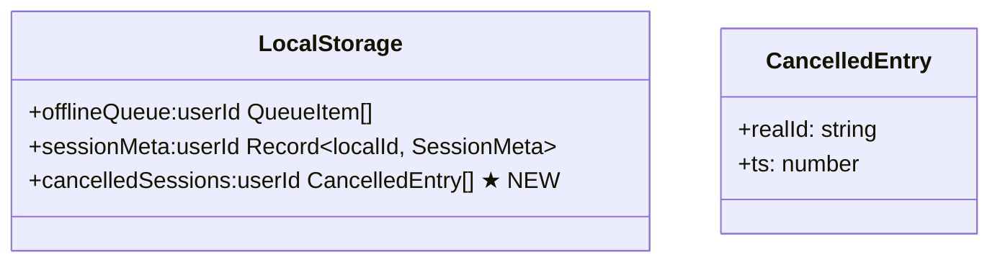
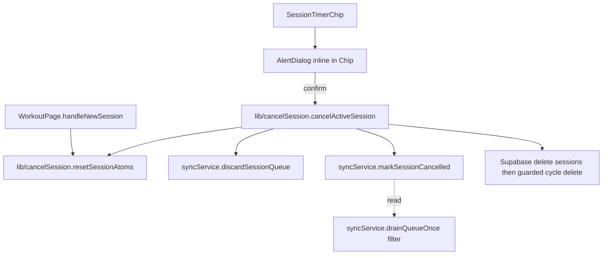

# Tech Plan — Cancel Active Session

> Source issue: [#270](https://github.com/PierreTsia/workout-app/issues/270)
> No Epic Brief — feature is small enough that the issue itself is the spec.

## Architectural Approach

A new icon button next to the Pause toggle in `SessionTimerChip` opens a confirmation `AlertDialog`. Confirming calls a pure orchestrator `cancelActiveSession()` that wipes the session in three layers: jotai/localStorage atoms, the offline sync queue, and Supabase rows (best-effort). A localStorage **deny-list** prevents any later drain from re-pushing the cancelled session if cancel happened offline.

### Key Decisions

| Decision | Choice | Rationale |
|---|---|---|
| Cancel orchestrator location | New pure module `src/lib/cancelSession.ts`, no React | Chip is in `AppShell`, can't reach `WorkoutPage` locals. Mirrors `syncService` pattern. Easy to unit-test. |
| Dialog placement | Inline `AlertDialog` inside `SessionTimerChip` with local `useState` | Matches `PausedWorkoutAlertDialog`. The chip already owns visibility logic. |
| Reset helper location | `resetSessionAtoms()` exported from `src/lib/cancelSession.ts`; `WorkoutPage.handleNewSession` imports it | One source of truth for "no active session" shape. |
| Server delete shape | Single `delete from sessions where id=:realId and user_id=:uid` | `set_logs.session_id` has `ON DELETE CASCADE` (`file:supabase/migrations/20240101000005_create_set_logs.sql`). Two-step delete from issue is unnecessary. |
| Cycle cleanup SQL | `delete from cycles where id=:cid and finished_at is null and not exists(select 1 from sessions where cycle_id=:cid)` | Atomic race-safe single round-trip. |
| Sync queue surgery | Export `discardSessionQueue`, `markSessionCancelled`, `pruneCancelledSessions` from `src/lib/syncService.ts`; filter deny-list inside `drainQueueOnce` | Co-located with queue logic. |
| Deny-list shape | localStorage `cancelledSessions:${userId}` storing `{ realId, ts }[]` | Survives reload (offline-cancel → reopen → drain must skip). |
| Deny-list TTL | Drop entries older than 7 days at every drain | Covers realistic offline-to-online windows; bounds growth. |
| Drain reaction to deny-list | Drop matching queue items **permanently** | TTL handles deny-list cleanup; keeping items around is paranoia overshooting. |
| i18n key style | Dotted namespace `cancelDialog.*` | Consistent with existing `preSession.*`, `historySheet.*`, `cycleSummary.*` in `workout.json`. |
| Test surface | Unit (cancel module, syncService additions) + chip interaction + E2E happy path | Aligned with issue's acceptance criteria. |

### Critical Constraints

**Race with in-flight drain.** `drainQueueOnce` snapshots the queue then processes async; cancel may fire mid-flight. We can't pre-empt the in-flight run. Mitigation: cancel writes the deny-list **synchronously first**, then awaits queue discard, then awaits the Supabase delete. The serializer `drainChain` (`file:src/lib/syncService.ts`) chains future drains after the in-flight one, so any subsequent drain sees the deny-list and skips. The in-flight drain may still upsert a `sessions` row before our delete lands — the explicit delete catches that exact case. Net effect: row may briefly exist on server, gets deleted within milliseconds.

**No `realSessionId` yet.** Until the first `enqueueSetLog` or `enqueueSessionFinish` runs, `sessionMeta:${userId}` has no entry for the local session id. Cancel must tolerate this: look up `realSessionId` from `sessionMeta`; if absent, skip queue/Supabase/cycle steps and only do the local atom reset.

**Offline tolerance.** Supabase deletes will fail with no network. Wrap in `try/catch` and never let them abort the flow. Local reset + queue discard + deny-list write must always succeed. Drain on next online event will see the deny-list and skip the queued items, so no zombie session ever lands.

**Reset symmetry.** `handleNewSession` in `file:src/pages/WorkoutPage.tsx` does atom reset + local React state cleanup (`finishedQuickInfo`, `finishedStats`, `finished`, `prFlags`, `sessionBestPerformance`) + optional navigation. Those locals are only meaningful **after** finish; during an active session they're already in their initial state. So `cancelActiveSession()` only needs the atom/localStorage subset that `resetSessionAtoms()` covers.

**`isQuickWorkoutAtom` reset.** Currently reset only inside `finishSession` in `file:src/pages/WorkoutPage.tsx`. Cancel must reset it too — otherwise a cancelled quick workout leaves the app in an inconsistent quick-mode state. Added to `resetSessionAtoms()`. `handleNewSession` will also call this helper, which means it will start resetting `isQuickWorkoutAtom` too — no behavior change since it's already false at that point but a one-line consistency win.

**versionManager allow-list.** `cancelledSessions:${userId}` must be added to the preserved-keys check in `file:src/lib/versionManager.ts` so a deploy mid-cancel doesn't wipe the deny-list.

---

## Data Model

No schema changes. Only a new localStorage key.

### Table Notes

- **`cancelledSessions:${userId}`**: append on cancel (`{ realId, ts: Date.now() }`), pruned at the start of every `drainQueueOnce` run (entries with `ts < now - 7 days` removed). Read inside `drainQueueOnce` to filter session groups before `ensureSession` is called.

---

## Component Architecture

### Layer Overview

### New Files & Responsibilities

| File | Purpose |
|---|---|
| `src/lib/cancelSession.ts` | Pure orchestrator: `resetSessionAtoms()` + `cancelActiveSession()`. No React imports. |
| `src/lib/cancelSession.test.ts` | Unit tests: reset clears all fields; cancel calls discard + mark + Supabase delete with the right args; offline path doesn't throw; no-op when no `realSessionId`. |

### Modified Files

| File | Change |
|---|---|
| `src/components/SessionTimerChip.tsx` | Add Cancel icon button (`X` from `lucide-react`, destructive hover) + `AlertDialog`. Wire confirm to `void cancelActiveSession()`. Same visibility condition as the pause toggle. |
| `src/components/SessionTimerChip.test.tsx` | New tests: button visible only during active session, dialog opens on click, confirm calls cancel. |
| `src/lib/syncService.ts` | Export `discardSessionQueue`, `markSessionCancelled`, `pruneCancelledSessions`. Add deny-list read + drop in `drainQueueOnce`. |
| `src/lib/syncService.test.ts` | New tests: `discardSessionQueue` removes only matching items; `markSessionCancelled` writes localStorage; drain drops queue items for deny-listed session ids; TTL pruning works. |
| `src/pages/WorkoutPage.tsx` | Replace inline reset block (current `handleNewSession`) with `resetSessionAtoms()` call. Keep local React state cleanup + navigation as-is. |
| `src/lib/versionManager.ts` | Add `cancelledSessions:` prefix to the preserved-keys allow-list. |
| `src/locales/en/workout.json` | Add `cancelWorkout`, `cancelDialog.title`, `cancelDialog.description`, `cancelDialog.keep`, `cancelDialog.discard`. |
| `src/locales/fr/workout.json` | Same keys, FR translations. |
| `e2e/workout-session.spec.ts` | New E2E spec: start session → log a set → cancel → confirm → verify session not in history. |

### Component Responsibilities

**`cancelSession.ts`**
- `resetSessionAtoms()`: pure, uses `getDefaultStore()`. Writes:
  - `sessionAtom` to the full reset shape (`{ currentDayId: null, activeDayId: null, exerciseIndex: 0, setsData: {}, startedAt: null, isActive: false, totalSetsDone: 0, pausedAt: null, cycleId: null, accumulatedPause: 0 }`)
  - `restAtom` to `null`
  - `isQuickWorkoutAtom` to `false`
  - `preSessionPatchAtom` to `emptyPreSessionPatch()`
  - calls `clearSessionExercisePatchStorage()`
- `cancelActiveSession()`: async.
  1. Read `sessionAtom` + `authAtom`. If `!session.isActive` or `!user`, return early.
  2. Compute `localSessionId = local-${session.startedAt}`. Look up `realSessionId` from `sessionMeta:${userId}`.
  3. Capture `cycleId = session.cycleId` for later cleanup.
  4. If `realSessionId` exists:
     - `markSessionCancelled(realSessionId)` (sync)
     - `discardSessionQueue(realSessionId)` (sync)
     - try Supabase `delete from sessions where id=:realId and user_id=:uid`; swallow errors.
     - if `cycleId`: try the guarded `delete from cycles ...` SQL; swallow errors.
  5. `resetSessionAtoms()`.
  6. Invalidate React Query keys via `queryClient`: `["sessions"]`, `["active-cycle"]`, `["cycle-sessions"]`, `["sessions-date-range"]`, `["training-activity-by-day"]`.

**`syncService.ts` additions**
- `discardSessionQueue(realSessionId: string)`: remove queue items where `realSessionId === target`, write back, update `pendingCount`. Also delete the matching key from `sessionMeta:${userId}`.
- `markSessionCancelled(realSessionId: string)`: append `{ realId, ts: Date.now() }` to `cancelledSessions:${userId}`.
- `pruneCancelledSessions(userId: string)`: drop entries where `ts < Date.now() - 7 * 24 * 3600 * 1000`. Called at the start of `drainQueueOnce`.
- `drainQueueOnce` change: after `pruneCancelledSessions` and `groupBy`, drop session groups whose `realSessionId` is in the deny-list (also remove those queue items so they don't survive across drains).

**`SessionTimerChip.tsx`**
- New `useState` `dialogOpen` for AlertDialog.
- New ghost icon button (`X` icon, `h-7 w-7 rounded-full text-destructive hover:bg-destructive/20 hover:text-destructive`, `aria-label={t("cancelWorkout")}`). Same render condition as the pause toggle.
- AlertDialog with `t("cancelDialog.title")`, `t("cancelDialog.description")`, `AlertDialogCancel` = `t("cancelDialog.keep")`, `AlertDialogAction` = `t("cancelDialog.discard")` styled destructive. On action click: `void cancelActiveSession()` then close.

### Failure Mode Analysis

| Failure | Behavior |
|---|---|
| Cancel before any set logged (no `realSessionId`) | Local atoms reset; no queue items, no server delete, no deny-list entry. Clean. |
| Offline at cancel time | Local reset + discard + deny-list succeed. Supabase delete fails silently. Next online drain sees deny-list, drops queue items permanently, never pushes the row. |
| In-flight drain races cancel | Deny-list set first → next drain skips. In-flight drain may upsert a session row before delete lands → explicit delete catches it within ms. |
| User cancels then immediately starts a new session | New `local-${startedAt}` → new `realSessionId` → no collision with deny-list. |
| Cancel while paused | Same flow — `pausedAt`/`accumulatedPause` blown away by `resetSessionAtoms()`. |
| Quick workout cancel | `isQuickWorkoutAtom` reset to false alongside everything else. |
| Cycle cleanup network/RLS error | Swallowed — cycle stays around (harmless empty cycle). |
| Cycle cleanup race (another session inserted into same cycle between cancel decision and DB delete) | Guarded SQL `not exists(select 1 from sessions where cycle_id=:cid)` makes the delete a no-op. Cycle stays. Correct. |
| Spam-click Cancel | `cancelActiveSession()` returns early if `!session.isActive`. Idempotent. |

---

## Acceptance Criteria

Reproducing the issue's checklist for traceability:

- [ ] Cancel button rendered next to Pause toggle, only when session is active.
- [ ] Confirm modal blocks accidental cancels and clearly warns about data loss.
- [ ] On confirm, local state is fully reset (no leftover sets, no leftover timer).
- [ ] Pending sync queue items for the cancelled session are discarded.
- [ ] If session/set_log rows already exist on Supabase, they are deleted (single delete + CASCADE).
- [ ] Cancelled-session id is denied from any future drain attempts (offline-safe), with TTL-based pruning.
- [ ] After cancel, user lands back on the day picker (same UX as `handleNewSession`), able to start a fresh session.
- [ ] EN + FR translations added for: button aria-label, modal title, modal description, primary button, secondary button.
- [ ] Unit tests: reset helper clears all session fields; `discardSessionQueue` removes only matching items; cancel triggers Supabase deletes with the right `session_id` (mocked); deny-list TTL pruning works.
- [ ] E2E happy path in `e2e/workout-session.spec.ts`: start session → log a set → cancel → confirm → no session in history.
- [ ] Cycle cleanup (best-effort, race-safe) for sessions that were the only one in a fresh cycle.

---

## References

- Issue: [#270](https://github.com/PierreTsia/workout-app/issues/270)
- Related cycle concern: [#249](https://github.com/PierreTsia/workout-app/issues/249) (informed the cycle-cleanup choice)
- Existing patterns referenced: `file:src/components/workout/PausedWorkoutAlertDialog.tsx`, `file:src/lib/syncService.ts`, `file:src/pages/WorkoutPage.tsx`, `file:supabase/migrations/20240101000005_create_set_logs.sql`
