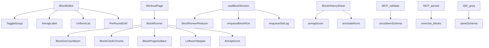

# Tech Plan — Circuit AMRAP (#474)

> Implements `file:docs/Epic_Brief_—_Circuit_AMRAP_#474.md`. Architectural decision: `file:docs/adr/0014-amrap-mode-and-block-runs.md`. Glossary: `file:docs/CONTEXT.md` (**AMRAP**, **Tours**, **Block Run**, **Round Screen**). Amends ADR 0008 **for AMRAP only** (persisted cap clock); **Tours** completion time stays derived.

## Architectural Approach

### Key Decisions

| Decision | Choice | Rationale |
|---|---|---|
| Terminaison | `exercise_blocks.mode` `'rounds' \| 'amrap'` + `cap_seconds` nullable | Discriminant additif ; défaut `'rounds'` = Zeus inchangé |
| `rounds` en AMRAP | Reste `NOT NULL = 1` | CHECK actuel ; `1` = longueur du template `per_round` |
| Template | `per_round.length === 1` en AMRAP ; cloné à l’exécution | Pyramide interdite ; `per_round[round]` → fallback `[0]` |
| Run persisté | Table **`block_runs`** + item de queue `block_run` | GO avant le 1er log ; snapshot cap/template ; kill-app ; offline comme `set_logs` |
| Tours GO | Mémoire seulement | Elapsed = display ; historique ADR 0008 dérivé |
| Reducer | Étendre `blockRunnerReducer` (`mode`, TIME, TERMINATE) | Un **Round Screen**, pas un fork |
| Leftover | Dérivé des `set_logs` (round en lambeaux) | Une source de vérité ; `block_runs` = started/finished/fingerprint only |
| Fingerprint AMRAP | `template_fingerprint` snapshot au GO | Les logs n’ont ni cap ni `prescribed_*` (ADR 0007) |
| Completeness Tours | `isRunComplete` **inchangé** | Rectangle plein ; ne pas l’assouplir |
| Completeness AMRAP | `finished_at IS NOT NULL` | TIME/Terminer ; Annuler = DELETE row |
| Copy | `AmrapLabel` / `AmrapScore` obligatoires | « Jamais nu » structurel |
| MCP | `mode` omis = rounds ; `cap_minutes` 1–60 ; nested flat only | ADR 0011 additif ; rejects nets |
| Générateurs | Même schema ; intent list fermée | Lockstep Groq/Gemini/MCP |
| Builder mode | `ToggleGroup` shadcn **Tours \| AMRAP** | Primitive existante (`file:src/components/ui/toggle-group.tsx`) |

### Critical Constraints

- **`isRunComplete` / `runFingerprint`** (`file:src/lib/blockCompletionHistory.ts`) : un `27+3` est un rectangle troué. Brancher `amrapScore()` ; **ne pas** toucher les helpers Tours. Sinon les PB Zeus cassent.
- **`blockRunnerReducer` LOG_AND_ADVANCE** (`file:src/lib/blockRunner.ts`) : `round < ctx.rounds - 1` sinon `done`. En AMRAP `rounds === 1` → **done après le 1er tour** si on oublie `mode`. Le ctx porte `mode` ; en `amrap`, dernier exo du tour → tour+1, jamais `done` (sauf TIME/TERMINATE). **Ne pas** mettre `rounds: Infinity` : `GO_BACK` depuis `done` fait `{ round: ctx.rounds - 1 }` et casserait. AMRAP : `GO_BACK` depuis leftover/`done` → **dernière cellule loggée**, pas `rounds - 1`. `GO_TO` est typé et **non géré** aujourd’hui — l’hydratation kill-app ne peut pas s’y reposer ; dispatcher ou hydrater l’état initial.
- **`buildBlockSetLogPayload`** (`file:src/lib/blockSetLog.ts`) : `per_round[round]` undefined au tour 8. Helper `templateCell(be, round)` → AMRAP toujours `[0]`, Tours `[round]`. Leftover passe l’**actual** (aujourd’hui le payload écrit toujours le prescrit).
- **Mint session** : `enqueueBlockRun` appelle `resolveSessionMeta` comme `enqueueSetLog`. Le drain (`file:src/lib/syncService.ts`) `ensureSession` pour `block_run` **avant** l’upsert — GO peut être le premier item de queue.
- **Kill-app hydrate (trou actuel)** : `BlockRunner` / `useBlockRunner` sont `useState` — cursor et timers meurent au reload. `loggedCells` vient de `useSessionSetLogs` (DB) + optimistic ; **la queue `set_log` n’est pas mergée** au remount (`file:src/hooks/useBlockSession.ts`). Un `block_run` en queue sans merge = horloge OK, cursor à `(0,0)`. Story 19 exige : (1) `started_at` depuis queue puis DB, (2) merger les `set_log` queued dans `loggedCells`, (3) reposer le cursor sur la première cellule vide. `sessionAtom` (recommandation « cheapest ») est **rejetée** — pas de fingerprint, pas de MCP `27+3`, pas d’offline story 27 (ADR 0014).
- **Pause** : le cap chrome lit `started_at` wall-clock, **pas** `session.accumulatedPause` / `SessionTimerChip`.
- **Builder resize** : `useUpdateBlockMeta` (`file:src/hooks/useBlockMutations.ts`) resize **chaque** `per_round` à `block.rounds`. AMRAP ne passe **pas** par ce chemin ; `file:src/lib/perRound.ts` / `defaultPerRound` restent Tours-only. Switch de mode : `file:src/lib/blockTemplate.ts`.
- **MCP unknown keys** : `parseCircuitInput` ignore les clés inconnues aujourd’hui — `mode` / `cap_minutes` **silencieusement droppés** tant qu’ils ne sont pas parsés. `create_workout_day` **omits** le `oneOf` Circuit dans son inputSchema (le handler accepte déjà via `validateDayExercises`) — le fixer dans le lockstep, pas un follow-up.
- **MCP lockstep** : `circuitItemSchema.ts`, `createProgramValidation.ts`, `blockPersistence.ts` (edge), `daySequence.ts` / `daySequenceRead.ts`, `format.ts`, `applyDayUpdate.ts`, tools `createProgram` / `createWorkoutDay` / `updateProgram` / `getProgramDetails` / `getWorkoutHistory`, `_shared/programDraftSchema.ts` + `programDraft.ts`, Groq+Gemini QW + `validate.ts`, `draftPreviewItems.ts`, `PreviewCircuitCard`, `types/generator.ts`. History MCP n’a **pas** de Circuit Completion Time (ADR 0011 deferred) — `27+3` est une **ligne nouvelle**, pas un append à `active_duration_ms`.
- **Builder online-only** ; runner offline-first. `block_runs` suit la queue.
- **UNIQUE `(session_id, block_id)`** : Annuler → DELETE row + `discardBlockSetLogs` ; nouveau GO → UPSERT `started_at`.

---

## Data Model

```mermaid
classDiagram
  class exercise_blocks {
    uuid id
    text mode "rounds|amrap DEFAULT rounds"
    int cap_seconds "NULL unless amrap"
    int rounds "AMRAP = 1"
    int rest_seconds "AMRAP forced 0"
    int transition_seconds "AMRAP forced 0"
  }
  class block_exercises {
    jsonb per_round "AMRAP length 1"
  }
  class block_runs {
    uuid id
    uuid session_id
    uuid block_id
    timestamptz started_at
    timestamptz finished_at "NULL until TIME/Terminer"
    text mode
    int cap_seconds
    text template_fingerprint
  }
  class set_logs {
    uuid block_exercise_id
    int set_number "round 1-based, unbounded AMRAP"
    text reps_logged "leftover actual"
  }
  sessions ||--o{ block_runs : "one run per block"
  exercise_blocks ||--o{ block_runs : "snapshot at GO"
  exercise_blocks ||--o{ block_exercises : template
  block_exercises ||--o{ set_logs : cells
```

```sql
ALTER TABLE exercise_blocks
  ADD COLUMN mode text NOT NULL DEFAULT 'rounds'
    CHECK (mode IN ('rounds', 'amrap')),
  ADD COLUMN cap_seconds integer
    CHECK (cap_seconds IS NULL OR (cap_seconds >= 60 AND cap_seconds <= 3600));

ALTER TABLE exercise_blocks
  ADD CONSTRAINT exercise_blocks_mode_cap CHECK (
    (mode = 'rounds' AND cap_seconds IS NULL) OR
    (mode = 'amrap' AND cap_seconds IS NOT NULL)
  );

CREATE TABLE block_runs (
  id uuid PRIMARY KEY DEFAULT gen_random_uuid(),
  session_id uuid NOT NULL REFERENCES sessions(id) ON DELETE CASCADE,
  block_id uuid NOT NULL REFERENCES exercise_blocks(id) ON DELETE CASCADE,
  started_at timestamptz NOT NULL,
  finished_at timestamptz,
  mode text NOT NULL CHECK (mode IN ('rounds', 'amrap')),
  cap_seconds integer NOT NULL,
  template_fingerprint text NOT NULL,
  UNIQUE (session_id, block_id)
);
-- RLS via sessions.user_id (même chaîne que set_logs)
```

Queue (`file:src/lib/syncService.ts`) :

```ts
type QueueItemType = "set_log" | "session_finish" | "block_run"
```

### Table Notes

- **`mode` default `'rounds'`** : zéro backfill. Zeus reste Tours.
- **`cap_seconds` 60–3600** : UI / MCP minutes 1–60, ×60 à la persistance.
- **`block_runs` AMRAP only.** Tours n’écrit pas de row.
- **`template_fingerprint`** : `mode|cap_seconds|sorted(exercise_id:amount:weight)` calculé au GO depuis le template. 20 min ≠ 10 min.
- **Leftover** : round `R` complet = toutes les stations loggées (actual = template). Round suivant incomplet = leftover (actual du dernier log + nom de l’exo). `finished_at` dit « ça compte ».
- **Annuler** : DELETE `block_runs` + wipe logs.

---

## Component Architecture

### Layer Overview



### New Files & Responsibilities

| File | Purpose |
|---|---|
| `supabase/migrations/*_amrap_block_runs.sql` | `mode`, `cap_seconds`, `block_runs` + RLS |
| `docs/adr/0014-amrap-mode-and-block-runs.md` | Décision schéma + clock AMRAP |
| `src/lib/blockTemplate.ts` | `templateCell`, `templateFingerprint`, resize on mode switch |
| `src/lib/amrapScore.ts` | fullRounds + leftover + gloss + PB from logs + `block_runs` |
| `src/components/circuit/AmrapLabel.tsx` | `AMRAP {n} min` + gloss — seul moyen d’écrire le mot |
| `src/components/circuit/AmrapScore.tsx` | `27+3` + `27 tours · 3 pompes` |
| `src/components/workout/BlockGoCountdown.tsx` | 3-2-1-GO via `CountdownRing` |
| `src/components/workout/BlockClockChrome.tsx` | Cap descendant / elapsed montant ; ignore pause |
| `src/components/workout/LeftoverStepper.tsx` | `0…amount` reps ou secondes |
| `src/hooks/useBlockRun.ts` | Enqueue GO/finish ; hydrate queue + React Query |
| MCP `circuitItemSchema.ts` + `createProgramValidation.ts` + `format.ts` + daySequence read/write | Wire `mode` / `cap_minutes` ; echo ; `AMRAP 20 min` |
| MCP tools `createProgram` / `createWorkoutDay` / `updateProgram` / `getWorkoutHistory` | Schema `oneOf` Circuit (fix `createWorkoutDay`) ; score history |
| `_shared/programDraftSchema.ts` + `programDraft.ts` + QW Groq/Gemini/`validate.ts` | Lockstep + liste fermée + fixtures intent |
| i18n `builder` / `workout` / `history` + skill GymLogic | Gloss FR/EN |

### Component Responsibilities

`**AmrapLabel**`
- Rend exclusivement `AMRAP {minutes} min` + phrase d’aide. Pas de prop « hide gloss ».

`**AmrapScore**`
- Hero `27+3` + glose nommée (`27 tours · 3 pompes`). Seul renderer du score.

`**BlockEditor**`
- `ToggleGroup` Tours/AMRAP en tête. AMRAP : minutes 1–60 défaut 20 ; rest/transition non montés (0 au save). Tours : rest/transition + liste uniforme ; `PerRoundGrid` opt-in. Switch : template round 1 → length 1 + cap 20 ; inverse → rounds 3, propagate, rest 90.

`**BlockRunner**`
- Phases : `go` → `exercise` → leftover UI → `done`. AMRAP : pas de Skip station. TIME / Terminer → leftover stepper → `finished_at`. Annuler → discard + delete **Block Run**. Clock = chrome ; station = hero.

`**blockRunnerReducer**`
- `ctx.mode`. AMRAP : wrap de tour infini. Events `TIME` / `TERMINATE` sortent de `exercise` vers leftover (hook log l’actual, puis `done`). `GO_BACK` depuis leftover/`done` → dernière cellule loggée (Tours garde `rounds - 1`).

`**useBlockSession**`
- `onLog(cursor, actual?)`. GO : `enqueueBlockRun`. Hydrate : `started_at` queue→DB ; **merger** `set_log` queued dans `loggedCells` (trou actuel) ; cursor = première cellule vide. Pas de 2ᵉ GO si un **Block Run** existe pour `(session, block)`.

`**BlockProgressBars**`
- `roundTotal` optionnel. Absent → `Tour {n}` sans ratio ; barre exos inchangée.

`**amrapScore` / history**
- Tours : `annotateRuns` actuel. AMRAP : groupe `template_fingerprint`, PB = max (rounds, leftover), delta en tours. Jamais mixer les modes.

`**MCP**`
- Parser `mode` / `cap_minutes` explicitement (sinon drop silencieux). Reject `mode=amrap` + `rounds` / `per_round` / rest / transition. dry_run / details : `AMRAP 20 min`. History : ligne de score `27+3` glosée — **pas** via `sessions.active_duration_ms`. Skill : note CrossFit.

`**Générateurs**`
- `mode` + `cap_minutes` optionnels. Fixtures : Cindy/Holland/AMRAP/« autant de tours » → amrap ; « HIIT 20 min » / « 4 rounds » → rounds.

### Failure Mode Analysis

| Failure | Behavior |
|---|---|
| Kill-app à T+12:00 | `started_at` queue→DB ; chrome = cap − (now − started_at) ; cursor depuis logs **+ queue** ; pas de 2ᵉ GO |
| Kill-app avant le 1er Valider | Queue `block_run` seule (session mintée) ; clock restored, cursor `(0,0)` légitime |
| `GO_BACK` depuis leftover/`done` | Dernière cellule loggée — pas `ctx.rounds - 1` (= 0 en AMRAP) |
| Clé MCP `mode` non parsée | Drop silencieux aujourd’hui → parse explicite + reject unknown mode |
| Drain `block_run` sans session | `ensureSession` d’abord (même ordre que `set_log`) |
| Valider tour 1 avec `rounds=1` sans lire `mode` | Done immédiat — tests reducer wrap AMRAP |
| `per_round[7]` undefined | `templateCell` → `[0]` |
| Pause séance | Cap continue |
| Annuler | DELETE `block_runs` + wipe logs ; pas de score |
| Session finish sans Terminer | `finished_at` null → incomplet, pas de PB |
| Agent `mode` + `rounds` | Reject |
| Generator « HIIT 20 min » | Fixture → Tours |
| Cap 20 → 10 après 3 runs | Nouveau fingerprint ; rows passées gardent l’ancien snapshot |
| Deux AMRAP dans la séance | Deux `block_id` → deux rows |
| Tours existants | `mode='rounds'`, pas de `block_runs`, CCT inchangé |

---

## References

- Epic Brief : `file:docs/Epic_Brief_—_Circuit_AMRAP_#474.md`
- ADR : `file:docs/adr/0014-amrap-mode-and-block-runs.md` (amende `file:docs/adr/0008-circuit-completion-time-derived-not-scored.md` pour AMRAP only)
- Parents : #351, #396, #452. Pas #398.
