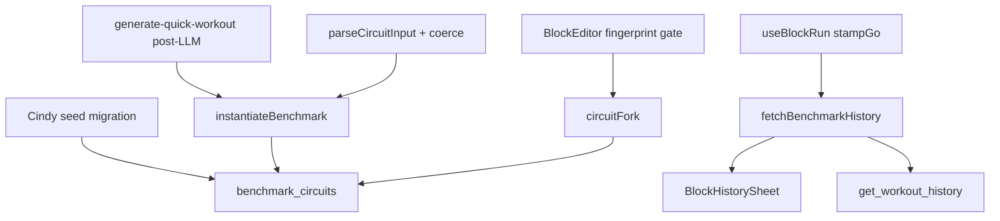

# Tech Plan — Circuit Catalog: Cindy identity (#398)

> Implements `file:docs/Epic_Brief_—_Circuit_Catalog_Cindy_identity_#398.md`. Glossary: `file:docs/CONTEXT.md` (**Benchmark Circuit**, **Circuit Fork**, **Circuit Catalog**, **WOD**, **Block Run**). ADR to write: `docs/adr/0015-benchmark-circuit-catalog-identity.md`. Does not amend ADR 0007 / 0008 / 0014 except: `block_runs` gains a nullable catalog snapshot at GO.

## Architectural Approach

### Key Decisions

| Decision | Choice | Rationale |
|---|---|---|
| Entity | New `benchmark_circuits` ; **not** promoting `exercise_blocks` | Day instance needs `workout_day_id` + `sort_order` ; catalog is identity + source Rx |
| Rx catalog | JSONB `{ mode, cap_seconds, exercises: [{ exercise_id, amount, weight }] }` | Same shape as `templateFingerprint` ; fork = copy row ; no child table v1 |
| Instantiate | Snapshot copy → `exercise_blocks` + `block_exercises` + `benchmark_circuit_id` | Live-bind would rewrite history ; **Round Screen** stays on a day block |
| Score key | Catalog id (GO snapshot) **and** `templateFingerprint` | Two Cindys compare ; cap 20 ≠ cap 10 |
| GO stamp | `block_runs.benchmark_circuit_id` nullable | Fork retargets the day slot ; Monday’s run must stay Cindy |
| Seed | `slug = cindy`, `owner_id NULL`, copy canonique du brief | Resolve by slug, not uuid ; uuid `gen_random_uuid()` |
| Cindy exos | `SELECT id FROM exercises WHERE name IN ('Tractions','Pompes','Squat au poids du corps')` | Same pattern as templates ; no exercise slugs |
| Fork | Persist who would diverge the fingerprint of a **non-owned** row → confirm → INSERT privé + retarget | Debounce-safe : intercept **before** `useUpdateBlockMeta` / `useUpdatePerRound` mutate |
| Owned privé | Mutate in place | Avoids row explosion |
| MCP | Optional `benchmark_slug` (or id). Present → catalog Rx wins. Unknown → **error**. Absent + label/alias match seed → **coerce**. Generic → jetable | Closes sloppy agents without breaking generic Circuits |
| QW | Post-LLM : closed-intent / label match → **drop LLM exercises**, instantiate catalog. **Fix `toMcpCircuit`** (today drops AMRAP) | The model does not dictate Cindy ; today’s commit is born Tours |
| History | `BlockHistorySheet` : catalog id → all runs of that id ; jetable → `block_id`. MCP `get_workout_history` lockstep | Story 12 + agents see the same PR |
| Backfill | **None** | False positives ; tracer starts at ship |
| UI design | Reuse sheet + `AlertDialog` fork. No Stitch | No new screen |
| Seed writes | Migration only | Same as `exercises` admin/migration |

### Critical Constraints

- **`toMcpCircuit`** (`file:src/lib/quickWorkout.ts`) drops `mode` / `cap_minutes` today. QW preview Cindy = AMRAP, commit = Tours 1 round. **Must fix in this epic** or catalog identity is born as the wrong mode. Instantiate-from-catalog on closed-intent avoids the LLM shape, but any non-coerced AMRAP QW still needs the mapper fix (generic AMRAP).
- **`isRunComplete` / `runFingerprint`** (`file:src/lib/blockCompletionHistory.ts`) : **do not touch**. Jetable Tours stay ADR 0008. Catalog AMRAP uses `annotateAmrapRuns` keyed by GO `benchmark_circuit_id` then fingerprint.
- **Dual `blockPersistence`** : `file:src/lib/blockPersistence.ts` and `file:supabase/functions/mcp/lib/blockPersistence.ts` stay twins. Instantiate helpers mirrored (`instantiateBenchmark` PWA + Edge). No shared package.
- **Builder is online** (`useBlockMutations` hits Supabase directly). Fork INSERT of `benchmark_circuits` is online-only. Runner GO stays offline-first (`block_run` queue + new nullable field).
- **`useUpdatePerRound` debounce** : fork confirm must run **before** the mutating call, comparing `templateFingerprint(current)` vs pending. Cancel → no write. Confirm → INSERT fork, then persist onto the retargeted FK (same block row, new `benchmark_circuit_id`).
- **Coerce false positive** : a user-named jetable literally `"Cindy"` becomes the seed. Accepted. Document in ADR. No backfill of old rows.
- **MCP unknown keys** : `parseCircuitInput` currently ignores unknown keys — `benchmark_slug` would be **silently dropped** until parsed. Same trap as `mode` in #474. Parse + schema lockstep (`circuitItemSchema.ts`, three write tools, read echo).
- **Seed `exercise_id` via FR `name`** : rename in catalog breaks Cindy Rx JSONB. Same risk as program templates. Instantiate fails clearly if any id missing (Epic story 24).
- **Coerce + `update_program` replace day** : wipe+insert of a generic Circuit in a former Cindy slot drops the FK. Honest — they replaced the item.
- **QW « 4 rounds Cindy »** : closed list still matches Cindy → instantiate official Cindy (AMRAP 20), not 4-round Tours. Catalog wins.
- **Do Cindy / shelf / picker** : out. Primitive `instantiateBenchmark` is the #393 hook.
- **Skill** `skills/gymlogic-mcp/SKILL.md` : Cindy example today is a labeled snowflake. Update in this epic so agents send `benchmark_slug`.

---

## Data Model

```mermaid
classDiagram
  class benchmark_circuits {
    uuid id
    text slug "unique when NOT NULL — seeds only"
    uuid owner_id "NULL = GymLogic"
    uuid forked_from
    text[] aliases
    text tagline_fr
    text tagline_en
    text story_fr
    text story_en
    jsonb reference "name + score"
    jsonb rx "mode, cap_seconds, exercises"
  }
  class exercise_blocks {
    uuid benchmark_circuit_id "NULL = jetable"
  }
  class block_runs {
    uuid benchmark_circuit_id "GO snapshot, nullable"
    text template_fingerprint
  }
  benchmark_circuits ||--o{ benchmark_circuits : forked_from
  benchmark_circuits ||--o{ exercise_blocks : "source Rx"
  exercise_blocks ||--o{ block_runs : "live slot"
  benchmark_circuits ||--o{ block_runs : "identity at GO"
```

```sql
CREATE TABLE benchmark_circuits (
  id uuid PRIMARY KEY DEFAULT gen_random_uuid(),
  slug text,
  owner_id uuid REFERENCES auth.users (id),
  forked_from uuid REFERENCES benchmark_circuits (id),
  aliases text[] NOT NULL DEFAULT '{}',
  tagline_fr text,
  tagline_en text,
  story_fr text,
  story_en text,
  reference jsonb,
  rx jsonb NOT NULL,
  created_at timestamptz NOT NULL DEFAULT now(),
  CONSTRAINT benchmark_circuits_slug_owner CHECK (
    (owner_id IS NULL AND slug IS NOT NULL) OR
    (owner_id IS NOT NULL AND slug IS NULL)
  )
);
CREATE UNIQUE INDEX benchmark_circuits_slug_unique
  ON benchmark_circuits (slug) WHERE slug IS NOT NULL;

ALTER TABLE exercise_blocks
  ADD COLUMN benchmark_circuit_id uuid
    REFERENCES benchmark_circuits (id) ON DELETE SET NULL;

ALTER TABLE block_runs
  ADD COLUMN benchmark_circuit_id uuid
    REFERENCES benchmark_circuits (id) ON DELETE SET NULL;
```

`rx` shape:

```ts
{
  mode: "amrap" | "rounds"
  cap_seconds: number | null
  exercises: { exercise_id: string; amount: number; weight: number }[]
}
```

Cindy seed (migration): `slug = 'cindy'`, `aliases = '{holland,tom holland}'`, copy from the Epic Brief, `rx.mode = amrap`, `cap_seconds = 1200`, amounts 5/10/15, ids from `exercises.name`.

**RLS**
- SELECT: `owner_id IS NULL OR owner_id = auth.uid()`
- INSERT/UPDATE/DELETE: `owner_id = auth.uid()` (forks only). Seeds: no user write policy (migration / service role).
- `exercise_blocks` / `block_runs` RLS unchanged (day / session chain). FK is just a pointer.

Queue (`file:src/lib/syncService.ts`):

```ts
export interface BlockRunPayload {
  // existing fields…
  benchmarkCircuitId: string | null
}
```

### Table Notes

- **`slug` NULL on forks** : no `Do my-fork` via MCP v1. Unique partial index = GymLogic handles only.
- **`ON DELETE SET NULL`** on FKs : deleting a private fork must not cascade-wipe sessions. Seeds are never deleted. Past GO snapshots on a deleted fork become ungrouped (rare in v1).
- **`reference` jsonb** `{ name, score }` : editorial, never inserted as a `block_runs` row.
- **No backfill** of existing labeled Cindys.
- **JSON → child table later** : additive ; `templateFingerprint` already takes the exercise array.

---

## Component Architecture

### Layer Overview



### New Files & Responsibilities

| File | Purpose |
|---|---|
| `supabase/migrations/YYYYMMDD_benchmark_circuits.sql` | Table, FKs, RLS, Cindy seed + copy |
| `src/lib/instantiateBenchmark.ts` | Read catalog Rx → `ExerciseBlockInsertRow` + exercises + FK |
| `src/lib/circuitFork.ts` | Compare fingerprints ; mint private row ; retarget block |
| `src/lib/resolveBenchmark.ts` | slug / alias / id → row (PWA) |
| `src/hooks/useBenchmarkCompletionHistory.ts` | History by catalog id + fingerprint ; story + reference |
| `src/components/history/BenchmarkStoryHeader.tsx` | Tagline, story, Holland beat — **not** a run row |
| `src/components/builder/CircuitForkDialog.tsx` | shadcn `AlertDialog` « Ça ne sera plus Cindy. » |
| `supabase/functions/mcp/lib/instantiateBenchmark.ts` | Edge twin |
| `supabase/functions/mcp/lib/resolveBenchmark.ts` | Edge twin + coerce from label |

### Component Responsibilities

**`instantiateBenchmark`**
- Input: catalog id, `workout_day_id`, `sort_order`
- Load `rx` ; fail if any `exercise_id` missing from `exercises`
- Insert block (`mode`/`cap` from rx, AMRAP rest/transition 0, label from seed name « Cindy ») + `block_exercises` snapshots
- Stamp `benchmark_circuit_id`

**`parseCircuitInput` (delta)**
- Parse optional `benchmark_slug` / `benchmark_id`
- Unknown slug → error (no insert)
- Present → **replace** parsed exercises/mode/cap with catalog Rx
- Absent → if `label` (normalized) matches `slug` or `aliases` of a seed → coerce same as present
- Else jetable (today)

**QW `handleGenerateQuickWorkout` (delta)**
- After `validateAndRepair` : if closed-intent or item label matches seed → replace that item with `{ type: "circuit", benchmark_slug: "cindy" }` (no LLM exercises)
- Commit goes through MCP `create_workout_day` → instantiate
- **`toMcpCircuit`** : pass through `mode` / `cap_minutes` / `benchmark_slug` for generic AMRAP and for slug-only items

**`BlockEditor` + lists**
- Before `useUpdateBlockMeta` / `useUpdatePerRound` : if `benchmark_circuit_id` set and owner is not me (seed) and pending fingerprint ≠ catalog canonical → `CircuitForkDialog`. Confirm → `circuitFork` then persist. Cancel → abort.

**`useBlockRun.stampGo`**
- `benchmarkCircuitId: block.benchmark_circuit_id ?? null` on `enqueueBlockRun`

**`BlockHistorySheet`**
- If group has catalog id : `useBenchmarkCompletionHistory(catalogId)` ; header = `BenchmarkStoryHeader` ; PB/delta via existing `annotateAmrapRuns` on that set
- Else existing `useBlockCompletionHistory(blockId)`
- First run : story + no delta (not a fake Holland row)

**MCP `get_workout_history`**
- Same grouping key : catalog id when stamped on `block_runs`, else `block_id`
- Echo `benchmark_slug` on Circuit details / dry_run when linked

### Failure Mode Analysis

| Failure | Behavior |
|---|---|
| Seed exercise renamed / missing | Instantiate throws ; MCP/QW error ; no half-Cindy row |
| Unknown `benchmark_slug` | MCP error, no insert |
| LLM emits 6-11-16 + label Cindy | Coerce / post-LLM drop ; catalog 5-10-15 wins |
| QW generic « HIIT 20 min » | Jetable ; `toMcpCircuit` must keep AMRAP if the model emitted it |
| Fork cancel | No persist ; editor stays on seed Rx |
| Fork online down | Builder save fails like today ; no local catalog mint |
| Kill-app after GO | Queue `block_run` already has catalog id ; hydrate unchanged + new field |
| User labels a jetable « Cindy » | Coerce to seed (accepted false positive) |
| Delete private fork | FKs SET NULL ; past GO snapshots SET NULL → those runs become ungrouped jetable (rare ; v1 forks are user-owned) |
| Two devices edit a private fork | Last write wins (same as block meta today) |
| `update_program` replaces Cindy slot with a generic Circuit | New insert is jetable ; old GO snapshots keep cindy id |
