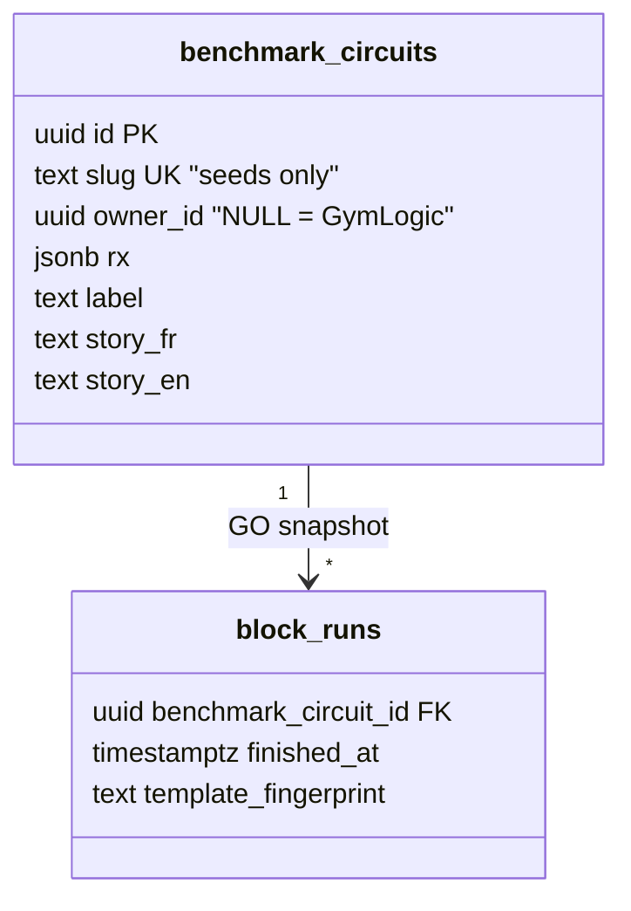
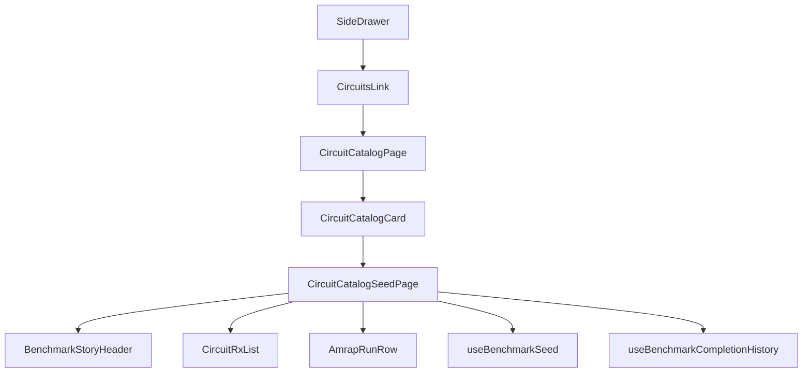

# Tech Plan — Circuit Catalog shelf (#483)

> Implements `file:docs/Epic_Brief_—_Circuit_Catalog_shelf_#483.md`. Glossary: `file:docs/CONTEXT.md` (**Benchmark Circuit**, **Circuit Catalog**, **Meet Cindy**, **Circuit Fork**, **Block Run**). ADR: `file:docs/adr/0018-circuit-catalog-encyclopedia-under-library.md`. Does not amend ADR 0016 except: `/library` gains a third child; the picker and home stay as 0016.

## Architectural Approach

### Key Decisions

| Decision | Choice | Rationale |
|---|---|---|
| Job | Browse + detail, **no write** | Unique hole is encyclopedia. Meet Cindy already drops. Same tap cannot be both. |
| IA | Third Library child `/library/circuits` | Cheapest nav. Exercise Library already stretched Library. Ranked/social stay out (ADR 0018). |
| Roster | `owner_id IS NULL` via `useBenchmarkSeeds` | Forks have `slug` NULL; slug URLs enforce curated roster. |
| Card | `CircuitCatalogCard` on the shelf; `CircuitSeedCard` stays picker-only | HITL: encyclopedia needs story, not picker chrome. Picker keeps discriminated `to` vs `onSelect` so a stray reuse cannot instantiate. |
| Detail fetch | New `useBenchmarkSeed(slug)` | List hook also selects `story_*` for the shelf card. Detail loads full copy including `reference`. 404 if `owner_id` set or slug missing. |
| History | `useBenchmarkCompletionHistory(true, id)` on the page | Do **not** mount `BlockHistorySheet` (it still wants a `blockId` for the jetable path). Export `AmrapRunRow` from the sheet file (or a sibling) and reuse. |
| Rx names | `fetchExercisesByIds` + `useCatalogLabels` | Same as instantiate. Never hardcode 5-10-15. |
| Index | `/library` still redirects to programs | Legacy bookmarks stay program-centric. |
| List order | Existing `order("slug")` | Olympien / Héros / Specialty are not columns (ADR 0017). Do not fake a matrix. |

### Critical Constraints

**Picker tap is instantiate.** `file:src/components/builder/CircuitSeedCard.tsx` is a `<Button onClick={onSelect}>`. The picker’s `onSelect` is `handleInstantiate`. The shelf uses `file:src/components/library/CircuitCatalogCard.tsx` (`to` only) so it cannot write a block. `CircuitSeedCard` still has discriminated `to` vs `onSelect` as a trap for a future reuse.

**Do not copy `useCreateQuickWorkout`’s catalog select.** That query is unfiltered. The shelf must use `useBenchmarkSeeds` (`owner_id IS NULL`) or an equivalent `.is("owner_id", null)`.

**`useBenchmarkCompletionHistory` already returns copy with empty runs.** Story can render before the first GO. The history sheet just never did.

**`useWorkoutDays` requires `programId`.** Ad-hoc instantiate from the shelf is T144, not a CTA. Out of scope.

**RPC / achievements (#482) are a sibling.** Personal PB is catalog-keyed today. Do not join `user_achievements`.

**Supabase client in tests.** Any page that imports hooks hitting `file:src/lib/supabase.ts` needs `vi.mock("@/lib/supabase", …)` (CI has no `.env`). See `.cursor/rules/build-sandbox-caveat.mdc`.

---

## Data Model

No schema change. Read existing `benchmark_circuits` and `block_runs`.

### Table Notes

- Seed slug is unique; forks have `slug` NULL (CHECK slug XOR owner). Detail route **must** query by slug + `owner_id IS NULL`, not by uuid.
- History is `block_runs.benchmark_circuit_id` (GO snapshot), not the live day FK.

---

## Component Architecture

### Layer Overview

### New Files & Responsibilities

| File | Purpose |
|---|---|
| `file:src/pages/library/CircuitCatalogPage.tsx` | List: `useBenchmarkSeeds(true)`, `CircuitCatalogCard` with `to`, library i18n header, back to `/` (not `/library/programs`) |
| `file:src/pages/library/CircuitCatalogPage.test.tsx` | Drawer-adjacent: 9 labels, tap navigates, instantiate **not** called |
| `file:src/pages/library/CircuitCatalogSeedPage.tsx` | Detail: slug param, story, Rx, history/empty/offline/404 |
| `file:src/pages/library/CircuitCatalogSeedPage.test.tsx` | cindy story + Rx names + `noPrYet`; unknown slug; no instantiate |
| `file:src/hooks/useBenchmarkSeed.ts` | `maybeSingle` by slug + `owner_id IS NULL`; include story + reference + rx |
| `file:src/hooks/useBenchmarkSeed.test.ts` | Fork/unknown → empty; seed row parses |
| `file:src/components/library/CircuitRxList.tsx` | Presentational stations (amount × localized name); tap opens `ExerciseDetailSheet` |
| `file:src/components/library/CircuitCatalogCard.tsx` | Shelf card: label, glossed `AmrapLabel`, tagline, story. Not the picker card. |

### Component Responsibilities

**CircuitSeedCard** (picker only)
- Discriminated: `{ onSelect: () => void }` **or** `{ to: string }` — `to` exists so a future nav reuse cannot silently instantiate, but the **shelf does not use this card**
- Keep `builder` i18n for AMRAP/Tours fallback

**CircuitCatalogCard**
- Encyclopedia chrome: `AmrapLabel` full (never a naked AMRAP badge), tagline, clamped story
- `to` only — no instantiate path

**CircuitCatalogPage**
- Header in `library` namespace (`circuitsBrowseTitle`)
- Empty / loading / error mirroring `ExerciseLibraryPage` tone, not a new design system
- Never import `useInstantiateBenchmarkOnDay`

**CircuitCatalogSeedPage**
- `useParams().slug` — reject empty
- `BenchmarkStoryHeader` with copy from `useBenchmarkSeed` (do not wait on history for story)
- History: `open: true` always on this page (hook’s `open` flag was for the sheet)
- Reuse `history:circuit.noPrYet`, `circuit.offline`, `circuit.loadError`, `circuit.retry`
- Back link to `/library/circuits`

**CircuitRxList**
- Input: `rx.exercises` + catalog map. Output: list of `amount` + `catalogName`
- Known stations are instruction links; they open `ExerciseDetailSheet` so the encyclopedia stays mounted

### Failure Mode Analysis

| Failure | Behavior |
|---|---|
| Unknown slug / fork uuid pasted | Not-found + back to list |
| Seed row missing an `exercise_id` in catalog | Station shows a muted fallback, not a crash; do not invent 5-10-15 |
| Offline | Story/Rx: query error → retry. History: existing `useOnlineStatus` gate inside the history hook — show `circuit.offline` if `!isOnline` |
| `useBenchmarkSeeds` empty | Empty copy, not a spinner forever |
| Picker regression | Existing CircuitSeedCard tests still fire `onSelect`; no `to` on picker |

---

## Ticket map

| # | Title | Mode | Deps |
|---|---|---|---|
| T207 | ADR 0018 + glossary + paper trail | AFK | None |
| T204 | Drawer + Circuits list (nav, not drop) | AFK | T207 |
| T205 | Seed detail: story + Rx + 404 | AFK | T204 |
| T206 | Personal AMRAP history / PB on detail | AFK | T205 |
