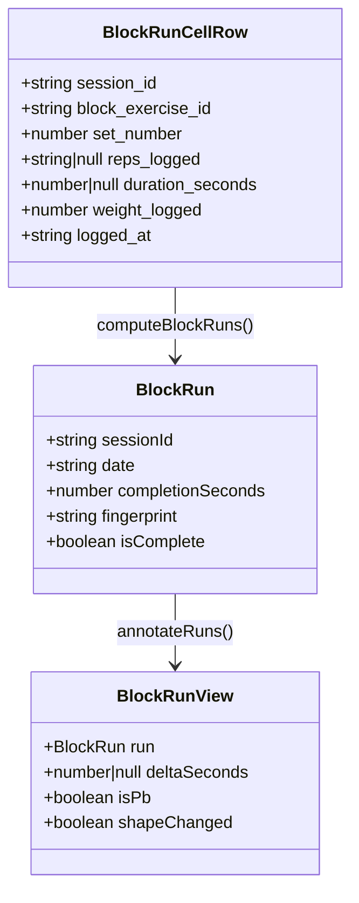
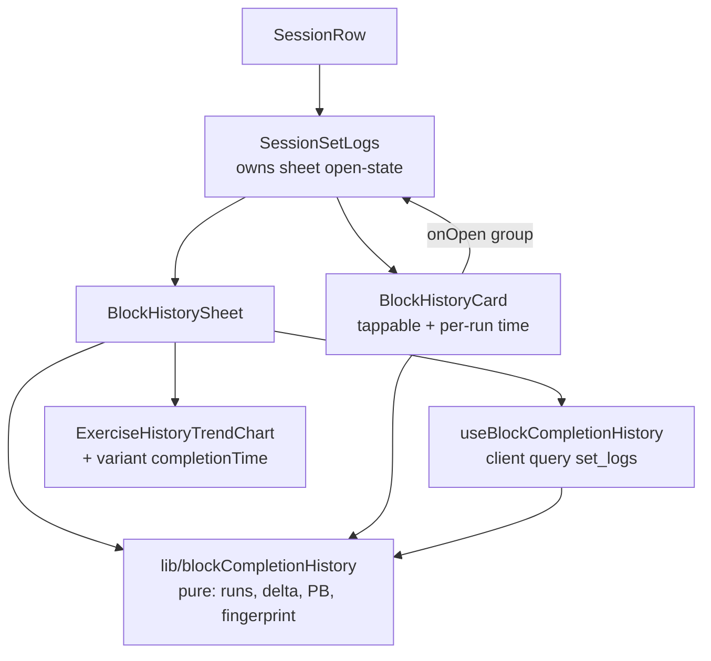

# Tech Plan — Circuit Completion Time (#396)

## Architectural Approach

Tout est **dérivé** des `set_logs` existants : aucune colonne, aucune table, aucun writeback (cohérent ADR 0006/0007 — on ne touche ni l'écriture des logs ni le moteur de progression). Le temps par run sur la carte d'historique sort des `logged_at` déjà chargés ; seul le *sheet* de tendance tire une requête client cross-session. Toute la logique subtile (temps, fingerprint de shape, complétude, delta, PB) vit dans une lib pure testée.

### Key Decisions

| Decision | Choice | Rationale |
|---|---|---|
| Persistance | **Aucune** — dérivé de `logged_at` (décision A1) | Zéro migration, rétroactif sur tout l'historique, hors engine (ADR 0006/0007) |
| Temps par run (carte) | `MAX − MIN(logged_at)` sur les cellules du groupe, **sans nouvelle requête** | `useSessionSetLogs` fait déjà `select("*")` → `logged_at` présent sur chaque cellule (`file:src/hooks/useSessionSetLogs.ts`) |
| Données du sheet (cross-session) | Requête client `set_logs.in("block_exercise_id", ids)` | A1-pur, RLS déjà en place, volume minuscule ; pas de RPC |
| Complétude | **Grille pleine auto-suffisante** (rectangle sans trou, sur la shape propre du run) | Indépendant du template, robuste aux éditions, 100% rétroactif |
| Identité de comparaison | **Fingerprint** = {exos × rounds × (reps\|durée) × poids} par cellule | Comparabilité honnête ; poids inclus → ajouter de la charge casse le delta |
| Delta | vs le run complet **précédent de fingerprint identique** | Jamais de comparaison entre shapes différentes |
| PB | meilleur temps complet **par groupe de fingerprint** | Un PB 3-rounds ≠ un PB 4-rounds ; un PB global prendrait la shape la plus facile |
| Trend chart | runs du **fingerprint du run le plus récent** uniquement | Une courbe ne mélange jamais deux shapes (sinon elle « monte » juste parce qu'on fait plus de rounds) |
| Composant chart | réutiliser `ExerciseHistoryTrendChart` + `variant="completionTime"` (axe MM:SS via `fmtDurationAxis`) | Pas de nouveau SVG |
| Pauses | **incluses** (wall-clock) | Sémantique Freeletics (Epic Brief story 8) |

### Critical Constraints

- **Biais de départ constant.** `MIN(logged_at)` correspond à la *fin* de la première cellule (le premier log arrive après avoir validé le 1er exo du round 1), pas au vrai départ. Le temps est donc *systématiquement* sous-estimé du même offset → les **deltas inter-runs restent justes** (le biais s'annule). On ne corrige pas : ce serait la décision A2 (vraie horloge), explicitement rejetée.
- **`logged_at` est posé client-side** (`Date.now()` dans `file:src/lib/blockSetLog.ts`) → dépend de l'horloge du device. Pré-existant, hors scope.
- **Lecture seule.** Aucune écriture sur `set_logs`, aucun appel au moteur de progression. La dérivation est pure.
- **Non-régression `groupSessionHistory`.** `file:src/lib/sessionHistoryGrouping.ts` reste **inchangé** ; une session 100% solo est byte-identique. Le temps se calcule à part, à partir de la `BlockHistoryGroup` déjà produite.
- **Orphelins.** Un `block_exercise_id` nullé (`ON DELETE SET NULL`, exo retiré du template — T143) sort de l'historique du bloc, cohérent avec le fallback solo de la carte.

---

## Data Model

**Aucun changement de schéma.** Tout est en mémoire, dérivé des `set_logs` existants (`file:src/types/database.ts` → `SetLog`).

### Table Notes

- `BlockRunCellRow` = projection exacte de la requête client `set_logs` (les colonnes nécessaires, pas `select("*")`).
- `fingerprint` = hash stable de la liste triée `[(block_exercise_id, set_number, amount, weight)]`, où `amount = reps_logged ?? "d" + duration_seconds`. **Le poids en fait partie** (décision produit).
- `isComplete` = rectangle plein : rounds `1..R` contigus présents, chaque round contient exactement le même ensemble de `block_exercise_id`, et `cellCount === exercises × R`. Un run proprement arrêté à la fin du round 3 d'un 4-rounds prévu est traité comme un run 3-rounds complet (shape distincte) — accepté, faute de snapshot par run.
- `completionSeconds` = `(max(logged_at) − min(logged_at)) / 1000`, arrondi. Toujours dérivable, mais affiché uniquement si `isComplete` (Epic Brief story 11).
- `date` = `min(logged_at)` du run — sert au tri (newest-first) et aux labels d'axe du trend.

---

## Component Architecture

### Layer Overview

### New Files & Responsibilities

| File | Purpose |
|---|---|
| `src/lib/blockCompletionHistory.ts` | Pur : `runCompletionSeconds`, `runFingerprint`, `isRunComplete`, `computeBlockRuns`, `annotateRuns` (delta + PB + shapeChanged), `completionTrendSeries`. Tout le sel testable. |
| `src/lib/blockCompletionHistory.test.ts` | Vitest : temps, fingerprint (poids inclus), complétude rectangle, delta same-shape only, PB par groupe, runs incomplets exclus, trend = fingerprint du run récent. |
| `src/hooks/useBlockCompletionHistory.ts` | Requête client `set_logs.in("block_exercise_id", ids)` (enabled quand sheet ouvert + online), cappée aux ~8 sessions récentes → `BlockRunCellRow[]`. |
| `src/components/history/BlockHistorySheet.tsx` | Mirror `ExerciseHistorySheet` : header (label circuit), trend chart (fingerprint récent), liste des runs (date · temps · delta · badge PB · marqueur « modifié »). |

### Modified Files

| File | Change |
|---|---|
| `src/components/history/BlockHistoryCard.tsx` | Ligne « Circuit bouclé en 4:32 » (si `isRunComplete`) ; carte devient tappable → `onOpen(group)`. |
| `src/components/history/SessionRow.tsx` | `SessionSetLogs` porte le state `{ openBlock: BlockHistoryGroup \| null }` et rend `<BlockHistorySheet>`. |
| `src/components/workout/ExerciseHistoryTrendChart.tsx` | Ajout `variant="completionTime"` (axe `fmtDurationAxis`, copie/aria dédiées). |
| `src/i18n/locales/{en,fr}/history.json` | Clés `circuit.completionTime`, `circuit.delta`, `circuit.pb`, `circuit.shapeChanged`, `circuit.sheetTitle`, `circuit.trendHint`. |

### Component Responsibilities

**`BlockHistoryCard`**
- Calcule son temps depuis `group.rounds.*.cells.*.log.logged_at` (zéro requête) via `runCompletionSeconds` + `isRunComplete`.
- Affiche le temps seulement si run complet ; sinon rien (jamais de faux chiffre).
- Tap → `onOpen(group)` ; le sheet vit chez le parent (`SessionSetLogs`).
- Garde shadcn (`Button`/`Card` selon `prefer-shadcn-components`).

**`BlockHistorySheet`**
- Dérive `blockExerciseIds` depuis `group.rounds.*.cells.*.blockExerciseId`, appelle `useBlockCompletionHistory`.
- `computeBlockRuns` + `annotateRuns` → liste tous les runs complets newest-first (delta vs run précédent de même fingerprint, badge PB par groupe, marqueur « modifié » au changement de shape).
- Trend chart : `completionTrendSeries` du **groupe de fingerprint du run le plus récent**, rendu seulement si ≥2 runs complets dans ce groupe (mirror du guard `showTrend` solo).
- Online/loading/empty calqués sur `ExerciseHistorySheet`.

**`useBlockCompletionHistory`**
- `enabled: open && ids.length > 0 && isOnline && user` ; `staleTime` ~15s ; `queryKey: ["block-completion-history", blockId]`.

### Failure Mode Analysis

| Failure | Behavior |
|---|---|
| Run abandonné (grille à trou / `discardBlock`) | `isComplete=false` → exclu trend + PB, pas de temps sur la carte |
| 1 seul run | Temps affiché, pas de delta, pas de PB (story 10) |
| Toutes shapes différentes | Aucun delta, pas de trend (hint « varie les prescriptions ») ; chaque run montre son temps |
| `block_exercise_id` orphelin | Sort de l'historique du bloc (cohérent fallback solo, T143) |
| Offline | Sheet en état offline (mirror solo) ; la carte garde son temps (données déjà chargées) |
| Device horloge fausse | Temps faussé pour ce run uniquement — pré-existant, accepté |

---

## Migration Path (future A2)

Si un jour on veut le vrai départ : ajouter `block_elapsed_seconds` (+ un stamp `started_at` côté `blockRunner`) et faire de la dérivation `MAX−MIN` un **fallback** quand la colonne est nulle. La lib `blockCompletionHistory.ts` absorbe ça sans casse (une source de plus pour `completionSeconds`). Aucune réécriture des surfaces.

---

## References

- Epic Brief : `file:docs/Epic_Brief_—_Circuit_Completion_Time_#396.md`
- Issue : [#396](https://github.com/PierreTsia/workout-app/issues/396) ; spin-off : [#398](https://github.com/PierreTsia/workout-app/issues/398)
- ADR : `file:docs/adr/0008-circuit-completion-time-derived-not-scored.md`, `file:docs/adr/0007-exercise-blocks-rich-structure-no-progression.md`, `file:docs/adr/0006-decouple-template-from-progression-engine.md`
- Glossaire : `file:docs/CONTEXT.md` (**Circuit Completion Time**, **Benchmark Circuit**)
- Données existantes : `file:src/lib/blockSetLog.ts`, `file:src/lib/sessionHistoryGrouping.ts`, `file:src/hooks/useSessionSetLogs.ts`, `file:src/hooks/useSessionBlockMeta.ts`
- UI à mirror : `file:src/components/history/BlockHistoryCard.tsx`, `file:src/components/history/SessionRow.tsx`, `file:src/components/workout/ExerciseHistorySheet.tsx`, `file:src/components/workout/ExerciseHistoryTrendChart.tsx`, `file:src/hooks/useExerciseSessionHistorySheet.ts`
