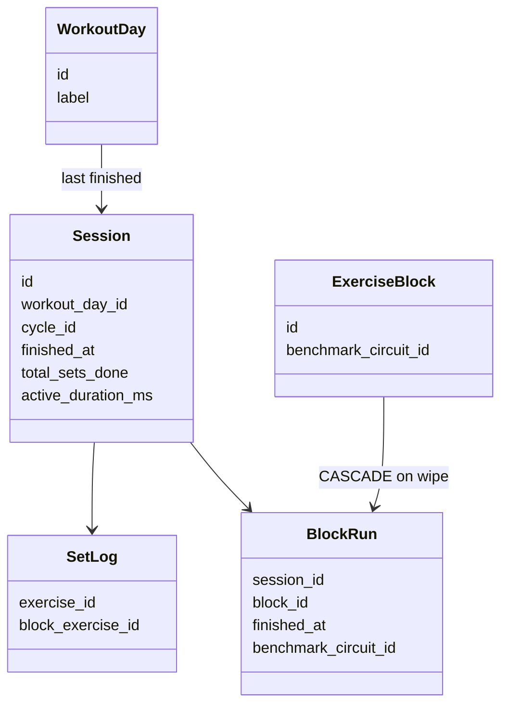
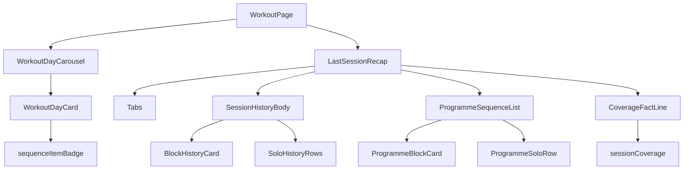

# Tech Plan — Completed-day Home Last Session Recap #498

## Architectural Approach

### Key Decisions

| Decision | Choice | Rationale |
|---|---|---|
| Schema | None | Identities we need already exist on `set_logs.exercise_id`, `block_runs.benchmark_circuit_id`, `exercise_blocks.benchmark_circuit_id`. A day-level snapshot is epic out of scope. |
| Recap grouping | Reuse `groupSessionHistory` + `BlockHistoryCard` + the `SessionSetLogs` pipeline | History already renders **AMRAP** `4+0`. `summarizeSessionLogs` is the bug. Extract the inner list so Home and History cannot drift. |
| Tabs | shadcn `Tabs` (`file:src/components/ui/tabs.tsx`), same 2-trigger layout as `file:src/components/workout/ExerciseSwapInlinePanel.tsx` | Already in the workout surface; no new primitive. |
| Programme tab | New read-only `ProgrammeSequenceList` over `buildDayItems`, not `PreSessionExerciseList` | Pre-session list is swap/delete/add + kg. Cloning it with a `readOnly` flag would leak mutation chrome. |
| Sequence badge | Count **Unified Day Sequence** items: 1 per solo + 1 per **Exercise Block** | Matches how the day is trained. Flattened station count caused `12 exercices` on a 4-Circuit day. |
| Done-card chrome | Checkmark only. Drop `lastSession` date, `setCount`, duration from the hero | Those numbers belong on **Dernière séance**. Mixing them with today’s map is the #498 card lie. |
| Coverage filet | Pure `sessionCoverage` over catalog ids; skip the line when any logged **Circuit** is jetable | Epic stories 8–10. No timestamps, no « jour a changé ». |
| Empty logs | Do not mount tabs. Show `ProgrammeSequenceList` only | Recap without `set_logs` is a hollow tab. Programme still answers “what is this day”. |
| Default tab | `defaultValue="last-session"` only after logs query has data | Mounting tabs before settle would flash Programme or an empty recap. |
| Wipe degradation | Accept History’s orphan-solo fallback | `block_runs` CASCADE is out of scope. Recap must not invent **AMRAP** scores without a **Block Run**. |

### Critical Constraints

`file:src/pages/WorkoutPage.tsx` is the only production caller of `ExerciseListPreview` / `summarizeSessionLogs` / `templateToPreviewItems`. Removing them from Home is a clean cut; keep `sessionSummary.ts` only if tests still need it, otherwise delete the Home-only helpers.

`useLastSessionForDay` is **not** cycle-scoped. On a day done in the current **Cycle** the latest finished session on that `workout_day_id` is the completing session (no redo without restart). Do not add `cycle_id` to the query in this epic.

`BlockSessionCard` shows kg when any `per_round` weight > 0 and has no hide flag. Programme must not show charge — add an explicit `hideWeight` (or don’t reuse that card). Builder `BlockCard` has no kg but carries drag/edit affordances; keep it in the Builder.

Extracting `SessionSetLogs` from `file:src/components/history/SessionRow.tsx` couples Home to History. That coupling is the point: one grouping UI. Keep `SessionRow` collapsible chrome in History; share only the grouped body.

Carousel swipe already updates `session.currentDayId`; recap hooks keyed on that id follow for free (`file:src/components/workout/WorkoutDayCarousel.tsx`).

Restart-cycle footer stays behind `canOfferCycleRestart`. Do not put Start back on a done day.

No new npm dependency. Tabs already ship (`@radix-ui/react-tabs`).

---

## Data Model

No migration. Read-only composition of existing rows.

### Table Notes

- **Coverage sets** compare catalog UUIDs, not row ids. Solos: `exercise_id`. Circuits: `sheetCatalogId(live, goSnapshot)` vs live `benchmark_circuit_id`.
- Jetable **Circuit** (`benchmark_circuit_id` null on the logged group **or** on a live day block when comparing) → `comparable: false` → no filet.
- After MCP wipe, `block_exercise_id` is null and **Block Run** rows are gone. Grouping falls back to solos. Coverage may still compare leftover solo `exercise_id`s against today’s slots; do not resurrect **AMRAP** scores.

### localStorage

None. Tab selection is not persisted — default **Dernière séance** every visit on a done day with logs.

---

## Component Architecture

### Layer Overview

### New Files & Responsibilities

| File | Purpose |
|---|---|
| `file:src/lib/sequenceItemBadge.ts` | Pure counts + which i18n branch (circuits / solos / mixed). |
| `file:src/lib/sessionCoverage.ts` | Pure coverage: comparable?, logged circuit/solo catalog ids vs live **Unified Day Sequence**. |
| `file:src/components/history/SessionHistoryBody.tsx` | Extracted grouped list from `SessionRow` (`useSessionSetLogs` + meta + runs + `groupSessionHistory`). |
| `file:src/components/workout/LastSessionRecap.tsx` | Tabs, default last-session, header date/duration, fact line, empty-logs unmount. |
| `file:src/components/workout/ProgrammeSequenceList.tsx` | Read-only **Unified Day Sequence**: Circuit as WOD card (cap + gloss + names, no kg); solo as name + template sets×reps, no kg, no menu. |
| `file:src/locales/en/workout.json` + FR | Tab labels, coverage line, sequence badge keys. |

### Component Responsibilities

`**sequenceItemBadge**`
- Input: solo count, block count.
- Output: `{ kind: "circuits" \| "solos" \| "mixed" \| "empty", circuits, solos }`.
- No i18n inside the lib (keep it pure like `amrapScore`).

`**WorkoutDayCard**`
- Badge uses `sequenceItemBadge` + new keys (`sequenceBadgeCircuits`, `sequenceBadgeSolos`, `sequenceBadgeMixed`).
- When `isCycleDone`: checkmark; **no** `lastSession` date badge, **no** `setCount`, **no** duration.
- When not done: keep estimated sets; estimated duration from last session may stay (undone estimate, not recap). Date line for last session on undone days stays muted — that is “last time you did this day”, not the done-day lie.

`**SessionHistoryBody**`
- Same loading/metaPending guard as today’s `SessionSetLogs` (no solo→circuit flash).
- `kind === "block"` → existing `BlockHistoryCard` + `blockRuns`.
- `kind === "solo"` → existing solo set grid (Home recap = History truth).
- `SessionRow` becomes a thin collapsible wrapper around this body.

`**LastSessionRecap**`
- Props: `dayId`, `dayBlocks`, `dayExercises` (live sequence), `lastSession` (from `useLastSessionForDay`).
- Wait until `useSessionSetLogs` is settled. `length === 0` → render only `ProgrammeSequenceList` (no `Tabs`).
- Else `Tabs` `defaultValue="last-session"`. **Dernière séance**: date via `formatRelativeDate`, duration via `formatSessionDurationForDisplay`, optional `CoverageFactLine`, then `SessionHistoryBody`.
- **Programme**: `ProgrammeSequenceList`.
- i18n: `recap.tabLastSession` / `recap.tabProgram`.

`**sessionCoverage**`
- If any logged block group has `benchmarkCircuitId == null` and no GO catalog id → `{ comparable: false }`.
- If any live day block has `benchmark_circuit_id == null` and we still need circuit comparison → `{ comparable: false }` (jetable on the menu).
- Else compare Set sizes of catalog circuit ids and solo `exercise_id`s. Mismatch → `{ comparable: true, loggedCircuits, programCircuits, loggedSolos, programSolos }`.
- Fact line i18n uses **item** counts (Circuits + solos as sequence items), not flattened stations: e.g. 1 logged circuit vs 4 live circuits.

`**ProgrammeSequenceList**`
- `buildDayItems(exercises, blocks)`.
- Block: label, **AMRAP** `{n} min` + gloss or **Tours** N, station names; never kg.
- Solo: emoji + localized name + `sets × reps` (or duration); never kg; no `ExerciseEditRowControls`.

`**WorkoutPage**`
- Delete `previewItems` / `ExerciseListPreview` / `summarizeSessionLogs` / `templateToPreviewItems` from this file.
- `isDayDoneInCycle` → `<LastSessionRecap … />` instead of `ExerciseListPreview`.
- `!isDayDoneInCycle` → unchanged `PreSessionExerciseList` + Start.
- Footer restart unchanged.

### Failure Mode Analysis

| Failure | Behavior |
|---|---|
| Last session query loading | Carousel + card; recap region skeleton or nothing — not `ExerciseListPreview` |
| Logs empty | No tabs; Programme list only |
| Block meta pending | `SessionHistoryBody` shows `loadingSets` (same as History) |
| Wipe orphaned circuit logs | Solos in recap; no fake `4+0`; fact line only if comparable |
| Jetable Circuit in logs or menu | No fact line |
| Carousel swipe | New `dayId` → new last session + sequence (existing atom) |
| Offline, cache hit | React Query cache on existing keys; same as today’s preview |
| Offline, no cache | Empty recap / programme from failed query — existing error silence on Home |
| Mixed day | Recap shows circuits then solos (grouping order); Programme follows `sort_order` |

---

## i18n (contract)

| Key | EN | FR |
|---|---|---|
| `recap.tabLastSession` | Last session | Dernière séance |
| `recap.tabProgram` | Program | Programme |
| `recap.coverageCircuits` | {{logged}} Circuit(s) logged · {{program}} in the program | {{logged}} Circuit(s) loggé(s) · {{program}} au programme |
| `sequenceBadgeCircuits_one/other` | {{count}} Circuit / {{count}} Circuits | {{count}} Circuit / {{count}} Circuits |
| `sequenceBadgeSolos_one/other` | reuse `exerciseCount_*` or dedicated | same |
| `sequenceBadgeMixed` | {{circuits}} Circuits · {{solos}} exercises | {{circuits}} Circuits · {{solos}} exercices |

Coverage copy uses pluralization via i18next `_one/_other` if the interpolation is messy — keep one mixed string if tests stay simpler.

Do not add a « jour a changé » key.
