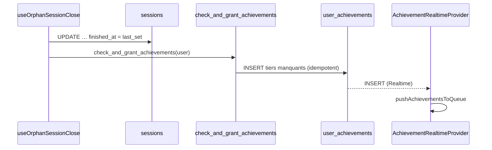
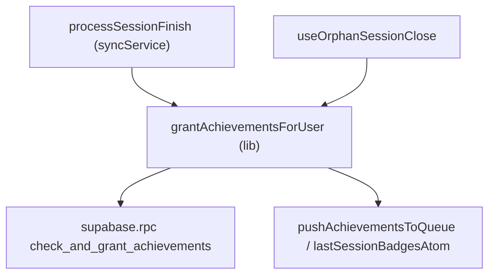

# Tech Plan — Crédit achievements à l'auto-close d'une orpheline (#660)

## Architectural Approach

### Key Decisions

| Decision | Choice | Rationale |
|---|---|---|
| Où créditer | Après le close, dans `useOrphanSessionClose` | Le close est le moment où la séance devient « finished » ; l'RPC dérive des `set_logs` finis |
| Réutilisation | Extraire `grantAchievementsForUser(userId)` de `processSessionFinish` | Un seul chemin de crédit, cohérent avec l'overlay normal |
| Nombre d'appels | Un par fermeture (`closed > 0`), pas par ligne | Plusieurs orphelines fermées en un boot = un crédit |
| Échec du crédit | Non-critique (try/catch, warn) | Ne jamais casser la fermeture (best-effort, ADR 0024) |
| Overlay | `pushAchievementsToQueue` + Realtime | La cérémonie poppe à l'app open via l'INSERT `user_achievements` |
| `was_pr` | Hors close | Détection TS, non reconstructible en SQL — script dédié |
| `session_finish` | Jamais ré-enfilé | Invariant ADR 0024 §4 (sinon écrasement à l'`now()`) |

### Critical Constraints

- L'RPC `check_and_grant_achievements(p_user_id)` est gardé (`auth.uid() = p_user_id` ou service_role) et idempotent (`ON CONFLICT DO NOTHING`). Le self-heal tourne côté client authentifié pour l'utilisateur courant → autorisé.
- Le close écrit `finished_at` **avant** l'appel RPC : sinon la séance ne compte pas dans la métrique `session_count`.
- Ne pas confondre avec `processSessionFinish` : le close orphelin ne doit **pas** enqueue de `session_finish` (le drain tardif écraserait à `now()`), ni toucher `was_pr`/`has_skipped_sets`.
- `AchievementRealtimeProvider` gate sur `granted_at >= subscriptionStartedAt` ; les inserts du self-heal ont `granted_at = now()` → overlay ok.

---

## Data Model

Aucun changement de schéma. Flux :

---

## Component Architecture

### Layer Overview

### New Files & Responsibilities

| File | Purpose |
|---|---|
| `file:src/lib/grantAchievements.ts` | Crédit idempotent réutilisable : RPC + coercition + queue |
| `file:src/lib/grantAchievements.test.ts` | Unitaire : shape, queue, swallow d'erreur |

### Component Responsibilities

**`grantAchievementsForUser(userId: string): Promise<UnlockedAchievement[]>`**
- Appelle `supabase.rpc("check_and_grant_achievements", { p_user_id: userId })`.
- Coerce `threshold_value`, renseigne `granted_at`, `pushAchievementsToQueue` + `lastSessionBadgesAtom`.
- Absorbe l'erreur (warn) et renvoie `[]` — n'échoue jamais l'appelant.
- Exporté et réutilisé par `processSessionFinish` (comportement inchangé).

**`useOrphanSessionClose`** (`file:src/hooks/useOrphanSessionClose.ts`)
- Après la boucle de fermeture : `if (closed > 0) await grantAchievementsForUser(user.id)`.
- Après le `finish` du prompt (close réussi) : même appel.
- Aucun `session_finish` enfilé, aucun `was_pr`.

### Failure Mode Analysis

| Failure | Behavior |
|---|---|
| RPC en erreur (réseau, garde) | warn + `[]` ; la séance reste fermée |
| Multi-orphelines fermées en un boot | un seul appel RPC |
| Rien à fermer | pas d'appel RPC |

---

## i18n contract

Aucune nouvelle chaîne user-facing.
