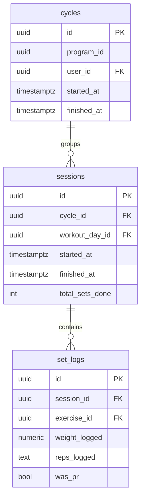
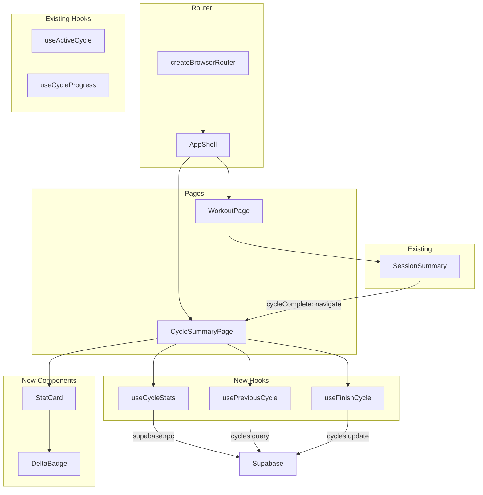
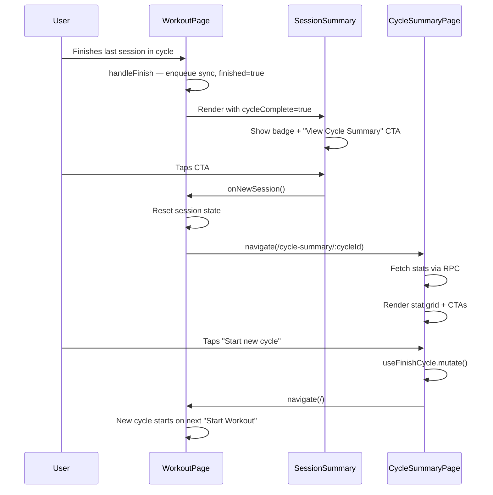

# Tech Plan — Cycle Completion Summary

## Architectural Approach

### Key Decisions

| Decision | Choice | Rationale |
|---|---|---|
| Aggregation strategy | Supabase RPC `get_cycle_stats` in `plpgsql` | Single round-trip, all joins and math server-side. `plpgsql` for conditional delta logic. Follows established `get_exercise_filter_options` pattern. |
| Route placement | Inside `AppShell` with session timer chip hidden | Consistent nav (drawer, sync status) but no irrelevant session chrome. Celebratory feel preserved via page design. |
| `CycleCompleteBanner` fate | Delete entirely | Summary route replaces it. No inline banner on carousel. |
| Session total (N/M display) | Client-side from `useCycleProgress.totalDays` | RPC returns `session_count` only. Avoids non-FK join in the RPC; client already computes `totalDays`. |
| Cycle finalization | Shared `useFinishCycle` hook | Extracted from `WorkoutPage.handleFinishCycle`. Used by `CycleSummaryPage` for "Start new cycle" CTA. |
| Previous cycle resolution | `usePreviousCycle(programId, currentCycleId)` hook | Simple query: most recent `finished_at IS NOT NULL` cycle for the same program, excluding current. |
| Navigation trigger | `SessionSummary` receives `cycleComplete` + `cycleId` props | When cycle is complete, "New Session" becomes "View Cycle Summary" and navigates to `/cycle-summary/:cycleId`. |
| `reps_logged` text safety | RPC filters non-numeric reps via `WHERE reps_logged ~ '^\d+$'` | Defensive — in practice all reps are numeric strings, but protects against corrupt data. |

### Critical Constraints

**Router integration** — The new route sits under `AppShell` in `file:src/router/index.tsx` alongside `/`, `/history`, etc. The `SessionTimerChip` in `file:src/components/AppShell.tsx` is conditionally hidden when on the cycle summary route (irrelevant — no active session) via a `useLocation().pathname` check.

**`CycleCompleteBanner` removal** — `file:src/components/workout/CycleCompleteBanner.tsx` is deleted. References in `file:src/pages/WorkoutPage.tsx` are removed. The `cycleProgress.isComplete` check that previously showed the banner now triggers navigation to the summary page (from `SessionSummary`).

**Cycle must exist before navigating** — The summary page needs a valid `cycleId` in the URL. If the user hits `/cycle-summary/:cycleId` with a bogus ID, the RPC returns an error object. The page shows an error state with a "Back to workouts" link.

**`handleNewSession` modification** — Currently resets all session state and sets `finished = false`. For cycle-complete sessions, `onNewSession` navigates to `/cycle-summary/:cycleId` after resetting session state. The user lands on the summary page instead of the carousel.

---

## Data Model

### RPC: `get_cycle_stats`

```sql
CREATE OR REPLACE FUNCTION get_cycle_stats(
  p_cycle_id uuid,
  p_previous_cycle_id uuid DEFAULT NULL
)
RETURNS json
LANGUAGE plpgsql
STABLE
SECURITY DEFINER
SET search_path = public
AS $$
DECLARE
  v_session_count   int;
  v_total_duration  bigint;
  v_total_sets      int;
  v_started_at      timestamptz;
  v_last_finished   timestamptz;
  v_total_volume    numeric;
  v_pr_count        int;
  v_duration_days   int;
  v_result          json;
  v_prev_volume     numeric;
  v_prev_sets       int;
  v_prev_prs        int;
BEGIN
  -- Aggregate session-level stats
  SELECT
    COUNT(*)::int,
    EXTRACT(EPOCH FROM COALESCE(SUM(s.finished_at - s.started_at), INTERVAL '0'))::bigint * 1000,
    COALESCE(SUM(s.total_sets_done), 0)::int,
    c.started_at,
    MAX(s.finished_at)
  INTO v_session_count, v_total_duration, v_total_sets, v_started_at, v_last_finished
  FROM cycles c
  LEFT JOIN sessions s ON s.cycle_id = c.id AND s.finished_at IS NOT NULL
  WHERE c.id = p_cycle_id
  GROUP BY c.id, c.started_at;

  IF v_started_at IS NULL THEN
    RETURN json_build_object('error', 'cycle_not_found');
  END IF;

  -- Aggregate set-level stats (volume + PRs)
  SELECT
    COALESCE(SUM(sl.weight_logged * sl.reps_logged::int), 0)::numeric,
    COUNT(*) FILTER (WHERE sl.was_pr)::int
  INTO v_total_volume, v_pr_count
  FROM set_logs sl
  JOIN sessions s ON s.id = sl.session_id
  WHERE s.cycle_id = p_cycle_id
    AND s.finished_at IS NOT NULL
    AND sl.reps_logged ~ '^\d+$';

  -- Duration in calendar days
  v_duration_days := GREATEST(
    EXTRACT(DAY FROM (v_last_finished - v_started_at))::int + 1,
    1
  );

  v_result := json_build_object(
    'session_count',    v_session_count,
    'total_duration_ms', v_total_duration,
    'total_sets',       v_total_sets,
    'total_volume_kg',  v_total_volume,
    'pr_count',         v_pr_count,
    'started_at',       v_started_at,
    'last_finished_at', v_last_finished,
    'duration_days',    v_duration_days
  );

  -- Optional: compute deltas vs previous cycle
  IF p_previous_cycle_id IS NOT NULL THEN
    SELECT
      COALESCE(SUM(sl.weight_logged * sl.reps_logged::int), 0)::numeric,
      COALESCE(SUM(s2.total_sets_done), 0)::int,
      COUNT(*) FILTER (WHERE sl.was_pr)::int
    INTO v_prev_volume, v_prev_sets, v_prev_prs
    FROM set_logs sl
    JOIN sessions s2 ON s2.id = sl.session_id
    WHERE s2.cycle_id = p_previous_cycle_id
      AND s2.finished_at IS NOT NULL
      AND sl.reps_logged ~ '^\d+$';

    v_result := v_result::jsonb || jsonb_build_object(
      'delta_volume_pct', CASE WHEN v_prev_volume > 0
        THEN ROUND(((v_total_volume - v_prev_volume) / v_prev_volume * 100)::numeric, 1)
        ELSE NULL END,
      'delta_sets_pct', CASE WHEN v_prev_sets > 0
        THEN ROUND(((v_total_sets - v_prev_sets)::numeric / v_prev_sets * 100)::numeric, 1)
        ELSE NULL END,
      'delta_prs_pct', CASE WHEN v_prev_prs > 0
        THEN ROUND(((v_pr_count - v_prev_prs)::numeric / v_prev_prs * 100)::numeric, 1)
        ELSE NULL END
    );
  END IF;

  RETURN v_result;
END;
$$;
```

### TypeScript return type

```typescript
// src/types/database.ts
export interface CycleStats {
  session_count: number
  total_duration_ms: number
  total_sets: number
  total_volume_kg: number
  pr_count: number
  started_at: string
  last_finished_at: string | null
  duration_days: number
  delta_volume_pct: number | null
  delta_sets_pct: number | null
  delta_prs_pct: number | null
}
```

### ER Diagram (read path — no schema changes)



### Table Notes

**`get_cycle_stats` RPC** — Joins `cycles → sessions → set_logs` in two passes: first for session-level aggregates (count, duration, sets), then for set-level aggregates (volume, PRs). The split avoids double-counting `total_sets_done` when joining to `set_logs`. The `reps_logged ~ '^\d+$'` filter ensures the `::int` cast never throws on non-numeric data.

**`duration_days`** — Calendar days from `started_at` to `last_finished_at`, minimum 1. Uses `EXTRACT(DAY FROM interval)` which gives calendar days, not 24h periods. A cycle spanning 26 hours across midnight shows "2 days" — acceptable for this use case.

**Delta computation** — Only when `p_previous_cycle_id` is provided. Division by zero guarded with `CASE WHEN > 0`. Returns `NULL` delta when the previous cycle has zero of that metric, which the client renders as no badge / "N/A".

---

## Component Architecture

### Layer Overview



### New Files & Responsibilities

| File | Purpose |
|---|---|
| `supabase/migrations/YYYYMMDDHHMMSS_create_get_cycle_stats.sql` | RPC function `get_cycle_stats` |
| `src/pages/CycleSummaryPage.tsx` | Full-page cycle summary: hero, stat grid, delta badges, CTAs |
| `src/hooks/useCycleStats.ts` | `useCycleStats(cycleId, previousCycleId?)` — wraps RPC call, returns `CycleStats` |
| `src/hooks/usePreviousCycle.ts` | `usePreviousCycle(programId, currentCycleId)` — fetches last finished cycle |
| `src/hooks/useFinishCycle.ts` | `useFinishCycle()` — `useMutation` that sets `finished_at` + invalidates cycle queries |
| `src/components/cycle-summary/StatCard.tsx` | Reusable stat card: icon, value, label, optional delta badge |
| `src/components/cycle-summary/DeltaBadge.tsx` | Inline badge: green ↑ / red ↓ / neutral, with percentage |

### Modified Files

| File | Change |
|---|---|
| `file:src/router/index.tsx` | Add `/cycle-summary/:cycleId` route under `AppShell`, import `CycleSummaryPage` |
| `file:src/components/AppShell.tsx` | Hide `SessionTimerChip` when pathname starts with `/cycle-summary` |
| `file:src/pages/WorkoutPage.tsx` | Remove `CycleCompleteBanner` import/usage; pass `cycleComplete` + `cycleId` to `SessionSummary`; modify `handleNewSession` to navigate when cycle is complete |
| `file:src/components/workout/SessionSummary.tsx` | Accept `cycleComplete` + `cycleId` props; show "Cycle Complete!" badge; change CTA to "View Cycle Summary" + navigate behavior |
| `file:src/locales/en/workout.json` | Add `cycleSummary.*` keys |
| `file:src/locales/fr/workout.json` | Add `cycleSummary.*` keys |
| `file:src/types/database.ts` | Add `CycleStats` interface |
| `file:src/components/workout/CycleCompleteBanner.tsx` | **Delete** |

### Component Responsibilities

**`CycleSummaryPage`**
- Reads `cycleId` from `useParams()`
- Fetches cycle metadata via `supabase.from("cycles").select("*").eq("id", cycleId).single()` to get `program_id`
- Calls `usePreviousCycle(programId, cycleId)` to get comparison target
- Calls `useCycleStats(cycleId, previousCycleId)` for all stats
- Gets `totalDays` from a lightweight `useWorkoutDays(programId)` call (already cached)
- Renders: hero (Trophy icon, title, date range), stat grid (7 `StatCard`s in 2-column grid), comparison callout, CTAs
- "Start new cycle" → `useFinishCycle().mutate(cycleId)` then `navigate("/")`
- "Back to workouts" → `navigate("/")` without finalizing
- Error state: "Cycle not found" + "Back to workouts" link
- Loading state: skeleton grid matching the stat card layout

**`StatCard`**
- Props: `icon: LucideIcon`, `value: string | number`, `label: string`, `delta?: { value: number }`
- Renders: icon top-left, large bold value, muted label below, optional `DeltaBadge` inline with value
- Uses shadcn `Card` base styling

**`DeltaBadge`**
- Props: `value: number` (percentage)
- `value > 0`: green text, ↑ arrow, `+X%`
- `value < 0`: red text, ↓ arrow, `X%`
- `value === 0` or `null`: not rendered

**`useFinishCycle()`**
- Returns `useMutation` wrapping `supabase.from("cycles").update({ finished_at: new Date().toISOString() }).eq("id", cycleId)`
- `onSuccess`: invalidates `["active-cycle"]` and `["cycle-sessions"]`
- Idempotent — updating `finished_at` on an already-finished cycle is a no-op

**`useCycleStats(cycleId, previousCycleId?)`**
- Query key: `["cycle-stats", cycleId]`
- Calls `supabase.rpc("get_cycle_stats", { p_cycle_id: cycleId, p_previous_cycle_id: previousCycleId ?? null })`
- `enabled: !!cycleId`
- Returns `CycleStats | null`

**`usePreviousCycle(programId, currentCycleId)`**
- Query key: `["previous-cycle", programId, currentCycleId]`
- Queries `cycles` where `program_id = programId`, `finished_at IS NOT NULL`, `id != currentCycleId`, ordered by `finished_at DESC`, limit 1
- Returns `Cycle | null`
- `enabled: !!programId && !!currentCycleId`

### SessionSummary Integration

In `file:src/pages/WorkoutPage.tsx`, after `handleFinish` sets `finished = true`:

```typescript
const isCycleComplete = cycleProgress.isComplete

// In render:
if (finished) {
  return (
    <SessionSummary
      setsDone={daySetsDone}
      exercisesCompleted={exercisesCompleted}
      totalExercises={exercises.length}
      prExercises={prExercises}
      onNewSession={handleNewSession}
      cycleComplete={isCycleComplete}
      cycleId={session.cycleId}
    />
  )
}
```

In `file:src/components/workout/SessionSummary.tsx`:

```typescript
interface SessionSummaryProps {
  // ...existing props
  cycleComplete?: boolean
  cycleId?: string | null
}

// When cycleComplete is true:
// 1. Show a "🎉 Cycle Complete!" badge above the "Session Complete!" heading
// 2. Change CTA button text from t("newSession") to t("cycleSummary.viewSummary")
// 3. onNewSession callback still resets session state, but the parent
//    WorkoutPage navigates to /cycle-summary/:cycleId afterward
```

In `file:src/pages/WorkoutPage.tsx`, `handleNewSession` becomes:

```typescript
function handleNewSession() {
  const shouldNavigateToSummary = finished && cycleProgress.isComplete && session.cycleId
  const cycleIdForNav = session.cycleId

  // Reset session state (same as before)
  setFinishedQuickInfo(null)
  setSession({ ...defaultSessionState })
  setPrFlags({})
  setSessionBest1RM({})
  setFinished(false)

  if (shouldNavigateToSummary && cycleIdForNav) {
    navigate(`/cycle-summary/${cycleIdForNav}`)
  }
}
```

### Navigation Flow



### i18n Keys

| Key | EN | FR |
|---|---|---|
| `cycleSummary.title` | Cycle Complete! | Cycle terminé ! |
| `cycleSummary.subtitle` | Here's how you did | Voici votre bilan |
| `cycleSummary.sessions` | Sessions | Séances |
| `cycleSummary.duration` | Total time | Temps total |
| `cycleSummary.sets` | Sets done | Séries faites |
| `cycleSummary.volume` | Volume lifted | Volume soulevé |
| `cycleSummary.prs` | Personal records | Records personnels |
| `cycleSummary.consistency` | Completed in | Complété en |
| `cycleSummary.days` | days | jours |
| `cycleSummary.firstCycle` | First cycle — great start! | Premier cycle — bon début ! |
| `cycleSummary.vsPrevious` | vs. previous cycle | vs. cycle précédent |
| `cycleSummary.startNewCycle` | Start new cycle | Nouveau cycle |
| `cycleSummary.backToWorkouts` | Back to workouts | Retour aux entraînements |
| `cycleSummary.cycleCompleteBadge` | Cycle complete! | Cycle terminé ! |
| `cycleSummary.viewSummary` | View Cycle Summary | Voir le bilan du cycle |
| `cycleSummary.notFound` | Cycle not found | Cycle introuvable |
| `cycleSummary.errorLoading` | Could not load stats | Impossible de charger les stats |

### Failure Mode Analysis

| Failure | Behavior |
|---|---|
| RPC returns `{ error: "cycle_not_found" }` | Page shows "Cycle not found" message with "Back to workouts" link |
| RPC call fails (network error) | TanStack Query retry (1 attempt per default config). Loading → error state with retry button. |
| User navigates to summary for another user's cycle | RLS blocks the query — RPC returns empty/error. Same "not found" state. |
| User taps "Start new cycle" twice | `useFinishCycle` mutation is idempotent — `UPDATE SET finished_at` succeeds even if already set. Navigation is harmless. |
| Cycle has zero finished sessions (manual early finish) | RPC returns zeroes: `session_count: 0`, `total_volume_kg: 0`, etc. Page renders gracefully. |
| `reps_logged` contains non-numeric value | Filtered out by `WHERE reps_logged ~ '^\d+$'`. Volume calc excludes those sets silently. |
| Offline when landing on summary page | RPC fails. Error state: "Could not load stats — check your connection". "Back to workouts" link still works (client-side nav). |
| Previous cycle had zero volume (division by zero) | `CASE WHEN v_prev_volume > 0` returns `NULL` delta. `DeltaBadge` not rendered. |
| `session.cycleId` is null (offline session) | `cycleProgress.isComplete` may still be true from cache, but `cycleId` is null. `SessionSummary` falls back to normal "New Session" behavior — no summary navigation. |

---

When ready, say **split into tickets** to continue.
