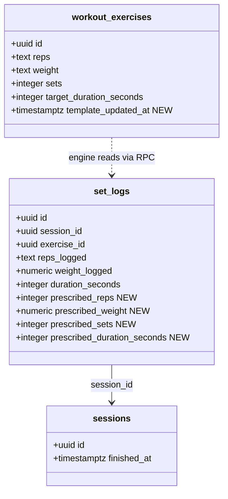
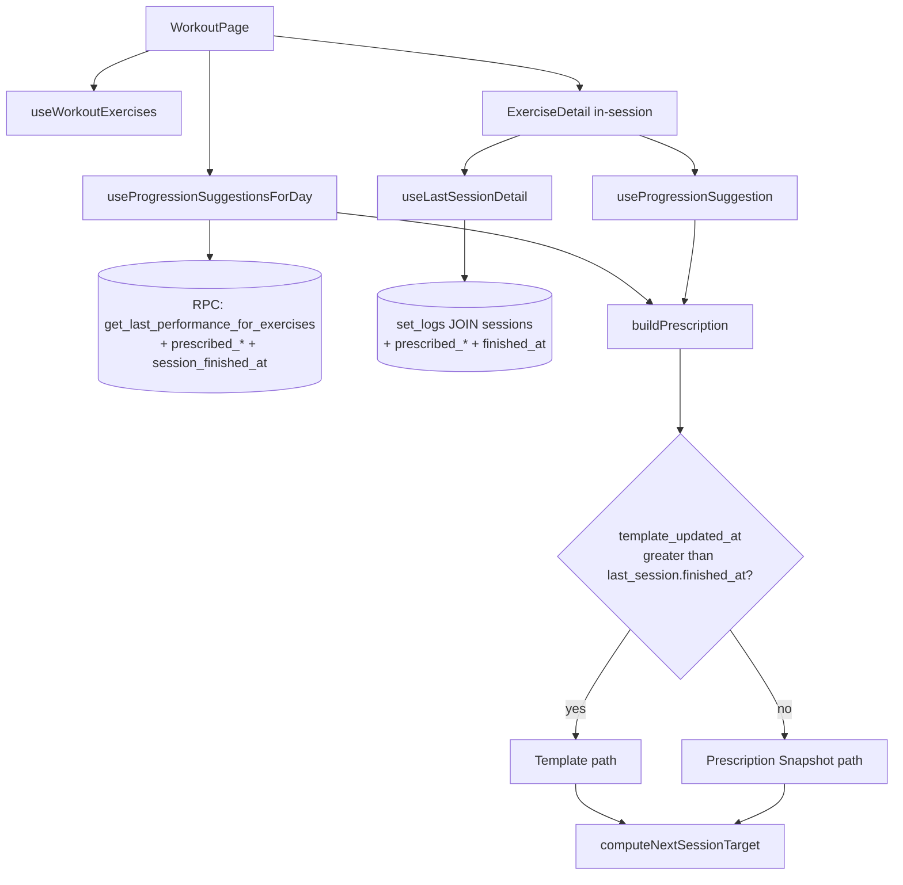
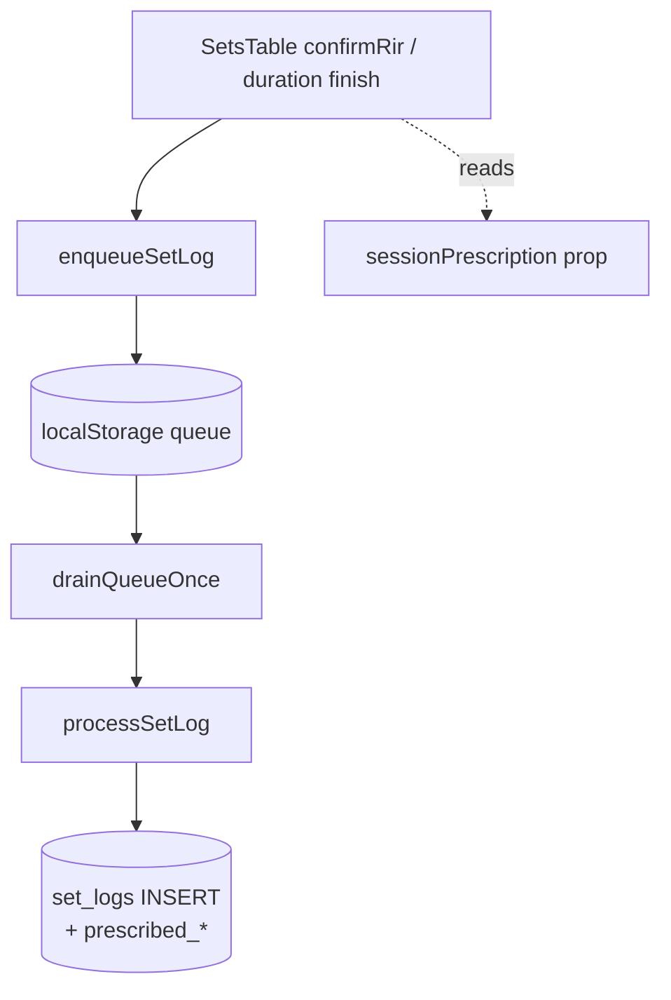

# Tech Plan — Decouple Template from Progression Engine

> Issue: [#373 — Engine retroactively reframes 'nailed it' as 'missed reps' after a REPS_UP bump](https://github.com/PierreTsia/workout-app/issues/373). Architectural decision: `docs/adr/0006-decouple-template-from-progression-engine.md`. Glossary: `docs/CONTEXT.md` — section `## Progression engine` (terms: **Template Prescription**, **Prescription Snapshot**, **Manual Override Window**, **Last Performance**).

## Architectural Approach

The bug is a feedback loop between three things: (1) `enqueueSessionFinish` writes the engine's `Progression Suggestion` back into `workout_exercises`, (2) the engine's next read of `workout_exercises.reps` mistakes that mutated value for ground truth, (3) it then compares it against logs that still reflect the *pre-bump* prescription, classifying a clean session as `HOLD_INCOMPLETE`.

We break the loop in three coordinated cuts: stop the writeback, persist the engine's per-set target on `set_logs` instead (the **Prescription Snapshot**), and let the engine read from there going forward. We add a `template_updated_at` timestamp + Postgres trigger so manual Builder edits to `workout_exercises` keep working as a deload / override path (the **Manual Override Window**) — closing the historical "weight-only override gap" as a free byproduct.

### Key Decisions

| Decision | Choice | Rationale |
|---|---|---|
| Bug fix shape | **Kill writeback + snapshot prescription on `set_logs` + Manual Override Window** (ADR 0006). | Three options were considered (band-aid in `computeNextSessionTarget`, snapshot only, kill writeback only). All three are insufficient on their own — see ADR 0006 alternatives table. |
| Volume axes covered | **All four** — reps, weight, sets, duration. | Same code path, same data flow; splitting axes across PRs creates windows where one axis is broken while another is fixed. |
| Snapshot semantics | **`prescribed_*` = engine's pristine `Progression Suggestion` at session-start** (or template values on bootstrap). Mid-session in-row edits become actuals (`reps_logged`), not new prescriptions. | Preserves `HOLD_INCOMPLETE` detection: prescribed=11, logged=8 → HOLD; if we used "displayed at log-time" instead, the user typing "8" before pressing log would flip it to REPS_UP. Permanent intent shifts go through `Manual Override Window`. |
| Backfill strategy | **Eager backfill at migration time**: `prescribed_X = X_logged`, `prescribed_sets = COUNT(*) over (session_id, exercise_id)`. | Engine read path stays uniform after — no NULL branch in production hot path. Honest bounded lie: legacy partial-failure last sessions get masked as completions, max one mislabel per user. |
| `prescribed_*` column types | **`INT` for reps/sets/duration_seconds, `NUMERIC` for weight**, all nullable. | The engine resolves range strings (`"8-12"`) to integers at session-start; per-set range storage would be lossy. Nullable kept as defensive shape only. |
| `template_updated_at` maintenance | **Postgres trigger**, fires `BEFORE UPDATE OF reps, weight, sets, target_duration_seconds`, internal `IS DISTINCT FROM` check. `DEFAULT NOW()` on INSERT. | Multiple write paths (Builder, AI program creation, MCP `create_program`, future tools) — single forgotten path under app-level maintenance equals silent override regression. Trigger covers everything by construction. |
| RPC strategy | **Extend** `get_last_performance_for_exercises` (#371) with 4 `prescribed_*` columns + `session_finished_at`. | Less churn than replacing what just shipped; hook's grouping-by-`exercise_id` already absorbs the extra denormalized columns. |
| Override-window read path | **Inside `buildPrescription`**: branch on `templateUpdatedAt > lastSessionFinishedAt`. Both engine call sites (`useProgressionSuggestion`, `useProgressionSuggestionsForDay`) consume the same pure helper. | Single source of truth for the rule. Pure-function tests cheaper than hook tests. |
| Per-exercise hook update | **Extend `useLastSessionDetail`** to embed `sessions(finished_at)` and select the new `prescribed_*` columns. Return shape becomes `{ sets, lastSessionFinishedAt } \| null`. | Direct `set_logs` query (no RPC) — PostgREST embedded resource join is one extra `select` segment. |
| Writeback removal | Delete `progressionTargets` write block in `processSessionFinish` + the entire prescription-and-suggestion construction in `WorkoutPage.tsx:handleFinish` (~80 LOC). Keep `autoDetectLoadingExercises` (independent feature). | Once the engine reads from snapshot, the writeback is a stale cache with no consumers. `progressionTargets` only ever fed the writeback. |
| `set_logs` write threading | Two `enqueueSetLog` call sites in `SetsTable.tsx` populate `prescribedReps/Weight/Sets/DurationSeconds` from a `sessionPrescription` prop fed by `ExerciseDetail` (which resolves it from suggestion-or-template at session start). | Suggestion is stable across the session; resolving it in the parent keeps `SetsTable` presentational. |
| Test surface | Pure-function tests for the new `buildPrescription` branch; hook tests for both engine paths covering snapshot / bootstrap / override-window; `syncService.test.ts` extended for the new payload fields; **regression test for the issue's exact repro** (prescribe 10×3, log 10×3 → REPS_UP=11; next session log 11×3 → REPS_UP=12, NOT HOLD_INCOMPLETE). | The repro is the canonical failing case; codifying it prevents the same feedback loop from sneaking back. |
| Sequencing | **Single PR** containing migration + RPC extension + engine refactor + writeback removal + write threading. | Eager backfill makes "ship snapshot writes first, flip reads later" pointless — historical data is already populated. |

### Critical Constraints

**RLS preservation.** Migration runs as a Supabase migration. `set_logs` and `workout_exercises` policies stay as-is — new columns inherit the row's existing policy. Trigger function runs in the row owner's privilege context (`SECURITY DEFINER` not used). Migration test: invoke as a non-owning user → 0 rows touched.

**No mutation of `Template Prescription` from `enqueueSessionFinish`.** This is the inverse of what the writeback does today and the central invariant of the fix. `processSessionFinish` after the change writes only to `sessions` (and `cycles` on close). Any future code path that wants to mutate `workout_exercises` outside the Builder must go through `Manual Override Window` semantics — i.e. the trigger fires, `template_updated_at` bumps, override applies on next session. Documented in `CONTEXT.md` under **Template Prescription**.

**Cache invalidation parity.** `drainQueueOnce` already invalidates `["progression-suggestions-for-day"]` (`syncService.ts:536`) and `["last-session-detail", exId]` (`syncService.ts:530`). With `prescribed_*` now in those query results, the existing invalidations cover the new data — no new invalidation key needed.

**Trigger correctness.** The trigger uses `IS DISTINCT FROM` (NULL-safe) and is column-scoped via `BEFORE UPDATE OF` (skips unrelated UPDATE statements entirely). `DEFAULT NOW()` on the column itself ensures every existing row gets a sensible value at migration time without an explicit backfill — the migration runs `UPDATE workout_exercises SET template_updated_at = NOW()` once for fairness, then the trigger maintains it forever.

**Bootstrap session has no snapshot.** First session for an exercise has no `Last Performance`, hence no `prescribed_*` to read. Engine falls back to `Template Prescription` directly — the existing bootstrap path in `buildPrescription`. Override-window check is irrelevant here (no `last_session.finished_at` to compare against).

**The `progressionTargets` field on `SessionFinishPayload` becomes dead weight.** We delete it from the type and the `enqueueSessionFinish` call site. Existing offline-queue items in `localStorage` carrying the old shape will be ignored by `processSessionFinish` (extra fields tolerated; we just stop reading them). No queue migration needed.

---

## Data Model

### Migration SQL

```sql
-- supabase/migrations/{ts}_decouple_template_from_engine.sql

-- 1. Prescription Snapshot columns on set_logs ------------------------------
ALTER TABLE set_logs
  ADD COLUMN prescribed_reps integer,
  ADD COLUMN prescribed_weight numeric,
  ADD COLUMN prescribed_sets integer,
  ADD COLUMN prescribed_duration_seconds integer;

-- Eager backfill: claim prescribed = logged for legacy rows.
-- Honest bounded lie documented in ADR 0006.
UPDATE set_logs sl
SET
  prescribed_reps =
    CASE WHEN duration_seconds IS NULL
      THEN NULLIF(reps_logged, '')::integer
      ELSE NULL
    END,
  prescribed_weight = weight_logged,
  prescribed_duration_seconds = duration_seconds,
  prescribed_sets = (
    SELECT COUNT(*)
    FROM set_logs sl2
    WHERE sl2.session_id = sl.session_id
      AND sl2.exercise_id = sl.exercise_id
  )
WHERE prescribed_reps IS NULL
  AND prescribed_weight IS NULL
  AND prescribed_sets IS NULL
  AND prescribed_duration_seconds IS NULL;

-- 2. Manual Override Window --------------------------------------------------
ALTER TABLE workout_exercises
  ADD COLUMN template_updated_at timestamptz NOT NULL DEFAULT now();

-- Backfill existing rows to NOW (default only fires on INSERT).
UPDATE workout_exercises SET template_updated_at = now();

CREATE OR REPLACE FUNCTION bump_workout_exercise_template_updated_at()
RETURNS TRIGGER
LANGUAGE plpgsql
AS $$
BEGIN
  IF NEW.reps IS DISTINCT FROM OLD.reps
     OR NEW.weight IS DISTINCT FROM OLD.weight
     OR NEW.sets IS DISTINCT FROM OLD.sets
     OR NEW.target_duration_seconds IS DISTINCT FROM OLD.target_duration_seconds
  THEN
    NEW.template_updated_at = now();
  END IF;
  RETURN NEW;
END;
$$;

CREATE TRIGGER trg_workout_exercises_template_updated_at
  BEFORE UPDATE OF reps, weight, sets, target_duration_seconds
  ON workout_exercises
  FOR EACH ROW
  EXECUTE FUNCTION bump_workout_exercise_template_updated_at();

-- 3. Extend the existing RPC -------------------------------------------------
DROP FUNCTION IF EXISTS get_last_performance_for_exercises(uuid[]);

CREATE OR REPLACE FUNCTION get_last_performance_for_exercises(
  p_exercise_ids uuid[]
)
RETURNS TABLE (
  exercise_id uuid,
  session_id uuid,
  set_number integer,
  reps_logged text,
  weight_logged numeric,
  rir integer,
  duration_seconds integer,
  prescribed_reps integer,
  prescribed_weight numeric,
  prescribed_sets integer,
  prescribed_duration_seconds integer,
  logged_at timestamptz,
  session_finished_at timestamptz
)
LANGUAGE sql
STABLE
SECURITY INVOKER
SET search_path = public
AS $$
  WITH latest_session_per_exercise AS (
    SELECT DISTINCT ON (sl.exercise_id)
      sl.exercise_id,
      sl.session_id
    FROM set_logs sl
    JOIN sessions s ON s.id = sl.session_id
    WHERE sl.exercise_id = ANY(p_exercise_ids)
      AND s.user_id = auth.uid()
    ORDER BY sl.exercise_id, sl.logged_at DESC
  )
  SELECT
    sl.exercise_id,
    sl.session_id,
    sl.set_number,
    sl.reps_logged,
    sl.weight_logged,
    sl.rir,
    sl.duration_seconds,
    sl.prescribed_reps,
    sl.prescribed_weight,
    sl.prescribed_sets,
    sl.prescribed_duration_seconds,
    sl.logged_at,
    s.finished_at AS session_finished_at
  FROM set_logs sl
  JOIN latest_session_per_exercise lsp
    ON sl.exercise_id = lsp.exercise_id
    AND sl.session_id = lsp.session_id
  JOIN sessions s ON s.id = sl.session_id
  ORDER BY sl.exercise_id, sl.set_number;
$$;

GRANT EXECUTE ON FUNCTION public.get_last_performance_for_exercises(uuid[]) TO authenticated;
```

### Schema delta



### Table Notes

- **`set_logs.prescribed_*`** are nullable as a defensive shape. Going forward, every new row should have all four populated (or the duration/reps pair set as appropriate); the engine treats `NULL` as a defensive fallback rather than a contract.
- **`workout_exercises.template_updated_at`** is `NOT NULL DEFAULT now()`. Migration explicitly backfills existing rows with `now()` so they enter the post-migration world with timestamps from migration time, ensuring `last_session.finished_at` (always pre-migration for legacy data) is older — i.e. legacy users do *not* trigger Manual Override Window on their first post-migration session. This is intentional: we want them to use their `Prescription Snapshot` (eagerly backfilled), not the template.
- **The trigger** uses `IS DISTINCT FROM` (NULL-safe) inside the function, AND `BEFORE UPDATE OF column_list` at the trigger level. Both are necessary: column-level skips unrelated UPDATEs cheaply; the function-level check skips no-op UPDATEs that happen to touch tracked columns with same values.
- **The RPC's denormalization** (`session_finished_at` repeated on every set log row) is acceptable: rows-per-call is bounded by `N exercises × ~5 sets`, the JOIN is on indexed PKs, and the alternative (multiple round-trips or JSON aggregation) adds complexity without measurable benefit at this scale.

---

## Component Architecture

### Layer Overview — Read path (engine)



### Layer Overview — Write path (set log)



### New Files & Responsibilities

| File | Purpose |
|---|---|
| `supabase/migrations/{ts}_decouple_template_from_engine.sql` | Schema delta + trigger + backfill + RPC re-creation. Single migration. |
| `src/lib/progression.test.ts` (additions) | New tests for the override-window branch in `buildPrescription`; the canonical bug repro from the issue. |

### Modified Files & Responsibilities

| File | Change |
|---|---|
| `src/lib/progression.ts` | `buildPrescription` signature: add `lastSessionFinishedAt: string \| null` and read `templateUpdatedAt` from the new field on `WorkoutExercise`. Add internal branch — when override window fires, use template values for `volume.current` / `currentSets` / `currentWeight`; otherwise read `prescribed_*` from `lastPerformance[0]`. `SetPerformance` gains optional `prescribedReps?` / `prescribedWeight?` / `prescribedSets?` / `prescribedDurationSeconds?` fields. |
| `src/types/database.ts` | `WorkoutExercise` interface: add `template_updated_at: string`. |
| `src/hooks/useLastSessionDetail.ts` | Select query gains `prescribed_reps, prescribed_weight, prescribed_sets, prescribed_duration_seconds, sessions(finished_at)`. Return type becomes `{ sets: SetPerformance[]; lastSessionFinishedAt: string } \| null`. Map prescribed_* into each `SetPerformance`. |
| `src/hooks/useProgressionSuggestion.ts` | Pass new `lastSessionFinishedAt` from `useLastSessionDetail` and `template_updated_at` from the `WorkoutExercise` prop into `buildPrescription`. Adapt to the new return shape from `useLastSessionDetail`. |
| `src/hooks/useProgressionSuggestionsForDay.ts` | Map the new RPC columns (`prescribed_*`, `session_finished_at`) onto `SetPerformance[]` + `lastSessionFinishedAt` per exercise. Pass into `buildPrescription` along with `template_updated_at` from each `WorkoutExercise`. |
| `src/lib/syncService.ts` | (1) Extend `SetLogPayloadReps` and `SetLogPayloadDuration` with `prescribedReps?`, `prescribedWeight?`, `prescribedSets?`, `prescribedDurationSeconds?`. (2) `processSetLog` writes the new columns. (3) Delete the `progressionTargets` write block in `processSessionFinish` (lines 689-710). (4) Remove `progressionTargets` from `SessionFinishPayload` type and `ProgressionTarget` type entirely. (5) Remove `filterValidProgressionTargets` (unused after removal). |
| `src/components/workout/SetsTable.tsx` | New prop `sessionPrescription` (resolved by parent). Two `enqueueSetLog` call sites populate the new prescription fields from this prop. Bootstrap fallback: parent computes `sessionPrescription` from suggestion-or-template, so SetsTable doesn't need to handle the null case at the write site. |
| `src/components/workout/ExerciseDetail.tsx` | Compute `sessionPrescription` once at session start: `useProgressionSuggestion(exercise)` → if non-null, use it; else fall back to template (`{ reps: parseInt(exercise.reps), weight: Number(exercise.weight), sets: exercise.sets, duration: exercise.target_duration_seconds }`). Memoize. Thread to `SetsTable`. |
| `src/pages/WorkoutPage.tsx` | Delete the entire prescription-and-suggestion construction loop in `handleFinish` (lines 769-870 — these only fed `progressionTargets`). **Keep** the `autoDetectLoadingExercises` detection + toast — it's an independent feature; refactor it into a slim loop that only iterates exercises checking `max_weight_reached`. Drop `progressionTargets` from the `enqueueSessionFinish` call. Drop unused imports (`computeNextSessionTarget`, `resolveWeightIncrement`, `ProgressionPrescription`, `SetPerformance`, `VolumePrescription`, `ProgressionTarget`). |
| `src/lib/syncService.test.ts` | Cover: payload includes prescribed_* on rep set log; payload includes prescribed_duration_seconds on duration set log; `processSessionFinish` no longer mutates `workout_exercises`. |
| `src/hooks/useProgressionSuggestion.test.ts` | New tests: snapshot path emits REPS_UP from prescribed value (the canonical regression test); override-window kicks in when template was edited post-session; bootstrap session falls through to template. |
| `src/hooks/useProgressionSuggestionsForDay.test.ts` | Mirror tests for the batched path. |

### Component Responsibilities

**`buildPrescription` (modified)**

```ts
function buildPrescription(
  exercise: WorkoutExercise,
  lastPerformance: SetPerformance[] | null,
  lastSessionFinishedAt: string | null,
  options: BuildPrescriptionOptions,
): ProgressionPrescription | null {
  const useTemplate =
    !lastPerformance ||
    lastPerformance.length === 0 ||
    !lastSessionFinishedAt ||
    new Date(exercise.template_updated_at) > new Date(lastSessionFinishedAt)

  if (useTemplate) {
    return buildFromTemplate(exercise, lastPerformance, options)
  }

  return buildFromSnapshot(exercise, lastPerformance, options)
}
```

- `buildFromSnapshot` reads `prescribed_reps` / `prescribed_weight` / `prescribed_sets` / `prescribed_duration_seconds` from `lastPerformance[0]`. All set logs in a session carry the same `prescribed_sets`, and `prescribed_reps` / `prescribed_weight` for `volume.current` are read from the first set (which is the value the session was anchored to).
- Range / increment fields (`rep_range_min/max`, `weight_increment`, `set_range_min/max`, `duration_range_*`) always come from `exercise` regardless of branch — they're program-level metadata, not session targets.
- `currentWeight` semantics: in the snapshot path, `lastPerformance[0].prescribedWeight ?? lastPerformance[0].weight` (snapshot first, actual fallback). This unifies the previous `lastSessionWeight > 0 ? lastSessionWeight : templateWeight` logic with the override-window path.

**`useLastSessionDetail` (modified)**

```ts
let query = supabase
  .from("set_logs")
  .select(
    "set_number, reps_logged, weight_logged, rir, session_id, " +
    "duration_seconds, prescribed_reps, prescribed_weight, " +
    "prescribed_sets, prescribed_duration_seconds, " +
    "sessions(finished_at)",
  )
  .eq("exercise_id", exerciseId!)
```

- Return shape: `{ sets: SetPerformance[]; lastSessionFinishedAt: string } | null`.
- `sessions(finished_at)` is a PostgREST embedded resource — Supabase returns it as `{ ..., sessions: { finished_at: string } }` per row; we extract once from `data[0]`.
- `lastSessionFinishedAt` is `null` for the bootstrap case (no rows) and propagated to `buildPrescription`, which routes through the template path.

**`SetsTable` write threading**

- New prop: `sessionPrescription: { reps: number; weight: number; sets: number; duration?: number }` — non-nullable, parent always resolves it from suggestion-or-template.
- Two `enqueueSetLog` call sites:
  - Rep set: `prescribedReps: sessionPrescription.reps`, `prescribedWeight: sessionPrescription.weight`, `prescribedSets: sessionPrescription.sets`, `prescribedDurationSeconds: null`.
  - Duration set: `prescribedReps: null`, `prescribedWeight: sessionPrescription.weight`, `prescribedSets: sessionPrescription.sets`, `prescribedDurationSeconds: sessionPrescription.duration ?? null`.

**`ExerciseDetail` (modified)**

- Computes `sessionPrescription` via `useMemo`:

```ts
const sessionPrescription = useMemo(() => {
  if (suggestion) {
    return {
      reps: suggestion.reps,
      weight: suggestion.weight,
      sets: suggestion.sets,
      duration: suggestion.duration,
    }
  }
  return {
    reps: parseInt(exercise.reps, 10) || 0,
    weight: Number(exercise.weight) || 0,
    sets: exercise.sets,
    duration: exercise.target_duration_seconds ?? undefined,
  }
}, [suggestion, exercise])
```

- Passes `sessionPrescription` to `SetsTable`. SetsTable becomes presentational w.r.t. progression — it receives the resolved prescription and writes it back; it does not call `useProgressionSuggestion`.

### Failure Mode Analysis

| Failure | Behavior |
|---|---|
| Bootstrap session — no `Last Performance` | `useLastSessionDetail` / RPC returns `null` / empty. `buildPrescription` falls through to template path. `prescribed_*` on the new set logs come from template. Engine emits `REPS_UP` / `WEIGHT_UP` / etc. on the next session as today. |
| User finishes a session, then edits Builder before next session | `template_updated_at` bumps via trigger. Next engine read: `template_updated_at > last_session.finished_at` → override-window path → engine reads template directly. User's edit lands. After they log the next session, `prescribed_*` capture the engine's *new* suggestion, and the override window closes naturally (subsequent sessions follow snapshot). |
| User edits Builder mid-session | Same as above on next session. Current session's `prescribed_*` reflect the suggestion the row was initialized with. Mid-session row edits become actuals. (Current `SetsTable` doesn't refetch suggestion mid-session, so this is consistent with existing UX.) |
| Migration runs, user has zero `set_logs` history | `prescribed_*` columns added, backfill matches zero rows. `template_updated_at = now()` on all `workout_exercises`. First session post-migration: bootstrap path. No regressions. |
| Migration runs, user's last pre-migration session was incomplete | Backfill claims `prescribed_X = X_logged` for those rows, masking the partial failure. Next session: engine emits `REPS_UP` instead of `HOLD_INCOMPLETE`. Bounded to one mislabel per affected user, then clean. ADR 0006 documents this as the honest lie. |
| User has a duration exercise with `target_duration_seconds` edited mid-cycle | Same `Manual Override Window` semantics as reps/weight. Trigger fires on the column. Next session: template path. |
| Offline queue contains old `SetLogPayload` shape (without `prescribed_*`) | `processSetLog` reads `payload.prescribedReps ?? null` etc. Legacy queue items get NULLs in the new columns — engine on subsequent sessions falls back to defensive logged-equals-prescribed handling. Bounded to in-flight queue items at deploy time. |
| Old offline queue contains `progressionTargets` on a session_finish payload | `processSessionFinish` ignores extra fields (we deleted the read code). No-op. |
| `set_logs` table is large; backfill UPDATE locks for a noticeable window | Backfill is one statement with a correlated subquery for `prescribed_sets`. For sub-100k rows, brief lock. **Action item:** run `SELECT COUNT(*) FROM set_logs` against production before merging migration; if >100k, split backfill by date range. |
| RPC error on `get_last_performance_for_exercises` post-extension | `useProgressionSuggestionsForDay` already handles RPC errors with a top-of-list "Suggestions indisponibles" indicator (#371). Same path covers the new shape. |
| User has `template_updated_at` exactly equal to `last_session.finished_at` (millisecond tie) | `>` not `>=`, so the snapshot path wins on a tie. Sensible: if both happened "at the same moment," prefer the engine's recorded prescription. |
| Trigger fails to fire on a write path we forgot about | Trigger is column-scoped (`BEFORE UPDATE OF reps, weight, sets, target_duration_seconds`), so any UPDATE touching those columns from anywhere fires it. Postgres-level invariant; no app-level path can bypass. |
| `template_updated_at` written manually with a past timestamp | Trigger overrides on UPDATE; INSERT honors explicit value. No code path does this today; if a future migration needs to forge a past timestamp it can `ALTER TABLE DISABLE TRIGGER` for the duration. |

---

## Out of Scope (deferred)

- **Discoverability of the `Manual Override Window`** — Builder hint, "deload this session" button, etc. The capability ships in this PR; surfacing it is a product decision in a separate issue.
- **Range string handling** in the engine (`parseInt("8-12") === 8` is its own latent bug, independent of #373).
- **`sessionSummary.maxWeight` semantic fix** (`file:src/lib/sessionSummary.ts:121` reads `Number(ex.weight)` and was masked by the writeback drifting it upward; should read from `MAX(set_logs.weight_logged)`).
- **`rirSuggestion.ts` parsing of `exercise.reps`** as range — currently corrupted by writeback's `String(t.reps)` cast; partially mitigated by killing the writeback, but the parsing code itself remains brittle.

---

## References

- Issue #373: [Engine retroactively reframes 'nailed it' as 'missed reps' after a REPS_UP bump](https://github.com/PierreTsia/workout-app/issues/373)
- ADR 0006: `docs/adr/0006-decouple-template-from-progression-engine.md`
- Glossary: `docs/CONTEXT.md` — section `## Progression engine`
- Engine: `file:src/lib/progression.ts`, `file:src/hooks/useProgressionSuggestion.ts`, `file:src/hooks/useProgressionSuggestionsForDay.ts`, `file:src/hooks/useLastSessionDetail.ts`
- Write path: `file:src/lib/syncService.ts`, `file:src/components/workout/SetsTable.tsx`, `file:src/pages/WorkoutPage.tsx`
- Existing RPC migration: `file:supabase/migrations/20260527100000_create_get_last_performance_for_exercises.sql`
- Set logs schema: `file:supabase/migrations/20240101000005_create_set_logs.sql`
