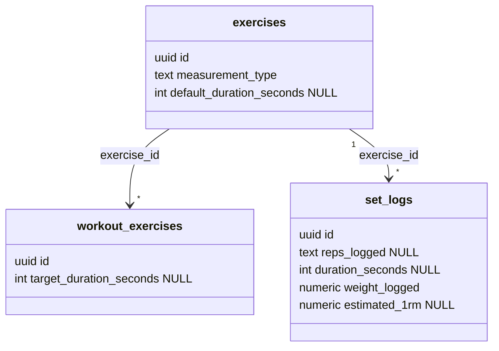
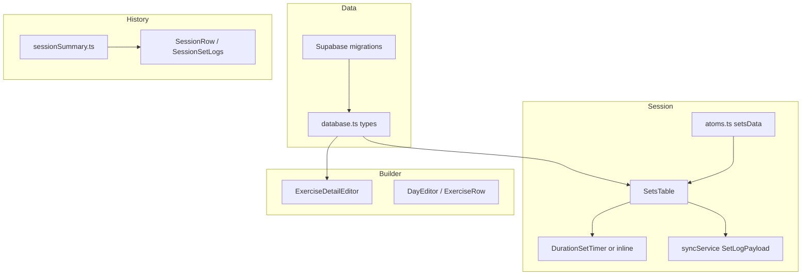

# Tech Plan — Duration-Based Exercises & Set Timer

## Architectural Approach

Ship **measurement mode** end-to-end: **DB constraints** enforce reps vs duration at rest, **Jotai session state** carries parallel shapes per set row, **`syncService`** extends `SetLogPayload` and insert path, and **UI** branches in the builder (`ExerciseDetailEditor`) and live session (`SetsTable` + new timer surface). **Aggregates** (`get_cycle_stats`, history RPCs) must treat **`duration_seconds IS NOT NULL`** as a hard exclude from volume (explicit `CASE` / `WHERE`); legacy digit-only filters are not sufficient once reps can be NULL. **Classification** is a **local-only** pipeline: CSV in → LLM → audit CSV → hand-reviewed SQL migration — no production writes from the script.

### Key Decisions

| Decision | Choice | Rationale |
| --- | --- | --- |
| Set log shape | Add nullable `duration_seconds` (integer ≥ 1); make `reps_logged` **nullable**; add `CHECK` mutual exclusivity | Matches Epic Brief; avoids corrupting `reps_logged` text; keeps SQL aggregates honest |
| `SetLogPayload` | Discriminated: either reps path (`repsLogged`, `estimatedOneRM`, …) or duration path (`durationSeconds`, `repsLogged` omitted / null) | Single queue item type; `processSetLog` maps to DB columns |
| Session `setsData` row | Reps: `{ reps, weight, done, rir? }`. Duration: `targetSeconds`, `done`, optional `weight`, plus **timer anchor** — `timerStartedAt: number \| null` (epoch ms) while running; **do not** persist only `secondsRemaining` (see Timer drift below) | Derived UI: `elapsed = Date.now() - timerStartedAt` (cap at target for countdown display); survives tab sleep / brief crash if state is in Jotai + optional `sessionStorage` snapshot |
| Timer drift / recovery | Store **`timerStartedAt`** (ms), not a decrementing counter | iOS kill, lock screen, or throttled `setInterval` would skew a pure `secondsRemaining`; wall-clock delta is the only robust approach |
| Resolve target seconds | `coalesce(workout_exercises.target_duration_seconds, exercises.default_duration_seconds, 30)` client-side when hydrating session | Epic Brief: template override → catalog default → product constant |
| PR / e1RM for duration | V1: `was_pr = false`, `estimated_1rm = null` for duration inserts; no time-based PR in this epic | Avoids bogus Epley; follow-up epic can define “longest hold” PRs |
| Volume SQL | **Explicit exclusion:** volume terms must use `CASE` / filters so rows with `duration_seconds IS NOT NULL` contribute **zero** volume — never rely on implicit `reps_logged` shape alone | Defensive against bad rows and future columns; same for PR counts if they imply load×reps |
| AI pipeline | `scripts/classify-measurement-type.ts`: read **local CSV**, write `scripts/data/measurement-audit.csv`, optional `--emit-sql` to print `UPDATE` statements; **no** Supabase write in default path | Epic: never LLM → prod |
| Export source | **Staging** or local DB: `COPY (SELECT … FROM exercises) TO STDOUT CSV HEADER` / Supabase Table CSV export; same columns as prod schema version | Reproducible; prod export only after migration applied in lower env |
| Haptics / sound | Web: `navigator.vibrate()` (strong pattern: `[200, 100, 200]`); `new Audio()` or short beep from `/public` | No native app; PWA-friendly; degrade gracefully if denied |

### Critical Constraints

- **Offline queue:** `SetLogPayload` lives in `localStorage` (`file:src/lib/syncService.ts`). Adding fields is backward-compatible if old queued items are drained first; bumping queue schema is **not** required if new fields are optional — but duration rows **must** send `durationSeconds` and omit/null reps for inserts. Document migration order: ship DB migration before client that only emits duration payloads.
- **`reps_logged` NOT NULL today:** Migration must `ALTER COLUMN reps_logged DROP NOT NULL` and backfill is unnecessary (no rows with duration yet). Existing rows stay non-null reps.
- **CHECK constraint rollout:** Mutual-exclusivity `CHECK` on `set_logs` can **fail on existing prod data** if any legacy row has bad data (e.g. `reps_logged` already NULL from a past bug). Use **`ADD CONSTRAINT … NOT VALID`**, then `SELECT` to list violating rows and fix or delete, then **`ALTER TABLE set_logs VALIDATE CONSTRAINT …`**. Avoids a long table lock up front and makes failures a **data audit step**, not a surprise deploy abort.
- **`summarizeSessionLogs`** (`file:src/lib/sessionSummary.ts`) assumes `reps_logged` for labels — must branch on `duration_seconds` for preview strings (e.g. `45s` / `1:00`).
- **`SessionRow`** (`file:src/components/history/SessionRow.tsx`) grid shows Reps / Weight / 1RM — duration sets need a column or merged cell (e.g. “Durée” + seconds, hide 1RM or show `–`).
- **Exercise fetch:** Session and builder must load `measurement_type`, `default_duration_seconds` with exercises; extend Supabase `select()` wherever `WorkoutExercise` / `Exercise` are loaded (e.g. `WorkoutPage`, program queries).
- **Plank vs Planche:** Data fix is **content** (seed / SQL migration renames or `name_en` / locale keys), not app logic — track as a separate small migration or manual SQL after catalog review.

---

## Data Model



### SQL (illustrative)

```sql
-- exercises
ALTER TABLE exercises
  ADD COLUMN measurement_type text NOT NULL DEFAULT 'reps'
    CHECK (measurement_type IN ('reps', 'duration'));
ALTER TABLE exercises
  ADD COLUMN default_duration_seconds integer
    CHECK (default_duration_seconds IS NULL OR default_duration_seconds > 0);

-- workout_exercises
ALTER TABLE workout_exercises
  ADD COLUMN target_duration_seconds integer
    CHECK (target_duration_seconds IS NULL OR target_duration_seconds > 0);

-- set_logs
ALTER TABLE set_logs ALTER COLUMN reps_logged DROP NOT NULL;
ALTER TABLE set_logs
  ADD COLUMN duration_seconds integer
    CHECK (duration_seconds IS NULL OR duration_seconds > 0);

-- Mutual exclusivity: add NOT VALID first so existing rows are not scanned
-- under a blocking validation in one shot; then audit, fix, validate.
ALTER TABLE set_logs
  ADD CONSTRAINT set_logs_reps_or_duration_chk CHECK (
    (duration_seconds IS NULL AND reps_logged IS NOT NULL)
    OR (duration_seconds IS NOT NULL AND reps_logged IS NULL)
  ) NOT VALID;

-- Example audit before VALIDATE:
-- SELECT id, session_id, reps_logged, duration_seconds
-- FROM set_logs
-- WHERE NOT (
--   (duration_seconds IS NULL AND reps_logged IS NOT NULL)
--   OR (duration_seconds IS NOT NULL AND reps_logged IS NULL)
-- );

ALTER TABLE set_logs VALIDATE CONSTRAINT set_logs_reps_or_duration_chk;
```

### TypeScript (`file:src/types/database.ts`)

- `Exercise`: `measurement_type: 'reps' | 'duration'`; `default_duration_seconds: number | null`.
- `WorkoutExercise`: `target_duration_seconds: number | null`.
- `SetLog`: `reps_logged: string | null`; `duration_seconds: number | null`.

### Table Notes

- **`measurement_type`:** Drives UI; denormalized on exercise so runtime does not guess from nullable columns.
- **`default_duration_seconds`:** Meaningful when `measurement_type === 'duration'`; can be NULL in DB and resolved to **30** in app for display until user edits.
- **`target_duration_seconds`:** Nullable; `NULL` → use exercise default chain in session.
- **`set_logs`:** For duration sets, `weight_logged` may still represent added load (weighted plank); RIR optional / often null. `estimated_1rm` null.

---

## Component Architecture

### Layer Overview



### New Files & Responsibilities

| File | Purpose |
| --- | --- |
| `src/components/workout/DurationSetTimer.tsx` (or similar) | Countdown from **`timerStartedAt` + `targetSeconds`** (recompute each frame or on interval tick); strong vibrate + sound at 0; large “Terminer / Loguer”; early-stop uses `floor((Date.now() - timerStartedAt) / 1000)`; respects `onBlockedByPause` from parent |
| `scripts/classify-measurement-type.ts` | Read CSV, call Groq, write audit CSV; optional `--emit-sql` |
| `scripts/data/exercises-export.sample.csv` | Document expected CSV columns (optional) |
| `supabase/migrations/YYYYMMDDHHMMSS_duration_measurement.sql` | Columns + constraints + `get_cycle_stats` / any RPC updates |

### Component Responsibilities

**`SetsTable`**

- Read `measurement_type` from exercise context (prop or joined exercise map).
- If `reps`: current behavior (reps / weight / checkbox / RIR).
- If `duration`: render `DurationSetTimer` per row instead of reps input; checkbox flow replaced by “log” button inside timer component.
- `enqueueSetLog`: pass `durationSeconds` + null reps for DB, or extend payload type.

**`ExerciseDetailEditor`**

- When exercise is `duration`: show target seconds (bind `target_duration_seconds` on `WorkoutExercise`); hide reps field or show read-only “N/A”.
- Copy: explain fallback chain when target is empty.

**`sessionSummary.ts` / `SessionSummary`**

- Preview lines: for duration logs, show time range or single duration, not `reps` numeric range.

**`SessionRow`**

- Table header: conditional “Reps” vs “Durée” (or combined “Reps / Durée”).
- Row: render `duration_seconds` with `formatDurationSeconds` helper (reuse patterns from `file:src/lib/formatters.ts`).

### Failure Mode Analysis

| Failure | Behavior |
| --- | --- |
| User pauses workout mid-countdown | Pause timer (or block start) same as `SetsTable` pause gate; no log until explicit complete |
| Offline queue has old payload shape | Drain legacy payloads (reps only); new app version generates new shape |
| LLM misclassifies bench as duration | Caught in CSV audit + manual review before SQL apply |
| `navigator.vibrate` unsupported | Skip vibration; rely on sound + visible “time’s up” UI |
| Migration applied before client deploy | Old clients only insert reps rows — OK; new column default allows old inserts if any |
| App reload mid-hold | If session state is restored from `sessionStorage` / Jotai rehydration, `timerStartedAt` still yields correct elapsed; pure `secondsRemaining` would be wrong |

---

## SQL / RPC follow-ups

**Principle:** Volume and any “load × reps” metric must **ignore duration rows** in a way that is obvious in the SQL text — use **`duration_seconds IS NOT NULL` as the primary filter** (or `CASE WHEN sl.duration_seconds IS NULL THEN … ELSE 0 END` for line contributions).

- **`get_cycle_stats`** (`file:supabase/migrations/20260320130000_create_get_cycle_stats.sql`): Replace the volume `SUM` with an explicit form, e.g.  
  `SUM(CASE WHEN sl.duration_seconds IS NULL AND sl.reps_logged ~ '^\d+$' THEN sl.weight_logged * sl.reps_logged::int ELSE 0 END)`  
  and similarly for **PR count** if `was_pr` should only apply to rep-based sets in V1 (or document if duration PRs are excluded).
- **`get_exercise_history_for_sheet`** (and any RPC touching `set_logs` for aggregates): same volume rule; include `duration_seconds` in selects for display; no implicit reliance on `reps_logged ~ '^\d+$'` alone once `duration_seconds` exists.
- **Regenerate** Supabase types if using codegen (`database.types.ts` if present).

---

## Classification pipeline (operational)

1. Export `exercises` (id, name, name_en, muscle_group, equipment, instructions, …) to `scripts/data/exercises-export.csv` from **staging** (or anonymized prod snapshot).
2. Run `npx tsx scripts/classify-measurement-type.ts --input scripts/data/exercises-export.csv`.
3. Review `scripts/data/measurement-audit.csv` (columns: id, name, `measurement_type`, reasoning).
4. Run with `--emit-sql` → paste into a new migration file: `UPDATE exercises SET measurement_type = 'duration', default_duration_seconds = 30 WHERE id IN (...)`.
5. Apply migration to staging → smoke-test app → apply to prod.

**Plank / Planche:** separate content ticket: `UPDATE` names / `name_en` / locale keys so search and labels stay distinct.

---

## Testing

- **Unit:** `sessionSummary` with mixed logs; `syncService` insert payload for duration; atoms reducers for duration set rows.
- **Component:** `SetsTable` / timer: pause blocks log; complete logs `durationSeconds`; early stop logs elapsed < target.
- **SQL:** migration applies cleanly; `NOT VALID` → audit → `VALIDATE CONSTRAINT` path tested on a copy of prod-like data; aggregates return unchanged volume for legacy-only sessions.

---

## References

- Epic Brief: `file:docs/Epic_Brief_—_Duration-Based_Exercises_&_Set_Timer.md`
- Issue: https://github.com/PierreTsia/workout-app/issues/134
- Prior art: `file:docs/Tech_Plan_—_Session_Duration_Excludes_Pause.md` (session-level time; orthogonal)
- Code: `file:src/lib/syncService.ts`, `file:src/store/atoms.ts`, `file:src/components/workout/SetsTable.tsx`, `file:src/lib/sessionSummary.ts`, `file:src/components/history/SessionRow.tsx`
