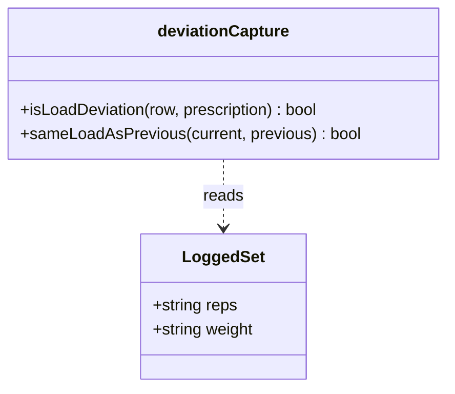
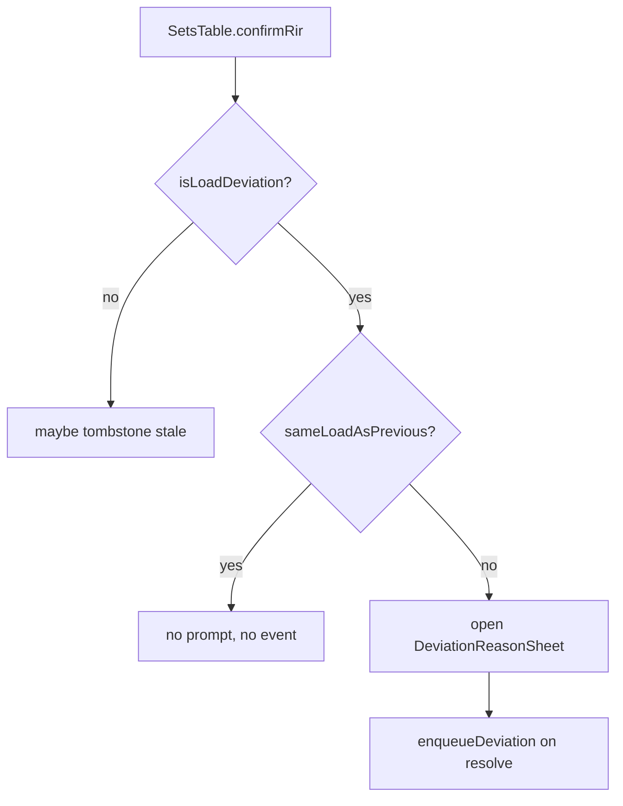

# Tech Plan — Déviation : une décision de charge, un seul prompt

## Architectural Approach

### Key Decisions

| Decision | Choice | Rationale |
|---|---|---|
| Where the rule lives | a pure predicate in `file:src/lib/deviationCapture.ts` | the domain module already owns `isLoadDeviation`; the component stays a caller |
| Predicate shape | `sameLoadAsPrevious(current, previous)` comparing `(weight, reps)` | "charge" spans both axes the prompt already covers |
| Continuation event | **no** `session_deviation_events` row | the decision is already captured; inheriting a reason would fabricate a tap and inflate the Observatory's tap-adoption metric (#609) |
| Deviation vs new decision | two predicates, composed at the call site | keeps `isLoadDeviation` (vs Prescription Snapshot) untouched and testable |
| Stale deletion | unchanged | returning to the prescription still tombstones the decision |

### Critical Constraints

- `file:src/components/workout/SetsTable.tsx` (`confirmRir`) computes the
  prescription in **display units** (`prescribedDisplay`) before calling
  `isLoadDeviation`. The new predicate compares the **previous logged row** of the
  same exercise (`exerciseSets[setIdx - 1]`), which is already in display units —
  no conversion needed.
- `exerciseSets` is per exercise (keyed `setsData[exercise.id]`), so "previous set"
  never crosses an exercise boundary.
- Only reps rows prompt today; duration rows never enter this branch. The predicate
  is only consulted on the reps path.
- The `recordedDeviationsRef` identity is `${exercise.id}|${setNumber}` — a
  continuation set is never added to it, so a later return-to-prescription on that
  set needs no tombstone (there is no event to delete).

---

## Data Model

No schema change. `session_deviation_events` semantics tighten from
one-row-per-set to **one-row-per-load-decision**.

### Table Notes

`session_deviation_events` is unchanged. Fewer rows are produced when an athlete
runs several sets at one deviated load — which is exactly the unit the #609
promotion rule counts (distinct sessions, not series).

---

## Component Architecture

| File | Responsibility |
|---|---|
| `file:src/lib/deviationCapture.ts` | owns `sameLoadAsPrevious` next to `isLoadDeviation` |
| `file:src/components/workout/SetsTable.tsx` | composes the two predicates in `confirmRir`; no prompt on continuation |
| `file:src/components/workout/SetsTable.test.tsx` | regression: identical run prompts once, change re-prompts |
| `file:src/lib/deviationCapture.test.ts` | unit: predicate truth table |

---

## Failure Mode Analysis

| Scenario | Behavior |
|---|---|
| First set deviates, next sets identical | one prompt, one event |
| Load changes again (60 → 70) | new prompt, new event |
| Set returns to prescription | stale event tombstoned (unchanged) |
| First set conforms, second deviates | prompt on the second set (previous conforms ≠ current) |
| Reps change, weight unchanged | treated as a new decision → prompt |
| Previous set unchecked / removed | previous row is no longer `done`; predicate sees the row as-is — a removed set is popped from the array, so the comparison falls back to the new last row |

---

## i18n contract

No new user-facing strings. The sheet copy is unchanged.