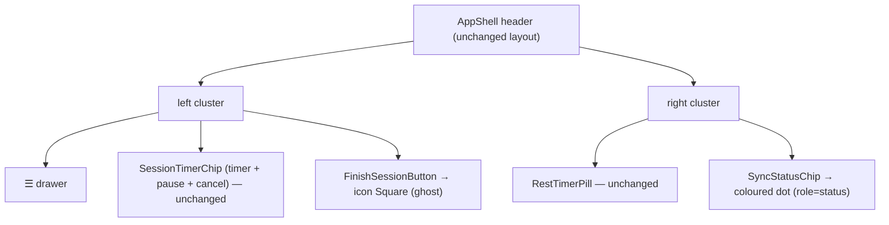

# Tech Plan — En-tête de séance compact (#690)

## Architectural Approach

### Key Decisions

| Decision | Choice | Rationale |
|---|---|---|
| Bouton « Terminer » | Icône seule, `buttonVariants({ variant: "ghost", size: "icon" })` + `h-7 w-7 rounded-full text-destructive` | Aligne la commande sur pause / annulation (`file:src/components/SessionTimerChip.tsx:104-126`) et retire la largeur du libellé |
| Icône de fin | `Square` (lucide) avec `fill-current` | Carré rouge = métaphore « stop / terminer » reconnue ; `fill-current` hérite de `text-destructive` |
| Nom accessible de fin | `aria-label={t("finish")}` (`workout`) | Réutilise la clé existante ; le nom accessible « Finish » reste identique → tests existants inchangés |
| Témoin de sync | `` dot `h-2.5 w-2.5 rounded-full` à la place du `Badge` texte | Plus gros gain de largeur, signal ambiant mieux adapté qu'un mot |
| États du dot | `offline` → gris, `syncing` → ambre (pulse), `synced` → vert, `failed` → rouge | Les 4 états existants de `syncStatusAtom` + `navigator.onLine` sont conservés 1:1, sans nouvelle sémantique |
| Nom accessible du dot | `role="status"` + `aria-label={t(key)}` (`common`) | Le dot ne doit pas être un signal couleur-seul ; `role="status"` annonce les changements |
| Layout de l'en-tête | Inchangé | Décision de grill : le compactage A+B suffit, pas de `shrink-0` |

### Critical Constraints

- **Aucune modification de `syncStatusAtom` ni de `finishRequestAtom`.** On ne touche qu'à la présentation ; la logique de fin (`file:src/components/workout/FinishSessionButton.tsx:27-30`) et d'état de sync (`file:src/store/atoms.ts`) est figée.
- **Le nom accessible du bouton de fin ne doit pas changer.** `FinishSessionButton.test.tsx` interroge `getByRole("button", { name: "Finish" })` ; on conserve donc `aria-label={t("finish")}`, pas un libellé d'icône inventé.
- **`idle` + en ligne reste invisible.** Comportement actuel (`file:src/components/SyncStatusChip.tsx:25-34`) : ne rien afficher quand rien ne se passe. On garde ce contrat, seul `idle` + hors ligne produit le dot gris.
- **Pas de nouvelle couleur arbitraire.** Les classes `bg-green-500` / `bg-amber-500` suivent l'usage existant (`file:src/components/builder/SaveIndicator.tsx:41`) ; `bg-destructive` et `bg-muted-foreground` sont des tokens. La règle eslint ne bannit que `bg-[#…]` (`file:eslint.config.js:68-71`).
- **`RestTimerPill` non touché.** Il reste dans la grappe droite ; son coexistence avec le dot est couverte par le test de largeur.

---

## Data Model

Aucun changement de modèle de données : ni table, ni migration, ni type persisté. Les seuls états sont en mémoire (`syncStatusAtom`, `navigator.onLine`, `sessionAtom`).

---

## Component Architecture

### Layer Overview

### New Files & Responsibilities

Aucun fichier nouveau. Les deux composants modifiés gardent leur chemin et leur nom.

| File | Change |
|---|---|
| `file:src/components/workout/FinishSessionButton.tsx` | Bouton texte → bouton icône (`Square`), `aria-label={t("finish")}` |
| `file:src/components/SyncStatusChip.tsx` | `Badge` texte → dot coloré 4 états, `role="status"` + `aria-label` |
| `file:src/components/workout/FinishSessionButton.test.tsx` | Ajouter l'assertion d'icône / classe (les 4 tests existants restent valides) |
| `file:src/components/SyncStatusChip.test.tsx` | **Nouveau** : couvre les 4 états, `idle`+online → absent, labels traduits |

### Component Responsibilities

**`FinishSessionButton`**
- Reste monté seulement si `session.isActive` (inchangé).
- Rend un `Button` `variant="ghost" size="icon"`, `h-7 w-7 rounded-full text-destructive hover:bg-destructive/20 hover:text-destructive`.
- Contenu : `<Square className="h-3.5 w-3.5 fill-current" />`.
- `aria-label={t("finish")}` — nom accessible identique à avant.
- `onClick` inchangé : navigue vers `/` si nécessaire puis incrémente `finishRequestAtom`.

**`SyncStatusChip`**
- Résout un état unique : `offline` si `status === "idle" && !online` ; sinon l'un de `syncing` / `synced` / `failed` ; `null` si `idle && online`.
- Rend `` avec la couleur de l'état (`bg-muted-foreground` / `bg-amber-500 animate-pulse` / `bg-green-500` / `bg-destructive`).
- Aucun abonnement supplémentaire : conserve `useSyncExternalStore(subscribeOnline, getOnlineSnapshot)` et `useAtomValue(syncStatusAtom)`.

### Failure Mode Analysis

| Failure | Behavior |
|---|---|
| `syncStatusAtom` vaut `idle` et l'appareil est en ligne | Aucun dot rendu (comportement actuel préservé) |
| L'appareil passe hors ligne (`offline` event) | Le dot passe gris, même en `idle` |
| Sync échoue (`failed`) | Dot rouge persistant + `aria-label` « Échec de synchro » |
| Session non active | `FinishSessionButton` retourne `null` ; le dot de sync est indépendant de la session |
| Largeur 360 px avec `RestTimerPill` actif | L'en-tête tient sur une ligne : gauche ≈ menu + timer + 3 icônes, droite ≈ pill + dot |

---

## i18n contract

**Aucune nouvelle chaîne utilisateur.** Le dot réutilise les clés existantes du namespace `common` — `offline` / `syncing` / `synced` / `syncFailed`
(`file:src/locales/{en,fr}/common.json`) — comme `aria-label`, et le bouton de fin réutilise `workout.finish`
(`file:src/locales/{en,fr}/workout.json:36`). Aucune clé à créer, aucun passage `microcopy`.
