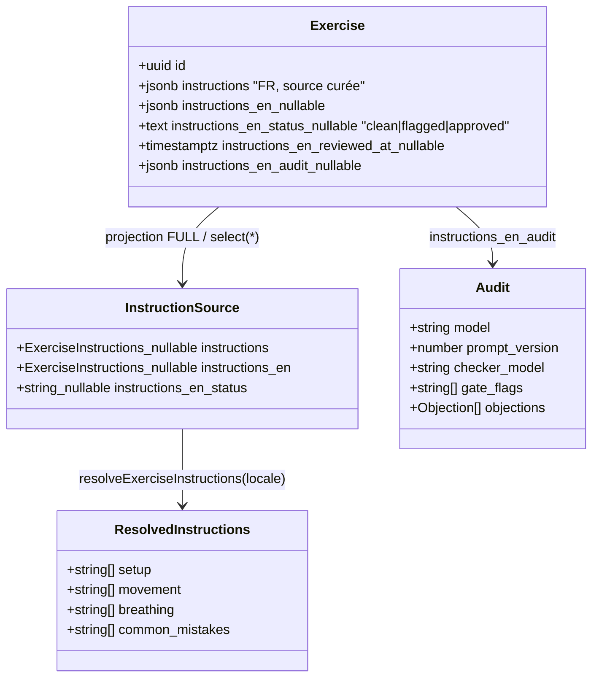
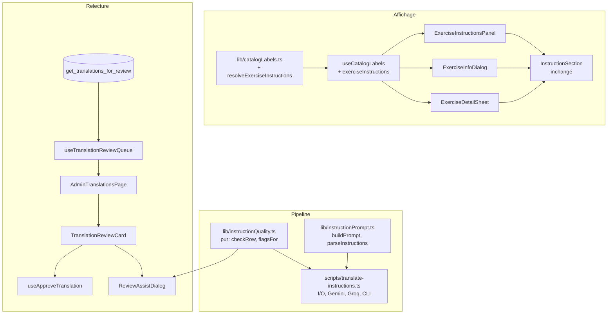

# Tech Plan — English Exercise Instructions (#417)

## Architectural Approach

L'epic est **entièrement en lecture**. Contrairement aux noms, `instructions` n'est snapshotée nulle part : aucun `workout_exercises`, aucun `set_logs`, aucun des six chemins d'écriture de #415. Le risque central de l'epic précédent — un snapshot porteur de logique de tri et de regroupement — n'existe pas ici. Aucun chemin d'écriture applicatif n'est modifié.

La difficulté se déplace sur deux points. D'abord, **trois surfaces dupliquent** aujourd'hui le même bloc `hasInstructions` et lisent `.instructions.*` en direct sans résolveur : `file:src/components/exercise/ExerciseInstructionsPanel.tsx`, `file:src/components/exercise/ExerciseInfoDialog.tsx`, `file:src/components/generator/ExerciseDetailSheet.tsx`. Le résolveur ne se contente donc pas de choisir une langue : il renvoie `ExerciseInstructions | null`, où `null` signifie « rien à afficher ». Il absorbe la décision de présence triplicée, ce qui **supprime** du code au lieu d'en ajouter.

Ensuite, **l'affichage dépend d'une colonne de statut de relecture**. C'est un couplage assumé : la seule façon de garantir qu'une traduction suspecte reste française est que le rendu connaisse le verdict. Le résolveur échoue **fermé** — un statut absent, nul ou inconnu rend du français.

Le reste est un pipeline hors ligne : une lib pure de contrôle qualité dans `src/lib/`, un script de backfill dans `scripts/`, et une route admin sœur pour la relecture.

**Séquence de livraison en quatre PR.** La PR 1 (migration, types, résolveur, trois surfaces) est un **no-op en production** : sans aucune donnée anglaise en base, elle ne change rien à l'écran, ce qui dérisque la migration et le résolveur séparément. La PR 2 livre le filet qualité et le script, sans UI. La PR 3 livre la file et la comparaison. La PR 4 livre l'assistant d'arbitrage par presse-papier.

### Key Decisions

| Decision | Choice | Rationale |
|---|---|---|
| Moment de résolution | **Affichage**, jamais l'écriture | ADR 0010 ; ici c'est gratuit, aucun snapshot n'existe |
| Forme du résolveur | `resolveExerciseInstructions()` dans `file:src/lib/catalogLabels.ts`, renvoyant `ExerciseInstructions \| null` | Absorbe le `hasInstructions` triplicé ; même patron que `resolveExerciseName` |
| Chaîne de repli | `instructions_en` si EN **et** statut ∈ {`clean`, `approved`} **et** parité de sections → sinon `instructions` | Pas de snapshot de secours, la chaîne est plus courte que pour les noms |
| Granularité du repli | **En bloc, jamais par section** | Un panneau mi-anglais mi-français est exactement le défaut qu'a rapporté l'issue |
| Rigueur de la parité | Toute section non vide en FR doit être non vide en EN ; le **nombre de phrases n'est pas comparé** | Le modèle fusionne parfois deux phrases légitimement ; compter les phrases renverrait au français des traductions correctes |
| Comportement par défaut | **Échec fermé** : statut nul, inconnu ou absent de la projection → français | Un anglophone qui lit du français est déçu ; un anglophone qui lit une consigne fausse se blesse |
| Colonnes | **4 colonnes plates** sur `exercises` | Calque `name_en` ; aucune abstraction générique pour un second usage hypothétique |
| Type du statut | `text` + `CHECK` | Aucun enum Postgres dans ce repo ; précédent `difficulty_level` et `measurement_type` |
| `reviewed_at` | **Non réutilisé** — colonne dédiée | Partagé entre la revue de contenu et l'upload d'images ; le réutiliser viderait la file de `file:src/pages/AdminReviewPage.tsx` sans relecture |
| Projection | `instructions_en` + statut ajoutés à `FULL_EXERCISE_SELECT` | `file:src/hooks/useWorkoutExercises.ts` préchauffe le cache `["exercise", id]` depuis FULL ; une ligne tronquée en cache rendrait du français en silence. Coût mesuré ≈ 5 ko par jour |
| Surface de relecture | **Route sœur `/admin/translations`** | `/admin/enrichment` est déjà une route sœur pour le même patron de file ; aucun onglet n'existe en admin |
| File de relecture | Nouveau RPC `get_translations_for_review()`, projection **étroite** | `get_unreviewed_exercises_by_usage` énumère 18 colonnes à la main et pourrit à chaque ajout ; la file n'a besoin que de 8 champs |
| Métrique de priorité | Séries loguées (`set_logs`), **pas** `workout_exercises` | Le RPC existant compte les prescriptions ; on veut l'exposition réelle en lecture |
| Filet qualité | Lib **pure** `file:src/lib/instructionQuality.ts` | CI ne type-check pas `scripts/` ; dans `src/` le filet gagne `tsc -b` et Vitest gratuitement, et n'est importé par aucun composant donc jamais embarqué |
| Traducteur | **Gemini 2.5 Flash** | Mesuré : 29/30 propres, 0 inversion de mode sur 107 entrées, 98 % de cohérence en deuxième personne |
| Contre-relecteur | **Groq `llama-3.3-70b-versatile`** | Autre fournisseur, donc erreurs non corrélées avec le traducteur ; déjà dans les conventions du repo |
| Verdict par défaut | Contre-relecteur indisponible → `flagged`, **jamais** `clean` | Un quota épuisé ne doit pas produire de l'anglais réputé propre |
| Ordre des vagues | **Longue traîne d'abord** (231 jamais logués), puis le top 60 | Mesure le taux réel de signalement à faible enjeu avant de toucher les 77 % d'exposition |
| Écriture backfill | **Service role** | Script headless sans JWT admin |
| Écriture relecture | Client anon + session admin | La policy `"Admins can update exercises"` couvre déjà l'UPDATE depuis le navigateur |
| Mode par défaut du script | **Dry-run**, `--apply` pour écrire | Précédent `file:scripts/backfill-was-pr.ts` ; `file:scripts/enrich-instructions.ts` écrit sans garde-fou, contre-exemple |
| Aller-retour de relecture | Presse-papier dans les **deux sens**, JSON validé puis diffé | Aucune clé LLM dans le navigateur, et l'adjudication reste conversationnelle |

### Critical Constraints

**Le cache React Query est préchauffé depuis `FULL_EXERCISE_SELECT`.** `file:src/hooks/useWorkoutExercises.ts` embarque la ligne catalogue complète et remplit `["exercise", id]`. `ExerciseInstructionsPanel` lit ensuite ce cache via `useExerciseFromLibrary` → `useExerciseById` **sans refetch**. Si les nouvelles colonnes n'entrent pas dans FULL, le panneau ouvert depuis une séance résout en français alors que la même page ouverte depuis la bibliothèque résout en anglais — divergence invisible en revue. Les colonnes vont donc dans `file:src/lib/exerciseSelects.ts`, projection FULL. `LABEL_EXERCISE_SELECT` reste intouchée puisqu'elle ne porte aucune instruction.

**`SwapExerciseSheet` est la seule surface sans refetch par id.** Elle passe telle quelle une ligne issue de `useExerciseLibraryPaginated`, donc de `search_exercises`. Cette fonction est `RETURNS SETOF exercises` avec un `SELECT e.*` : les nouvelles colonnes y circulent automatiquement, sans migration. C'est le seul endroit où l'on dépend de cette propriété — à documenter, parce qu'un futur passage de ce RPC à une projection explicite casserait la traduction silencieusement.

**Le poids réseau est déjà payé, en français.** Mesure : 806 caractères d'instructions par exercice en moyenne, sur 372 lignes et 299 914 caractères au total. Une journée de six exercices ajoute donc ≈ 5 ko avant gzip. En revanche `search_exercises` renvoie `e.*`, donc une page de bibliothèque transporte déjà une vingtaine de kilo-octets d'instructions que la liste n'affiche pas — et qu'on va doubler. C'est une dette préexistante, pas créée ici ; elle mérite une issue séparée plutôt qu'une refonte du RPC de recherche dans cet epic.

**CI ne type-check pas `scripts/`.** `tsconfig.app.json` n'inclut que `src`, `tsconfig.node.json` que `vite.config.ts`, et `tsc -b` ne voit donc aucun des 45 scripts. Seul ESLint les couvre. Toute logique du pipeline qui mérite d'être juste vit dans `src/lib/` ; `scripts/` ne garde que les I/O, les appels réseau et le CLI.

**Deux chemins d'écriture, deux privilèges.** Le backfill a besoin de `SUPABASE_SERVICE_ROLE_KEY` car il tourne sans session. L'écran de relecture écrit depuis le navigateur avec la session de l'admin, exactement comme `file:src/hooks/useAdminUpdateExercise.ts`. Ce hook **stampe systématiquement `reviewed_at` et `reviewed_by`** : la relecture de traduction ne peut donc pas le réutiliser, il lui faut sa propre mutation.

**`get_unreviewed_exercises_by_usage` est aveugle aux nouvelles colonnes** puisqu'il énumère les 18 colonnes existantes. Il continue de fonctionner sans modification — c'est exactement ce qu'on veut, les deux files restent étanches.

**`src/types/database.ts` est maintenu à la main.** Aucun script de génération dans `package.json` : la migration doit être suivie d'une extension manuelle de l'interface `Exercise`. `ExerciseInstructions` est réemployé tel quel pour `instructions_en`, sans variante de type.

**L'i18n admin existe et doit être respectée.** `file:src/locales/en/admin.json` et son pendant français couvrent les pages admin. `EnrichmentCard` est le contre-exemple du repo, avec ses chaînes anglaises en dur : ne pas le copier.

---

## Data Model

Quatre colonnes nullables sur `exercises`, sans défaut. Forward-only, `IF NOT EXISTS`, aucun changement de RLS — les nouvelles colonnes héritent des policies existantes.

```sql
-- supabase/migrations/<timestamp>_add_english_instructions.sql
ALTER TABLE exercises ADD COLUMN IF NOT EXISTS instructions_en jsonb;
ALTER TABLE exercises ADD COLUMN IF NOT EXISTS instructions_en_status text;
ALTER TABLE exercises ADD COLUMN IF NOT EXISTS instructions_en_reviewed_at timestamptz;
ALTER TABLE exercises ADD COLUMN IF NOT EXISTS instructions_en_audit jsonb;

ALTER TABLE exercises
  ADD CONSTRAINT exercises_instructions_en_status_chk
  CHECK (instructions_en_status IN ('clean', 'flagged', 'approved'));
```

`NULL` sur le statut signifie « jamais traduit », ce qui est distinct de « traduit et propre ». Aucun défaut, pour la même raison que `user_profiles.locale` en #415 : un défaut détruirait cette information.

Pas de `instructions_en_reviewed_by` : il y a exactement un relecteur, et `reviewed_by` sur la table existante ne sert qu'à distinguer plusieurs admins sur la revue de contenu.



### Table Notes

**`instructions_en`** — même forme exacte que `instructions` (`setup`, `movement`, `breathing`, `common_mistakes`, tous `string[]`), donc le type `ExerciseInstructions` est réemployé sans variante. Le script n'écrit **jamais** un bloc partiel : la validation de forme précède l'écriture, comme dans `file:scripts/enrich-instructions.ts`.

**`instructions_en_status`** — la seule colonne lue au rendu. `clean` = traduit, passé le filet automatique et le contre-relecteur. `flagged` = une objection subsiste, **rendu en français** jusqu'à arbitrage. `approved` = validé par un humain.

**`instructions_en_audit`** — jamais requêtée, uniquement affichée dans l'écran de relecture. C'est elle qui permet d'accrocher une objection à la phrase fautive :

```json
{
  "model": "gemini-2.5-flash",
  "prompt_version": 1,
  "translated_at": "2026-08-02T09:12:00Z",
  "checker_model": "llama-3.3-70b-versatile",
  "gate_flags": ["dropped-number:movement.2"],
  "objections": [
    {
      "section": "setup",
      "index": 1,
      "verdict": "measurement-changed",
      "note": "'largeur des épaules' rendu 'hip-width'"
    }
  ]
}
```

**Nouveau RPC de file**, projection étroite et comptage sur les séries loguées :

```sql
-- supabase/migrations/<timestamp>_create_translation_review_rpc.sql
CREATE OR REPLACE FUNCTION get_translations_for_review()
RETURNS TABLE (
  id uuid,
  name text,
  name_en text,
  instructions jsonb,
  instructions_en jsonb,
  instructions_en_status text,
  instructions_en_audit jsonb,
  logged_sets bigint
)
LANGUAGE sql STABLE SECURITY DEFINER
AS $$
  SELECT
    e.id, e.name, e.name_en,
    e.instructions, e.instructions_en,
    e.instructions_en_status, e.instructions_en_audit,
    COALESCE(sl.cnt, 0) AS logged_sets
  FROM exercises e
  LEFT JOIN (
    SELECT exercise_id, COUNT(*) AS cnt FROM set_logs GROUP BY exercise_id
  ) sl ON sl.exercise_id = e.id
  WHERE e.instructions_en IS NOT NULL
    AND e.instructions_en_reviewed_at IS NULL
  ORDER BY
    (e.instructions_en_status = 'flagged') DESC,
    COALESCE(sl.cnt, 0) DESC,
    e.name ASC;
$$;
```

Huit colonnes au lieu de dix-neuf : la file ne rend ni emoji ni difficulté, et l'ajout d'une future colonne à `exercises` ne la fera pas pourrir.

**Aucun snapshot n'est concerné.** `name_snapshot`, `muscle_snapshot`, `emoji_snapshot`, `exercise_name_snapshot` sont hors sujet : les instructions n'ont jamais été copiées nulle part.

---

## Component Architecture

### Layer Overview



### New Files & Responsibilities

| File | Purpose |
|---|---|
| `supabase/migrations/<ts>_add_english_instructions.sql` | Les 4 colonnes + le CHECK |
| `supabase/migrations/<ts>_create_translation_review_rpc.sql` | `get_translations_for_review()` |
| `src/lib/instructionQuality.ts` | Filet qualité **pur** : parité de longueur, nombres perdus, matériel inventé, muscle non traduit, bavure de casse, résidus français, glossaire au niveau de la phrase, mode impératif, calques anatomiques, ratio de deuxième personne. Promu depuis `scripts/spike-checks.ts` |
| `src/lib/instructionQuality.test.ts` | Dont deux régressions nommées : « pupitre Larry Scott » et « Lower back to 90° » ne doivent plus se déclencher |
| `src/lib/instructionPrompt.ts` | `buildPrompt()`, `parseInstructions()`, `PROMPT_VERSION` |
| `scripts/translate-instructions.ts` | CLI : `--dry-run` (défaut), `--apply`, `--unlogged`, `--top N`, `--ids`, `--force`. Gemini traduit, Groq contre-relit, service role écrit |
| `src/pages/admin/AdminTranslationsPage.tsx` | Route `/admin/translations` : file, progression, carte courante |
| `src/components/admin/translations/TranslationReviewCard.tsx` | Comparaison FR/EN alignée à la phrase, objections accrochées, approuver / éditer / rendre au français |
| `src/components/admin/translations/ReviewAssistDialog.tsx` | Copie la demande d'arbitrage, colle le JSON corrigé, valide la forme, montre le diff avant écriture |
| `src/hooks/useTranslationReviewQueue.ts` | Appelle le RPC |
| `src/hooks/useApproveTranslation.ts` | UPDATE ciblé : statut, `instructions_en_reviewed_at`, éventuellement `instructions_en` corrigé. **Ne touche pas** `reviewed_at` |

### Component Responsibilities

**`resolveExerciseInstructions(source, locale)`**
- Prend `{ instructions, instructions_en, instructions_en_status }`, rend `ExerciseInstructions | null`
- Rend `null` quand les quatre tableaux de la langue retenue sont vides — c'est là que meurt le `hasInstructions` triplicé
- Anglais retenu seulement si `isEnglish(locale)`, statut ∈ {`clean`, `approved`}, et **parité de présence** des sections avec le français
- Aucune dépendance React ni i18next, testable dans les deux locales sans rendu, garanti par le test de pureté en `?raw` déjà pratiqué par `file:src/lib/catalogLabels.test.ts`

**`useCatalogLabels`** — gagne `exerciseInstructions(row)`, lié à `i18n.language` comme les résolveurs existants. Aucune nouvelle source de locale : ni `localeAtom`, ni lecture directe de `navigator`.

**Test d'architecture** — un test grep sur `src/components/**` interdisant toute lecture de `.instructions` hors du résolveur. C'est le garde-fou du mode d'échec que l'ADR 0010 a documenté : une surface qui oublie le helper rend du français, invisible pour un relecteur francophone.

**`src/lib/instructionQuality.ts`**
- Fonctions pures sur une paire `(source FR, traduction EN)`, sans I/O
- Deux faux positifs connus du spike sont des cas de test, pas des règles : un synonyme de matériel légitime (« pupitre Larry Scott » = *preacher bench*) et le verbe *lower* pris pour le muscle *lower back*
- Les frontières de mots utilisent des lookarounds Unicode, pas `\b`, qui échoue sur `élastique` et `épaules`

**`scripts/translate-instructions.ts`**
- Sélection : `instructions IS NOT NULL AND instructions_en IS NULL`, filtrée par la vague. `--force` réécrit, **sauf les lignes `approved`**
- Séquentiel, une ligne à la fois, avec respect de `Retry-After` — le patron des spikes, pas celui de `enrich-instructions.ts` qui ignore les 429
- Écrit les quatre colonnes en une seule mise à jour : contenu, statut dérivé du filet et du contre-relecteur, audit. Jamais d'écriture partielle
- Reprise naturelle : une interruption laisse les lignes non traitées à `NULL`
- Env via `file:scripts/load-env.ts`, clés via le patron de `file:scripts/enrichment-config.ts`

**`TranslationReviewCard`**
- Alignement phrase à phrase par index dans chaque section ; une objection de l'audit se rend en badge sur la phrase concernée
- Clavier : `A` approuver, `E` éditer, `R` rendre au français, `→` passer. Handlers locaux `onKeyDown`, comme `file:src/components/builder/BuilderHeader.tsx` — le repo n'a aucun hook de raccourci global et ce plan n'en invente pas
- La position dans la file reste locale comme dans `AdminReviewPage`, et la file est reconstruite après chaque écriture

**`ReviewAssistDialog`** *(PR 4)*
- Bouton de copie construisant la demande d'arbitrage : nom FR et EN de l'exercice, tableaux alignés numérotés, objections du contre-relecteur, et les règles maison (phrase nominale pour les erreurs courantes, deuxième personne constante, fidélité du matériel et des mesures)
- Repli de presse-papier robuste calqué sur `file:src/components/ErrorFallback.tsx` — `navigator.clipboard`, puis `execCommand`, puis dépôt du texte dans un toast long comme le fait `file:src/components/admin/review/ExerciseReviewToolbar.tsx`
- Le collage retour est validé sur la forme avant toute écriture, puis diffé section par section

### Failure Mode Analysis

| Failure | Behavior |
|---|---|
| Statut absent de la projection | Repli **français**, sans erreur. Neutralisé par l'inclusion dans FULL et par le test d'architecture |
| Section EN vide alors que la FR est remplie | Repli **en bloc** sur le français, jamais un panneau mixte |
| JSON du traducteur invalide | Ligne sautée, colonnes laissées à `NULL`, reprise au run suivant |
| Contre-relecteur indisponible ou quota épuisé | Statut `flagged`, donc **français à l'écran**. Jamais `clean` par défaut |
| Quota atteint en cours de vague | Arrêt propre ; chaque ligne est écrite atomiquement, aucune ligne à moitié traduite |
| Statut hors vocabulaire | Rejet par le `CHECK` Postgres, et le résolveur échoue fermé de toute façon |
| Re-run après relecture humaine | `--force` exclut `approved` ; sans `--force`, le filtre `instructions_en IS NULL` protège tout |
| JSON corrigé malformé collé dans l'UI | Refus avec message, aucune écriture |
| Exercice sans instructions françaises | Hors candidats — le script ne traduit rien qui n'existe pas |
| `search_exercises` repasse à une projection explicite | La traduction disparaît de `SwapExerciseSheet` en silence. Contrainte documentée ci-dessus |
| Ligne `approved` puis français corrigé plus tard | Divergence non détectée. Accepté et tracé : hors périmètre de l'Epic Brief |

---

## Références

- Epic Brief : `docs/Epic_Brief_—_English_Exercise_Instructions_#417.md`
- ADR 0010 — Localize catalog labels at display time : `docs/adr/0010-localize-catalog-at-display-time.md`
- Epic précédent : `docs/Epic_Brief_—_Localized_Exercise_Catalog_#415.md`, `docs/Tech_Plan_—_Localized_Exercise_Catalog_#415.md`
- Issue : [#417](https://github.com/PierreTsia/workout-app/issues/417)
