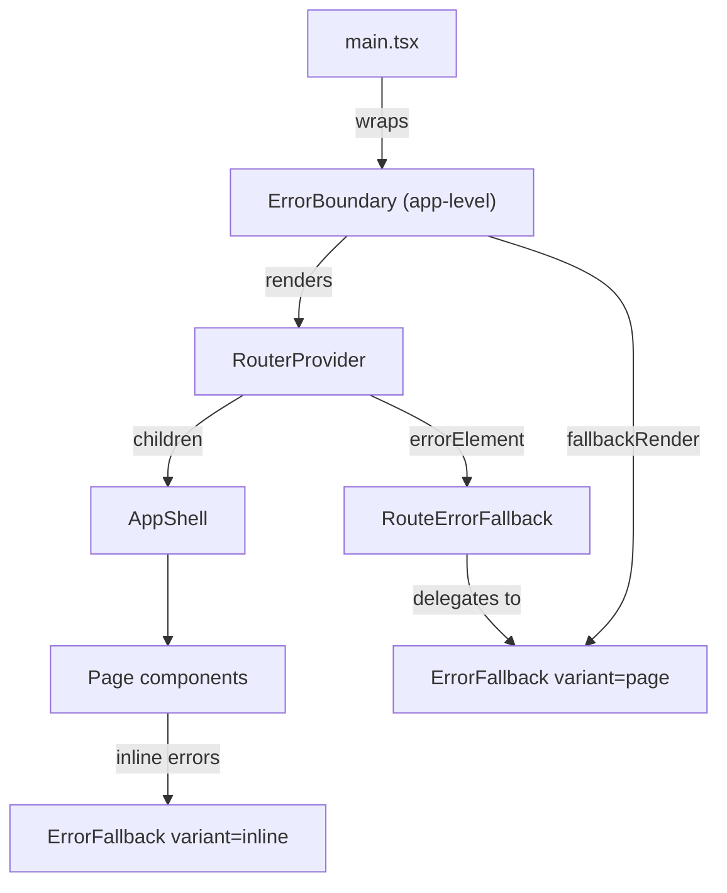

# Tech Plan — Error Boundaries & Graceful Error UI

## Architectural Approach

### Key Decisions

| Decision | Choice | Rationale |
|---|---|---|
| Boundary library | `react-error-boundary` v6 | De-facto standard; provides `ErrorBoundary`, `useErrorBoundary`, and `withErrorBoundary`. Avoids hand-rolling a class component — tiny dep (~2 KB), well-maintained, React 19 compatible. |
| Route-level errors | React Router `errorElement` on layout routes | `createBrowserRouter` natively catches render errors and loader rejections per-route. More granular than a single root boundary — a crash in `/history` doesn't tear down the header/nav. |
| App-level fallback | `ErrorBoundary` wrapping `<RouterProvider>` in `file:src/main.tsx` | Catches anything the router can't (provider errors, router init failures). Last line of defense before white screen. |
| Query mutation errors | Global `onError` default on `MutationCache` in `file:src/lib/queryClient.ts` | One place to toast mutation failures instead of wiring `onError` per call-site. Individual mutations can still override. |
| Error fallback component | Single `ErrorFallback` component, two variants: `"page"` (full-screen, used by route/app boundaries) and `"inline"` (card, used for section-level query errors) | Keeps UI consistent; the variant prop controls layout, not logic. |
| i18n | New `error` namespace (`file:src/locales/{en,fr}/error.json`) | Follows existing namespace pattern (9 namespaces today). Keeps error strings out of `common.json`. |
| Dev-mode stack trace | Rendered in a `<pre>` block when `import.meta.env.DEV` | Zero cost in prod; useful for local debugging without opening console. |
| Sentry / external logging | Out of scope | Issue says "optional"; we defer to a separate ticket. The boundary's `onError` callback is the future hook point. |

### Critical Constraints

- **React Router error serialization**: `useRouteError()` returns `unknown`. We must handle both `Error` instances and `Response` objects (from loader throws). `isRouteErrorResponse()` distinguishes the two.
- **Theme access in fallback**: The app-level boundary wraps `RouterProvider` but sits inside `ThemeProvider` and `QueryClientProvider`, so the fallback can use `useTheme()` and sonner toasts. If we ever move it outside those providers, the fallback would lose theme context — keep the provider order as-is.
- **Reset behavior**: `react-error-boundary`'s `resetKeys` prop re-renders children when keys change. For the route-level boundary, we pass `location.pathname` so navigating away from the broken route resets the boundary automatically.
- **Mobile layout**: The error fallback must not assume a fixed viewport. Use the same `min-h-screen flex flex-col items-center justify-center` pattern as `file:src/pages/LoginPage.tsx`.

---

## Data Model

No database changes. No migrations.

### i18n keys

**`file:src/locales/en/error.json`**

```json
{
  "title": "Something went wrong",
  "description": "An unexpected error occurred. You can try again or go back to the home page.",
  "retry": "Try again",
  "goHome": "Go home",
  "notFoundTitle": "Page not found",
  "notFoundDescription": "This page doesn't exist or has been moved.",
  "details": "Error details"
}
```

**`file:src/locales/fr/error.json`** — French equivalents.

---

## Component Architecture

### Layer Overview



### New Files & Responsibilities

| File | Purpose |
|---|---|
| `src/components/ErrorFallback.tsx` | Shared error UI. Props: `error`, `resetErrorBoundary`, `variant` (`"page"` / `"inline"`). Renders themed message, action buttons, dev-mode stack trace. |
| `src/components/RouteErrorFallback.tsx` | Thin wrapper calling `useRouteError()` + `isRouteErrorResponse()`, delegates rendering to `ErrorFallback`. Used as `errorElement` in router config. |
| `src/locales/en/error.json` | English error strings |
| `src/locales/fr/error.json` | French error strings |

### Modified Files

| File | Change |
|---|---|
| `file:src/main.tsx` | Wrap `<RouterProvider>` with `<ErrorBoundary>` from `react-error-boundary`, using `ErrorFallback` as `fallbackRender`. |
| `file:src/router/index.tsx` | Add `errorElement: <RouteErrorFallback />` on the root auth layout route and the public routes. |
| `file:src/lib/queryClient.ts` | Add `MutationCache` with global `onError` that calls `toast.error()`. |
| `file:src/lib/i18n.ts` | Add `"error"` to the namespace list so it's loaded. |

### Component Responsibilities

**`ErrorFallback`**
- Receives `error: Error`, optional `resetErrorBoundary: () => void`, `variant: "page" | "inline"`
- `"page"` variant: centered full-screen, large icon, title, description, "Try again" + "Go home" buttons
- `"inline"` variant: card-sized, smaller text, "Try again" button only
- Dev mode (`import.meta.env.DEV`): collapsible `<pre>` with `error.message` and `error.stack`
- Uses `useTranslation("error")` for all strings
- Uses existing `Button` from `file:src/components/ui/button.tsx`

**`RouteErrorFallback`**
- Calls `useRouteError()` to get the error object
- If `isRouteErrorResponse(error)` and status is 404 → shows not-found copy
- Otherwise → wraps in an `Error` instance and delegates to `ErrorFallback variant="page"`
- Calls `useNavigate()` for the "Go home" action

### Failure Mode Analysis

| Failure | Behavior |
|---|---|
| Render error in a page component | Router's `errorElement` catches it → `RouteErrorFallback` renders inside the existing layout |
| Render error in `AppShell` or a provider | App-level `ErrorBoundary` catches it → full-page `ErrorFallback` |
| Supabase query failure | React Query retries once (existing `retry: 1`), then `isError` state; pages that need it can show inline `ErrorFallback` |
| Mutation failure (set log, builder save, etc.) | `MutationCache.onError` fires a toast via sonner; call-site `onError` still works if defined (runs after global) |
| Error in `ErrorFallback` itself | Browser's native error — acceptable edge case; component is intentionally kept simple to minimize this risk |

---

## Implementation Notes

### `react-error-boundary` usage in `main.tsx`

```tsx
import { ErrorBoundary } from "react-error-boundary"
import { ErrorFallback } from "@/components/ErrorFallback"

<ErrorBoundary fallbackRender={({ error, resetErrorBoundary }) => (
  <ErrorFallback error={error} resetErrorBoundary={resetErrorBoundary} variant="page" />
)}>
  <RouterProvider router={router} />
</ErrorBoundary>
```

### `MutationCache` global error handler

```tsx
import { MutationCache, QueryClient } from "@tanstack/react-query"
import { toast } from "sonner"

export const queryClient = new QueryClient({
  mutationCache: new MutationCache({
    onError: (error) => {
      toast.error(error instanceof Error ? error.message : "An error occurred")
    },
  }),
  defaultOptions: {
    queries: { staleTime: 5 * 60 * 1000, retry: 1 },
  },
})
```

### Router `errorElement`

```tsx
export const router = createBrowserRouter([
  {
    path: "/login",
    element: <LoginPage />,
    errorElement: <RouteErrorFallback />,
  },
  // ...
  {
    element: <AuthGuard />,
    errorElement: <RouteErrorFallback />,
    children: [
      {
        element: <AppShell />,
        children: [/* page routes */],
      },
    ],
  },
])
```

---

## References

- GitHub Issue [#8](https://github.com/PierreTsia/workout-app/issues/8) — fix: Implement Error Boundaries + Graceful Error UI
- Epic Brief — Error Boundaries & Graceful Error UI
