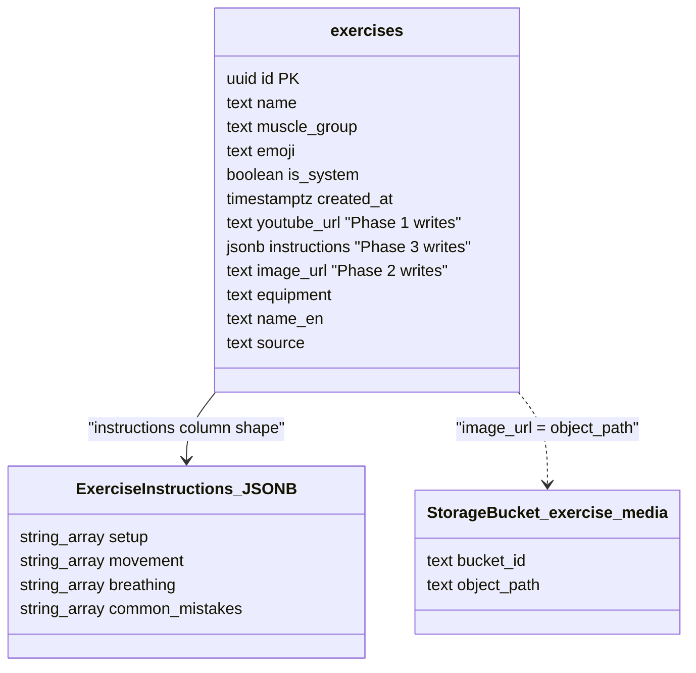
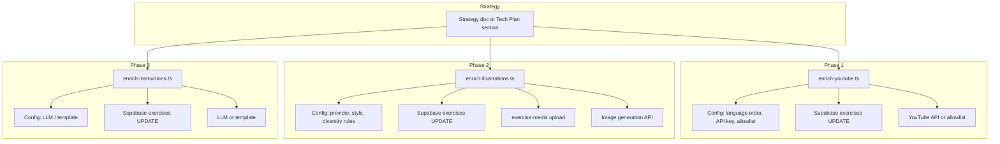

# Tech Plan — Exercise Content Enrichment

## Architectural Approach

### Key Decisions

| Decision | Choice | Rationale |
|---|---|---|
| Protection of 23 | Enrichment scripts exclude exercises whose **name** is in `EXISTING_EXERCISE_MAP` (resolve to DB IDs once at start). Never UPDATE `youtube_url`/`image_url`/`instructions` for those rows. | Same source of truth as import; avoids overwriting hand-curated content. |
| Idempotency | Phase 1: only set `youtube_url` where `IS NULL`. Phase 2: only set `image_url` where `IS NULL`. Phase 3: only set `instructions` where `IS NULL`. Re-runs are safe. | Allows incremental and re-runs without wiping existing data. |
| Phase 1 — YouTube source | **Hybrid:** Curated channel allowlist first (CSV/JSON), then YouTube Data API v3 search fallback. Configurable. | Allowlist avoids quota for known-good channels; API covers gaps; complexity accepted for robustness. |
| Phase 1 — Language | FR then EN (configurable), per T18. | Matches app and seed content. |
| Phase 2 — Image provider | **Free tier:** Replicate (e.g. FLUX/SDXL) or Hugging Face Inference — single choice for consistency. Style aligned to existing 23 (static, clear form, minimal background). Prompt + negative prompt to minimise artifacts; diversity via prompt variants. | No per-image cost; consistent with current assets; reduce artifacts via model choice and prompt design. |
| Phase 2 — Diversity | Explicit prompt constraints (gender balance, ethnic diversity, body types) + deterministic or round-robin variant selection so the illustrated set is balanced. | Meets Epic success criteria; no new DB columns. |
| Phase 2 — Reuse | Duplicate images acceptable for very close exercises (e.g. “Bench Press” variants). Optionally reuse one image per exercise family; otherwise one image per exercise. | User preference: we can live with duplicates for near-identical exercises. |
| Prioritization | **Estimated popularity** (no usage data): order by heuristic — compound movements first, common names (squat, bench, deadlift, row), then muscle group/equipment. Document ordering in strategy. | Approximates “by usage” until analytics exist; repeatable. |
| Upload target | Existing `exercise-media` bucket via Supabase client with `SUPABASE_SERVICE_ROLE_KEY`; object path = stable slug (e.g. `{exercise-id}.png` or `{slug}.png`). | Same as [Tech Plan — Exercise Demo & Instructions](Tech_Plan_—_Exercise_Demo_&_Instructions.md); [file:src/lib/storage.ts](src/lib/storage.ts) already builds URL from path. |
| Strategy doc | Single markdown (or section in Tech Plan) defining: prioritization (estimated popularity heuristic), coverage targets, quota/cost, deduplication/reuse rules, future-run policy. | Ensures repeatable, documentable process for ~600 and future imports. |
| Phase 3 — Instructions | Batch script fills `exercises.instructions` (JSONB: setup, movement, breathing, common_mistakes) for imported exercises where `instructions IS NULL`, exclude 23. French, same shape as seed. Idempotent. Generation: LLM (free tier, e.g. HF) or template. | “How to” sections for imported exercises; UI already consumes this; no schema change. |

### Critical Constraints

**No new tables or columns.** All writes go to existing `exercises.youtube_url`, `exercises.image_url`, and `exercises.instructions`. Schema and UI already support these; this epic only backfills them via batch scripts.

**Scripts are Node/TS**, run locally or in CI, following the pattern of [file:scripts/import-exercises.ts](scripts/import-exercises.ts). Env: `VITE_SUPABASE_URL`, `SUPABASE_SERVICE_ROLE_KEY`, plus API keys for YouTube (Phase 1), image provider (Phase 2), and LLM if used (Phase 3).

**Coupling.** Enrichment scripts depend on [file:scripts/exercise-mapping.ts](scripts/exercise-mapping.ts) for the 23-name exclusion list. If a curated exercise is renamed in the app, the mapping must be updated or that row could be treated as imported and overwritten on a future run. Changing ownership of “the 23” (e.g. moving to a DB flag) would require updating both import and enrichment scripts.

**Merge safety.** [file:scripts/import-lib.ts](scripts/import-lib.ts) `mergeWithExisting()` does not touch `youtube_url`/`image_url`/`instructions`. Re-running the Wger import after enrichment will not clear those fields.

**Re-enrichment.** Idempotency is “never overwrite non-null”. To re-enrich (e.g. better video or image), a future version may add a `--force` or env override; out of scope for v1.

---

## Data Model

No schema changes. Enrichment scripts only **update** existing columns on the `exercises` table.

### Table Notes

**exercises.youtube_url** — Full YouTube URL. Phase 1 script sets this for candidates where `youtube_url IS NULL` and exercise is not in the 23 (exclusion set). App and [file:src/lib/youtube.ts](src/lib/youtube.ts) already consume it for thumbnails and links.

**exercises.image_url** — Relative path in the `exercise-media` Supabase Storage bucket (e.g. `bench-press.png`). Phase 2 script uploads the file then sets this where `image_url IS NULL` and not in the 23. [file:src/lib/storage.ts](src/lib/storage.ts) builds the full public URL.

**exercises.instructions** — JSONB with keys `setup`, `movement`, `breathing`, `common_mistakes` (each string[]). Phase 3 script sets this where `instructions IS NULL` and not in the 23. French; same shape as in [file:supabase/seed.sql](supabase/seed.sql). [file:src/components/exercise/ExerciseInstructionsPanel.tsx](src/components/exercise/ExerciseInstructionsPanel.tsx) and [file:src/components/exercise/ExerciseInfoDialog.tsx](src/components/exercise/ExerciseInfoDialog.tsx) already render it.

**Exclusion set.** At script start, load `EXISTING_EXERCISE_MAP` keys (23 names) from [file:scripts/exercise-mapping.ts](scripts/exercise-mapping.ts), query `exercises` for `id` where `name IN (...)`, store as `Set<string> excludedIds`. Every UPDATE uses `.not('id', 'in', excludedIds)` (or equivalent) and only for rows where the target column is null.

---

## Component Architecture

### Layer Overview

### New Files & Responsibilities

| File | Purpose |
|---|---|
| `scripts/enrich-youtube.ts` | Batch: fetch candidate set (imported, `youtube_url IS NULL`, not in 23), for each find video (allowlist then API fallback), UPDATE `youtube_url`. Idempotent. |
| `scripts/enrich-illustrations.ts` | Batch: fetch candidate set (imported, `image_url IS NULL`, not in 23), for each generate image with diversity constraints, upload to `exercise-media`, UPDATE `image_url`. Idempotent. |
| `scripts/enrich-instructions.ts` | Batch: fetch candidate set (imported, `instructions IS NULL`, not in 23), generate instructions (LLM or template), UPDATE `instructions`. French; same JSONB shape as seed. Idempotent. |
| `scripts/enrichment-config.ts` (or inline env) | Language order, API keys, allowlist path (Phase 1); image provider, style, diversity (Phase 2); LLM/template (Phase 3). |
| Strategy section in Tech Plan or `docs/Enrichment_Strategy.md` | Prioritization (estimated popularity heuristic), coverage targets, quota/cost, deduplication/reuse, future runs. |

### Component Responsibilities

**enrich-youtube.ts**
- Resolves exclusion set from `EXISTING_EXERCISE_MAP` names; fetches exercises where `source` is set (imported), `youtube_url IS NULL`, `id` not in excluded set. Orders by prioritization heuristic (estimated popularity). For each exercise: lookup allowlist by name/name_en; if miss, call YouTube Data API v3 search (FR then EN). Writes `youtube_url` via Supabase UPDATE. Retries and batching per quota; logs failures.

**enrich-illustrations.ts**
- Resolves exclusion set; fetches candidates with `image_url IS NULL`, not in 23. Orders by same heuristic. For each: build prompt with diversity variant (round-robin or deterministic), call Replicate or Hugging Face Inference, upload buffer to `exercise-media` with stable path, UPDATE `image_url`. Optional: reuse same image for exercise family (e.g. slug derived from base name). Idempotent; retry with backoff.

**enrich-instructions.ts**
- Resolves exclusion set; fetches candidates with `instructions IS NULL`, not in 23. For each: generate JSON with setup, movement, breathing, common_mistakes (LLM free tier or template from name/muscle_group/equipment). Validate shape; UPDATE `instructions`. French. Idempotent; log failed IDs.

**enrichment-config.ts**
- Centralises or re-exports: language order, YouTube allowlist path and API key, image provider and model, style and diversity params, LLM endpoint and key if used. Scripts read via env or this module.

No new app components; [file:src/components/exercise/ExerciseInstructionsPanel.tsx](src/components/exercise/ExerciseInstructionsPanel.tsx), [file:src/components/exercise/ExerciseInfoDialog.tsx](src/components/exercise/ExerciseInfoDialog.tsx), and [file:src/components/builder/ExerciseLibraryPicker.tsx](src/components/builder/ExerciseLibraryPicker.tsx) already consume `youtube_url`, `image_url`, and `instructions`; nulls render no media or sections.

### Failure Mode Analysis

| Failure | Behavior |
|---|---|
| YouTube API quota exceeded | Script uses allowlist fallback or stops; log and resume next day or next batch. |
| Image provider rate limit / error | Retry with backoff; log failed IDs; script exits with partial progress; re-run is idempotent. |
| One of the 23 names removed from EXISTING_EXERCISE_MAP | If not in exclusion set, script could overwrite; mitigation: document that the 23-name list is the contract, or add explicit `is_system`/allowlist ID check. |
| Duplicate video chosen for different exercises | Acceptable; optional dedupe by video ID in script. |
| Generated image violates diversity | Prompt + variant selection reduce risk; optional manual review pass for a sample. |
| LLM fails or returns invalid JSON for instructions | Retry with backoff; validate shape before UPDATE; log failed IDs; re-run is idempotent. |
