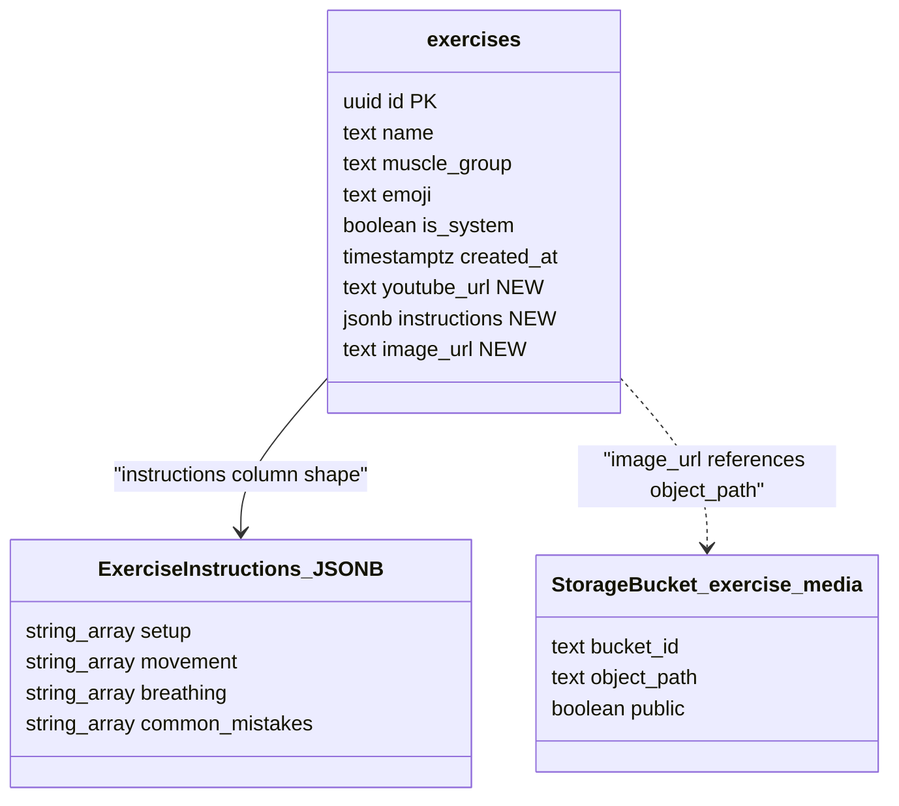
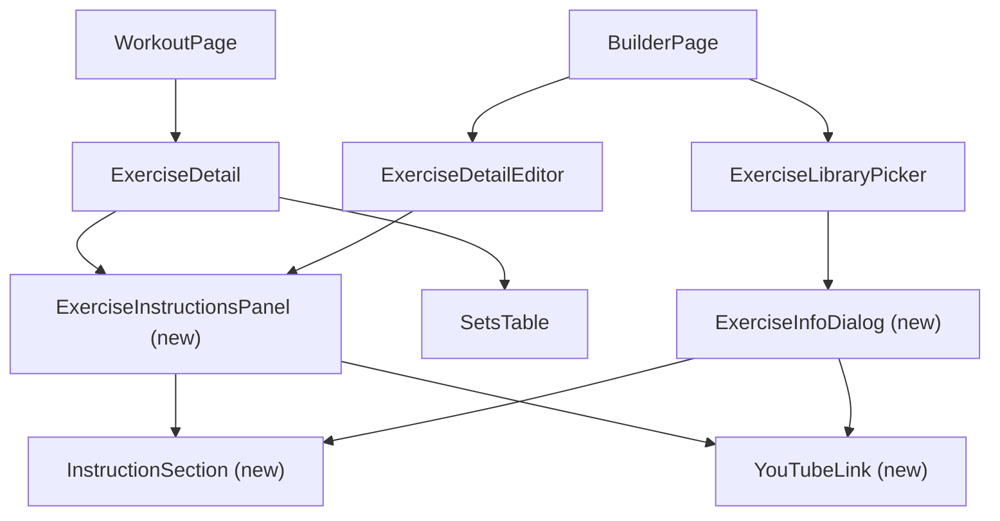

# Tech Plan — Exercise Demo & Instructions

## Architectural Approach

### Key Decisions

| Decision | Choice | Rationale |
|---|---|---|
| Data model strategy | Extend `exercises` table with 3 nullable columns (no new tables) | Exercises are the natural home for instructional content; avoids JOIN overhead and keeps queries simple |
| Instruction content source | Read from live `exercises` table, NOT snapshotted on `workout_exercises` | Instructions are reference material, not session-specific data. Updates propagate immediately to all users. |
| Exercise lookup in workout view | Reuse `useExerciseLibrary` TanStack Query cache + lookup by `exercise_id` | Library is already fetched and cached; no new Supabase query needed |
| Expandable UI primitive | Radix Collapsible (`@/components/ui/collapsible`) | Already installed, already patterned in `file:src/components/history/SessionList.tsx` — zero new dependencies |
| Collapsible position | Between header/badge and `SetsTable` | Users should see form guidance before logging sets |
| YouTube integration | Thumbnail derived from URL + external link (no iframe) | Free thumbnails via `img.youtube.com`, no API key, no embed performance hit on mobile |
| Image hosting | Supabase Storage public bucket (`exercise-media`) via SQL migration | Decoupled from app deploys, CDN-backed, updatable without redeploy. Bucket created via `storage.buckets` for version-controlled reproducibility. |
| Image URL format | Relative object path in DB (e.g. `bench-press.gif`), full URL built at runtime from `VITE_SUPABASE_URL` | Keeps seed data portable across environments |
| Image loading | Native `` | Zero-dependency, supported by all target browsers (iOS 15.4+, Android 9+) |
| Builder picker info preview | Dialog (not Popover) | Mobile-first: Dialog gives a clean full-screen experience on touch devices. Avoids focus-trap conflicts with the Command component inside the picker. |
| i18n strategy | New `exercise` namespace for UI labels; instruction content stored in DB in French | Keeps UI labels translatable while avoiding the complexity of i18n for DB content |

### Critical Constraints

**Snapshot model boundary.** `workout_exercises` snapshots name, muscle group, and emoji from the exercise library at creation time (`file:src/hooks/useBuilderMutations.ts`). This pattern is intentionally NOT extended to instructions/media — these fields are always read from the live `exercises` table. This means `ExerciseDetail` (which receives a `WorkoutExercise`) must perform a secondary lookup into the exercise library cache to render instructions.

**TanStack Query cache dependency.** The `ExerciseInstructionsPanel` component relies on `useExerciseLibrary()` data being cached. In normal app flow, the library is fetched early (via workout page or builder). If the cache is cold (deep link, first load), the instructions section renders nothing — no skeleton, no spinner. Instructions appear once the cache populates. This is acceptable because instructions are supplementary content.

**First Supabase Storage usage.** The current codebase has zero Supabase Storage usage (`file:src/lib/supabase.ts`). This epic introduces the first storage bucket. The bucket is created via SQL migration on `storage.buckets` — supported in Supabase-managed environments. If issues arise in self-hosted setups, fall back to Supabase CLI.

---

## Data Model

### Schema Changes



### Migration SQL

File: `supabase/migrations/YYYYMMDD_add_exercise_instructions.sql`

```sql
-- Add instructional content columns to exercises
ALTER TABLE exercises ADD COLUMN youtube_url text;
ALTER TABLE exercises ADD COLUMN instructions jsonb;
ALTER TABLE exercises ADD COLUMN image_url text;

-- Create Supabase Storage bucket for exercise media
INSERT INTO storage.buckets (id, name, public)
VALUES ('exercise-media', 'exercise-media', true);

-- Allow public read access to exercise media
CREATE POLICY "Public read access on exercise-media"
ON storage.objects FOR SELECT
USING (bucket_id = 'exercise-media');
```

### TypeScript Types

File: `file:src/types/database.ts`

```typescript
export interface ExerciseInstructions {
  setup: string[]
  movement: string[]
  breathing: string[]
  common_mistakes: string[]
}

export interface Exercise {
  id: string
  name: string
  muscle_group: string
  emoji: string
  is_system: boolean
  created_at: string
  youtube_url: string | null
  instructions: ExerciseInstructions | null
  image_url: string | null
}
```

### Table Notes

**`exercises.instructions`** — JSONB with four string-array keys. Arrays (not single strings) allow multi-step instructions per section (e.g., 3 setup steps). All sections are optional at the application level — the UI hides any section with no content. The JSONB column is unvalidated at the DB level; the TypeScript `ExerciseInstructions` type enforces shape at the application boundary.

**`exercises.image_url`** — Stores the relative object path within the `exercise-media` Supabase Storage bucket (e.g., `bench-press.gif`). A utility function builds the full public URL: `{VITE_SUPABASE_URL}/storage/v1/object/public/exercise-media/{image_url}`. Portable across environments.

**`exercises.youtube_url`** — Full YouTube URL. The app extracts the video ID at render time to build a thumbnail URL via `https://img.youtube.com/vi/{VIDEO_ID}/mqdefault.jpg`. Supports `youtube.com/watch?v=`, `youtu.be/`, and `youtube.com/shorts/` formats.

---

## Component Architecture

### Layer Overview



### New Files & Responsibilities

| File | Purpose |
|---|---|
| `src/components/exercise/ExerciseInstructionsPanel.tsx` | Collapsible "How to perform" section. Accepts `exerciseId`, looks up exercise from library cache via `useExerciseFromLibrary`, renders image + instruction sections + YouTube link. Reused in workout and builder detail views. |
| `src/components/exercise/InstructionSection.tsx` | Renders a single named instruction section: icon + title + bulleted list of steps. Accepts `title`, `items`, `icon`. Renders nothing if `items` is empty. |
| `src/components/exercise/YouTubeLink.tsx` | Renders YouTube thumbnail (lazy loaded) + styled external link ("Watch on YouTube"). Accepts `url`. Extracts video ID internally via `getYouTubeThumbnail`. |
| `src/components/exercise/ExerciseInfoDialog.tsx` | Dialog triggered by an info icon button in `ExerciseLibraryPicker`. Shows a compact read-only view of instructions + image + YouTube link for an exercise before adding it. Mobile-optimized full-width dialog. |
| `src/lib/youtube.ts` | `extractVideoId(url)` — parses YouTube URL formats and returns the video ID. `getYouTubeThumbnail(url)` — returns the `mqdefault.jpg` thumbnail URL. |
| `src/lib/storage.ts` | `getExerciseImageUrl(imagePath)` — builds the full public Supabase Storage URL from a relative path. |
| `src/hooks/useExerciseFromLibrary.ts` | `useExerciseFromLibrary(exerciseId)` — wraps `useExerciseLibrary()` and returns the matching `Exercise` by ID. Cache lookup only, no additional Supabase call. |
| `supabase/migrations/YYYYMMDD_add_exercise_instructions.sql` | ALTER TABLE + storage bucket creation + public read policy. |
| `src/locales/en/exercise.json` | i18n keys: `howToPerform`, `setup`, `movement`, `breathing`, `commonMistakes`, `watchOnYouTube`. |
| `src/locales/fr/exercise.json` | French translations of the above. |

### Component Responsibilities

**`ExerciseInstructionsPanel`**
- Accepts `exerciseId: string` prop
- Calls `useExerciseFromLibrary(exerciseId)` to get the full `Exercise` record from TanStack Query cache
- If exercise has no instructions AND no image AND no youtube_url → renders nothing (graceful absence)
- Otherwise renders a `Collapsible` with:
  - **Trigger:** text label (i18n `exercise:howToPerform`) + `ChevronDown` icon with `rotate-180` transition on open (same pattern as `SessionRow` in `file:src/components/history/SessionList.tsx`)
  - **Content:** exercise image (if `image_url`, via `getExerciseImageUrl`), up to four `InstructionSection` blocks (if `instructions`), `YouTubeLink` (if `youtube_url`)
- Local `useState<boolean>` for open/closed state

**`InstructionSection`**
- Pure presentational component
- Accepts `icon: LucideIcon`, `title: string`, `items: string[]`
- Renders: icon + bold title on one line, then `<ul>` with each item as an `<li>`
- If `items` is empty or undefined → renders nothing
- Suggested icons: `Settings2` (setup), `Activity` (movement), `Wind` (breathing), `AlertTriangle` (common mistakes)

**`YouTubeLink`**
- Accepts `url: string`
- Calls `getYouTubeThumbnail(url)` to derive thumbnail URL
- If video ID extraction fails → renders nothing
- Otherwise renders: `<a>` wrapping a thumbnail `` (lazy loaded, rounded-lg, aspect-video, relative positioned) with a semi-transparent play circle overlay, plus text "Watch on YouTube" with `ExternalLink` icon below
- Link opens in new tab (`target="_blank" rel="noopener noreferrer"`)

**`ExerciseInfoDialog`**
- Accepts `exercise: Exercise`
- Renders a `Dialog` with trigger: `Info` icon button (`e.stopPropagation()` to prevent `CommandItem.onSelect`)
- Dialog content: exercise emoji + name as title, then image (if any), instruction sections (compact, no collapsible), YouTube link (if any)
- Close button in dialog header

**`useExerciseFromLibrary`**
- Calls `useExerciseLibrary()` (TanStack Query, key: `["exercise-library"]`)
- Returns `{ data: exercises?.find(e => e.id === exerciseId), isLoading }`
- No additional Supabase call — purely a cache lookup with stable reference

### Integration Changes to Existing Files

**`file:src/components/workout/ExerciseDetail.tsx`**
- Import `ExerciseInstructionsPanel`
- Add `<ExerciseInstructionsPanel exerciseId={exercise.exercise_id} />` between the `lastSession` paragraph and `<SetsTable />`

**`file:src/components/builder/ExerciseDetailEditor.tsx`**
- Import `ExerciseInstructionsPanel`
- Add `<ExerciseInstructionsPanel exerciseId={exercise.exercise_id} />` between the header div and the form grid div
- `exercise` is a `WorkoutExercise` which has `exercise_id`

**`file:src/components/builder/ExerciseLibraryPicker.tsx`**
- Import `ExerciseInfoDialog`
- In each `CommandItem`, add `<ExerciseInfoDialog exercise={ex} />` next to the exercise name
- Layout: `flex items-center justify-between` in the `CommandItem`, with emoji + name on the left and info button on the right

**`file:src/types/database.ts`**
- Add `ExerciseInstructions` interface
- Add `youtube_url`, `instructions`, `image_url` to `Exercise` interface

**`file:src/lib/i18n.ts`**
- Add `exercise` to the `ns` array
- Add resource imports for `en/exercise.json` and `fr/exercise.json`

**`file:supabase/seed.sql`**
- Update existing `INSERT INTO exercises` to include `youtube_url`, `instructions`, `image_url` columns for all 24 exercises

### Failure Mode Analysis

| Failure | Behavior |
|---|---|
| Exercise library cache is cold (deep link, first load) | `useExerciseFromLibrary` returns `undefined`; `ExerciseInstructionsPanel` renders nothing. Instructions appear once cache populates via background refetch. |
| YouTube URL is malformed or unsupported format | `extractVideoId` returns `null`; `YouTubeLink` renders nothing. No broken image, no error. |
| YouTube video has been deleted | Thumbnail still loads (YouTube serves a generic placeholder); external link leads to YouTube's "Video unavailable" page. Acceptable degradation. |
| Supabase Storage image fails to load (404, network error) | `` `onError` handler sets local state to hide the image element. Instruction text and YouTube link remain visible. |
| `instructions` JSONB has missing keys or unexpected shape | `InstructionSection` only renders if the specific array has items. Unknown keys are silently ignored. Partial instructions display correctly. |
| User has slow connection (gym wifi) | Images use `loading="lazy"` — they load only when the collapsible is opened and scrolled into view. YouTube thumbnail is ~15KB. No auto-play, no iframe, no video preload. |
| Supabase Storage bucket doesn't exist (migration not run) | `image_url` resolves to a 404. `onError` handler hides the image. Text instructions and YouTube link still work. |
| `stopPropagation` on info icon fails in CommandItem | Exercise gets selected when user tries to view info. Mitigation: test on real devices; fallback is to use `onPointerDown` instead of `onClick` for the stop. |
