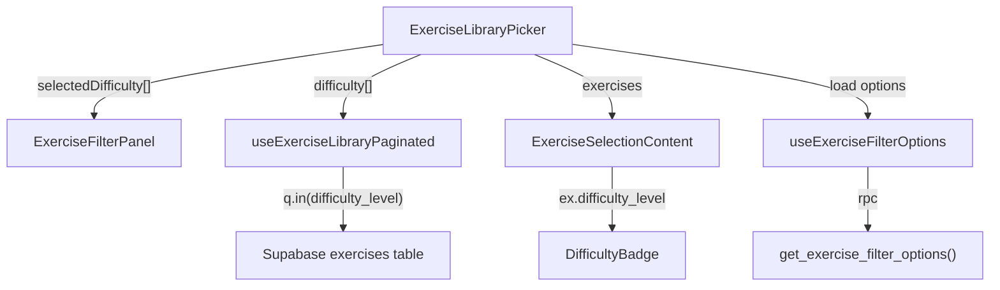

# Tech Plan — Exercise Difficulty Levels

## Architectural Approach

### Key Decisions

| Decision | Choice | Rationale |
|---|---|---|
| Column type | `text` nullable + CHECK (`'beginner'`, `'intermediate'`, `'advanced'`) | Consistent with `equipment` pattern; no Postgres enum migration pain if a 4th tier is ever needed. |
| LLM provider | Groq via raw `fetch`, configurable model via `ENRICHMENT_DIFFICULTY_MODEL` env var, default `llama-3.1-8b-instant` | 8b is fast/cheap for a 3-way classification. Override to 70b if quality disappoints. Same `fetch` pattern as `file:scripts/enrich-instructions.ts`. |
| Prompt language | English | LLMs reason more reliably in English. `name_en` used when available; French `name` as fallback. Output is a JSON enum value. |
| Throttle strategy | Adaptive backoff — no delay by default; on HTTP 429, read `Retry-After` header (fallback 10s), sleep, resume | Avoids unnecessary slowness while respecting rate limits. |
| Badge component | Existing `Badge` from `file:src/components/ui/badge.tsx` with `className` color overrides | Already used for color-coded labels in admin views and session lists. |
| Badge placement | Inside the `min-w-0 flex-1` container, after the `truncate` name span, with `shrink-0` | Badge is always visible; the name truncates to accommodate it. Keeps badge in the left section with the exercise identity. |
| Migration scope | Single migration: column + `CREATE OR REPLACE FUNCTION get_exercise_filter_options()` | Atomic — the RPC must return `difficulty_levels` the moment the column exists. |
| Audit output | CSV written to `scripts/data/difficulty-audit.csv` at script end | Follows `file:scripts/export-exercises-csv.ts` pattern. Reviewed locally, not committed. |
| No exclusion set | Script classifies all exercises including the 23 hand-curated ones | Difficulty is new data, not an override. `getExcludedExerciseIds()` is not used. |

### Critical Constraints

- **Mobile row space**: `file:src/components/builder/ExerciseSelectionContent.tsx` renders: checkbox + thumbnail + name + info button + feedback button. The difficulty badge sits after the name with `text-[10px] h-5 px-1.5` sizing (matches existing badge usage in `SessionList` and `ExerciseChart`). The name truncates sooner on narrow screens — acceptable, already truncated today.
- **NULL in filtered results**: When a user activates the difficulty filter, exercises with `NULL` difficulty are excluded by Supabase's `.in()` operator. Intentional per Epic Brief. The filter panel only shows levels that have at least one exercise (RPC uses `WHERE difficulty_level IS NOT NULL`).
- **RPC is `SECURITY DEFINER`**: The existing `get_exercise_filter_options()` runs as definer. `CREATE OR REPLACE` preserves the security context.
- **Active filter count**: `file:src/components/builder/ExerciseLibraryPicker.tsx` computes `activeFilterCount` as `(selectedMuscleGroup ? 1 : 0) + selectedEquipment.length`. Must add `selectedDifficulty.length`.
- **Lowercase enforcement**: The CHECK constraint uses lowercase. The script must `.toLowerCase()` the LLM output before validation and DB update.

---

## Data Model

### Migration: `add_exercise_difficulty_level`

```sql
ALTER TABLE exercises
ADD COLUMN difficulty_level text
CONSTRAINT exercises_difficulty_level_check
CHECK (difficulty_level IN ('beginner', 'intermediate', 'advanced'));

CREATE OR REPLACE FUNCTION get_exercise_filter_options()
RETURNS json
LANGUAGE sql
STABLE
SECURITY DEFINER
SET search_path = public
AS $$
  SELECT json_build_object(
    'muscle_groups', (SELECT coalesce(json_agg(muscle_group ORDER BY muscle_group), '[]')
                      FROM (SELECT DISTINCT muscle_group FROM exercises ORDER BY muscle_group) x),
    'equipment',     (SELECT coalesce(json_agg(equipment ORDER BY equipment), '[]')
                      FROM (SELECT DISTINCT equipment FROM exercises ORDER BY equipment) x),
    'difficulty_levels', (SELECT coalesce(json_agg(difficulty_level ORDER BY difficulty_level), '[]')
                          FROM (SELECT DISTINCT difficulty_level FROM exercises
                                WHERE difficulty_level IS NOT NULL
                                ORDER BY difficulty_level) x)
  );
$$;
```

### TypeScript types

**`file:src/types/database.ts`** — add to `Exercise`:

```typescript
difficulty_level: 'beginner' | 'intermediate' | 'advanced' | null
```

**`file:src/hooks/useExerciseFilterOptions.ts`** — add to `ExerciseFilterOptions`:

```typescript
difficulty_levels: string[]
```

---

## Component Architecture

### Layer Overview



### Modified Files

| File | Change |
|---|---|
| `supabase/migrations/YYYYMMDDHHMMSS_add_exercise_difficulty_level.sql` | New migration: column + RPC update |
| `src/types/database.ts` | Add `difficulty_level` to `Exercise` |
| `src/hooks/useExerciseFilterOptions.ts` | Add `difficulty_levels` to `ExerciseFilterOptions` |
| `src/hooks/useExerciseLibraryPaginated.ts` | Accept `difficulty: string[]` param, add `.in("difficulty_level", difficulty)` when non-empty |
| `src/components/builder/ExerciseLibraryPicker.tsx` | Add `selectedDifficulty` state, pass to filter panel and hook, include in `activeFilterCount`, reset on close |
| `src/components/builder/ExerciseFilterPanel.tsx` | Add difficulty pills section (multi-select, clone equipment toggle pattern) |
| `src/components/builder/ExerciseSelectionContent.tsx` | Render difficulty badge inline after exercise name |
| `src/components/builder/ExerciseLibraryPicker.test.tsx` | Update filter tests to account for difficulty state and filter count |
| `scripts/enrich-difficulty.ts` | New enrichment script |
| `package.json` | Add `"enrich-difficulty": "tsx scripts/enrich-difficulty.ts"` to scripts |
| `src/locales/en/builder.json` | Difficulty keys: `difficulty.beginner`, `difficulty.intermediate`, `difficulty.advanced`, `difficulty_label` (section title) |
| `src/locales/fr/builder.json` | Difficulty keys: `difficulty.beginner` = "Débutant", `difficulty.intermediate` = "Intermédiaire", `difficulty.advanced` = "Avancé", `difficulty_label` = "Difficulté" |

### Component Responsibilities

**`ExerciseFilterPanel`** (modified)
- Receives `difficultyLevels: string[]`, `selectedDifficulty: string[]`, and `onDifficultyChange: (v: string[]) => void`
- Defines a `DIFFICULTY_ORDER` constant (`['beginner', 'intermediate', 'advanced']`) and sorts the incoming `difficultyLevels` by this order before rendering pills — the RPC returns alphabetical (`advanced, beginner, intermediate`) but pills must display in logical progression
- Renders a third pill row labeled `t("difficulty_label")` with pills using `t(`difficulty.${level}`, level)` for display labels
- Toggle logic identical to `toggleEquipment`: add/remove from array

**`useExerciseLibraryPaginated`** (modified)
- Accepts new `difficulty: string[]` parameter
- Query building: `if (difficulty.length > 0) q = q.in("difficulty_level", difficulty)`
- Query key: `["exercise-library-paginated", search, muscleGroup, equipment, difficulty]`

**`ExerciseSelectionContent`** (modified)
- For each exercise, renders a compact `Badge` **inside** the `span.flex.min-w-0.flex-1` container, immediately after the `span.truncate` name element — the badge has `shrink-0` so it never truncates; the name's `truncate` class absorbs overflow, keeping the badge always visible
- Badge color map: `beginner` = `bg-green-600`, `intermediate` = `bg-yellow-500 text-black`, `advanced` = `bg-red-600`
- Badge size: `text-[10px] h-5 px-1.5 shrink-0`
- Only rendered when `ex.difficulty_level` is non-null

**`scripts/enrich-difficulty.ts`** (new)
- **Env**: `GROQ_API_KEY`, `VITE_SUPABASE_URL`, `SUPABASE_SERVICE_ROLE_KEY`, `ENRICHMENT_DIFFICULTY_MODEL` (default `llama-3.1-8b-instant`)
- **Flags**: `--force` (overwrite existing classifications), `--dry-run` (classify + write audit CSV, no DB writes)
- **Candidates**: fetches exercises where `difficulty_level IS NULL` (or all if `--force`)
- **Per exercise**: calls Groq, parses JSON, validates value is one of 3 levels (lowercased), updates DB (unless `--dry-run`)
- **Audit**: collects `{ name, difficulty_level, reasoning }` for every processed exercise; writes `scripts/data/difficulty-audit.csv` at script end
- **Rate limit**: on HTTP 429, reads `Retry-After` header (fallback 10s), sleeps, retries same exercise
- **General errors**: 3 retries with exponential backoff (2s, 4s, 6s)
- **Summary**: prints classified count, skipped count, failed IDs

**LLM prompt design:**

System:
```
You are an expert strength & conditioning coach. Classify exercise difficulty as exactly one of: beginner, intermediate, advanced.

Tier definitions:
- beginner: Suitable for someone with < 6 months training. Easy to learn, low strength/mobility demands, safe even with imperfect form. Examples: push-up, bodyweight squat, machine leg press.
- intermediate: Suitable for someone with 6 months – 2 years training. Moderate form complexity, requires a solid strength base, some mobility demands. Examples: barbell bench press, weighted pull-up, Romanian deadlift.
- advanced: Suitable for someone with 2+ years training. High form complexity, significant strength and mobility requirements, injury risk if form breaks down. Examples: muscle-up, snatch, handstand push-up.

Classification criteria:
- Form complexity: How hard is the movement to learn and execute safely?
- Strength requirement: How much baseline strength is needed?
- Mobility demands: What range of motion / flexibility is required?

Rules:
- Respond ONLY with valid JSON, no surrounding text.
- Output exactly: {"difficulty_level": "...", "reasoning": "..."}
- "difficulty_level" must be lowercase: "beginner", "intermediate", or "advanced".
- "reasoning" is 1 sentence explaining your classification.
- Consider the specific equipment variant (e.g., barbell squat is harder than bodyweight squat).
```

User (instructions included when available, omitted when NULL):
```
Exercise: {name_en || name}
Muscle group: {muscle_group}
Equipment: {equipment}
Instructions:
- Setup: {instructions.setup.join("; ")}
- Movement: {instructions.movement.join("; ")}
```

Only `setup` and `movement` arrays are included — `breathing` and `common_mistakes` don't signal difficulty and would bloat token usage across 600 calls. When `instructions` is NULL, the "Instructions" block is omitted entirely.

### Failure Mode Analysis

| Failure | Behavior |
|---|---|
| Groq returns invalid JSON | `parseJsonResponse` returns null; exercise skipped, logged as warning, counted in summary |
| Groq returns a value outside the 3 levels | Validation rejects it; exercise skipped, logged |
| Groq returns mixed case (e.g., `"Beginner"`) | Lowercased before validation; accepted |
| HTTP 429 rate limit | Read `Retry-After` header, sleep that duration (fallback 10s), retry same exercise |
| Groq API down | 3 retries with backoff; after 3 failures, skip exercise, continue to next |
| `difficulty_level` CHECK violation on UPDATE | Supabase returns error; logged, exercise added to `failedIds` |
| All exercises already classified (no candidates) | Script prints "nothing to do" and exits cleanly |
| User filters by difficulty when 0 exercises are classified | RPC returns empty `difficulty_levels` array; no pills rendered in filter panel — invisible, not broken |
| `--dry-run` flag | Classifications computed and written to audit CSV but no Supabase updates; safe for review |

---

## Implementation Order

1. Migration (column + RPC)
2. TypeScript types (`Exercise`, `ExerciseFilterOptions`)
3. `useExerciseLibraryPaginated` — accept `difficulty` param
4. `useExerciseFilterOptions` — parse `difficulty_levels`
5. `ExerciseFilterPanel` — difficulty pills
6. `ExerciseLibraryPicker` — state + wiring + `activeFilterCount`
7. `ExerciseSelectionContent` — difficulty badge
8. i18n strings (`builder` namespace, EN + FR)
9. Update tests (`ExerciseLibraryPicker.test.tsx` — filter state, active filter count, difficulty wiring)
10. `scripts/enrich-difficulty.ts` — enrichment script + `package.json` script entry
11. Run script, review audit CSV, spot-check top 50

---

## References

- Epic Brief: `file:docs/Epic_Brief_—_Exercise_Difficulty_Levels.md`
- Enrichment pattern: `file:scripts/enrich-instructions.ts`
- Filter pattern: `file:src/components/builder/ExerciseFilterPanel.tsx`
- Badge pattern: `file:src/components/ui/badge.tsx`
