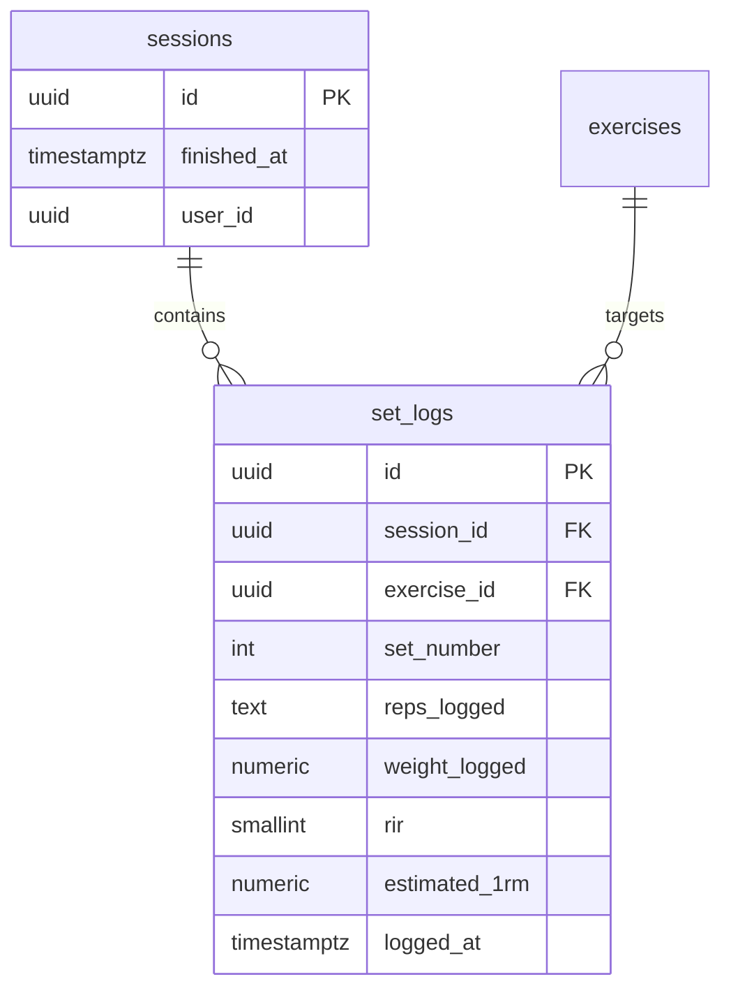
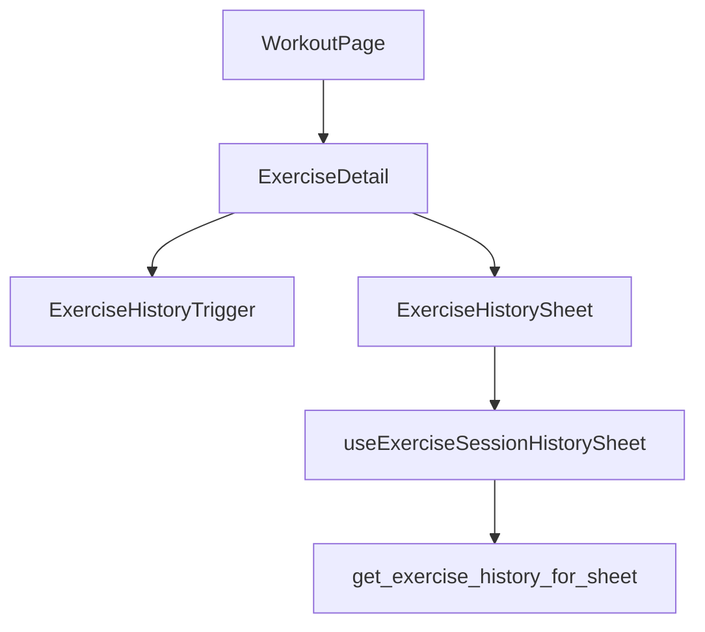

# Tech Plan — Exercise History Quick-View

## Architectural Approach

### Key Decisions

| Decision | Choice | Rationale |
|---|---|---|
| History fetch trigger | `enabled: open && exerciseId && online` on a dedicated TanStack Query hook | Satisfies **lazy load on open** (#76). Avoids coupling to `useExerciseTrend` / `useBest1RM`, which fetch eagerly or unbounded. |
| Session-bounded query | Postgres **RPC** (or one migration-backed `SECURITY DEFINER` function) returning the last *N* **finished** sessions with nested set rows | PostgREST ordering/limiting by `sessions.finished_at` while returning grouped `set_logs` is awkward and easy to get wrong; one round-trip guarantees `ORDER BY sessions.finished_at DESC LIMIT 5` at **session grain**. |
| Sheet primitive | `file:src/components/ui/sheet.tsx` (Radix dialog pattern already in repo) | Matches “lightweight sheet” requirement; same stack as other overlays. |
| RIR color mapping | Extract shared helper from `file:src/components/workout/RirDrawer.tsx` (`RIR_COLORS`) into e.g. `file:src/lib/rirStyles.ts` consumed by RirDrawer + history badges | Single source of truth; matches competitor yellow/orange/red ladder already used at log time. |
| Trend visualization | Inline **SVG sparkline** or **recharts** line (`file:package.json` already includes `recharts`) — default to **SVG** unless the team wants parity with the competitor chart faster | Five session points do not require heavy chart config; recharts is available if timeline polish wins. |
| Relative dates | `Intl.RelativeTimeFormat` + `date-fns` if already used; else native `RTF` with EN/FR locale from i18n | Consistent with “3 days ago” / “il y a 3 jours” requirement. |
| Edit / delete of past logs | **Online-only** direct `supabase.from('set_logs').update` / `.delete` + query invalidation | `file:src/lib/syncService.ts` today **inserts** set_logs via queue; there is **no** queued update/delete path. Extending the offline queue for corrections is a separate epic-sized concern. |
| Delete confirmation | `AlertDialog` (shadcn pattern) before `.delete()` | Hard requirement from #76. |
| Naming | New hook e.g. `useExerciseSessionHistorySheet` | Avoid collision with `file:src/hooks/useExerciseHistory.ts` (distinct exercises list, not session history). |

### Critical Constraints

**RLS.** `set_logs` policies already scope by `session_id` → `sessions.user_id` (`file:supabase/migrations/20240101000005_create_set_logs.sql`). RPC must run as **invoker** (default) so `auth.uid()` applies, or explicitly set `search_path` and validate `user_id` inside the function — prefer **invoker** + join to `sessions` with `user_id = auth.uid()`.

**Lazy loading.** Do not mount the history query in `file:src/components/workout/ExerciseDetail.tsx` at render time. Pass `open` from parent state or use a hook that takes `open: boolean` and sets `enabled: open`.

**Offline.** Use `file:src/hooks/useOnlineStatus.ts`. When `!isOnline`, **do not** fire the RPC; show copy from i18n (“History unavailable” / equivalent). Optionally still allow opening the sheet to show that state (better than a dead button).

**Current session vs history.** The sheet shows **completed** sessions only (`sessions.finished_at IS NOT NULL`). Sets from the **active** in-progress session are visible in `SetsTable`; excluding unfinished sessions avoids duplicate/partial rows in “history.”

**E1RM / records / range (north star).** Phase 2 can add a second lazy query or compute client-side from the same RPC payload. “Current E1RM” should be defined as e.g. max estimated 1RM across **last 5 sessions’** set logs only — product call documented in a ticket.

**RPC security.** Prefer **`SECURITY INVOKER`** (default) so RLS applies through the `sessions` / `set_logs` join. Avoid `SECURITY DEFINER` unless unavoidable; if used, harden with explicit `auth.uid()` checks, fixed `search_path`, and no broad `GRANT` on underlying tables.

**Cache invalidation after mutations.** On successful `update` / `delete` of a `set_log`, invalidate at minimum:

- `["exercise-session-history", exerciseId]`
- `["last-session", exerciseId]` (used by [`file:src/hooks/useLastSession.ts`](src/hooks/useLastSession.ts))
- `["best-1rm", exerciseId]` ([`file:src/hooks/useBest1RM.ts`](src/hooks/useBest1RM.ts))
- `["pr-aggregates"]` ([`file:src/hooks/useStatsAggregates.ts`](src/hooks/useStatsAggregates.ts) — global set/PR counts from `set_logs`)
- Audit other `queryKey` usages touching `set_logs` (e.g. history tabs, cycle stats) and invalidate where edits could change displayed totals.

**Focus and modality.** Sheet uses Radix Dialog primitives — ensure **focus trap** and **restore focus** on close so the user returns to the History control without losing carousel position.

---

## Data Model

No new tables. Optional **one migration** adding an RPC (recommended shape below).

### RPC contract (illustrative)

- **Name:** e.g. `get_exercise_history_for_sheet(p_exercise_id uuid, p_session_limit int default 5)`
- **Returns:** JSON array of session objects: `{ session_id, finished_at, sets: [{ id, set_number, reps_logged, weight_logged, rir, estimated_1rm }] }` ordered by `finished_at DESC`, length ≤ `p_session_limit`.
- **Filter:** `sessions.user_id = auth.uid()`, `sessions.finished_at IS NOT NULL`, `set_logs.exercise_id = p_exercise_id`.
- **Sets order:** within each session, `set_number ASC`.

### Table notes

- **Why RPC:** Guarantees the #76 constraint (“order by sessions.finished_at DESC limit 5”) without over-fetching all logs for an exercise on the client.
- **Edit/delete:** Mutations target `set_logs.id` by primary key; after success, invalidate `["exercise-session-history", exerciseId]` (and any stats queries if needed).

---

## Component Architecture

### Layer overview

### New files and responsibilities

| File | Purpose |
|---|---|
| `file:src/hooks/useExerciseSessionHistorySheet.ts` | TanStack Query: calls RPC when sheet `open` + online; maps errors; query key includes `exerciseId`. |
| `file:src/components/workout/ExerciseHistorySheet.tsx` | Sheet layout: header, trend strip, horizontal scroll of session cards, empty/offline/error states. |
| `file:src/components/workout/ExerciseHistorySessionCard.tsx` | One session’s date (relative) + mini set table + per-row `DropdownMenu` (Edit/Delete). |
| `file:src/lib/rirStyles.ts` | `rirBadgeClass(rir: number \| null)` derived from existing `RIR_COLORS` semantics. |
| `file:supabase/migrations/YYYYMMDDHHMMSS_exercise_history_sheet_rpc.sql` | RPC + `GRANT EXECUTE` to `authenticated`. |

Refactors:

| File | Change |
|---|---|
| `file:src/components/workout/RirDrawer.tsx` | Import RIR class map from `file:src/lib/rirStyles.ts` (remove duplicated constant). |
| `file:src/components/workout/ExerciseDetail.tsx` | Local state `historyOpen`; render trigger + `ExerciseHistorySheet` with `exercise`, `sessionId` props as needed. |

### Component responsibilities

**`ExerciseHistorySheet`**

- Accepts `open`, `onOpenChange`, `exerciseId`, display snapshots (name, thumb, muscle, equipment).
- If offline → static message, no query.
- If online and open → run hook; skeleton while loading.
- Renders trend from session-level summary points (e.g. max weight or top set per session — pick one rule and document in code comment) **only when** `sessionCount >= 2` and at least two trend points are numeric; otherwise follow **Insufficient data** below.
- Horizontal scroll region for session cards.

**`ExerciseHistorySessionCard`**

- Renders relative date for `finished_at`.
- Table columns: set #, reps, weight (via `useWeightUnit`), RIR badge.
- Edit: small form dialog or inline controlled inputs → `update` set_log.
- Delete: `AlertDialog` → `delete` → `onSuccess` invalidate.

**`useExerciseSessionHistorySheet`**

- `enabled: Boolean(open && !!exerciseId && isOnline && !!user)`.
- Stale time short (e.g. 0–30s) so edits reflect quickly after invalidation.

### Failure mode analysis

| Failure | Behavior |
|---|---|
| User offline | Sheet shows “History unavailable”; no Supabase call. |
| RPC error / timeout | Toast or inline error in sheet with retry. |
| Empty history | Friendly empty state (“No prior performance”). |
| **One session only** | Render session card(s); **omit** sparkline/chart **or** show non-chart hint copy (same strings as Epic Brief). |
| **Trend points < 2** (e.g. null weights) | Same as one-session: no misleading line; optional hint. |
| **North-star metrics unavailable** | Tiles show “—”, hidden section, or “Not enough data” — implement consistently with Epic Brief. |
| Delete rejected (RLS) | Toast error; keep row. |
| Edit while session still syncing | Prefer disabling edit for rows not yet readable; if indistinguishable, show generic error (rare if only **finished** sessions). |
| Auth expired mid-sheet | Mutation fails; show re-auth or “try again” messaging; do not leave UI implying success. |
| User opens history, then finishes **another** session elsewhere (other tab / device) | Stale data until refetch — acceptable if stale time is low; optional `refetchOnWindowFocus` for the sheet query. |
| `navigator.onLine` true but network broken (“lie-fi”) | Request fails → same path as RPC error, not empty state. |
| Delete last set of an exercise in a session | Allowed if RLS permits; session row may still exist with other exercises — no orphan-session cleanup required in this epic. |
| Very long rep strings (`reps_logged` is text) | Layout: truncate or wrap in session card; validation on edit can mirror `SetsTable` rules. |

---

## Insufficient data (implementation)

Aligns with **Insufficient data policy** in the Epic Brief.

| Condition | Implementation |
|---|---|
| `sessions.length === 0` after successful RPC | Empty state component; `aria-live` polite on message if desired. |
| `sessions.length === 1` | `showTrend = false`; optional `InsufficientTrendHint` below header. |
| `sessions.length >= 2` but trend derivation yields < 2 usable y-values | Treat as `showTrend = false` (same hint as single session). |
| Partial session list (< 5) | Normal layout; carousel width adapts; no empty placeholder cards. |

**Trend derivation (recommended default):** one scalar per session = **max** `weight_logged` (kg) among sets in that session for the exercise (simple, matches “heavy set” intuition). If all weights are null/0, fall back to insufficient-data treatment.

---

## Gaps explicitly covered (implementation checklist)

| Angle | Resolution |
|---|---|
| **Exercise identity** | History is keyed by **`exercise_id`**; swapping the exercise in the builder changes the active exercise — history sheet always reflects the **current** exercise’s id. |
| **Quick workout vs program** | No special case if both write to `sessions` + `set_logs`; RPC filters by `user_id` + `exercise_id` only. |
| **Dumbbell / bodyweight labels** | Reuse `SetsTable` weight column semantics (equipment prop from library) when rendering history weights so “per arm” / “added weight” matches live logging. |
| **Read-only workout mode** | When `isReadOnly` on `ExerciseDetail`, either hide the History CTA or open sheet **without** Edit/Delete (mirror epic “Risks” table — pick one before merge). |
| **Horizontal scroll a11y** | Use a labeled region (`aria-label` on scroll container); ensure session cards are not keyboard traps; document manual test step. |

---

## Testing strategy

### Unit tests (Vitest)

| Target | What to prove |
|---|---|
| `file:src/lib/rirStyles.ts` (or equivalent) | Stable class mapping per RIR 0–4; null/undefined → neutral fallback. |
| Relative date helper | EN and FR locales produce expected phrases for fixed `now` vs `finished_at` (use `vi.setSystemTime`); boundary: seconds, days, weeks. |
| Trend point derivation | Given mocked RPC payload, series order matches **oldest → newest** or **newest → oldest** consistently with chart axis (document one convention in code). |
| Hook `useExerciseSessionHistorySheet` | `enabled` is false when `open` false, when `exerciseId` missing, when offline, when unauthenticated; becomes true only when all gates pass. Mock `supabase.rpc` success/error. |

### Component tests (React Testing Library)

| Flow | Assertions |
|---|---|
| Open sheet | RPC called **once** on first open for a given exercise (spy on `rpc`). |
| Offline | Opening sheet does **not** call RPC; user sees unavailable copy. |
| Empty | Zero sessions → empty state string; no chart crash. |
| Sparse | One session → chart/trend region absent or hint only; two sessions → chart renders. |
| Delete | Choosing Delete opens confirm dialog; confirm calls `delete` and on success row disappears (mock mutation). **Cancel** leaves row and does not call delete. |
| Edit | Save triggers `update` with expected payload; validation errors surfaced (if any). |

### Data / SQL tests

| Target | What to prove |
|---|---|
| Migration defining RPC | **Explain** or integration test against local Supabase (if project uses it in CI): seeded users A and B — user A never sees user B’s sessions; `finished_at IS NULL` sessions excluded; limit 5; order `finished_at DESC`; sets ordered by `set_number`. |
| RLS | Existing policies on `set_logs` remain sufficient for direct `update`/`delete` from the client for own rows; add a negative test if the suite supports second-user fixtures. |

### End-to-end (Playwright)

Optional but high value for regression:

- Active workout → tap History → sheet visible → URL unchanged.
- Toggle offline (if harness supports `context.setOffline`) → unavailable message.
- Happy path with seeded account: sheet lists prior sessions (requires stable seed or test user).

### Manual / exploratory

- **Locales:** FR and EN for all new strings; long French strings do not break button row layout.
- **Weight unit:** Switch kg/lb in settings; history sheet matches `SetsTable` display.
- **a11y:** VoiceOver / TalkBack: History button, sheet title, close, first focus order; horizontal scroll announced sensibly.
- **Visual:** Safe-area insets on notched devices; sheet height ~50–90% screen per design.

### Definition of Done (testing)

- No new `eslint-disable` for hooks in production paths without justification.
- Critical paths above covered by automated tests **or** explicitly listed as “manual only” with owner sign-off in the PR.

---

## References

- Epic Brief: `file:docs/Epic_Brief_—_Exercise_History_Quick-View.md`
- Issue: https://github.com/PierreTsia/workout-app/issues/76
